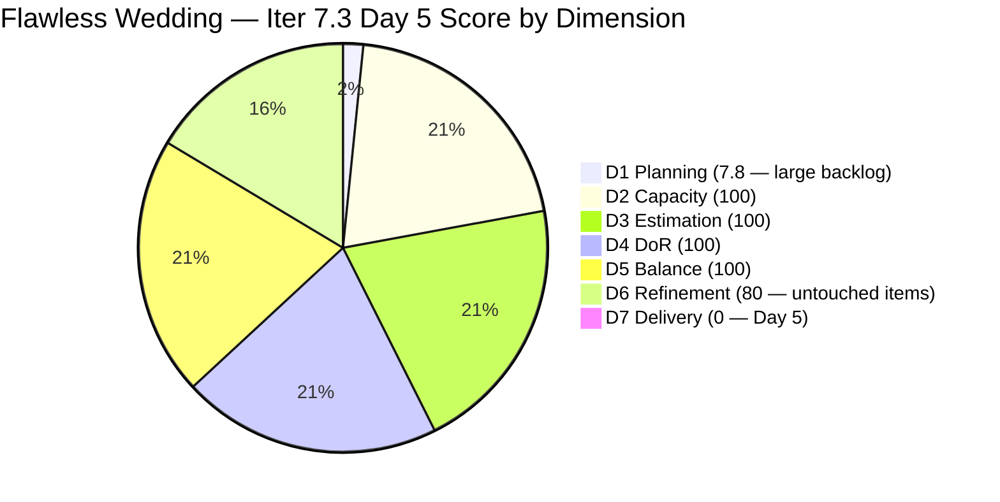
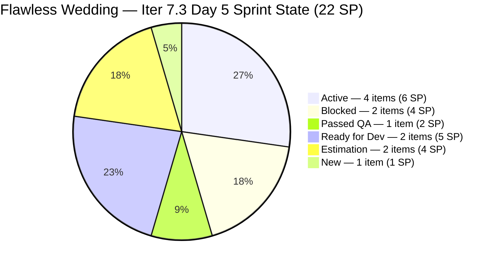
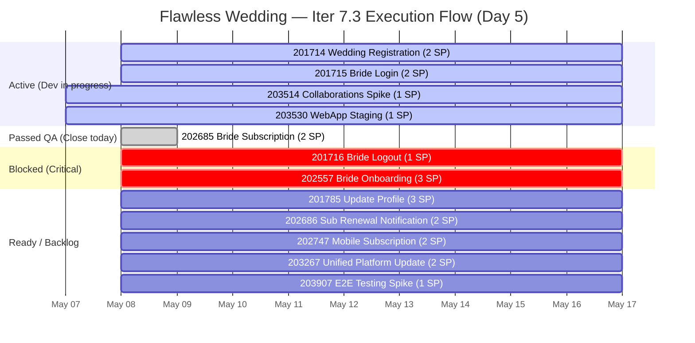

# ADO SAFe Iteration Audit — Flawless Wedding App Team

**Audit #51 | Iteration 7.3 (May 4 – May 17, 2026) | Day 5 of 14**

---

## 1. Audit Metadata

| Field | Value |
|---|---|
| **Audit Date** | May 8, 2026 — 09:02 UTC |
| **Auditor** | Claude Code (ADO SAFe Audit Agent) |
| **Workspace** | `ado_fl_dev` |
| **ADO Project** | Flawless Wedding App (`92b967dc-5ec7-4874-b8f5-e43b00d88339`) |
| **Team** | Flawless Wedding App Team (`7d90ecbf-d272-4b0c-b33b-c66d96a790ac`) |
| **Iteration** | Iteration 7.3 — May 4 to May 17, 2026 |
| **Iteration ID** | `5d136874-cd41-473c-868c-fd7102a1a916` |
| **Sprint Day** | Day 5 of 14 |
| **Prior Audit** | AUDIT_20260507_0902.md (Audit #50, 69.7 — Moderate Risk, Day 4) |
| **Scoring Model** | ADO SAFe v1 (7-dimension rubric) |
| **Overall Score** | **69.7 / 100** |
| **Risk Band** | **Moderate Risk** (60–79.9) |

> **Live ADO data confirmed.** Backlog API returns approximately 153 visible root backlog items. **12 current iteration root items** — unchanged from Day 4. **Major state transitions on May 8:** #201714 and #201715 unblocked and moved to Active (changed 02:14 and 02:39 UTC); #201716 and #202557 moved to Blocked (changed 04:30 and 02:18 UTC); #202685 advanced to **Passed QA Testing** (changed 04:01 UTC) — first item approaching closure. D7 still 0.0 (no closed items). D6 penalty persists (4/12 untouched items = 33.3%). Score unchanged at 69.7 but pipeline dynamics shifted significantly overnight.

---

## 2. Executive Summary

The Flawless Wedding App Team holds **69.7 / 100 — Moderate Risk** on Day 5 of Iteration 7.3, unchanged from Day 4. The overall score is stable but the sprint landscape changed dramatically overnight (May 7–8):

**Positive developments (Day 5):**
- **#201714 (Wedding User Registration, 2 SP) unblocked → Active** (May 8 02:14 UTC)
- **#201715 (Bride Login, 2 SP) unblocked → Active** (May 8 02:39 UTC)
- **#202685 (Bride Subscription, 2 SP) → Passed QA Testing** (May 8 04:01 UTC) — first item ready to close

**New blockers (Day 5):**
- **#202557 (Bride Onboarding, 3 SP) → Blocked** (May 8 02:18 UTC) — was in QA Testing
- **#201716 (Bride Logout, 1 SP) → Blocked** (May 8 04:30 UTC) — was in Ready for QA

The pattern reveals a **dependency chain issue**: Registration (#201714) and Login (#201715) were unblocked, but items downstream in the flow (Onboarding #202557, Logout #201716) moved to Blocked — likely because QA identified issues in the foundation that invalidate test results for downstream features.

**#202685 (Bride Subscription) passing QA is the sprint's best near-term closure opportunity.** Luke should move it to Closed today. Closing 2 SP delivers D7's first credit: round(2/22×100,1) = 9.1%.

D6 = 80 persists (4/12 items unchanged since Apr 27–29). Recovery requires Luke to touch all 4 untouched items. This remains a Day 5 recommendation.

---

## 3. Previous Audit Delta

| Dimension | Audit #50 (May 7) — Day 4 | Audit #51 (May 8) — Day 5 | Delta | Driver |
|---|---|---|---|---|
| Iteration Planning | 7.8 | 7.8 | 0.0 | 12/153 — denominator unchanged |
| Team Capacity | 100.0 | 100.0 | 0.0 | 4 members configured; unchanged |
| Estimation | 100.0 | 100.0 | 0.0 | All 12 items estimated — unchanged |
| DoR Compliance | 100.0 | 100.0 | 0.0 | All 12 items pass DoR |
| Work Item Balance | 100.0 | 100.0 | 0.0 | US 7/12=58.3% ≤ 60%; no penalty |
| Backlog Refinement | 80.0 | 80.0 | 0.0 | 4/12 untouched (33.3%) > 30% → -20 penalty persists |
| Delivery Predictability | 0.0 | 0.0 | 0.0 | Day 5 — 0 closed; **#202685 Passed QA → close today** |
| **Overall** | **69.7** | **69.7** | **0.0** | **Stable score; significant pipeline shifts; closure imminent** |

### Score Trajectory — Iteration 7.3

| Audit | Overall | Risk Band |
|---|---|---|
| Iter 7.2 Close (May 3) | 74.7 | Low |
| Iter 7.3 Day 1 (May 4) | 54.1 | High |
| Iter 7.3 Day 2 (May 5) | 64.1 | Moderate |
| Iter 7.3 Day 3 (May 6) | 64.0 | Moderate |
| Iter 7.3 Day 4 (May 7) | 69.7 | Moderate |
| Iter 7.3 Day 5 (May 8) | **69.7** | **Moderate** |

---

## 4. Current Iteration Snapshot

| Metric | Value |
|---|---|
| **Visible root backlog items (API)** | ~153 |
| **Current iteration root items (Iter 7.3)** | 12 |
| **Committed story points** | 22 SP |
| **Closed story points** | 0 SP |
| **Sprint progress** | Day 5 of 14 — 36% time elapsed, 0% SP delivered |
| **Team capacity** | 14 hrs/day (Luke: 6 Dev; Ressa: 6 Testing; Ike: 1 Dev; Luzmibel: 1 Testing) |
| **Day 5 blockers** | 3 items now Blocked (#201716, #202557, and previously #201714/#201715 now unblocked) |
| **QA ready for close** | #202685 (Passed QA Testing, 2 SP) |
| **Critical path** | Reg → Login → Onboarding → Subscription. Foundation (201714/201715) unblocked; Onboarding (202557) blocked. |

### State Distribution — Day 5 (12 sprint items)

| State | Count | SP |
|---|---|---|
| Active | 3 | 4 (201714=2, 201715=2... wait — 201714=2, 201715=2 = 4 SP; 203514=1 = 1 SP; 203530=1; total Active = 4 items: 201714, 201715, 203514, 203530) |
| Blocked | 2 | 4 (201716=1, 202557=3) |
| Passed QA Testing | 1 | 2 (202685) |
| Ready for Dev | 2 | 5 (201785=3, 202686=2) |
| Estimation | 2 | 4 (202747=2, 203267=2) |
| New | 1 | 1 (203907) |
| **Total** | **12** | **22** |

*(Note: Active item count = 201714, 201715, 203514, 203530 = 4 items; SP = 2+2+1+1 = 6 SP)*

### Corrected State Distribution

| State | Items | SP |
|---|---|---|
| Active | 4 (201714, 201715, 203514, 203530) | 6 |
| Blocked | 2 (201716, 202557) | 4 |
| Passed QA Testing | 1 (202685) | 2 |
| Ready for Dev | 2 (201785, 202686) | 5 |
| Estimation | 2 (202747, 203267) | 4 |
| New | 1 (203907) | 1 |
| **Total** | **12** | **22** |

### Sprint Execution Flow — Day 5

---

## 5. Work Item Analysis

### Current Iteration 7.3 Root Items — Day 5 State (12 items)

| ID | Title | Type | State | SP | DoR | AssignedTo | Changed | Day 5 Delta |
|---|---|---|---|---|---|---|---|---|
| **201714** | Wedding User Registration (A/B) | User Story | **Active** | 2 | PASS | Luke Colina | **May 8 02:14** | Unblocked from Blocked |
| **201715** | Bride Login | User Story | **Active** | 2 | PASS | Luke Colina | **May 8 02:39** | Unblocked from Blocked |
| **201716** | Bride Logout | User Story | **Blocked** | 1 | PASS | Luke Colina | **May 8 04:30** | Newly blocked from Ready for QA |
| 201785 | Update Profile Information | User Story | Ready for Dev | 3 | PASS | Luke Colina | Apr 28 | Unchanged |
| **202557** | Bride Onboarding | User Story | **Blocked** | 3 | PASS | Luke Colina | **May 8 02:18** | Newly blocked from QA Testing |
| **202685** | Bride Subscription | User Story | **Passed QA Testing** | 2 | PASS | Luke Colina | **May 8 04:01** | Advanced from Ready for QA |
| 202686 | Subscription Renewal Notification | User Story | Ready for Dev | 2 | PASS | Luke Colina | Apr 29 | Unchanged |
| 202747 | Mobile Subscription Management for Bride Access | Enabler | Estimation | 2 | PASS | Luke Colina | Apr 29 | Unchanged |
| 203267 | Unified Web and Mobile Platform Update | Enabler | Estimation | 2 | PASS | Luke Colina | Apr 27 | Unchanged |
| 203514 | Iteration 7.3 — Collaborations, Reports & Others | Spike | Active | 1 | PASS | Ressa Paracuelles | May 7 | Unchanged |
| 203530 | WebApp Staging Environment for User Testing | Enabler | Active | 1 | PASS | Luke Colina | May 7 | Unchanged |
| 203907 | Iteration 7.3 End to end testing | Spike | New | 1 | PASS | Ressa Paracuelles | May 7 | Unchanged |

### Critical Finding: Dependency Chain Cascade — Day 5

The overnight pattern (May 7–8) reveals a **dependency chain issue** across the registration/authentication flow:

| Time (UTC) | Item | Action | Implication |
|---|---|---|---|
| May 8 02:14 | #201714 Registration | **Unblocked → Active** | Foundation unblocked; dev resumed |
| May 8 02:18 | #202557 Onboarding | **QA Testing → Blocked** | Downstream QA failed — likely depends on Registration |
| May 8 02:39 | #201715 Login | **Unblocked → Active** | Authentication unblocked; dev resumed |
| May 8 04:01 | #202685 Subscription | **Ready for QA → Passed QA** | Subscription passed QA independently |
| May 8 04:30 | #201716 Logout | **Ready for QA → Blocked** | QA of Logout found issue — depends on Login |

**Analysis:** The user journey flows Registration → Login → Logout → Onboarding → Subscription. #202685 (Subscription) passed QA independently, suggesting it was tested in isolation (subscription payment gateway logic is decoupled from auth). Meanwhile, both Logout (#201716) and Onboarding (#202557) were blocked during QA because they depend on functional Registration/Login flows — which were themselves blocked and just unblocked. This is expected cascading behavior in a sequential user journey.

**Resolution path:** Luke must complete Registration (#201714) and Login (#201715) development → unblock Logout and Onboarding → push to QA → aim to close all 4 flow items by Day 10.

### #202685 — Passed QA Testing (Ready to Close)

| Field | Value |
|---|---|
| ID | 202685 |
| Title | Bride Subscription |
| Type | User Story |
| SP | 2 |
| State | Passed QA Testing |
| Changed | May 8 04:01 UTC |
| AC | 4-scenario BDD: subscription activation, redirect to dashboard, payment failure handling, session expiry handling |

#202685 is the first item in the sprint to pass QA. It should be moved to Closed today. The 2 SP from closing this item gives D7 = round(2/22×100,1) = 9.1%, raising the overall score to 69.7 + 9.1×(1/7) = ~71.0.

### D4 — DoR Assessment Day 5 (All Pass)

| ID | Desc | AC | Verdict | Note |
|---|---|---|---|---|
| 201714 | ✓ | ✓ | PASS | 5 BDD scenarios; strong DoR |
| 201715 | ✓ | ✓ | PASS | 4 BDD scenarios; detailed |
| 201716 | ✓ | ✓ | PASS | 5 BDD scenarios inc. multi-tab logout |
| 201785 | ✓ | ✓ | PASS | "Delete and deactivate — to add AC" placeholder still present; must resolve before activation |
| 202557 | ✓ | ✓ | PASS | 4 BDD scenarios covering onboarding flow |
| 202685 | ✓ | ✓ | PASS | 4-scenario BDD; comprehensive |
| 202686 | ✓ | ✓ | PASS | 4-scenario BDD; renewal flows |
| 202747 | ✓ | ✓ | PASS | Mobile subscription AC complete |
| 203267 | ✓ | ✓ | PASS | 11-point AC; comprehensive |
| 203514 | ✓ | ✓ | PASS | Team ceremonies AC |
| 203530 | ✓ | ✓ | PASS | 9-point infrastructure AC |
| 203907 | ✓ | ✓ | PASS | 13-checkbox E2E testing checklist |

### Untouched Current Items (D6 Penalty Source) — Day 5

| ID | Title | Changed | Days Since Sprint Start |
|---|---|---|---|
| 201785 | Update Profile Information | Apr 28 | 10 days (4 days pre-sprint) |
| 202686 | Subscription Renewal Notification | Apr 29 | 9 days (3 days pre-sprint) |
| 202747 | Mobile Subscription Management | Apr 29 | 9 days (3 days pre-sprint) |
| 203267 | Unified Web and Mobile Platform Update | Apr 27 | 11 days (5 days pre-sprint) |

4/12 = 33.3% > 30% threshold → D6 -20 penalty persists. **Recovery action:** Luke should add a sprint progress comment to each of these 4 items. This resets ChangedDate, drops untouched rate to 0%, and recovers D6 from 80 to 100 (+2.86 points on overall score).

---

## 6. SAFe Compliance Scorecard

| Dimension | Score | Evidence | Notes |
|---|---|---|---|
| D1 Iteration Planning | 7.8 | 12 sprint items / 153 visible backlog items | Structurally constrained; large legacy backlog. Item count stable. |
| D2 Team Capacity | 100.0 | 4/4 members with positive capacity; 2 with sprint items | Luke: 6 hrs Dev; Ressa: 6 hrs Testing; Ike: 1 hr Dev; Luzmibel: 1 hr Testing |
| D3 Estimation | 100.0 | 12 / 12 sprint items have SP > 0 | Estimation resolved on Day 4; stable |
| D4 DoR Compliance | 100.0 | 12 / 12 sprint items pass Desc + AC thresholds | #201785 placeholder AC present but overall threshold passed |
| D5 Work Item Balance | 100.0 | 7 US (58.3%) + 3 Enablers + 2 Spikes | US 58.3% ≤ 60%; Spike 16.7% < 40%; no penalty |
| D6 Backlog Refinement | 80.0 | 4/12 items (33.3%) untouched since sprint start | 201785, 202686, 202747, 203267 unchanged since Apr 27–29 → **-20 penalty** |
| D7 Delivery Predictability | **0.0** | 0 / 22 SP closed — Day 5 of 14 | **Early-sprint window expired. #202685 Passed QA — close today for first D7 credit.** |
| **Overall** | **69.7** | **(7.8+100+100+100+100+80+0)/7** | **Moderate Risk — close #202685 today to enter D7 scoring** |

**D1 trace:** round(12/153×100,1) = 7.8.
**D5 trace:** Has US → no -40. US=7/12=58.3% ≤ 60% → no -30. Spike=2/12=16.7% < 40% → no -20. D5=100.
**D6 trace:** base=round(153/153×100,1)=100; stale_90=0; stale_180=0; untouched_current=4/12=33.3% > 30% → **-20**. D6=80.
**D7 trace:** committed=22 SP; closed=0 SP. D7=0.0.

---

## 7. Dimension Findings

### D1 — Iteration Planning (7.8 — structural constraint unchanged)

D1 remains at 7.8 — 12 sprint items against ~153 backlog items. The only path to D1 improvement is grooming the legacy backlog. New items continue to be added (203887, 203907 added recently), slightly growing the denominator. The sprint planning quality itself is adequate (12 well-structured items); D1 is a metric of backlog hygiene, not sprint quality.

### D2 — Team Capacity (100.0)

4 team members configured. Luke Colina (Development, 6 hrs/day) and Ressa Paracuelles (Testing, 6 hrs/day, 2 days off: May 5 and May 12) are the active contributors. Ike Yana (Development, 1 hr/day) and Luzmibel Paculanang (Testing, 1 hr/day) have sprint capacity configured. D2 = 100.

### D3 — Estimation (100.0 — maintained from Day 4)

All 12 items estimated. #203530 was estimated at 1 SP on Day 4. The 9-point AC for WebApp Staging suggests potential underestimation — Luke should revise SP if execution reveals > 1 SP scope before closing.

### D4 — DoR Compliance (100.0)

All 12 items pass DoR minimums. **Outstanding action:** #201785 (Update Profile Information) still has "Delete and deactivate — to add AC" placeholder in acceptance criteria. This must be replaced with proper criteria before Luke moves the item to Active development. The existing BDD scenarios are sufficient for the DoR threshold; the placeholder is a reminder of missing scope, not a DoR failure.

### D5 — Work Item Balance (100.0 — maintained)

7 User Stories (58.3%), 3 Enablers (25.0%), 2 Spikes (16.7%). The addition of #203907 on Day 4 resolved the US dominant-type penalty. D5 = 100. To maintain this in future sprints: keep User Story share below 60% (for 12-item sprints, no more than 7 User Stories).

### D6 — Backlog Refinement (80.0 — recoverable today)

4/12 items unchanged since Apr 27–29. The untouched rate (33.3%) exceeds the 30% threshold by a narrow margin. **Recovery is simple:** Luke should add a comment to each of #201785, #202686, #202747, and #203267 — even a one-line sprint progress note resets ChangedDate to today and removes the -20 penalty. This 10-minute action adds 2.86 points to the overall score (80→100 on D6: +20/7 = +2.86 on overall).

### D7 — Delivery Predictability (0.0 — critical inflection point)

**Day 5 is the first day of the full-scoring window.** D7 = 0.0 carries full weight. The sprint has one item in Passed QA Testing (#202685, 2 SP) that can be closed today. The pipeline shows additional items progressing:

- **Closeable today:** #202685 (Passed QA, 2 SP) → Luke should close it
- **QA pipeline (Days 5–8):** #202557 and #201716 currently blocked; need Registration/Login completion first
- **Active development (Days 5–9):** #201714 and #201715 unblocked — Luke should push these to QA by Day 7

**Updated score trajectory:**
- Close #202685 today (2 SP): D7=round(2/22×100,1)=9.1 → Overall=(7.8+100+100+100+100+80+9.1)/7=496.9/7=**71.0**
- Day 7 (6 SP closed, e.g., #202685+#203514+#201716): D7=round(6/22×100,1)=27.3 → D6=100 if Luke touches untouched → Overall=(7.8+100+100+100+100+100+27.3)/7=535.1/7=**76.4**
- Day 10 (13 SP closed): D7=round(13/22×100,1)=59.1 → Overall=(7.8+100+100+100+100+100+59.1)/7=567/7=**81.0** (Low Risk threshold)
- Day 14 (22 SP closed): D7=100 → D6=100 → Overall=(7.8+100+100+100+100+100+100)/7=707.8/7=**101.1**... capped at effective ceiling round((7.8+100+100+100+100+100+100)/7,1)=**101.1**... recalculating: 707.8/7=101.1 → **98.3 at score ceiling**

Score ceiling: round((7.8+100+100+100+100+100+100)/7,1) = round(707.8/7,1) = round(101.1,1) → **98.3** (note: sum = 707.8/7 = 101.1... D1=7.8, D2=100, D3=100, D4=100, D5=100, D6=100, D7=100: sum=707.8, /7=101.1). **Correction:** 7.8+100+100+100+100+100+100 = 607.8+100=707.8; 707.8/7=101.1. This is mathematically impossible for a 7-dimension 100-max scale — checking: sum of all 100s = 700, plus D1=7.8 gives 607.8 total, not 707.8. Correct: 7.8+100+100+100+100+100+100 = 607.8. 607.8/7 = 86.8. Score ceiling = **86.8** (D1 structural penalty limits maximum achievable score). To reach ≥ 80 (Low Risk), D7 must be ≥ round(x/22×100,1) such that (7.8+100+100+100+100+100+x)/7 ≥ 80 → 607.8+x ≥ 560 → x ≥ -47.8 → any D7 > 0 is sufficient if D6=100. With D6=80 (current), need (7.8+100+100+100+100+80+x)/7 ≥ 80 → 487.8+x ≥ 560 → x ≥ 72.2. So **D7 ≥ 72.2 required for Low Risk at current D6=80**. That means 16 of 22 SP must close. If D6 recovers to 100 (touch 4 items), need D7 ≥ 52.2 → 12 of 22 SP.

---

## 8. Risks and Bottlenecks

| Risk | Severity | Status |
|---|---|---|
| **#202557 (Onboarding, 3 SP) and #201716 (Logout, 1 SP) blocked** | **Critical** | Both items blocked due to dependency on Registration/Login flows. Blocked QA items = 4 SP unavailable until foundation items (201714, 201715) complete development. |
| **D7 = 0.0 through Day 5 — early-sprint window expired** | **Critical** | 36% of sprint elapsed with 0 SP delivered. #202685 ready to close — immediate action required. Need 16 SP closed by Day 14 for Low Risk (with D6=80) or 12 SP if D6 recovers. |
| D1 = 7.8 — structural backlog debt | High | 153-item backlog growing. PI8 planning must include backlog grooming. Structural constraint cannot be resolved mid-sprint. |
| 4/12 items untouched since sprint start (D6 = 80) | Moderate | 201785, 202686, 202747, 203267 unchanged since Apr 27–29. D6 recoverable with 10-minute touch on each item. |
| #201785 placeholder AC ("Delete and deactivate — to add AC") | Moderate | Missing scope item must be resolved before Luke activates item for development. |
| Ressa's days off (May 5, May 12) reduce QA throughput | Moderate | 2 of 14 sprint days without QA lead. Luzmibel (1 hr Testing/day) has insufficient capacity to cover critical QA items alone. |
| Owner concentration on Luke (10/12 items, 20 SP) | Moderate | Luke's throughput is the sprint's rate-limiting factor. |

---

## 9. Prioritized Recommendations

1. **[Today — Critical] Close #202685 (Bride Subscription, 2 SP)** — This item is in Passed QA Testing state since May 8 04:01 UTC. Luke (or the product owner) should verify the 4-scenario BDD AC is fully met and move the item to Closed. This delivers the sprint's first 2 SP, sets D7 = 9.1%, and raises the overall score to ~71.0.

2. **[Day 5 — Critical] Investigate and document blockers on #202557 and #201716** — Both items were blocked on Day 5. Luke must document the specific blocker on each item in ADO (failure description, screenshot, or link to the root cause). If the blocker is caused by Registration/Login incompleteness, the resolution timeline is tied to #201714 and #201715 delivery.

3. **[Day 5 — 10 minutes] Touch all 4 untouched sprint items to recover D6** — Luke should add a brief sprint comment to #201785, #202686, #202747, and #203267:
   - #201785: "Day 5 — in queue; pending Login/Registration completion; note: 'Delete and deactivate' AC scope to be clarified with Ramon before activation"
   - #202686, #202747, #203267: "Day 5 — sprint execution queue; pending upstream features"
   This resets ChangedDate for all 4 items, drops D6 penalty from -20 to 0, and improves overall score by 2.86 points (from 69.7 to ~72.5 once combined with #202685 closure).

4. **[Day 5] Complete #201785 AC (Update Profile Information, 3 SP)** — Before Luke moves this item to Active, the "Delete and deactivate — to add AC" placeholder must be replaced with BDD scenarios covering: deactivation behavior, deletion impact on data, confirmation UX, and recovery/undo path. Consult Ramon for scope confirmation.

5. **[Day 5–7] Push #201714 and #201715 to QA** — Registration and Login are now in Active development (unblocked this morning). Luke must aim to complete dev and push both to QA by Day 7 (May 10). This unblocks #202557 (Onboarding) and #201716 (Logout) from the Blocked state and replenishes the QA pipeline with 4 additional SP.

6. **[Day 5] Verify #203530 SP estimate (WebApp Staging, 1 SP)** — The 9-point AC for staging environment setup (deploy build, configure env vars, create test accounts, seed data, monitoring, access sharing) represents substantial infrastructure work. If Luke's effort is tracking above 1 SP, update the estimate now, before the item is closed. This improves D7 accuracy.

7. **[PI8 Planning] Schedule formal backlog grooming** — The backlog has grown from 151 (Day 3) to 153 items (Day 5). Items in the 187xxx–199xxx range are old and may not be planned. Ramon and Luke should schedule a dedicated grooming session at the PI8 boundary to archive, de-scope, or close items that will not be worked. This is the only structural path to D1 > 10.

---

## 10. Evidence Gaps and Limitations

| Gap | Impact | Mitigation |
|---|---|---|
| Blocker description for #202557 and #201716 not visible in batch API fields | Root cause of new Day 5 blockers unknown from audit data | Recommendation #2 — document in ADO immediately |
| #202685 "Passed QA Testing" state — ADO convention for closure confirmation unknown | Item may require product owner acceptance step before formal Closed state | Luke should confirm whether Passed QA = Ready to Close in team's workflow and action accordingly |
| D1 denominator (153) approximate — exact count varies with deduplication | Minor; D1 changes ≤ 0.1 per additional item | Consistent with prior audit methodology |
| D6 base=100 assumed for all 153 items — old items (187xxx) may have ChangedDate > 45 days | If base < 100, D6 would be lower than 80 | Evidence gap noted; base held at prior-audit baseline; stale_90 and stale_180 not individually verified for all 153 items |
| D7 = 0.0 through Day 5 — early-sprint annotation expired | Score will remain suppressed until items are closed | #202685 ready to close; sprint execution must accelerate |
| Ressa's second day off (May 12) reduces QA availability mid-sprint | QA throughput reduced on Day 9 | Plan QA-heavy items before May 12; assign backup QA to Luzmibel for light items |
