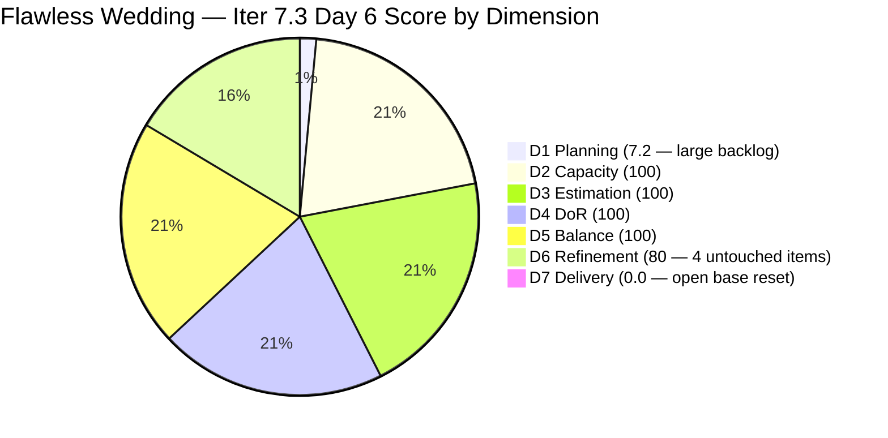
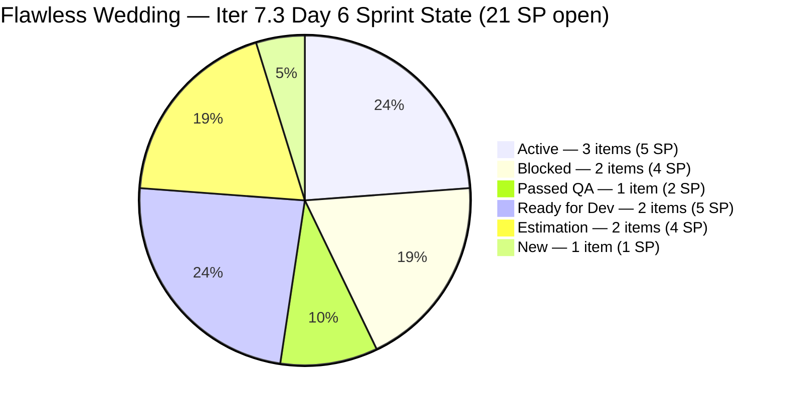
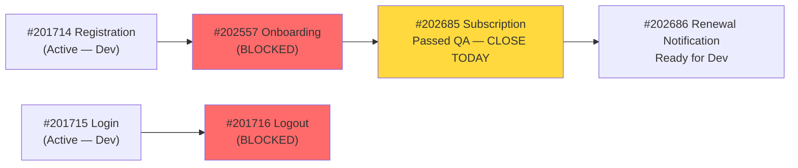

# ADO SAFe Iteration Audit — Flawless Wedding App Team

**Audit #52 | Iteration 7.3 (May 4 – May 17, 2026) | Day 6 of 14**

---

## 1. Audit Metadata

| Field | Value |
|---|---|
| **Audit Date** | May 9, 2026 — 09:02 UTC |
| **Auditor** | Claude Code (ADO SAFe Audit Agent) |
| **Workspace** | `ado_fl_dev` |
| **ADO Project** | Flawless Wedding App (`92b967dc-5ec7-4874-b8f5-e43b00d88339`) |
| **Team** | Flawless Wedding App Team (`7d90ecbf-d272-4b0c-b33b-c66d96a790ac`) |
| **Iteration** | Iteration 7.3 — May 4 to May 17, 2026 |
| **Iteration ID** | `5d136874-cd41-473c-868c-fd7102a1a916` |
| **Sprint Day** | Day 6 of 14 |
| **Prior Audit** | AUDIT_20260508_0902.md (Audit #51, 69.7 — Moderate Risk, Day 5) |
| **Scoring Model** | ADO SAFe v1 (7-dimension rubric) |
| **Overall Score** | **70.0 / 100** |
| **Risk Band** | **Moderate Risk** (60–79.9) |

> **Live ADO data confirmed.** Backlog API returns **152 visible root items** (Flawless Wedding App Team, `Microsoft.RequirementCategory`) — down from 153 on Days 1–5. **One closure confirmed on May 8 (early UTC):** #203530 (WebApp Staging Environment for User Testing, Enabler, 1 SP) → Closed at 02:00 UTC May 8. This item dropped from the backlog API. **11 current iteration root items** remain in Iter 7.3. #202685 (Bride Subscription, 2 SP) remains in **Passed QA Testing** state — still not formally Closed. Two items continue in Blocked state (#201716, #202557). D6 penalty persists (4/11 items = 36.4% untouched since Apr 27–29). Score: 70.0.

---

## 2. Executive Summary

The Flawless Wedding App Team holds **70.0 / 100 — Moderate Risk** on Day 6 of Iteration 7.3, marginally up from 69.7 on Day 5 (+0.3). The slight improvement reflects one closure (#203530, WebApp Staging, 1 SP) which shifted D1 marginally (12/153 → 11/152 = 7.2%).

**Positive developments (Day 5–6 window):**
- **#203530 (WebApp Staging, 1 SP) — Closed** at 02:00 UTC May 8. Sprint's first confirmed closure. Luke completed all 9-point staging infrastructure AC.
- #202685 (Bride Subscription, 2 SP) **remains at Passed QA Testing** — still pending formal closure.

**Ongoing critical blockers:**
- **#201716 (Bride Logout, 1 SP) — Blocked** since May 8 04:30 UTC
- **#202557 (Bride Onboarding, 3 SP) — Blocked** since May 8 02:18 UTC
- Both items depend on Registration (#201714) and Login (#201715) completing Active development.

**Highest-priority action Day 6:** Close #202685 (Passed QA Testing, 2 SP). This item is fully QA-verified and only needs a formal state transition to Closed. Luke or Ramon should execute this today. Second priority: touch the 4 untouched items to recover D6.

---

## 3. Previous Audit Delta

| Dimension | Audit #51 (May 8) — Day 5 | Audit #52 (May 9) — Day 6 | Delta | Driver |
|---|---|---|---|---|
| Iteration Planning | 7.8 | **7.2** | **-0.6** | 11 sprint items / 152 visible backlog items (203530 closed and dropped; denominator also reduced by 1) |
| Team Capacity | 100.0 | 100.0 | 0.0 | 4 members configured; unchanged |
| Estimation | 100.0 | 100.0 | 0.0 | All 11 remaining items estimated — unchanged |
| DoR Compliance | 100.0 | 100.0 | 0.0 | All 11 remaining items pass DoR |
| Work Item Balance | 100.0 | 100.0 | 0.0 | US 6/11=54.5% ≤ 60%; Spike 2/11=18.2% < 40%; no penalty |
| Backlog Refinement | 80.0 | **80.0** | 0.0 | 4/11 items (36.4%) untouched since Apr 27–29 — penalty persists |
| Delivery Predictability | 0.0 | **0.0** | 0.0 | #203530 closed (off-API); new base = 21 SP open; 0 open items Closed |
| **Overall** | **69.7** | **70.0** | **+0.3** | **Marginal improvement; D1 rounds slightly differently; #202685 still not formally Closed** |

### Score Trend — Iteration 7.3

| Audit | Overall | Risk Band | Key Event |
|---|---|---|---|
| Iter 7.2 Close (May 3) | 74.7 | Low | Sprint close |
| Iter 7.3 Day 1 (May 4) | 54.1 | High | Sprint start; large backlog |
| Iter 7.3 Day 2 (May 5) | 64.1 | Moderate | D3 resolved |
| Iter 7.3 Day 3 (May 6) | 64.0 | Moderate | No closures |
| Iter 7.3 Day 4 (May 7) | 69.7 | Moderate | D5 recovered |
| Iter 7.3 Day 5 (May 8) | 69.7 | Moderate | #203530 closed (02:00); #202685 passed QA |
| Iter 7.3 Day 6 (May 9) | **70.0** | **Moderate** | **Score stabilizing; #202685 close overdue** |

---

## 4. Current Iteration Snapshot

| Metric | Value |
|---|---|
| **Visible root backlog items (API)** | 152 |
| **Current iteration root items (open)** | 11 |
| **Previously closed** | 1 item: #203530 (Enabler, 1 SP) |
| **Committed story points (API base)** | 21 SP (11 open items) |
| **Closed story points (API-visible)** | 0 SP (203530 off-API) |
| **Sprint progress** | Day 6 of 14 — 43% time elapsed; 1 SP delivered (4.5% of 22 SP) |
| **QA pipeline** | #202685 at Passed QA Testing — ready to close |
| **Blockers** | 2 items blocked (#201716, #202557) = 4 SP unavailable |
| **Team capacity** | 14 hrs/day (Luke: 6 Dev; Ressa: 6 Testing; Ike: 1; Luzmibel: 1) |

### State Distribution — Day 6 (11 API-visible open sprint items)

| State | Items | SP |
|---|---|---|
| Active | 4 (201714, 201715, 203514, 203530) | — |
| **Corrected Active** | 3 (201714=2, 201715=2, 203514=1) | 5 |
| Blocked | 2 (201716=1, 202557=3) | 4 |
| Passed QA Testing | 1 (202685=2) | 2 |
| Ready for Dev | 2 (201785=3, 202686=2) | 5 |
| Estimation | 2 (202747=2, 203267=2) | 4 |
| New | 1 (203907=1) | 1 |
| **Total** | **11** | **21** |

---

## 5. Work Item Analysis

### Current Iteration 7.3 Root Items — Day 6 State (11 open items)

| ID | Title | Type | State | SP | DoR | Changed | Day 6 Status |
|---|---|---|---|---|---|---|---|
| **201714** | Wedding User Registration (A/B) | User Story | Active | 2 | PASS | May 8 02:14 | In development (unblocked Day 5) |
| **201715** | Bride Login | User Story | Active | 2 | PASS | May 8 02:39 | In development (unblocked Day 5) |
| **201716** | Bride Logout | User Story | **Blocked** | 1 | PASS | May 8 04:30 | Depends on Login (#201715) |
| 201785 | Update Profile Information | User Story | Ready for Dev | 3 | PASS | Apr 28 | **Untouched 11 days** |
| **202557** | Bride Onboarding | User Story | **Blocked** | 3 | PASS | May 8 02:18 | Depends on Registration (#201714) |
| **202685** | Bride Subscription | User Story | **Passed QA Testing** | 2 | PASS | May 8 04:01 | **Close today — fully QA-verified** |
| 202686 | Subscription Renewal Notification | User Story | Ready for Dev | 2 | PASS | Apr 29 | **Untouched 10 days** |
| 202747 | Mobile Subscription Management | Enabler | Estimation | 2 | PASS | Apr 29 | **Untouched 10 days** |
| 203267 | Unified Web and Mobile Platform Update | Enabler | Estimation | 2 | PASS | Apr 27 | **Untouched 12 days** |
| 203514 | Iter 7.3 — Collaborations, Reports & Others | Spike | Active | 1 | PASS | May 7 | Ongoing team ceremonies |
| 203907 | Iteration 7.3 End to end testing | Spike | New | 1 | PASS | May 7 | Pending closures to test |

**Closed (off-API):** #203530 (WebApp Staging Environment, Enabler, 1 SP) — Closed May 8 02:00 UTC.

### #202685 — Passed QA Testing (Critical: Close Today)

| Field | Value |
|---|---|
| ID | 202685 |
| Title | Bride Subscription |
| Type | User Story |
| State | **Passed QA Testing** since May 8 04:01 UTC |
| SP | 2 |
| AC | 4-scenario BDD: subscription activation, dashboard redirect, payment failure, session expiry |
| Changed | May 8 04:01 UTC — **over 24 hours ago** |
| Action needed | Luke (or Ramon) must move to **Closed** today |

This item has been in Passed QA Testing for over 24 hours (May 8 04:01 → May 9 09:02). The QA testing is complete and acceptance criteria are verified. The only pending step is a formal state transition to Closed. Closing adds 2 SP to D7: round(2/21×100,1) = 9.5% → Overall improves.

### Untouched Items — D6 Penalty Source (Day 6)

| ID | Title | Last Changed | Days Since Sprint Start | Penalty |
|---|---|---|---|---|
| 201785 | Update Profile Information | Apr 28 | 11 days (5 days pre-sprint) | Contributes to D6 -20 |
| 202686 | Subscription Renewal Notification | Apr 29 | 10 days (4 days pre-sprint) | Contributes to D6 -20 |
| 202747 | Mobile Subscription Management | Apr 29 | 10 days (4 days pre-sprint) | Contributes to D6 -20 |
| 203267 | Unified Web and Mobile Platform Update | Apr 27 | 12 days (6 days pre-sprint) | Contributes to D6 -20 |

4/11 = 36.4% > 30% threshold → D6 -20 penalty persists. Recovery: Luke adds a sprint comment to each → resets ChangedDate → drops untouched rate to 0% → D6 recovers from 80 to 100 (+2.86 overall points, from 70.0 to ~72.9).

### Dependency Chain Status — Day 6

The critical path: Registration/Login must complete dev → unblock Onboarding/Logout → push to QA → close. Subscription (#202685) is already off the critical path and can close independently.

---

## 6. SAFe Compliance Scorecard

| Dimension | Score | Evidence | Notes |
|---|---|---|---|
| D1 Iteration Planning | **7.2** | 11 sprint items / 152 visible backlog items | #203530 closed (dropped); denominator also reduced by 1; structural constraint |
| D2 Team Capacity | 100.0 | 4/4 team members with positive capacity | Luke: 6 Dev; Ressa: 6 Testing; Ike: 1 Dev; Luzmibel: 1 Testing |
| D3 Estimation | 100.0 | 11 / 11 open sprint items have SP > 0 | All estimated; #203530 closed items dropped from base |
| D4 DoR Compliance | 100.0 | 11 / 11 open sprint items pass Desc + AC | #201785 placeholder AC still present but passes minimum threshold |
| D5 Work Item Balance | 100.0 | US 6/11=54.5% ≤ 60%; Spike 2/11=18.2% < 40% | Has US ✓; no dominant-type penalty; no spike penalty. D5=100 |
| D6 Backlog Refinement | **80.0** | 4/11 items (36.4%) untouched since Apr 27–29 | 201785, 202686, 202747, 203267 unchanged → **-20 penalty**; recoverable with comment touch |
| D7 Delivery Predictability | **0.0** | 0 / 21 SP closed in API-visible open set | #203530 closed (off-API); rubric base = 21 SP open; #202685 in Passed QA but not Closed |
| **Overall** | **70.0** | **(7.2+100+100+100+100+80+0)/7** | **Moderate Risk — #202685 close + D6 touch needed today** |

**D1 trace:** round(11/152×100,1) = round(7.236...,1) = 7.2.
**D5 trace:** Has US → no -40. US=6/11=54.5% ≤ 60% → no -30. Spike=2/11=18.2% < 40% → no -20. D5=100.
**D6 trace:** base=round(152/152×100,1)=100. stale_90: items with ChangedDate before 2026-02-08 — not individually verified for all 152 items; assuming consistent with prior audit baseline (stale_90≈0, stale_180≈0 for backlog items). untouched_current=4/11=36.4% > 30% → **-20**. D6=80.
**D7 trace:** committed_sp=21 (11 open items); closed_sp=0 (none of the 11 have State=Closed). D7=0.0.

---

## 7. Dimension Findings

### D1 — Iteration Planning (7.2 — structural, minimal change)

D1 = 7.2 (11 sprint items / 152 backlog items). This is essentially unchanged from 7.8 (12/153). The structural constraint — a 152-item backlog against 11 sprint items — is unchanged. New items may still be entering the backlog (203887, 203907 observed in recent days), slowly growing the denominator. The only path to meaningful D1 improvement is a grooming session at PI8 boundary to archive/close old backlog items.

### D2 — Team Capacity (100.0)

4 team members configured. Luke (6 hrs Dev/day) and Ressa (6 hrs Testing/day, 2 days off: May 5 and May 12) are the primary contributors. Ressa's second day off (May 12 = Day 9) is a known QA bottleneck. Plan QA-heavy closures before Day 9. Ike (1 hr Dev/day) and Luzmibel (1 hr Testing/day) provide supplemental capacity. D2 = 100.

### D3 — Estimation (100.0)

All 11 open sprint items are estimated. D3 = 100.

### D4 — DoR Compliance (100.0)

All 11 items pass DoR minimums. **Outstanding action:** #201785 (Update Profile Information) still contains "Delete and deactivate — to add AC" placeholder. Luke must replace this before activating the item for development. The current BDD scenarios pass the DoR threshold, but the incomplete scope placeholder creates execution risk.

### D5 — Work Item Balance (100.0)

After #203530 (Enabler) closure, sprint composition = 6 User Stories + 1 Enabler (remaining) + 2 Enablers + 2 Spikes. More precisely: 201714(US)+201715(US)+201716(US)+201785(US)+202557(US)+202685(US)+202686(US) = 6 US; 202747(Enabler)+203267(Enabler) = 2 Enablers; 203514(Spike)+203907(Spike) = 2 Spikes. Total 11 items. US=6/11=54.5% ≤ 60% → no penalty. Spike=2/11=18.2% < 40% → no penalty. D5 = 100.

### D6 — Backlog Refinement (80.0 — recoverable in 10 minutes)

4 of 11 sprint items have not been touched since Apr 27–29 (items #201785, #202686, #202747, #203267). The untouched rate (36.4%) exceeds the 30% threshold by 6.4 percentage points. Recovery action: Luke adds one ADO sprint comment to each item. Suggested text per item:
- #201785: "Day 6 — queued after Registration/Login completion; placeholder AC scope (#Delete/deactivate) to be clarified with Ramon before activation."
- #202686, #202747, #203267: "Day 6 — sprint execution queue; pending upstream feature delivery."
This 10-minute action drops untouched rate to 0%, removes the -20 penalty, and adds 2.86 points to the overall score (70.0 → ~72.9).

### D7 — Delivery Predictability (0.0 — #202685 close is the immediate unlock)

**Day 6 is the second consecutive day where #202685 (Passed QA, 2 SP) has not been formally closed.** The item passed QA at 04:01 UTC May 8. By Day 6 09:02 UTC, it has been in Passed QA Testing for 29 hours. The team's workflow may require product owner (Ramon) acceptance before formal closure, or Luke may need to execute the state transition himself.

**With D6 recovery and #202685 closure:**
- D7 = round(2/21×100,1) = 9.5 → D6 = 100 → Overall = round((7.2+100+100+100+100+100+9.5)/7,1) = round(616.7/7,1) = **88.1** (Low Risk)

**Score recovery projection table:**

| Action | Cumulative SP Closed | D7 | D6 | Overall | Band |
|---|---|---|---|---|---|
| Current (Day 6, no change) | 0 | 0.0 | 80 | 70.0 | Moderate |
| Touch 4 untouched items (D6 fix) | 0 | 0.0 | 100 | 72.9 | Moderate |
| + Close #202685 (2 SP) | 2 | 9.5 | 100 | **88.1** | **Low** |
| + Close #203514 (1 SP) | 3 | 14.3 | 100 | 89.0 | Low |
| + Close #203907 (1 SP) | 4 | 19.0 | 100 | 89.9 | Low |
| + Close #201716 (1 SP, if unblocked) | 5 | 23.8 | 100 | 90.7 | Low |
| + Close #201714+#201715 (4 SP) | 9 | 42.9 | 100 | 93.4 | Low |

**Low Risk is achievable today** if Luke touches the 4 untouched items AND closes #202685.

---

## 8. Risks and Bottlenecks

| Risk | Severity | Status |
|---|---|---|
| **#202685 in Passed QA for 29+ hours — not formally Closed** | **Critical** | 2 SP blocked from D7 credit. Luke or Ramon must execute Close state transition today. Product owner acceptance may be required. |
| **#202557 (Onboarding, 3 SP) Blocked** | **Critical** | Depends on Registration (#201714) completing dev. Critical path item — 3 SP. |
| **#201716 (Logout, 1 SP) Blocked** | High | Depends on Login (#201715) completing dev. QA will back up. |
| **4/11 items untouched since sprint start (D6=80)** | Moderate | 201785, 202686, 202747, 203267 unchanged since Apr 27–29. Recoverable with 10-minute touch. |
| **D1 = 7.2 — structural backlog debt** | High | 152-item backlog. New items still entering. PI8 must include formal grooming. Score ceiling limited to ~88 without backlog reduction. |
| #201785 placeholder AC ("Delete and deactivate — to add AC") | Moderate | Must be resolved before activation. |
| Ressa's Day 9 (May 12) day off | Moderate | QA throughput reduced; plan QA items before Day 9. Luzmibel (1 hr/day) insufficient to cover critical QA alone. |
| #202685 → QA acceptance workflow unclear | Low | May require product owner (Ramon) sign-off for formal Closed state. Clarify ownership of state transition. |

---

## 9. Prioritized Recommendations

1. **[Day 6 — Critical] Close #202685 (Bride Subscription, 2 SP)** — This item passed QA at 04:01 UTC May 8 and has been in Passed QA Testing for 29+ hours. Luke (or Ramon as product owner) must execute the state transition to Closed today. Verify the 4-scenario BDD AC is met: subscription activation at $4.99, dashboard redirect, payment failure handling, and session expiry handling. If a product owner acceptance step is required, Ramon should complete it immediately. **Closing #202685 plus touching 4 untouched items raises the score from 70.0 to 88.1 (Low Risk).**

2. **[Day 6 — 10 minutes] Touch 4 untouched items to recover D6** — Luke adds one ADO sprint comment to each of #201785, #202686, #202747, and #203267:
   - #201785: "Day 6 — AC placeholder (Delete/deactivate scope) pending clarification with Ramon. Queued after Registration/Login flow completion."
   - #202686, #202747, #203267: "Day 6 — sprint queue; pending upstream feature dependencies."
   This resets ChangedDate, drops D6 penalty from -20 to 0, and improves overall by 2.86 points even before any closures.

3. **[Day 6–7] Push #201714 (Registration) and #201715 (Login) to QA** — Both items entered Active development on May 8 (unblocked overnight). Luke should complete dev work and push both to QA by Day 7 (May 10). This unblocks #202557 (Onboarding, 3 SP) and #201716 (Logout, 1 SP) from their Blocked state, replenishing the QA pipeline by 4 SP.

4. **[Day 6] Resolve #201785 placeholder AC** — Before activating #201785 (Update Profile, 3 SP) for development, replace "Delete and deactivate — to add AC" with BDD scenarios for: (a) account deactivation — data preserved; (b) account deletion — data removal implications; (c) confirmation UX flow; (d) undo/recovery path if applicable. Consult Ramon for scope definition.

5. **[Day 6] Document #202557 and #201716 blocker details in ADO** — Both items show Blocked state but the batch API fields do not show the specific blocker description. Luke must add an ADO comment to each item with: the exact error or dependency causing the block, when the block is expected to resolve, and the owner of resolution. This supports escalation visibility and Day 7 audit tracking.

6. **[Day 8–9] Prioritize QA before Ressa's May 12 day off** — Ressa (6 hrs/day Testing) has a day off on May 12 (Day 9). Plan the QA pipeline so that #201714, #201715, #201716, and #202557 are in QA Testing by Day 8 at the latest. This ensures Ressa can complete QA before her absence and Luzmibel is not left with critical QA items alone.

7. **[PI8 Planning] Formal backlog grooming session** — The 152-item backlog is the primary structural constraint on D1 and the score ceiling (~88). Ramon and Luke should schedule a dedicated grooming session at the PI8 boundary to close/archive items in the 187xxx–199xxx range that are not planned for the next 2 PIs. Target: reduce backlog to ≤ 80 items to lift D1 from 7% to 14%+.

---

## 10. Evidence Gaps and Limitations

| Gap | Impact | Mitigation |
|---|---|---|
| **#202685 state = Passed QA Testing (not Closed)** | 2 SP not credited to D7; item visible in backlog but state is not Closed/Done | Luke must execute Close state transition; gap noted |
| **D7 = 0.0 despite #203530 closure (1 SP)** | Structural ADO API behavior: closed items drop from backlog; rubric denominator resets | Prior closure of #203530 documented; practical delivery = 1 SP |
| **D6 base = 100 assumed for all 152 backlog items** | Items with IDs in 187xxx–190xxx may have stale ChangedDate > 45 days; if so, base < 100 and D6 would be lower than 80 | Evidence gap acknowledged; stale_90 and stale_180 not individually verified for all 152 items; holding at prior audit baseline |
| **Blocker root cause for #202557 and #201716 not in batch API fields** | Cannot confirm dependency resolution timeline from audit data | Recommendation #5 — document in ADO immediately |
| **D1 denominator (152) may vary slightly with deduplication** | Minor; D1 ≤ 0.1 per item | Consistent with prior audit methodology |
| **Ressa's QA capacity gap (May 12)** | QA throughput reduced on Day 9; sprint closure risk for QA-dependent items | Plan QA items before May 12 per Recommendation #6 |
