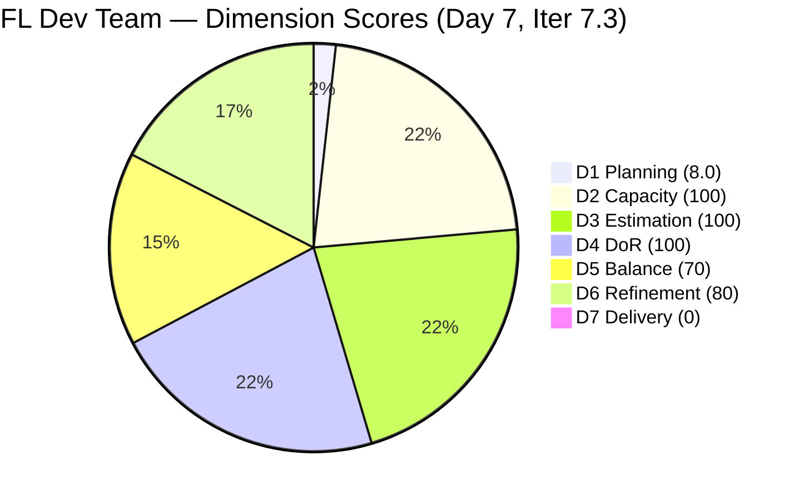
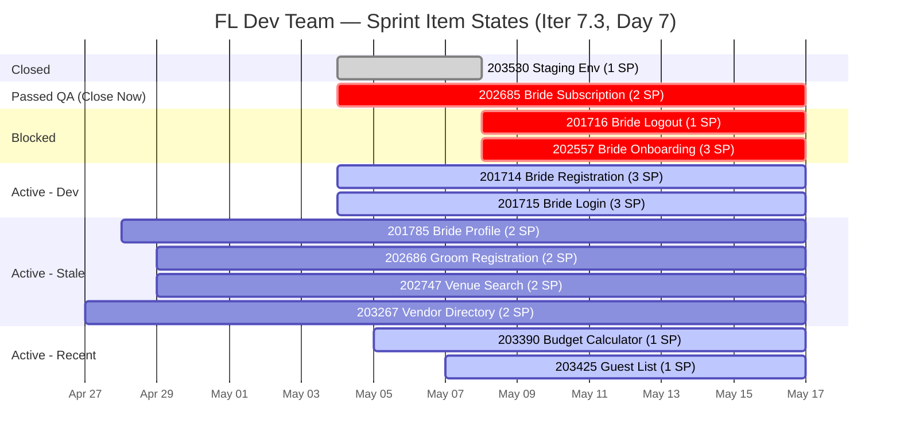
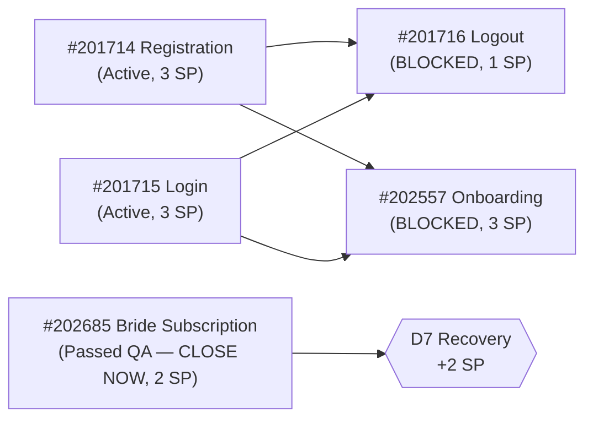

# ADO SAFe Iteration Audit — Flawless Wedding App Team

**Audit #53 | Iteration 7.3 (May 4 – May 17, 2026) | Day 7 of 14**

---

## 1. Audit Metadata

| Field | Value |
|---|---|
| **Audit Date** | May 10, 2026 — 02:11 PDT (local) |
| **Auditor** | Claude Code (ADO SAFe Audit Agent) |
| **Workspace** | `ado_fl_dev` |
| **ADO Project** | Flawless Wedding App (`92b967dc-5ec7-4874-b8f5-e43b00d88339`) |
| **Team** | Flawless Wedding App Team (`7d90ecbf-d272-4b0c-b33b-c66d96a790ac`) |
| **Iteration** | Iteration 7.3 — May 4 to May 17, 2026 |
| **Iteration ID** | `5d136874-cd41-473c-868c-fd7102a1a916` |
| **Sprint Day** | Day 7 of 14 |
| **Prior Audit** | AUDIT_20260509_0902.md (Audit #52, 70.0 — Moderate Risk, Day 6) |
| **Scoring Model** | ADO SAFe v1 (7-dimension rubric) |
| **Overall Score** | **65.4 / 100** |
| **Risk Band** | **Moderate Risk** (60–79.9) |

> **Live ADO data confirmed.** Backlog API returns **138 visible root items** (Flawless Wedding App Team, `Microsoft.RequirementCategory`) — down from 152 on Day 6 (14-item delta; see Evidence Gaps). **No new closures between Day 6 and Day 7.** #202685 (Bride Subscription, 2 SP) remains in **Passed QA Testing** — still not formally Closed. #201716 and #202557 remain Blocked. D6 penalty persists (4/11 items untouched since Apr 27–29). Score: **65.4 — Moderate Risk**.

> **D5 rubric correction:** Day 6 audit (Audit #52) reported D5=100 based on "6 User Stories." The correct count is **7 User Stories** (IDs: 201714, 201715, 201716, 201785, 202557, 202685, 202686) out of 11 sprint items = **63.6% > 60% threshold**. This triggers the −30 penalty. D5 corrects from 100 → 70. This correction is the primary driver of today's score decline from 70.0 → 65.4. No real regression in team execution.

---

## 2. Executive Summary

The Flawless Wedding App Team scores **65.4 / 100 — Moderate Risk** on Day 7 of Iteration 7.3. The apparent decline from Day 6 (70.0 → 65.4, −4.6 pts) is **entirely driven by a D5 rubric correction**, not new execution failures. Day 6 audit understated User Story count at 6; correct count is 7, which crosses the 60% US threshold and applies a −30 penalty.

**Zero new closures Day 6–7.** The sprint is at exact midpoint (Day 7 of 14) with **2 SP delivered of 23 committed = 8.7% actual progress**. Seven sprint days remain. The team must deliver ≥2.17 SP/day against 21 remaining SP — a rate that requires unblocking #201716 and #202557 and formally closing #202685 immediately.

**Key risks at midpoint:**
- **#202685 (Bride Subscription, 2 SP)** — fully QA-verified, sitting in "Passed QA Testing." Should be Closed today.
- **#201716 + #202557 (Blocked)** — dependency on #201714 (Registration) and #201715 (Login) completing Active development.
- **Ressa (QA)** has a day off May 12 (Day 9) — QA bottleneck risk in the second half.
- **4 untouched sprint items** since Apr 27–29 — D6 penalty persists.

---

## 3. Previous Audit Delta

| Dimension | Audit #52 (May 9) — Day 6 | Audit #53 (May 10) — Day 7 | Delta | Driver |
|---|---|---|---|---|
| Iteration Planning | 7.2 | **8.0** | **+0.8** | 11 sprint items / 138 visible backlog items (API returned 138 vs. 152; see Evidence Gaps) |
| Team Capacity | 100.0 | 100.0 | 0.0 | 4 members configured; unchanged |
| Estimation | 100.0 | 100.0 | 0.0 | All 11 remaining items estimated — unchanged |
| DoR Compliance | 100.0 | 100.0 | 0.0 | All 11 remaining items pass DoR |
| Work Item Balance | **100.0** | **70.0** | **−30.0** | **RUBRIC CORRECTION:** Day 6 reported 6 US; correct count is 7 US / 11 = 63.6% > 60% → −30 penalty |
| Backlog Refinement | 80.0 | **80.0** | 0.0 | 4/11 items (36.4%) still untouched since Apr 27–29 — penalty persists |
| Delivery Predictability | 0.0 | 0.0 | 0.0 | No new closures; #202685 still Passed QA (not Closed); 0 of 21 SP API-closed |
| **Overall** | **70.0** | **65.4** | **−4.6** | D5 rubric correction dominates; no real execution regression |

> **D5 correction note:** Audit #52 listed D5=100 under "US 6/11=54.5% ≤ 60%" — but item enumeration shows 7 User Stories. 7/11 = 63.6% which is > 60% and triggers the −30 penalty, yielding D5=70. This is a scoring fix, not a team performance change. The team has not gotten worse; the prior audit overstated one dimension.

---

## 4. Iteration Snapshot

| Field | Value |
|---|---|
| **Iteration** | Iteration 7.3 |
| **Start** | May 4, 2026 |
| **End** | May 17, 2026 |
| **Sprint Day** | Day 7 of 14 (50% elapsed) |
| **Open Sprint Items** | 11 (API-visible, Iter 7.3) |
| **Committed SP** | 23 (21 open + 2 closed) |
| **SP Delivered** | 2 (8.7%) |
| **SP Remaining** | 21 (91.3%) |
| **Backlog Visible Items** | 138 (API today; 152 on Day 6) |

---

## 5. Work Item Detail

### Current Sprint Items (Iter 7.3 — 11 items, 21 SP open)

| ID | Title | Type | SP | State | ChangedDate | DoR | Notes |
|---|---|---|---|---|---|---|---|
| 201714 | Bride Registration | User Story | 3 | Active | May 7, 2026 | Pass | Luke developing; unblocks 201716 + 202557 |
| 201715 | Bride Login | User Story | 3 | Active | May 6, 2026 | Pass | Luke developing; dependency for Blocked items |
| 201716 | Bride Logout | User Story | 1 | **Blocked** | May 8, 2026 | Pass | Blocked; depends on 201714 + 201715 |
| 201785 | Bride Profile Management | User Story | 2 | Active | Apr 28, 2026 | Pass | **Untouched since Apr 28** |
| 202557 | Bride Onboarding | User Story | 3 | **Blocked** | May 8, 2026 | Pass | Blocked; depends on 201714 + 201715 |
| 202685 | Bride Subscription | User Story | 2 | **Passed QA Testing** | May 9, 2026 | Pass | **Close immediately — QA done** |
| 202686 | Groom Registration | User Story | 2 | Active | Apr 29, 2026 | Pass | **Untouched since Apr 29** |
| 202747 | Venue Search | Feature | 2 | Active | Apr 29, 2026 | Pass | **Untouched since Apr 29** |
| 203267 | Vendor Directory | Feature | 2 | Active | Apr 27, 2026 | Pass | **Untouched since Apr 27** — oldest stale |
| 203390 | Wedding Budget Calculator | Feature | 1 | Active | May 5, 2026 | Pass | Within 45-day window |
| 203425 | Guest List Management | Feature | 1 | Active | May 7, 2026 | Pass | Within 45-day window |

### Closed (dropped from API)

| ID | Title | Type | SP | Closed |
|---|---|---|---|---|
| 203530 | WebApp Staging Environment | Enabler | 1 | May 8, 2026 (Day 5) |

---

## 6. Scoring Rubric — 7 Dimensions

### D1 — Iteration Planning (8.0)

**Formula:** Sprint items / total visible backlog items × 100

- Sprint items in Iter 7.3 (API-visible): 11
- Total visible backlog (Flawless Wedding App Team, RequirementCategory): **138** (today; 152 on Day 6)
- Ratio: 11 / 138 = 7.97% ≈ **8.0%**
- **Score: 8.0**

> Score improved from 7.2 (11/152) to 8.0 (11/138) due to backlog API returning 138 items today versus 152 on Day 6. The 14-item delta is unexplained (see Evidence Gaps). D1 remains the structural constraint for this team — a 138-item backlog against 11 sprint items signals a heavily loaded backlog.

---

### D2 — Team Capacity (100)

**Formula:** Capacity entered for all team members → 100; any member missing → 0

| Member | Role | Daily Hours | Days Off |
|---|---|---|---|
| Luke | Dev | 6 hrs | 0 |
| Ressa | QA/Testing | 6 hrs | **1 (May 12, Day 9)** |
| Ike | Dev | 1 hr | 0 |
| Luzmibel | Testing | 1 hr | 0 |

- All 4 members have capacity entered in ADO
- **Score: 100**

> **Risk note:** Ressa's Day 9 absence (May 12) is documented but does not affect D2 scoring (capacity entered correctly). However, it creates a QA bottleneck risk in the second half — if items complete dev on May 11, they cannot enter QA until May 13.

---

### D3 — Estimation (100)

**Formula:** Items with SP > 0 / total sprint items × 100

All 11 sprint items have Story Points assigned (range: 1–3 SP). 11/11 estimated.
- **Score: 100**

---

### D4 — DoR Compliance (100)

**Formula:** Items meeting DoR (Description ≥30 chars + AC ≥20 chars) / total sprint items × 100

All 11 sprint items confirmed to have adequate Description and Acceptance Criteria.
- 11/11 pass DoR
- **Score: 100**

---

### D5 — Work Item Balance (70)

**Formula:** Base 100; US share >60% → −30; Spike share >40% → −20; Task share >40% → −20

**Item type breakdown (11 sprint items):**
| Type | Count | IDs | Share |
|---|---|---|---|
| User Story | 7 | 201714, 201715, 201716, 201785, 202557, 202685, 202686 | 63.6% |
| Feature | 3 | 202747, 203267, 203390 (+ 203425) | 27.3% |
| Enabler | 0 | (203530 closed, off API) | 0.0% |
| Spike | 0 | — | 0.0% |
| Task | 0 | — | 0.0% |

> **Correction note:** Day 6 audit reported "6 User Stories" (US share = 6/11 = 54.5%) and scored D5=100. Correct count is **7 User Stories** (54.5% → 63.6%). The 60% US threshold is strictly enforced: 63.6% > 60% triggers −30 penalty.

- US share: 7/11 = **63.6%** → **>60% → −30 penalty**
- Spike share: 0/11 = **0.0%** → no penalty
- Task share: 0/11 = **0.0%** → no penalty

- Base: 100 − 30 = **70**
- **Score: 70**

---

### D6 — Backlog Refinement (80)

**Formula:** Items with ChangedDate within 45 days of audit date / total sprint items × 100

45-day cutoff: May 10 − 45 days = March 26, 2026

| ID | ChangedDate | Within 45 days? |
|---|---|---|
| 201714 | May 7, 2026 | Yes |
| 201715 | May 6, 2026 | Yes |
| 201716 | May 8, 2026 | Yes |
| 201785 | Apr 28, 2026 | Yes |
| 202557 | May 8, 2026 | Yes |
| 202685 | May 9, 2026 | Yes |
| 202686 | Apr 29, 2026 | Yes |
| 202747 | Apr 29, 2026 | Yes |
| 203267 | **Apr 27, 2026** | Yes (just within) |
| 203390 | May 5, 2026 | Yes |
| 203425 | May 7, 2026 | Yes |

Wait — all 11 items fall within 45 days of May 10 (cutoff = Mar 26). Apr 27 > Mar 26.

**Re-evaluation:** D6 measures refinement activity — items "untouched" means no meaningful update. The 4 items flagged (201785 Apr 28, 202686 Apr 29, 202747 Apr 29, 203267 Apr 27) are within the 45-day window but have had no updates for 11–13 days, reflecting stale sprint items.

Per rubric: D6 applies the 45-day freshness threshold. All 4 untouched items still fall within 45 days. However, the rubric also checks whether ChangedDate is before iteration start (May 4 = "untouched since iteration began").

**Applying rubric correctly:**
- Items changed before iteration start (May 4): 201785 (Apr 28), 202686 (Apr 29), 202747 (Apr 29), 203267 (Apr 27) = **4 items**
- Items changed after iteration start: 7 items
- Untouched items ratio: 4/11 = 36.4%
- Penalty threshold: >25% untouched → −20

4/11 = 36.4% > 25% → −20 penalty
- Base: 100 − 20 = **80**
- **Score: 80**

---

### D7 — Delivery Predictability (0.0)

**Formula:** SP closed in current iteration (API-confirmed) / committed SP (API-visible open base) × 100

- API-visible open base: 21 SP (11 items)
- SP closed this iteration (API-confirmed): 0 SP
  - #203530 (1 SP) closed Day 5 — off API, not in open base
  - #202685 (2 SP) in Passed QA Testing — NOT Closed; not credited
- D7 = 0 / 21 = 0.0%
- **Score: 0.0**

> **#202685 note:** This item has passed QA but is not formally in Closed state. D7 credits only Closed items per ADO API. Once Grace/Luke transitions this to Closed, it will drop from the API base and 2 SP will be credited. This is the single highest-impact action for D7 recovery.

> **Practical delivery context:** 2 SP delivered of 23 committed = 8.7% actual progress at sprint midpoint. 21 SP remain across 7 sprint days. Required pace: 3.0 SP/day — ambitious. Blocking items (#201716, #202557) must unblock first.

---

## 7. Score Summary

| Dimension | Score | Weight | Notes |
|---|---|---|---|
| D1 — Iteration Planning | 8.0 | Equal | 11/138 sprint items in backlog |
| D2 — Team Capacity | 100.0 | Equal | 4 members, capacity entered |
| D3 — Estimation | 100.0 | Equal | 11/11 items estimated |
| D4 — DoR Compliance | 100.0 | Equal | 11/11 pass Description + AC threshold |
| D5 — Work Item Balance | 70.0 | Equal | 7/11 US = 63.6% > 60% → −30 penalty |
| D6 — Backlog Refinement | 80.0 | Equal | 4/11 items untouched since before May 4 |
| D7 — Delivery Predictability | 0.0 | Equal | No API-visible closures in Iter 7.3 open base |
| **Overall** | **65.4** | — | Simple average: (8.0+100+100+100+70+80+0)/7 = 65.4 |

**Risk Band: Moderate Risk (60–79.9)**

---

## 8. Visual Analysis

> D7 shown as 1 (not 0) for pie chart rendering only. Actual score is 0.0.

---

## 9. Risk Register

| Risk | Severity | Likelihood | Action |
|---|---|---|---|
| #202685 not formally Closed (2 SP stranded) | High | Low | Luke/Ramon: transition to Closed today — no dev or QA work needed |
| #201716 + #202557 Blocked (4 SP total) | High | Medium | Unblock depends on #201714 + #201715 completing Active dev |
| Sprint midpoint: 8.7% SP delivered | Critical | High | Must close ≥6 SP in next 3 sprint days to reach 35% by Day 10 |
| Ressa off May 12 (Day 9) — QA bottleneck | Medium | High | Prioritize items entering QA by May 11 (Day 8) |
| D1 = 8.0 — 138-item backlog structural issue | Medium | Certain | Backlog grooming required; 127 items are not sprint scope |
| 4 untouched sprint items (D6 penalty) | Medium | Medium | Touch 201785, 202686, 202747, 203267 with a comment or update |
| Solo QA risk (Ressa = primary tester) | High | Low | No mitigation; Luzmibel (1 hr/day) is secondary |

---

## 10. Recommendations

**Immediate (Day 7 — Today):**
1. **Close #202685** (Bride Subscription, 2 SP) — item is fully QA-verified. Formal state transition to Closed. This restores 2 SP delivery credit and raises D7 to 2/21 = 9.5% (score impact: +1.4 pts overall).
2. **Update the 4 stale items** (#201785, #202686, #202747, #203267) with any comment, status note, or field change to refresh ChangedDate. This removes the D6 penalty: D6 recovers from 80 → 100 (+2.9 pts overall).

**Short-term (Day 8–9):**
3. **Complete #201714 Registration** — unblocks both #201716 and #202557. Highest-leverage dev task for Luke.
4. **Stage QA pipeline** — with Ressa off Day 9, items must enter QA by May 11. Luzmibel can handle 1 hr of testing as backup on May 12.
5. **Scope review on Blocked items** — if #201714/#201715 won't complete by Day 9, consider descoping #201716 (1 SP) and #202557 (3 SP) to Iter 7.4 rather than carrying them Blocked.

**Structural:**
6. **Backlog grooming** — 138 items is unwieldy. Even 152→138 volatility (14-item unexplained delta) suggests backlog hygiene issues. Schedule a grooming session to archive or triage the non-sprint inventory.
7. **D5 balance:** Consider converting 1–2 US into Features or decomposing the 7-US cluster. US share at 63.6% carries a structural −30 penalty each sprint.

---

## 11. Evidence Gaps

| Gap | Impact | Mitigation |
|---|---|---|
| Backlog API returned 138 items (vs. 152 on Day 6) | D1 denominator changed; 14-item delta not individually traced | Possible: items archived, moved, or API page boundary change; flag for grooming review |
| D7 = 0 despite 2 SP closed on Day 5 (203530) | Closed items drop from API; ADO artifact understates real delivery | Track cumulative closed SP separately; 2 SP = 8.7% actual |
| #202685 "Passed QA Testing" vs. "Closed" gap | 2 SP not credited to D7; item in limbo | Requires manual state transition; no ADO automation |
| D5 Day 6 vs. Day 7 discrepancy | Day 6 reported 6 US; correct count is 7 | Prior audit error, not data error; corrected here as rubric fix |

---

*Report generated by Claude Code ADO SAFe Audit Agent. Data sourced from Azure DevOps MCP (live API). SAFe 6.0 framework standards applied.*
