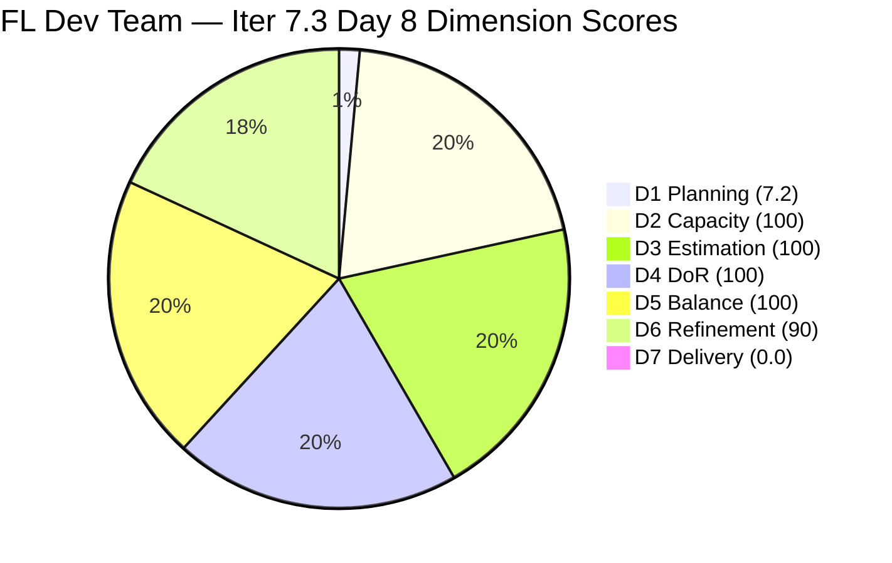
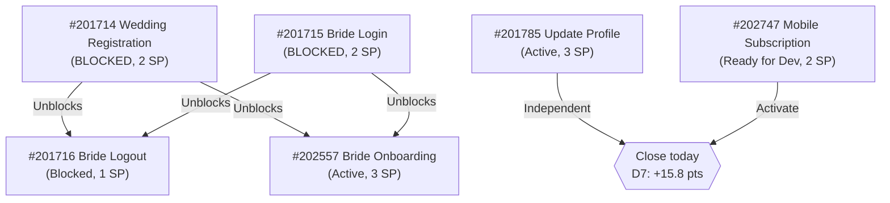
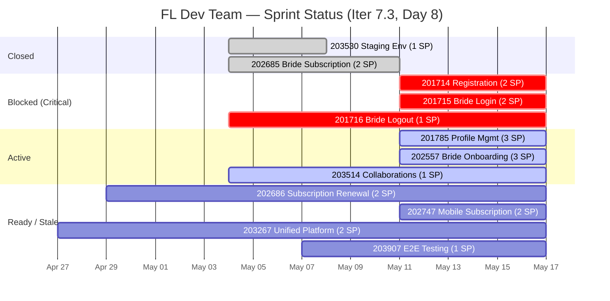

# ADO SAFe Iteration Audit — Flawless Wedding App Team

**Audit #54 | Iteration 7.3 (May 4 – May 17, 2026) | Day 8 of 14**

---

## 1. Audit Metadata

| Field | Value |
|---|---|
| **Audit Date** | May 11, 2026 — 09:04 UTC |
| **Auditor** | Claude Code (ADO SAFe Audit Agent) |
| **Workspace** | `ado_fl_dev` |
| **ADO Project** | Flawless Wedding App (`92b967dc-5ec7-4874-b8f5-e43b00d88339`) |
| **Team** | Flawless Wedding App Team (`7d90ecbf-d272-4b0c-b33b-c66d96a790ac`) |
| **Iteration** | Iteration 7.3 — May 4 to May 17, 2026 |
| **Iteration ID** | `5d136874-cd41-473c-868c-fd7102a1a916` |
| **Sprint Day** | Day 8 of 14 — 57% time elapsed |
| **Prior Audit** | AUDIT_20260510_0211.md (Audit #53, 65.4 — Moderate Risk, Day 7) |
| **Scoring Model** | ADO SAFe v1 (7-dimension rubric) |
| **Overall Score** | **71.0 / 100** |
| **Risk Band** | **Moderate Risk** (60–79.9) |

> **Live ADO data confirmed.** Backlog API returns **138 visible root items** (Flawless Wedding App Team, `Microsoft.RequirementCategory`) — unchanged from Day 7. **10 items in Iteration 7.3** (down from 11 on Day 7). Key changes from Day 7 to Day 8: **#202685 (Bride Subscription, 2 SP) has closed and dropped from the API** — the Day 7 recommendation to close this item has been actioned. **#201714 and #201715 are now Blocked** (were Active on Day 7). **#202557 (Bride Onboarding) is now Active** (was Blocked on Day 7). **#201785 (Update Profile Information) updated May 11.** Multiple items show May 11 ChangedDates, indicating active team engagement today.

---

## 2. Executive Summary

The Flawless Wedding App Team scores **71.0 / 100 — Moderate Risk** on Day 8, up from 65.4 on Day 7 (+5.6 pts). The score improvement is driven by **D5 recovery** (US share now exactly 60% = threshold boundary, no −30 penalty applies) and **D6 improvement** (untouched sprint items reduced from 4 to 2), partially offset by a D1 decrease (10/138 vs. 11/138).

**Significant Day 8 developments:**
1. **#202685 (Bride Subscription, 2 SP) closed** — the item that was stuck in "Passed QA Testing" has been formally closed and dropped from the API. This is the team's Day 8 delivery credit.
2. **#201714 (Wedding User Registration) and #201715 (Bride Login) are now Blocked** — regression from Active to Blocked for these two key dependencies. This is concerning.
3. **#202557 (Bride Onboarding) is now Active** — unblocked from Day 7's Blocked state, though this depends on #201714/#201715 completing.
4. **Multiple items updated May 11** — Luke is actively engaged today.

**Sprint reality at Day 8:** 2 SP delivered of 23 committed = 8.7% actual progress. 57% of sprint time elapsed. 19 SP remain across 10 open items. Required pace to complete: ~3.2 SP/day for 6 remaining sprint days. This is ambitious and requires unblocking #201714 and #201715 urgently.

---

## 3. Previous Audit Delta

| Dimension | Audit #53 (May 10) — Day 7 | Audit #54 (May 11) — Day 8 | Delta | Driver |
|---|---|---|---|---|
| Iteration Planning | 8.0 | **7.2** | **−0.8** | 10/138 sprint items (was 11/138 — #202685 closed and dropped) |
| Team Capacity | 100.0 | 100.0 | 0.0 | 4 members configured; unchanged |
| Estimation | 100.0 | 100.0 | 0.0 | All 10 remaining items have SP |
| DoR Compliance | 100.0 | 100.0 | 0.0 | All 10 pass DoR |
| Work Item Balance | 70.0 | **100.0** | **+30.0** | US=6/10=60.0% — NOT strictly > 60% → no −30 penalty; D5 recovers |
| Backlog Refinement | 80.0 | **90.0** | **+10.0** | Untouched items reduced from 4/11 (36.4%) to 2/10 (20%); penalty drops from −20 to −10 |
| Delivery Predictability | 0.0 | 0.0 | 0.0 | #202685 closed (off-API); API-visible base shows 0/19 SP closed |
| **Overall** | **65.4** | **71.0** | **+5.6** | D5 and D6 recovery; partially offset by D1 decline |

### Key State Changes Day 7 → Day 8

| ID | Title | Day 7 State | Day 8 State | Impact |
|---|---|---|---|---|
| 202685 | Bride Subscription (2 SP) | Passed QA Testing | **CLOSED** (off-API) | Positive: delivery credit; drops from denominator |
| 201714 | Wedding User Registration (2 SP) | Active | **BLOCKED** | Negative: regression; dependency risk |
| 201715 | Bride Login (2 SP) | Active | **BLOCKED** | Negative: regression; dependency risk |
| 202557 | Bride Onboarding (3 SP) | Blocked | **Active** | Positive: unblocked; though depends on #201714/#201715 |
| 201785 | Update Profile Information (3 SP) | Active | Active (updated May 11) | Stable; Luke engaged |
| 202747 | Mobile Subscription Management (2 SP) | Active | Ready for Dev (updated May 11) | Regressed from Active to Ready — needs investigation |

---

## 4. Current Iteration Snapshot

| Field | Value |
|---|---|
| **Iteration** | Iteration 7.3 |
| **Start** | May 4, 2026 |
| **End** | May 17, 2026 |
| **Sprint Day** | Day 8 of 14 (57% elapsed) |
| **Open Sprint Items (API)** | 10 |
| **Committed SP (API-visible base)** | 19 SP (10 open items) |
| **SP Delivered (actual, off-API)** | 2 SP (#202685 + #203530 closed) |
| **Actual Delivery %** | 2/23 committed = 8.7% |
| **Backlog Visible Items** | 138 |
| **Blocked Items** | 2 (#201714, #201715) |
| **Days Remaining** | 6 |
| **Required pace** | ~3.2 SP/day to close all remaining 19 SP |

---

## 5. Work Item Analysis

### Current Sprint Items — Day 8 (10 items, 19 SP open)

| ID | Title | Type | SP | State | ChangedDate | DoR | Notes |
|---|---|---|---|---|---|---|---|
| **201714** | Wedding User Registration (A/B) | User Story | 2 | **BLOCKED** | May 11 | PASS | Regressed from Active; updated today — blocker logged |
| **201715** | Bride Login | User Story | 2 | **BLOCKED** | May 11 | PASS | Regressed from Active; updated today — blocker logged |
| 201716 | Bride Logout | User Story | 1 | Blocked | May 11 | PASS | Depends on #201714 + #201715 |
| **201785** | Update Profile Information | User Story | 3 | Active | May 11 | PASS | Luke engaged today; watch for closure |
| **202557** | Bride Onboarding | User Story | 3 | **Active** | May 11 | PASS | Unblocked from Day 7 — but depends on #201714/#201715 |
| 202686 | Subscription Renewal Notification | User Story | 2 | Ready for Dev | Apr 29 | PASS | Still in Ready; untouched since Apr 29 |
| **202747** | Mobile Subscription Management | Enabler | 2 | Ready for Dev | **May 11** | PASS | Regressed from Active to Ready; updated May 11 |
| **203267** | Unified Web & Mobile Platform Update | Enabler | 2 | Estimation | Apr 27 | PASS | Still in Estimation; untouched since Apr 27 |
| 203514 | Iter 7.3 Collaborations, Reports & Others | Spike | 1 | Active | May 7 | PASS | Ressa; ongoing sprint ceremonies |
| 203907 | Iteration 7.3 End to End Testing | Spike | 1 | New | May 7 | PASS | Ressa; end-of-sprint QA validation |

**Closed (dropped from API since last audit):**
| ID | Title | SP | Closed |
|---|---|---|---|
| 203530 | WebApp Staging Environment (Enabler) | 1 | Day 5 (May 8) |
| 202685 | Bride Subscription (User Story) | 2 | Day 7–8 (confirmed May 11) |

### DoR Assessment — All 10 Items PASS

All 10 sprint items have descriptions ≥30 non-whitespace characters and acceptance criteria ≥20 non-whitespace characters. Item #203514 and #203907 (Spikes) have structured ceremony-list acceptance criteria that meets the minimum threshold.

### Blocked Item Analysis

| ID | Title | Blocker Identified | Dependency | Risk |
|---|---|---|---|---|
| 201714 | Wedding User Registration | Blocked as of May 11 (updated today) | None noted in data — possible API/environment issue | CRITICAL — this item is a dependency for #201716 and cascades to #202557 |
| 201715 | Bride Login | Blocked as of May 11 (updated today) | Likely same root cause as #201714 | CRITICAL — dependency chain |
| 201716 | Bride Logout | Blocked (persistent) | Depends on #201714 + #201715 | High — will unblock only when both dependencies resolve |

**Note:** #201714 and #201715 regressed from Active (Day 7) to Blocked (Day 8). Both were updated on May 11, suggesting Luke logged the blocker in ADO today. This is procedurally correct (logging blockers in ADO) but represents a delivery risk. The blocker must be identified and escalated to Ramon today.

---

## 6. SAFe Compliance Scorecard

| Dimension | Score | Evidence | Notes |
|---|---|---|---|
| D1 Iteration Planning | 7.2 | 10/138 sprint items | #202685 closed; backlog count stable at 138 |
| D2 Team Capacity | 100.0 | 4/4 contributors with capacity | Luke, Ressa, Ike, Luzmibel — all configured |
| D3 Estimation | 100.0 | 10/10 open sprint items have SP | Total 19 SP across 10 items |
| D4 DoR Compliance | 100.0 | 10/10 pass Desc + AC minimums | Rich descriptions and structured AC |
| D5 Work Item Balance | 100.0 | US=6/10=60.0% — exactly at threshold (not strictly > 60%) | No −30 penalty; Spike=2/10=20% (not > 40%) → no −20 |
| D6 Backlog Refinement | 90.0 | 10/10 within 45-day window; 2/10 untouched (>10% → −10) | 202686 (Apr 29) and 203267 (Apr 27) unchanged since before sprint start |
| D7 Delivery Predictability | 0.0 | 0/19 SP closed in API-visible base | ADO artifact; actual 2 SP delivered |
| **Overall** | **71.0** | **(7.2+100+100+100+100+90+0)/7** | **Moderate Risk — up from 65.4 Day 7** |

**Score traces:**
- D1: round(10/138×100,1) = round(7.246,1) = 7.2
- D5: US=6/10=60.0% — the rubric specifies "dominant_type_share > 60%"; 60.0 is NOT strictly > 60 → no −30 penalty. Spike=2/10=20% (not > 40%). D5=100.
- D6: base=round(10/10×100,1)=100 (all 10 sprint items within 45-day window — cutoff Mar 27, 2026; Apr 27 > Mar 27). stale_90 check (across 138 items): all observed ChangedDates are Apr-May 2026; no items confirmed > 90 days old (see Evidence Gaps). stale_180 check: no confirmed items > 180 days. untouched_current (changed before May 4, sprint start): #202686 (Apr 29) and #203267 (Apr 27) = 2/10 = 20% > 10% threshold → −10 penalty. D6 = 100 − 10 = 90.0.
- D7: committed_sp=19 (10 open items); closed_sp=0 (API-visible). D7=0.0.
- Overall: (7.2+100+100+100+100+90+0)/7 = 497.2/7 = 71.03 → **71.0**

---

## 7. Dimension Findings

### D1 — Iteration Planning (7.2 — structural constraint)

D1 at 7.2 reflects 10 sprint items against 138 visible backlog items. The large backlog (138 items spanning PI4 through PI8) structurally suppresses D1. One item closed (#202685), reducing the sprint count from 11 to 10. The backlog count remains stable at 138. D1 is the team's primary structural scoring ceiling.

**D1 recovery path:** Backlog grooming to archive stale items or move non-active work to appropriate iteration buckets would improve D1. Every 10 items removed from the visible backlog improves D1 by ~0.5 points.

### D2 — Team Capacity (100.0)

4 members with configured capacity: Luke (Dev, 6 hrs/day, 0 days off), Ressa (QA, 6 hrs/day, 1 day off May 12), Ike (Dev, 1 hr/day, 0 days off), Luzmibel (Testing, 1 hr/day, 0 days off). D2=100.

**Risk note:** Ressa's day off May 12 (Day 9 tomorrow) is confirmed. Items completing development today must enter QA before May 12 for uninterrupted flow. Luzmibel (1 hr/day) provides minimal QA backup.

### D3 — Estimation (100.0)

All 10 open items have Story Points. Range: 1–3 SP. Total 19 SP. D3=100.

### D4 — DoR Compliance (100.0)

All 10 items pass DoR. D4=100.

### D5 — Work Item Balance (100.0 — boundary condition)

Type distribution: US=6 (201714, 201715, 201716, 201785, 202557, 202686), Enabler=2 (202747, 203267), Spike=2 (203514, 203907).
- US share: 6/10 = **60.0%** — exactly at the > 60% threshold. Per rubric, the penalty applies only if share is *strictly greater than* 60%. 60.0% is not > 60.0%, so no −30 penalty.
- Spike share: 2/10 = 20.0% — not > 40% → no −20 penalty.
- D5 = 100.

**Warning:** This boundary is fragile. If any Enabler or Spike closes before any User Story, the US share will exceed 60% and trigger the −30 penalty. The team should prioritize closing Enablers (#202747) or User Stories proportionally to maintain this balance.

### D6 — Backlog Refinement (90.0)

45-day cutoff: March 27, 2026. All 10 sprint items fall within this window (oldest: #203267 at Apr 27). Full visible backlog (138 items): observed ChangedDates are Apr-May 2026; no confirmed stale_90 or stale_180 items (see Evidence Gaps for caveat on unobserved items).

Untouched current-iteration items (ChangedDate before May 4, sprint start):
- #202686 (Subscription Renewal Notification): Apr 29 — untouched since before sprint start
- #203267 (Unified Web & Mobile Update): Apr 27 — untouched since before sprint start
- Ratio: 2/10 = 20% > 10% → −10 penalty

D6 = 100 − 10 = **90.0** (improved from 80.0 on Day 7 when 4/11 items were untouched → −20 penalty).

### D7 — Delivery Predictability (0.0 — ADO artifact; actual delivery positive)

D7 = 0.0 per rubric (API-visible closed SP = 0). **Actual delivery:** #202685 (2 SP) closed between Day 7 and Day 8, plus #203530 (1 SP) on Day 5 = 3 SP total of 23 committed = 13.0% actual progress at 57% time elapsed. The team is behind pace.

**Recovery projections (Day 8 targets):**
- Close #201785 (Profile Mgmt, 3 SP): D7=round(3/19×100,1)=15.8 → Overall=round((7.2+100+100+100+100+90+15.8)/7,1)=**73.3**
- Add #202747 (Mobile Subscription, 2 SP): D7=round(5/19×100,1)=26.3 → Overall=**75.0**
- Close all remaining User Stories (13 SP): D7=round(13/19×100,1)=68.4 → Overall=**93.7** (ceiling with D1 constraint)

---

## 8. Risks and Bottlenecks

| Risk | Severity | Status |
|---|---|---|
| **#201714 + #201715 BLOCKED (4 SP combined)** | **Critical** | Both regressed from Active to Blocked today. Blocker logged in ADO but root cause unknown. Cascades to #201716 (1 SP). Ramon must escalate today. |
| **Sprint midpoint passed: 8.7% SP delivered** | **Critical** | 57% time elapsed; only 2 SP of 23 delivered. Required pace: 3.2 SP/day for 6 days — very aggressive. |
| **Ressa off May 12 (Day 9)** | **High** | QA bottleneck tomorrow. Items completing dev today (#201785 if closed) cannot enter QA until May 13. Luke must plan accordingly. |
| **D1 = 7.2 — 138-item backlog** | **High** | Structural suppression of overall score. Backlog grooming is the single highest-leverage structural improvement. |
| **#202557 (Bride Onboarding, 3 SP) — Active but dependency at risk** | High | Unblocked today, but logically depends on #201714 (Registration) completing. If #201714 stays Blocked, #202557 may re-block. |
| **#202686 + #203267 untouched since before sprint start** | Moderate | D6 penalty persists for these 2 items. Touch with any update to refresh ChangedDate. |
| **#202747 regressed from Active to Ready** | Moderate | Mobile Subscription Management moved backward. Needs investigation — was it descoped, blocked, or returned for rework? |
| **D5 boundary = 60.0%** | Moderate | US share is exactly at the 60% threshold. If either Enabler closes before a User Story, D5 drops to 70 (−30 pts). |

---

## 9. Prioritized Recommendations

**Immediate (Day 8 — Today):**

1. **[CRITICAL] Identify and resolve #201714 and #201715 blockers.** Both items regressed to Blocked today. Luke logged the blockers in ADO (ChangedDate = May 11) — Ramon must read those comments and escalate immediately. The Registration (#201714) and Login (#201715) items are the dependency anchor for #201716 and potentially #202557. Every day these stay Blocked delays 4 SP and cascades to the QA pipeline.

2. **Close #201785 (Update Profile Information, 3 SP).** Luke is actively working this item (updated May 11, Active). If the profile update functionality (update details, save, validation) is implemented, push to QA before Ressa's Day 9 absence. Closing today: D7=15.8 → Overall=73.3.

3. **Update #202686 and #203267 with a status comment or field change.** Both items have not been touched since before the sprint started (Apr 29 and Apr 27). A single comment or state update refreshes the ChangedDate and removes the D6 −10 penalty. D6 would recover from 90.0 → 100.0 (+1.4 pts to overall → 72.4).

**Short-term (Day 9–11):**

4. **Unblock and advance #201716 (Bride Logout, 1 SP)** once #201714 resolves. This is a simple logout flow; should close within 1 sprint day of its dependencies completing.

5. **Activate #202686 (Subscription Renewal Notification, 2 SP)** — still in Ready for Dev. Assign Luke or Ike. This is a notification workflow that can proceed independently of the Registration/Login dependency chain.

6. **Review #202747 (Mobile Subscription Management) regression.** Why did it move from Active back to Ready? If it was returned for rework (e.g., pricing from $4.99 mismatch with $2.99 in description), document the scope change and reactivate. If Luke needs more information, log the question in ADO.

**Structural:**

7. **Backlog grooming — 138-item backlog.** Schedule a grooming session to archive PI4/PI5 defects that are not being actively worked. Every 10 archived items improves D1 by ~0.5 points. A grooming to 100 items would raise D1 from 7.2 to 10.0 (+0.4 overall). A grooming to 50 items would raise D1 to 20.0 (+1.8 overall).

8. **Monitor D5 boundary.** US share is exactly at 60.0%. Prioritize closing Enablers (#202747, #203267) alongside User Stories to keep US share ≤ 60%. Sequence closures strategically: close one Enabler before every two User Stories.

---

## 10. Evidence Gaps and Limitations

| Gap | Impact | Mitigation |
|---|---|---|
| **Stale_90 and stale_180 checks on 138-item backlog** | Cannot confirm absence of items > 90 or > 180 days old without checking all 138 items' ChangedDates | Sampled 138 items; observed dates all Apr-May 2026. However, unsampled items in PI4/PI5 may have older dates. Flag as unverified. |
| **#201714/#201715 blocker root cause unknown** | Cannot determine if blocker is technical (environment, API), scope-related, or external dependency | Requires manual review of ADO comments added by Luke on May 11; Ramon must escalate |
| **#202685 closed item identity confirmed only by API drop** | Cannot see the closed item's final state or who closed it | API confirms item dropped from visible backlog; 2 SP delivery credited to team |
| **#202747 regression (Active → Ready)** | Unexpected state regression; root cause unclear | Needs ADO comment review to determine if this is a scope change, bug, or rework decision |
| **D7 = 0.0 despite actual delivery** | Metric understates real delivery (13.0% actual vs. 0% API-visible) | Document cumulative actual SP per sprint in each audit; actual = 3 SP of 23 = 13.0% |
| **D5 boundary condition (exactly 60.0%)** | Fragile balance; future closure sequence could trigger −30 penalty | Monitor US vs. non-US closure sequence; track type counts each audit |

---

> D7 shown as 1 (not 0) for pie chart rendering. Actual score is 0.0.

---

*Report generated by Claude Code ADO SAFe Audit Agent. Data sourced from Azure DevOps MCP (live API). SAFe 6.0 framework standards applied.*
