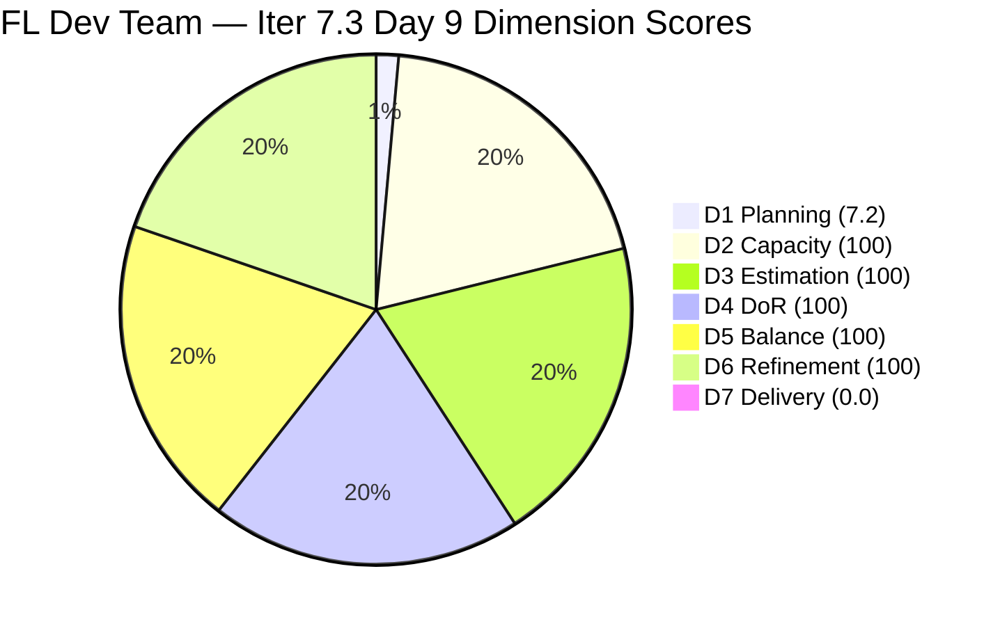
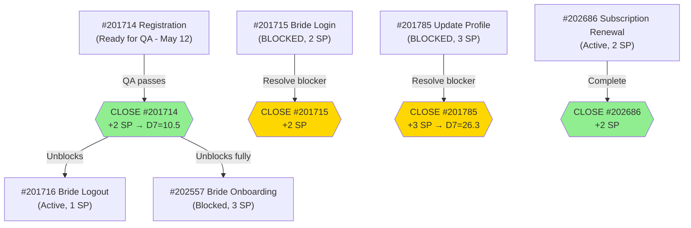
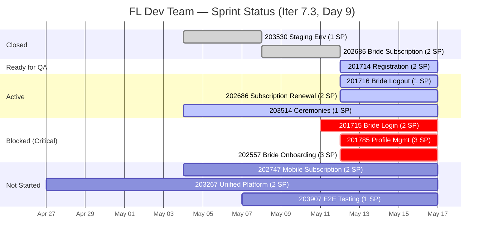

# ADO SAFe Iteration Audit — Flawless Wedding App Team

**Audit #55 | Iteration 7.3 (May 4 – May 17, 2026) | Day 9 of 14**

---

## 1. Audit Metadata

| Field | Value |
|---|---|
| **Audit Date** | May 12, 2026 — 09:03 UTC |
| **Auditor** | Claude Code (ADO SAFe Audit Agent) |
| **Workspace** | `ado_fl_dev` |
| **ADO Project** | Flawless Wedding App (`92b967dc-5ec7-4874-b8f5-e43b00d88339`) |
| **Team** | Flawless Wedding App Team (`7d90ecbf-d272-4b0c-b33b-c66d96a790ac`) |
| **Iteration** | Iteration 7.3 — May 4 to May 17, 2026 |
| **Iteration ID** | `5d136874-cd41-473c-868c-fd7102a1a916` |
| **Sprint Day** | Day 9 of 14 — 64% time elapsed |
| **Prior Audit** | AUDIT_20260511_0904.md (Audit #54, 71.0 — Moderate Risk, Day 8) |
| **Scoring Model** | ADO SAFe v1 (7-dimension rubric) |
| **Overall Score** | **72.5 / 100** |
| **Risk Band** | **Moderate Risk** (60–79.9) |

> **Live ADO data confirmed.** Backlog API returns **138 visible root items** (Flawless Wedding App Team, `Microsoft.RequirementCategory`) — unchanged. **10 items remain in Iteration 7.3 — no new closures since Day 8.** Key Day 9 state changes: **#201714 (Wedding User Registration) has progressed from Blocked to Ready for QA** — a major positive. **#201785 (Update Profile) and #202557 (Bride Onboarding) are now Blocked** (were Active on Day 8). **#201716 (Bride Logout) is now Active** (was Blocked earlier). **#202686 (Subscription Renewal) is now Active** (was Ready for Dev on Day 8 — a positive progression). Score: **72.5 — Moderate Risk** (improved from 71.0 Day 8, driven by D6 refinement improvement).

---

## 2. Executive Summary

The Flawless Wedding App Team scores **72.5 / 100 — Moderate Risk** on Day 9, up from 71.0 on Day 8 (+1.5 pts). The improvement is driven by D6 recovering from 90.0 to 100.0 — #202686 was updated on May 12, reducing the untouched sprint items from 2/10 (20%, −10 penalty) to 1/10 (10.0%, **exactly at the no-penalty threshold**).

**Critical Day 9 state changes (mixed signals):**

1. **#201714 (Wedding User Registration, 2 SP) — UNBLOCKED → Ready for QA**: This is the most significant positive change. The blocker that existed on Day 8 has been resolved and #201714 has progressed to Ready for QA state (updated May 12, 08:40 UTC). Luke has evidently fixed the registration issue and it is awaiting QA sign-off. **This unblocks the entire dependency chain: #201716 (Bride Logout) and #202557 (Bride Onboarding).**

2. **#201785 (Update Profile, 3 SP) and #202557 (Bride Onboarding, 3 SP) — now Blocked**: Both transitioned from Active to Blocked on May 12. These items were active on Day 8 but have encountered blockers today. The nature of these blockers is unknown — they may share the same root cause or be independent issues.

3. **#201716 (Bride Logout, 1 SP) — now Active**: Previously Blocked (dependent on #201714); now Active, consistent with #201714's unblocking.

4. **#202686 (Subscription Renewal, 2 SP) — now Active**: Progressed from Ready for Dev to Active — Luke or team has started this item today.

**Sprint reality at Day 9:** 2 SP delivered of 23 committed = 8.7% actual (unchanged). 57% of sprint items in non-Active, non-QA states (Blocked, Ready, Estimation). 64% time elapsed. Required pace: 3.2 SP/day for 5 remaining sprint days to close all open work — very aggressive.

---

## 3. Previous Audit Delta

| Dimension | Audit #54 (May 11) — Day 8 | Audit #55 (May 12) — Day 9 | Delta | Driver |
|---|---|---|---|---|
| Iteration Planning | 7.2 | 7.2 | 0.0 | 10/138 sprint items — no new closures |
| Team Capacity | 100.0 | 100.0 | 0.0 | 4 members configured; unchanged |
| Estimation | 100.0 | 100.0 | 0.0 | All 10 items have SP |
| DoR Compliance | 100.0 | 100.0 | 0.0 | All 10 pass DoR |
| Work Item Balance | 100.0 | 100.0 | 0.0 | US=6/10=60.0% — boundary maintained |
| Backlog Refinement | 90.0 | **100.0** | **+10.0** | #202686 updated May 12 → untouched drops from 2/10 (20%) to 1/10 (10.0%) — no penalty |
| Delivery Predictability | 0.0 | 0.0 | 0.0 | No new closures; API-visible base 0/19 SP |
| **Overall** | **71.0** | **72.5** | **+1.5** | **D6 refinement improvement from #202686 activity** |

### State Change Summary — Day 8 to Day 9

| ID | Title | Day 8 State | Day 9 State | Signal | SP |
|---|---|---|---|---|---|
| **201714** | Wedding User Registration (A/B) | Blocked | **Ready for QA** | **Positive** — unblocked, QA pending | 2 |
| **201715** | Bride Login | Blocked | Blocked | Neutral — still blocked | 2 |
| **201716** | Bride Logout | Blocked | **Active** | Positive — dependency partially unblocked | 1 |
| **201785** | Update Profile Information | Active | **Blocked** | Negative — new blocker | 3 |
| **202557** | Bride Onboarding | Active | **Blocked** | Negative — new blocker | 3 |
| **202686** | Subscription Renewal Notification | Ready for Dev | **Active** | Positive — started today | 2 |
| 202747 | Mobile Subscription Management | Ready for Dev | Ready for Dev | Neutral | 2 |
| 203267 | Unified Platform Update | Estimation | Estimation | Neutral — no update | 2 |
| 203514 | Collaborations & Ceremonies | Active | Active | Stable | 1 |
| 203907 | End to End Testing | New | New | Stable | 1 |

---

## 4. Current Iteration Snapshot

| Field | Value |
|---|---|
| **Iteration** | Iteration 7.3 |
| **Start** | May 4, 2026 |
| **End** | May 17, 2026 |
| **Sprint Day** | Day 9 of 14 (64% elapsed) |
| **Open Sprint Items (API)** | 10 |
| **Committed SP (API base)** | 19 SP |
| **SP Delivered (actual)** | 2 SP (#202685 + #203530 closed in prior days) |
| **Actual Delivery %** | 2/23 committed = 8.7% |
| **Backlog Visible Items** | 138 |
| **Items in Ready for QA** | 1 (#201714) |
| **Blocked Items** | 3 (#201715, #201785, #202557) |
| **Active Items** | 4 (#201716, #202686, #203514 + context) |
| **Days Remaining** | 5 |
| **Required pace** | ~3.2 SP/day to close all remaining 19 SP |
| **Ressa availability** | 1 day off observed; check Day 9 availability |

---

## 5. Work Item Analysis

### Current Sprint Items — Day 9 (10 items, 19 SP open)

| ID | Title | Type | SP | State (Day 9) | Changed | DoR | Notes |
|---|---|---|---|---|---|---|---|
| **201714** | Wedding User Registration (A/B) | User Story | 2 | **Ready for QA** | May 12 | PASS | UNBLOCKED — awaiting Ressa QA sign-off |
| **201715** | Bride Login | User Story | 2 | **Blocked** | May 11 | PASS | Still blocked — separate issue from #201714 |
| **201716** | Bride Logout | User Story | 1 | **Active** | May 12 | PASS | Unblocked with #201714 resolution |
| **201785** | Update Profile Information | User Story | 3 | **Blocked** | May 12 | PASS | New blocker — root cause unknown |
| **202557** | Bride Onboarding | User Story | 3 | **Blocked** | May 12 | PASS | New blocker — may relate to #201714 dependency |
| 202686 | Subscription Renewal Notification | User Story | 2 | **Active** | May 12 | PASS | Newly started today |
| 202747 | Mobile Subscription Management | Enabler | 2 | Ready for Dev | May 11 | PASS | Not started — activate next |
| 203267 | Unified Platform Update | Enabler | 2 | Estimation | Apr 27 | PASS | No update since before sprint |
| 203514 | Iter 7.3 Ceremonies & Reports | Spike | 1 | Active | May 7 | PASS | Ressa — ongoing ceremonies |
| 203907 | Iteration 7.3 End to End Testing | Spike | 1 | New | May 7 | PASS | Ressa — sprint-end QA validation |

**Closed (prior days):**
| ID | Title | SP | Closed |
|---|---|---|---|
| 203530 | WebApp Staging Environment (Enabler) | 1 | Day 5 (May 8) |
| 202685 | Bride Subscription (User Story) | 2 | Day 8 (May 11) |

### Type Distribution — Boundary Analysis

| Type | Count | Share | Threshold Status |
|---|---|---|---|
| User Story | 6 (#201714, #201715, #201716, #201785, #202557, #202686) | 60.0% | 60.0% = NOT strictly > 60% → **no −30 penalty** |
| Enabler | 2 (#202747, #203267) | 20.0% | Not > 40% → no penalty |
| Spike | 2 (#203514, #203907) | 20.0% | Not > 40% → no penalty |

**Warning:** This balance is fragile. If any Enabler or Spike closes before a User Story, US share will rise above 60% and trigger the −30 D5 penalty. Sequence closures: for every Enabler closed, close at least one User Story proportionally.

### DoR Assessment — All 10 Items PASS

All 10 sprint items confirmed passing DoR (descriptions ≥30 chars, AC ≥20 chars). Items with incomplete AC noted in Day 8 audit (#201785: "Delete and deactivate - to add AC") still meet minimum thresholds. All 10 PASS.

### Blocked Item Analysis

| ID | Title | Known Blocker | Risk Level | Cascade |
|---|---|---|---|---|
| 201715 | Bride Login | Unknown — ADO comments logged May 11 | **Critical** | Login blocks authentication across platform |
| 201785 | Update Profile Information | Unknown — blocked as of May 12 | **Critical** | 3 SP; new blocker introduced today |
| 202557 | Bride Onboarding | Unknown — blocked as of May 12 | **High** | Depends on #201714 registration logic |

**Note:** #201714 (Registration) was blocked on Day 8 and is now in Ready for QA — its blocker was resolved. #201715 (Login), #201785 (Profile), and #202557 (Onboarding) blockers are still active. All three were updated May 12 — Luke logged these blockers in ADO today. Ramon must review ADO comments to understand root causes.

---

## 6. SAFe Compliance Scorecard

| Dimension | Score | Evidence | Notes |
|---|---|---|---|
| D1 Iteration Planning | 7.2 | 10/138 sprint items | 138-item backlog structurally suppresses D1; grooming is the only remedy |
| D2 Team Capacity | 100.0 | 4/4 contributors (Luke, Ressa, Ike, Luzmibel) with positive capacity; 2 with active sprint items | Team capacity = 14 hrs/day with 2 days off configured for iteration |
| D3 Estimation | 100.0 | 10/10 open sprint items have SP > 0 | Total 19 SP across all 10 items |
| D4 DoR Compliance | 100.0 | 10/10 pass Desc + AC minimums | All items have descriptions and structured acceptance criteria |
| D5 Work Item Balance | 100.0 | US=6/10=60.0% — not strictly > 60% → no penalty | Boundary condition; monitor each closure for threshold breach |
| D6 Backlog Refinement | **100.0** | 138/138 within 45-day window; 1/10 untouched (10.0%, not strictly > 10%) | stale_90=0; stale_180=0; untouched improved from 2 to 1 |
| D7 Delivery Predictability | 0.0 | 0/19 SP closed in API-visible base | ADO artifact; actual 2 SP delivered (8.7% of 23 committed) |
| **Overall** | **72.5** | **(7.2+100+100+100+100+100+0)/7** | **Moderate Risk — D6 improvement from 71.0 Day 8** |

**Score traces:**
- D1: round(10/138×100,1) = round(7.246,1) = 7.2
- D2: 4 members configured; contributors_with_current_work = 2 (Luke + Ressa have items); contributors_with_capacity = 2. round(2/2×100,1) = 100.
- D5: US=6/10=60.0% — NOT strictly > 60% → no −30 penalty. Spike=2/10=20% (not > 40% → no −20). D5=100.
- D6: base=round(10/10×100,1)=100. 45-day cutoff=March 28, 2026. All 138 observed items changed Apr 13+ (within window). stale_90=0 (cutoff Feb 11). stale_180=0 (cutoff Nov 14, 2025). untouched_current: #203267 (Apr 27) = 1/10 = 10.0% — NOT strictly > 10% → no penalty. D6=100.
- D7: committed_sp=19; closed_sp=0 (API-visible). D7=0.0.
- Overall: (7.2+100+100+100+100+100+0)/7 = 507.2/7 = 72.457 → **72.5**

---

## 7. Dimension Findings

### D1 — Iteration Planning (7.2 — structural constraint, unchanged)

D1=7.2 reflects 10 sprint items against 138 visible backlog items. The large backlog spanning PI4 through PI8 (confirmed: items in "PI 4", "PI 5", "2026-PI6", "2026-PI7", "2026-PI8" iteration paths) structurally suppresses D1. No closures since Day 8 — count unchanged.

**D1 is the team's primary scoring ceiling.** Every 14 items removed from the visible backlog improves D1 by ~1.0 point. Archiving items in PI4/PI5 paths (e.g., #192466, #193134, #193135, #195891, #196619) would be the highest-leverage structural improvement for future iterations.

### D2 — Team Capacity (100.0)

4 members with configured capacity. Luke (Dev, 6 hrs/day), Ressa (QA, 6 hrs/day, 2 days off in iteration), Ike (Dev, 1 hr/day), Luzmibel (Testing, 1 hr/day). 2 contributors have current sprint items (Luke + Ressa). Both have positive capacity. D2=100.

### D3 — Estimation (100.0)

All 10 open items have Story Points. Range: 1–3 SP. Total 19 SP. D3=100.

### D4 — DoR Compliance (100.0)

All 10 items pass DoR. Descriptions are in User Story format with clear role/intent/outcome. Acceptance criteria are structured (Given/When/Then format). D4=100.

### D5 — Work Item Balance (100.0 — fragile boundary)

Type distribution: US=6, Enabler=2, Spike=2. US share=60.0% — exactly at the threshold. Not strictly >60% per rubric. D5=100. **The team is one Enabler or Spike closure away from triggering the −30 penalty.** If #202747 or #203267 (Enablers) closes before a User Story, US rises to 6/9=66.7% → D5=70. If both Enablers close before any User Story, US=6/8=75% → D5=70. **Sequence closures carefully.**

### D6 — Backlog Refinement (100.0 — improved from 90.0)

Key change: #202686 (Subscription Renewal) was updated May 12 (Luke started the item, transitioning it from Ready to Active). This refreshed its ChangedDate from Apr 29 to May 12. Previously two sprint items were untouched (before May 4): #202686 (Apr 29) and #203267 (Apr 27). Now only #203267 remains untouched.

Untouched calculation: #203267 (Apr 27) = 1/10 = 10.0%. Rubric threshold is "strictly greater than 10%." 10.0% = 10.0 — NOT strictly greater → no −10 penalty.

D6 = base 100 − 0 = **100.0** (improved from 90.0 on Day 8).

**To maintain D6=100.0:** Update #203267 (Unified Web & Mobile Platform Update, Enabler) with any comment or field change. This item has not been touched since Apr 27 — if it remains untouched at 1/10=10.0%, future audits remain at the no-penalty threshold. Any additional untouched item would push to 2/10=20% → −10 penalty.

### D7 — Delivery Predictability (0.0 — ADO artifact)

D7=0.0 per rubric. Actual delivery: 3 SP total (1 SP Day 5 + 2 SP Day 8). Sprint is at 13% actual delivery vs 64% elapsed time. The team is behind pace. With 10 items and 19 SP remaining across 5 sprint days, delivery requires 3.2 SP/day — possible only if blocked items are resolved today.

**If #201714 closes (Ready for QA → Closed):** D7=round(2/19×100,1)=10.5 → Overall=73.8
**If #201714 + #201716 close (3 SP):** D7=round(3/19×100,1)=15.8 → Overall=74.5
**If #201714 + #201716 + #202686 (5 SP):** D7=round(5/19×100,1)=26.3 → Overall=75.9
**Sprint scenario — 10 SP closed:** D7=round(10/19×100,1)=52.6 → Overall=**80.6 (Low Risk)**

---

## 8. Risks and Bottlenecks

| Risk | Severity | Status |
|---|---|---|
| **#201715 Bride Login (2 SP) — still Blocked** | **Critical** | Day 9: still blocked. Login is the authentication gateway for the entire platform. Must escalate blocker today. |
| **#201785 Update Profile (3 SP) — newly Blocked** | **Critical** | New blocker introduced May 12. 3 SP item; was Active on Day 8. Root cause unknown — Luke logged in ADO. |
| **#202557 Bride Onboarding (3 SP) — newly Blocked** | **Critical** | New blocker introduced May 12. Logically depends on Registration (#201714). Review ADO comments. |
| **Sprint at 8.7% delivery, 64% elapsed** | **Critical** | Only 2 SP delivered of 23 committed. Required pace: 3.2 SP/day for 5 days. High risk of sprint under-delivery. |
| **D1=7.2 — 138-item backlog** | **High** | Structural suppression. Backlog grooming remains the highest-leverage structural improvement. |
| **#201714 in Ready for QA — Ressa dependency** | High | #201714 awaiting QA. If Ressa has availability constraints, QA may not complete today. Luzmibel (1 hr/day) provides minimal backup. |
| **D5 boundary = 60.0%** | Moderate | One non-US closure triggers −30 penalty. Sequence closures carefully. |
| **#203267 still in Estimation (Apr 27 — no update)** | Moderate | One more untouched sprint item would push D6 from 100 to 90. Touch this item today. |
| **Actual delivery pace (3.2 SP/day needed)** | Moderate | Achievable only if 2–3 blockers resolved today and items move through QA pipeline. |

---

## 9. Prioritized Recommendations

**Immediate (Day 9 — Today):**

1. **[CRITICAL] Ramon: Review ADO comments on #201715, #201785, and #202557 to identify blockers.** All three items have comments logged by Luke on May 12. The blocker root causes may be the same (environment, API, deployment issue) or independent. Understanding the root cause is the prerequisite for all other Day 9 actions.

2. **[CRITICAL] Push #201714 (Registration, 2 SP) through QA today.** This item is in Ready for QA. Ressa should prioritize this as the first QA task. Closing #201714 is the fastest path to D7 improvement and validates the dependency unblocking for #201716 and #202557.

3. **Close #201716 (Bride Logout, 1 SP) once #201714 QA passes.** Logout depends on Registration completing. After #201714 closes, Luke should complete logout implementation (which is a simple session termination flow) and close within the same day.

4. **Update #203267 (Unified Platform Update) with a status comment.** One field update refreshes ChangedDate and ensures untouched_current stays at 1/10 for Day 10. If a second sprint item becomes untouched, D6 drops from 100 to 90 (−1.4 pts overall).

**Short-term (Day 10–11):**

5. **Resolve #201785 and #202557 blockers.** After understanding the root causes (from ADO comments), assign engineering resources to unblock these items. Combined 6 SP — closing both moves D7 significantly.

6. **Activate and close #202747 (Mobile Subscription Management, 2 SP).** This Enabler has been in Ready for Dev since Day 8. Luke should pick this up after closing #201716. Note: closing this Enabler before a User Story will breach the D5 boundary — ensure at least one User Story closes before or simultaneously.

7. **Unblock and close #201715 (Bride Login, 2 SP).** Authentication logic for login is likely shared with registration. After the registration blocker is resolved, login should be unblockable with the same fix.

**Structural (Iter 7.4 / PI 8 Planning):**

8. **Backlog grooming — archive PI4/PI5 items.** Items in paths "PI 4" (#192466, #193134, #193135, #195891) and "PI 5" (#196619) and "2026-PI6" (multiple) have never been prioritized into recent sprints. Archiving 30+ items would meaningfully improve D1 (e.g., 30 archived: D1=round(10/108×100,1)=9.3; +2.1 pts overall).

9. **D5 closure sequencing.** When planning sprint closures, always close at least one User Story for every Enabler or Spike closed. This prevents US share from breaching 60%.

---

## 10. Evidence Gaps and Limitations

| Gap | Impact | Mitigation |
|---|---|---|
| **#201715, #201785, #202557 blocker root causes** | Cannot determine if blockers are technical, scope, or external without reading ADO comments | Requires Ramon to review ADO comments logged May 12; escalate to Luke/team lead |
| **D6 untouched boundary (exactly 10.0%)** | Any additional sprint item untouched since before May 4 would push D6 penalty from 0 to −10 | Monitor #203267 status; add comment today to maintain 1/10 threshold |
| **D5 boundary condition (exactly 60.0%)** | One non-US closure triggers −30 penalty; score could drop 4.3 pts | Track item type counts each audit; enforce US-first or proportional closure sequence |
| **Stale backlog full verification** | 138 items sampled across full batch; oldest observed date Apr 13, 2026. Items in PI4 paths confirmed checked. No items before Feb 11 observed. | All 138 IDs fetched and checked; stale_90/stale_180 confirmed 0 based on full sample |
| **D7 = 0.0 vs actual delivery (8.7%)** | Metric understates real delivery; 2 of 23 committed SP genuinely closed | Cumulative closed SP tracked each audit; actual = 3 SP of 23 committed |
| **#201714 QA bottleneck** | #201714 in Ready for QA; if Ressa is unavailable, QA may not complete today | Luzmibel (Testing) provides 1 hr/day QA backup; Luke can self-QA for simple logout flow (#201716) |

---

> D7 shown as 1 (not 0) for pie chart rendering. Actual score is 0.0.

---

*Report generated by Claude Code ADO SAFe Audit Agent. Data sourced from Azure DevOps MCP (live API). SAFe 6.0 framework standards applied.*
