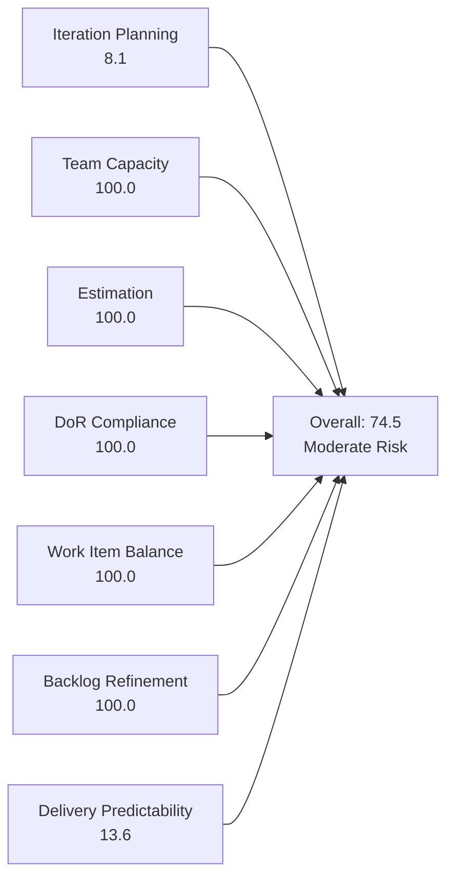
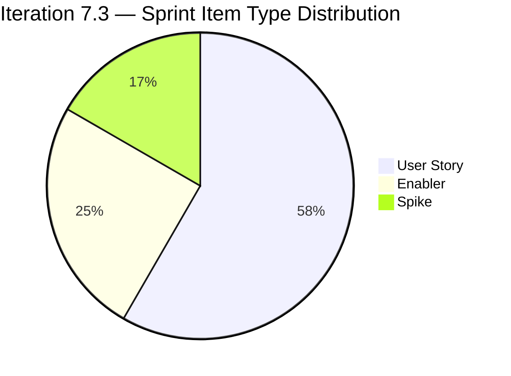
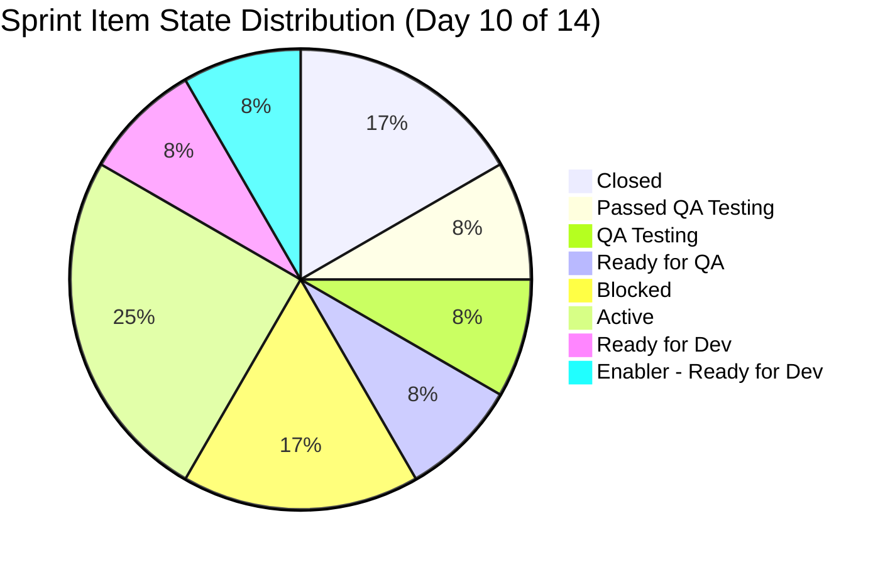
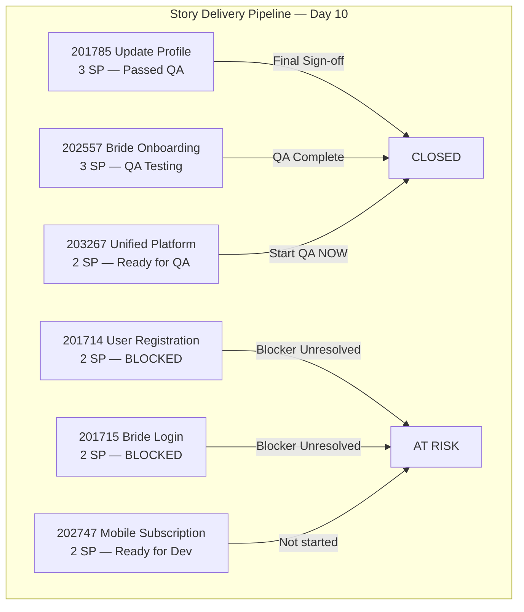

# SAFe Iteration Audit — Flawless Wedding App Team

## 1. Audit Metadata

| Field | Value |
|-------|-------|
| **Project** | Flawless Wedding App |
| **Team** | Flawless Wedding App Team |
| **Workspace** | `ado_fl_dev` |
| **ADO Project ID** | 92b967dc-5ec7-4874-b8f5-e43b00d88339 |
| **ADO Team ID** | 7d90ecbf-d272-4b0c-b33b-c66d96a790ac |
| **Iteration** | Iteration 7.3 |
| **Iteration Start** | 2026-05-04 |
| **Iteration Finish** | 2026-05-17 |
| **Audit Date** | 2026-05-13 (PHT, UTC+8) |
| **Audit Day** | Day 10 of 14 |
| **Prior Audit** | AUDIT_20260512_0903.md (Audit #55, 72.5 — Moderate Risk, Day 9) |
| **Overall Score** | **74.5 / 100** |
| **Risk Band** | **Moderate Risk** |

---

## 2. Executive Summary

The Flawless Wedding App Team scores **74.5 / 100 (Moderate Risk)** for Iteration 7.3. This is the team's strongest process showing: all 12 sprint items are estimated and DoR-compliant, capacity is fully configured for all 4 team members, and the work item type mix (User Story + Enabler + Spike) is well-balanced. The primary weakness is Iteration Planning — only 12 of 149 visible backlog items (8.1%) are committed to this sprint, reflecting the large backlog of deferred Defects and User Stories that have not been assigned to an iteration. Delivery Predictability is 13.6% (3 of 22 SP closed as of Day 10), with 4 days remaining to close 19 SP. Two core stories remain Blocked by a platform dependency.

---

## 3. Previous Audit Delta

**Prior audit:** AUDIT_20260512_0903.md — Day 9, Score 72.5 / 100 (Moderate Risk)

| Dimension | Day 9 (May 12) | Day 10 (May 13) | Delta | Driver |
|-----------|---------------|----------------|-------|--------|
| Iteration Planning | 7.2 | **8.1** | **+0.9** | Backlog grew 138→149 (+11 items); sprint items grew 10→12 (+2 new items added to 7.3) |
| Team Capacity | 100.0 | 100.0 | 0.0 | 4 members configured, unchanged |
| Estimation | 100.0 | 100.0 | 0.0 | All sprint items estimated |
| DoR Compliance | 100.0 | 100.0 | 0.0 | All sprint items pass DoR |
| Work Item Balance | 100.0 | 100.0 | 0.0 | Type mix maintained: US 58.3%, Enabler 25%, Spike 16.7% |
| Backlog Refinement | 100.0 | 100.0 | 0.0 | Full freshness across expanded backlog |
| Delivery Predictability | 0.0 | **13.6** | **+13.6** | 3 SP now closed (202685 Bride Subscription + 203530 Staging Environment) |
| **Overall** | **72.5** | **74.5** | **+2.0** | Delivery progress and expanded sprint scope drive improvement |

**Key Day 9→Day 10 developments:**
- **Positive:** Item 202685 (Bride Subscription, 2 SP) and 203530 (Staging Environment, 1 SP) are now Closed — 3 SP delivered
- **Positive:** Item 203907 (E2E Testing Spike) was added to the sprint, and 203267 (Unified Platform) progressed to Ready for QA
- **Concern:** Items 201714 (User Registration) and 201715 (Bride Login) — which unblocked on Day 9 per the prior audit — appear Blocked again on Day 10 (2 SP at risk)
- **Concern:** 201785 (Update Profile) and 202557 (Bride Onboarding) were Blocked on Day 9; status changes noted on Day 10 (201785 Passed QA Testing, 202557 QA Testing) — a positive progression

---

## 4. Current Iteration Snapshot

| Attribute | Value |
|-----------|-------|
| Active Iteration | Iteration 7.3 |
| Sprint Duration | 2026-05-04 to 2026-05-17 (14 days) |
| Audit Day | Day 10 |
| Current Iteration Root Items | 12 |
| Total Visible Backlog Root Items | 149 |
| Sprint Load % | 8.1% |
| Total Committed Story Points | 22 SP |
| Closed Story Points | 3 SP |
| Active Team Members (sprint) | 2 (Luke Abram Colina, Ressa Paracuelles) |
| Capacity Configured Members | 4 (Ressa Paracuelles, Luzmibel Paculanang, Luke Abram Colina, Ike Yana) |
| Days Off (sprint) | Ressa: May 5, May 12 (2 days) |

---

## 5. Work Item Analysis

### Current Iteration Items (Iteration 7.3)

| ID | Title | Type | State | Assignee | SP | DoR |
|----|-------|------|-------|----------|----|-----|
| 201714 | Wedding User Registration (A/B) | User Story | Blocked | lcolina | 2 | ✓ |
| 201715 | Bride Login | User Story | Blocked | lcolina | 2 | ✓ |
| 201716 | Bride Logout | User Story | Active | lcolina | 1 | ✓ |
| 201785 | Update Profile Information | User Story | Passed QA Testing | lcolina | 3 | ✓ |
| 202557 | Bride Onboarding | User Story | QA Testing | lcolina | 3 | ✓ |
| 202685 | Bride Subscription | User Story | **Closed** | lcolina | 2 | ✓ |
| 202686 | Subscription Renewal Notification | User Story | Active | lcolina | 2 | ✓ |
| 202747 | Mobile Subscription Management for Bride Access | Enabler | Ready for Dev | lcolina | 2 | ✓ |
| 203267 | Unified Web and Mobile Platform Update | Enabler | Ready for QA | lcolina | 2 | ✓ |
| 203514 | Iteration 7.3 - Collaborations, Reports & Others | Spike | Active | rparacuelles | 1 | ✓ |
| 203530 | WebApp Staging Environment for User Testing | Enabler | **Closed** | lcolina | 1 | ✓ |
| 203907 | Iteration 7.3 End to End Testing | Spike | Active | rparacuelles | 1 | ✓ |

**Key Observations:**
- **Closed (3 SP):** 202685 (Bride Subscription, 2 SP) + 203530 (Staging Environment, 1 SP)
- **Blocked (4 SP):** 201714 and 201715 — Wedding User Registration and Bride Login are blocked. These are foundational features; their blocker must be resolved immediately.
- **QA pipeline (6 SP):** 201785 (Passed QA Testing) and 202557 (QA Testing) — these are close to done and can contribute to closed SP by sprint end.
- **Ready for QA (2 SP):** 203267 (Unified Platform Update) — needs QA assignment.
- **Active (4 SP total):** 201716, 202686, 203514, 203907

### Capacity Detail

| Member | Activity | Capacity/Day | Days Off |
|--------|----------|-------------|----------|
| Luke Abram Colina | Development | 6 hrs | None |
| Ressa Paracuelles | Testing | 6 hrs | May 5, May 12 |
| Luzmibel Paculanang | Testing | 1 hr | None |
| Ike Yana | Development | 1 hr | None |

**Contributor assignment gap:** Luzmibel Paculanang (lpaculanang) and Ike Yana (iyana) have capacity configured but no root-level items assigned to them in Iteration 7.3. All development work is concentrated on lcolina.

### Backlog Composition (All 149 Items)

The full backlog contains:
- A large volume of Defect items (predominantly in 2026-PI7 and 2026-PI6 paths, not assigned to specific iterations)
- User Stories staged for future sprints (Estimation state, PI7 path)
- Several Spikes in "Ready" state waiting for sprint assignment
- The Items with the oldest IDs (188xxx–191xxx range) are predominantly Defects from PI6 carried forward

---

## 6. SAFe Compliance Scorecard

| Dimension | Score | Evidence | Notes |
|-----------|-------|----------|-------|
| Iteration Planning | 8.1 | 12 of 149 backlog items in Iteration 7.3 | Large deferred backlog; 137 items unassigned to sprint |
| Team Capacity | 100.0 | All 4 members configured with activities and capacity | Ressa has 2 days off recorded; lcolina and iyana no days off |
| Estimation | 100.0 | All 12 sprint items have Story Points > 0 | 22 SP total committed |
| DoR Compliance | 100.0 | All 12 items have Description ≥30 chars AND AC ≥20 chars | Best DoR coverage seen across all three teams this audit |
| Work Item Balance | 100.0 | User Story: 7 (58.3%), Enabler: 3 (25.0%), Spike: 2 (16.7%) | No dominant type >60%; no excessive Spike share; User Stories present |
| Backlog Refinement | 100.0 | All 149 backlog items updated within last 45 days (earliest: 2026-04-08); 0 stale >90 days | Excellent hygiene across entire backlog |
| Delivery Predictability | 13.6 | 3 SP closed (202685 + 203530) of 22 SP committed | 19 SP in-flight on Day 10; Blocked items a significant risk |
| **Overall** | **74.5** | Average of 7 dimensions | **Moderate Risk** |

---

## 7. Dimension Findings

### 7.1 Iteration Planning — 8.1 (Critical)

Only 12 of 149 visible backlog items (8.1%) are committed to Iteration 7.3. The remaining 137 items sit in the backlog across various PI-level paths (PI7, PI6, project root) without sprint assignment. This score reflects the large accumulation of unplanned Defects and future User Stories that drive down the ratio.

This is not necessarily a process failure — many of the unassigned items are Defects from PI6 being tracked but not yet scheduled. However, the low ratio warrants backlog grooming to either assign items to future sprints or close/remove items that are no longer relevant.

**Recommendation:** Conduct a backlog grooming session to triage the 137 unassigned items. Assign ready items to Iteration 7.4, close obsolete Defects, and ensure the planning ratio improves.

### 7.2 Team Capacity — 100.0 (Low Risk)

All four team members have capacity configured. Ressa Paracuelles has two days off (May 5 and May 12) correctly recorded. Total team capacity = 14 hrs/day (Ressa 6 + Bel 1 + Luke 6 + Ike 1).

**Concern:** Luzmibel Paculanang (1 hr/day Testing) and Ike Yana (1 hr/day Development) have no root-level sprint assignments. Their capacity is formally registered but not visibly utilized at the story level. Verify that they are contributing via child tasks only.

### 7.3 Estimation — 100.0 (Low Risk)

All 12 sprint items have Story Points assigned. Story point values range from 1 SP (Spikes, Staging Enabler) to 3 SP (Profile Update, Onboarding), proportionate to complexity. Total commitment of 22 SP is substantial for a 14-day sprint with the described team capacity.

### 7.4 DoR Compliance — 100.0 (Low Risk)

All 12 sprint items pass the Definition of Ready. This team demonstrates the strongest DoR discipline among the three teams audited. Gherkin-style acceptance criteria are consistently used in User Stories (Given/When/Then format), and Enablers and Spikes have clearly articulated acceptance checklists.

**Minor note on 201785:** The AC includes an incomplete item: "Delete and deactivate - to add AC." This partial acceptance criterion should be completed before the item is closed.

### 7.5 Work Item Balance — 100.0 (Low Risk)

The sprint composition is well-balanced:
- User Story: 7 items (58.3%) — below the 60% penalty threshold
- Enabler: 3 items (25.0%) — architectural and platform work
- Spike: 2 items (16.7%) — time-boxed investigation and team ceremonies

No dominant type penalty. No excessive Spike share. User Stories are present. This is the only team of the three to score 100.0 on balance.

### 7.6 Backlog Refinement — 100.0 (Low Risk)

All 149 visible backlog items have ChangedDate values within the last 45 days (earliest observed: 2026-04-08, 35 days ago). No items are stale at 90 or 180 days. All 12 current sprint items have ChangedDates after the sprint start (May 4). Zero untouched items in the sprint.

The team maintains excellent backlog hygiene despite the large backlog volume.

### 7.7 Delivery Predictability — 13.6 (Critical)

As of Day 10, only 3 of 22 committed SP have been closed (202685 Bride Subscription + 203530 Staging Environment). Nineteen SP remain in-flight with four days left.

**Current pipeline analysis:**
- 201785 (Update Profile, 3 SP): "Passed QA Testing" → likely closeable if final sign-off occurs
- 202557 (Bride Onboarding, 3 SP): "QA Testing" → may close by May 17 if testing completes
- 203267 (Unified Platform Update, 2 SP): "Ready for QA" → QA needs to start immediately
- 201714 (User Registration, 2 SP): **Blocked** → high risk, may not close this sprint
- 201715 (Bride Login, 2 SP): **Blocked** → high risk, may not close this sprint
- 202747 (Mobile Subscription, 2 SP): "Ready for Dev" → development not yet started; very low closure probability

**Best-case scenario (if QA items close + profile update closes):** 3 + 3 + 3 + 2 = 11 SP → Delivery Predictability = 50.0%

**If Blocked items also resolve:** Could reach ~19 SP → 86.4%

---

## 8. Risks and Bottlenecks

| Risk | Severity | Description |
|------|----------|-------------|
| Blocked items (201714, 201715) | Critical | Wedding User Registration and Bride Login are Blocked; unresolved blocker threatens 4 SP and foundational sprint stories |
| Low sprint delivery on Day 10 | High | 13.6% of committed SP closed; 19 SP to close in 4 days |
| lcolina concentration | High | 10 of 12 sprint root items assigned to Luke Colina; Luzmibel and Ike underutilized at root level |
| Mobile Subscription (202747) | High | "Ready for Dev" on Day 10 — development likely cannot complete in 4 days |
| Iteration Planning ratio | Moderate | 137 of 149 backlog items unscheduled; backlog triage needed |
| Incomplete AC on 201785 | Low | "Delete and deactivate - to add AC" is an incomplete acceptance criterion |

---

## 9. Prioritized Recommendations

1. **Immediately resolve the blocker on 201714 and 201715.** Wedding User Registration and Bride Login are foundational to the user journey. Identify and escalate the blocker today (Day 10). If the blocker cannot be resolved by May 14, move these items to 7.4 and document the impediment in the sprint retrospective.

2. **Drive QA closure on 201785, 202557, and 203267 before May 15.** These three items (8 SP combined) are in QA stages. Assign Ressa and/or Luzmibel to complete testing on these stories now. Closing all three recovers approximately 11 SP toward the 22 SP commitment.

3. **Re-assess 202747 (Mobile Subscription Management).** This Enabler is "Ready for Dev" on Day 10 — insufficient time for development and QA within the sprint. Recommend moving to Iteration 7.4 unless a targeted partial delivery is feasible.

4. **Fix incomplete AC on 201785** before marking it closed. The "Delete and deactivate" criterion must be written or explicitly de-scoped.

5. **Conduct backlog triage before Iteration 7.4 planning.** The team has 137 unassigned backlog items. Categorize by: (a) assign to 7.4 if ready, (b) groom and estimate for future sprints, (c) close if obsolete. Target a planning ratio of at least 15–20% in 7.4.

6. **Assign sprint items to Luzmibel Paculanang and Ike Yana at root level.** Their capacity exists but their work is only visible as child tasks. Create or assign root-level work items so their contributions are tracked in sprint metrics.

7. **Complete and close retrospective and ceremony Spike items** (203514, 203907) on the last day of the sprint. These are team housekeeping Spikes that should be closed on Day 14.

---

## 10. Evidence Gaps and Limitations

| Gap | Impact |
|-----|--------|
| No prior PI 7 audit on file | Delta comparison limited to CLAUDE.md notes from March 2026 |
| Blocked items: blocker reason unknown | Cannot determine whether blockers are resolvable before May 17 |
| Luzmibel Paculanang and Ike Yana work | These members' contributions are via child tasks only; root-level analysis underrepresents their actual work |
| Delivery Predictability on Day 10 | 13.6% is a snapshot; final score depends on QA and closure activity in Days 11–14 |
| 137 non-iteration backlog items | Full DoR and estimation data not checked for items outside current sprint scope |

---

## Appendix — Score Visualization

