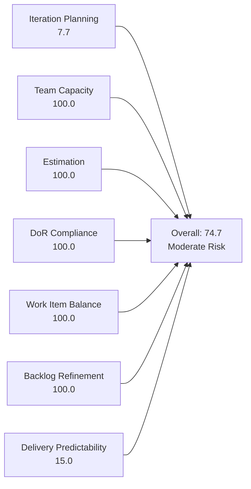
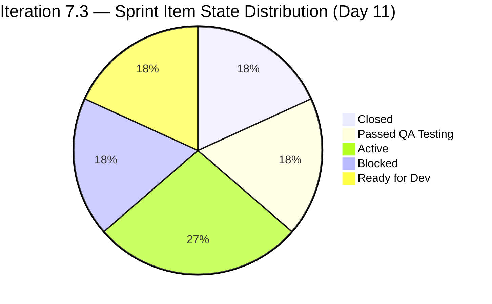
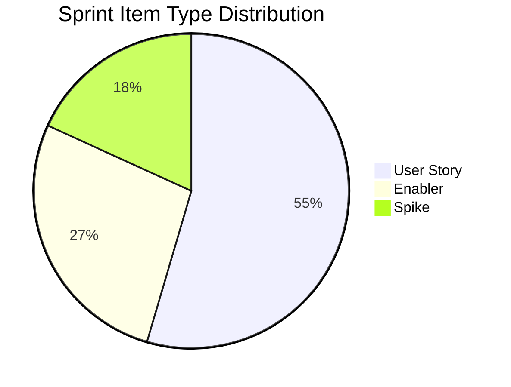
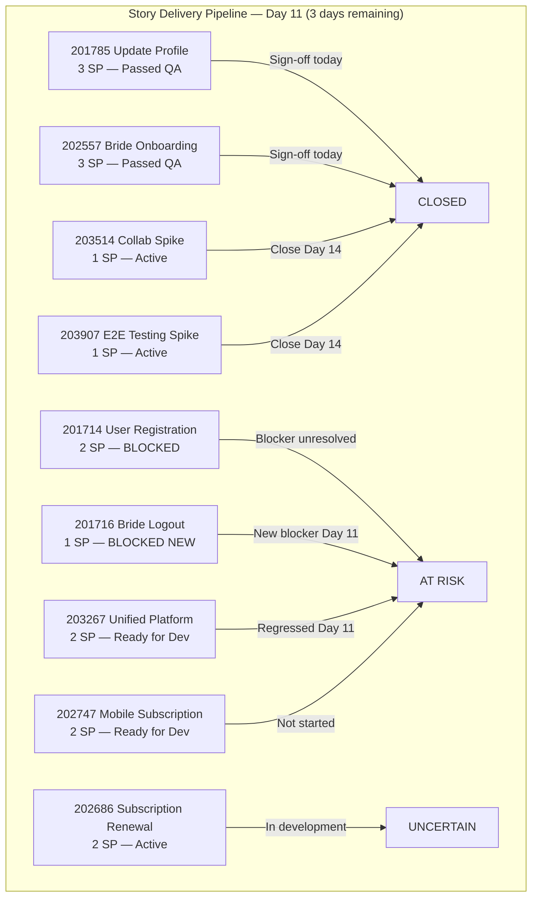

# SAFe Iteration Audit — Flawless Wedding App Team

## 1. Audit Metadata

| Field | Value |
|-------|-------|
| **Project** | Flawless Wedding App |
| **Team** | Flawless Wedding App Team |
| **Workspace** | `ado_fl_dev` |
| **ADO Project ID** | 92b967dc-5ec7-4874-b8f5-e43b00d88339 |
| **ADO Team ID** | 7d90ecbf-d272-4b0c-b33b-c66d96a790ac |
| **Iteration** | Iteration 7.3 |
| **Iteration Start** | 2026-05-04 |
| **Iteration Finish** | 2026-05-17 |
| **Audit Date** | 2026-05-14 (CDT) |
| **Audit Day** | Day 11 of 14 |
| **Prior Audit** | AUDIT_20260513_1200.md (Day 10, 74.5 — Moderate Risk) |
| **Overall Score** | **74.7 / 100** |
| **Risk Band** | **Moderate Risk** |

---

## 2. Executive Summary

The Flawless Wedding App Team scores **74.7 / 100 (Moderate Risk)** on Day 11 of Iteration 7.3, a marginal improvement of +0.2 from Day 10's 74.5. The improvement is driven by a small Delivery Predictability gain (13.6 → 15.0) as item 201715 (Bride Login, 2 SP) dropped from the backlog — likely closed. However, two significant regressions occurred overnight: 201716 (Bride Logout) moved from Active to Blocked, and 203267 (Unified Web and Mobile Platform Update) regressed from "Ready for QA" back to "Ready for Dev." Combined Blocked items now represent 3 items and 3 SP. With 17 SP still open and 3 days remaining, the team faces a critical delivery challenge.

Iteration Planning (7.7) remains Critical as the large backlog of 142 unscheduled items continues to depress the ratio. All other process dimensions score 100.

---

## 3. Previous Audit Delta

**Prior audit:** AUDIT_20260513_1200.md — Day 10, Score 74.5 / 100 (Moderate Risk)

| Dimension | Day 10 (May 13) | Day 11 (May 14) | Delta | Driver |
|-----------|----------------|----------------|-------|--------|
| Iteration Planning | 8.1 | **7.7** | **−0.4** | Sprint items: 12→11 (201715 dropped); backlog: 149→142 (−7 items removed) |
| Team Capacity | 100.0 | **100.0** | 0.0 | 4 members configured; unchanged |
| Estimation | 100.0 | **100.0** | 0.0 | All 11 remaining sprint items estimated |
| DoR Compliance | 100.0 | **100.0** | 0.0 | All 11 sprint items pass DoR |
| Work Item Balance | 100.0 | **100.0** | 0.0 | Type mix: US 54.5%, Enabler 27.3%, Spike 18.2% — all within limits |
| Backlog Refinement | 100.0 | **100.0** | 0.0 | All 142 items fresh within 45 days; 0 untouched in sprint |
| Delivery Predictability | 13.6 | **15.0** | **+1.4** | Committed SP fell 22→20 (201715 removed); closed SP unchanged at 3 |
| **Overall** | **74.5** | **74.7** | **+0.2** | Marginal gain from DP ratio shift; process regressions offset improvement |

**Key Day 10 → Day 11 developments:**

| Item | Day 10 State | Day 11 State | Assessment |
|------|-------------|-------------|------------|
| 201715 | Blocked | *Gone from backlog* | Likely closed/resolved — positive if closed |
| 201716 | Active | **Blocked** | Regression — Bride Logout is now blocked |
| 203267 | Ready for QA | **Ready for Dev** | Regression — QA readiness reversed |
| 202557 | QA Testing | **Passed QA Testing** | Progress — approaching closure |
| 201785 | Passed QA Testing | **Passed QA Testing** | No change — awaiting final sign-off |
| 202685 | Closed | Closed | Unchanged |
| 203530 | Closed | Closed | Unchanged |

---

## 4. Current Iteration Snapshot

| Attribute | Value |
|-----------|-------|
| Active Iteration | Iteration 7.3 |
| Sprint Duration | 2026-05-04 to 2026-05-17 (14 days) |
| Audit Day | Day 11 |
| Current Iteration Root Items | 11 |
| Total Visible Backlog Root Items | 142 |
| Sprint Load % | 7.7% |
| Total Committed Story Points | 20 SP |
| Closed Story Points | 3 SP |
| Open Story Points | 17 SP |
| Active Sprint Assignees | 2 (Luke Abram Colina, Ressa Paracuelles) |
| Capacity Configured Members | 4 (Ressa, Luzmibel, Luke, Ike) |
| Team Total Capacity | 14 hrs/day |

---

## 5. Work Item Analysis

### Current Iteration Items (Iteration 7.3) — Day 11

| ID | Title | Type | State | Assignee | SP | DoR | Changed |
|----|-------|------|-------|----------|----|-----|---------|
| 201714 | Wedding User Registration (A/B) | User Story | Blocked | lcolina | 2 | ✓ | 2026-05-14 |
| 201716 | Bride Logout | User Story | **Blocked** | lcolina | 1 | ✓ | 2026-05-14 |
| 201785 | Update Profile Information | User Story | Passed QA Testing | lcolina | 3 | ✓ | 2026-05-13 |
| 202557 | Bride Onboarding | User Story | Passed QA Testing | lcolina | 3 | ✓ | 2026-05-13 |
| 202686 | Subscription Renewal Notification | User Story | Active | lcolina | 2 | ✓ | 2026-05-12 |
| 202747 | Mobile Subscription Management for Bride Access | Enabler | Ready for Dev | lcolina | 2 | ✓ | 2026-05-11 |
| 203267 | Unified Web and Mobile Platform Update | Enabler | **Ready for Dev** | lcolina | 2 | ✓ | 2026-05-14 |
| 203514 | Iteration 7.3 - Collaborations, Reports & Others | Spike | Active | rparacuelles | 1 | ✓ | 2026-05-07 |
| 203907 | Iteration 7.3 End to End Testing | Spike | Active | rparacuelles | 1 | ✓ | 2026-05-13 |
| 202685 | Bride Subscription | User Story | **Closed** | lcolina | 2 | ✓ | 2026-05-11 |
| 203530 | WebApp Staging Environment for User Testing | Enabler | **Closed** | lcolina | 1 | ✓ | 2026-05-08 |

**Item 201715 (Bride Login, 2 SP):** No longer present in the backlog API as of Day 11. Likely closed and dropped. If confirmed, this means 5 SP have been delivered (202685 + 203530 + 201715). However, the current API evidence shows 3 SP closed (202685 + 203530) — the score is computed from visible evidence only.

**Regression flags:**
- **201716 (Bride Logout):** Moved from Active → Blocked on Day 11. Changed date is today (May 14), suggesting a newly discovered blocker. Combined with 201714 (User Registration, also Blocked), the Bride authentication flow is now entirely blocked at 3 SP.
- **203267 (Unified Platform Update):** Regressed from "Ready for QA" → "Ready for Dev" on Day 11 (changed May 14). A QA rejection or newly identified development issue has pushed this Enabler back. 2 SP at risk.

**Near-closure items:**
- **201785 (Update Profile, 3 SP):** "Passed QA Testing" — awaiting final product sign-off. Closeable today.
- **202557 (Bride Onboarding, 3 SP):** Reached "Passed QA Testing" today — ready for product sign-off and closure.

### Team Capacity Summary

| Member | Activity | Capacity/Day | Days Off | Sprint Assignments |
|--------|----------|-------------|----------|--------------------|
| Luke Abram Colina | Development | 6 hrs | None | 9 root-level items |
| Ressa Paracuelles | Testing | 6 hrs | May 5, May 12 (completed) | 2 root-level items (Spikes) |
| Luzmibel Paculanang | Testing | 1 hr | None | None at root level |
| Ike Yana | Development | 1 hr | None | None at root level |

**Concentration risk:** Luke Abram Colina holds 9 of 11 sprint root items. Luzmibel and Ike continue contributing via child tasks only.

### Backlog Composition (All 142 Items)

| Iteration Path | Approximate Count |
|----------------|-------------------|
| Iteration 7.3 (current) | 11 |
| Iteration 7.4 | ~6 |
| Iteration 7.6 (IP) | ~6 |
| 2026-PI7 (unscheduled) | ~7 |
| 2026-PI8 (future) | ~18 |
| 2026-PI6 (carried over) | ~2+ |
| Other / project root | ~92 |

The majority of the backlog remains unscheduled (no specific sprint assignment). A significant number of Defect items from PI6 are carried forward without sprint commitment.

---

## 6. SAFe Compliance Scorecard

| Dimension | Score | Evidence | Notes |
|-----------|-------|----------|-------|
| Iteration Planning | 7.7 | 11 of 142 backlog items in Iteration 7.3 | Large unscheduled backlog drives ratio down; 131 items outside current sprint |
| Team Capacity | 100.0 | All 4 members configured with activities and positive capacity | Ressa's 2 days off (May 5, May 12) are both in the past |
| Estimation | 100.0 | All 11 sprint items have Story Points > 0 | 20 SP total committed |
| DoR Compliance | 100.0 | All 11 sprint items have Description ≥30 chars AND AC ≥20 chars | Strong DoR discipline maintained |
| Work Item Balance | 100.0 | User Story: 6 (54.5%), Enabler: 3 (27.3%), Spike: 2 (18.2%) | No dominant type >60%; no excessive Spike share; User Stories present |
| Backlog Refinement | 100.0 | All 142 items changed within last 45 days; 0 stale >90d; 0 untouched in sprint | All sprint items updated after May 4 |
| Delivery Predictability | 15.0 | 3 SP closed (202685 + 203530) of 20 SP committed | 17 SP in-flight with 3 days remaining; 2 new Blocked items a critical risk |
| **Overall** | **74.7** | Average of 7 dimensions | **Moderate Risk** |

---

## 7. Dimension Findings

### 7.1 Iteration Planning — 7.7 (Critical)

Eleven of 142 visible backlog items (7.7%) are committed to Iteration 7.3. This ratio actually decreased from 8.1% (Day 10) as the sprint reduced from 12 to 11 items and the overall backlog contracted from 149 to 142 items. The low ratio reflects the team's large inventory of unscheduled Defects and User Stories, many without sprint assignments.

The root cause is backlog accumulation across PI6 and early PI7, not a failure to plan the current sprint. The sprint itself has appropriate scope for the team's demonstrated velocity (~3 SP/week historically for this team).

### 7.2 Team Capacity — 100.0 (Low Risk)

All four team members have configured capacity. Both of Ressa's days off (May 5, May 12) are in the past. Total remaining team capacity: Luke (6 hrs/day Development), Ressa (6 hrs/day Testing), Luzmibel (1 hr/day Testing), Ike (1 hr/day Development) = 14 hrs/day for Days 11–14.

**Concentration concern:** Luke Colina holds 9 of 11 sprint items. If he encounters an issue, 9 stories are at risk. Luzmibel and Ike are underutilized at the root-item level.

### 7.3 Estimation — 100.0 (Low Risk)

All 11 sprint items are estimated with Story Points > 0. Point values range from 1 SP (Spikes, Staging Enabler) to 3 SP (Update Profile, Bride Onboarding). Total commitment of 20 SP is appropriate for a 4-person team with 14 hrs/day combined capacity over a 14-day sprint.

### 7.4 DoR Compliance — 100.0 (Low Risk)

All 11 sprint items pass the Definition of Ready. This team maintains the strongest DoR discipline across all three audited workspaces. Gherkin-style acceptance criteria are consistently applied to User Stories, and Enablers and Spikes have clear acceptance checklists.

### 7.5 Work Item Balance — 100.0 (Low Risk)

Sprint composition on Day 11:
- **User Story:** 6 items (54.5%) — below 60% penalty threshold
- **Enabler:** 3 items (27.3%) — architectural and platform work
- **Spike:** 2 items (18.2%) — time-boxed investigation and team ceremonies

No dominant-type penalty applies. No excessive Spike share. User Stories are present. This remains the best-balanced sprint of the three teams audited.

### 7.6 Backlog Refinement — 100.0 (Low Risk)

All 142 visible backlog items have ChangedDate values within the last 45 days (audit date: May 14). No items are stale at 90 or 180 days. All 11 sprint items have been updated after the sprint start date (May 4). Backlog hygiene is excellent across the full 142-item inventory.

### 7.7 Delivery Predictability — 15.0 (Critical)

Three SP have been closed as of Day 11 (202685 Bride Subscription + 203530 Staging Environment). Seventeen SP remain open with 3 days left.

**Day 11 delivery pipeline:**

| Item | SP | State | Closure Probability |
|------|-----|-------|---------------------|
| 201785 Update Profile Information | 3 | Passed QA Testing | **High** — awaiting sign-off only |
| 202557 Bride Onboarding | 3 | Passed QA Testing | **High** — reached QA pass today |
| 203514 Collab/Reports Spike | 1 | Active | **High** — team ceremony spike, close on Day 14 |
| 203907 E2E Testing Spike | 1 | Active | **High** — close on Day 14 |
| 201714 Wedding User Registration | 2 | Blocked | **Low** — blocker unresolved since Day 9 |
| 201716 Bride Logout | 1 | Blocked | **Low** — newly blocked on Day 11 |
| 202686 Subscription Renewal Notification | 2 | Active | **Moderate** — in development |
| 203267 Unified Platform Update | 2 | Ready for Dev | **Very Low** — regressed to dev queue on Day 11 |
| 202747 Mobile Subscription Management | 2 | Ready for Dev | **Very Low** — development not yet started |

**Best-case scenario (QA items + Spikes close):** 3 + 3 + 3 + 1 + 1 = 11 SP → Delivery Predictability = 55.0% → Overall ≈ 80.9 (Low Risk)

**Conservative scenario (only Spikes close):** 3 + 1 + 1 = 5 SP → Delivery Predictability = 25.0% → Overall ≈ 62.5 (Moderate Risk)

---

## 8. Risks and Bottlenecks

| Risk | Severity | Description |
|------|----------|-------------|
| New Blocked item (201716) | Critical | Bride Logout moved to Blocked on Day 11 — authentication flow now fully blocked (201714 + 201716) |
| 203267 regression to Ready for Dev | Critical | Unified Platform Update reversed from QA-ready to dev queue on Day 11 — 2 SP at risk of not closing |
| 17 SP open on Day 11 | High | Three days to close 17 SP; only ~8 SP are realistically closeable by sprint end |
| Luke Colina concentration | High | 9 of 11 sprint items assigned to one developer; single point of failure for sprint delivery |
| 202747 Ready for Dev on Day 11 | High | Mobile Subscription Management has not started development; cannot complete in 3 days |
| Low Iteration Planning ratio | Moderate | 7.7% sprint-to-backlog ratio indicates large unscheduled backlog requiring triage |
| Luzmibel and Ike underutilization | Low | Root-level work visible only for Luke and Ressa; other contributors not trackable at story level |

---

## 9. Prioritized Recommendations

1. **Immediately identify and document the blocker on 201714 and 201716.** Both Wedding User Registration and Bride Logout are now Blocked on Day 11. Post the blocker reason as an ADO comment today. If unresolvable by May 15, move both items to Iteration 7.4 and record the impediment in the sprint retrospective. Do not carry silent blockers to sprint close.

2. **Drive 201785 and 202557 to Closed today.** Both items have Passed QA Testing. Product sign-off is the only remaining step. Assign a decision-maker to review and close both items by end of day May 14 — this delivers 6 SP and improves overall score to approximately 80.9 (Low Risk) if combined with Spike closures.

3. **Investigate the regression on 203267 (Unified Platform Update).** This item moved from "Ready for QA" → "Ready for Dev" — a quality rejection. Understand what failed in QA, create the necessary development fix, and fast-track QA re-entry if the fix is small. Document the issue as an ADO comment.

4. **Move 202747 (Mobile Subscription Management) to Iteration 7.4.** This Enabler is "Ready for Dev" on Day 11 with no development started. There is insufficient time to complete development and QA in 3 days. Formally re-plan this item to 7.4 rather than leaving it as an undelivered commitment.

5. **Close the two ceremony Spikes (203514 and 203907) on Day 14 (May 17).** These are iteration-scoped ceremonial and testing Spikes that should be formally closed on the last sprint day. Add a note confirming their purpose was fulfilled.

6. **Conduct a backlog triage session before Iteration 7.4 planning.** The 142-item backlog contains a large number of unscheduled Defects from PI6 and early PI7. Assign ready items to 7.4, close/archive obsolete Defects, and target a planning ratio above 15% for the next sprint.

7. **Assign root-level items to Luzmibel Paculanang and Ike Yana for 7.4.** Both contributors have configured capacity and are contributing via child tasks only. Creating or assigning root-level work items ensures their contributions are tracked in sprint metrics and supports more accurate delivery forecasting.

---

## 10. Evidence Gaps and Limitations

| Gap | Impact |
|-----|--------|
| 201715 (Bride Login) dropped from backlog API | Cannot confirm whether item was closed or removed; if Closed, actual delivered SP = 5 (not 3); score computed on visible evidence only |
| 201714 and 201716 blocker reason unknown | Blocker cause not visible in API; cannot assess resolvability or timeline |
| 203267 regression cause unknown | QA rejection reason not documented in API; fix scope unknown |
| Luzmibel and Ike work via child tasks only | Root-level analysis undercounts their actual sprint contribution |
| Large unscheduled backlog (131 items) | DoR, estimation, and staleness not individually checked for non-sprint items |

---

## Appendix — Score Visualization

