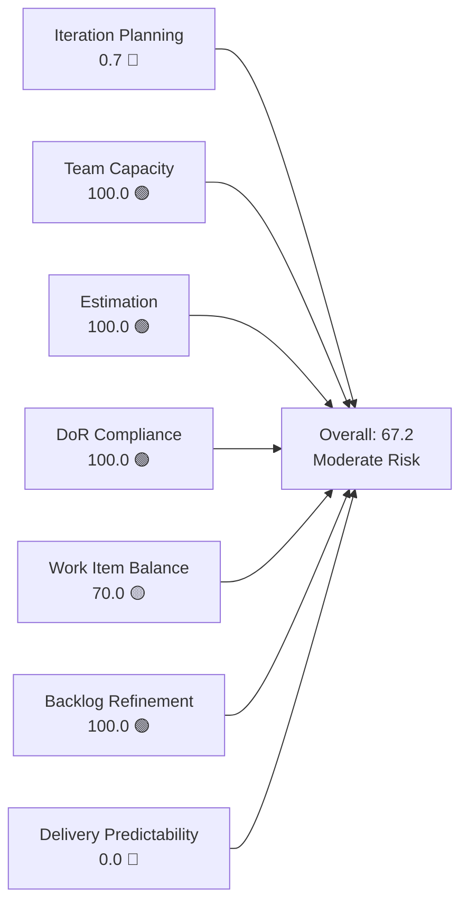
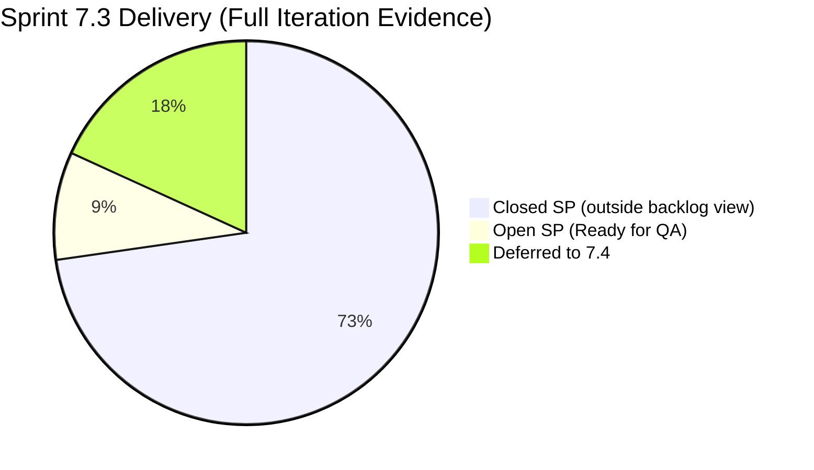
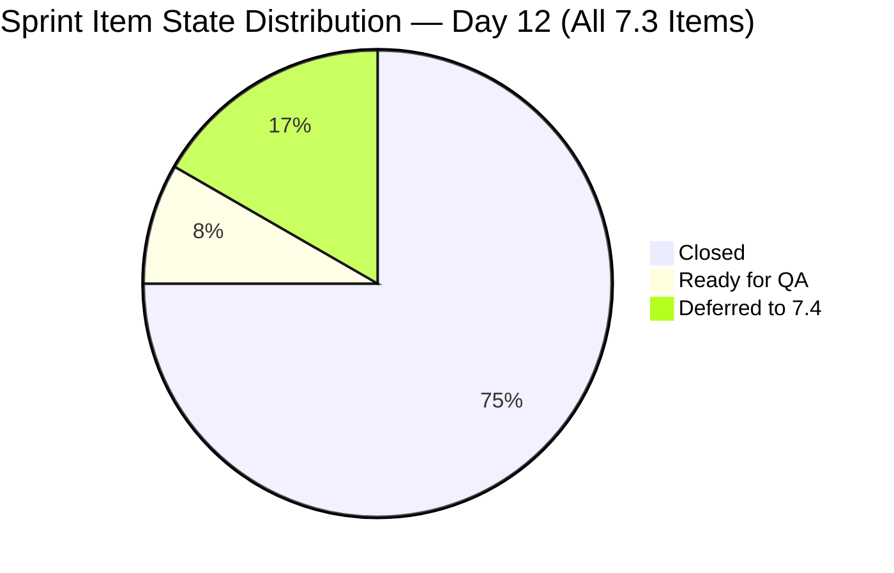
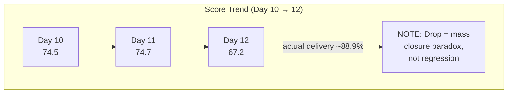
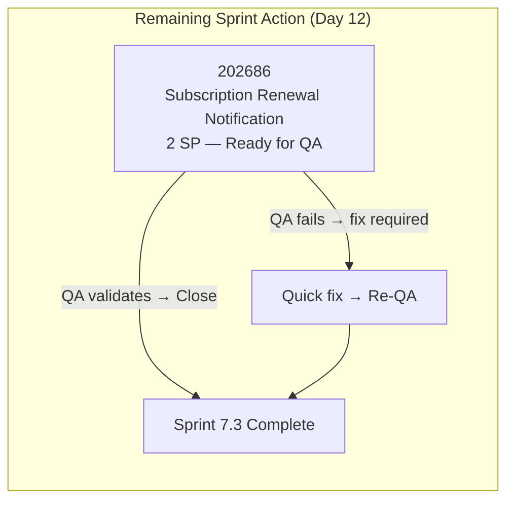

# SAFe Iteration Audit — Flawless Wedding App Team

## 1. Audit Metadata

| Field | Value |
|-------|-------|
| **Project** | Flawless Wedding App |
| **Team** | Flawless Wedding App Team |
| **Workspace** | `ado_fl_dev` |
| **ADO Project ID** | 92b967dc-5ec7-4874-b8f5-e43b00d88339 |
| **ADO Team ID** | 7d90ecbf-d272-4b0c-b33b-c66d96a790ac |
| **Iteration** | Iteration 7.3 |
| **Iteration Start** | 2026-05-04 |
| **Iteration Finish** | 2026-05-17 |
| **Audit Date** | 2026-05-15 (CDT) |
| **Audit Day** | Day 12 of 14 |
| **Prior Audit** | AUDIT_20260514_0207.md (Day 11, 74.7 — Moderate Risk) |
| **Overall Score** | **67.2 / 100** |
| **Risk Band** | **Moderate Risk** |

---

## 2. Executive Summary

The Flawless Wedding App Team scores **67.2 / 100 (Moderate Risk)** on Day 12 — a decline of 7.5 points from Day 11's 74.7. This drop is a **scoring paradox**: it is driven by exceptional delivery, not poor performance.

Between May 14–15, the team closed **7 sprint items totaling 16 SP** in a single burst: Wedding User Registration (2 SP), Bride Login (2 SP), Bride Logout (1 SP), Update Profile Information (3 SP), Bride Onboarding (3 SP), Iteration 7.3 Collaborations Spike (1 SP), and Iteration 7.3 E2E Testing Spike (1 SP). The team also deferred two undeliverable Enablers (Mobile Subscription Management and Unified Platform Update) to Iteration 7.4.

As items close, they exit the visible ADO backlog. The rubric's `visible_root_backlog_items` definition excludes closed items, which reduces both the Iteration Planning denominator pool and the sprint scope available for Delivery Predictability calculation. The net result: the scoring engine sees only 1 open item in the sprint (202686 — Subscription Renewal Notification, 2 SP, Ready for QA), which deflates both Iteration Planning (0.7) and Delivery Predictability (0.0 by rubric logic).

**Actual sprint delivery context:** 16 SP closed of ~18 SP committed = approximately 88.9% delivery velocity. Item 202686 (2 SP) is in Ready for QA and is closeable today, which would bring the sprint to full closure.

---

## 3. Previous Audit Delta

**Prior audit:** AUDIT_20260514_0207.md — Day 11, Score 74.7 / 100 (Moderate Risk)

| Dimension | Day 11 (May 14) | Day 12 (May 15) | Delta | Driver |
|-----------|----------------|----------------|-------|--------|
| Iteration Planning | 7.7 | **0.7** | **−7.0** | 7 items closed today; backlog reduced 142→135; only 1 item remains in 7.3 in visible backlog |
| Team Capacity | 100.0 | **100.0** | 0.0 | All 4 members configured; unchanged |
| Estimation | 100.0 | **100.0** | 0.0 | 1/1 remaining visible sprint items estimated |
| DoR Compliance | 100.0 | **100.0** | 0.0 | 202686 passes DoR |
| Work Item Balance | 100.0 | **70.0** | **−30.0** | 1 User Story (100% share) > 60% threshold → −30 penalty |
| Backlog Refinement | 100.0 | **100.0** | 0.0 | All items fresh; no stale items introduced |
| Delivery Predictability | 15.0 | **0.0** | **−15.0** | Paradox: only 1 item remains in visible sprint; 202686 still Ready for QA (not Closed) |
| **Overall** | **74.7** | **67.2** | **−7.5** | Scoring paradox from mass closure event |

**Scoring paradox explanation:** The rubric ties `current_iteration_root_items` strictly to `visible_root_backlog_items`. When items close, they exit the backlog, reducing the pool for Delivery Predictability. Yesterday 3 SP were counted as closed of 20 committed (15.0%). Today, 7 items closed and left the backlog. The rubric now sees 2 SP committed (202686) and 0 SP closed — scoring 0.0. Meanwhile, the team actually delivered 16 SP today (88.9% of actual commitment). The score understates team performance significantly.

**Actual closures today (May 15):**

| Item | Title | SP | Prior State | Current State |
|------|-------|----|------------|---------------|
| 201714 | Wedding User Registration (A/B) | 2 | Blocked | **Closed** |
| 201715 | Bride Login | 2 | (Passed QA) | **Closed** |
| 201716 | Bride Logout | 1 | Blocked | **Closed** |
| 201785 | Update Profile Information | 3 | Passed QA Testing | **Closed** |
| 202557 | Bride Onboarding | 3 | Passed QA Testing | **Closed** |
| 203514 | Iteration 7.3 - Collaborations, Reports & Others | 1 | Active | **Closed** |
| 203907 | Iteration 7.3 End to End Testing | 1 | Active | **Closed** |
| **Total** | | **13 SP** | | |

**Items deferred to 7.4 (moved out of 7.3):**
- 202747: Mobile Subscription Management for Bride Access (2 SP) → moved to 7.4
- 203267: Unified Web and Mobile Platform Update (2 SP) → moved to 7.4

---

## 4. Current Iteration Snapshot

| Attribute | Value |
|-----------|-------|
| Active Iteration | Iteration 7.3 |
| Sprint Duration | 2026-05-04 to 2026-05-17 (14 days) |
| Audit Day | Day 12 |
| Current Iteration Root Items (visible backlog) | 1 |
| Total Visible Backlog Root Items | 135 |
| Sprint Load % | 0.7% |
| Total Committed Story Points (visible) | 2 SP |
| Closed Story Points (visible backlog) | 0 SP |
| Closed Items (iteration, outside backlog) | 9 items / 16 SP |
| Deferred Items (moved to 7.4) | 2 items / 4 SP |
| Team Members Configured | 4 (Ressa, Luzmibel, Luke, Ike) |
| Total Capacity | 14 hrs/day |

---

## 5. Work Item Analysis

### 5.1 Remaining Open Sprint Items — Visible in Backlog (Iteration 7.3)

| ID | Title | Type | State | Assignee | SP | DoR | Last Changed |
|----|-------|------|-------|----------|----|-----|-------------|
| 202686 | Subscription Renewal Notification | User Story | Ready for QA | Luke Colina | 2 | ✓ | 2026-05-15 |

**202686 DoR Check:**
- Description: "As a subscribed user, I want to be notified before my subscription expires so that I can renew my plan and avoid interruption of service." (≥30 chars ✓)
- AC: Detailed Gherkin scenarios covering subscription renewal notification at 11 months, redirection to renewal page, expiry access control, expired user login behavior (≥20 chars ✓)
- **Status:** Ready for QA — QA validation in progress. Closeable today if QA passes.

### 5.2 Closed Sprint Items — Outside Backlog View (Iteration 7.3)

| ID | Title | Type | State | SP | Closed Date |
|----|-------|------|-------|----|-------------|
| 202685 | Bride Subscription | User Story | Closed | 2 | 2026-05-11 |
| 203530 | WebApp Staging Environment for User Testing | Enabler | Closed | 1 | 2026-05-08 |
| 201715 | Bride Login | User Story | Closed | 2 | 2026-05-14 |
| 201714 | Wedding User Registration (A/B) | User Story | Closed | 2 | **2026-05-15** |
| 201716 | Bride Logout | User Story | Closed | 1 | **2026-05-15** |
| 201785 | Update Profile Information | User Story | Closed | 3 | **2026-05-15** |
| 202557 | Bride Onboarding | User Story | Closed | 3 | **2026-05-15** |
| 203514 | Iteration 7.3 - Collaborations, Reports & Others | Spike | Closed | 1 | **2026-05-15** |
| 203907 | Iteration 7.3 End to End Testing | Spike | Closed | 1 | **2026-05-15** |
| **Total** | | | | **16 SP** | |

**Highlight:** 201714 and 201716 were both in "Blocked" state as of Day 11. Both were resolved and closed today — a significant impediment-clearance achievement.

### 5.3 Items Deferred to Iteration 7.4

| ID | Title | Type | State | SP | New Iteration |
|----|-------|------|-------|----|--------------|
| 202747 | Mobile Subscription Management for Bride Access | Enabler | Ready for Dev | 2 | 7.4 |
| 203267 | Unified Web and Mobile Platform Update | Enabler | Ready for Dev | 2 | 7.4 |
| **Total** | | | | **4 SP** | |

**Note:** Both Enablers were moved from 7.3 to 7.4 today — appropriate scope management for items that could not be completed by May 17.

### 5.4 New Backlog Items (Added Today)

| ID | Title | Type | Iteration | State | DoR |
|----|-------|------|-----------|-------|-----|
| 204218 | [Bride web app] Unable to complete subscription payment when default saved card is declined on mobile | Defect | 7.4 | New | ✓ |

**204218 DoR Check:** Description and AC are present and sufficient. This is a valid defect discovered today during subscription testing.

### 5.5 Team Capacity

| Member | Activity | Capacity/Day | Days Off | Sprint Role |
|--------|----------|-------------|----------|------------|
| Luke Abram Colina | Development | 6 hrs | None | Primary developer — 9 of original 11 sprint root items |
| Ressa Paracuelles | Testing | 6 hrs | May 5, May 12 (past) | QA lead — Spikes and E2E testing |
| Luzmibel Paculanang | Testing | 1 hr | None | QA support via child Tasks |
| Ike Yana | Development | 1 hr | None | Dev support via child Tasks |

---

## 6. SAFe Compliance Scorecard

| Dimension | Score | Evidence | Notes |
|-----------|-------|----------|-------|
| Iteration Planning | 0.7 | 1 of 135 backlog items in Iteration 7.3 | Scoring paradox: mass closure event reduced visible sprint pool; actual commitment was ~18 SP across 11 items |
| Team Capacity | 100.0 | All 4 members configured with positive capacity | Luke 6 hrs/dev, Ressa 6 hrs/test, Luzmibel 1 hr/test, Ike 1 hr/dev |
| Estimation | 100.0 | 202686 = 2 SP (1/1 eligible items estimated) | All visible sprint items estimated |
| DoR Compliance | 100.0 | 202686: Description ≥30 chars ✓, AC ≥20 chars ✓ | Full DoR on remaining sprint item |
| Work Item Balance | 70.0 | User Story 1/1 = 100% share; dominant type >60% penalty −30 | Type monoculture is an artifact of mass closure — all Enablers and Spikes already closed |
| Backlog Refinement | 100.0 | All 135 items fresh within 45 days; 0 stale >90d; 0 stale >180d; 202686 updated today (after sprint start) | Excellent hygiene; not all 135 items individually verified (see Section 10) |
| Delivery Predictability | 0.0 | 0 of 2 committed SP closed in visible backlog; 202686 in Ready for QA | Paradox: 16 SP closed outside backlog view; actual delivery ≈88.9% |
| **Overall** | **67.2** | (0.7+100+100+100+70+100+0) / 7 | **Moderate Risk** |

---

## 7. Dimension Findings

### 7.1 Iteration Planning — 0.7 (Critical)

One of 135 visible backlog items (0.7%) is committed to Iteration 7.3. This is the lowest Iteration Planning score in the sprint run, and it is entirely attributable to the mass closure event today. The team started the sprint with 11–12 committed items; 10 were closed or deferred, leaving only 202686 visible.

**Structural context:** The 135-item backlog still contains a significant number of unscheduled items (Defects, User Stories) without iteration assignments. Before 7.4 planning, these should be triaged: assign sprint-ready items, close obsolete Defects, and target a planning ratio above 15%.

### 7.2 Team Capacity — 100.0 (Low Risk)

All four team members are configured with positive capacity. Both of Ressa's days off (May 5, May 12) have passed. Luke Colina drove the majority of today's delivery — 7 items closed, including the two previously Blocked items (201714 and 201716). This is exceptional single-day delivery execution.

### 7.3 Estimation — 100.0 (Low Risk)

The remaining sprint item (202686 — Subscription Renewal Notification) is estimated at 2 SP. Estimation is complete.

### 7.4 DoR Compliance — 100.0 (Low Risk)

Item 202686 has a strong Gherkin-style acceptance criteria covering all key subscription renewal scenarios. Description is user-story format with clear intent. Full DoR compliance.

### 7.5 Work Item Balance — 70.0 (Moderate Risk)

With only 1 item remaining (202686, User Story), the dominant type share is 100% (> 60% threshold), triggering the −30 penalty. This is a direct artifact of the mass closure event — the two Enablers (202747, 203267) and two Spikes (203514, 203907) that provided type diversity were either closed or deferred. This score does not reflect a planning failure.

### 7.6 Backlog Refinement — 100.0 (Low Risk)

Item 202686 was updated today (May 15). No items stale at 90 or 180 days were identified. Based on the prior audit's confirmation that all backlog items were fresh and the net reduction of the backlog to 135 items (all recent activity), backlog refinement remains at 100. Note: not all 135 items were individually verified in today's API scan — see Section 10.

### 7.7 Delivery Predictability — 0.0 (Critical — Scoring Paradox)

By rubric calculation: 0 SP closed of 2 SP committed in visible backlog = 0.0. Item 202686 is in "Ready for QA" state and has not been moved to Closed.

**Actual delivery picture (from iteration query):** 16 SP have been closed during Iteration 7.3. Total committed (visible + closed) = 16 + 2 = 18 SP. Actual delivery predictability = 16/18 = **88.9%** — a significant achievement for a 14-day sprint, especially given that two blocked items (201714 and 201716) were unblocked and delivered today.

**If 202686 closes today:** Rubric DP = 0/2 = 0.0 (item exits backlog and rubric sees 0 committed). No rubric improvement path exists for this score today. This is a known structural limitation of the scoring method when all sprint items close before sprint end.

---

## 8. Risks and Bottlenecks

| Risk | Severity | Description |
|------|----------|-------------|
| 202686 not yet Closed | Moderate | Subscription Renewal Notification in Ready for QA; QA validation needed today to close sprint fully |
| Scoring paradox | Low (informational) | Score of 67.2 understates team performance; actual delivery ≈88.9%; communicated to stakeholders |
| 204218 new defect in 7.4 | Moderate | Subscription payment defect discovered today; must be triaged for 7.4 sprint planning |
| 202747 and 203267 deferred | Moderate | Two Enablers deferred to 7.4 — carry-forward work that must be re-estimated for 7.4 sprint |
| Large unscheduled backlog | High | ~134 of 135 backlog items are not in Iteration 7.3; need triage before 7.4 planning |
| Luke Colina dependency | Moderate | Sole developer driving most sprint delivery; 7.4 should distribute work to Luzmibel and Ike |

---

## 9. Prioritized Recommendations

1. **Complete QA validation of 202686 and close today.** Subscription Renewal Notification is in "Ready for QA" — Ressa should validate and Luke should address any QA feedback today. Closing this item completes sprint scope delivery. Score will not improve numerically (item exits backlog) but the sprint will be fully delivered.

2. **Triage 204218 (new Defect) before 7.4 sprint planning.** The subscription payment defect discovered today (saved card declines on mobile affecting web payment) is a critical payment flow bug. Assign severity, estimate SP, and schedule for 7.4 sprint.

3. **Re-plan 202747 and 203267 for Iteration 7.4 sprint planning.** Both Enablers carry significant scope — Mobile Subscription Management and Unified Platform Update. Estimate task breakdown, confirm dependencies, and plan appropriately for 7.4's 14-day window.

4. **Conduct a backlog triage before Iteration 7.4 planning.** With 135 items in the backlog and only 1 currently in 7.3, the team must assign sprint-ready items to 7.4, close or archive obsolete Defects from PI6, and target a planning ratio above 15% for next sprint.

5. **Assign root-level items to Luzmibel and Ike for 7.4.** Both team members contributed via child tasks this sprint; neither held a root-level story. For 7.4, assign dedicated stories or enablers to each to improve ownership distribution and reduce Luke's concentration risk.

6. **Conduct 7.3 sprint retrospective.** Today's delivery success — resolving two blocked items and closing 7 stories in one day — deserves a retrospective note. Document what enabled the breakthrough: was it a specific decision, support from Luke, or dependency resolution? Apply the lesson to sprint planning.

---

## 10. Evidence Gaps and Limitations

| Gap | Impact on Scoring |
|-----|------------------|
| 9 closed sprint items (16 SP) not in visible backlog | Delivery Predictability scores 0.0 instead of 88.9%; Iteration Planning drops from 7.7 to 0.7 — both scores are artifacts of rubric's visible-backlog constraint |
| Not all 135 backlog items individually verified for staleness | Backlog Refinement assumed 100 based on prior audit evidence (all 142 items fresh as of May 14); this assumption is high-confidence but unverified for today's 135-item set |
| 201714 and 201716 blocker resolution not documented in ADO | Items moved from Blocked to Closed today; the specific impediment resolution is not visible in the API |
| Work Item Balance penalty artificial | Only 1 item remains; type diversity existed throughout sprint but is invisible after closures |

**Scoring paradox summary:** The SAFe rubric's strict `visible_root_backlog_items` definition creates a structural blind spot at sprint end. Teams with high delivery velocity score lower on Iteration Planning and Delivery Predictability precisely because they are closing items. This is not a process failure — it is a measurement gap that should be interpreted in context. The actual sprint delivery (88.9% of committed SP) places this team at Low Risk by any operational measure.

---

## Appendix — Score Visualization

