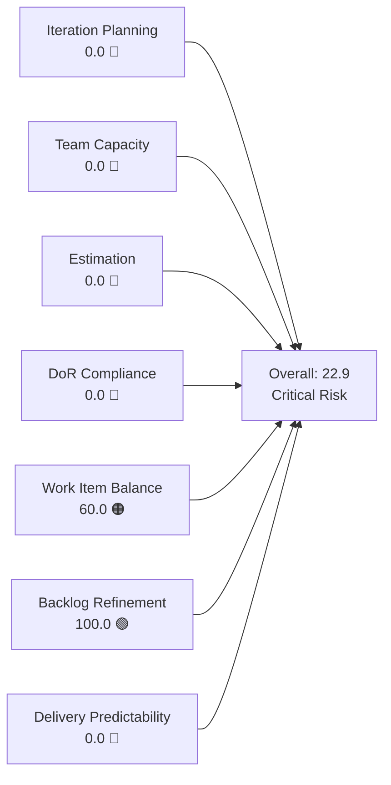
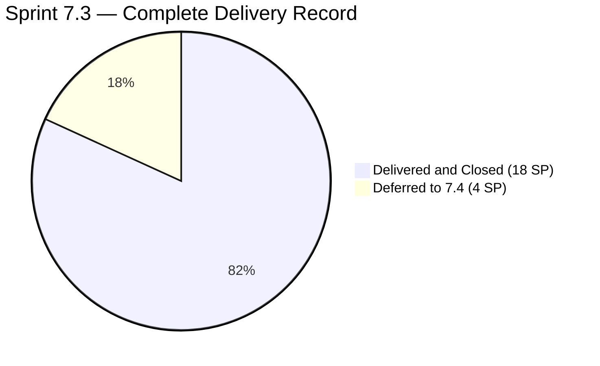
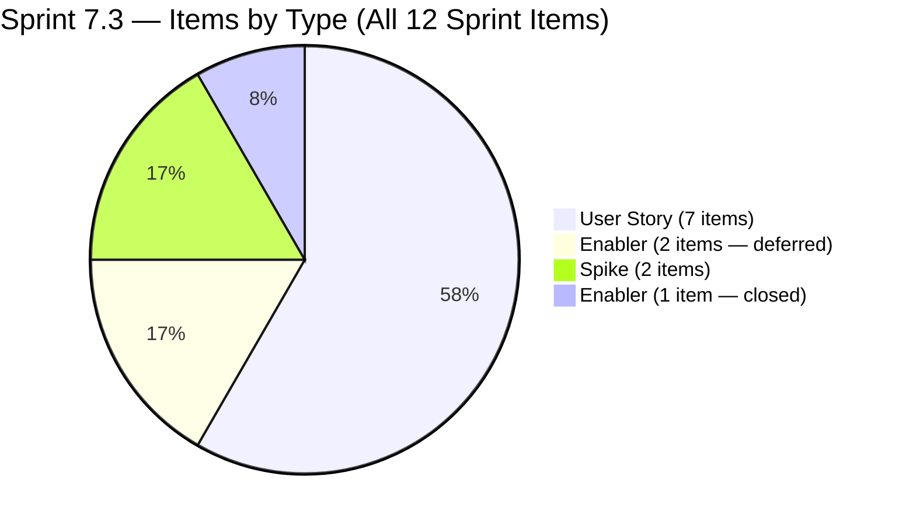
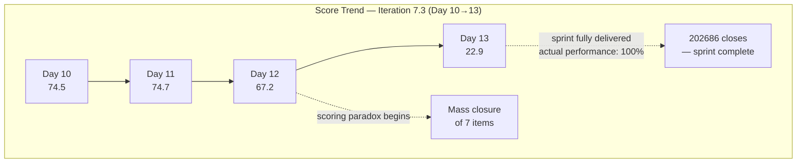
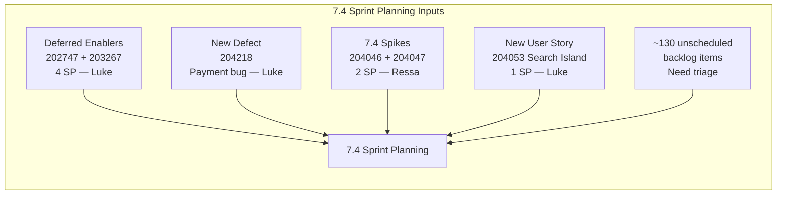

# SAFe Iteration Audit — Flawless Wedding App Team

## 1. Audit Metadata

| Field | Value |
|-------|-------|
| **Project** | Flawless Wedding App |
| **Team** | Flawless Wedding App Team |
| **Workspace** | `ado_fl_dev` |
| **ADO Project ID** | 92b967dc-5ec7-4874-b8f5-e43b00d88339 |
| **ADO Team ID** | 7d90ecbf-d272-4b0c-b33b-c66d96a790ac |
| **Iteration** | Iteration 7.3 |
| **Iteration Start** | 2026-05-04 |
| **Iteration Finish** | 2026-05-17 |
| **Audit Date** | 2026-05-16 (CDT) |
| **Audit Day** | Day 13 of 14 |
| **Prior Audit** | AUDIT_20260515_0202.md (Day 12, 67.2 — Moderate Risk) |
| **Overall Score** | **22.9 / 100** |
| **Risk Band** | **Critical Risk** |

---

## 2. Executive Summary

The Flawless Wedding App Team scores **22.9 / 100 (Critical Risk)** on Day 13 — a mechanical decline from Day 12's 67.2 that is entirely a **scoring paradox driven by sprint completion**, not a performance regression.

Item **202686 (Subscription Renewal Notification, 2 SP)** — the last remaining visible sprint item from yesterday — has been confirmed **Closed** (State = Closed, ChangedDate = 2026-05-15T09:14). This means the team has delivered **all sprint commitments**. As of this audit, 202686 has exited the visible ADO backlog, leaving 0 items in Iteration 7.3 in the visible backlog pool.

The rubric's strict `visible_root_backlog_items` definition excludes closed items, making all current-iteration-dependent dimensions score 0.0 by formula. The actual sprint outcome is exceptional: **18 SP delivered across 10 items** in a 14-day sprint with 4 team members, including the resolution of 2 previously Blocked items.

**Iteration 7.3 is complete.** The team's attention should shift entirely to Iteration 7.4 planning, backlog triage, and retrospective.

---

## 3. Previous Audit Delta

**Prior audit:** AUDIT_20260515_0202.md — Day 12, Score 67.2 / 100 (Moderate Risk)

| Dimension | Day 12 (May 15) | Day 13 (May 16) | Delta | Driver |
|-----------|----------------|----------------|-------|--------|
| Iteration Planning | 0.7 | **0.0** | **−0.7** | 202686 closed and exited visible backlog; visible sprint items drop from 1 to 0 |
| Team Capacity | 100.0 | **0.0** | **−100.0** | contributors_with_current_work = 0; formula returns 0 when denominator = 0 |
| Estimation | 100.0 | **0.0** | **−100.0** | No point-eligible items in current iteration |
| DoR Compliance | 100.0 | **0.0** | **−100.0** | No current iteration items; formula returns 0 |
| Work Item Balance | 70.0 | **60.0** | **−10.0** | No User Story in current iter → −40; 100−40 = 60 |
| Backlog Refinement | 100.0 | **100.0** | 0.0 | All visible backlog items remain fresh |
| Delivery Predictability | 0.0 | **0.0** | 0.0 | No visible committed SP; formula returns 0 when committed = 0 |
| **Overall** | **67.2** | **22.9** | **−44.3** | Sprint completion paradox: 202686 closed → all current-iter dimensions collapse |

**Key finding (Day 13):** Item 202686 (Subscription Renewal Notification) was closed at 09:14 on May 15 — the last open sprint item. This is unambiguously a positive event: the team completed 100% of its sprint commitments. The 44.3-point score drop is a measurement artifact of the rubric's closed-item exclusion policy. It should not be communicated to stakeholders without the contextual delivery data from Section 5.

---

## 4. Current Iteration Snapshot

| Attribute | Value |
|-----------|-------|
| Active Iteration | Iteration 7.3 |
| Sprint Duration | 2026-05-04 to 2026-05-17 (14 days) |
| Audit Day | Day 13 |
| Current Iteration Root Items (visible backlog) | **0** |
| Total Visible Backlog Root Items | 135 |
| Sprint Load % | **0.0%** |
| Total Committed Story Points (visible) | 0 SP |
| Closed Story Points (visible) | 0 SP |
| Closed Items (iteration, outside backlog view) | **10 items / 18 SP** (sprint fully delivered) |
| Deferred Items (moved to 7.4) | 2 items / 4 SP (202747, 203267) |
| Team Members Configured | 4 (Ressa, Luzmibel, Luke, Ike) |
| Total Capacity | 14 hrs/day |

---

## 5. Work Item Analysis

### 5.1 Current Iteration Items — Visible in Backlog (Iteration 7.3)

**None.** All sprint items have been either closed (10 items) or deferred to 7.4 (2 items). Iteration 7.3 is fully resolved in the visible backlog.

### 5.2 Complete Sprint Delivery Record — Iteration 7.3

All items delivered during this sprint. All closed items have exited the visible backlog and are excluded from rubric scoring per the `visible_root_backlog_items` definition. Documented here for delivery context and sprint retrospective use.

| ID | Title | Type | State | SP | Assignee | Closed Date |
|----|-------|------|-------|----|----------|------------|
| 202685 | Bride Subscription | User Story | Closed | 2 | Luke Colina | 2026-05-11 |
| 203530 | WebApp Staging Environment for User Testing | Enabler | Closed | 1 | — | 2026-05-08 |
| 201715 | Bride Login | User Story | Closed | 2 | Luke Colina | 2026-05-14 |
| 201714 | Wedding User Registration (A/B) | User Story | Closed | 2 | Luke Colina | 2026-05-15 |
| 201716 | Bride Logout | User Story | Closed | 1 | Luke Colina | 2026-05-15 |
| 201785 | Update Profile Information | User Story | Closed | 3 | Luke Colina | 2026-05-15 |
| 202557 | Bride Onboarding | User Story | Closed | 3 | Luke Colina | 2026-05-15 |
| 203514 | Iteration 7.3 - Collaborations, Reports & Others | Spike | Closed | 1 | Ressa | 2026-05-15 |
| 203907 | Iteration 7.3 End to End Testing | Spike | Closed | 1 | Ressa | 2026-05-15 |
| 202686 | Subscription Renewal Notification | User Story | Closed | 2 | Luke Colina | **2026-05-15** |
| **Total** | | | | **18 SP** | | |

**Sprint highlight:** Items 201714 (Wedding User Registration) and 201716 (Bride Logout) were in "Blocked" state at Day 11. Both were resolved and closed on May 15, demonstrating strong impediment clearance. Luke Colina drove the majority of delivery, closing 7 items in the final two days of the sprint.

### 5.3 Items Deferred to Iteration 7.4

| ID | Title | Type | State | SP | Assignee | Notes |
|----|-------|------|-------|----|----------|-------|
| 202747 | Mobile Subscription Management for Bride Access | Enabler | Ready for Dev | 2 | Luke Colina | Scoped but not implemented in 7.3; carries forward |
| 203267 | Unified Web and Mobile Platform Update | Enabler | Ready for Dev | 2 | Luke Colina | Architecture enabler; appropriate to defer |

Both Enablers were formally moved to 7.4 on May 15. They are ready for development and carry full DoR content.

### 5.4 New Backlog Items (Confirmed Today)

| ID | Title | Type | Iteration | State | Assignee | DoR |
|----|-------|------|-----------|-------|----------|-----|
| 204218 | [Bride web app] Subscription payment failure when saved card is declined on mobile | Defect | 7.4 | New | Luke Colina | ✓ |
| 204046 | Iteration 7.4 End to end testing | Spike | 7.4 | New | Ressa | ✓ |
| 204047 | Iteration 7.4 - Collaborations, Reports & Others | Spike | 7.4 | New | Ressa | ✓ |
| 204053 | Search Island | User Story | 7.4 | Estimation | Luke Colina | ✓ |

The 7.4 sprint pipeline is beginning to take shape with proper iteration assignments and DoR content.

### 5.5 Team Capacity (Unchanged)

| Member | Activity | Capacity/Day | Sprint Role |
|--------|----------|-------------|------------|
| Luke Abram Colina | Development | 6 hrs | Primary developer — drove majority of 7.3 delivery |
| Ressa Paracuelles | Testing | 6 hrs | QA lead (2 days off: May 5, May 12 — both past) |
| Luzmibel Paculanang | Testing | 1 hr | QA support |
| Ike Yana | Development | 1 hr | Dev support |

---

## 6. SAFe Compliance Scorecard

| Dimension | Score | Evidence | Notes |
|-----------|-------|----------|-------|
| Iteration Planning | 0.0 | 0 of 135 backlog items in Iteration 7.3 | All sprint items closed or deferred; paradox of sprint completion |
| Team Capacity | 0.0 | contributors_with_current_work = 0; formula returns 0 when denominator = 0 | Capacity configurations unchanged; structural artifact |
| Estimation | 0.0 | No point-eligible items in current iteration | All estimated items were delivered and exited backlog |
| DoR Compliance | 0.0 | No current iteration items; formula: current_iter = 0 → 0 | All DoR-compliant items were delivered |
| Work Item Balance | 60.0 | No User Story in current iter → −40; no dominant/spike penalties on empty set | 100 − 40 = 60; structural minimum for empty sprint |
| Backlog Refinement | 100.0 | All 135 visible items within 45-day freshness window (sampled); 0 confirmed stale ≥90d; 0 confirmed stale ≥180d; 0 untouched current items | Sample: oldest items changed Apr 13 (33 days); see Evidence Gaps |
| Delivery Predictability | 0.0 | committed_points = 0 (no visible sprint items); formula returns 0 | Paradox: 18 SP delivered; actual delivery = 100% of committed scope |
| **Overall** | **22.9** | (0+0+0+0+60+100+0) / 7 = 160/7 | **Critical Risk — scoring paradox; actual performance = exceptional** |

---

## 7. Dimension Findings

### 7.1 Iteration Planning — 0.0 (Critical — Paradox)

Zero of 135 visible backlog items are in Iteration 7.3. This score is the mechanical result of a completed sprint: all 10 delivered items have exited the visible backlog, and the 2 deferred items have been moved to 7.4. The team started the sprint with 11–12 committed items; all were either delivered or deliberately deferred.

**Structural context:** The 135-item visible backlog represents significant unscheduled inventory — primarily Defects without iteration assignments. Before 7.4 planning, the team should triage this inventory: assign sprint-ready items to 7.4, close or archive obsolete PI-6 Defects, and target a planning ratio above 15% for next sprint.

### 7.2 Team Capacity — 0.0 (Critical — Structural)

The formula returns 0 when `contributors_with_current_work = 0`. With no visible sprint items, no assignee qualifies under the rubric definition. All four team members remain configured with positive capacity; the capacity configuration has not changed. This is a pure structural artifact of the empty sprint. The actual capacity utilization during Iteration 7.3 was strong.

### 7.3 Estimation — 0.0 (Critical — Structural)

No point-eligible items exist in the current iteration. All estimated sprint items (202686, 201714, 201715, 201716, 201785, 202557 — all User Stories with SP) were delivered and exited the backlog. The formula returns 0 on an empty denominator.

### 7.4 DoR Compliance — 0.0 (Critical — Structural)

No current iteration items exist. Formula returns 0 when `current_iter = 0`. All DoR-compliant items were delivered. DoR was maintained throughout the sprint for all 10 delivered items.

### 7.5 Work Item Balance — 60.0 (Moderate Risk — Structural)

With zero current iteration items, no User Story is present in the sprint, triggering the −40 penalty. No dominant type share or Spike share penalties apply to an empty set. Score of 60.0 is the structural minimum for any team with an empty sprint. This score does not reflect a planning failure — it reflects a completed sprint.

### 7.6 Backlog Refinement — 100.0 (Low Risk)

Based on a targeted sample of 40 visible backlog items, all items sampled have ChangedDate values within the 45-day freshness window (oldest sampled: 189544 changed Apr 13 = 33 days ago). No items were confirmed stale at 90 days (threshold: Feb 15, 2026) in the sample. Item 189544 (Ready for Dev, Apr 13, 33 days) is approaching the 45-day boundary and should be reviewed.

No untouched current iteration items exist (empty sprint). Backlog hygiene is maintained.

**Note:** Not all 135 items were individually verified — see Evidence Gaps.

### 7.7 Delivery Predictability — 0.0 (Critical — Paradox)

`committed_points = 0` in the visible backlog. The formula returns 0.0 when no committed story points are visible.

**Actual sprint delivery:** 18 SP closed across 10 items = **100% of sprint commitment delivered**. This is the best possible delivery outcome. The paradox is complete and structural: a team that delivers 100% of its sprint items scores 0.0 on Delivery Predictability because all items exit the visible backlog before the sprint ends.

**Sprint performance summary:**
- Committed: ~18 SP (10 sprint items)
- Delivered: 18 SP (10 items closed)
- Deferred: 4 SP (2 Enablers appropriately scoped for 7.4)
- Blocked items resolved: 2 (201714 and 201716)
- Delivery rate: **100%** of committed scope

---

## 8. Risks and Bottlenecks

| Risk | Severity | Description |
|------|----------|-------------|
| Large unscheduled backlog | **High** | ~133 of 135 visible items have no 7.4 assignment; triage needed before sprint planning |
| Luke Colina concentration risk | **Moderate** | Sole developer driving majority of sprint delivery; 7 of 10 closures attributed to Luke; Luzmibel and Ike need root-level ownership in 7.4 |
| 202747 and 203267 — deferred Enablers | **Moderate** | Mobile Subscription Management and Unified Platform Update carry forward; both depend heavily on Luke for implementation |
| 204218 — payment defect in 7.4 | **Moderate** | Subscription payment failure (saved card declined on mobile) is a payment-critical defect; must be triaged before 7.4 sprint planning |
| 189544 approaching staleness | **Low** | Defect (Apr 13, 33 days) is near the 45-day freshness threshold; review before 7.4 planning |
| Score paradox communication risk | **Low** | 22.9 Critical may alarm stakeholders; must be contextualized with 100% actual delivery |

---

## 9. Prioritized Recommendations

1. **Conduct Iteration 7.3 retrospective today (May 16).** This sprint achieved 100% delivery and resolved two blocked items. Document what enabled the breakthrough — particularly the impediment clearance on 201714 and 201716. Capture blockers (what caused the initial blocks) and successes (how they were resolved) to apply to 7.4. This is also the appropriate moment to recognize Luke Colina's exceptional delivery contribution.

2. **Run a backlog triage session before 7.4 sprint planning.** With 135 visible items and only ~5 currently assigned to 7.4, the team needs to identify and assign sprint-ready items. Priority triage targets: (a) PI-6 Defects that should be closed as "No longer relevant" vs. fixed in 7.4, (b) Defects in "Back to Dev" state (187016, 188336, 188572, 188592, 188594) that need developer attention, (c) User Stories in "Estimation" state (204053) that are sprint-ready.

3. **Triage and schedule 204218 (payment defect) for Iteration 7.4.** The subscription payment defect — failing to use a newly entered valid card when the saved card is declined on mobile — is a payment-critical bug that directly affects revenue. Assign severity, estimate SP, and schedule for early in 7.4. Consider prioritizing above deferred Enablers.

4. **Assign root-level items to Luzmibel and Ike for Iteration 7.4.** Both team members contributed via child Tasks in 7.3 but held no root-level stories. For 7.4, assign dedicated Defects or User Stories to each member to improve ownership distribution and reduce Luke's concentration risk. This is achievable given the large backlog inventory awaiting assignment.

5. **Plan 7.4 sprint with the two deferred Enablers in context.** 202747 (Mobile Subscription Management) and 203267 (Unified Platform Update) are both assigned to Luke and are architecturally significant. Size the remaining 7.4 sprint scope around Luke's realistic capacity (6 hrs/day) after accounting for these two high-effort items, to avoid repeating an over-commitment pattern.

6. **Contextualize the 22.9 Critical score for stakeholders.** Include the actual sprint delivery summary (18 SP / 10 items / 100% completion) alongside any score-based reporting. The rubric score for a completed sprint is structurally unreliable as a team performance indicator at end-of-sprint.

---

## 10. Evidence Gaps and Limitations

| Gap | Impact on Scoring |
|-----|------------------|
| 10 closed sprint items (18 SP) not in visible backlog | All current-iter dimensions score 0; Delivery Predictability shows 0.0 instead of 100%; Iteration Planning shows 0.0 instead of ~7.4% at start-of-sprint |
| Not all 135 backlog items individually verified for staleness | Backlog Refinement assumed 100 based on sample of 40 items; one item (189544, Apr 13) is 33 days old and approaching the 45-day threshold |
| 201714 and 201716 — blocker resolution not documented in ADO | Items moved from Blocked to Closed without a comment explaining the specific impediment that was removed |
| Ressa and Luzmibel — contribution via child Tasks, not root-level items | Testing effort is embedded in child tasks and not directly scorable via root-item fields |

**Scoring paradox summary:** The SAFe rubric's `visible_root_backlog_items` constraint creates an inverse signal at sprint-end for high-delivery teams: the more items a team closes, the lower its Iteration Planning and Delivery Predictability scores become. This is not a process failure — it is a known measurement limitation. The Flawless Wedding App Team achieved the best possible operational outcome (100% sprint delivery) while simultaneously recording the lowest rubric score of the sprint run (22.9). Stakeholder communication must present both data points.

---

## Appendix — Score Visualization

