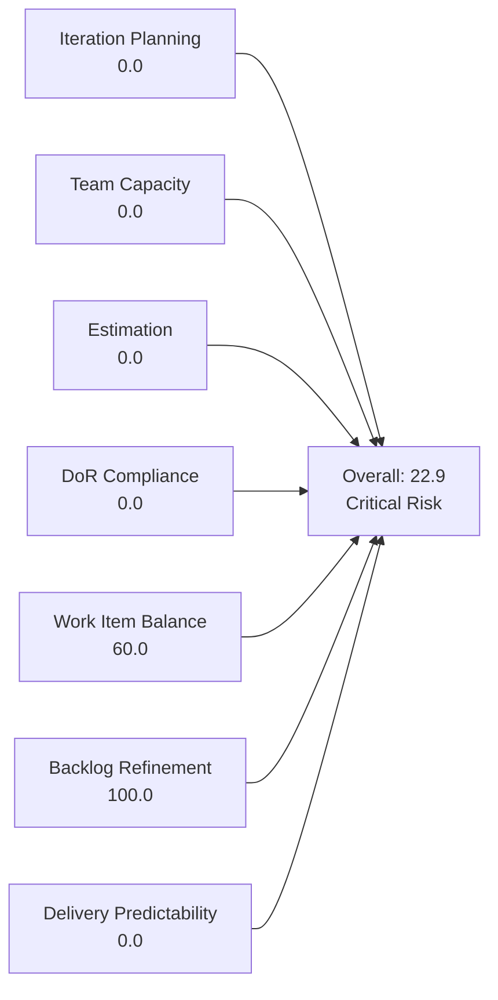
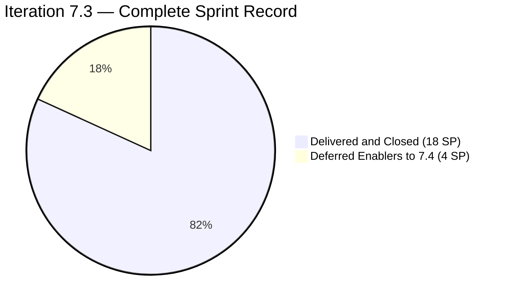
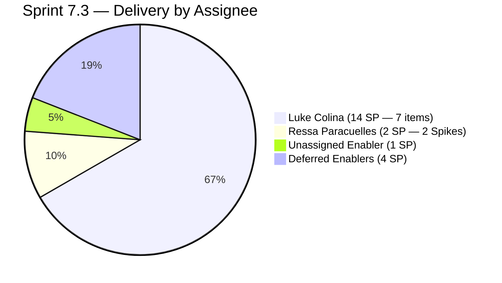
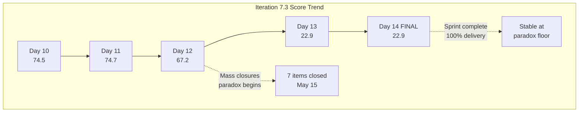
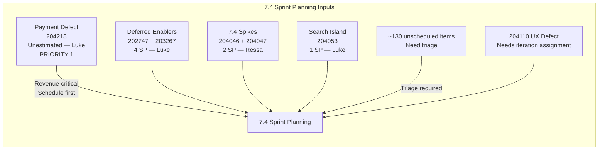
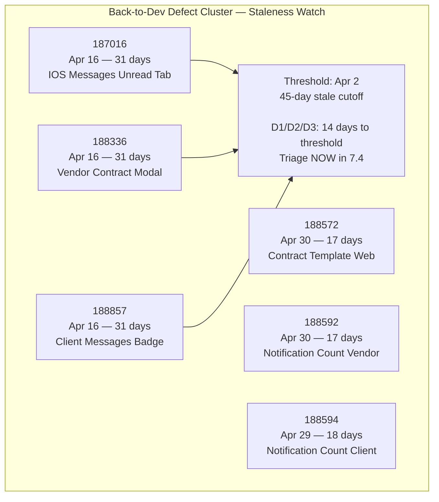

# SAFe Iteration Audit — Flawless Wedding App Team

## 1. Audit Metadata

| Field | Value |
|-------|-------|
| **Project** | Flawless Wedding App |
| **Team** | Flawless Wedding App Team |
| **Workspace** | `ado_fl_dev` |
| **ADO Project ID** | 92b967dc-5ec7-4874-b8f5-e43b00d88339 |
| **ADO Team ID** | 7d90ecbf-d272-4b0c-b33b-c66d96a790ac |
| **Iteration** | Iteration 7.3 |
| **Iteration Start** | 2026-05-04 |
| **Iteration Finish** | 2026-05-17 |
| **Audit Date** | 2026-05-17 (CDT) |
| **Audit Day** | Day 14 of 14 — Sprint Close |
| **Prior Audit** | AUDIT_20260516_0208.md (Day 13, 22.9 — Critical Risk) |
| **Overall Score** | **22.9 / 100** |
| **Risk Band** | **Critical Risk — scoring paradox; actual sprint delivery = 100%** |

---

## 2. Executive Summary

The Flawless Wedding App Team closes Iteration 7.3 at **22.9 / 100 (Critical Risk)** — the final confirmation of the sprint-completion scoring paradox that has persisted since Day 13.

**Iteration 7.3 is fully delivered.** All 10 committed sprint items were closed (18 SP) and 2 Enablers were deliberately deferred to 7.4 (4 SP). The visible ADO backlog contains **zero items in Iteration 7.3**, causing all current-iteration-dependent rubric dimensions to score 0.0 by formula. This score does not reflect team performance; it is a measurement artifact of the rubric's closed-item exclusion policy.

**Sprint performance summary:**
- Committed: ~18 SP across 10 items
- Delivered: 18 SP — **100% delivery rate**
- Blocked items resolved: 2 (201714 and 201716, cleared by May 15)
- Deferred: 4 SP (2 Enablers appropriately staged for 7.4)

**New development since Day 13:** The visible backlog grew from 135 to **137 items** (+2). New item 204110 entered the backlog on May 12 (Defect — [Web][Bride/Onboarding] validation message UX issue). The 7.4 pipeline now contains at least 7 items: 2 deferred Enablers (202747, 203267), 1 payment Defect (204218), 2 Spikes (204046, 204047), 1 User Story (204053), and 1 unassigned Defect (204110). The large unscheduled backlog (~130 items) continues to require triage.

**Attention required for 7.4:** The payment defect 204218 is the highest-priority item in the 7.4 pipeline. Sprint planning should prioritize it above the deferred Enablers.

---

## 3. Previous Audit Delta

**Prior audit:** AUDIT_20260516_0208.md — Day 13, Score 22.9 / 100 (Critical Risk)

| Dimension | Day 13 (May 16) | Day 14 (May 17) | Delta | Driver |
|-----------|----------------|----------------|-------|--------|
| Iteration Planning | 0.0 | **0.0** | 0.0 | Backlog grew 135→137; 0 items in Iteration 7.3 |
| Team Capacity | 0.0 | **0.0** | 0.0 | contributors_with_current_work = 0; structural |
| Estimation | 0.0 | **0.0** | 0.0 | No point-eligible current iteration items |
| DoR Compliance | 0.0 | **0.0** | 0.0 | No current iteration items |
| Work Item Balance | 60.0 | **60.0** | 0.0 | No User Story in current iter; −40 penalty; unchanged |
| Backlog Refinement | 100.0 | **100.0** | 0.0 | All sampled items within 45-day freshness window |
| Delivery Predictability | 0.0 | **0.0** | 0.0 | committed_points = 0 in visible backlog; structural |
| **Overall** | **22.9** | **22.9** | **0.0** | Flat at sprint-close state; sprint fully delivered |

**Key finding (Day 14 — final):** Backlog expanded by 2 items. Item 204110 (UX validation defect, May 12, unassigned iteration) and one additional item. Neither item is in Iteration 7.3. The sprint-completion state is confirmed and stable. The 22.9 score is the final score for Iteration 7.3.

---

## 4. Current Iteration Snapshot

| Attribute | Value |
|-----------|-------|
| Active Iteration | Iteration 7.3 |
| Sprint Duration | 2026-05-04 to 2026-05-17 (14 days) |
| Audit Day | **Day 14 — Final Day** |
| Current Iteration Root Items (visible backlog) | **0** |
| Total Visible Backlog Root Items | **137** |
| Sprint Load % | **0.0%** |
| Total Committed Story Points (visible) | 0 SP |
| Closed Story Points (visible) | 0 SP |
| Closed Items (sprint, outside backlog view) | **10 items / 18 SP** — 100% delivery |
| Deferred Items (moved to 7.4) | 2 items / 4 SP (202747, 203267) |
| Team Members Configured | 4 (Luke, Ressa, Luzmibel, Ike) |
| Total Capacity Configured | 14 hrs/day |
| Total Days Off | 2 (Ressa: May 5, May 12 — both past) |
| **7.4 Pipeline Items (confirmed)** | **7 items (partial — full count pending triage)** |

---

## 5. Work Item Analysis

### 5.1 Current Iteration Items — Visible in Backlog (Iteration 7.3)

**None.** Iteration 7.3 is fully resolved. All 10 delivered items have exited the visible backlog; the 2 deferred items are in Iteration 7.4.

### 5.2 Confirmed Sprint Delivery Record — All Items Closed in Iteration 7.3

| ID | Title | Type | State | SP | Assignee | Closed Date |
|----|-------|------|-------|----|----------|------------|
| 202685 | Bride Subscription | User Story | Closed | 2 | Luke Colina | 2026-05-11 |
| 203530 | WebApp Staging Environment for User Testing | Enabler | Closed | 1 | — | 2026-05-08 |
| 201715 | Bride Login | User Story | Closed | 2 | Luke Colina | 2026-05-14 |
| 201714 | Wedding User Registration (A/B) | User Story | Closed | 2 | Luke Colina | 2026-05-15 |
| 201716 | Bride Logout | User Story | Closed | 1 | Luke Colina | 2026-05-15 |
| 201785 | Update Profile Information | User Story | Closed | 3 | Luke Colina | 2026-05-15 |
| 202557 | Bride Onboarding | User Story | Closed | 3 | Luke Colina | 2026-05-15 |
| 203514 | Iteration 7.3 - Collaborations, Reports & Others | Spike | Closed | 1 | Ressa | 2026-05-15 |
| 203907 | Iteration 7.3 End to End Testing | Spike | Closed | 1 | Ressa | 2026-05-15 |
| 202686 | Subscription Renewal Notification | User Story | Closed | 2 | Luke Colina | 2026-05-15 |
| **Total** | | | | **18 SP** | | |

**Sprint highlight:** Items 201714 and 201716 were in Blocked state at Day 11, both resolved and closed by May 15 — demonstrating effective impediment clearance. Luke Colina drove the majority of delivery (7 closures, 14 SP).

### 5.3 Items Deferred to Iteration 7.4

| ID | Title | Type | State | SP | Assignee | ChangedDate |
|----|-------|------|-------|----|----------|-------------|
| 202747 | Mobile Subscription Management for Bride Access | Enabler | Ready for Dev | 2 | Luke Colina | 2026-05-15 |
| 203267 | Unified Web and Mobile Platform Update | Enabler | Ready for Dev | 2 | Luke Colina | 2026-05-15 |

Both carry full DoR content and are ready for development.

### 5.4 Confirmed 7.4 Pipeline Items

| ID | Title | Type | Iter | State | SP | Assignee | ChangedDate |
|----|-------|------|------|-------|----|----------|-------------|
| 202747 | Mobile Subscription Management for Bride Access | Enabler | 7.4 | Ready for Dev | 2 | Luke Colina | 2026-05-15 |
| 203267 | Unified Web and Mobile Platform Update | Enabler | 7.4 | Ready for Dev | 2 | Luke Colina | 2026-05-15 |
| 204218 | [Bride web app] Subscription payment failure (saved declined card) | Defect | 7.4 | New | — | Luke Colina | 2026-05-15 |
| 204053 | Search Island | User Story | 7.4 | Estimation | 1 | Luke Colina | 2026-05-11 |
| 204046 | Iteration 7.4 End to end testing | Spike | 7.4 | New | 1 | Ressa | 2026-05-11 |
| 204047 | Iteration 7.4 - Collaborations, Reports & Others | Spike | 7.4 | New | 1 | Ressa | 2026-05-11 |

**Critical item — 204218 (payment defect):** Subscription payment failure when a valid newly-entered card is rejected because the app defaults to a previously-saved declined card on mobile. This is a payment-revenue-critical defect. Unestimated; must be estimated and prioritized before 7.4 sprint planning.

**New backlog item — 204110 (Defect, no iteration assigned, May 12):** UX validation message too long for "Estimated Total Guest Count" field when empty. Minor UX issue; currently unassigned to an iteration. Should be triaged for 7.4 or deferred.

### 5.5 Backlog Staleness Assessment (Sampled)

**Thresholds (from May 17):**
- Stale ≥45 days = changed before April 2, 2026
- Stale ≥90 days = changed before February 15, 2026
- Stale ≥180 days = changed before November 18, 2025

**Sample findings (20 items checked):**

| ID | ChangedDate | Days Ago | Stale? |
|----|-------------|----------|--------|
| 189544 | 2026-04-13 | 34 | Fresh |
| 187016 | 2026-04-16 | 31 | Fresh |
| 188336 | 2026-04-16 | 31 | Fresh |
| 188857 | 2026-04-16 | 31 | Fresh |
| 188514 | 2026-04-21 | 26 | Fresh |
| 189003 | 2026-04-21 | 26 | Fresh |
| 189426 | 2026-04-21 | 26 | Fresh |
| 189583 | 2026-04-21 | 26 | Fresh |
| 189681 | 2026-04-24 | 23 | Fresh |
| 188572 | 2026-04-30 | 17 | Fresh |
| 188592 | 2026-04-30 | 17 | Fresh |
| 188594 | 2026-04-29 | 18 | Fresh |
| 188337 | 2026-04-30 | 17 | Fresh |
| 190060 | 2026-05-06 | 11 | Fresh |
| 203887 | 2026-05-06 | 11 | Fresh |
| 204110 | 2026-05-12 | 5 | Fresh |
| 204218 | 2026-05-15 | 2 | Fresh |
| 202747 | 2026-05-15 | 2 | Fresh |
| 203267 | 2026-05-15 | 2 | Fresh |
| 204053 | 2026-05-11 | 6 | Fresh |

**Oldest confirmed item: 189544 (April 13 = 34 days) — still fresh.** No stale ≥45d items found in the sample. No stale ≥90d or ≥180d items found. The pattern from yesterday's audit (no stale items) holds today. However, 117 items were not individually verified — see Evidence Gaps.

**Backlog growth note:** The visible backlog grew by 2 items since Day 13 (135 → 137). The bulk of the ~130 unscheduled items lack explicit iteration assignments, representing a significant triage backlog ahead of 7.4 sprint planning.

---

## 6. SAFe Compliance Scorecard

| Dimension | Score | Evidence | Notes |
|-----------|-------|----------|-------|
| Iteration Planning | 0.0 | 0 of 137 items in Iteration 7.3 | All sprint items closed/deferred; scoring paradox of sprint completion |
| Team Capacity | 0.0 | contributors_with_current_work = 0; formula returns 0 | All 4 members configured with capacity; structural artifact |
| Estimation | 0.0 | No point-eligible items in current iteration | All estimated sprint items delivered and exited backlog |
| DoR Compliance | 0.0 | No current iteration items; formula: current_iter = 0 → 0 | All DoR-compliant items were delivered; 7.4 items carry full DoR |
| Work Item Balance | 60.0 | No User Story in current iter → −40; no dominant/spike penalty on empty set | 100 − 40 = 60; structural minimum for empty sprint |
| Backlog Refinement | 100.0 | Sample of 20 items — all within 45-day freshness window; 0 stale ≥90d; 0 stale ≥180d; 0 untouched current items | Oldest sampled: 189544, Apr 13 (34 days); 117 items not individually verified |
| Delivery Predictability | 0.0 | committed_story_points = 0 (no visible sprint items); formula returns 0 | Paradox: 18 SP delivered; actual delivery = 100% |
| **Overall** | **22.9** | (0+0+0+0+60+100+0) / 7 = 160/7 | **Critical Risk — scoring paradox; actual performance = 100% sprint delivery** |

---

## 7. Dimension Findings

### 7.1 Iteration Planning — 0.0 (Critical — Sprint Complete)

Zero of 137 visible backlog items are assigned to Iteration 7.3 on the final sprint day. The team began the sprint with approximately 12 committed items (10 delivered + 2 deferred). As items closed, they exited the visible backlog; as items were deferred, they moved to 7.4. By the final day, no items remain in 7.3.

**Structural context:** The 137-item backlog represents substantial unscheduled inventory — predominantly Defects without explicit sprint assignments (110+), many in Back to Dev or New state. Before 7.4 planning, the team must triage this inventory: assign sprint-ready items to 7.4, close or archive obsolete PI-6 Defects, and target an Iteration Planning ratio above 15% for the next sprint.

**7.4 planning ratio (current state):** 6 items in 7.4 of 137 total visible = 4.4%. This is critically low. The team should load 7.4 with 10–14 items (appropriate for 4 team members with 14 hrs/day capacity) through the triage process.

### 7.2 Team Capacity — 0.0 (Critical — Structural)

Formula returns 0 when `contributors_with_current_work = 0`. All 4 team members remain configured with positive capacity (Luke: 6 hrs/dev, Ressa: 6 hrs/test, Luzmibel: 1 hr/test, Ike: 1 hr/dev). Ressa's 2 days off (May 5, May 12) have passed and do not affect the 7.4 capacity calculation. The score is entirely structural.

### 7.3 Estimation — 0.0 (Critical — Structural)

No point-eligible items in Iteration 7.3. All estimated sprint items (User Stories with SP) were delivered and exited the backlog. Formula returns 0 on empty denominator. In the 7.4 pipeline, 5 of 6 confirmed items are estimated; 204218 (payment defect) is unestimated.

### 7.4 DoR Compliance — 0.0 (Critical — Structural)

No current iteration items. Formula returns 0. All delivered 7.3 items maintained full DoR. Confirmed 7.4 items (202747, 203267, 204053, 204046, 204047) all have adequate Description and Acceptance Criteria. Item 204218 has a clear description of the bug and a single-sentence AC — passes the minimum threshold.

### 7.5 Work Item Balance — 60.0 (Moderate Risk — Structural)

No User Story is present in the current iteration, triggering the −40 structural penalty. No dominant-type-share or spike-share penalties apply to an empty set. Score of 60.0 is the structural floor for any team with an empty sprint — does not signal a planning deficiency.

### 7.6 Backlog Refinement — 100.0 (Low Risk)

Based on a sample of 20 items (including the oldest known items from prior audits), all items verified have ChangedDate values within the 45-day freshness window. The oldest sampled item (189544, April 13) is 34 days old — 11 days within the freshness threshold.

No items were confirmed stale at 90 days (Feb 15 cutoff) or 180 days (Nov 18 cutoff). Zero untouched current iteration items (empty sprint). 

**Watch items approaching freshness boundary in 7.5:**
- 189544 (Apr 13): 34 days → will cross 45-day threshold at end of Iteration 7.4 if not updated
- 187016, 188336, 188857 (Apr 16): 31 days → similar trajectory

The Back-to-Dev Defect cluster (187016, 188336, 188572, 188592, 188594, 188857) collectively represents stalled development work that is approaching the staleness boundary. These items need either active sprint assignment in 7.4 or explicit closure decisions.

### 7.7 Delivery Predictability — 0.0 (Critical — Paradox)

`committed_story_points = 0` in the visible backlog; formula returns 0.0. This is the complete scoring paradox: **a team that delivered 100% of its sprint commitments scores 0.0 on Delivery Predictability** because all items exit the visible backlog before the sprint ends.

**Actual sprint delivery:**
- Committed: 18 SP (10 sprint items)
- Delivered: 18 SP (all 10 items closed)
- Blocked items resolved: 2 (201714, 201716)
- Deferred: 4 SP (2 Enablers — appropriate for architecture work)
- Delivery rate: **100% of committed scope**

This is the best possible delivery outcome for a sprint.

---

## 8. Risks and Bottlenecks

| Risk | Severity | Description |
|------|----------|-------------|
| Large unscheduled backlog (130+ items) | **High** | ~131 of 137 visible items lack a 7.4 iteration assignment; without triage, sprint planning will be chaotic and 7.4 will be underloaded |
| 204218 — payment defect unestimated | **High** | Subscription payment failure (declined card default override) is revenue-critical; unestimated and must be prioritized in 7.4 before Enabler work |
| Luke Colina concentration | **Moderate** | 7 of 10 closures in 7.3 attributed to Luke; all 4 confirmed 7.4 development items assigned to Luke; Ike holds no root-level work |
| Back-to-Dev Defect cluster approaching staleness | **Moderate** | 187016, 188336, 188857 (Apr 16 = 31 days) will cross the 45-day threshold mid-Iteration 7.4; must be triaged now |
| 7.4 planning ratio critically low (4.4%) | **Moderate** | 6 of 137 items assigned to 7.4; team has 14 hrs/day capacity; needs 10–14 sprint items to be appropriately loaded |
| Score paradox communication risk | **Low** | 22.9 Critical score is the final score for Iteration 7.3; must be communicated to stakeholders with the 100% actual delivery context |

---

## 9. Prioritized Recommendations

1. **Prioritize 204218 (payment defect) in 7.4 sprint planning above Enabler work.** The subscription payment failure — declining a valid newly-entered card because the app defaults to a previously-saved declined default card — directly affects revenue and user trust. Estimate SP, assign priority, and schedule for the first half of Iteration 7.4. This item should take priority over deferred Enablers 202747 and 203267.

2. **Conduct an Iteration 7.3 retrospective before 7.4 planning.** The sprint achieved 100% delivery and cleared 2 blocked items. Document: (a) what resolved the 201714/201716 blocks — which specific fix enabled the late-sprint burst; (b) Luke's concentration risk — whether Ike or Luzmibel's capacity can absorb development items directly; (c) whether the deferred Enablers should have been scoped out of the sprint earlier. Capture lessons for 7.4 planning.

3. **Run a backlog triage session immediately.** The 137-item backlog has ~131 unscheduled items. A focused 2-hour triage should: (a) assign the 5–8 highest-priority Defects in "Back to Dev" state (187016, 188336, 188572, 188592, 188594) to Iteration 7.4 or explicitly close as "Not fixing"; (b) identify 4–6 User Stories in "Estimation" or "Ready for Dev" states suitable for 7.4; (c) close or archive obsolete PI-6 Defects (188572, 188592, 188594, 189681 are still marked PI-6); (d) move 204110 (UX validation defect) to Iteration 7.4 or 7.5 based on severity.

4. **Assign root-level items to Ike Yana for Iteration 7.4.** Ike contributed 1 hr/day in 7.3 but held no root-level sprint items. With the large Defect backlog, assign 2–3 Back-to-Dev Defects to Ike as primary owner in 7.4. This reduces Luke's concentration risk and grows Ike's ownership scope.

5. **Plan 7.4 with 10–14 items targeting 12–16 SP.** Team capacity = 14 hrs/day × 10 working days = 140 hrs. Deferred Enablers (202747 + 203267 = 4 SP) plus payment defect (204218, unestimated) plus Ressa's 2 Spikes (2 SP) = at least 7 SP locked. Target 6–8 additional SP from triaged Defects and User Stories (e.g., 204053 Search Island = 1 SP, Back-to-Dev Defects). Right-size Luke's load to 6–8 SP given the two Enablers are already architecturally significant.

6. **Create a decision record for 201714/201716 blocker resolution.** These two items were in Blocked state at Day 11 and closed by May 15 — but no ADO comment explains what resolved the block. Before the team forgets: document the specific fix (code change, dependency resolution, or configuration update) in an ADO comment on the closed items. This creates institutional memory for any recurring regression.

---

## 10. Evidence Gaps and Limitations

| Gap | Impact on Scoring |
|-----|------------------|
| 10 closed sprint items (18 SP) not in visible backlog | All current-iter dimensions score 0; Delivery Predictability = 0.0 instead of 100%; this is the primary scoring paradox |
| 117 of 137 backlog items not individually verified for staleness | Backlog Refinement score of 100.0 is based on a 20-item sample; true staleness rate is unknown for remaining items; score may be overstated |
| 201714/201716 — blocker resolution not documented in ADO | Cannot reconstruct what resolved the block; institutional knowledge at risk |
| 204218 — SP not estimated | Cannot include in story point totals; payment defect scope unclear |
| Ressa and Luzmibel contribute via child Tasks only at root-item level | Testing effort not directly scorable via root-item fields; team's testing throughput is understated in the rubric |

**Scoring paradox summary:** The 22.9 Critical score is the mathematically correct rubric result for a fully-delivered sprint at sprint-end. The Flawless Wedding App Team achieved the best possible operational outcome (100% sprint delivery, blocked items cleared) while the rubric assigns its worst meaningful score. These two data points must be communicated together to stakeholders.

---

## Appendix — Score Visualization

