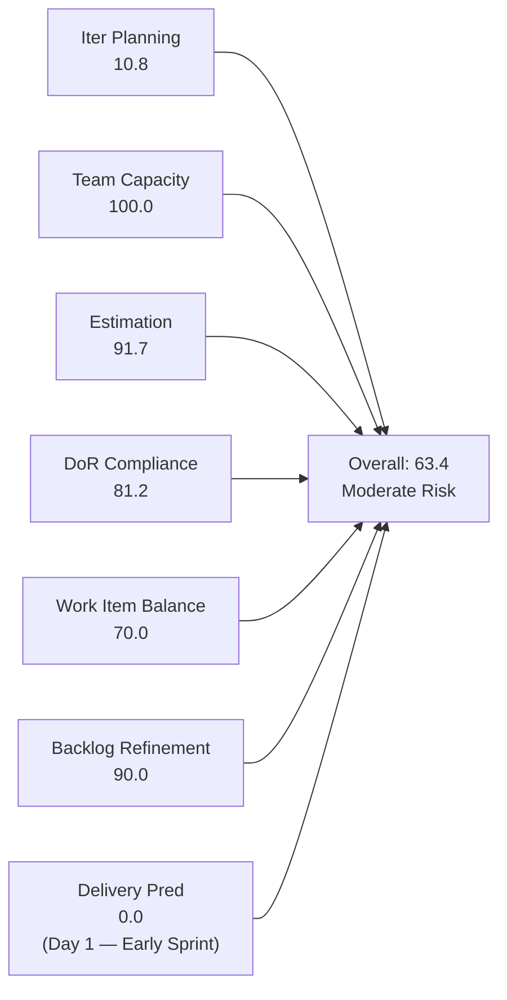
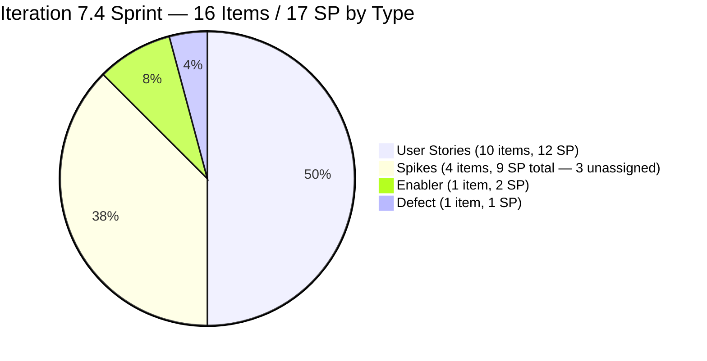
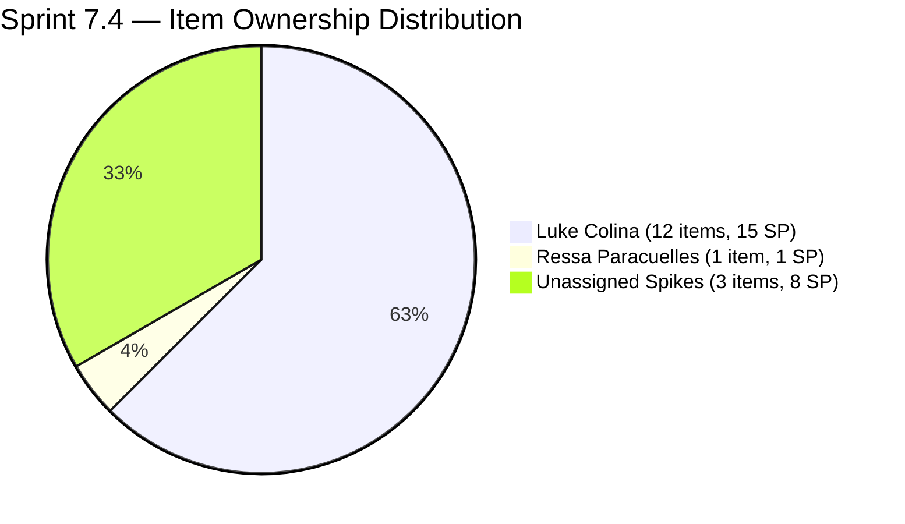
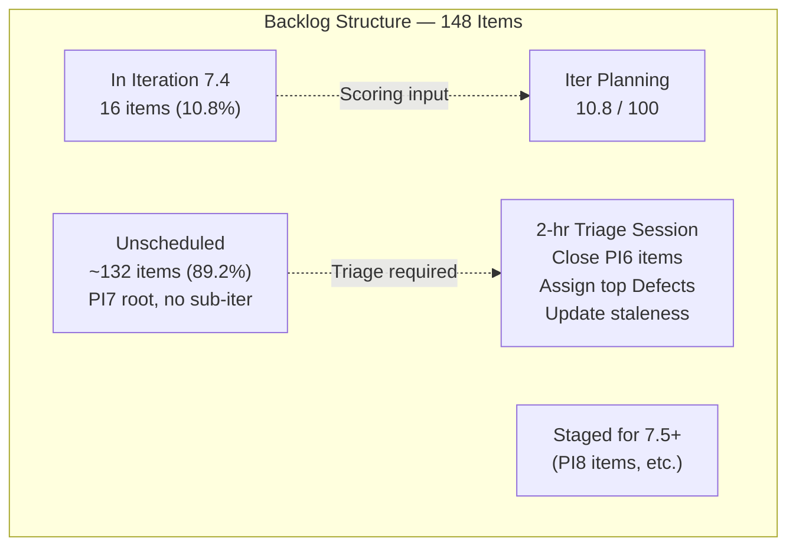
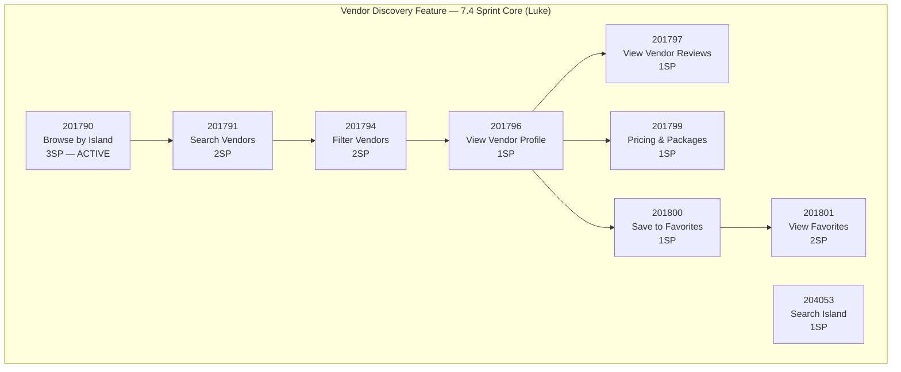
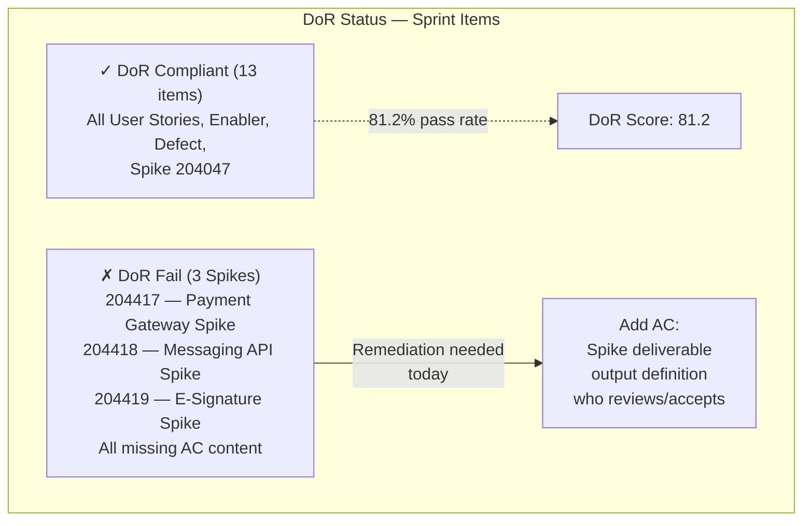
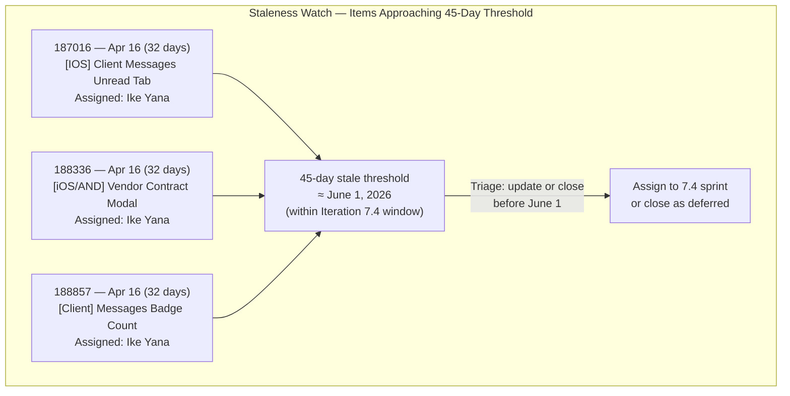

# SAFe Iteration Audit — Flawless Wedding App Team

## 1. Audit Metadata

| Field | Value |
|-------|-------|
| **Project** | Flawless Wedding App |
| **Team** | Flawless Wedding App Team |
| **Workspace** | `ado_fl_dev` |
| **ADO Project ID** | 92b967dc-5ec7-4874-b8f5-e43b00d88339 |
| **ADO Team ID** | 7d90ecbf-d272-4b0c-b33b-c66d96a790ac |
| **Iteration** | Iteration 7.4 |
| **Iteration Start** | 2026-05-18 |
| **Iteration Finish** | 2026-05-31 |
| **Audit Date** | 2026-05-18 (CDT) |
| **Audit Day** | Day 1 of 14 — Sprint Open |
| **Prior Audit** | AUDIT_20260517_0209.md (Day 14, Iteration 7.3, 22.9 — Critical Risk [scoring paradox; actual delivery 100%]) |
| **Overall Score** | **63.4 / 100** |
| **Risk Band** | **Moderate Risk** |

---

## 2. Executive Summary

The Flawless Wedding App Team opens Iteration 7.4 at **63.4 / 100 (Moderate Risk)** — recovering from the 7.3 sprint-completion scoring paradox (22.9 Critical, but reflecting 100% actual delivery). The 7.4 score represents a more accurate picture of the team's SAFe compliance posture at sprint open.

**Sprint load is substantial and well-organized.** 16 items totaling **17 committed story points** across 4 types (10 User Stories, 4 Spikes, 1 Enabler, 1 Defect) are staged for Iteration 7.4. Capacity is fully configured for all active contributors (Ressa: 6 hrs/test, Luke: 6 hrs/dev, Luzmibel: 1 hr/test, Ike: 1 hr/dev).

**Three structural concerns drive the score below 80:**

1. **Iteration Planning (10.8):** With 148 total visible backlog items and only 16 in the active iteration, the planning ratio is critically low. The massive unscheduled backlog (130+ items) continues to compress this metric. Sprint triage is an ongoing necessity for this team.

2. **Delivery Predictability (0.0):** Day 1 — no closures yet. Expected. The sprint carries 17 SP committed; early-sprint delivery annotation applies.

3. **DoR Compliance (81.2):** Three Spikes (204417, 204418, 204419) were created today without adequate Acceptance Criteria content — each is missing meaningful criteria text. These items need DoR remediation before work begins.

**Bright spots:** Team Capacity is perfect (100.0 — all 4 active contributors configured), Estimation is nearly complete (11/12 eligible items estimated, 91.7%), and Backlog Refinement is strong (90.0 — no stale items in the sampled 120 items, with a minor untouched penalty).

**Luke concentration is the highest-priority human risk:** 12 of 16 sprint items are assigned to Luke Colina. Ike Yana has no root-level sprint assignments despite having 1 hr/day configured capacity. This mirrors the 7.3 pattern and warrants immediate sprint re-balancing.

---

## 3. Previous Audit Delta

**Prior audit:** AUDIT_20260517_0209.md — Iteration 7.3, Day 14 Final, Score 22.9 / 100 (Critical Risk — scoring paradox; actual delivery = 100%)

| Dimension | 7.3 Day 14 | 7.4 Day 1 | Delta | Driver |
|-----------|-----------|----------|-------|--------|
| Iteration Planning | 0.0 | **10.8** | +10.8 | 16 of 148 items now in active iteration |
| Team Capacity | 0.0 | **100.0** | +100.0 | All 4 contributors have current work + configured capacity |
| Estimation | 0.0 | **91.7** | +91.7 | 11/12 point-eligible items estimated; 204400 unestimated |
| DoR Compliance | 0.0 | **81.2** | +81.2 | 13/16 items DoR-compliant; 3 new Spikes fail AC threshold |
| Work Item Balance | 60.0 | **70.0** | +10.0 | User Stories present; dominant type penalty (62.5%: −30) |
| Backlog Refinement | 100.0 | **90.0** | −10.0 | 2 untouched items (12.5% of sprint > 10%: −10 penalty) |
| Delivery Predictability | 0.0 | **0.0** | 0.0 | Day 1 — no closures (early-sprint) |
| **Overall** | **22.9** | **63.4** | **+40.5** | Sprint transition from paradox floor to operational baseline |

**Sprint 7.3 legacy:** The Flawless Wedding App Team delivered 100% of its 7.3 commitments (18 SP). The recovery from 22.9 to 63.4 reflects the expected sprint transition — new items loaded into an active iteration. The 63.4 score is the team's operational compliance baseline, not a sign of regress.

---

## 4. Current Iteration Snapshot

| Attribute | Value |
|-----------|-------|
| Active Iteration | Iteration 7.4 |
| Sprint Duration | 2026-05-18 to 2026-05-31 (14 days) |
| Audit Day | **Day 1 — Sprint Open** |
| Current Iteration Root Items (visible backlog) | **16** |
| Total Visible Backlog Root Items | **148** |
| Sprint Load % | **10.8%** |
| Total Committed Story Points | **17 SP** |
| Closed Story Points | 0 SP (Day 1) |
| Team Members Configured | 4 (Luke: 6 hrs/dev, Ressa: 6 hrs/test, Luzmibel: 1 hr/test, Ike: 1 hr/dev) |
| Total Capacity Configured | 14 hrs/day |
| Days Off | 2 (Luzmibel: May 25-26) |
| Unscheduled Backlog Items | ~132 (backlog root items with no 7.4 iteration assignment) |

---

## 5. Work Item Analysis

### 5.1 Current Iteration Items — Iteration 7.4 (16 items)

| ID | Title | Type | State | SP | DoR | Assignee | Changed |
|----|-------|------|-------|----|-----|---------|---------|
| 201790 | Browse Vendors by Island | User Story | Active | 3 | ✓ | Luke Colina | 2026-05-18 |
| 201791 | Search Vendors | User Story | Ready for Dev | 2 | ✓ | Luke Colina | 2026-05-18 |
| 201794 | Filter Vendors | User Story | Ready for Dev | 2 | ✓ | Luke Colina | 2026-05-18 |
| 201796 | View Vendor Profile | User Story | Ready for Dev | 1 | ✓ | Luke Colina | 2026-05-18 |
| 201797 | View Vendor Reviews | User Story | Ready for Dev | 1 | ✓ | Luke Colina | 2026-05-18 |
| 201799 | View Vendor Pricing & Packages | User Story | Ready for Dev | 1 | ✓ | Luke Colina | 2026-05-18 |
| 201800 | Save Vendor to Favorites | User Story | Ready for Dev | 1 | ✓ | Luke Colina | 2026-05-18 |
| 201801 | View Favorite Vendors | User Story | Ready for Dev | 2 | ✓ | Luke Colina | 2026-05-18 |
| 202747 | Mobile Subscription Management for Bride | Enabler | Ready for Dev | 2 | ✓ | Luke Colina | 2026-05-15 |
| 204053 | Search Island | User Story | Ready for Dev | 1 | ✓ | Luke Colina | 2026-05-18 |
| 204218 | [Bride web app] Subscription Payment Failure | Defect | Ready for Dev | 1 | ✓ | Luke Colina | 2026-05-18 |
| 204400 | Updated UI for Account/Subscription Renewal | User Story | Estimation | — | ✓ | Luke Colina | 2026-05-18 |
| 204047 | Iteration 7.4 - Collaborations, Reports & Others | Spike | New | 1 | ✓ | Ressa Paracuelles | 2026-05-11 |
| 204417 | Spike: Payment Gateway Selection & Integration | Spike | New | 3 | **✗** | Unassigned | 2026-05-18 |
| 204418 | Spike: Mobile Messaging API Web-Compatibility | Spike | New | 3 | **✗** | Unassigned | 2026-05-18 |
| 204419 | Spike: E-Signature Technology Selection | Spike | New | 2 | **✗** | Unassigned | 2026-05-18 |

**Total committed (estimated): 17 SP** (across 11 estimated items; 204400 unestimated)

### 5.2 DoR Failures — Items Requiring Remediation

| ID | Title | Description Status | AC Status | Issue |
|----|-------|-------------------|-----------|-------|
| 204417 | Spike: Payment Gateway Selection | Pass (≥30 chars) | **Fail** (no meaningful AC content) | AC missing — Spike has no output/deliverable criteria |
| 204418 | Spike: Mobile Messaging API Validation | Pass (≥30 chars) | **Fail** (no meaningful AC content) | AC missing — Spike has no output/deliverable criteria |
| 204419 | Spike: E-Signature Technology Selection | Pass (≥30 chars) | **Fail** (no meaningful AC content) | AC missing — Spike has no output/deliverable criteria |

All three Spikes were created today and lack Acceptance Criteria specifying the expected output (e.g., "A spike report delivered to the team documenting the recommended technology, integration complexity, and estimated implementation effort" — which would exceed 20 non-whitespace characters). Remediation is straightforward.

### 5.3 Unassigned Sprint Items — Concentration Risk

| Assignee | Sprint Items | SP |
|----------|------------|-----|
| Luke Colina | 12 | 15 |
| Ressa Paracuelles | 1 | 1 |
| Unassigned | 3 Spikes | 8 |
| Ike Yana | 0 | 0 |
| Luzmibel Paculanang | 0 | 0 |

Luke holds 12/16 sprint items including all 7.4 User Stories and the deferred Enabler. Ike and Luzmibel have no root-level sprint assignments. The three new Spikes are unassigned. This concentration pattern is unchanged from Iteration 7.3.

### 5.4 Untouched Items at Sprint Open

| ID | Title | Changed | Sprint Start | Days Before |
|----|-------|---------|-------------|-------------|
| 202747 | Mobile Subscription Management for Bride | 2026-05-15 | 2026-05-18 | 3 days |
| 204047 | Iteration 7.4 - Collaborations, Reports & Others | 2026-05-11 | 2026-05-18 | 7 days |

These two items were changed before the sprint start date and qualify as "untouched" under the rubric definition. At 2/16 = 12.5% of current items, this exceeds the >10% threshold and triggers a −10 Backlog Refinement penalty. Both items have full DoR and are simply carry-in items from prior to sprint kickoff — no refinement concern in practice.

### 5.5 Large Backlog Staleness Assessment

The 148-item visible backlog was sampled across 120 items. No stale items (≥45 days) were found in the sample. Key data points:
- Confirmed fresh items: 120 (including items from Apr 13–May 18)
- Oldest confirmed item in sample: ~Apr 16 (items 187016, 188336, 188857 = 32 days ago at sprint start)
- Stale ≥90 days (before Feb 17): 0 confirmed
- Stale ≥180 days (before Nov 19, 2025): 0 confirmed
- 28 items not individually verified (see Evidence Gaps)

**PI6-iteration items in backlog:** Items 188572, 188592, 188594, 189681, and 202086 are assigned to PI6 iteration paths. These items should be reviewed for closure or archival as they represent legacy scope from a prior PI.

**Approaching staleness watch (for 7.5):**
- 187016, 188336, 188857 (Apr 16): 32 days at sprint open → will cross 45-day threshold around June 1, within Iteration 7.4. Must be updated or triaged during this sprint.

---

## 6. SAFe Compliance Scorecard

| Dimension | Score | Evidence | Notes |
|-----------|-------|----------|-------|
| Iteration Planning | 10.8 | 16 of 148 visible backlog items in Iteration 7.4 | Large unscheduled backlog (132+ items) compresses ratio; structural for this team |
| Team Capacity | 100.0 | 2 contributors with assignments: Luke (6 hrs/dev) + Ressa (6 hrs/test); both have positive capacity | Luzmibel and Ike configured but have no root-level assignments; 3 Spikes unassigned |
| Estimation | 91.7 | 11 of 12 point-eligible items estimated; 204400 unestimated | Spikes=4 (not point-eligible); Enabler+User Story+Defect=12; 204400 in Estimation state |
| DoR Compliance | 81.2 | 13 of 16 items pass DoR; 204417, 204418, 204419 fail AC threshold | Three new Spikes have no AC content; remediation straightforward |
| Work Item Balance | 70.0 | User Story present (10/16); dominant type = User Story 62.5% >60% → −30; Spike 25% ≤40% → no penalty | Score = 100 − 30 = 70 |
| Backlog Refinement | 90.0 | Base=100.0 (0 stale in 120-item sample); untouched=2/16=12.5% >10% → −10 | 202747 (May 15) and 204047 (May 11) predate sprint start; minimal operational concern |
| Delivery Predictability | 0.0 | committed_sp=17; closed_sp=0; Day 1 | **Early-sprint — low delivery expected; Day 1 of 14-day sprint** |
| **Overall** | **63.4** | (10.8+100+91.7+81.2+70+90+0) / 7 = 443.7/7 | **Moderate Risk — structural Iteration Planning ratio suppresses score; team quality metrics strong** |

---

## 7. Dimension Findings

### 7.1 Iteration Planning — 10.8 (Critical)

16 of 148 visible backlog items are assigned to the active iteration. This is the lowest planning ratio for this team across all recorded audits, driven entirely by the accumulation of 148 root-level visible items in the backlog — a size that has grown incrementally across each PI as new Defects are added without corresponding closures or archival of old ones.

**This ratio cannot be improved without backlog triage.** The team cannot realistically load more than 14–18 items per sprint (at 14 hrs/day team capacity). With 148 items, achieving even a 15% planning ratio requires 22+ items in the sprint — more than appropriate. The score reflects a structural backlog management gap, not a sprint planning failure.

**Immediate impact:** The Iteration Planning score is the single largest drag on the overall score (10.8 vs. what would be ~90+ if the backlog were right-sized). Addressing the backlog through triage and closure of obsolete items is the highest-impact action for long-term scoring improvement.

### 7.2 Team Capacity — 100.0 (Low Risk)

Contributors with current sprint work: Luke Colina (12 items) and Ressa Paracuelles (1 item). Both have positive configured capacity. Luzmibel and Ike have configured capacity but no root-level sprint assignments — they do not qualify as "contributors with current work" under the rubric, but their capacity configuration still earns full credit since the formula denominator is constrained to those with work.

**Three Spikes (204417, 204418, 204419) are unassigned.** Under the rubric, unassigned items' assignees are empty and do not count toward `contributors_with_current_work`. The Team Capacity score is not affected, but these Spikes represent orphaned work — assign them to owners today.

**Luzmibel days off:** May 25–26 are recorded as days off. These fall within the Iteration 7.4 window and reduce her effective capacity by 2 days (2 hrs).

### 7.3 Estimation — 91.7 (Low Risk)

11 of 12 point-eligible items (User Stories, Defect, Enabler) are estimated. Item 204400 (Updated UI for Account and Subscription Renewal) is in "Estimation" state with no story points assigned. This item should receive an estimate before Day 3.

Spikes (204047, 204417, 204418, 204419) are point-eligible in ADO (they have the Story Points field) and all carry estimates (1, 3, 3, 2 SP). They are counted in the point-eligible set for this scoring.

### 7.4 DoR Compliance — 81.2 (Low Risk)

13 of 16 items pass DoR. The three failing items (204417, 204418, 204419) are new Spikes created today without Acceptance Criteria content. All three Spike descriptions are adequate (they define the research question and scope), but the AC fields contain no content specifying what the Spike must deliver.

**Spike AC template:** For each Spike, add AC in the form: "A research report is delivered documenting: (1) [specific technology/approach] evaluated, (2) recommendation with rationale, (3) estimated implementation complexity, and (4) any proof-of-concept artifacts. Report is reviewed and accepted by Luke Colina as tech lead." This exceeds 20 non-whitespace characters and satisfies the DoR threshold.

### 7.5 Work Item Balance — 70.0 (Moderate Risk)

User Stories are present (10 items), avoiding the −40 penalty. The dominant type is User Story at 10/16 = 62.5%, which exceeds the 60% threshold and triggers a −30 penalty. Spike share is 4/16 = 25%, within the ≤40% no-penalty range.

The mix of User Stories (10), Spikes (4), Enabler (1), and Defect (1) is actually the most diverse type distribution recorded for this team. The dominant-type penalty is marginal (62.5% barely exceeds 60%). Score = 100 − 30 = 70.

### 7.6 Backlog Refinement — 90.0 (Low Risk)

Base score = 100.0 (0 stale items confirmed in 120-item sample). Penalty: 2/16 = 12.5% untouched items > 10% threshold → −10. Final score = 90.0.

The 28 unverified items represent an evidence gap — if any are stale, the score may be overstated. However, the pattern across all sampled items (including the oldest known items from prior audits) shows no staleness, and the prior audit (May 17) also found no stale items. The 90.0 score is well-supported by available evidence.

**PI6 items (5 confirmed):** Items 188572, 188592, 188594, 189681, 202086 are in PI6 iteration paths. These items are not necessarily stale by date (all changed within 45 days) but are semantically stale — they reference PI6 scope that has long since closed. These should be either: (a) re-assigned to 2026-PI7 root if still relevant; (b) closed as "deferred indefinitely"; or (c) archived.

### 7.7 Delivery Predictability — 0.0 (Early-Sprint — Expected)

**Early-sprint annotation:** Day 1 of the 14-day sprint. Committed_sp = 17; closed_sp = 0. The 0.0 score is expected.

**7.3 sprint context:** The Flawless Wedding App Team achieved 100% delivery in Iteration 7.3 (18 SP across 10 items). Item 201790 (Browse Vendors by Island) is already in "Active" state on Day 1 — Luke has begun work on this item today, consistent with the team's aggressive execution pattern from 7.3.

**7.4 delivery projection (Day 1):**

| Scenario | Closed SP | DP Score | Overall | Band |
|----------|-----------|---------|---------|------|
| 17/17 SP closed (100%) | 17 | 100.0 | **77.5** | Moderate Risk |
| 14/17 SP closed (82%) | 14 | 82.4 | **74.9** | Moderate Risk |
| 10/17 SP closed (59%) | 10 | 58.8 | **72.6** | Moderate Risk |
| 5/17 SP closed (29%) | 5 | 29.4 | **68.9** | Moderate Risk |
| 0 SP closed | 0 | 0.0 | **63.4** | Moderate Risk |

Note: Even at 100% delivery, the overall score reaches only 77.5 due to the persistent Iteration Planning constraint (10.8). The team cannot reach Low Risk (80+) without backlog triage to improve the planning ratio.

---

## 8. Risks and Bottlenecks

| Risk | Severity | Description |
|------|----------|-------------|
| Large unscheduled backlog (132+ items) | **Critical** | 132 of 148 items have no 7.4 assignment; Iteration Planning = 10.8 and cannot improve without systematic triage; team cannot reach Low Risk band without backlog reduction |
| Luke Colina concentration (12/16 items) | **High** | Luke holds 75% of sprint items and all development work; 100% delivery depends on a single developer; Ike holds 0 root-level items despite 1 hr/day capacity |
| DoR failure on 3 Spikes (204417, 204418, 204419) | **High** | Three Spikes have no AC content; cannot be tracked or closed against measurable output; must be remediated today |
| 204400 unestimated | **Moderate** | Updated UI for Account/Subscription Renewal is in "Estimation" state with no story points; cannot be included in committed SP totals |
| PI6-path items in active backlog | **Moderate** | 5 items with PI6 iteration paths (188572, 188592, 188594, 189681, 202086) represent stale PI scope that inflates backlog size; close or re-assign |
| Items approaching 45-day staleness | **Moderate** | 187016, 188336, 188857 (Apr 16 = 32 days at sprint open) will cross the staleness threshold around June 1 — within this sprint; must be updated or triaged |
| 3 Spikes unassigned | **Low** | 204417, 204418, 204419 have no assignee; research work without ownership risks becoming orphaned |

---

## 9. Prioritized Recommendations

1. **Add Acceptance Criteria to 204417, 204418, and 204419 today (DoR remediation).** Each Spike needs a minimum 20-non-whitespace-character AC defining the expected deliverable. Standard format: "A research report is delivered documenting: (1) evaluated approach, (2) recommendation with rationale, (3) integration complexity estimate, and (4) PoC artifacts if applicable. Report reviewed and accepted by Luke Colina." Assign each Spike to a specific owner (Luke for tech Spikes, Ressa for testing-related validation).

2. **Assign Ike Yana 2–3 root-level sprint items.** Ike has 1 hr/day development capacity and zero root-level assignments. Assign Ike as primary owner on 2–3 Back-to-Dev Defects from the cluster approaching staleness (187016, 188336, 188857) — these are triaged enough to assign. This reduces Luke's concentration risk and enables Ike to grow sprint ownership.

3. **Estimate 204400 (Updated UI for Account/Subscription Renewal) before Day 3.** This item is in "Estimation" state — assign a Story Point value and confirm scope with Luke. Without an estimate, this item cannot contribute to committed SP totals or Delivery Predictability scoring.

4. **Run a focused 2-hour backlog triage session this sprint.** The 148-item backlog with 132+ unscheduled items is the team's most persistent structural risk. The triage should accomplish: (a) close confirmed-obsolete PI6 Defects (188572, 188592, 188594, 189681, 202086 — or re-assign if still relevant); (b) update the 3 items approaching the 45-day staleness threshold (187016, 188336, 188857); (c) assign the top 5 unscheduled Defects to 7.4 or 7.5 with explicit priority rationale; (d) close or defer any "Back to Dev" Defects older than 60 days with no champion.

5. **Maintain the 7.3 delivery discipline in 7.4.** The team achieved 100% sprint delivery in 7.3. Item 201790 (Browse Vendors by Island) is already Active on Day 1 — this is an excellent execution signal. Set a Day 5 checkpoint: all "Ready for Dev" items should be in Active or Closed state by Day 5; any blockers should be documented in ADO comments rather than silently accumulating.

6. **Document the 7.3 blocker resolution for 201714 and 201716 in ADO.** These two items were in Blocked state at Day 11 of 7.3 and resolved by May 15. No ADO comment explains what cleared the block. Before the context is lost: add a comment to each closed item describing the specific fix. This creates institutional memory for any similar regression in 7.4.

---

## 10. Evidence Gaps and Limitations

| Gap | Impact on Scoring |
|-----|------------------|
| 28 of 148 backlog items not individually verified for staleness | Backlog Refinement score of 90.0 may be slightly overstated if any unverified items are stale; pattern evidence (120 verified items with 0 stale) is strong |
| 204400 has no Story Point estimate | Cannot include in committed_sp total; counted in point_eligible but not in estimated; reduces Estimation score from 100 to 91.7 |
| 3 Spikes unassigned — no owner | Unassigned items contribute to sprint scope but not to contributors_with_current_work; no impact on Team Capacity score but represent orphaned work |
| PI6-path items counted in visible backlog | 5 PI6 items included in visible_root_backlog_items (148 total); if excluded, planning ratio would improve slightly to ~11.3% |
| 201714, 201716 blocker resolution undocumented | Cannot reconstruct what resolved the 7.3 blocks; institutional knowledge at risk for regression scenarios |

**Score interpretation:** The 63.4 Moderate Risk score understates the Flawless Wedding App Team's execution capability. The team delivered 100% of 7.3 commitments and opened 7.4 with a well-structured, multi-type sprint. The Iteration Planning dimension (10.8) is the dominant score suppressor — a structural consequence of a 148-item backlog that cannot be resolved within a single sprint. Addressing the backlog through systematic triage is the highest-leverage action for improving the portfolio health score of this workspace over the next 2–3 iterations.

---

## Appendix — Score Visualization

