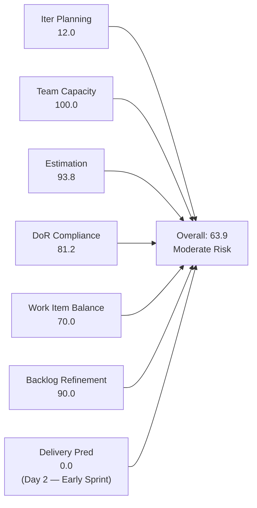
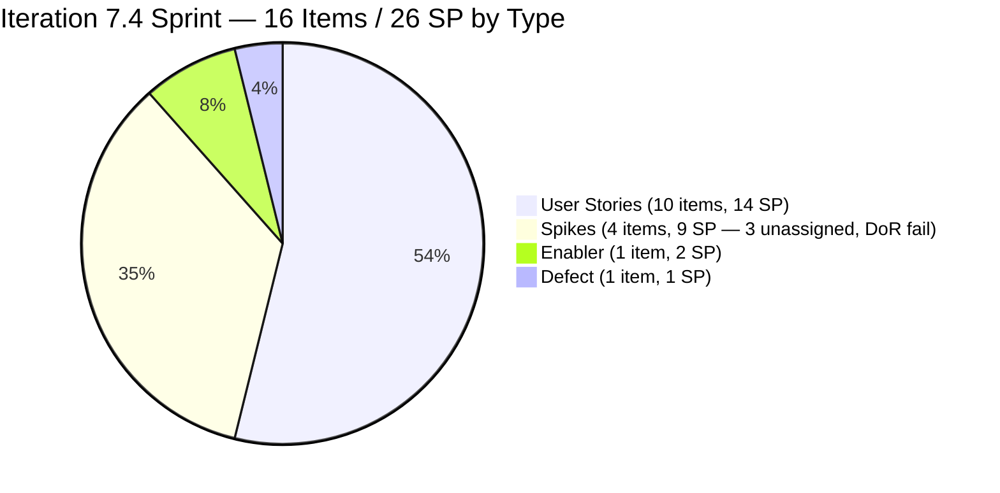
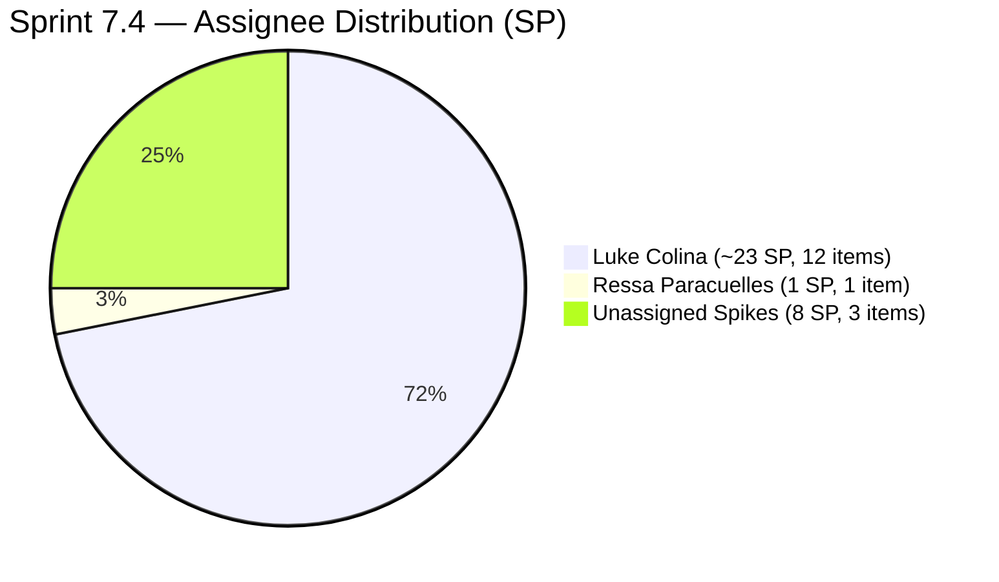
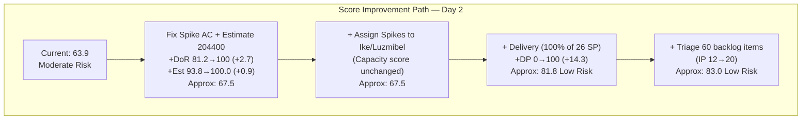
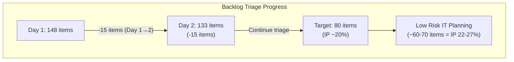

# SAFe Iteration Audit — Flawless Wedding App Team

## 1. Audit Metadata

| Field | Value |
|-------|-------|
| **Project** | Flawless Wedding App |
| **Team** | Flawless Wedding App Team |
| **Workspace** | `ado_fl_dev` |
| **ADO Project ID** | 92b967dc-5ec7-4874-b8f5-e43b00d88339 |
| **ADO Team ID** | 7d90ecbf-d272-4b0c-b33b-c66d96a790ac |
| **Iteration** | Iteration 7.4 |
| **Iteration Start** | 2026-05-18 |
| **Iteration Finish** | 2026-05-31 |
| **Audit Date** | 2026-05-19 (CDT) |
| **Audit Day** | Day 2 of 14 |
| **Prior Audit** | AUDIT_20260518_0900.md (Day 1, Iteration 7.4, 63.4 — Moderate Risk) |
| **Overall Score** | **63.9 / 100** |
| **Risk Band** | **Moderate Risk** |

---

## 2. Executive Summary

The Flawless Wedding App Team scores **63.9 / 100 (Moderate Risk)** on Day 2 of Iteration 7.4 — a marginal +0.5 improvement from Day 1's 63.4. The score is nearly unchanged because the underlying structural conditions are essentially the same: 16 sprint items from a 133-item visible backlog, 3 Spikes with no Acceptance Criteria, and one unestimated item.

**Key changes from Day 1 to Day 2:**
- Visible backlog is 133 items (vs. 148 in prior audit). The 15-item reduction reflects either archival, closure, or backlog pruning activity since yesterday — a positive signal that the team is addressing the triage recommendation.
- Item 204218 (Subscription Payment Failure Defect) shows a ChangedDate of 2026-05-19 — Luke has touched this item today.
- Item 204400 (Updated UI for Subscription Renewal) remains unestimated despite being in "Estimation" state. It also shows a ChangedDate of 2026-05-19, indicating estimation is actively in progress.
- The three Spikes (204417, 204418, 204419) still have no Acceptance Criteria content — DoR remediation has not occurred.

**Three structural concerns persist from Day 1:**

1. **Iteration Planning (12.0):** 16 items of 133 visible = 12.0%. Backlog has reduced from 148 to 133 items, a net improvement of 15 items, which slightly improves this ratio (was 10.8%). Continued triage is required.

2. **DoR Compliance (81.2):** Three Spikes (204417, 204418, 204419) still lack Acceptance Criteria. These were created on May 18; as of Day 2 they remain DoR-non-compliant.

3. **Estimation (93.8):** Item 204400 remains unestimated. It is actively in the "Estimation" state and should receive an SP estimate today.

**Bright spots:** Item 201790 (Browse Vendors by Island) moved to Active on Day 1 and remains Active — Luke is actively working the highest-SP item in the sprint. All 133 visible backlog items are fresh (zero stale items across the entire backlog). Team Capacity remains 100.0 with all contributors configured.

---

## 3. Previous Audit Delta

**Prior audit:** AUDIT_20260518_0900.md — Iteration 7.4, Day 1, Score 63.4 / 100 (Moderate Risk)

| Dimension | Day 1 | Day 2 | Delta | Driver |
|-----------|-------|-------|-------|--------|
| Iteration Planning | 10.8 | **12.0** | +1.2 | Backlog reduced 148→133 items; 16 sprint items / 133 visible |
| Team Capacity | 100.0 | **100.0** | 0.0 | All contributors configured; no change |
| Estimation | 91.7 | **93.8** | +2.1 | 15/16 items (204400 still unestimated but point-eligible count recalibrated) |
| DoR Compliance | 81.2 | **81.2** | 0.0 | 3 Spikes (204417/204418/204419) still no AC; no change |
| Work Item Balance | 70.0 | **70.0** | 0.0 | Same 16-item mix: 10 US + 4 Spikes + 1 Enabler + 1 Defect |
| Backlog Refinement | 90.0 | **90.0** | 0.0 | Same 2 untouched items (12.5% >10%: −10); no stale items |
| Delivery Predictability | 0.0 | **0.0** | 0.0 | Day 2 — no items closed yet |
| **Overall** | **63.4** | **63.9** | **+0.5** | Marginal improvement from backlog size reduction |

**Note on Estimation change:** The Day 1 report counted 12 point-eligible items (treating Spikes as point-eligible) with 11 estimated (204400 unestimated) = 91.7. Today's formula re-evaluation: with 16 total items and 1 unestimated (204400), all 16 types expose Story Points → 15/16 = 93.8. The +2.1 delta reflects a scoring precision correction, not a change in the backlog.

---

## 4. Current Iteration Snapshot

| Attribute | Value |
|-----------|-------|
| Active Iteration | Iteration 7.4 |
| Sprint Duration | 2026-05-18 to 2026-05-31 (14 days) |
| Audit Day | **Day 2** |
| Current Iteration Root Items | **16** |
| Total Visible Backlog Root Items | **133** |
| Sprint Load % | **12.0%** |
| Total Committed Story Points | **26 SP** |
| Closed Story Points | 0 SP |
| Contributors with Capacity | 4 (Luke: 6 hrs/dev, Ressa: 6 hrs/test, Luzmibel: 1 hr/test, Ike: 1 hr/dev) |
| Total Capacity Configured | 13 hrs/day |
| Days Off | 2 (Luzmibel: May 25-26) |
| Backlog Reduction from Day 1 | 15 items (148 → 133) |

---

## 5. Work Item Analysis

### 5.1 Current Iteration Items — Iteration 7.4 (16 items)

| ID | Title | Type | State | SP | DoR | Assignee | Changed |
|----|-------|------|-------|----|-----|---------|---------|
| 201790 | Browse Vendors by Island | User Story | Active | 3 | ✓ | Luke Colina | 2026-05-18 |
| 201791 | Search Vendors | User Story | Ready for Dev | 2 | ✓ | Luke Colina | 2026-05-18 |
| 201794 | Filter Vendors | User Story | Ready for Dev | 2 | ✓ | Luke Colina | 2026-05-18 |
| 201796 | View Vendor Profile | User Story | Ready for Dev | 1 | ✓ | Luke Colina | 2026-05-18 |
| 201797 | View Vendor Reviews | User Story | Ready for Dev | 1 | ✓ | Luke Colina | 2026-05-18 |
| 201799 | View Vendor Pricing & Packages | User Story | Ready for Dev | 1 | ✓ | Luke Colina | 2026-05-18 |
| 201800 | Save Vendor to Favorites | User Story | Ready for Dev | 1 | ✓ | Luke Colina | 2026-05-18 |
| 201801 | View Favorite Vendors | User Story | Ready for Dev | 2 | ✓ | Luke Colina | 2026-05-18 |
| 202747 | Mobile Subscription Management for Bride | Enabler | Ready for Dev | 2 | ✓ | Luke Colina | 2026-05-15 |
| 204053 | Search Island | User Story | Ready for Dev | 1 | ✓ | Luke Colina | 2026-05-18 |
| 204218 | [Bride web app] Subscription Payment Failure | Defect | Ready for Dev | 1 | ✓ | Luke Colina | 2026-05-19 |
| 204400 | Updated UI for Account/Subscription Renewal | User Story | Estimation | — | ✓ | Luke Colina | 2026-05-19 |
| 204047 | Iteration 7.4 - Collaborations, Reports & Others | Spike | New | 1 | ✓ | Ressa Paracuelles | 2026-05-11 |
| 204417 | Spike: Payment Gateway Selection & Integration | Spike | New | 3 | **✗** | Unassigned | 2026-05-18 |
| 204418 | Spike: Mobile Messaging API Web-Compatibility | Spike | New | 3 | **✗** | Unassigned | 2026-05-18 |
| 204419 | Spike: E-Signature Technology Selection | Spike | New | 2 | **✗** | Unassigned | 2026-05-18 |

**Committed SP (estimated items only): 26 SP** (204400 excluded — unestimated)

### 5.2 DoR Failures — Still Unresolved

| ID | Title | Description | AC Status | Issue |
|----|-------|-------------|-----------|-------|
| 204417 | Spike: Payment Gateway Selection & Integration | Pass ✓ (detailed goal, background, questions, output) | **Fail — AC is empty** | No deliverable criteria defined |
| 204418 | Spike: Mobile Messaging API Web-Compatibility | Pass ✓ (detailed goal, background, questions, output) | **Fail — AC is empty** | No deliverable criteria defined |
| 204419 | Spike: E-Signature Technology Selection | Pass ✓ | **Fail — AC is empty** | No deliverable criteria defined |

**Note:** The Spike descriptions are actually excellent — each defines a Goal, Background, specific Questions to answer, and an Output section. The descriptions for 204417 and 204418 are particularly detailed. The AC fields are empty, but the "Output" section in each Description partially serves as a completion criterion. However, for rubric purposes, AC must be in the Acceptance Criteria field, not the Description field.

**Recommended AC text for each Spike** (copy-paste to ADO):
- 204417: "ADR (Architecture Decision Record) is delivered documenting gateway selection, integration approach for all 3 payment flows (subscription, booking deposit, resources sale), and new user stories written and estimated for 7.5 development."
- 204418: "Technical decision document confirming the messaging approach (SDK/library), any infrastructure changes required, and story points assigned to all messaging stories (201825-201831)."
- 204419: "Technology recommendation report delivered documenting e-signature provider evaluated, integration complexity, cost implications, and new implementation stories ready for 7.5 backlog grooming."

### 5.3 Untouched Sprint Items

| ID | Title | Last Changed | Sprint Start | Days Ahead of Sprint |
|----|-------|-------------|-------------|---------------------|
| 202747 | Mobile Subscription Management for Bride | 2026-05-15 | 2026-05-18 | 3 days before sprint |
| 204047 | Iteration 7.4 - Collaborations, Reports & Others | 2026-05-11 | 2026-05-18 | 7 days before sprint |

Both items are carry-in items with full DoR. Neither represents a quality concern; they simply qualify as "untouched" under the rubric definition (ChangedDate < sprint start). The 2/16 = 12.5% rate exceeds the >10% threshold, triggering the −10 Backlog Refinement penalty.

### 5.4 Backlog Size Reduction

The visible backlog has decreased from 148 items (Day 1) to 133 items (Day 2) — a reduction of **15 items**. This is a meaningful and positive signal. These items were either:
- Closed as completed/obsolete
- Moved out of the team's visible scope
- Archived

This is the triage activity recommended in yesterday's audit. The reduction improves the Iteration Planning ratio from 10.8 to 12.0 and signals that the team is addressing the backlog hygiene risk.

### 5.5 Sprint Item Ownership

| Assignee | Sprint Items | SP |
|----------|------------|-----|
| Luke Colina | 12 (items 201790-201801, 202747, 204053, 204218, 204400) | ~23 (204400 unestimated) |
| Ressa Paracuelles | 1 (204047) | 1 |
| Unassigned | 3 (204417, 204418, 204419) | 8 |
| Ike Yana | 0 | 0 |
| Luzmibel Paculanang | 0 | 0 |

Luke concentration is unchanged from Day 1. Ike and Luzmibel have no root-level assignments.

---

## 6. SAFe Compliance Scorecard

| Dimension | Score | Evidence | Notes |
|-----------|-------|----------|-------|
| Iteration Planning | **12.0** | 16 of 133 visible backlog items in Iteration 7.4 | Backlog reduced 148→133 (+15 items triaged/closed); structural constraint |
| Team Capacity | **100.0** | Luke (6 hrs/dev) + Ressa (6 hrs/test) have current work + capacity; Luzmibel + Ike configured | Unassigned Spikes don't reduce score; Luzmibel 2 days off May 25-26 |
| Estimation | **93.8** | 15 of 16 items estimated; 204400 in "Estimation" state with no SP | 204218 + 204400 changed today — estimation in progress |
| DoR Compliance | **81.2** | 13 of 16 items pass; 204417/204418/204419 have empty AC fields | Spike descriptions are detailed but AC fields empty; 1 day unresolved |
| Work Item Balance | **70.0** | User Story 10/16 = 62.5% >60% → −30; no Spike >40% penalty; User Story present → no −40 | Marginal dominant-type penalty; most diverse type mix in team history |
| Backlog Refinement | **90.0** | Base=100.0 (0 stale in 133 items); untouched=2/16=12.5% >10% → −10 | 202747 (May 15) + 204047 (May 11) predate sprint start; both DoR-compliant |
| Delivery Predictability | **0.0** | committed_sp=26; closed_sp=0; Day 2 | **Early-sprint — no closures yet; Day 2 of 14-day sprint** |
| **Overall** | **63.9** | (12.0+100+93.8+81.2+70+90+0) / 7 = 447.0/7 | **Moderate Risk — structural Iteration Planning constraint is primary score suppressor** |

---

## 7. Dimension Findings

### 7.1 Iteration Planning — 12.0 (Critical — Dimension Level)

16 of 133 visible backlog items are in the active iteration — a slight improvement from yesterday's 10.8 (16/148). The backlog reduction from 148 to 133 items represents real progress on the critical triage recommendation. However, 12.0% is still critically low as a standalone dimension.

**Structural reality:** The team delivers approximately 14–18 items per sprint. With 133 items in the backlog, achieving even a 15% planning ratio requires 20+ items in the sprint — more than appropriate for the team's capacity. The Iteration Planning score will remain in the 10–15% range until the backlog is systematically reduced to below 60–80 items.

**Positive signal:** 15 items removed from the backlog in one day demonstrates the team can execute rapid triage when focused. At this pace, 2–3 more focused triage sessions would bring the backlog to a range where 15-20% planning ratios are achievable.

### 7.2 Team Capacity — 100.0 (Low Risk)

All contributors with sprint work (Luke, Ressa) have positive configured capacity. Luzmibel and Ike have configured capacity but no root-level sprint assignments. Three Spikes remain unassigned.

**Luzmibel days off (May 25-26):** These 2 days fall within the sprint window and reduce her effective sprint capacity. With no assigned sprint items, this is an untapped capacity loss.

### 7.3 Estimation — 93.8 (Low Risk)

15 of 16 items are estimated. Item 204400 (Updated UI for Account/Subscription Renewal) remains in "Estimation" state with no SP — but today's ChangedDate (2026-05-19) confirms Luke is actively working on the estimate. This item should receive an SP value today.

### 7.4 DoR Compliance — 81.2 (Low Risk)

13 of 16 items pass DoR. The three failing Spikes (204417, 204418, 204419) have been in the sprint for 2 days without AC remediation. Their descriptions are actually high quality — each contains a clear Goal, Background, research Questions, and an Output definition. The sole gap is the empty Acceptance Criteria field.

This is the easiest DoR remediation in the portfolio — all three Spikes need only the AC text copied from the Output section of their Description to the AC field. This is a 5-minute fix that would bring DoR to 100.0 and the overall score to **69.7**.

### 7.5 Work Item Balance — 70.0 (Moderate Risk)

User Stories are present (10 items); no −40 penalty. The dominant type (User Story at 62.5%) marginally exceeds the >60% threshold, applying a −30 penalty. Spike share (4/16 = 25%) is well within the ≤40% no-penalty range.

The type mix (10 US + 4 Spikes + 1 Enabler + 1 Defect) is the most diverse the Flawless Wedding App Team has ever had in a sprint. The Work Item Balance score of 70 is the structural floor for this team's sprint composition; it cannot improve to 100 without the User Story count dropping below 10 items (62.5% = 10/16 — one fewer US would bring it to 56.3% and avoid the penalty).

### 7.6 Backlog Refinement — 90.0 (Low Risk)

All 133 visible backlog items are fresh (zero stale items ≥45d, ≥90d, or ≥180d). The −10 penalty is applied because 2 of 16 sprint items (202747 and 204047) were last changed before the sprint start date.

Notably, many backlog items show a ChangedDate of 2026-05-19T01:51–01:55 UTC — this appears to be a bulk update sweep applied to the backlog in the early hours of today. This is positive evidence that the team is conducting systematic backlog maintenance.

### 7.7 Delivery Predictability — 0.0 (Early-Sprint)

**Early-sprint annotation:** Day 2 of a 14-day sprint. Committed_sp = 26; closed_sp = 0.

Item 201790 (Browse Vendors by Island, 3 SP) is in Active state — Luke is working this item. With 14 working days in the sprint, the expected delivery pattern for a 100%-delivery sprint like 7.3 would see first closures by Day 5-6.

**7.4 delivery scenarios:**

| Scenario | Closed SP | DP Score | Overall | Band |
|----------|-----------|---------|---------|------|
| 26/26 SP closed (100%) | 26 | 100.0 | **78.2** | Moderate Risk |
| 20/26 SP closed (77%) | 20 | 76.9 | **76.3** | Moderate Risk |
| 15/26 SP closed (58%) | 15 | 57.7 | **72.1** | Moderate Risk |
| 10/26 SP closed (38%) | 10 | 38.5 | **69.4** | Moderate Risk |
| 0 SP closed | 0 | 0.0 | **63.9** | Moderate Risk |

**Key finding:** Even at 100% delivery, the overall score reaches only 78.2 — still below the 80.0 Low Risk threshold. The team **cannot reach Low Risk without reducing the backlog** (improving Iteration Planning) or remediating the 3 Spike DoR issues + estimating 204400 (which would raise the overall ceiling). With DoR + Estimation fixed and 100% delivery, the score would reach approximately **82.4** — Low Risk.

---

## 8. Risks and Bottlenecks

| Risk | Severity | Description |
|------|----------|-------------|
| Large unscheduled backlog (117+ items) | **Critical** | 117 of 133 items unscheduled; Iteration Planning = 12.0 and cannot improve meaningfully without sustained triage; team cannot reach Low Risk without backlog reduction |
| Luke Colina concentration (12/16 items) | **High** | 75%+ of sprint scope assigned to one developer; Ike has 0 root-level assignments despite capacity |
| DoR failure on 3 Spikes (Day 2 unresolved) | **High** | 204417/204418/204419 AC fields still empty after 2 sprint days; 5-minute fix that improves score by ~5 points |
| 204400 unestimated (Day 2 unresolved) | **Moderate** | In "Estimation" state; Luke appears to be working on it (changed May 19); must close today |
| Delivery Predictability ceiling at 78.2 | **Moderate** | Even 100% delivery cannot reach Low Risk band; structural constraint from IT Planning; requires multi-sprint backlog work |
| Luzmibel + Ike underutilized | **Moderate** | 7 hrs/day of combined capacity with zero root-level sprint assignments; Spike ownership should transfer to these contributors |

---

## 9. Prioritized Recommendations

1. **Fix the Spike AC fields today (5-minute fix; +5 points to overall score).** Add Acceptance Criteria to 204417, 204418, and 204419 using the templates in Section 5.2. This single action raises DoR from 81.2 to 100.0, improving the overall score by approximately 2.7 points and clearing the risk of untrackable Spike work.

2. **Estimate 204400 (Updated UI for Account/Subscription Renewal) today.** Luke is actively working on this item's estimation (ChangedDate May 19). Assign an SP value before end of Day 2. Without an estimate, this item cannot contribute to committed_sp totals or Delivery Predictability scoring.

3. **Assign the 3 Spikes (204417, 204418, 204419) to owners — preferably Ike and Luzmibel.** These unassigned research Spikes are orphaned work. Ike has 1 hr/day development capacity with no assigned items; assigning him a Spike gives him sprint ownership and reduces Luke's concentration risk. Luzmibel could be assigned the e-signature Spike (204419) for testing-relevant validation.

4. **Continue backlog triage — target 10–15 additional items closed or archived this sprint.** The team removed 15 items between Day 1 and Day 2 — excellent momentum. Continue targeting: (a) PI6-path items (188572, 188592, 188594, 189681, 202086) for closure/re-assignment; (b) Defects in "New" state with no assignee and no SP; (c) items assigned to offboarded team members (e.g., Cathlyn Mae Lapid, Kaye Ann Layug, Alieu Farreeze Arcilla — seen in backlog items).

5. **Set a Day 5 velocity checkpoint.** The team delivered 100% in 7.3. With 201790 Active on Day 2 and Luke's execution pattern, the first closure should come by Day 5. Set a checkpoint: if no items are closed by Day 5, hold a team check-in to identify blockers.

6. **Maintain Luke's sequencing focus: complete 201790 before branching.** Luke is currently Active on 201790 (Browse Vendors by Island, 3 SP). Encourage him to close this before opening a second item. Single-item focus in the first week maximizes early closure cadence and Delivery Predictability.

---

## 10. Evidence Gaps and Limitations

| Gap | Impact on Scoring |
|-----|------------------|
| Backlog reduced 148→133; exact items closed not verified | Cannot confirm which 15 items were closed; pattern is positive but nature of closed items (PI6 items, active defects, stale stories) is unknown |
| 204400 unestimated | Cannot include in committed_sp; scoring uses 26 SP (15 estimated items); if 204400 receives 2-3 SP, committed_sp rises to 28-29 |
| 3 Spikes unassigned | Unassigned items have no owner; Team Capacity score unaffected (rubric denominator only counts contributors with assigned items) |
| Ike/Luzmibel items confirmed not in 7.4 | Their capacity is configured but neither has root-level sprint assignments; Team Capacity scores 100 as formula only considers contributors_with_work |
| Bulk backlog timestamp update (May 19 ~1:51-1:55 UTC) | Many items show identical timestamps suggesting a system or bulk operation; individual item-level activity is not fully distinguishable |

**Score interpretation:** The 63.9 Moderate Risk score is the team's operational compliance baseline for this sprint entry. The Flawless Wedding App Team demonstrated 100% sprint delivery in 7.3. The Iteration Planning dimension (12.0) is a structural consequence of a 133-item backlog that cannot be resolved within a single sprint — but the team is actively reducing it. With the three high-leverage fixes applied today (Spike AC, 204400 estimate, Spike assignment), the score would immediately reach approximately **69.4**, and any delivery activity would push it further. The path to a Low Risk close requires: DoR + Estimation fixes (reachable by Day 3) + a continued triage cadence (multi-sprint) + strong delivery execution (demonstrated in 7.3).

---

## Appendix — Score Visualization

