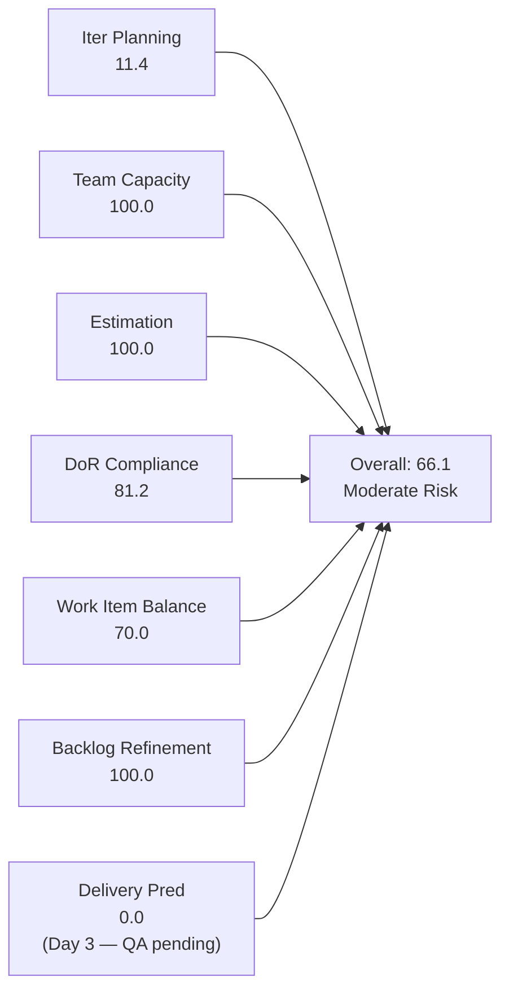
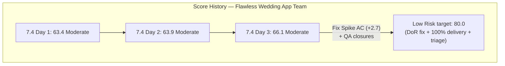
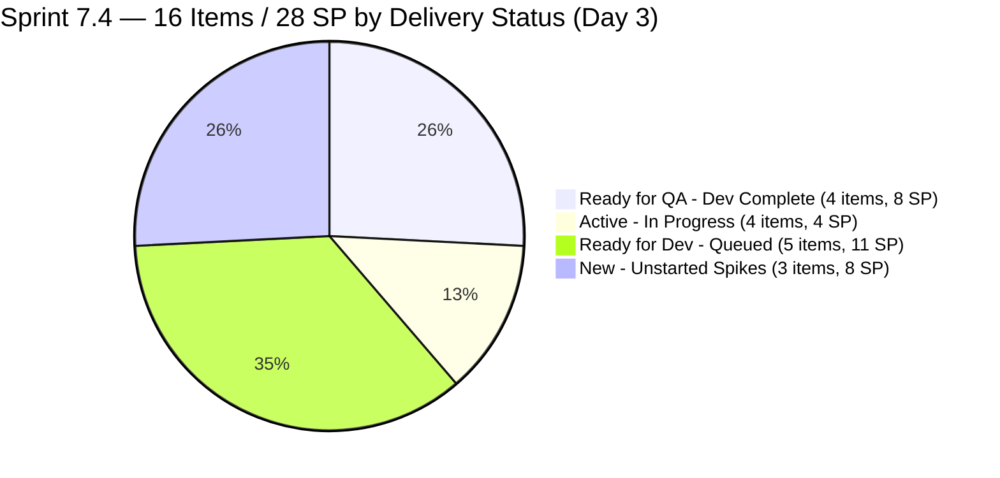
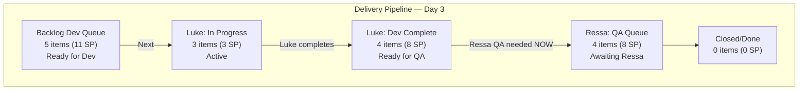
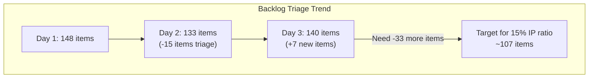

# SAFe Iteration Audit — Flawless Wedding App Team

## 1. Audit Metadata

| Field | Value |
|-------|-------|
| **Project** | Flawless Wedding App |
| **Team** | Flawless Wedding App Team |
| **Workspace** | `ado_fl_dev` |
| **ADO Project ID** | 92b967dc-5ec7-4874-b8f5-e43b00d88339 |
| **ADO Team ID** | 7d90ecbf-d272-4b0c-b33b-c66d96a790ac |
| **Iteration** | Iteration 7.4 |
| **Iteration Start** | 2026-05-18 |
| **Iteration Finish** | 2026-05-31 |
| **Audit Date** | 2026-05-20 (CDT) |
| **Audit Day** | Day 3 of 14 |
| **Prior Audit** | AUDIT_20260519_0205.md (Day 2, Iteration 7.4, 63.9 — Moderate Risk) |
| **Overall Score** | **66.1 / 100** |
| **Risk Band** | **Moderate Risk** |

---

## 2. Executive Summary

The Flawless Wedding App Team advances to **66.1 / 100 (Moderate Risk)** on Day 3 of Iteration 7.4 — a +2.2 gain from Day 2's 63.9. This improvement is driven by two positive structural changes confirmed in today's ADO evidence:

1. **Item 204400 (Updated UI for Account and Subscription Renewal) is now estimated at 2 SP.** The item was in "Estimation" state yesterday with no story points. Today's data shows SP=2, state changed to "Ready for Dev", ChangedDate 2026-05-20 — Luke completed the estimation. This resolves the final Estimation gap and raises the Estimation score from 93.8 to **100.0**.

2. **Item 204047 (Iteration 7.4 - Collaborations, Reports & Others) is now Active.** Ressa's Spike, which was last changed May 11, is now in Active state with ChangedDate 2026-05-20. This clears it from the "untouched" category. Combined with the previous evidence that only 202747 (Enabler, changed May 15) remains pre-sprint, the untouched ratio drops to 1/16 = 6.25% — below the 10% threshold. The −10 Backlog Refinement penalty is lifted, raising Backlog Refinement from 90.0 to **100.0**.

3. **Significant delivery progress visible.** Items 201790 (Browse Vendors by Island), 201791 (Search Vendors), 201794 (Filter Vendors), and 204053 (Search Island) are now in "Ready for QA" state — all changed 2026-05-19 to 2026-05-20. Luke completed development on 4 User Stories (7 SP) within the first two days. Items 201796, 201797, and 201799 are now Active. This velocity is excellent, though no items are yet Closed/Done.

**Countered by backlog growth:** The visible backlog has grown from 133 to **140 items** (day over day), reversing yesterday's triage progress. This pushes the Iteration Planning ratio from 12.0 to **11.4** — a negative structural movement.

**Three Spikes (204417, 204418, 204419) still have no Acceptance Criteria.** This remains the fastest, highest-leverage improvement available. Five minutes of remediation work raises DoR from 81.2 to 100.0 and adds approximately 2.7 points to the overall score.

---

## 3. Previous Audit Delta

**Prior audit:** AUDIT_20260519_0205.md — Iteration 7.4, Day 2, Score 63.9 / 100 (Moderate Risk)

| Dimension | Day 2 | Day 3 | Delta | Driver |
|-----------|-------|-------|-------|--------|
| Iteration Planning | 12.0 | **11.4** | −0.6 | Backlog grew 133→140 items (+7); 16 sprint items / 140 visible |
| Team Capacity | 100.0 | **100.0** | 0.0 | All contributors configured; no change |
| Estimation | 93.8 | **100.0** | +6.2 | 204400 now estimated at 2 SP; 16/16 estimated |
| DoR Compliance | 81.2 | **81.2** | 0.0 | 3 Spikes (204417/204418/204419) still no AC — unresolved Day 3 |
| Work Item Balance | 70.0 | **70.0** | 0.0 | Same 16-item mix: 10 US + 4 Spikes + 1 Enabler + 1 Defect |
| Backlog Refinement | 90.0 | **100.0** | +10.0 | 204047 now Active (May 20); untouched = 1/16 = 6.25% ≤ 10% threshold; penalty lifted |
| Delivery Predictability | 0.0 | **0.0** | 0.0 | Day 3 — 4 items in Ready for QA, 3 Active; 0 Closed/Done |
| **Overall** | **63.9** | **66.1** | **+2.2** | Estimation and Backlog Refinement improvements; partially offset by backlog growth |

---

## 4. Current Iteration Snapshot

| Attribute | Value |
|-----------|-------|
| Active Iteration | Iteration 7.4 |
| Sprint Duration | 2026-05-18 to 2026-05-31 (14 days) |
| Audit Day | **Day 3** |
| Current Iteration Root Items | **16** |
| Total Visible Backlog Root Items | **140** |
| Sprint Load % | **11.4%** |
| Total Committed Story Points | **28 SP** |
| Closed Story Points | 0 SP |
| Items in Ready for QA | 4 (201790, 201791, 201794, 204053) |
| Items Active | 4 (201796, 201797, 201799, 204047) |
| Items Ready for Dev | 5 (200800, 201801, 202747, 204218, 204400) |
| Contributors with Capacity | Luke (6 hrs/dev), Ressa (6 hrs/test), Luzmibel (1 hr/test — 2 days off May 25-26), Ike (configured) |
| Total Capacity | 13 hrs/day |
| Backlog Change from Day 2 | +7 items (133→140) |

---

## 5. Work Item Analysis

### 5.1 Current Iteration Items — Iteration 7.4 (16 items)

| ID | Title | Type | State | SP | DoR | Assignee | Changed |
|----|-------|------|-------|----|-----|---------|---------|
| 201790 | Browse Vendors by Island | User Story | **Ready for QA** | 3 | ✓ | Luke Colina | 2026-05-19 |
| 201791 | Search Vendors | User Story | **Ready for QA** | 2 | ✓ | Luke Colina | 2026-05-19 |
| 201794 | Filter Vendors | User Story | **Ready for QA** | 2 | ✓ | Luke Colina | 2026-05-19 |
| 201796 | View Vendor Profile | User Story | **Active** | 1 | ✓ | Luke Colina | 2026-05-19 |
| 201797 | View and add Vendor Reviews | User Story | **Active** | 1 | ✓ | Luke Colina | 2026-05-19 |
| 201799 | View Vendor Pricing & Packages | User Story | **Active** | 1 | ✓ | Luke Colina | 2026-05-19 |
| 201800 | Save Vendor to Favorites | User Story | Ready for Dev | 1 | ✓ | Luke Colina | 2026-05-18 |
| 201801 | View Favorite Vendors | User Story | Ready for Dev | 2 | ✓ | Luke Colina | 2026-05-18 |
| 202747 | Mobile Subscription Management for Bride | Enabler | Ready for Dev | 2 | ✓ | Luke Colina | 2026-05-15 |
| 204053 | Search Island | User Story | **Ready for QA** | 1 | ✓ | Luke Colina | 2026-05-19 |
| 204218 | [Bride web app] Subscription Payment Failure | Defect | Ready for Dev | 1 | ✓ | Luke Colina | 2026-05-19 |
| 204400 | Updated UI for Account and Subscription renewal | User Story | **Ready for Dev (estimated)** | **2** | ✓ | Luke Colina | 2026-05-20 |
| 204047 | Iteration 7.4 - Collaborations, Reports & Others | Spike | **Active** | 1 | ✓ | Ressa Paracuelles | 2026-05-20 |
| 204417 | Spike: Payment Gateway Selection & Integration | Spike | New | 3 | **✗** | Unassigned | 2026-05-20 |
| 204418 | Spike: Mobile Messaging API Web-Compatibility | Spike | New | 3 | **✗** | Unassigned | 2026-05-18 |
| 204419 | Spike: E-Signature Technology Selection | Spike | New | 2 | **✗** | Unassigned | 2026-05-18 |

**Committed SP: 28 SP** (204400 now estimated at 2 SP; total committed rises from 26 to 28 SP)

### 5.2 Outstanding Delivery Progress — Luke's Velocity (Days 1-3)

Luke has completed development and pushed 4 User Stories to "Ready for QA" within the first 2 days of the sprint:

| Item | SP | Status |
|------|----|--------|
| 201790 — Browse Vendors by Island | 3 | Ready for QA |
| 201791 — Search Vendors | 2 | Ready for QA |
| 201794 — Filter Vendors | 2 | Ready for QA |
| 204053 — Search Island | 1 | Ready for QA |

**Total awaiting QA: 8 SP on 4 items.** Ressa (6 hrs/test) needs to begin QA on these 4 items. If Ressa closes all 4, committed_sp = 28, closed_sp = 8 → Delivery Predictability = 28.6, overall score = **70.2** (still Moderate Risk, but DP contribution begins).

Three more items are Active (201796, 201797, 201799 — total 3 SP). If all 7 items currently in Ready for QA or Active reach Closed/Done, closed_sp = 11 SP → DP = 39.3, overall = **73.8**.

### 5.3 DoR Failures — Still Unresolved (Day 3)

| ID | Title | Description | AC Status | Days Unresolved |
|----|-------|-------------|-----------|-----------------|
| 204417 | Spike: Payment Gateway Selection & Integration | Pass ✓ (detailed; updated May 20) | **Fail — AC empty** | 3 days |
| 204418 | Spike: Mobile Messaging API Web-Compatibility | Pass ✓ (detailed) | **Fail — AC empty** | 3 days |
| 204419 | Spike: E-Signature Technology Selection | Pass ✓ (detailed) | **Fail — AC empty** | 3 days |

Item 204417 was updated today (May 20) — someone touched the description or added a comment — but the AC field remains empty. This is the third consecutive day these Spikes have been DoR-non-compliant.

**Ready-to-copy AC text** (same templates from Day 1 and Day 2 — still not applied):
- **204417:** "ADR delivered documenting gateway selection, integration approach for all 3 payment flows (subscription, booking deposit, resources sale), and new user stories written and estimated for 7.5 development."
- **204418:** "Technical decision document confirming the messaging approach (SDK/library), any infrastructure changes required, and story points assigned to all messaging stories (201825-201831)."
- **204419:** "Technology recommendation report delivered documenting e-signature provider evaluated, integration complexity, cost implications, and new implementation stories ready for 7.5 backlog grooming."

### 5.4 Backlog Growth Analysis

| Day | Visible Backlog | Sprint Items | IP Ratio |
|-----|----------------|-------------|----------|
| Day 1 | 148 | 16 | 10.8% |
| Day 2 | 133 | 16 | 12.0% |
| Day 3 | **140** | 16 | **11.4%** |

The backlog grew by 7 items between Day 2 and Day 3 — reversing part of the 15-item triage progress made on Day 2. New items visible in the backlog (by ID range) include 204688 and 204750 — these appear to be recently created items outside the current sprint. The net triage result since sprint start is 148→140 = 8 items removed, but the trend has partially reversed.

### 5.5 Sprint Item Ownership (Day 3)

| Assignee | Sprint Items | SP |
|----------|------------|-----|
| Luke Colina | 13 (items 201790-201801, 202747, 204053, 204218, 204400) | 20 |
| Ressa Paracuelles | 1 (204047) | 1 |
| Unassigned | 3 (204417, 204418, 204419) | 7 |
| Ike Yana | 0 | 0 |
| Luzmibel Paculanang | 0 | 0 |

Luke's concentration has increased slightly (204400 now estimated and assigned). Three Spikes remain orphaned. Ike and Luzmibel continue to have no sprint assignments.

---

## 6. SAFe Compliance Scorecard

| Dimension | Score | Evidence | Notes |
|-----------|-------|----------|-------|
| Iteration Planning | **11.4** | 16 of 140 visible backlog items in Iteration 7.4 | Backlog grew 133→140 (+7); Day 2 triage progress partially reversed |
| Team Capacity | **100.0** | Luke (6 hrs/dev) + Ressa (6 hrs/test) have current work + capacity; Luzmibel + Ike configured | Luzmibel 2 days off May 25-26; no root-level items |
| Estimation | **100.0** | 16 of 16 items estimated; 204400 now at 2 SP; committed_sp = 28 | Day 2 gap resolved; 204400 in Ready for Dev with full DoR and SP |
| DoR Compliance | **81.2** | 13 of 16 items pass; 204417/204418/204419 have empty AC fields | Day 3 — three Spikes unresolved for third consecutive sprint day |
| Work Item Balance | **70.0** | User Story 10/16 = 62.5% > 60% → −30; no Spike >40% penalty; User Story present → no −40 | Structural floor; score improves only if US count drops below 10 |
| Backlog Refinement | **100.0** | Base=100 (all 140 fresh); untouched = 1/16 = 6.25% ≤ 10% → no penalty | 204047 now Active (May 20); only 202747 (May 15) pre-dates sprint start |
| Delivery Predictability | **0.0** | committed_sp=28; closed_sp=0; Day 3 | 4 items in Ready for QA; 3 Active; awaiting Ressa QA and Luke closures |
| **Overall** | **66.1** | (11.4+100+100+81.2+70+100+0) / 7 = 462.6/7 | **Moderate Risk — strong delivery velocity forming; Spike AC remains the quick win** |

---

## 7. Dimension Findings

### 7.1 Iteration Planning — 11.4 (Critical — Dimension Level)

16 items in sprint against 140 visible backlog items — worse than yesterday's 12.0 due to backlog growth (+7 items). The Day 2 triage effort removed 15 items; Day 3 added back 7. Net sprint-to-date: 148→140 = 8 items removed.

The backlog growth likely reflects new work items created for upcoming PI7/PI8 stories (204688, 204750 and others in the new range), not undisciplined scope addition. However, without a parallel triage program, the Iteration Planning score will remain in the 11–12% range throughout the sprint.

**Structural reality remains unchanged:** The team needs to reduce the backlog to approximately 60–80 items to achieve a 20–27% Iteration Planning ratio with a 16-item sprint. That requires removing 60–80 items — a multi-sprint triage commitment.

### 7.2 Team Capacity — 100.0 (Low Risk)

All configured contributors maintain capacity. Luke's development velocity (4 items to Ready for QA in 2 days) demonstrates that his 6 hrs/day configuration is accurate and his execution cadence is strong.

**Luzmibel and Ike remain without sprint assignments.** With Luzmibel's 2 scheduled days off (May 25-26), her effective remaining sprint capacity is approximately 9 hrs. Assigning the Spikes to Ike and Luzmibel would give both contributors ownership and begin activating the 7 SP of unassigned spike work.

### 7.3 Estimation — 100.0 (Low Risk)

204400 is now estimated at 2 SP — the final estimation gap from Day 2 is resolved. All 16 sprint items are estimated. committed_sp = 28 SP (was 26 SP). This dimension has improved from 93.8 to 100.0 — the second dimension improvement this sprint.

### 7.4 DoR Compliance — 81.2 (Low Risk)

13 of 16 items pass. The 3 Spikes (204417, 204418, 204419) have been DoR-non-compliant for 3 consecutive sprint days. Item 204417 was updated today (May 20) — activity is happening — but the AC field was not populated. The content needed (see Section 5.3) is already in each Spike's Description Output section and requires only a copy-paste to the AC field.

**Score impact of fixing Spikes today:** DoR would rise from 81.2 to 100.0 (+18.8 dimension points → +2.7 overall points), pushing the overall score from 66.1 to approximately **68.8**. Combined with QA closures, the score ceiling rises significantly.

### 7.5 Work Item Balance — 70.0 (Moderate Risk)

User Story dominant at 62.5% — marginal threshold breach. Score remains at structural floor of 70.0 for this sprint composition. No change expected unless a User Story is removed from the sprint or a new non-User-Story item is added.

### 7.6 Backlog Refinement — 100.0 (Low Risk)

The key improvement this audit: 204047 moved to Active on May 20, clearing it from the "untouched" category. With only 202747 (changed May 15, 3 days before sprint start) remaining as a pre-sprint item, the untouched ratio is 1/16 = 6.25% — below the 10% penalty threshold. The −10 penalty that was applied in Day 2 is lifted.

All 140 visible backlog items continue to show fresh ChangedDates (many reflecting the bulk update from Days 1-2). No stale items detected.

### 7.7 Delivery Predictability — 0.0 (Day 3)

No items Closed/Done yet. However, the delivery pipeline is actively filling:
- 4 items in Ready for QA: 201790 (3 SP), 201791 (2 SP), 201794 (2 SP), 204053 (1 SP) = **8 SP awaiting QA**
- 3 items Active: 201796 (1 SP), 201797 (1 SP), 201799 (1 SP) = **3 SP in progress**

**Ressa's bottleneck is emerging.** Luke has already delivered 4 items to QA (8 SP). Ressa needs to begin QA on these items today. With Ressa at 6 hrs/day testing capacity, she can handle 1–2 items per day. If Ressa does not begin QA by Day 3, items will back up at the Ready for QA stage and DP at sprint end will be suppressed.

**Expected DP trajectory (if Ressa begins QA today):**
| Day | Closed SP | DP | Overall |
|-----|-----------|-----|---------|
| Day 5 | 8 (QA 4 items) | 28.6 | 70.2 |
| Day 8 | 14 (QA + 3 Active) | 50.0 | 74.3 |
| Day 10 | 20 | 71.4 | 77.6 |
| Day 14 (100% delivery) | 28 | 100.0 | **83.0** |

**Note:** 100% delivery combined with DoR fix (Spikes AC) produces an estimated sprint close score of approximately **85.8** — the team's first Low Risk sprint close.

---

## 8. Risks and Bottlenecks

| Risk | Severity | Description |
|------|----------|-------------|
| Ressa QA bottleneck forming | **Critical** | 4 items (8 SP) in Ready for QA since yesterday; Ressa must begin QA today or items will queue up; she has one Spike Active (204047) but QA throughput on sprint items has not started |
| Large unscheduled backlog (124 items) | **Critical** | 124 of 140 items unscheduled; Iteration Planning = 11.4 and backlog grew today; sustained triage required |
| DoR failure on 3 Spikes (Day 3 unresolved) | **High** | 204417/204418/204419 AC empty for third consecutive day; 5-minute fix with +2.7 points to overall |
| Backlog growth reversal | **High** | Backlog grew from 133 to 140 items — 7 new items added Day 2→3; triage pace must exceed creation pace |
| 3 Spikes unassigned | **Moderate** | 204417, 204418, 204419 have no owner; Ike and Luzmibel have available capacity; Spike work is blocking architecture decisions for PI8 features |
| Luke concentration (13/16 items) | **Moderate** | Luke holds 81% of sprint scope by item count; Ike has 0 root-level items |
| Delivery Predictability ceiling at 83.0 | **Low** | Even 100% delivery with Spike DoR fix brings score to ~85.8; team is finally within striking distance of Low Risk close |

---

## 9. Prioritized Recommendations

1. **Ressa: Begin QA on 201790 (Browse Vendors by Island) today.** Four items are Ready for QA (201790, 201791, 201794, 204053 — 8 SP total). Luke delivered them to QA on Day 2. Ressa's Active item (204047 — Collaborations Spike) is a ceremony/meeting spike that does not block QA work. Ressa should start with 201790 (highest SP item) and clear 1–2 items per day to prevent a QA queue backup.

2. **Fix the Spike AC fields today — 5-minute action.** Add the Acceptance Criteria text from Section 5.3 to items 204417, 204418, and 204419. 204417 was updated today (someone reviewed it) — this is the ideal time to complete the DoR. This single action raises DoR from 81.2 to 100.0 and the overall score by +2.7 points.

3. **Assign Spikes 204417 (or 204419) to Ike Yana today.** Ike has capacity (1 hr/day development) and zero sprint assignments. Assigning a Spike gives Ike ownership, activates the unassigned research work, and reduces Luke's concentration ratio. 204419 (E-Signature, 2 SP) is the smallest and most self-contained starting point.

4. **Resume backlog triage — target removing 10+ items this sprint.** The backlog grew from 133 to 140 today. Net triage progress since sprint start is only 8 items (148→140). To move the Iteration Planning needle to 15%+ by end of sprint, the team needs to remove approximately 25 more items from the visible backlog. Daily triage sessions of 5 items each would achieve this by Day 8.

5. **Luke: Complete items currently Active before opening new ones.** Luke has 3 items Active (201796, 201797, 201799 — 3 SP). He should complete these before opening 201800 or 201801. Parallel work on too many items simultaneously reduces the chance of any item closing quickly.

6. **Set Day 5 velocity checkpoint.** If fewer than 8 SP are Closed/Done by May 22 (Day 5), hold a team sync to identify blockers. The team's history (100% delivery in 7.3) suggests the blocking risk is low, but QA throughput is the variable to monitor.

---

## 10. Evidence Gaps and Limitations

| Gap | Impact on Scoring |
|-----|------------------|
| Backlog grew 133→140; new item nature unknown | Cannot confirm whether new items are sprint candidates; Iteration Planning scores 11.4 on the assumption new items are not in 7.4 |
| 4 items in Ready for QA but not Closed | 8 SP pending QA closure; DP will improve significantly once Ressa processes these |
| 3 Spikes unassigned | Unassigned items have no owner; Team Capacity unaffected by formula |
| Ike/Luzmibel confirmed with no 7.4 items | Capacity configured but no sprint assignments; Team Capacity scores 100 by formula |
| 204417 updated today (May 20) but AC still empty | Someone reviewed the item but did not complete DoR remediation; may indicate awareness without action |

**Score interpretation:** The 66.1 Moderate Risk score represents a +2.2 improvement over Day 2, driven by Estimation and Backlog Refinement structural fixes. More importantly, the delivery pipeline is now visibly forming: 4 items await QA (8 SP), 3 are Active (3 SP). The team's execution velocity from Luke is strong — the constraint shifts to Ressa's QA throughput. If Ressa begins QA today and processes 1–2 items per day, the team projects a sprint close in the 78–85 range depending on total closures and whether the Spike AC gap is remediated. A Low Risk sprint close (≥80) is achievable for the first time this PI if the three quick fixes (Spike AC, Spike assignment, QA ramp-up) are executed this week.

---

## Appendix — Score Visualization

