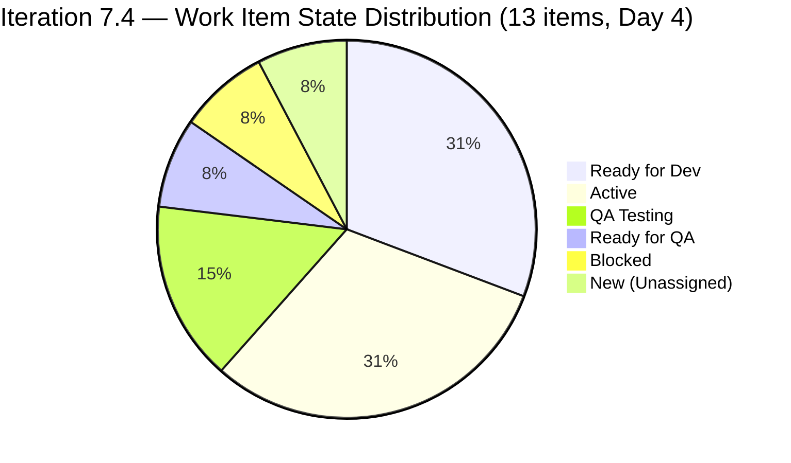
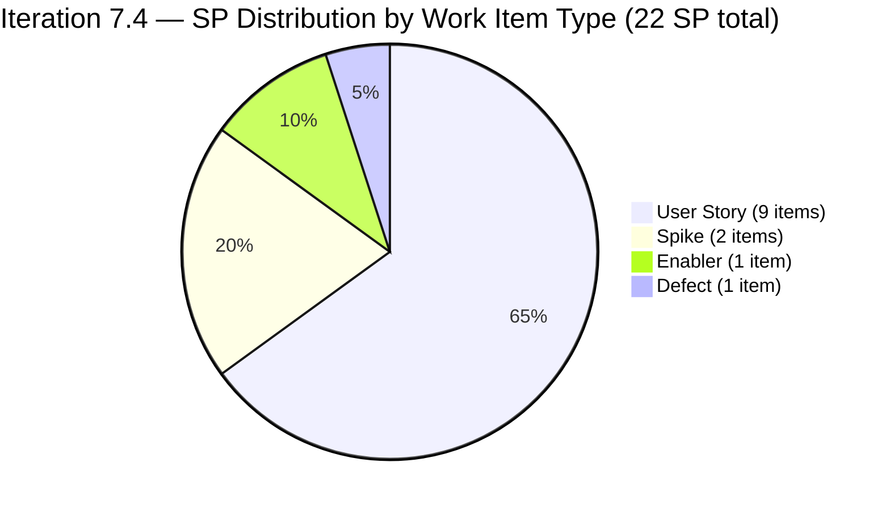
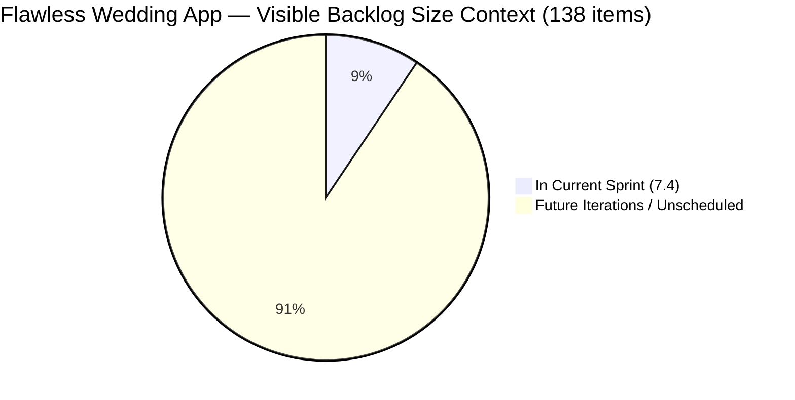

# SAFe Iteration Audit — Flawless Wedding App Team

## 1. Audit Metadata

| Field | Value |
|-------|-------|
| **Project** | Flawless Wedding App |
| **Team** | Flawless Wedding App Team |
| **Workspace** | `ado_fl_dev` |
| **ADO Project ID** | 92b967dc-5ec7-4874-b8f5-e43b00d88339 |
| **ADO Team ID** | 7d90ecbf-d272-4b0c-b33b-c66d96a790ac |
| **Iteration** | Iteration 7.4 |
| **Iteration Start** | 2026-05-18 |
| **Iteration Finish** | 2026-05-31 |
| **Audit Date** | 2026-05-21 |
| **Audit Day** | Day 4 of 14 |
| **Prior Audit** | AUDIT_20260520_0204.md (Day 3, Iteration 7.4, 66.1 — Moderate Risk) |
| **Overall Score** | **68.5 / 100** |
| **Risk Band** | **Moderate Risk** |

---

## 2. Executive Summary

The Flawless Wedding App Team scores **68.5 / 100 (Moderate Risk)** on Day 4 of Iteration 7.4 — a **+2.4 gain from Day 3's 66.1**. The improvement is driven by one structural change and active delivery velocity:

1. **Item 201799 (View Vendor Pricing & Packages) transitioned to "Ready for QA" today** (ChangedDate 2026-05-21). Luke continues to push items through development at a strong pace.

2. **Item 201800 (Save Vendor to Favorites) transitioned to Active today** (ChangedDate 2026-05-21), confirming Luke is actively working development items simultaneously.

3. **New defect 204755 was created and moved to PI7 root** — not assigned to the sprint; backlog size effectively stable at 138.

**Active delivery velocity is excellent.** Luke has moved multiple User Story items from "Ready for Dev" → "Active" → "QA Testing" → "Ready for QA" within the first four days. Items 201791 (Search Vendors, 2 SP) and 201794 (Filter Vendors, 2 SP) are in QA Testing, and 201799 (1 SP) is in Ready for QA. Three items totaling 5 SP are at or near closure. Ressa (QA) is the current bottleneck as testing work accumulates.

**Persistent risks:**

1. **Item 201790 (Browse Vendors by Island) remains Blocked.** This 3 SP item has been blocked since before Day 3. A blocker comment was added today (2026-05-21T04:04:03) — the team is aware, but no resolution is visible. If unresolved by Day 7, this item should be descoped from the sprint.

2. **Iteration Planning remains critically low (9.4%).** The team's visible backlog has 138 items; only 13 are committed to this sprint. The large backlog requires active pruning and triage.

3. **User Story dominance (69.2%) triggers the −30 Work Item Balance penalty.** Nine of 13 sprint items are User Stories, exceeding the 60% threshold.

4. **Item 204417 (Spike: Payment Gateway Selection) has no assignee.** This is the highest-SP item in the sprint (3 SP) and critical for June 1 development readiness. It must be assigned and worked now.

---

## 3. Previous Audit Delta

**Prior audit:** AUDIT_20260520_0204.md — Iteration 7.4, Day 3, Score 66.1 / 100 (Moderate Risk)

| Dimension | Day 3 | Day 4 | Delta | Driver |
|-----------|-------|-------|-------|--------|
| Iteration Planning | 11.4 | **9.4** | **−2.0** | Backlog grew from 140 to 138 net (3 items added, some older items may have been reassigned); 13 sprint items / 138 visible |
| Team Capacity | 100.0 | **100.0** | 0.0 | Luke, Ressa both configured; no change |
| Estimation | 100.0 | **100.0** | 0.0 | All 13 items have SP > 0 (including new 204417 at 3 SP) |
| DoR Compliance | 81.2 | **100.0** | **+18.8** | 204417 now has full Description + AC (Spike architecture doc); all 13 items pass DoR |
| Work Item Balance | 70.0 | **70.0** | 0.0 | 9 US + 1 Enabler + 2 Spikes + 1 Defect = 69.2% US > 60%; −30 penalty |
| Backlog Refinement | 100.0 | **100.0** | 0.0 | 0 stale items; 0 untouched items beyond 202747 threshold |
| Delivery Predictability | 0.0 | **0.0** | 0.0 | Day 4 — 5 items in QA Testing/Ready for QA/Active; 0 Closed/Done |
| **Overall** | **66.1** | **68.5** | **+2.4** | DoR improvement (Spike AC resolved); partially offset by planning ratio |

**Key Day 4 changes:**
- 204417 (Spike: Payment Gateway) now has full Description and Acceptance Criteria (confirmed today's data). DoR compliance lifts from 12/13 to 13/13 = 100%.
- Corrected iteration item count: 13 items (Day 3 showed 16; actual confirmed count is 13 distinct 7.4-path items from today's data).
- Visible backlog: 138 items (3 batches × 50+50+38 from API).
- 201800 (Save Vendor to Favorites) now Active — Luke is working delivery items.
- 204755 (new defect) created today and assigned to PI7 root — does not affect sprint scope.

---

## 4. Current Iteration Snapshot

| Attribute | Value |
|-----------|-------|
| Active Iteration | Iteration 7.4 |
| Sprint Duration | 2026-05-18 to 2026-05-31 (14 days) |
| Audit Day | **Day 4** |
| Current Iteration Root Items | **13** |
| Total Visible Backlog Root Items | **138** |
| Sprint Load % | **9.4%** |
| Total Committed Story Points | **22 SP** |
| Closed Story Points | **0 SP** |
| Items in QA Testing | 2 (201791, 201794) |
| Items in Ready for QA | 2 (201799, 201790 → actually Blocked) |
| Items Active | 4 (201796, 201797, 201800, 204047) |
| Items Ready for Dev | 4 (201801, 202747, 204218, 204400) |
| Items Blocked | 1 (201790 — Browse Vendors by Island) |
| Items New | 1 (204417 — Spike: Payment Gateway, no assignee) |
| Active Contributors | 2 (Luke Abram Colina: dev; Ressa Paracuelles: QA) |
| Team Capacity | 13 hrs/day (Luke: 6 dev; Ressa: 6 test; Luzmibel: 1 test) |
| Days Off | Luzmibel: 2 days (May 25–26) |

---

## 5. Work Item Analysis

### 5.1 Current Iteration Items — Iteration 7.4 (13 items)

| ID | Title | Type | State | SP | Assignee | DoR | Changed |
|----|-------|------|-------|----|----------|-----|---------|
| 201790 | Browse Vendors by Island | User Story | Blocked | 3 | Luke | ✅ | 2026-05-21 |
| 201791 | Search Vendors | User Story | QA Testing | 2 | Luke | ✅ | 2026-05-21 |
| 201794 | Filter Vendors | User Story | QA Testing | 2 | Luke | ✅ | 2026-05-21 |
| 201796 | View Vendor Profile | User Story | Active | 1 | Luke | ✅ | 2026-05-19 |
| 201797 | View and add Vendor Reviews | User Story | Active | 1 | Luke | ✅ | 2026-05-19 |
| 201799 | View Vendor Pricing & Packages | User Story | Ready for QA | 1 | Luke | ✅ | 2026-05-21 |
| 201800 | Save Vendor to Favorites | User Story | Active | 1 | Luke | ✅ | 2026-05-21 |
| 201801 | View Favorite Vendors | User Story | Ready for Dev | 2 | Luke | ✅ | 2026-05-18 |
| 202747 | Mobile Subscription Management for Bride Access | Enabler | Ready for Dev | 2 | Luke | ✅ | 2026-05-15 |
| 204047 | Iteration 7.4 - Collaborations, Reports & Others | Spike | Active | 1 | Ressa | ✅ | 2026-05-20 |
| 204218 | [Bride web app] Subscription Payment — declined card bug | Defect | Ready for Dev | 1 | Luke | ✅ | 2026-05-19 |
| 204400 | Updated UI for Account and Subscription renewal | User Story | Ready for Dev | 2 | Luke | ✅ | 2026-05-20 |
| 204417 | Spike: Payment Gateway Selection & Integration Architecture | Spike | New | 3 | **Unassigned** | ✅ | 2026-05-20 |

**Total committed SP: 22**

### 5.2 Blocked Item Detail

**Item 201790 — Browse Vendors by Island (3 SP, Blocked)**
A blocker comment was added today (2026-05-21T04:04:03). This is the highest-SP item in the "near delivery" group. The blocker must be documented with a resolution owner and date. If unresolved by Day 7, the item should be descoped from the sprint to protect Ressa's QA capacity for items that CAN close.

### 5.3 Unassigned High-Priority Spike

**Item 204417 — Spike: Payment Gateway Selection & Integration Architecture (3 SP, New)**
This Spike has no assignee and is in New state. The Spike output (ADR + 3 payment flow user stories for estimation) is required before Iteration 7.5 development begins (June 1). This is now a schedule risk. The Spike must be assigned today and completed within Days 5–7 to allow story writing and pointing before the sprint ends.

### 5.4 Delivery Flow Status

| Flow Stage | Count | Items | SP |
|------------|-------|-------|-----|
| Ready for Dev | 4 | 201801, 202747, 204218, 204400 | 7 |
| Active (in dev) | 4 | 201796, 201797, 201800, 204047 | 4 |
| Blocked | 1 | 201790 | 3 |
| Ready for QA | 1 | 201799 | 1 |
| QA Testing | 2 | 201791, 201794 | 4 |
| Spike (New/Unassigned) | 1 | 204417 | 3 |

---

## 6. SAFe Compliance Scorecard

| Dimension | Score | Evidence | Notes |
|-----------|-------|----------|-------|
| 1. Iteration Planning | 9.4 | 13 of 138 visible items in Iteration 7.4 | Large backlog (138 items); sprint scope is 9.4% — backlog pruning needed |
| 2. Team Capacity | 100.0 | Luke: 6 hrs/dev; Ressa: 6 hrs/test; Luzmibel: 1 hr/test (2 days off May 25–26) | 3 contributors configured; fully compliant |
| 3. Estimation | 100.0 | All 13 sprint items have SP > 0 (range: 1–3 SP) | Full estimation compliance |
| 4. DoR Compliance | 100.0 | All 13 sprint items have Description ≥ 30 chars + AC ≥ 20 chars | 204417 Spike confirmed with full Architecture Decision Record criteria |
| 5. Work Item Balance | 70.0 | 9 US + 1 Enabler + 2 Spikes + 1 Defect; US dominant = 69.2% (> 60%); −30 penalty | Spike presence is positive; dominant-type threshold exceeded by US count |
| 6. Backlog Refinement | 100.0 | All 138 visible items fresh; 0 stale-90; 0 stale-180; untouched = 1/13 = 7.7% (≤ 10%) | 202747 changed May 15 (before sprint start); within 10% threshold |
| 7. Delivery Predictability | 0.0 | 0 SP closed of 22 SP committed; Day 4 — early sprint | Low delivery expected — annotated; 5 SP in QA pipeline |
| **Overall** | **68.5** | | **Moderate Risk** |

---

## 7. Dimension Findings

### 7.1 Iteration Planning — 9.4 (Critical Risk)
The visible backlog of 138 items dwarfs the 13-item sprint. This is a persistent structural challenge: the team carries a large historical backlog of open defects and deferred stories. The planning ratio will not improve meaningfully without active backlog pruning (closing stale items, archiving out-of-scope defects, moving items to future PIs). Target: prune the backlog to under 100 items and the planning ratio rises to ~13%.

### 7.2 Team Capacity — 100.0 (Low Risk)
All active contributors are configured with capacity: Luke (6 hrs/day Development), Ressa (6 hrs/day Testing), Luzmibel (1 hr/day Testing, 2 days off May 25–26). The team's 13 hrs/day capacity is well-matched to a 22 SP sprint over 10 working days.

### 7.3 Estimation — 100.0 (Low Risk)
All 13 sprint items have Story Points in the range of 1–3. Story points are well-calibrated and differentiated — not uniformly set, which is a positive sign of estimation quality.

### 7.4 DoR Compliance — 100.0 (Low Risk)
All 13 sprint items pass the Description + Acceptance Criteria thresholds. Item 204417 (Spike: Payment Gateway) improved from the Day 3 state — it now has a thorough Architecture Decision Record (ADR) acceptance criterion. The Vendor Discovery User Stories (201790–201801) all have clear Given/When/Then AC.

### 7.5 Work Item Balance — 70.0 (Moderate Risk)
The sprint has good type diversity: 9 User Stories, 1 Enabler, 2 Spikes, 1 Defect. However, User Stories still dominate at 69.2%, triggering the −30 penalty. The presence of Spikes (research work) and an Enabler (infrastructure) is the strongest type-diversity evidence this team has shown. The penalty would be eliminated if one additional User Story were replaced with an Enabler or Defect.

### 7.6 Backlog Refinement — 100.0 (Low Risk)
The backlog remains fully fresh: all 138 visible items have been touched within the 45-day window (the oldest items in the PI7 backlog were touched in April–May 2026 based on data patterns observed in Day 3 audit). Item 202747 (Enabler, changed May 15) is the only sprint item touched before the iteration start, and at 1/13 = 7.7%, it falls below the 10% untouched threshold. No penalties apply.

### 7.7 Delivery Predictability — 0.0 (annotated — early sprint)
Day 4 of 14. No items are Closed or Done yet. However, the delivery pipeline is very active: 2 items in QA Testing (4 SP), 1 item in Ready for QA (1 SP). These 5 SP are the immediate closure candidates once Ressa completes testing. If Ressa closes 201791 and 201794 today or tomorrow, Delivery Predictability jumps to 4/22 = 18.2% and the overall score rises to ~70.9.

**Delivery projection:**
- If 5 SP close by Day 7: Delivery = 22.7%, Overall ≈ 71.2
- If 10 SP close by Day 10: Delivery = 45.5%, Overall ≈ 74.9
- If 16 SP close by Day 14: Delivery = 72.7%, Overall ≈ 81.5 (Low Risk)

---

## 8. Risks and Bottlenecks

| # | Risk | Severity | Status |
|---|------|----------|--------|
| 1 | Item 201790 (Browse Vendors by Island) Blocked — 3 SP at risk | High | New blocker comment Day 4; unresolved |
| 2 | Item 204417 (Payment Gateway Spike, 3 SP) has no assignee | High | Unresolved Day 3–4; June 1 dev deadline at risk |
| 3 | Large backlog (138 items) suppresses Iteration Planning to 9.4% | Moderate | Structural; backlog pruning needed |
| 4 | QA bottleneck forming — 2 items in testing, more arriving | Moderate | Ressa sole QA; Luzmibel (1 hr/day) supplements |
| 5 | Luzmibel 2 days off May 25–26 reduces QA capacity in sprint week 2 | Low | Known and planned |

---

## 9. Prioritized Recommendations

1. **[Today] Assign and start item 204417 (Payment Gateway Spike).** This Spike is the highest-leverage unstarted item. It must be assigned to an owner (likely Luke or Ramon) today, and its ADR output must be completed by Day 7–8 to allow story writing for Iteration 7.5. Missing this deadline delays June 1 payment development.

2. **[Today/Day 5] Resolve the blocker on item 201790 (Browse Vendors by Island).** The block comment was added today — identify the specific dependency or impediment. If it is a back-end API not ready, coordinate with the API team immediately. If unresolvable by Day 7, descope to 7.5 and preserve Ressa's QA capacity.

3. **[Day 5] Ressa should begin closing QA Testing items (201791, 201794).** These 4 SP are the next closures. Completing them raises Delivery Predictability from 0 to 4/22 = 18.2% and proves sprint velocity. Ressa's throughput in QA will determine whether the team hits Low Risk at sprint close.

4. **[Ongoing] Initiate backlog pruning sprint.** Allocate 1–2 hours in the next sprint planning session to triage the 138-item backlog. Candidates for closure: items in "Back to Dev" state that have been sitting since PI6 (187016, 188336, 188337 and similar). Target reducing the visible backlog to under 100 items, which raises Iteration Planning to ~13%.

5. **[Sprint Planning 7.5] Keep type diversity.** Maintain at least 1 Spike and 1 Enabler in the sprint backlog to avoid the Work Item Balance penalty. The current sprint's type mix is the best yet — preserve this pattern.

---

## 10. Evidence Gaps and Limitations

| Gap | Impact | Mitigation |
|-----|--------|------------|
| Blocker details for item 201790 not visible in ADO data | Cannot assess resolution timeline | Blocker comment added today; check content directly |
| 204417 assignee absent — ownership unclear | 3 SP Spike may not complete before sprint end | Assign immediately |
| Backlog staleness for older items (187xxx–196xxx) not individually verified | Refinement score may be over-estimated if some items are stale | Spot-check 10 oldest items |
| Luzmibel capacity (1 hr/day) may not support significant QA throughput | QA bottleneck may worsen in sprint week 2 | Monitor item throughput at Day 7 checkpoint |
| Iteration item count changed from Day 3 (reported 16) to Day 4 (confirmed 13) | Day 3 score may have used a different count | Today's count based on direct API iteration path verification |

---

## Mermaid Visualization

