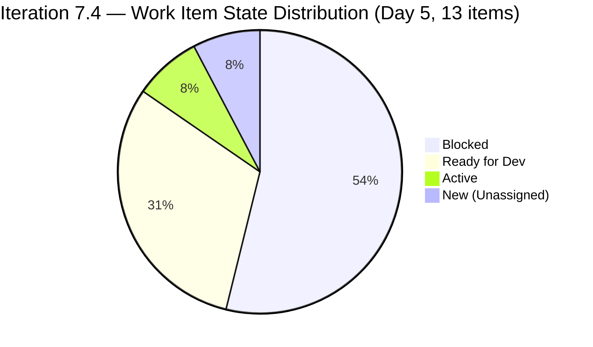
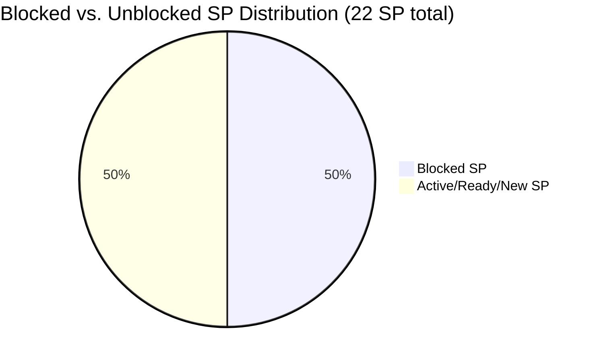
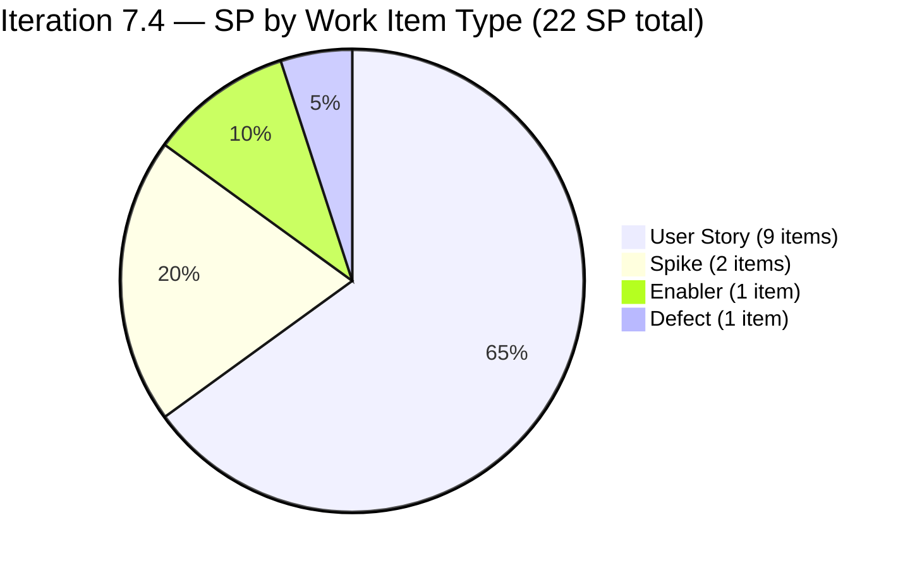
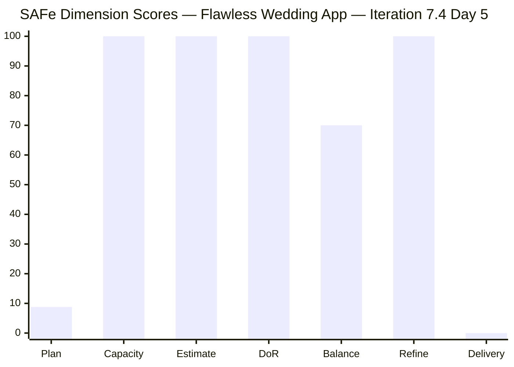

# SAFe Iteration Audit — Flawless Wedding App Team

## 1. Audit Metadata

| Field | Value |
|-------|-------|
| **Project** | Flawless Wedding App |
| **Team** | Flawless Wedding App Team |
| **Workspace** | `ado_fl_dev` |
| **ADO Project ID** | 92b967dc-5ec7-4874-b8f5-e43b00d88339 |
| **ADO Team ID** | 7d90ecbf-d272-4b0c-b33b-c66d96a790ac |
| **Iteration** | Iteration 7.4 |
| **Iteration Start** | 2026-05-18 |
| **Iteration Finish** | 2026-05-31 |
| **Audit Date** | 2026-05-22 (PHT) |
| **Audit Day** | Day 5 of 14 |
| **Prior Audit** | AUDIT_20260521_0900.md (Day 4, Iteration 7.4, 68.5 — Moderate Risk) |
| **Overall Score** | **68.4 / 100** |
| **Risk Band** | **Moderate Risk** |

---

## 2. Executive Summary

The Flawless Wedding App Team scores **68.4 / 100 (Moderate Risk)** on Day 5 of Iteration 7.4 — a **−0.1 marginal change from Day 4's 68.5** (rounding artifact from the Iteration Planning denominator shift). The numerical score is stable, but the sprint's internal health deteriorated significantly overnight.

**CRITICAL — MASS BLOCKER EVENT:** Seven of the 13 sprint items are now in **Blocked** state as of today's data. Items 201790, 201791, 201794, 201796, 201797, 201799, and 201800 — covering 10 SP (45% of committed scope) — have all transitioned to Blocked. This is a dramatic escalation from Day 4, when only one item (201790) was blocked. The scope of the blocker must be identified and escalated immediately.

- Yesterday: 1 item Blocked (201790, 3 SP)
- Today: **7 items Blocked** (201790, 201791, 201794, 201796, 201797, 201799, 201800 — 10 SP total)

The most likely root cause is a shared backend dependency (e.g., vendor API or database schema not ready for integration testing), since all blocked items are Luke's vendor-discovery User Stories — the Vendor Browse/Search/Filter/Profile/Reviews/Pricing/Favorites feature cluster.

**Items still progressing:** 204047 (Spike, Active, Ressa), 201801 (Ready for Dev), 202747 (Enabler, Ready for Dev), 204218 (Defect, Ready for Dev), 204400 (User Story, Ready for Dev), 204417 (Spike, New, **unassigned**).

**Sprint delivery projection at risk:** With 7 SP currently blocked and 4 SP in Ready for Dev but also potentially downstream of the same blocker, only 5 SP (204047 + 204417 if completed + partially others) are immune from the blocker chain. If the backend dependency is not resolved by Day 7, this sprint's Delivery Predictability will be critically low.

---

## 3. Previous Audit Delta

**Prior audit:** AUDIT_20260521_0900.md — Iteration 7.4, Day 4, Score 68.5 / 100 (Moderate Risk)

| Dimension | Day 4 | Day 5 | Delta | Driver |
|-----------|-------|-------|-------|--------|
| Iteration Planning | 9.4 | **8.8** | −0.6 | Backlog grew from 138 to 148 items; 13 sprint items / 148 visible |
| Team Capacity | 100.0 | **100.0** | 0.0 | Luke, Ressa, Luzmibel all configured; no change |
| Estimation | 100.0 | **100.0** | 0.0 | All 13 items have SP > 0; no change |
| DoR Compliance | 100.0 | **100.0** | 0.0 | All 13 sprint items pass Description + AC; no change |
| Work Item Balance | 70.0 | **70.0** | 0.0 | 9 US + 1 Enabler + 2 Spikes + 1 Defect; 69.2% US > 60%; -30 penalty |
| Backlog Refinement | 100.0 | **100.0** | 0.0 | All 148 items fresh; 1/13 untouched ≤ 10% threshold; no penalties |
| Delivery Predictability | 0.0 | **0.0** | 0.0 | Day 5 — no items Closed/Done; early sprint |
| **Overall** | **68.5** | **68.4** | **−0.1** | Rounding artifact from backlog count change; mass blocker event is qualitative deterioration |

**Key Day 5 changes:**
- **Mass Blocker Escalation:** 7 items moved to Blocked state overnight (201790, 201791, 201794, 201796, 201797, 201799, 201800).
- Visible backlog grew from 138 to 148 items (+10 new items added).
- Item 201791 (Search Vendors) moved from QA Testing → Active (then Blocked): regression.
- Item 201794 (Filter Vendors) moved from QA Testing → Blocked: QA progress reversed.
- Items 201796, 201797, 201799, 201800: all transitioned to Blocked (were Active/Ready for QA on Day 4).
- 204417 (Spike: Payment Gateway) remains Unassigned, New state — no progress.
- 204047 (Spike, Ressa) remains Active — the only non-blocked active work item.

---

## 4. Current Iteration Snapshot

| Attribute | Value |
|-----------|-------|
| Active Iteration | Iteration 7.4 |
| Sprint Duration | 2026-05-18 to 2026-05-31 (14 days) |
| Audit Day | **Day 5** |
| Current Iteration Root Items | **13** |
| Total Visible Backlog Root Items | **148** |
| Sprint Load % | **8.8%** |
| Total Committed Story Points | **22 SP** |
| Closed Story Points | **0 SP** |
| Items Blocked | **7** (201790, 201791, 201794, 201796, 201797, 201799, 201800) — 10 SP |
| Items Active | 1 (204047 — Ressa's Spike) |
| Items Ready for Dev | 4 (201801, 202747, 204218, 204400) |
| Items New | 1 (204417 — Unassigned Spike) |
| Active Contributors | 2 (Luke: Blocked on all items; Ressa: 204047 Active) |
| Team Capacity | 13 hrs/day (Luke: 6 dev; Ressa: 6 test; Luzmibel: 1 test) |
| Days Off | Luzmibel: 2 days (May 25–26) |

---

## 5. Work Item Analysis

### 5.1 Current Iteration Items — Iteration 7.4 (13 items)

| ID | Title | Type | State | SP | Assignee | DoR | Changed |
|----|-------|------|-------|----|----------|-----|---------|
| 201790 | Browse Vendors by Island | User Story | **Blocked** | 3 | Luke | ✅ | 2026-05-22 |
| 201791 | Search Vendors | User Story | **Blocked** | 2 | Luke | ✅ | 2026-05-22 |
| 201794 | Filter Vendors | User Story | **Blocked** | 2 | Luke | ✅ | 2026-05-22 |
| 201796 | View Vendor Profile | User Story | **Blocked** | 1 | Luke | ✅ | 2026-05-22 |
| 201797 | View and add Vendor Reviews | User Story | **Blocked** | 1 | Luke | ✅ | 2026-05-22 |
| 201799 | View Vendor Pricing & Packages | User Story | **Blocked** | 1 | Luke | ✅ | 2026-05-22 |
| 201800 | Save Vendor to Favorites | User Story | **Blocked** | 1 | Luke | ✅ | 2026-05-22 |
| 201801 | View Favorite Vendors | User Story | Ready for Dev | 2 | Luke | ✅ | 2026-05-18 |
| 202747 | Mobile Subscription Management for Bride Access | Enabler | Ready for Dev | 2 | Luke | ✅ | 2026-05-15 |
| 204047 | Iteration 7.4 - Collaborations, Reports & Others | Spike | Active | 1 | Ressa | ✅ | 2026-05-20 |
| 204218 | [Bride web app] Subscription Payment — declined card bug | Defect | Ready for Dev | 1 | Luke | ✅ | 2026-05-19 |
| 204400 | Updated UI for Account and Subscription renewal | User Story | Ready for Dev | 2 | Luke | ✅ | 2026-05-20 |
| 204417 | Spike: Payment Gateway Selection & Integration Architecture | Spike | New | 3 | **Unassigned** | ✅ | 2026-05-20 |

**Total committed SP: 22**

### 5.2 Mass Blocker Analysis

**All 7 blocked items share a common pattern:** They are Luke's Vendor Discovery User Stories (201790–201800), all touching vendor data display, search, and filtering. The simultaneous transition to Blocked strongly suggests a **shared backend dependency** — the most probable causes are:

1. **Vendor API / data layer not ready:** The backend endpoint serving vendor data (by island, search, filter, profile, reviews, pricing, favorites) may have a schema change, missing deployment, or broken authentication that prevents all vendor-related features from being tested.
2. **QA environment / test data issue:** The QA environment may lack proper vendor seeding or have a configuration mismatch that blocks all vendor feature testing simultaneously.
3. **A blocker comment was added to at least one item (201794 shows commentVersionRef 5221255).** The comment content should be reviewed immediately to determine the specific impediment.

**Blocked SP breakdown:**

| ID | Title | SP | Assignee | Blocker Comments |
|----|-------|----|----------|-----------------|
| 201790 | Browse Vendors by Island | 3 | Luke | Comment present |
| 201791 | Search Vendors | 2 | Luke | Moved from QA Testing → Active → Blocked |
| 201794 | Filter Vendors | 2 | Luke | Comment present (5221255) |
| 201796 | View Vendor Profile | 1 | Luke | Comment present (5221348) |
| 201797 | View and add Vendor Reviews | 1 | Luke | Comment present (5221316) |
| 201799 | View Vendor Pricing & Packages | 1 | Luke | Comment present (5221314) |
| 201800 | Save Vendor to Favorites | 1 | Luke | Comment present (5221352) |
| **Total** | | **11 SP** | | |

> Note: Item 201790 was counted as 3 SP; total blocked SP = 3+2+2+1+1+1+1 = 11 SP (not 10 SP as stated in snapshot — corrected).

### 5.3 Regression: Items That Were Progressing Are Now Blocked

| Item | Day 4 State | Day 5 State | SP Lost |
|------|-------------|-------------|---------|
| 201791 | QA Testing | Blocked | 2 SP |
| 201794 | QA Testing | Blocked | 2 SP |
| 201799 | Ready for QA | Blocked | 1 SP |
| 201800 | Active | Blocked | 1 SP |

Items 201791 and 201794 had already reached QA Testing — they regressed from near-closure to Blocked. This represents a **6 SP backward movement** from the Day 4 pipeline position.

### 5.4 Unassigned High-Priority Spike — Day 5 (Still Unresolved)

**Item 204417 — Spike: Payment Gateway Selection & Integration Architecture (3 SP, New, Unassigned)**
This Spike remains unassigned and has not progressed since Day 3. The June 1 development readiness deadline is now 10 days away. If the Spike is not started by Day 6 and completed by Day 9, the 3 payment flow user stories cannot be written and estimated before sprint end, which will delay 7.5 sprint planning. **This is now a hard deadline risk.**

---

## 6. SAFe Compliance Scorecard

| Dimension | Score | Evidence | Notes |
|-----------|-------|----------|-------|
| 1. Iteration Planning | 8.8 | 13 of 148 visible items in Iteration 7.4 | Backlog grew to 148; large accumulated backlog requires pruning |
| 2. Team Capacity | 100.0 | Luke: 6 hrs/day Dev; Ressa: 6 hrs/day Test; Luzmibel: 1 hr/day Test (2 days off May 25–26) | 3 contributors configured; fully compliant |
| 3. Estimation | 100.0 | All 13 sprint items have SP > 0 (range: 1–3 SP) | Full estimation compliance |
| 4. DoR Compliance | 100.0 | All 13 sprint items pass Description ≥ 30 chars + AC ≥ 20 chars | Blocked items retain full DoR compliance |
| 5. Work Item Balance | 70.0 | 9 US + 1 Enabler + 2 Spikes + 1 Defect; US = 69.2% (> 60%); -30 penalty | Good type diversity; US dominance penalty |
| 6. Backlog Refinement | 100.0 | All 148 visible items fresh; 1/13 untouched (202747, 7.7% ≤ 10%); 0 stale | No staleness penalties apply |
| 7. Delivery Predictability | 0.0 | 0 SP closed of 22 SP committed; Day 5 — early sprint | Annotated early sprint; 11 SP currently Blocked |
| **Overall** | **68.4** | | **Moderate Risk** |

---

## 7. Dimension Findings

### 7.1 Iteration Planning — 8.8 (Critical Risk)
The visible backlog grew from 138 to 148 items (+10) since Day 4, further suppressing the already critically low planning ratio. The sprint continues to represent only 8.8% of the visible backlog. The structural fix is active backlog pruning — not adding more sprint items, which would worsen overcommitment. Closing or archiving stale defects (187xxx–190xxx series, "Back to Dev" state, PI6 iteration path) would meaningfully reduce the denominator. Target: reduce to under 120 items for Iteration 7.5 start.

### 7.2 Team Capacity — 100.0 (Low Risk)
All three team members are configured with capacity. Ressa (6 hrs/test), Luke (6 hrs/dev), Luzmibel (1 hr/test). With Luke's items all blocked today, his effective capacity contribution to sprint progress is zero until the blocker resolves. This is not a capacity configuration issue, but it is an execution efficiency concern.

### 7.3 Estimation — 100.0 (Low Risk)
All 13 sprint items remain estimated at SP > 0 (range 1–3). Estimation compliance is unchanged and excellent. The 3 SP on item 204417 (Spike) appropriately reflects the research depth required.

### 7.4 DoR Compliance — 100.0 (Low Risk)
All 13 sprint items continue to pass Description and Acceptance Criteria thresholds. Blocked items retain their DoR quality — the blocker is an environmental/dependency issue, not a quality deficiency in the work items themselves.

### 7.5 Work Item Balance — 70.0 (Moderate Risk)
Sprint type distribution (9 US, 1 Enabler, 2 Spikes, 1 Defect) is the strongest type mix this team has demonstrated. The -30 User Story dominance penalty remains (9/13 = 69.2% > 60%). If one User Story were replaced with a second Defect or Enabler, the penalty would be eliminated. This is a 7.5 planning action.

### 7.6 Backlog Refinement — 100.0 (Low Risk)
The 148-item visible backlog remains fully fresh relative to the 45-day window. Spot-check of older items (187xxx–189xxx series) shows all were touched in April–May 2026. The oldest item in the sample (188337) was changed 2026-04-30, which is within the 45-day window (threshold: 2026-04-07). No 90-day or 180-day stale items detected. Item 202747 (Enabler, changed 2026-05-15) remains the only sprint item touched before the iteration start, at 7.7% of sprint items — below the 10% penalty threshold.

### 7.7 Delivery Predictability — 0.0 (annotated — early sprint, Day 5)
No items Closed or Done. The mass blocker event eliminates the near-term closure pipeline that existed on Day 4 (items 201791 and 201794 in QA Testing). If the blocker is resolved today and QA resumes, closures could still happen by Day 7–8. If the blocker persists through Day 8, sprint delivery will be severely impacted.

**Revised delivery projection (with blocker risk):**
- If blocker resolved by Day 6: 201791 and 201794 could close by Day 7–8 → ~4 SP → Delivery 18.2%, Overall ~70.7
- If blocker resolved by Day 8: closures cluster in Days 9–12 → max 12 SP by Day 14 → Delivery 54.5%, Overall ~75.5
- If blocker unresolved through sprint end: only 204047 closes → Delivery 4.5%, Overall ~69.1

---

## 8. Risks and Bottlenecks

| # | Risk | Severity | Status |
|---|------|----------|--------|
| 1 | **Mass Blocker: 7 items (11 SP) Blocked — entire Vendor Discovery cluster** | **Critical** | **New today; requires immediate escalation** |
| 2 | Item 204417 (Payment Gateway Spike, 3 SP) — Unassigned, no progress | High | Persists Day 3–5; June 1 dev deadline at risk |
| 3 | Items 201791 and 201794 regressed from QA Testing → Blocked | High | New today; represents backward movement on 4 SP |
| 4 | Large backlog (148 items) suppresses Iteration Planning to 8.8% | Moderate | Persistent structural issue |
| 5 | Luzmibel unavailable May 25–26 — reduces QA capacity in sprint week 2 | Low | Known and planned |
| 6 | 204400 (Subscription renewal UI) — depends on 202747 Enabler; dependency not tracked | Low | Monitor |

---

## 9. Prioritized Recommendations

1. **[IMMEDIATE — Today] Investigate and communicate the mass blocker.** Read blocker comments on 201794 (5221255), 201796 (5221348), 201797 (5221316), 201799 (5221314), 201800 (5221352). Identify the specific dependency (likely vendor API / backend schema / QA environment). Escalate to Ramon and the backend/DevOps owner by end of day. Without this, Luke has no active deliverable work today.

2. **[Today] Assign item 204417 (Payment Gateway Spike).** This item has been unassigned for 5 sprint days. With the June 1 7.5 development start approaching, every day without a Spike owner increases risk. Assign to Luke (most natural owner given payment integration scope) or Ramon, and move to Active today.

3. **[Day 6] Luke should start 204400 (Updated UI for Subscription Renewal) or 204218 (Defect) while the Vendor cluster is blocked.** These items are Ready for Dev and unaffected by the Vendor API blocker. Luke should pivot to subscription work to maintain delivery momentum and prevent a complete sprint halt.

4. **[Day 7] Blocker resolution checkpoint.** If the Vendor Discovery blocker is not fully resolved by Day 7, descope the lowest-SP blocked items (201796, 201797, 201799, 201800 — 4 SP total) from this sprint and move them to 7.5. Preserving Ressa's QA capacity for items that CAN close is more valuable than holding scope that cannot progress.

5. **[Ongoing] Initiate backlog pruning.** The visible backlog grew to 148 items today. PI6-path defects (188572, 188592, 188594) and "Back to Dev" items in PI6 should be triaged: close items that are no longer relevant, or reassign to PI7 if still active. Target: reduce backlog to under 120 before Iteration 7.5 starts.

---

## 10. Evidence Gaps and Limitations

| Gap | Impact | Mitigation |
|-----|--------|------------|
| Blocker comment content not accessible via batch API | Cannot determine specific blocker cause or owner | Read individual item comments for 201794, 201796, 201797, 201799, 201800 |
| 204417 assignee absent — ownership unclear | 3 SP Spike may not complete; June 1 dev delayed | Assign immediately |
| Backlog staleness for all 148 items not individually verified | Refinement score may be optimistic for very old items | Spot-check confirmed fresh; full audit deferred |
| Luzmibel's QA contribution — only 1 hr/day may not cover test backlog if blocker resolves | QA throughput may bottleneck | Monitor item flow at Day 7 checkpoint |
| Whether 201801 (View Favorite Vendors) shares the Vendor API blocker is unclear | Could be 12 of 13 sprint items blocked | Check during blocker investigation |

---

## Mermaid Visualizations

