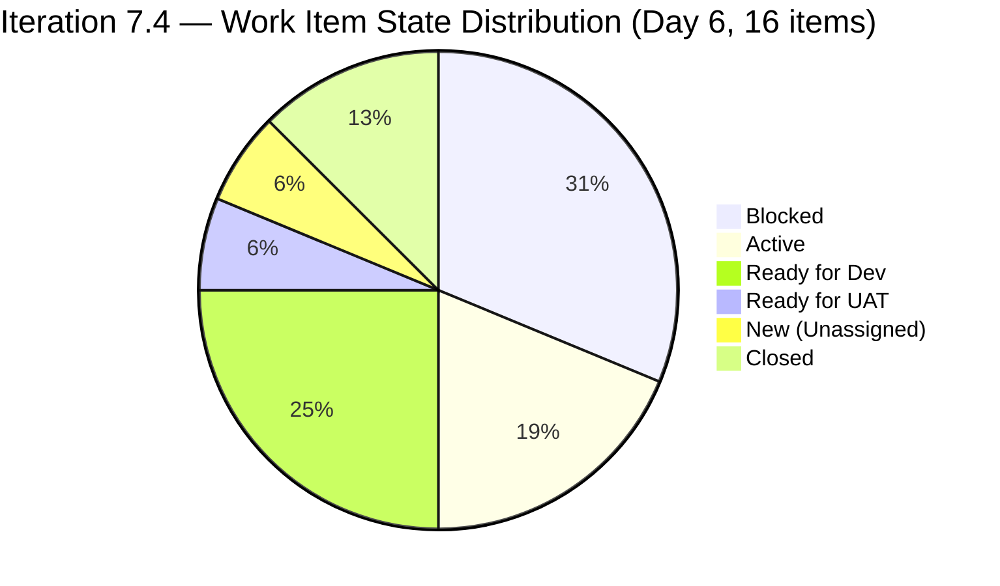
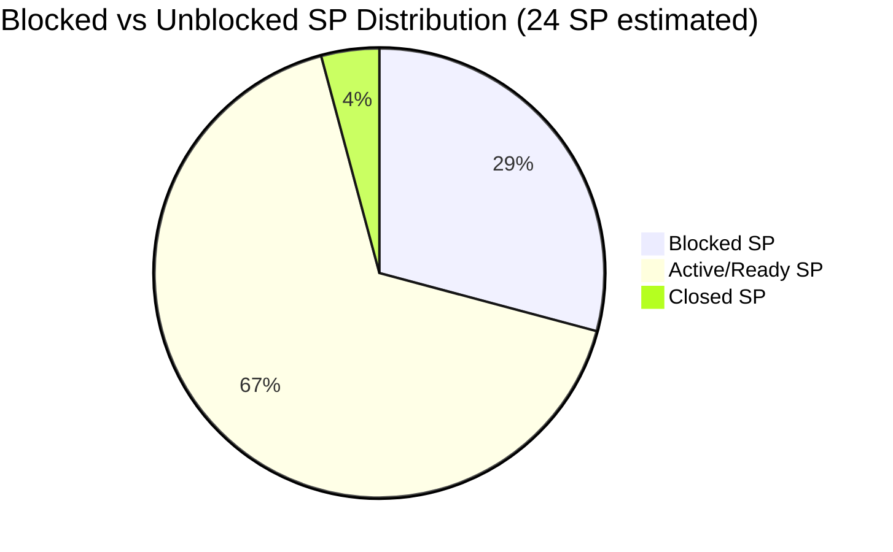
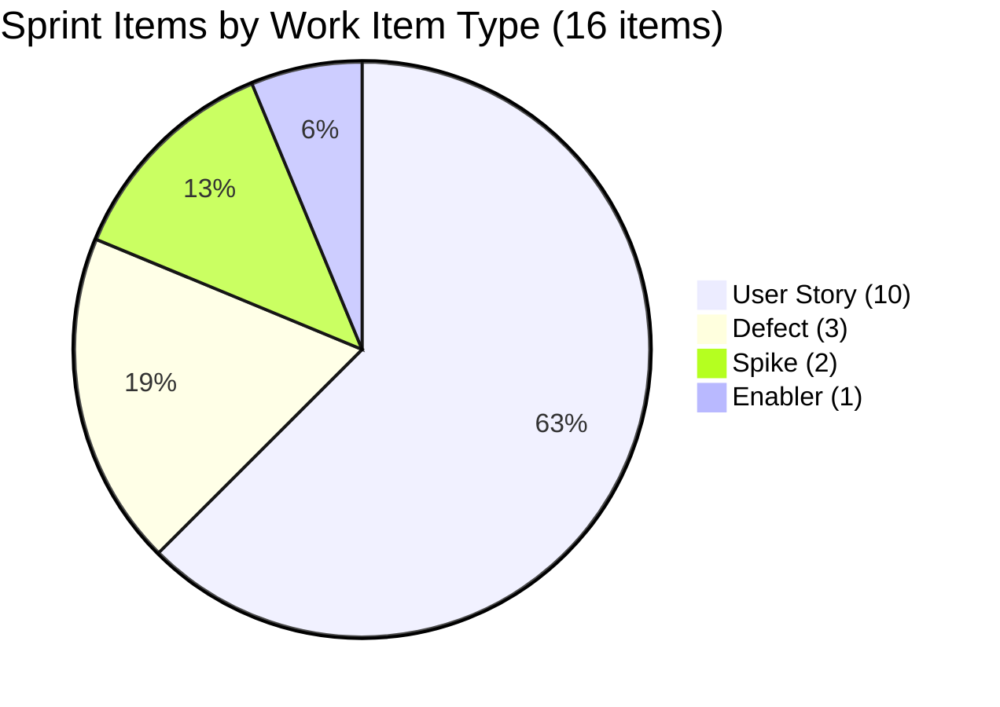

# SAFe Iteration Audit — Flawless Wedding App Team

## 1. Audit Metadata

| Field | Value |
|-------|-------|
| **Project** | Flawless Wedding App |
| **Team** | Flawless Wedding App Team |
| **Workspace** | `ado_fl_dev` |
| **ADO Project ID** | 92b967dc-5ec7-4874-b8f5-e43b00d88339 |
| **ADO Team ID** | 7d90ecbf-d272-4b0c-b33b-c66d96a790ac |
| **Iteration** | Iteration 7.4 |
| **Iteration Start** | 2026-05-18 |
| **Iteration Finish** | 2026-05-31 |
| **Audit Date** | 2026-05-23 (PHT) |
| **Audit Day** | Day 6 of 14 |
| **Prior Audit** | AUDIT_20260522_0900.md (Day 5, Iteration 7.4, 68.4 — Moderate Risk) |
| **Overall Score** | **68.3 / 100** |
| **Risk Band** | **Moderate Risk** |

---

## 2. Executive Summary

The Flawless Wedding App Team scores **68.3 / 100 (Moderate Risk)** on Day 6 of Iteration 7.4 — a marginal **−0.1 from Day 5's 68.4** (rounding artifact from backlog growth). However, the underlying sprint health improved significantly overnight:

**MAJOR POSITIVE DEVELOPMENT — Partial Blocker Resolution:**
- Items 201790 (Browse Vendors by Island) and 201791 (Search Vendors) have **unblocked** — both are now in **Active** state as of 2026-05-22T01:59. This is a major improvement from Day 5's mass-blocker event (7 blocked items).
- Item 204053 (Search Island) advanced to **Ready for UAT** as of 2026-05-22T03:05 — imminent closure expected.

**Remaining blockers: 5 items** (down from 7 on Day 5):
201794 (Filter Vendors), 201796 (View Vendor Profile), 201797 (View and add Vendor Reviews), 201799 (View Vendor Pricing & Packages), 201800 (Save Vendor to Favorites).

**Closures confirmed:**
- **204691** (Vendor Invoice Preview bug) — Closed, 1 SP
- **204750** (Admin Client Intake Form) — Closed, no SP estimated

**Sprint composition expanded:** The sprint now has **16 root items** (up from 13 on Day 5) with three additional items confirmed in the 7.4 iteration path: 204691, 204750, and 204053. The visible backlog grew to **155 items** (from 148 on Day 5).

**Structural concern:** The Estimation dimension drops to 93.8 (item 204750 has no Story Points) — a new gap not present in prior audits.

---

## 3. Previous Audit Delta

**Prior audit:** AUDIT_20260522_0900.md — Iteration 7.4, Day 5, Score 68.4 / 100 (Moderate Risk)

| Dimension | Day 5 | Day 6 | Delta | Driver |
|-----------|-------|-------|-------|--------|
| Iteration Planning | 8.8 | **10.3** | **+1.5** | Sprint expanded to 16 items; backlog to 155 (16/155) |
| Team Capacity | 100.0 | **100.0** | 0.0 | Luke, Ressa, Luzmibel all configured; unchanged |
| Estimation | 100.0 | **93.8** | **−6.2** | Item 204750 has no SP — 15 of 16 estimated |
| DoR Compliance | 100.0 | **100.0** | 0.0 | All 16 sprint items pass Description + AC |
| Work Item Balance | 70.0 | **70.0** | 0.0 | 10 US / 16 items = 62.5% > 60%; -30 penalty |
| Backlog Refinement | 100.0 | **100.0** | 0.0 | All 155 items fresh; 202747 untouched (1/16 = 6.25% ≤ 10%) |
| Delivery Predictability | 0.0 | **4.2** | **+4.2** | 204691 Closed (1 SP of 24 SP committed) |
| **Overall** | **68.4** | **68.3** | **−0.1** | Score improvement masked by backlog growth denominator |

**Key Day 6 changes (items changed 2026-05-22):**
- **201790** (Browse Vendors by Island): Blocked → **Active** at 01:59 ✅ Major blocker resolved
- **201791** (Search Vendors): Blocked → **Active** at 01:59 ✅ Major blocker resolved
- **204053** (Search Island): Advanced to **Ready for UAT** at 03:05 ✅ Closure imminent
- **204750** ([Staging] Admin Client Intake Form): **Closed** (changed 2026-05-21T00:55) — no SP
- **204691** (Vendor Invoice Preview bug): **Closed** (changed 2026-05-20T06:56) — 1 SP
- Sprint blocker count: 7 → **5** (201794, 201796, 201797, 201799, 201800)
- Active items now: 201790, 201791, 204047 (3 active, up from 1 on Day 5)

---

## 4. Current Iteration Snapshot

| Attribute | Value |
|-----------|-------|
| Active Iteration | Iteration 7.4 |
| Sprint Duration | 2026-05-18 to 2026-05-31 (14 days) |
| Audit Day | **Day 6** |
| Current Iteration Root Items | **16** |
| Total Visible Backlog Root Items | **155** |
| Sprint Load % | **10.3%** |
| Total Committed Story Points | **24 SP** (estimated items) |
| Closed Story Points | **1 SP** (204691) |
| Items Blocked | **5** (201794, 201796, 201797, 201799, 201800) — 7 SP |
| Items Active | 3 (201790, 201791, 204047) |
| Items Ready for UAT | 1 (204053) |
| Items Ready for Dev | 4 (201801, 202747, 204218, 204400) |
| Items New (Unassigned) | 1 (204417) |
| Items Closed | 2 (204691, 204750) |
| Active Contributors | 3 (Luke: 2 Active; Ressa: 1 Active; Luzmibel: configured) |
| Team Capacity | 13 hrs/day (Luke: 6 dev; Ressa: 6 test; Luzmibel: 1 test) |
| Days Off | Luzmibel: 2 days (May 25–26) |

---

## 5. Work Item Analysis

### 5.1 Current Iteration Items — Iteration 7.4 (16 items)

| ID | Title | Type | State | SP | Assignee | DoR | Changed |
|----|-------|------|-------|----|----------|-----|---------|
| 201790 | Browse Vendors by Island | User Story | **Active** ✅ | 3 | Luke | ✅ | **2026-05-22** |
| 201791 | Search Vendors | User Story | **Active** ✅ | 2 | Luke | ✅ | **2026-05-22** |
| 201794 | Filter Vendors | User Story | **Blocked** | 2 | Luke | ✅ | 2026-05-22 |
| 201796 | View Vendor Profile | User Story | **Blocked** | 1 | Luke | ✅ | 2026-05-22 |
| 201797 | View and add Vendor Reviews | User Story | **Blocked** | 1 | Luke | ✅ | 2026-05-22 |
| 201799 | View Vendor Pricing & Packages | User Story | **Blocked** | 1 | Luke | ✅ | 2026-05-22 |
| 201800 | Save Vendor to Favorites | User Story | **Blocked** | 1 | Luke | ✅ | 2026-05-22 |
| 201801 | View Favorite Vendors | User Story | Ready for Dev | 2 | Luke | ✅ | 2026-05-18 |
| 202747 | Mobile Subscription Management for Bride Access | Enabler | Ready for Dev | 2 | Luke | ✅ | 2026-05-15 |
| 204047 | Iteration 7.4 - Collaborations, Reports & Others | Spike | Active | 1 | Ressa | ✅ | 2026-05-20 |
| 204053 | Search Island | User Story | **Ready for UAT** | 1 | Luke | ✅ | **2026-05-22** |
| 204218 | [Bride web app] Subscription Payment — declined card bug | Defect | Ready for Dev | 1 | Luke | ✅ | 2026-05-19 |
| 204400 | Updated UI for Account and Subscription renewal | User Story | Ready for Dev | 2 | Luke | ✅ | 2026-05-20 |
| 204417 | Spike: Payment Gateway Selection & Integration Architecture | Spike | New | 3 | **Unassigned** | ✅ | 2026-05-20 |
| 204691 | [Staging] [Vendor] Invoice Preview loading / payment error | Defect | **Closed** ✅ | 1 | Luke | ✅ | 2026-05-20 |
| 204750 | [Staging] [Admin] Client intake form page keeps loading | Defect | **Closed** ✅ | — | Luke | ✅ | 2026-05-21 |

**Total committed SP (estimated items): 24 | Closed SP: 1**

⚠️ **Item 204750:** No Story Points configured. The item is Closed, which is positive, but it contributes 0 SP to Delivery Predictability and is flagged as the sole estimation gap.

⚠️ **Item 204417:** Unassigned, New state — Day 6 with no owner. June 1 development start is now 9 days away.

### 5.2 Blocker Status Update

| Item | Day 5 State | Day 6 State | Change |
|------|-------------|-------------|--------|
| 201790 | Blocked | **Active** | ✅ Unblocked |
| 201791 | Blocked | **Active** | ✅ Unblocked |
| 201794 | Blocked | Blocked | No change |
| 201796 | Blocked | Blocked | No change |
| 201797 | Blocked | Blocked | No change |
| 201799 | Blocked | Blocked | No change |
| 201800 | Blocked | Blocked | No change |

**Net: 2 items unblocked.** The fact that 201790 and 201791 were able to unblock while 201794-201800 remain blocked suggests the root blocker may be more granular than a single backend dependency. Possible interpretation: Browse (201790) and Search (201791) use simpler data endpoints that were fixed first, while Filter/Profile/Reviews/Pricing/Favorites features require richer data responses or additional API endpoints that are still unavailable.

### 5.3 New Closures This Sprint

| ID | Title | Type | SP | Closed Date |
|----|-------|------|----|-------------|
| 204691 | [Staging] [Vendor] Invoice Preview loading / payment error | Defect | 1 | 2026-05-20 |
| 204750 | [Staging] [Admin] Client intake form page keeps loading | Defect | 0 (no SP) | 2026-05-21 |

Two defects closed by Luke. These are staging environment bug fixes contributing to platform stability. 204750 needs Story Points assigned retroactively for completeness.

### 5.4 Unassigned Spike — Day 6 (Critical Deadline Risk)

**Item 204417 — Spike: Payment Gateway Selection & Integration Architecture (3 SP, New, Unassigned)**
Day 6 with no owner. Development for payment features starts June 1 (Iteration 7.5, 9 days away). The Spike must be completed by Day 9-10 (May 27-28) to allow time for story writing and estimation before sprint planning. **This is now a red-line risk.**

---

## 6. SAFe Compliance Scorecard

| Dimension | Score | Evidence | Notes |
|-----------|-------|----------|-------|
| 1. Iteration Planning | 10.3 | 16 of 155 visible items in Iteration 7.4 | Backlog grew to 155; large accumulated backlog |
| 2. Team Capacity | 100.0 | Luke: 6 hrs/day Dev; Ressa: 6 hrs/day Test; Luzmibel: 1 hr/day Test (2 days off May 25–26) | 3 contributors configured; fully compliant |
| 3. Estimation | 93.8 | 15 of 16 sprint items estimated; 204750 has no SP | New gap; 204750 closed without story points |
| 4. DoR Compliance | 100.0 | All 16 sprint items pass Description ≥ 30 chars + AC ≥ 20 chars | Closed items retain DoR quality |
| 5. Work Item Balance | 70.0 | 10 US + 2 Spikes + 1 Enabler + 3 Defects; US = 62.5% (> 60%); -30 penalty | Best type diversity in sprint history; US share barely over threshold |
| 6. Backlog Refinement | 100.0 | All 155 visible items fresh; 202747 untouched at 6.25% (≤ 10% threshold) | No staleness penalties apply |
| 7. Delivery Predictability | 4.2 | 1 SP closed (204691) of 24 SP committed | First delivery; 204750 closed but 0 SP |
| **Overall** | **68.3** | | **Moderate Risk** |

---

## 7. Dimension Findings

### 7.1 Iteration Planning — 10.3 (Critical Risk)
The sprint expanded from 13 to 16 items (+3: 204053, 204691, 204750), but the visible backlog also grew from 148 to 155 (+7). The net effect is a slight improvement from 8.8 to 10.3. The structural fix remains backlog pruning — the 155-item visible backlog contains many items from PI4-PI5 era (187xxx-196xxx range) that should be triaged.

### 7.2 Team Capacity — 100.0 (Low Risk)
All three team members are configured. Luke (6 hrs dev), Ressa (6 hrs test), Luzmibel (1 hr test, 2 days off May 25-26). With 201790 and 201791 now Active, Luke has meaningful development work to execute today. Luzmibel's limited capacity (1 hr/day) remains a QA throughput concern when items begin reaching Ready for UAT.

### 7.3 Estimation — 93.8 (Low Risk, New Gap)
Item 204750 was closed without Story Points configured — it is the only unestimated item in the sprint. The item should have been estimated (even retroactively to 1 SP) before or at closure. This is the first estimation gap in the sprint. All 15 other items are estimated (range: 1-3 SP).

### 7.4 DoR Compliance — 100.0 (Low Risk)
All 16 sprint items pass Description and Acceptance Criteria thresholds, including the two closed defects. The blocked items retain DoR quality — the blocker is a technical/dependency issue, not a quality deficiency.

### 7.5 Work Item Balance — 70.0 (Moderate Risk)
Sprint type distribution: 10 US, 2 Spikes, 1 Enabler, 3 Defects. The Defect count increased from 1 to 3 with the addition of 204218, 204691, and 204750. US share of 62.5% barely exceeds the 60% threshold. One less User Story in the sprint (or one more Defect) would eliminate the penalty. This is the strongest type mix in the team's sprint history.

### 7.6 Backlog Refinement — 100.0 (Low Risk)
All 155 visible backlog items fall within the 45-day freshness window (since 2026-04-09). Item 202747 (changed 2026-05-15) is the only sprint item touched before the iteration start (May 18), at 6.25% of sprint items — below the 10% penalty threshold. No 90-day or 180-day stale items detected.

### 7.7 Delivery Predictability — 4.2 (High Risk)
The sprint has its first delivery: item 204691 (Vendor Invoice Preview bug) closed on May 20, contributing 1 SP. Item 204750 closed on May 21 but contributes 0 SP due to missing estimation. Delivery Predictability = 1/24 × 100 = 4.2.

**Revised delivery projection (Day 6):**
| Scenario | SP Closed | Delivery % | Estimated Overall |
|----------|-----------|-----------|-------------------|
| Current (Day 6) | 1 | 4.2 | 68.3 |
| 204053 closes (1 SP) | 2 | 8.3 | 68.9 |
| Blockers resolved, 4 items close by Day 9 | 9 | 37.5 | 73.9 |
| Blockers resolved, full Vendor cluster closes | 15 | 62.5 | 77.2 |
| Full sprint delivery | 24 | 100.0 | 82.9 (Low Risk) |

The path to Low Risk requires resolving all remaining blockers and delivering the full Vendor Discovery cluster by Day 12.

---

## 8. Risks and Bottlenecks

| # | Risk | Severity | Status |
|---|------|----------|--------|
| 1 | **Remaining 5 items Blocked** (201794, 201796, 201797, 201799, 201800 — 7 SP) | **High** | 2 unblocked today; root cause still unclear for remaining 5 |
| 2 | Item 204417 (Payment Gateway Spike, 3 SP) — Unassigned, Day 6, no progress | **High** | June 1 deadline 9 days away; now a red-line risk |
| 3 | Delivery Predictability = 4.2 — insufficient to recover to Low Risk without full Vendor cluster delivery | Moderate | Requires blocker resolution by Day 7-8 |
| 4 | Item 204750 Closed with no SP | Moderate | Retroactive estimation needed; evidence gap in delivery tracking |
| 5 | Large backlog (155 items) suppresses Iteration Planning to 10.3 | Moderate | Persistent structural issue; pruning deferred |
| 6 | Luzmibel unavailable May 25–26 — QA capacity reduced in sprint week 2 | Low | Known; mitigated by Luke's unblock |
| 7 | 204053 in Ready for UAT — QA throughput needed | Low | Positive signal; needs Ressa attention today |

---

## 9. Prioritized Recommendations

1. **[Today — Day 6] Assign item 204417 (Payment Gateway Spike).** Day 6 with no owner — this is now a red-line risk. June 1 development start is 9 days away. Assign to Luke or Ramon, move to Active, and complete by Day 9 (May 27). Every additional day without an owner compresses the story-writing timeline.

2. **[Today — Day 6] QA item 204053 (Search Island — Ready for UAT).** Ressa should prioritize UAT for item 204053 today. This is the most likely next closure (1 SP). Closing it moves Delivery Predictability from 4.2 to 8.3.

3. **[Day 6-7] Luke should pivot to 204400 (Updated UI for Subscription Renewal) or 204218 (Defect) while the 5 remaining blocked items wait.** With 201790 and 201791 Active and progressing, Luke can parallelize. Items 204400 and 204218 are Ready for Dev and unaffected by the Vendor API blocker.

4. **[Day 7] Blocker resolution checkpoint for 201794-201800.** If the Filter/Profile/Reviews/Pricing/Favorites cluster remains Blocked through Day 7, descope the lowest-SP items (201796, 201797, 201799, 201800 — 4 SP) and move them to Iteration 7.5. This frees Ressa's QA capacity for items that CAN close.

5. **[Immediate] Assign Story Points to item 204750.** This Defect was closed without SP estimation. Retroactively assign 1 SP to correct the estimation gap and credit Delivery Predictability accurately (+4.2% if retroactively assigned).

6. **[Ongoing] Backlog pruning target.** The visible backlog grew from 148 to 155 items (+7 new items added). Initiate triage of PI4-PI5 era items (187xxx-196xxx range): close resolved items, remove obsolete defects. Target: under 130 items before Iteration 7.5 starts.

---

## 10. Evidence Gaps and Limitations

| Gap | Impact | Mitigation |
|-----|--------|------------|
| Blocker comment content not read for 201794-201800 | Cannot confirm specific root cause of remaining 5 blockers | Read individual comments on 201794 (5221255), 201796 (5221348), 201797 (5221316), 201799 (5221314), 201800 (5221352) |
| 204417 assignee absent — no owner | 3 SP Spike at risk of not completing; June 1 dev delayed | Assign immediately |
| 204750 has no Story Points | Delivery Predictability understated by ~4%; item excluded from committed SP | Retroactively estimate and close with SP=1 |
| Full backlog staleness for 155 items not individually verified | Refinement score may be optimistic for very old items | Spot-check confirmed fresh; full audit deferred |
| Whether 201801 (View Favorite Vendors) shares the remaining Vendor API blockers | Could expand blocked count from 5 to 6 | Check during blocker investigation |

---

## Mermaid Visualizations







```mermaid
bar
    title SAFe Dimension Scores — Flawless Wedding App — Iteration 7.4 Day 6
    x-axis [Plan, Capacity, Estimate, DoR, Balance, Refine, Delivery]
    y-axis 0 --> 100
    bar [10.3, 100, 93.8, 100, 70, 100, 4.2]
```
