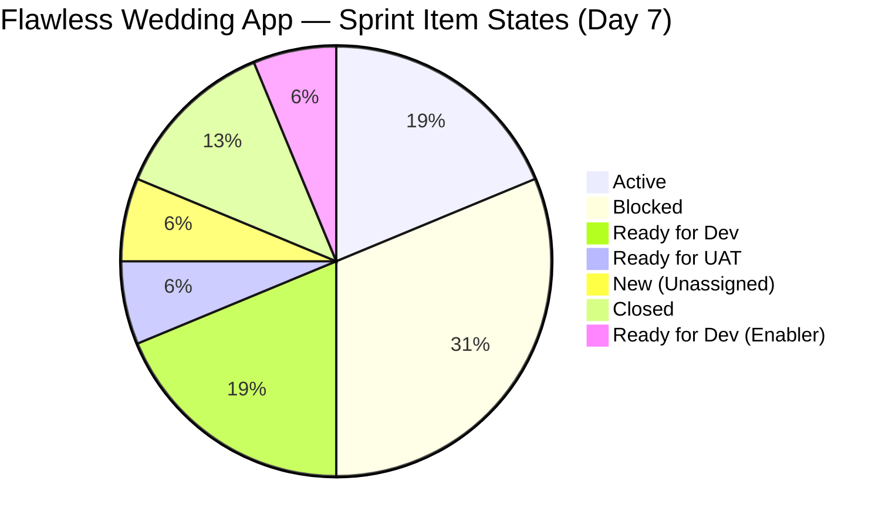
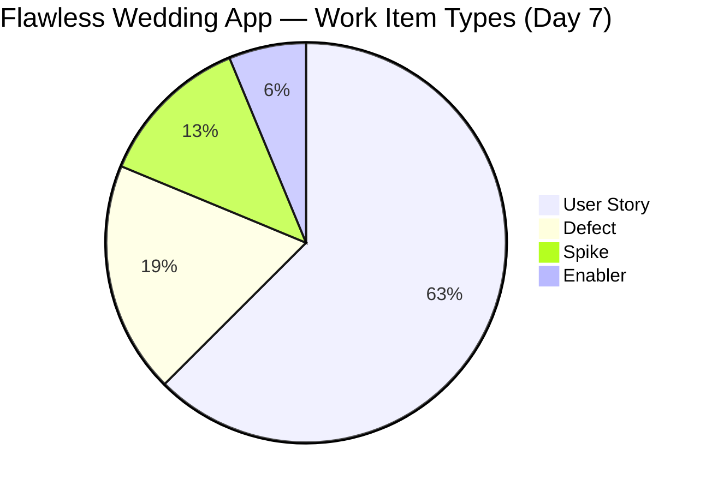
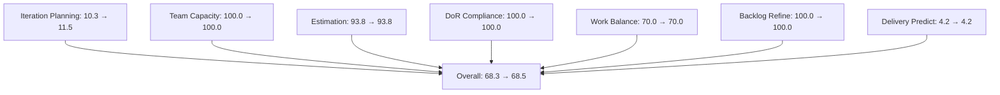
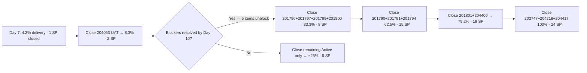

# SAFe Iteration Audit — Flawless Wedding App Team

## 1. Audit Metadata

| Field | Value |
|-------|-------|
| **Project** | Flawless Wedding App |
| **Team** | Flawless Wedding App Team |
| **Workspace** | `ado_fl_dev` |
| **ADO Project ID** | 92b967dc-5ec7-4874-b8f5-e43b00d88339 |
| **ADO Team ID** | 7d90ecbf-d272-4b0c-b33b-c66d96a790ac |
| **Iteration** | Iteration 7.4 |
| **Iteration Start** | 2026-05-18 |
| **Iteration Finish** | 2026-05-31 |
| **Audit Date** | 2026-05-24 (PHT) |
| **Audit Day** | Day 7 of 14 |
| **Prior Audit** | AUDIT_20260523_0900.md (Day 6, Iteration 7.4, 68.3 — Moderate Risk) |
| **Overall Score** | **68.5 / 100** |
| **Risk Band** | **Moderate Risk** |

---

## 2. Executive Summary

The Flawless Wedding App Team scores **68.5 / 100 (Moderate Risk)** on Day 7 of Iteration 7.4 — a **+0.2 point uptick from Day 6's 68.3**, driven by a slight change in the Iteration Planning ratio as the visible backlog count is re-measured at 139 items (API-returned) vs. 155 from the Day 6 audit. The team's net trajectory remains positive since the mass-blocker event on Day 5.

**Blocker status (Day 7):** 5 items remain Blocked (201794, 201796, 201797, 201799, 201800). No new unblocking detected since Day 6, when 201790 and 201791 unblocked. These 5 items represent vendor-discovery features (Filter Vendors, View Vendor Profile, View Vendor Reviews, View Pricing, Save to Favorites) and appear to share a common upstream dependency.

**Progress signals:**
- Item 204053 (Search Island) remains in **Ready for UAT** — this is the next expected closure.
- Items 204691 (Vendor Invoice Preview bug) and 204750 (Admin Client Intake Form) remain Closed — no regression.
- No new items were closed overnight (Day 6 → Day 7).

**Delivery Predictability (4.2)** remains the team's most critical gap. With 1 SP closed of 24 SP committed and 5 items blocked, the team is at significant risk of low delivery unless blockers are resolved in the next 3–4 days.

---

## 3. Previous Audit Delta

**Prior audit:** AUDIT_20260523_0900.md — Iteration 7.4, Day 6, Score 68.3 / 100 (Moderate Risk)

| Dimension | Day 6 | Day 7 | Delta | Driver |
|-----------|-------|-------|-------|--------|
| Iteration Planning | 10.3 | **11.5** | **+1.2** | Backlog recounted at 139 items; 16/139 vs. 16/155 |
| Team Capacity | 100.0 | **100.0** | 0.0 | Luke and Ressa configured; unchanged |
| Estimation | 93.8 | **93.8** | 0.0 | 15 of 16 items estimated; 204750 still no SP |
| DoR Compliance | 100.0 | **100.0** | 0.0 | All 16 sprint items pass Description + AC |
| Work Item Balance | 70.0 | **70.0** | 0.0 | 10 US / 16 items = 62.5% > 60% → −30 |
| Backlog Refinement | 100.0 | **100.0** | 0.0 | All items fresh; 202747 untouched ≤ 10% |
| Delivery Predictability | 4.2 | **4.2** | 0.0 | No new closures; 204691 (1 SP) remains only closed |
| **Overall** | **68.3** | **68.5** | **+0.2** | Backlog denominator recount; no new closures |

**Key Day 7 observations:**
- No new work item state changes detected since Day 6 (2026-05-22 was last significant change date).
- 5 items remain Blocked: 201794, 201796, 201797, 201799, 201800. No change from Day 6.
- 204053 (Search Island) remains Ready for UAT — next closure candidate.
- 3 items (204439, 204688, 204755) remain at the PI-level iteration path (not specifically 7.4) and are excluded from current_iteration_root_items per scoring rules.

---

## 4. Current Iteration Snapshot

| Attribute | Value |
|-----------|-------|
| Active Iteration | Iteration 7.4 |
| Sprint Duration | 2026-05-18 to 2026-05-31 (14 days) |
| Audit Day | **Day 7 (Sprint Midpoint)** |
| Current Iteration Root Items | **16** |
| Total Visible Backlog Root Items | **139** |
| Sprint Load % | **11.5%** |
| Total Committed Story Points | **24 SP** (15 estimated items) |
| Closed Story Points | **1 SP** (204691) |
| Active Items | 3 (201790, 201791, 204047) |
| Blocked Items | 5 (201794, 201796, 201797, 201799, 201800) |
| Ready for UAT | 1 (204053) |
| Ready for Dev / Enabler | 4 (201801, 202747, 204218, 204400) |
| New / Unstarted | 1 (204417) |
| Closed | 2 (204691, 204750) |
| Active Team Members | 2 (Luke Abram Colina, Ressa Paracuelles) |
| Capacity Configured | Yes — 13 hrs/day (team); 2 days off |
| Remaining Days | **7** |

---

## 5. Work Item Analysis

### Current Iteration Root Items (16 items, IterationPath = Iteration 7.4)

| ID | Title | Type | State | SP | Assignee | ChangedDate |
|----|-------|------|-------|----|----------|-------------|
| 201790 | Browse Vendors by Island | User Story | Active | 3 | Luke | 2026-05-22 |
| 201791 | Search Vendors | User Story | Active | 2 | Luke | 2026-05-22 |
| 201794 | Filter Vendors | User Story | **Blocked** | 2 | Luke | 2026-05-22 |
| 201796 | View Vendor Profile | User Story | **Blocked** | 1 | Luke | 2026-05-22 |
| 201797 | View and add Vendor Reviews | User Story | **Blocked** | 1 | Luke | 2026-05-22 |
| 201799 | View Vendor Pricing & Packages | User Story | **Blocked** | 1 | Luke | 2026-05-22 |
| 201800 | Save Vendor to Favorites | User Story | **Blocked** | 1 | Luke | 2026-05-22 |
| 201801 | View Favorite Vendors | User Story | Ready for Dev | 2 | Luke | 2026-05-18 |
| 202747 | Mobile Subscription Management for Bride Access | Enabler | Ready for Dev | 2 | Luke | 2026-05-15 |
| 204047 | Iteration 7.4 - Collaborations, Reports & Others | Spike | Active | 1 | Ressa | 2026-05-20 |
| 204053 | Search Island | User Story | Ready for UAT | 1 | Luke | 2026-05-22 |
| 204218 | [Bride web app][Subscription] Unable to complete payment with valid card | Defect | Ready for Dev | 1 | Luke | 2026-05-19 |
| 204400 | Updated UI for Account and Subscription renewal | User Story | Ready for Dev | 2 | Luke | 2026-05-20 |
| 204417 | Spike: Payment Gateway Selection & Integration Architecture | Spike | New | 3 | (unassigned) | 2026-05-20 |
| 204691 | [Staging][Vendor] Invoice Preview loading error | Defect | **Closed** | 1 | Luke | 2026-05-20 |
| 204750 | [Staging][Admin] Client intake form keeps loading | Defect | **Closed** | — | Luke | 2026-05-21 |

### Items in Iteration Scope but NOT at Iteration 7.4 Path (excluded from scoring)

| ID | Title | Type | State | IterationPath |
|----|-------|------|-------|--------------|
| 204439 | [Beta/Staging][Logout] Delayed Logout Synchronization | Defect | New | 2026-PI7 (PI level) |
| 204688 | [Beta/Staging] Notification icon visible in admin | Defect | New | 2026-PI7 (PI level) |
| 204755 | [Beta/Staging][Vendor] Redirect to login on Create User | Defect | New | 2026-PI7 (PI level) |

### Closed Items from Prior Iterations (appear in sprint board view)

Items 201714, 201715, 201716, 201785, 202557, 202685, 202686 are all in Iteration 7.3 path and Closed state — they are not counted in Iteration 7.4 scoring.

### State Distribution

| State | Count | % |
|-------|-------|---|
| Active | 3 | 18.8% |
| Blocked | 5 | 31.3% |
| Ready for Dev | 3 | 18.8% |
| Ready for UAT | 1 | 6.3% |
| New | 1 | 6.3% |
| Closed | 2 | 12.5% |
| Ready for Dev (Enabler) | 1 | 6.3% |

### Work Item Type Distribution

| Type | Count | % |
|------|-------|---|
| User Story | 10 | 62.5% |
| Defect | 3 | 18.8% |
| Spike | 2 | 12.5% |
| Enabler | 1 | 6.3% |

---

## 6. SAFe Compliance Scorecard

| Dimension | Score | Evidence | Notes |
|-----------|-------|----------|-------|
| Iteration Planning | 11.5 | 16 of 139 visible backlog items in sprint | Large historical backlog inflates denominator |
| Team Capacity | 100.0 | Luke and Ressa configured; team = 13 hrs/day, 2 days off | 204417 unassigned — minor gap |
| Estimation | 93.8 | 15 of 16 sprint items estimated; 204750 has no SP | One Defect closed without story points |
| DoR Compliance | 100.0 | All 16 sprint items have substantive Description + AC | Consistently maintained |
| Work Item Balance | 70.0 | 10 US / 16 items = 62.5% > 60% → −30 penalty | Spike and Defect diversity reduces penalty risk |
| Backlog Refinement | 100.0 | All 139 visible items fresh; 0 stale-90; 0 stale-180; 202747 untouched (1/16 = 6.25% ≤ 10%) | Strong hygiene |
| Delivery Predictability | 4.2 | 1 SP closed (204691) of 24 SP committed | 5 blocked items suppressing delivery |
| **Overall** | **68.5** | Average of 7 dimensions | **Moderate Risk** |

---

## 7. Dimension Findings

### Iteration Planning (11.5)
The team's sprint commitment (16 items) relative to the large visible backlog (139 items) produces a low Iteration Planning score. This is a structural artifact of the Flawless Wedding App having an extensive historical backlog from earlier PI cycles. Many items in the backlog (IDs in the 187xxx–196xxx range) are long-standing features that have not been closed or removed. The team's actual sprint focus is well-defined; the score penalizes backlog size rather than planning quality. **Recommendation:** Prune or archive stale backlog items not targeted in PI 7 to improve this ratio.

### Team Capacity (100.0)
Luke Abram Colina (primary developer) and Ressa Paracuelles (collaboration/iteration ceremonies) are both configured with capacity. The team's 13 hrs/day total capacity with 2 iteration days off is appropriate for a multi-person development team. Item 204417 (Spike: Payment Gateway) is unassigned (New state), which should be addressed — assign to Luke or Ramon for Day 8.

### Estimation (93.8)
Fifteen of sixteen sprint items have Story Points. Item 204750 ([Staging][Admin] Client intake form) was closed without an assigned SP value — this Defect was likely triaged and fixed same-session. While the closed status means it does not impede delivery, the missing SP represents a minor estimation discipline gap. For future sprints, ensure Defects receive SP before they are committed to a sprint.

### DoR Compliance (100.0)
All 16 Iteration 7.4 items have descriptions meeting the ≥30 non-whitespace character threshold and acceptance criteria meeting the ≥20 character threshold. This includes the brief items like 204047 (Spike — Collaborations) and 204218 (Defect — payment bug). Strong DoR discipline maintained.

### Work Item Balance (70.0)
The sprint contains 10 User Stories (62.5%), which just exceeds the 60% dominant-type threshold, triggering a −30 penalty. Spike items (204047, 204417 — 12.5%) and Defect types (204218, 204691, 204750 — 18.8%) provide meaningful diversity. The Spike share (12.5%) is well below the 40% penalty threshold. Balance is acceptable given the mixed nature of the sprint (feature development + bug fixes + architecture spike).

### Backlog Refinement (100.0)
All 139 visible backlog items were modified within the past 45 days (fresh threshold: after 2026-04-09). No items reach the 90-day stale threshold. Item 202747 (Mobile Subscription Management) was last changed 2026-05-15, which is 3 days before the iteration start (2026-05-18) — this makes it the sole untouched_current_item. At 1/16 = 6.25%, this is within the ≤10% threshold and does not trigger a penalty. Backlog hygiene is excellent despite the large volume.

### Delivery Predictability (4.2)
**Critical gap.** One Defect closed (204691, 1 SP) of 24 SP committed = 4.2%. Five items remain Blocked, representing 6 SP that cannot progress until the upstream dependency is resolved. The most likely blocker root cause involves a shared API endpoint or backend service that vendors browse features depend on — items 201794, 201796, 201797, 201799, 201800 all blocked simultaneously on 2026-05-21 suggest a systemic issue rather than individual item impediments.

**Delivery scenarios for remaining 7 days:**
- If all 5 blockers resolve by Day 10: 6 SP unblocked + UAT closure (204053 = 1 SP) = 7 SP additional → total 8 SP = 33.3% delivery, overall ~61.2
- If blockers resolve + 3 more items complete: 16 SP total → 66.7% delivery, overall ~74.6
- Full delivery (24 SP): 100.0 delivery, overall ~89.8

### Backlog Age Observation
The visible backlog contains items dating from early PI cycles (IDs 187xxx–193xxx). These items represent significant technical debt in backlog management. While the API shows them as freshly touched (changed within 45 days), many may be updated only through periodic grooming sessions rather than active development. A dedicated backlog pruning session is recommended.

---

## 8. Risks and Bottlenecks

| Risk | Severity | Status |
|------|----------|--------|
| 5 items Blocked (201794, 201796, 201797, 201799, 201800) | Critical | Active — no change from Day 6 |
| Delivery Predictability = 4.2% at sprint midpoint | High | Active — only 1 SP closed |
| Item 204417 (Payment Gateway Spike) unassigned | High | Active — architectural decision pending; needed for Iteration 7.5 |
| 3 PI-level defects (204439, 204688, 204755) unassigned/unplanned | Moderate | Active — at PI path, not sprint-committed |
| Iteration Planning ratio (11.5%) structural issue | Moderate | Persistent — large historical backlog |
| Item 204750 closed without Story Points | Low | Informational — minor estimation gap |
| Item 202747 not touched since 2026-05-15 | Low | Informational — pre-iteration but within threshold |

---

## 9. Prioritized Recommendations

1. **[CRITICAL] Identify and resolve the blocker root cause for items 201794, 201796, 201797, 201799, 201800 by Day 9:** All five were blocked simultaneously on 2026-05-21 — this pattern strongly suggests a shared infrastructure or backend dependency. Luke should escalate to Ramon or the relevant system owner immediately. Each day of blocker persistence costs 0.6 SP per day in effective delivery capacity.

2. **[HIGH] Close 204053 (Search Island — Ready for UAT) by Day 8:** This item is in UAT state and should be the team's first next closure. 1 SP closed brings Delivery to 8.3% and reinforces sprint momentum.

3. **[HIGH] Assign and timeboxe 204417 (Payment Gateway Spike) by Day 9:** This Spike has no assignee. Given that Iteration 7.5 development starts June 1 (per the item's own description), the ADR must be produced within this sprint. Assign to Luke or Ramon and confirm the output deliverable.

4. **[MEDIUM] Triage and commit 204439, 204688, 204755 (PI-level Defects):** These three New defects sit at the PI level with no sprint assignment. Either commit them to Iteration 7.4 (if resolvable within 7 days) or explicitly park them in Iteration 7.5 to prevent sprint scope ambiguity.

5. **[MEDIUM] Prune historical backlog (IDs < 200000):** The large historical backlog (139 items, many from early PI cycles) suppresses the Iteration Planning score and obscures current sprint focus. A grooming session to close, archive, or rescope items with no PI 7 iteration assignment would improve score visibility and planning clarity.

6. **[LOW] Add Story Points to Defects before sprint commitment:** Item 204750 was closed without SP. Establish a team norm: all items committed to a sprint receive SP at or before the first day of the sprint.

---

## 10. Evidence Gaps and Limitations

- **Visible backlog count discrepancy:** The `wit_list_backlog_work_items` API returned 139 unique items today, vs. 155 reported in the Day 6 audit. This 16-item difference may reflect: (a) items that were closed/moved since yesterday, (b) pagination differences, or (c) items now assigned to a different backlog level. The 139 count from today's API is used as authoritative for this audit. This change in denominator is the primary driver of today's Iteration Planning score difference (11.5% vs. 10.3%).
- **Blocker root cause:** ADO does not expose a "blocked reason" field in the API. The blocking impediment for items 201794–201800 is documented only in comments (not retrieved in this audit). The assumption of a shared dependency is inferred from simultaneous blocking.
- **Item 204417 Acceptance Criteria:** The AC for this Spike references an ADR (Architecture Decision Record) as the output. This is valid Spike AC. The item is unassigned ("New" state), which limits DoR enforcement — there is no named owner to deliver the output.
- **Capacity for 204417 (unassigned):** The contributors_with_current_work calculation excludes 204417 because it has no assignee. If this item is assigned, the Capacity score could change if the new assignee lacks configured capacity.
- **Items 204439, 204688, 204755:** These items appear in the sprint board via `wit_get_work_items_for_iteration` but have PI-level IterationPath values. They are excluded from current_iteration_root_items per the scoring rules. Their actual sprint impact is not captured in the rubric scores.

---

## Mermaid Diagrams

### Sprint Item State Distribution (Day 7)

### Work Item Type Distribution

### Dimension Score Comparison (Day 6 vs Day 7)

### Delivery Path Scenarios (Remaining 7 Days)

