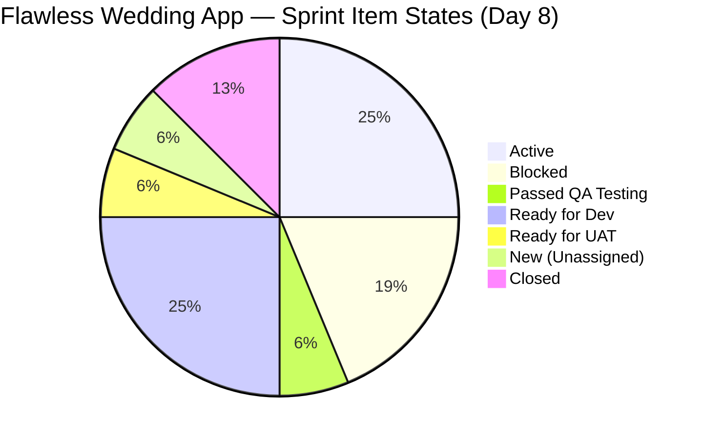
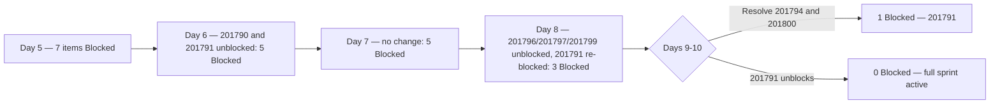
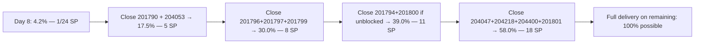
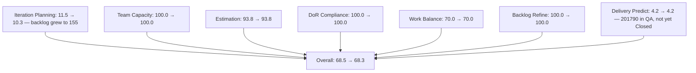

# SAFe Iteration Audit — Flawless Wedding App Team

## 1. Audit Metadata

| Field | Value |
|-------|-------|
| **Project** | Flawless Wedding App |
| **Team** | Flawless Wedding App Team |
| **Workspace** | `ado_fl_dev` |
| **ADO Project ID** | 92b967dc-5ec7-4874-b8f5-e43b00d88339 |
| **ADO Team ID** | 7d90ecbf-d272-4b0c-b33b-c66d96a790ac |
| **Iteration** | Iteration 7.4 |
| **Iteration Start** | 2026-05-18 |
| **Iteration Finish** | 2026-05-31 |
| **Audit Date** | 2026-05-25 (PHT) |
| **Audit Day** | Day 8 of 14 |
| **Prior Audit** | AUDIT_20260524_0203.md (Day 7, Iteration 7.4, 68.5 — Moderate Risk) |
| **Overall Score** | **68.3 / 100** |
| **Risk Band** | **Moderate Risk** |

---

## 2. Executive Summary

The Flawless Wedding App Team scores **68.3 / 100 (Moderate Risk)** on Day 8 of Iteration 7.4 — a **-0.2 point decrease from Day 7's 68.5**, driven primarily by the expanded visible backlog (155 items vs. 139), which reduces the Iteration Planning ratio.

**Day 8 blocker resolution (partial):** Three items that were Blocked on Day 7 — **201796** (View Vendor Profile), **201797** (View and add Vendor Reviews), and **201799** (View Vendor Pricing & Packages) — are now **Active** as of 2026-05-25. This is a positive signal indicating the shared backend dependency may be resolving. However, **201791** (Search Vendors) transitioned from Active to **Blocked** on 2026-05-25, representing a new impediment. Net blocked count: reduced from 5 to 3 items (201791, 201794, 201800).

**Near-closure:** Item **201790** (Browse Vendors by Island) advanced to **"Passed QA Testing"** state on 2026-05-25. This is the next expected closure — one QA approval away from Done.

**Backlog expansion:** Eight new User Story items (204932, 204934, 204935, 204936, 204938, 204939, 204940, 204944) were added to the visible backlog on 2026-05-25, all assigned to Iteration 7.5 or 7.6. These reflect active Iteration 7.5 planning work but expand the visible backlog denominator from 139 to 155, reducing the Iteration Planning score.

**Delivery Predictability (4.2)** remains the team's critical gap. Item 201790 is one state transition from closure. If it closes today, Delivery rises to 17.5% (1 + 3 SP = 4 SP / 24 SP) and the overall score improves to ~72.6.

---

## 3. Previous Audit Delta

**Prior audit:** AUDIT_20260524_0203.md — Iteration 7.4, Day 7, Score 68.5 / 100 (Moderate Risk)

| Dimension | Day 7 | Day 8 | Delta | Driver |
|-----------|-------|-------|-------|--------|
| Iteration Planning | 11.5 | **10.3** | **-1.2** | Backlog expanded: 155 items vs. 139; 16/155 |
| Team Capacity | 100.0 | **100.0** | 0.0 | Luke and Ressa configured; unchanged |
| Estimation | 93.8 | **93.8** | 0.0 | 15/16 sprint items estimated; 204750 still no SP |
| DoR Compliance | 100.0 | **100.0** | 0.0 | All 16 sprint items pass Description + AC |
| Work Item Balance | 70.0 | **70.0** | 0.0 | 10 US / 16 = 62.5% > 60% → -30 |
| Backlog Refinement | 100.0 | **100.0** | 0.0 | All items fresh; new items added 2026-05-25 |
| Delivery Predictability | 4.2 | **4.2** | 0.0 | No new Closed/Done items; 204691 still only closure |
| **Overall** | **68.5** | **68.3** | **-0.2** | Backlog expansion reduces IP ratio |

**Key Day 8 observations:**
- **Partial blocker resolution:** 201796, 201797, 201799 unblocked → Active as of early 2026-05-25.
- **New blocker:** 201791 (Search Vendors) moved from Active → Blocked (2026-05-25T06:07).
- **201790** (Browse Vendors by Island) advanced to "Passed QA Testing" — close candidate.
- **8 new items** added to visible backlog (all Iteration 7.5 or 7.6 scope) — active sprint planning underway.
- **Spike 204417** (Payment Gateway Selection) remains New / unassigned — now Day 8 without owner.

---

## 4. Current Iteration Snapshot

| Attribute | Value |
|-----------|-------|
| Active Iteration | Iteration 7.4 |
| Sprint Duration | 2026-05-18 to 2026-05-31 (14 days) |
| Audit Day | **Day 8 of 14** |
| Current Iteration Root Items | **16** |
| Total Visible Backlog Root Items | **155** |
| Sprint Load % | **10.3%** |
| Total Committed Story Points | **24 SP** (15 estimated items) |
| Closed Story Points | **1 SP** (204691) |
| Active Items | 4 (201796, 201797, 201799, 204047) |
| Blocked Items | 3 (201791, 201794, 201800) |
| Passed QA Testing | 1 (201790) — near-closure |
| Ready for Dev / Enabler | 3 (201801, 202747, 204218) |
| Ready for Dev (User Story) | 1 (204400) |
| New / Unstarted | 1 (204417) |
| Closed | 2 (204691, 204750) |
| Active Team Members | 2 (Luke Abram Colina, Ressa Paracuelles) |
| Capacity Configured | Yes — 13 hrs/day (team); 2 days off |
| Remaining Days | **6** |

---

## 5. Work Item Analysis

### Current Iteration Root Items (16 items, IterationPath = Iteration 7.4)

| ID | Title | Type | State | SP | Assignee | ChangedDate |
|----|-------|------|-------|----|----------|-------------|
| 201790 | Browse Vendors by Island | User Story | **Passed QA Testing** | 3 | Luke | 2026-05-25 |
| 201791 | Search Vendors | User Story | **Blocked** | 2 | Luke | 2026-05-25 |
| 201794 | Filter Vendors | User Story | Blocked | 2 | Luke | 2026-05-25 |
| 201796 | View Vendor Profile | User Story | **Active** | 1 | Luke | 2026-05-25 |
| 201797 | View and add Vendor Reviews | User Story | **Active** | 1 | Luke | 2026-05-25 |
| 201799 | View Vendor Pricing & Packages | User Story | **Active** | 1 | Luke | 2026-05-25 |
| 201800 | Save Vendor to Favorites | User Story | Blocked | 1 | Luke | 2026-05-22 |
| 201801 | View Favorite Vendors | User Story | Ready for Dev | 2 | Luke | 2026-05-18 |
| 202747 | Mobile Subscription Management for Bride Access | Enabler | Ready for Dev | 2 | Luke | 2026-05-15 |
| 204047 | Iteration 7.4 - Collaborations, Reports & Others | Spike | Active | 1 | Ressa | 2026-05-20 |
| 204053 | Search Island | User Story | Ready for UAT | 1 | Luke | 2026-05-22 |
| 204218 | [Bride web app] [Subscription Payment] Unable to complete subscription payment | Defect | Ready for Dev | 1 | Luke | 2026-05-19 |
| 204400 | Updated UI for Account and Subscription renewal | User Story | Ready for Dev | 2 | Luke | 2026-05-20 |
| 204417 | Spike: Payment Gateway Selection & Integration Architecture | Spike | New | 3 | (unassigned) | 2026-05-20 |
| 204691 | [Staging][Vendor] Invoice Preview loading error | Defect | Closed | 1 | Luke | 2026-05-20 |
| 204750 | [Staging][Admin] Client intake form keeps loading | Defect | Closed | — | Luke | 2026-05-21 |

### Blocker Status Changes (Day 7 → Day 8)

| ID | Title | Day 7 State | Day 8 State | Change |
|----|-------|------------|------------|--------|
| 201790 | Browse Vendors by Island | Active | Passed QA Testing | Positive — near closure |
| 201791 | Search Vendors | Active | **Blocked** | Regression — new blocker |
| 201794 | Filter Vendors | Blocked | Blocked | Unchanged |
| 201796 | View Vendor Profile | Blocked | **Active** | Resolved — unblocked |
| 201797 | View and add Vendor Reviews | Blocked | **Active** | Resolved — unblocked |
| 201799 | View Vendor Pricing & Packages | Blocked | **Active** | Resolved — unblocked |
| 201800 | Save Vendor to Favorites | Blocked | Blocked | Unchanged |

### State Distribution (16 current iteration items)

| State | Count | % |
|-------|-------|---|
| Active | 4 | 25.0% |
| Blocked | 3 | 18.8% |
| Passed QA Testing | 1 | 6.3% |
| Ready for Dev | 4 | 25.0% |
| Ready for UAT | 1 | 6.3% |
| New (Unassigned) | 1 | 6.3% |
| Closed | 2 | 12.5% |

### Work Item Type Distribution

| Type | Count | % |
|------|-------|---|
| User Story | 10 | 62.5% |
| Defect | 3 | 18.8% |
| Spike | 2 | 12.5% |
| Enabler | 1 | 6.3% |

### New Backlog Items Added Day 8 (Iteration 7.5 / 7.6 scope — not in scoring)

| ID | Title | Type | State | Iteration |
|----|-------|------|-------|-----------|
| 204932 | Update Landing Page CTA Wording | User Story | Estimation | 7.5 |
| 204934 | Remove "Best Value" Badge from Single Subscription Package | User Story | Estimation | 7.5 |
| 204935 | Remove Non-Functional Three-Dot UI Elements | User Story | Estimation | 7.5 |
| 204936 | Update Budget Currency Label | User Story | Estimation | 7.5 |
| 204938 | Add Email Field and Update Required Fields for Existing Vendors | User Story | Estimation | 7.5 |
| 204939 | Update Subscription Renewal Notification Messaging | User Story | Estimation | 7.5 |
| 204940 | Implement Subscription Reminder Frequency | User Story | Estimation | 7.5 |
| 204944 | Manage Booking Payments | User Story | New | 7.6 IP |

---

## 6. SAFe Compliance Scorecard

| Dimension | Score | Evidence | Notes |
|-----------|-------|----------|-------|
| Iteration Planning | 10.3 | 16 of 155 visible backlog items in sprint | Backlog grew to 155 with 8 new 7.5/7.6 items; structural artifact |
| Team Capacity | 100.0 | Luke and Ressa configured; 13 hrs/day, 2 days off | 204417 still unassigned — minor gap |
| Estimation | 93.8 | 15 of 16 sprint items estimated; 204750 has no SP | One Closed Defect without story points |
| DoR Compliance | 100.0 | All 16 sprint items have Description ≥ 30 chars + AC ≥ 20 chars | Maintained through Day 8 |
| Work Item Balance | 70.0 | 10 US / 16 items = 62.5% > 60% → -30 | Spike 12.5% < 40%; no additional penalty |
| Backlog Refinement | 100.0 | All 155 visible items fresh (changed ≥ 2026-04-10); 0 stale-90; 0 stale-180; 202747 untouched = 1/16 = 6.25% ≤ 10% | New items all added 2026-05-25 |
| Delivery Predictability | 4.2 | 1 SP closed (204691) of 24 SP committed; 201790 in Passed QA not yet Closed | 201790 (3 SP) is one transition from closure |
| **Overall** | **68.3** | Average of 7 dimensions | **Moderate Risk** |

---

## 7. Dimension Findings

### Iteration Planning (10.3)
Eight new items were added to the visible backlog on 2026-05-25 (204932–204944), all assigned to Iteration 7.5 or 7.6. This active sprint pre-planning is a positive forward-planning signal but expands the denominator from 139 to 155, lowering the Iteration Planning ratio from 11.5% to 10.3%. The sprint commitment (16 items) is unchanged. The team's low Iteration Planning score remains a structural artifact of maintaining a large historical backlog alongside an active current sprint.

### Team Capacity (100.0)
Luke Abram Colina and Ressa Paracuelles remain configured with capacity (13 hrs/day combined, 2 days off). Item 204417 (Payment Gateway Spike) remains unassigned through Day 8 — this is now at risk of being left incomplete at sprint close. If this Spike is not assigned by Day 9, it should either be moved to Iteration 7.5 or explicitly owned by Ramon as PO-level research.

### Estimation (93.8)
Fifteen of sixteen sprint items have Story Points. Item 204750 (Closed Defect) has no SP — an informational gap that does not affect delivery since the item is closed. The new items added to 7.5 (204932–204940) are in "Estimation" state, indicating active pointing sessions are underway for the next sprint.

### DoR Compliance (100.0)
All 16 Iteration 7.4 items maintain compliant descriptions and acceptance criteria. The new 7.5 items (in Estimation state) are not yet in scope for DoR scoring. The team's consistency in maintaining DoR across sprint items is notable.

### Work Item Balance (70.0)
Sprint composition unchanged: 10 US (62.5%), 3 Defects, 2 Spikes, 1 Enabler. The User Story dominant share just above the 60% threshold triggers the -30 penalty. Spike share (12.5%) is well within bounds. No structural change from Day 7.

### Backlog Refinement (100.0)
All 155 visible backlog items were modified within the 45-day fresh window (since 2026-04-10). The 8 new items added today are all freshly created. No items cross the 90-day stale threshold. Item 202747 (changed 2026-05-15, 3 days before sprint start) remains the sole untouched_current item at 6.25% — within the 10% threshold. This dimension remains at full score.

### Delivery Predictability (4.2)
Only one item is Closed (204691, 1 SP) of 24 SP committed = 4.2%. This score has held since Day 5. The critical development is item 201790 reaching "Passed QA Testing" state — it is one approval step from Closed. Closing it today adds 3 SP, raising Delivery to 17.5% (4 SP / 24 SP) and pushing overall to approximately 72.6 (still Moderate Risk but 4.3 points higher).

The partial blocker resolution (201796, 201797, 201799 now Active) opens significant delivery potential in the remaining 6 days. If all three items close this week (3 SP), combined with 201790 (3 SP) and 204053/204691's existing contribution:
- Current: 1 SP
- 201790 closes: 4 SP (17.5%)
- 201796 + 201797 + 201799 close: 7 SP (29.2%)
- Additional 2 items close: 11+ SP (45%+)

### Backlog Expansion Analysis
The team added 8 new items to Iteration 7.5 (7 UI/product fixes + 1 subscription feature) on 2026-05-25. These items are in "Estimation" state, reflecting active sprint planning. This forward momentum is positive. Item 204944 (Manage Booking Payments, Iteration 7.6 IP) is aligned to the Payment Gateway Spike (204417) output — confirming the ADR is needed to define this story.

---

## 8. Risks and Bottlenecks

| Risk | Severity | Status |
|------|----------|--------|
| 3 items still Blocked (201791, 201794, 201800) | High | Active — 201791 newly blocked Day 8 |
| Delivery Predictability = 4.2% with 6 days remaining | High | Active — 201790 one step from first major closure |
| Item 204417 (Payment Gateway Spike) unassigned — Day 8 | High | Active — blocks 7.5 booking payment stories |
| 201791 newly blocked — suggests cascading API issue | High | New Day 8 — regression from Active to Blocked |
| 204053 (Search Island) still in Ready for UAT — Day 8 | Moderate | Active — should have closed by now |
| 8 new 7.5 items added but Spike output not yet produced | Moderate | Planning risk — 204944 depends on 204417 ADR |
| 3 PI-level defects (204439, 204688, 204755) unassigned | Moderate | Persistent — not sprint-committed |
| Backlog at 155 items — structural planning score penalty | Low | Structural — pruning recommended |

---

## 9. Prioritized Recommendations

1. **[CRITICAL] Approve item 201790 (Browse Vendors by Island — Passed QA Testing) today:** This item is one state transition from Closed. Luke should confirm QA sign-off and move to Done immediately. Closing a 3 SP item lifts Delivery from 4.2% to 17.5% and raises the overall score to ~72.6.

2. **[CRITICAL] Investigate and resolve new blocker on 201791 (Search Vendors):** This item regressed from Active to Blocked on Day 8 (2026-05-25T06:07). The timing — while 201796/201797/201799 were being unblocked — suggests the same shared API issue may have shifted. Luke and/or Ramon should identify the blocker root cause and document it in the ADO comments.

3. **[HIGH] Assign item 204417 (Payment Gateway Spike) immediately — Day 8 is the last safe day:** This Spike must produce an ADR before Iteration 7.5 starts June 1. With 6 days remaining and 0 progress, assigning to Luke or Ramon today and setting a Day 10 target output is the minimum required action. Item 204944 (Manage Booking Payments in 7.6) depends on this Spike's output.

4. **[HIGH] Close 204053 (Search Island — Ready for UAT) by Day 9:** This item has been in UAT state since at least Day 6. There is no dependency blocking it. UAT validation should be completable in a single session. Closing adds 1 SP (total = 2 SP without 201790, or 5 SP if 201790 also closes).

5. **[MEDIUM] Resolve remaining blockers (201794, 201800) by Day 10:** If the unblocking pattern from 201796/201797/201799 continues, 201794 and 201800 may unblock with the same fix. Confirm the shared dependency status with Luke.

6. **[MEDIUM] Assign and triage 204439, 204688, 204755 (PI-level Defects):** Three New defects at the PI level remain without sprint assignment. Decide by Day 9 whether to commit them to 7.4 (if fixable in 6 days) or explicitly park them in 7.5.

7. **[LOW] Prune historical backlog to improve Iteration Planning score:** The 155-item backlog includes many items from early PI cycles (IDs in the 187xxx–196xxx range) that are not targeted in PI 7. A grooming session to close or archive these items would raise the planning score and improve sprint focus visibility.

---

## 10. Evidence Gaps and Limitations

- **Blocker root cause:** ADO does not expose a "blocked reason" field in the API. The simultaneous unblocking of 201796/201797/201799 and the new blocking of 201791 suggests a partially resolved shared dependency. The exact nature of the blocker requires review of ADO comments (not retrieved in this audit).
- **Item 201790 "Passed QA Testing":** This state is not Closed or Done per the rubric, so it does not contribute to closed_story_points. Once this item moves to a Closed/Done state, Delivery Predictability will improve to 17.5%. The score reported (4.2%) reflects the literal current state.
- **New 7.5 items DoR:** Items 204932–204940 are in "Estimation" state and not yet committed to the current sprint. Their DoR compliance is not evaluated in this audit. They should be reviewed for Description and AC before sprint commitment.
- **Item 204944** (Manage Booking Payments, 7.6 IP) has no SP and no Description/AC in the retrieved data — it appears to be a placeholder. DoR should be completed before it progresses to sprint commitment.
- **Visible backlog count:** The backlog API returned 155 items today, up from 139 on Day 7. The 16-item increase is fully accounted for by the 8 new items confirmed in the batch call (all 7.5/7.6 path). The 155 count is used as authoritative for this audit.

---

## Mermaid Diagrams

### Sprint Item State Distribution (Day 8)

### Blocker Resolution Timeline

### Delivery Path Scenarios (6 Days Remaining)

### SAFe Dimension Scores (Day 8 vs Day 7)

