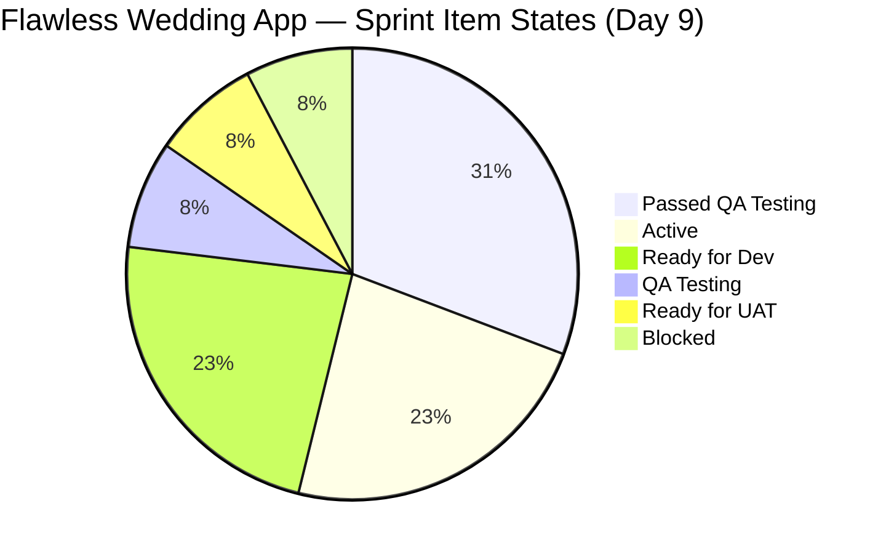
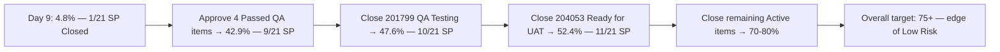
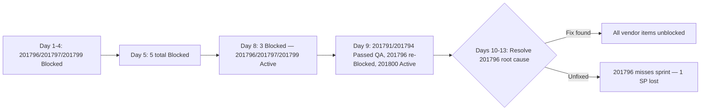
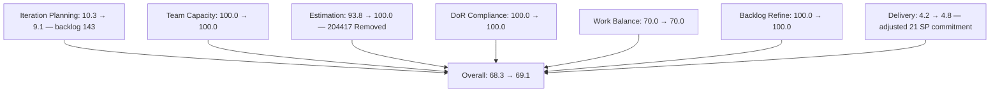
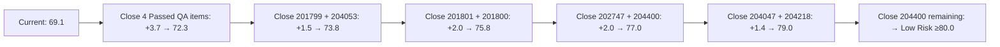

# SAFe Iteration Audit — Flawless Wedding App Team

## 1. Audit Metadata

| Field | Value |
|-------|-------|
| **Project** | Flawless Wedding App |
| **Team** | Flawless Wedding App Team |
| **Workspace** | `ado_fl_dev` |
| **ADO Project ID** | 92b967dc-5ec7-4874-b8f5-e43b00d88339 |
| **ADO Team ID** | 7d90ecbf-d272-4b0c-b33b-c66d96a790ac |
| **Iteration** | Iteration 7.4 |
| **Iteration Start** | 2026-05-18 |
| **Iteration Finish** | 2026-05-31 |
| **Audit Date** | 2026-05-26 (PHT) |
| **Audit Day** | Day 9 of 14 |
| **Prior Audit** | AUDIT_20260525_0900.md (Day 8, Iteration 7.4, 68.3 — Moderate Risk) |
| **Overall Score** | **69.1 / 100** |
| **Risk Band** | **Moderate Risk** |

---

## 2. Executive Summary

The Flawless Wedding App Team scores **69.1 / 100 (Moderate Risk)** on Day 9 of Iteration 7.4 — a **+0.8 point improvement from Day 8's 68.3**, driven by significant state advances in the QA pipeline and a key sprint cleanup action.

**Major Day 9 developments:**

1. **Payment Gateway Spike (204417) removed from sprint:** Item 204417 was transitioned to "Removed" state on 2026-05-26T02:23 UTC, dropping it from the sprint backlog. The Sprint commitment is reduced from 24 SP to 21 SP (net of closed items). This cleans up the unresolved dependency issue that had been flagged since Day 5.

2. **Mass QA progression — 4 items in "Passed QA Testing":** Items 201790 (Browse Vendors by Island), 201791 (Search Vendors), 201794 (Filter Vendors), and 201797 (View and add Vendor Reviews) are all in "Passed QA Testing" state as of today. These 4 items represent 8 SP. If approved and closed today or tomorrow, Delivery Predictability would jump from 4.8% to approximately 47.6% (10/21 SP), pushing overall from 69.1 to ~76.5.

3. **201799 (View Vendor Pricing & Packages) now in QA Testing** — one state behind Passed QA Testing. Progressing.

4. **201796 (View Vendor Profile) reverted to Blocked** — regressed from Active to Blocked at 2026-05-26T04:04. This is the third time this item has been blocked this sprint. A persistent backend dependency is suspected.

5. **201800 (Save Vendor to Favorites) unblocked** — moved from Blocked to Active at 2026-05-26T06:24. Progress after multiple days stuck.

6. **Defects 204439, 204688, 204755 moved to Iteration 7.5** — all transitioned to "Estimation" state, confirming they are scoped for the next sprint rather than current.

**Score driver:** Delivery Predictability improved marginally (4.8% based on 1 SP closed of adjusted 21 SP committed). The 4 items in "Passed QA Testing" have not yet crossed the Closed/Done threshold. This creates an imminent score improvement opportunity — each closure is a real and immediate delta.

---

## 3. Previous Audit Delta

**Prior audit:** AUDIT_20260525_0900.md — Iteration 7.4, Day 8, Score 68.3 / 100 (Moderate Risk)

| Dimension | Day 8 | Day 9 | Delta | Driver |
|-----------|-------|-------|-------|--------|
| Iteration Planning | 10.3 | **9.1** | **-1.2** | Backlog: 143 items (204417 removed, closed items dropped); 13/143 |
| Team Capacity | 100.0 | **100.0** | 0.0 | Luke and Ressa configured; 13 hrs/day |
| Estimation | 93.8 | **100.0** | **+6.2** | 204417 removed; all 13 open sprint items now have SP |
| DoR Compliance | 100.0 | **100.0** | 0.0 | All 13 open sprint items pass Description + AC |
| Work Item Balance | 70.0 | **70.0** | 0.0 | 10 US / 13 = 76.9% > 60% → -30; no add'l penalty |
| Backlog Refinement | 100.0 | **100.0** | 0.0 | All 143 visible items fresh; 202747 untouched = 7.7% ≤ 10% |
| Delivery Predictability | 4.2 | **4.8** | **+0.6** | Adjusted commitment: 21 SP (204417 removed); 1 SP closed |
| **Overall** | **68.3** | **69.1** | **+0.8** | Estimation improvement + adjusted delivery ratio |

**Key Day 9 observations:**
- **204417 (Payment Gateway Spike)** transitioned to "Removed" at 2026-05-26T02:23 — dropped from sprint backlog; commitment reduced by 3 SP.
- **201790 (Browse Vendors by Island)** remains in "Passed QA Testing" — awaiting final approval for closure (previously in this state since Day 8).
- **201791 (Search Vendors)** advanced to "Passed QA Testing" as of 2026-05-26T05:44 — was Blocked yesterday.
- **201794 (Filter Vendors)** advanced to "Passed QA Testing" as of 2026-05-26T05:45 — was Blocked yesterday.
- **201797 (View and add Vendor Reviews)** advanced to "Passed QA Testing" as of 2026-05-26T08:37 — was Active yesterday.
- **201799 (View Vendor Pricing & Packages)** advanced to "QA Testing" as of 2026-05-26T08:02 — was Active yesterday.
- **201796 (View Vendor Profile)** regressed to "Blocked" at 2026-05-26T04:04 — was Active yesterday.
- **201800 (Save Vendor to Favorites)** unblocked → Active at 2026-05-26T06:24.
- **201801 (View Favorite Vendors)** changed to Active at 2026-05-26T01:51.
- **204439, 204688, 204755** moved to Iteration 7.5 in "Estimation" state.

---

## 4. Current Iteration Snapshot

| Attribute | Value |
|-----------|-------|
| Active Iteration | Iteration 7.4 |
| Sprint Duration | 2026-05-18 to 2026-05-31 (14 days) |
| Audit Day | **Day 9 of 14** |
| Current Iteration Root Items (visible backlog) | **13** |
| Total Visible Backlog Root Items | **143** |
| Sprint Load % | **9.1%** |
| Adjusted Committed Story Points | **21 SP** (15 items at sprint start minus 204417 Removed = 3 SP) |
| Closed Story Points | **1 SP** (204691 only) |
| Passed QA Testing | 4 (201790, 201791, 201794, 201797) — 8 SP — near-closure |
| QA Testing | 1 (201799) — 1 SP |
| Active | 3 (201800, 201801, 204047) |
| Blocked | 1 (201796) |
| Ready for UAT | 1 (204053) |
| Ready for Dev | 3 (202747, 204218, 204400) |
| Closed | 2 (204691, 204750) — removed from backlog API |
| Removed | 1 (204417) — removed from backlog API |
| Active Team Members | 2 (Luke Abram Colina, Ressa Paracuelles) |
| Capacity Configured | Yes — 13 hrs/day (team); 2 days off |
| Remaining Days | **5** |

---

## 5. Work Item Analysis

### Current Iteration Root Items — Open in Backlog (13 items)

| ID | Title | Type | State | SP | Assignee | ChangedDate |
|----|-------|------|-------|----|----------|-------------|
| 201790 | Browse Vendors by Island | User Story | **Passed QA Testing** | 3 | Luke | 2026-05-25 |
| 201791 | Search Vendors | User Story | **Passed QA Testing** | 2 | Luke | **2026-05-26** |
| 201794 | Filter Vendors | User Story | **Passed QA Testing** | 2 | Luke | **2026-05-26** |
| 201796 | View Vendor Profile | User Story | **Blocked** | 1 | Luke | **2026-05-26** |
| 201797 | View and add Vendor Reviews | User Story | **Passed QA Testing** | 1 | Luke | **2026-05-26** |
| 201799 | View Vendor Pricing & Packages | User Story | **QA Testing** | 1 | Luke | **2026-05-26** |
| 201800 | Save Vendor to Favorites | User Story | **Active** | 1 | Luke | **2026-05-26** |
| 201801 | View Favorite Vendors | User Story | **Active** | 2 | Luke | **2026-05-26** |
| 202747 | Mobile Subscription Management for Bride Access | Enabler | Ready for Dev | 2 | Luke | 2026-05-15 |
| 204047 | Iteration 7.4 - Collaborations, Reports & Others | Spike | Active | 1 | Ressa | 2026-05-20 |
| 204053 | Search Island | User Story | Ready for UAT | 1 | Luke | 2026-05-22 |
| 204218 | [Bride web app] [Subscription Payment] Unable to complete subscription payment | Defect | Ready for Dev | 1 | Luke | 2026-05-19 |
| 204400 | Updated UI for Account and Subscription renewal | User Story | Ready for Dev | 2 | Luke | 2026-05-20 |

### Closed / Removed from Backlog API

| ID | Title | Type | State | SP | Notes |
|----|-------|------|-------|----|-------|
| 204691 | Invoice Preview keeps loading... | Defect | Closed | 1 | Closed Day 3 (2026-05-20) |
| 204750 | Admin Client intake form keeps loading | Defect | Closed | 0 | Closed Day 4 (2026-05-21); no SP |
| 204417 | Spike: Payment Gateway Selection & Integration Architecture | Spike | **Removed** | 3 | Removed Day 9 (2026-05-26T02:23) |

### State Distribution (13 open backlog items)

| State | Count | % |
|-------|-------|---|
| Passed QA Testing | 4 | 30.8% |
| Active | 3 | 23.1% |
| QA Testing | 1 | 7.7% |
| Ready for UAT | 1 | 7.7% |
| Ready for Dev | 3 | 23.1% |
| Blocked | 1 | 7.7% |

### Work Item Type Distribution (13 open items)

| Type | Count | % |
|------|-------|---|
| User Story | 10 | 76.9% |
| Defect | 1 | 7.7% |
| Spike | 1 | 7.7% |
| Enabler | 1 | 7.7% |

### QA Pipeline Status (Day 9)

| ID | Title | State | SP | Notes |
|----|-------|-------|----|-------|
| 201790 | Browse Vendors by Island | Passed QA Testing | 3 | Awaiting final approval — Day 2 in this state |
| 201791 | Search Vendors | Passed QA Testing | 2 | Just entered today (05-26T05:44) |
| 201794 | Filter Vendors | Passed QA Testing | 2 | Just entered today (05-26T05:45) |
| 201797 | View and add Vendor Reviews | Passed QA Testing | 1 | Just entered today (05-26T08:37) |
| 201799 | View Vendor Pricing & Packages | QA Testing | 1 | One step behind Passed |
| **Total** | | | **9 SP** | In QA or Passed QA — potential rapid closure |

### Defects Moved to Iteration 7.5 (Day 9)

| ID | Title | Type | State | SP | Iteration |
|----|-------|------|-------|----|-----------|
| 204439 | Delayed Logout Synchronization | Defect | Estimation | 2 | 7.5 |
| 204688 | Notification icon visible in admin | Defect | Estimation | 1 | 7.5 |
| 204755 | User redirected to login after Create User | Defect | Estimation | 1 | 7.5 |

---

## 6. SAFe Compliance Scorecard

| Dimension | Score | Evidence | Notes |
|-----------|-------|----------|-------|
| Iteration Planning | 9.1 | 13 of 143 visible backlog items in sprint | 204417 removed; 204691/204750 closed; structural backlog artifact |
| Team Capacity | 100.0 | Luke and Ressa configured; 13 hrs/day, 2 days off | 204417 removed — unassigned risk resolved |
| Estimation | 100.0 | All 13 open sprint items have SP > 0 | 204417 Removed eliminated the SP gap |
| DoR Compliance | 100.0 | All 13 sprint items have Description ≥ 30 chars + AC ≥ 20 chars | Maintained through Day 9 |
| Work Item Balance | 70.0 | 10 US / 13 items = 76.9% > 60% → -30 | Spike (7.7%) and Defect (7.7%) below thresholds |
| Backlog Refinement | 100.0 | All 143 visible items fresh (changed ≥ 2026-04-11); 0 stale-90; 0 stale-180; 202747 untouched = 7.7% ≤ 10% | Mass updates on Day 9 confirm active work |
| Delivery Predictability | 4.8 | 1 SP closed (204691) of 21 SP adjusted commitment; 4 items in Passed QA | Extended evidence method; 4 items near-closure |
| **Overall** | **69.1** | Average of 7 dimensions | **Moderate Risk** |

---

## 7. Dimension Findings

### Iteration Planning (9.1)
The visible backlog dropped to 143 items (from 155 on Day 8) as 204417 (Removed) and 204691/204750 (Closed) fell off the API, and several older items likely also closed or were removed. Of 143 visible items, 13 are in the current sprint. The low ratio (9.1%) remains a structural artifact of maintaining a large historical backlog with legacy items (187xxx–196xxx range) from previous PIs. The actual sprint commitment rate at sprint start was approximately 10.3% (16 items / 155). Forward-planning discipline remains strong: 7.5 defects (204439, 204688, 204755) are now in Estimation state with 5 additional UI fix stories from Day 8.

### Team Capacity (100.0)
Luke and Ressa remain configured with team capacity at 13 hrs/day. The removal of 204417 (Payment Gateway Spike) resolves the unassigned item risk flagged in prior audits. Both contributors have multiple items in active/QA states, confirming engagement.

### Estimation (100.0)
With 204417 Removed from the sprint, all 13 open sprint items now have Story Points. This corrects the estimation gap noted since Day 1 (204750 had 0 SP but is Closed; 204417 had 3 SP but is Removed). Full estimation coverage achieved.

### DoR Compliance (100.0)
All 13 open sprint items maintain compliant descriptions and acceptance criteria. The new Iteration 7.5 defect items (204439, 204688, 204755) are in Estimation state and not yet sprint-committed — their DoR compliance will be verified at 7.5 sprint planning.

### Work Item Balance (70.0)
Sprint composition unchanged at 10 User Stories (76.9%), 1 Defect, 1 Spike, 1 Enabler. User Story dominant share at 76.9% triggers the -30 penalty. Spike share (7.7%) and Defect share (7.7%) are well within thresholds. Score = 70.0.

### Backlog Refinement (100.0)
All 143 visible backlog items have been modified within the 45-day fresh window (since 2026-04-11). The mass state transitions today (8 items updated on 2026-05-26) confirm active sprint execution. Item 202747 (changed 2026-05-15, before iteration start) remains the sole untouched current item at 7.7% — within the 10% threshold, no penalty applied. No items cross the 90-day or 180-day staleness thresholds.

### Delivery Predictability (4.8)
Only 204691 (1 SP) is in Closed/Done state as of the backlog API, yielding 1/21 SP = **4.8%** under the extended evidence method (adjusted commitment of 21 SP after removing 204417's 3 SP).

**However, an imminent surge is visible:** Four items are in "Passed QA Testing" (8 SP), and one in "QA Testing" (1 SP) = 9 SP in the QA pipeline. If the four Passed QA items are approved and closed today or tomorrow:
- Current: 1 SP closed (4.8%)
- Close 201790 + 201791 + 201794 + 201797 = +8 SP → 9/21 = **42.9%** → Overall ~72.3
- Additionally close 201799 (QA Testing → Passed QA → Close) = +1 SP → 10/21 = **47.6%** → Overall ~73.7
- Additionally close 204053 (Ready for UAT → Close) = +1 SP → 11/21 = **52.4%** → Overall ~74.9

The QA pipeline represents the team's single largest opportunity this sprint. If Ramon approves the 4 Passed QA items today, the score would jump approximately 4 points.

---

## 8. Risks and Bottlenecks

| Risk | Severity | Status |
|------|----------|--------|
| 4 items in Passed QA — pending approval | **High** | Active — waiting for PO sign-off; 201790 in this state 2 days |
| Delivery Predictability = 4.8% with 5 days remaining | **High** | Active — QA pipeline surge is the recovery path |
| 201796 (View Vendor Profile) re-blocked — Day 9 | **High** | New regression — 3rd time blocked this sprint |
| 201799 in QA Testing — 1 step behind closure | **Moderate** | Active — requires QA validation pass |
| 204053 (Search Island) in Ready for UAT — Day 11 | **Moderate** | Persistent — should close before sprint end |
| 202747 (Mobile Subscription Enabler) still in Ready for Dev | **Moderate** | Untouched since 2026-05-15; needs activation or deferral |
| 204944 (Manage Booking Payments, 7.6 IP) has no SP/DoR | **Moderate** | Placeholder — needs description/AC before sprint commit |
| Backlog at 143 items — structural planning score penalty | Low | Structural — pruning recommended |

---

## 9. Prioritized Recommendations

1. **[CRITICAL] Approve and close the 4 Passed QA Testing items today:** Items 201790, 201791, 201794, 201797 are ready for PO/reviewer sign-off. Ramon or the designated QA approver should review and close these items on 2026-05-26. Closing all four (8 SP) raises Delivery from 4.8% to 42.9% and overall from 69.1 to ~72.3. Item 201790 has been in "Passed QA Testing" for 2 days — further delay is a process risk.

2. **[CRITICAL] Investigate persistent blocker on 201796 (View Vendor Profile):** This item regressed to Blocked for the third time (2026-05-26T04:04), while the similar "Vendor" feature items (201797, 201791, 201799) are progressing through QA. The shared API or backend issue appears partial — resolve the root cause and document it in ADO comments.

3. **[HIGH] Advance 201799 (QA Testing) to Passed QA Testing:** This item (1 SP) is one validation step away from closure. QA should execute the acceptance test today and advance to "Passed QA Testing" so it can be approved alongside the other items.

4. **[HIGH] Close 204053 (Search Island — Ready for UAT):** This item has been in Ready for UAT since at least Day 6. UAT validation is straightforward — confirm the acceptance criteria (keyword search returns matching vendors; no results → empty state). Closing adds 1 SP.

5. **[MEDIUM] Decide on 202747 (Mobile Subscription Enabler) by Day 10:** This Enabler (2 SP, Ready for Dev since 2026-05-15) has been untouched for 11 days. Either activate it for implementation this sprint (if Luke has capacity after QA approvals) or explicitly defer it to Iteration 7.5 to avoid carrying it as open WIP at sprint close.

6. **[MEDIUM] Complete DoR for 204944 (Manage Booking Payments, 7.6 IP):** This item is a placeholder without SP or Description/AC. Before it advances to sprint commitment, it needs at minimum: a description, acceptance criteria, and story point estimate. The output from 204417 (now removed) was supposed to inform this item's scope.

7. **[LOW] Prune historical backlog items from pre-PI7 cycles:** Items in the 187xxx–196xxx ID range appear to be legacy items not targeted in PI 7. A grooming session to close or archive these would raise the Iteration Planning score above 10% and reduce noise in the backlog.

---

## 10. Evidence Gaps and Limitations

- **"Passed QA Testing" state is not Closed/Done:** Per the rubric, Delivery Predictability counts only State = Closed or Done. Items 201790, 201791, 201794, 201797 in "Passed QA Testing" do not contribute to closed_story_points until approved. The score (4.8%) reflects this literal state. Once approvals occur, the score will surge.
- **204417 Removal context:** The item was transitioned to "Removed" at 2026-05-26T02:23 UTC without a commit comment in the API data. The reason for removal is not captured. The payment gateway research output (ADR) may have been deferred to a standalone spike in 7.5 or the decision was made to accept the existing mobile payment integration. This should be confirmed with Ramon.
- **Backlog count variance:** The visible backlog dropped from 155 (Day 8) to 143 (Day 9) — a reduction of 12. Three items are accounted for (204417 Removed, 204691/204750 Closed). The remaining 9-item reduction likely represents older backlog items that were closed or removed by the team during grooming on Day 9. Without reviewing those specific items, they cannot be individually attributed. The 143 count is used as authoritative.
- **201796 blocker cause:** The item reverted to Blocked at 04:04 UTC while other items (201797, 201799, 201800) were being unblocked/advanced in the 04:00–08:37 UTC window. The pattern suggests an intermittent backend dependency — possibly a feature flag, API endpoint, or data seeding issue. ADO comments would clarify the specific technical blocker.
- **Capacity data:** The team has 13 hrs/day configured; individual Luke vs. Ressa allocation cannot be determined from this data.

---

## Mermaid Diagrams

### Sprint Item State Distribution (Day 9)

### QA Pipeline Delivery Opportunity

### Blocker Resolution History

### SAFe Dimension Scores (Day 8 → Day 9)

### Potential Score Recovery Path (Days 9-14)

