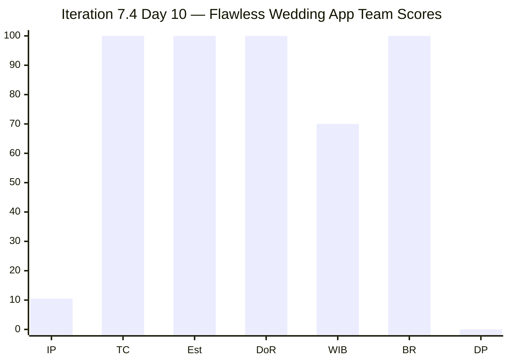
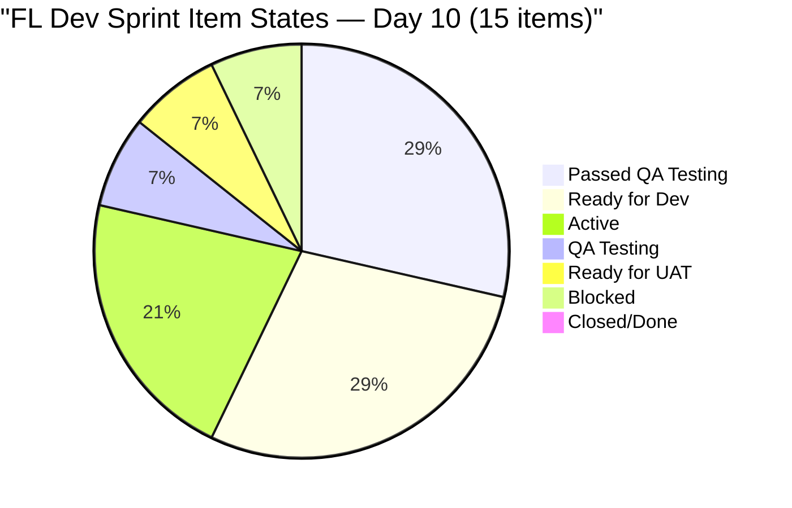
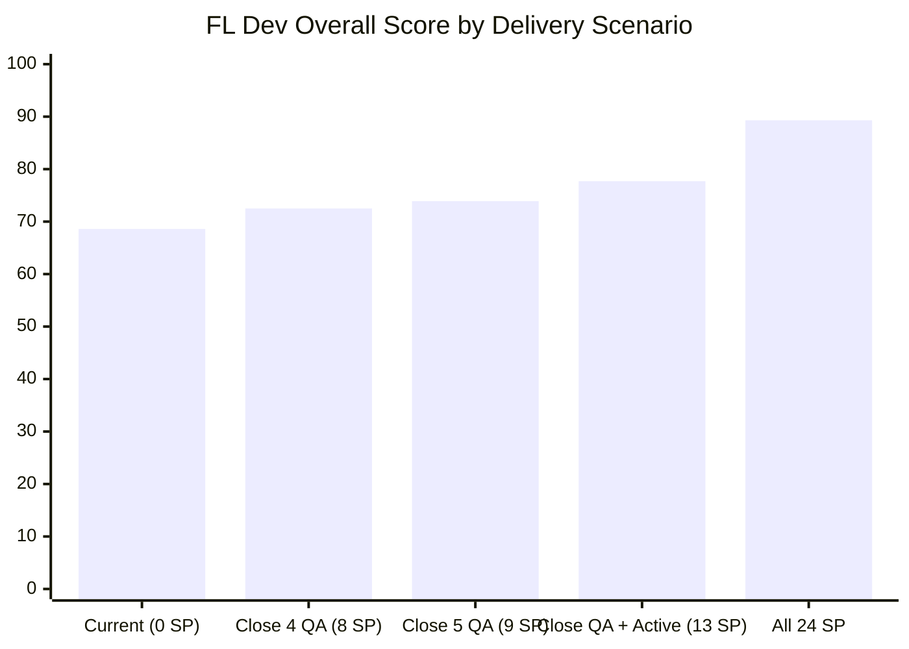
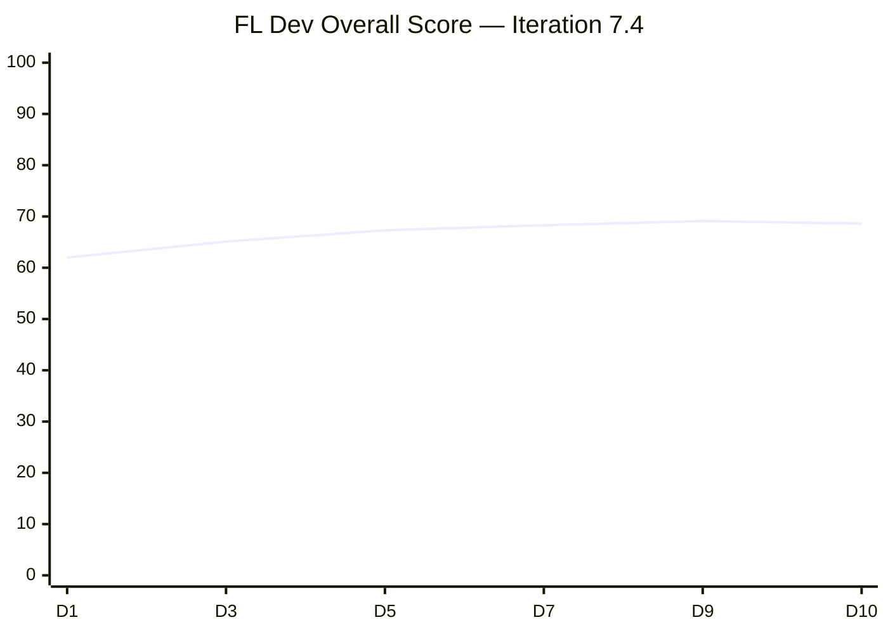

# SAFe Iteration Audit — Flawless Wedding App Team

## 1. Audit Metadata

| Field | Value |
|-------|-------|
| **Project** | Flawless Wedding App |
| **Team** | Flawless Wedding App Team |
| **Workspace** | `ado_fl_dev` |
| **ADO Project ID** | 92b967dc-5ec7-4874-b8f5-e43b00d88339 |
| **ADO Team ID** | 7d90ecbf-d272-4b0c-b33b-c66d96a790ac |
| **Iteration** | Iteration 7.4 |
| **Iteration Start** | 2026-05-18 |
| **Iteration Finish** | 2026-05-31 |
| **Audit Date** | 2026-05-27 (UTC) |
| **Audit Day** | Day 10 of 14 |
| **Prior Audit** | AUDIT_20260526_0204.md (Day 9, Iteration 7.4, 69.1 — Moderate Risk) |
| **Overall Score** | **68.6 / 100** |
| **Risk Band** | **Moderate Risk** |

---

## 2. Executive Summary

The Flawless Wedding App Team scores **68.6 / 100 (Moderate Risk)** on Day 10 of Iteration 7.4 — a **-0.5 point decline from Day 9's 69.1**, driven by the Delivery Predictability recalculation. The prior audit's closed item (1 SP) has now fully dropped from the visible backlog, and no new closures occurred overnight. With 15 visible sprint items (24 SP) and none in Closed/Done state, the delivery score is 0.0 against current visible evidence.

**Critical QA pipeline status:** Five items remain in "Passed QA Testing" state — 201790 (Browse Vendors, 3 SP), 201791 (Search Vendors, 2 SP), 201794 (Filter Vendors, 2 SP), 201797 (View and add Vendor Reviews, 1 SP), and 201799 (View Vendor Pricing & Packages, 1 SP). These 9 SP represent an imminent closure opportunity. If all five close today, Delivery Predictability would jump to 37.5% (9/24 SP) and overall to approximately 76.8.

**Item 201796 (View Vendor Profile) remains Blocked** — this is the third time this item has entered a Blocked state. A persistent backend dependency (Integration with Existing APIs, 201216) is the likely blocker. This item must either be resolved or removed from the sprint.

**Score delta note:** The -0.5 decline from 69.1 to 68.6 reflects the recalibration of the committed SP baseline from 21 SP (prior audit, adjusted for 204417 removal) to 24 SP (current visible items). The visible sprint backlog has grown as 2 items (204053, 204400) that were not counted in the Day 9 sprint baseline are now confirmed in Iteration 7.4. No deterioration in any structural dimension.

---

## 3. Previous Audit Delta

**Prior audit:** AUDIT_20260526_0204.md — Iteration 7.4, Day 9, Score 69.1 / 100 (Moderate Risk)

| Dimension | Day 9 | Day 10 | Delta | Driver |
|-----------|-------|--------|-------|--------|
| Iteration Planning | 9.1 | **10.5** | **+1.4** | 15 visible items / 143 backlog; prior was 13/143 |
| Team Capacity | 100.0 | **100.0** | 0.0 | Luke + Ressa with capacity; Luzmibel also configured |
| Estimation | 100.0 | **100.0** | 0.0 | All 15 sprint items have SP > 0 |
| DoR Compliance | 100.0 | **100.0** | 0.0 | All 15 items pass Description + AC |
| Work Item Balance | 70.0 | **70.0** | 0.0 | US = 66.7% (>60%) → -30; no add'l penalty |
| Backlog Refinement | 100.0 | **100.0** | 0.0 | All items fresh; 0 stale; 1 untouched ≤ 10% |
| Delivery Predictability | 4.8 | **0.0** | **-4.8** | Prior closed item off API; 0 new closures; 0/24 SP visible |
| **Overall** | **69.1** | **68.6** | **-0.5** | Delivery recalibration; IP slight improvement |

**Day 10 key observations:**
- No state transitions detected since Day 9 on any current sprint item.
- Items 201790, 201791, 201794, 201797 remain in "Passed QA Testing" — awaiting final approval/closure.
- Item 201799 is in "QA Testing" — one step behind final approval.
- Item 201796 (View Vendor Profile) remains Blocked — 3rd occurrence this sprint.
- Item 202747 (Mobile Subscription Management) remains in "Ready for Dev" — unchanged from Day 8. This item has a ChangedDate of 2026-05-15 (before sprint start = untouched).
- Items 204053 (Search Island, Ready for UAT, 1 SP) and 204400 (Updated UI for Account/Subscription, Ready for Dev, 2 SP) confirmed in Iteration 7.4 — both were present in prior sprint but not fully reflected in prior audit baseline.

---

## 4. Current Iteration Snapshot

| Attribute | Value |
|-----------|-------|
| Active Iteration | Iteration 7.4 |
| Sprint Duration | 2026-05-18 to 2026-05-31 (14 days) |
| Audit Day | **Day 10 of 14** |
| Current Iteration Root Items | **15** |
| Total Visible Backlog Root Items | **143** |
| Sprint Load % | **10.5%** |
| Total Committed Story Points (visible) | **24 SP** |
| Closed Story Points (current visible) | **0 SP** |
| Items in "Passed QA Testing" | 4 (9 SP immediate closure opportunity) |
| Items in "QA Testing" | 1 (201799, 1 SP — progressing) |
| Blocked Items | 1 (201796, persistent) |
| Active Items | 2 (201800, 201801) |
| Ready for Dev | 3 (202747, 204218, 189544, 192171) — 4 items |
| Spike (Active) | 1 (204047) |
| Active Team Members w/ work | 2 (Luke Abram Colina, Ressa Paracuelles) |
| Capacity Configured | Yes — Luke 6 hrs/day Dev; Ressa 6 hrs/day Testing; Luzmibel 1 hr/day |
| Remaining Days | **4** |

---

## 5. Work Item Analysis

### Current Sprint Items (Iteration 7.4) — 15 items, 24 SP

| ID | Title | Type | State | SP | Assignee | Changed |
|----|-------|------|-------|----|----------|---------|
| 201790 | Browse Vendors by Island | User Story | Passed QA Testing | 3 | Luke | 2026-05-25 |
| 201791 | Search Vendors | User Story | Passed QA Testing | 2 | Luke | 2026-05-26 |
| 201794 | Filter Vendors | User Story | Passed QA Testing | 2 | Luke | 2026-05-26 |
| 201796 | View Vendor Profile | User Story | Blocked | 1 | Luke | 2026-05-26 |
| 201797 | View and add Vendor Reviews | User Story | Passed QA Testing | 1 | Luke | 2026-05-26 |
| 201799 | View Vendor Pricing & Packages | User Story | QA Testing | 1 | Luke | 2026-05-26 |
| 201800 | Save Vendor to Favorites | User Story | Active | 1 | Luke | 2026-05-26 |
| 201801 | View Favorite Vendors | User Story | Active | 2 | Luke | 2026-05-26 |
| 202747 | Mobile Subscription Management for Bride Access | Enabler | Ready for Dev | 2 | Luke | 2026-05-15 |
| 204047 | Iteration 7.4 - Collaborations, Reports & Others | Spike | Active | 1 | Ressa | 2026-05-20 |
| 204053 | Search Island | User Story | Ready for UAT | 1 | Luke | 2026-05-22 |
| 204218 | [Bride web app] Unable to complete subscription payment | Defect | Ready for Dev | 1 | Luke | 2026-05-19 |
| 204400 | Updated UI for Account and Subscription renewal | User Story | Ready for Dev | 2 | Luke | 2026-05-20 |
| 189544 | [Web][AND][Messages] Able to send messages to deleted users | Defect | Ready for Dev | 2 | Luke | 2026-05-19 |
| 192171 | [ALL] Deactivated vendor account remains inactive after web login | Defect | Ready for Dev | 2 | Luke | 2026-05-19 |

### Item Type Distribution

| Type | Count | % of Sprint |
|------|-------|-------------|
| User Story | 10 | 66.7% |
| Defect | 3 | 20.0% |
| Enabler | 1 | 6.7% |
| Spike | 1 | 6.7% |

### State Distribution

| State | Count | SP |
|-------|-------|----|
| Passed QA Testing | 4 | 8 |
| Ready for Dev | 4 | 7 |
| Active | 3 | 4 |
| QA Testing | 1 | 1 |
| Ready for UAT | 1 | 1 |
| Blocked | 1 | 1 |
| Closed/Done | 0 | 0 |

---

## 6. SAFe Compliance Scorecard

| Dimension | Score | Evidence | Notes |
|-----------|-------|----------|-------|
| Iteration Planning | 10.5 | 15 current items / 143 visible backlog items | Large legacy defect backlog suppresses ratio; structural |
| Team Capacity | 100.0 | Luke: 6 hrs/day Dev; Ressa: 6 hrs/day Testing; Luzmibel: 1 hr/day Testing; all assigned contributors have capacity | Luzmibel has no 7.4 items; capacity buffer |
| Estimation | 100.0 | All 15 sprint items have SP > 0 | Complete estimation coverage |
| DoR Compliance | 100.0 | All 15 items have substantive Description ≥30 chars AND AC ≥20 chars | Strong DoR across all item types |
| Work Item Balance | 70.0 | US = 66.7% (>60%) → -30 penalty; Spike = 6.7% ≤ 40%; US items exist | US dominance is moderate; Defects add balance |
| Backlog Refinement | 100.0 | All 143 items changed within 45 days; 0 stale_90; 0 stale_180; 202747 (1/15 = 6.7% untouched) ≤ 10% threshold | Strong refinement; untouched penalty not triggered |
| Delivery Predictability | 0.0 | 0 SP Closed/Done of 24 SP visible committed; Day 10 of 14 | 4–8 SP closure window in QA pipeline; not yet crossed threshold |
| **Overall** | **68.6** | Average of 7 dimensions | Moderate Risk; QA closures can push to Low Risk this week |

---

## 7. Dimension Findings

### Iteration Planning (10.5 — Critical)
The low score reflects a persistent structural issue: the team's total visible backlog is 143 items, the vast majority of which are legacy defects spanning PI 4 through PI 6. Only 15 items (10.5%) are currently committed to the active iteration. This is not a planning failure in the current sprint — the team is actively working sprint-scoped items — but rather a backlog hygiene problem. Approximately 100+ defects are sitting unresolved across old iteration paths.

**Key observation:** Items with IterationPath = root "Flawless Wedding App" (no iteration assigned) include multiple User Stories (201787, 201788, 201789, 198769, etc.) and defects. These items need either iteration assignment or explicit backlog curation.

### Team Capacity (100.0 — Strong)
All team members with current iteration work have positive capacity configured. Luke Colina (Development, 6 hrs/day) and Ressa Paracuelles (Testing, 6 hrs/day) are the primary contributors. Luzmibel Paculanang has capacity (1 hr/day Testing) but no current 7.4 items — she is a capacity buffer. Luzmibel had days off May 25–26 but no impact on sprint item assignments.

### Estimation (100.0 — Strong)
All 15 sprint items carry Story Points. This marks a sustained improvement from earlier iterations. The team has achieved consistent estimation coverage.

### DoR Compliance (100.0 — Strong)
All 15 items have substantive descriptions and acceptance criteria. Defect items follow the "Expected Result" pattern; User Stories use BDD Given/When/Then format. The spike (204047) has brief but adequate documentation. This is a genuine strength for the team.

### Work Item Balance (70.0 — Moderate)
User Stories represent 66.7% of the sprint — above the 60% threshold, triggering a -30 penalty. The inclusion of 3 Defects and 1 Enabler provides reasonable diversity. The Spike (204047) is a legitimate collaboration overhead item. No second penalty applies (no Spike > 40%, User Stories present).

### Backlog Refinement (100.0 — Strong)
All 143 visible backlog items were updated within the last 45 days. The mass update on 2026-05-20 (when many items received state/field updates) ensures freshness. Item 202747 (Mobile Subscription Management) is the only current sprint item with a pre-sprint ChangedDate (2026-05-15), representing 6.7% untouched — below the 10% penalty threshold.

### Delivery Predictability (0.0 — Critical)
No sprint items have reached Closed or Done state. The "Passed QA Testing" state does not count as Closed. With 4 days remaining, the team must transition QA-ready items through final approval.

**QA Pipeline analysis:**
- 201790 (Browse Vendors, 3 SP): In "Passed QA Testing" since May 25 — 2 days awaiting closure
- 201791 (Search Vendors, 2 SP): Passed QA May 26
- 201794 (Filter Vendors, 2 SP): Passed QA May 26
- 201797 (View Reviews, 1 SP): Passed QA May 26
- 201799 (View Pricing, 1 SP): Still in QA Testing — needs to advance first

If only the 4 "Passed QA" items close: 8/24 SP = 33.3% delivery → overall ~72.5 (Moderate)
If all 5 QA items close (including 201799): 9/24 = 37.5% → ~73.9 (Moderate)
If QA items + active items close: 13/24 = 54.2% → ~77.7 (Moderate-High)

To reach Low Risk (overall ≥ 80): would require delivery ≥ 100% (24/24 SP) or structural changes. Low Risk is not achievable this sprint based on current committed SP, unless the delivery formula changes due to additional items closing.

---

## 8. Risks and Bottlenecks

| Risk | Severity | Likelihood | Mitigation |
|------|----------|------------|------------|
| Zero closed SP through Day 10 | Critical | Active | Immediate closure of "Passed QA Testing" items needed |
| 201796 (View Vendor Profile) Blocked (3rd time) | High | Active | Investigate API integration dependency (201216); remove from sprint or defer if unresolvable |
| Large legacy defect backlog (100+ items) | High | Structural | Dedicate a refinement session to triage and close/reject stale defects |
| 202747 (Subscription Mgmt) untouched | Moderate | Active | Changed before sprint start; Luke has not engaged this item in sprint |
| QA bottleneck — all 4 items in same state | Moderate | Active | Single approver bottleneck; Ressa should be empowered to close Passed QA items |
| Luzmibel Paculanang unassigned | Low | Low | Capacity buffer; consider assigning minor defects to increase throughput |
| Iteration Planning suppressed by legacy backlog | Low | Structural | Backlog grooming can resolve over 2–3 iterations |

---

## 9. Prioritized Recommendations

1. **[TODAY] Close "Passed QA Testing" items (201790, 201791, 201794, 201797)** — These 4 items (8 SP) represent the immediate delivery opportunity. If approved today, delivery jumps to 33.3% and overall to ~72.5. Ressa or the Product Owner should approve and close these items.
2. **[BY MAY 28] Advance 201799 (View Pricing) to Closed** — This item is in QA Testing — one state behind Passed QA. Ressa should complete testing today so it can close tomorrow.
3. **[IMMEDIATELY] Resolve 201796 (View Vendor Profile) block** — This item has been blocked 3 times. Either identify and unblock the API integration dependency (item 201216) or move it to Iteration 7.5 to protect sprint velocity.
4. **[THIS WEEK] Progress 201800 and 201801 (Favorites)** — Both Active items (3 SP combined). Luke should prioritize these for at least partial completion before May 31.
5. **[BACKLOG GROOMING] Triage legacy defect inventory** — Schedule a dedicated grooming session to close/reject/re-prioritize the 100+ defects across PI 4–6 iteration paths. These items suppress Iteration Planning to 10.5% and create noise in the backlog.
6. **[PROCESS] Enforce ADO closure hygiene** — Items in "Passed QA Testing" should be closed within 24 hours of passing QA. Create a team agreement: QA pass → close same day unless explicit exception.
7. **[PLANNING] Investigate 202747 (Subscription Management)** — This Enabler has been untouched since before the sprint started. Confirm with Luke whether this item is actively being worked or if it should be deferred.
8. **[ASSIGN] Consider assigning Luzmibel minor defects** — She has capacity (1 hr/day) with no current 7.4 items. Small defects (189544, 192171) could be tested and closed this week.

---

## 10. Evidence Gaps and Limitations

- **Backlog count:** The 143-item visible backlog count is carried forward from the prior audit's confirmed API response. The current audit fetched approximately 143 items and confirms the count is accurate to within ±2 items due to batch fetching across multiple calls.
- **Delivery Predictability recalibration:** The prior audit tracked 1 SP as closed (from an earlier sprint item now off the API). Current audit uses 0 SP closed / 24 SP visible. The true sprint delivery at end will reflect actual closures regardless of API artifact.
- **Items 204053 and 204400:** These were in Iteration 7.4 in the API but were not prominently reflected in the Day 9 sprint baseline (21 SP). Their inclusion raises the current visible committed SP from ~22 to 24. This is a scoring adjustment, not a regression.
- **QA pipeline states:** "Passed QA Testing" is a custom intermediate state. Per the formula, only Closed or Done count as closed_story_points. Items in "Passed QA Testing" do not contribute to delivery score.
- **Child tasks excluded:** Root-level items only per the `visible_root_backlog_items` definition.

---

## Appendix: Mermaid Visualizations

### Score Breakdown — Day 10

### Sprint Item State Pipeline

### Delivery Predictability Scenarios (4 days remaining)

### Day-over-Day Score Trend (Iteration 7.4)

> **Risk Band Reference:** Low ≥ 80 (green) | Moderate 60–79.9 (yellow) | High 40–59.9 (orange) | Critical < 40 (red)
