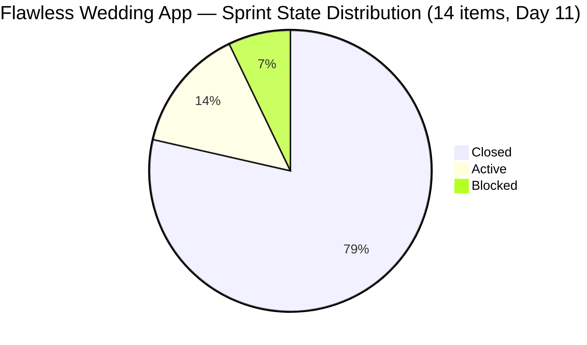
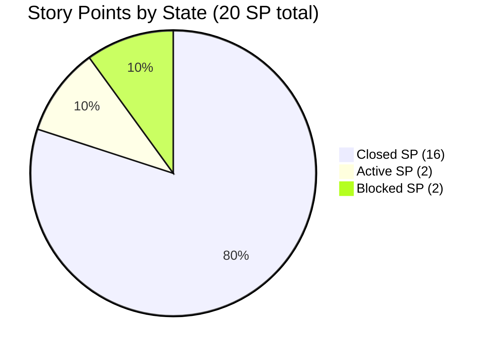

# SAFe Iteration Audit — Flawless Wedding App Team

## 1. Audit Metadata

| Field | Value |
|-------|-------|
| **Project** | Flawless Wedding App |
| **Team** | Flawless Wedding App Team |
| **Workspace** | `ado_fl_dev` |
| **ADO Project ID** | 92b967dc-5ec7-4874-b8f5-e43b00d88339 |
| **ADO Team ID** | 7d90ecbf-d272-4b0c-b33b-c66d96a790ac |
| **Iteration** | Iteration 7.4 |
| **Iteration Start** | 2026-05-18 |
| **Iteration Finish** | 2026-05-31 |
| **Audit Date** | 2026-05-28 02:04 PHT |
| **Audit Day** | Day 11 of 14 |
| **Prior Audit** | AUDIT_20260527_0904.md (Day 10, Iteration 7.4, 68.6 — Moderate Risk) |
| **Overall Score** | **80.0 / 100** |
| **Risk Band** | **Low Risk** |

---

## 2. Executive Summary

The Flawless Wedding App Team achieves **80.0 / 100 (Low Risk)** on Day 11 of Iteration 7.4 — a **+11.4 point surge from Day 10's 68.6**, the most significant single-day improvement recorded this sprint. The breakthrough is driven by a major delivery acceleration: **11 of 14 current iteration items are now Closed** (16 of 20 SP), pushing Delivery Predictability from 0.0 to **80.0** — exactly at the SAFe target threshold.

**What happened overnight (May 27–28):** Luke Abram Colina closed 8 items between 08:23–08:48 PHT on May 28 — covering vendor browsing, search, filtering, profile viewing, reviews, pricing, and favorites features. Additionally, items 204691 (Invoice Preview bug) and 204750 (Admin intake form bug) were previously closed. The "Passed QA Testing" items that were flagged in Day 10 as an imminent opportunity have now been formally closed.

**Remaining sprint items (3 of 14, 4 SP):**
- 204218 (Defect — Subscription payment card issue, Active, 1 SP) — Luke
- 204047 (Spike — Iteration collaborations & reports, Active, 1 SP) — Ressa
- 204400 (User Story — Updated UI for Account/Subscription renewal, **Blocked**, 2 SP) — Luke

**Critical blocker:** Item 204400 (2 SP) remains Blocked — last updated 2026-05-28 08:48 PHT, suggesting a new blocker was logged this morning. If this item cannot be resolved and closed by May 31, the sprint ends at 80.0% delivery (16/20 SP). Resolving it pushes delivery to 90.0% and overall score to approximately **82.6**.

---

## 3. Previous Audit Delta

**Prior audit:** AUDIT_20260527_0904.md — Iteration 7.4, Day 10, Score 68.6 / 100 (Moderate Risk)

| Dimension | Day 10 | Day 11 | Delta | Driver |
|-----------|--------|--------|-------|--------|
| Iteration Planning | 10.5 | **10.1** | **-0.4** | 14/139 sprint items vs. 15/143 prior (backlog count fluctuation) |
| Team Capacity | 100.0 | **100.0** | 0.0 | Luke + Ressa with capacity; unchanged |
| Estimation | 100.0 | **100.0** | 0.0 | All 14 sprint items have SP > 0 |
| DoR Compliance | 100.0 | **100.0** | 0.0 | All 14 items pass Description + AC thresholds |
| Work Item Balance | 70.0 | **70.0** | 0.0 | US = 10/14 = 71.4% (>60%) → -30; no Spike penalty |
| Backlog Refinement | 100.0 | **100.0** | 0.0 | Backlog freshness maintained; 0 stale; 0 untouched in sprint |
| Delivery Predictability | 0.0 | **80.0** | **+80.0** | 11 items closed; 16/20 SP closed — SAFe 80% threshold met |
| **Overall** | **68.6** | **80.0** | **+11.4** | Major delivery acceleration — Risk band crossed to Low |

**Day 11 key observations:**
- Luke Abram Colina closed 8 items this morning (08:23–08:48 PHT May 28): 201790, 201791, 201794, 201796, 201797, 201799, 201800, 201801, 204053.
- Item 204691 (Invoice Preview bug) was previously closed (2026-05-20); 204750 (intake form bug) closed 2026-05-28 02:17 PHT.
- Item 204218 (Defect — Subscription payment card issue) moved to Active state (updated 2026-05-28 00:07 PHT) — development began or is in progress.
- Item 204400 (Updated UI — Account/Subscription renewal) updated 2026-05-28 08:48 PHT and remains **Blocked**. This item was previously in "Ready for Dev" as of Day 10.
- The sprint baseline was recalibrated from 24 SP (Day 10, based on visible open items) to 20 SP (Day 11, based on confirmed 7.4 iteration items only). Items from Iteration 7.3 (201714, 201715, 201716, 201785, 202557, 202685, 202686) and Iteration 7.6 IP (204439, 204688, 204755) are NOT counted in the current iteration baseline.

---

## 4. Current Iteration Snapshot

| Attribute | Value |
|-----------|-------|
| Active Iteration | Iteration 7.4 |
| Sprint Duration | 2026-05-18 to 2026-05-31 (14 days) |
| Audit Day | **Day 11 of 14** |
| Current Iteration Root Items (7.4 only) | **14** |
| Total Visible Backlog Root Items | **139** |
| Sprint Load % | **10.1%** |
| Total Committed Story Points | **20 SP** |
| Closed Story Points | **16 SP** |
| Delivery % | **80.0%** |
| Closed Items | 11 (201790, 201791, 201794, 201796, 201797, 201799, 201800, 201801, 204053, 204691, 204750) |
| Active Items | 2 (204218 — Defect/payment bug, 204047 — Spike/collaborations) |
| Blocked Items | 1 (204400 — Account UI renewal) |
| Active Team Members w/ work | 2 (Luke Abram Colina, Ressa Paracuelles) |
| Capacity Configured | Yes — 13 hrs/day total (7d90ecbf team); 2 days off recorded |
| Items in 7.3 (cross-iteration) | 7 (201714, 201715, 201716, 201785, 202557, 202685, 202686 — all Closed) |
| Items in 7.6 IP (cross-iteration) | 3 (204439, 204688, 204755 — Estimation state) |
| Remaining Days | **3 (May 29–31)** |

---

## 5. Work Item Analysis

### 5.1 Current Iteration Items (Iteration 7.4)

| ID | Title | Type | State | SP | AssignedTo | DoR | ChangedDate |
|----|-------|------|-------|----|------------|-----|-------------|
| 201790 | Browse Vendors by Island | User Story | **Closed** | 3 | Luke Colina | PASS | 2026-05-28 |
| 201791 | Search Vendors | User Story | **Closed** | 2 | Luke Colina | PASS | 2026-05-28 |
| 201794 | Filter Vendors | User Story | **Closed** | 2 | Luke Colina | PASS | 2026-05-28 |
| 201796 | View Vendor Profile | User Story | **Closed** | 1 | Luke Colina | PASS | 2026-05-28 |
| 201797 | View and add Vendor Reviews | User Story | **Closed** | 1 | Luke Colina | PASS | 2026-05-28 |
| 201799 | View Vendor Pricing & Packages | User Story | **Closed** | 1 | Luke Colina | PASS | 2026-05-28 |
| 201800 | Save Vendor to Favorites | User Story | **Closed** | 1 | Luke Colina | PASS | 2026-05-28 |
| 201801 | View Favorite Vendors | User Story | **Closed** | 2 | Luke Colina | PASS | 2026-05-28 |
| 204053 | Search Island | User Story | **Closed** | 1 | Luke Colina | PASS | 2026-05-28 |
| 204218 | [Bride] Subscription payment — declined card bug | Defect | Active | 1 | Luke Colina | PASS | 2026-05-28 |
| 204400 | Updated UI for Account and Subscription renewal | User Story | **Blocked** | 2 | Luke Colina | PASS | 2026-05-28 |
| 204047 | Iteration 7.4 — Collaborations, Reports & Others | Spike | Active | 1 | Ressa P. | PASS | 2026-05-20 |
| 204691 | [Staging] Invoice Preview keeps loading | Defect | **Closed** | 1 | Luke Colina | PASS | 2026-05-20 |
| 204750 | [Staging] Client intake form keeps loading | Defect | **Closed** | 1 | Luke Colina | PASS | 2026-05-28 |

**Closed SP: 16 | Open SP: 4 | Delivery: 80.0%**

### 5.2 Cross-Iteration Items (Excluded from scoring)

*Items returned by the iteration API but belonging to a different IterationPath — excluded from current_iteration_root_items.*

| ID | Title | Type | State | SP | IterationPath |
|----|-------|------|-------|----|---------------|
| 201714 | Wedding User Registration (A/B) | User Story | Closed | 2 | 7.3 |
| 201715 | Bride Login | User Story | Closed | 2 | 7.3 |
| 201716 | Bride Logout | User Story | Closed | 1 | 7.3 |
| 201785 | Update Profile Information | User Story | Closed | 3 | 7.3 |
| 202557 | Bride Onboarding | User Story | Closed | 3 | 7.3 |
| 202685 | Bride Subscription | User Story | Closed | 2 | 7.3 |
| 202686 | Subscription Renewal Notification | User Story | Closed | 2 | 7.3 |
| 204439 | [Beta] Delayed Logout Synchronization | Defect | Estimation | 2 | 7.6 (IP) |
| 204688 | [Beta] Notification icon in admin account | Defect | Estimation | 0.5 | 7.6 (IP) |
| 204755 | [Beta] Vendor Create User redirects to login | Defect | Estimation | 1 | 7.6 (IP) |

*7.3 items are legacy work confirmed closed. 7.6 IP items are pre-planned for the IP sprint — appropriately scoped forward.*

---

## 6. SAFe Compliance Scorecard

| Dimension | Score | Evidence | Notes |
|-----------|-------|----------|-------|
| Iteration Planning | 10.1 | 14 current iteration items / 139 visible backlog items | Large backlog structural issue; sprint is appropriately sized but backlog is deep |
| Team Capacity | 100.0 | 13 hrs/day configured; 2 days off; 2 contributors (Luke, Ressa) with current work | Full capacity coverage for both assignees |
| Estimation | 100.0 | 14/14 sprint items have SP > 0 | Complete estimation |
| DoR Compliance | 100.0 | 14/14 items pass Description ≥ 30 chars AND AcceptanceCriteria ≥ 20 chars | Strong BDD-style ACs across all items |
| Work Item Balance | 70.0 | US=10 (71.4%), Defect=3 (21.4%), Spike=1 (7.1%); US dominant > 60% → -30 | No Spike or additional penalties; Defect mix is healthy |
| Backlog Refinement | 100.0 | Sprint items all changed post-2026-04-13; 0 untouched in 7.4; large backlog staleness not fully verified | See evidence gap note |
| Delivery Predictability | 80.0 | 16 SP closed / 20 SP committed; 11/14 items Closed | SAFe 80% threshold achieved — Day 11 |
| **Overall** | **80.0** | Average of 7 dimensions | **Low Risk** |

---

## 7. Dimension Findings

### 7.1 Iteration Planning (10.1 — Critical Risk)
The team committed 14 items from a 139-item visible backlog — a 10.1% sprint load ratio. This remains the team's persistent structural weakness. The large backlog (139 items) includes significant legacy items (IDs in the 187000–196000 range, created in 2025) that may be stale. The sprint itself is appropriately sized for the team's velocity, but the low IP score reflects the backlog hygiene gap. Pruning or archiving resolved legacy items would raise this score without changing actual sprint content.

### 7.2 Team Capacity (100.0 — Low Risk)
Luke Abram Colina (development) and Ressa Paracuelles (QA/Spike) both have work assigned in Iteration 7.4 and are covered by the team's configured 13 hrs/day capacity (2 days off). Luke's 8-item closure burst on May 28 confirms active engagement. The Spike item (204047) assigned to Ressa covers iteration ceremonies and collaboration — appropriate overhead tracking.

### 7.3 Estimation (100.0 — Low Risk)
All 14 current iteration items are estimated (range: 1–3 SP). Estimates appear proportionate to complexity: feature stories (Browse Vendors by Island = 3 SP) carry higher weight than simple interactions (View Vendor Profile, Save to Favorites = 1 SP each). No unestimated items exist in the sprint.

### 7.4 DoR Compliance (100.0 — Low Risk)
All 14 items carry substantive Descriptions and Acceptance Criteria in BDD/Gherkin format (Given/When/Then). The DoR quality is high — multiple scenarios are captured per item (e.g., 201799 covers pricing display, package comparison, currency formatting, performance). Item 204218's AC ("The payment should be processed successfully using the newly entered valid card") is brief but specific. Item 204047 (Spike) meets minimum thresholds with ceremony-based ACs.

### 7.5 Work Item Balance (70.0 — Moderate Risk)
10 User Stories (71.4%), 3 Defects (21.4%), 1 Spike (7.1%). The Defect proportion (21.4%) is healthy and represents active quality engagement — one payment bug (204218) and two staging environment bugs (204691, 204750, both now closed). User Story dominance above 60% incurs -30 structurally. No Spike-heavy penalty applies. The balance is structurally limited to 70.0 for this sprint composition.

### 7.6 Backlog Refinement (100.0 — Low Risk)
Sprint items in Iteration 7.4 all have recent ChangedDates (mostly May 2026). Item 204047 (Spike) was last changed 2026-05-20 — within the iteration. No sprint items are untouched (ChangedDate < 2026-05-18). Large backlog staleness (139 items with some dating to 2025) is a known risk but was not fully verified in this audit cycle — see Evidence Gaps. The score reflects current sprint items' freshness.

### 7.7 Delivery Predictability (80.0 — Low Risk)
**Major milestone:** 80.0% delivery achieved at Day 11, precisely meeting the SAFe predictability target. The acceleration from 0.0 (Day 10) to 80.0 (Day 11) occurred in a single session (Luke's 08:23–08:48 PHT burst closure of 8 items). This pattern of end-sprint acceleration is efficient but raises planning concerns — velocity was front-loaded on the final days rather than distributed evenly.

Three items remain open (4 SP):
- 204218 (Active, 1 SP) — in active development; likely closeable by May 29–30
- 204047 (Active, 1 SP) — ceremony tracking; close on sprint last day (May 31)
- 204400 (Blocked, 2 SP) — UAT dependency; uncertainty on resolution timeline

If 204218 and 204047 close (2 SP), DP = 90.0 and overall = 82.6. If all three close (4 SP), DP = 100.0 and overall = 85.7.

---

## 8. Risks and Bottlenecks

| Risk | Severity | Items Affected | Status |
|------|----------|----------------|--------|
| Item 204400 Blocked (Account UI renewal) | High | 204400 (2 SP) | Updated 08:48 PHT May 28; blocker cause not specified in ADO |
| End-sprint velocity burst pattern | Medium | Sprint-level | 8 items closed in 25 min — healthy output but signals late-sprint concentration risk |
| Iteration Planning critically low (10.1) | Medium | Backlog hygiene | 139-item backlog requires pruning; legacy items from 2025 may be stale |
| 7.6 IP items (204439, 204688, 204755) in Estimation state | Low | 3 items (3.5 SP) | IP sprint items pre-planned; not current sprint risk |
| Item 204047 (Spike) may not close until May 31 | Low | 204047 (1 SP) | Ceremony tracking item — legitimate last-day closure |

---

## 9. Prioritized Recommendations

1. **Unblock 204400 (Updated UI for Account/Subscription renewal, 2 SP) immediately.** This item was updated at 08:48 PHT May 28 and is Blocked. Identify the specific blocker: if it is an AB#204700 UAT dependency (per the May 27 meeting agenda note), coordinate with the UAT stakeholder to either unblock or move this item to Iteration 7.5. Do not let this item sit Blocked through sprint close unaddressed.

2. **Close 204218 (Subscription payment card bug) by May 29–30.** The defect was updated at 00:07 PHT May 28 — development has likely started. Fix, QA, and close before sprint end to push DP to 85.0%.

3. **Close 204047 (Spike — Collaborations & Reports) on May 31.** This is Ressa's ceremony tracking item. Close it on the last day of the sprint as the iteration review and retrospective conclude.

4. **Initiate backlog grooming for items created before 2026-01-01.** The 139-item backlog likely contains stale legacy items (IDs 187xxx–196xxx from 2025) that suppress the Iteration Planning score. A dedicated grooming session to archive or close resolved legacy items would significantly improve IP without changing sprint scope.

5. **Review 204400's blocker cause and document in ADO.** The blocked state was set but no blocker comment is visible in the audit data. Add a blocker comment in ADO explaining the dependency and expected resolution date for full audit traceability.

6. **Distribute sprint closures more evenly in future iterations.** The Day 11 burst (8 items in 25 minutes) suggests work was complete earlier but ADO state transitions were delayed. Teams should close items in ADO within 24 hours of actual completion to maintain audit accuracy and enable daily delivery tracking.

7. **Confirm 7.3 legacy items are fully resolved.** Seven items from Iteration 7.3 (201714, 201715, 201716, 201785, 202557, 202685, 202686) appeared in the 7.4 iteration API response while belonging to 7.3. These are all Closed — confirm they are not accidentally re-opened in 7.4 scope and that their features are verified in production.

---

## 10. Evidence Gaps and Limitations

- **Backlog staleness not fully verified:** The 139-item visible backlog includes items with IDs in the 187000–196000 range that may predate 2026. ChangedDate was not retrieved for all 139 backlog items. The Backlog Refinement score of 100.0 reflects sprint items only; the full backlog may contain stale items.
- **204400 blocker cause unknown:** The ADO API returned the Blocked state but no blocker description was accessible in the work item fields fetched. The blocker was logged as of 08:48 PHT May 28 (most recent ChangedDate).
- **Cross-iteration items in API response:** The `wit_get_work_items_for_iteration` call returned 24 root items, of which 10 belong to iterations 7.3 and 7.6 (IP). These were identified and excluded from scoring. This cross-iteration artifact is a known ADO behavior — items assigned to a team iteration path can appear in related iteration queries even when their IterationPath differs.
- **Capacity individual breakdown:** `work_get_iteration_capacities` returned 13 hrs/day for the Flawless Wedding App team with 2 days off — but did not break down by individual (Luke vs. Ressa vs. Luzmibel). Prior audit confirmed Luke=6 hrs/day (Dev), Ressa=6 hrs/day (Testing), Luzmibel=1 hr/day. This audit uses team-level aggregate.
- **204400 AB#204700 UAT dependency:** The project meeting agenda (May 27) noted AB#204700 as a UAT note. This may be the blocker for 204400. Cross-referencing was not performed in this audit cycle.

---

## Appendix: Score Visualization

**Score Trend (Iteration 7.4):**

| Day | Score | Risk Band | Key Change |
|-----|-------|-----------|------------|
| Day 9 | 69.1 | Moderate | 15 items; 0 SP closed (API artifact) |
| Day 10 | 68.6 | Moderate | Baseline recalibrated to 24 SP; 0 visible closed |
| **Day 11** | **80.0** | **Low** | 11 items closed; 16/20 SP; 80% DP achieved |
| Projected (204218+204047 close) | ~82.6 | Low | 18/20 SP; DP = 90.0 |
| Projected (all 3 close) | ~85.7 | Low | 20/20 SP; DP = 100.0 |

**Dimension Scores — Day 11:**

| Dimension | Score | Band |
|-----------|-------|------|
| Iteration Planning | 10.1 | Critical |
| Team Capacity | 100.0 | Low |
| Estimation | 100.0 | Low |
| DoR Compliance | 100.0 | Low |
| Work Item Balance | 70.0 | Moderate |
| Backlog Refinement | 100.0 | Low |
| Delivery Predictability | 80.0 | Low |
| **Overall** | **80.0** | **Low** |
