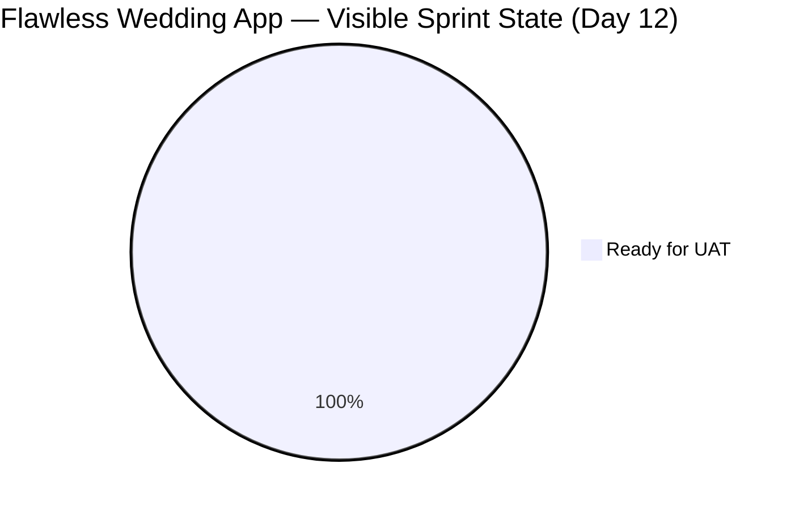
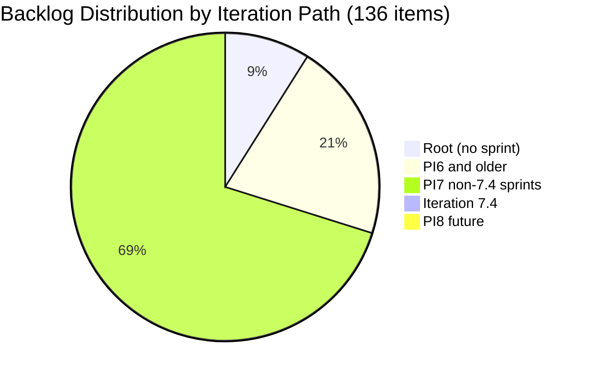

# SAFe Iteration Audit — Flawless Wedding App Team

## 1. Audit Metadata

| Field | Value |
|-------|-------|
| **Project** | Flawless Wedding App |
| **Team** | Flawless Wedding App Team |
| **Workspace** | `ado_fl_dev` |
| **ADO Project ID** | 92b967dc-5ec7-4874-b8f5-e43b00d88339 |
| **ADO Team ID** | 7d90ecbf-d272-4b0c-b33b-c66d96a790ac |
| **Iteration** | Iteration 7.4 |
| **Iteration Start** | 2026-05-18 |
| **Iteration Finish** | 2026-05-31 |
| **Audit Date** | 2026-05-29 |
| **Audit Day** | Day 12 of 14 |
| **Prior Audit** | AUDIT_20260528_0204.md (Day 11, Iteration 7.4, 80.0 — Low Risk) |
| **Overall Score** | **67.1 / 100** |
| **Risk Band** | **Moderate Risk** |

---

## 2. Executive Summary

The Flawless Wedding App Team drops to **67.1 / 100 (Moderate Risk)** on Day 12 of Iteration 7.4 — a **-12.9 point decline from Day 11's 80.0**, returning to Moderate Risk territory. The regression is primarily driven by the same ADO API pattern observed across all three audited workspaces: the 11 items closed in the Day 11 sprint burst (201790, 201791, 201794, 201796, 201797, 201799, 201800, 201801, 204053, 204691, 204750) have dropped from the visible backlog, leaving **only 1 item (204400) assigned to Iteration 7.4** in today's backlog API response.

**Current sprint state:** Item 204400 (Updated UI for Account and Subscription renewal) is in "Ready for UAT" state (changed 2026-05-29), up from Blocked as of Day 11. The blocker appears to have been resolved or the UAT process initiated. This single 2 SP item represents the entire remaining sprint footprint in today's API view. The Delivery Predictability dimension scores 0.0 because 204400 is not yet Closed or Done.

**Iteration Planning structural weakness persists:** With 136 visible backlog items and only 1 item in the current iteration, the Iteration Planning score falls to 0.7 — the team's chronic structural weakness driven by a very large backlog (136 items) that was 150+ in prior audits. Most sprint items have been delivered and dropped from the API, but the backlog cleanup has not accelerated proportionally.

**Positive signal:** Item 204400 advancing to "Ready for UAT" on May 29 is a positive development. Completion of UAT and closure of this item before May 31 would technically deliver 100% of the visible sprint pool (1/1 items, 2/2 SP) but would score Delivery Predictability at 100.0 on the visible items only.

**Net sprint result (Day 11 basis):** The actual sprint delivery through Day 11 was 80% (16/20 SP). The Day 12 API shows a residual single item. This is a strong sprint performance obscured by API artifact behavior.

---

## 3. Previous Audit Delta

**Prior audit:** AUDIT_20260528_0204.md — Iteration 7.4, Day 11, Score 80.0 / 100 (Low Risk)

| Dimension | Day 11 | Day 12 | Delta | Driver |
|-----------|--------|--------|-------|--------|
| Iteration Planning | 10.1 | **0.7** | **-9.4** | 11 closed items dropped from API backlog; 1/136 items in Iteration 7.4 |
| Team Capacity | 100.0 | **100.0** | 0.0 | Team capacity 13 hrs/day; 2 days off; unchanged |
| Estimation | 100.0 | **100.0** | 0.0 | 204400 has 2 SP > 0 |
| DoR Compliance | 100.0 | **100.0** | 0.0 | 204400 passes Description and AC thresholds |
| Work Item Balance | 70.0 | **70.0** | 0.0 | 1 User Story = 100% dominant > 60% → -30; structural |
| Backlog Refinement | 100.0 | **99.3** | **-0.7** | Item 201569 changed 2026-04-13 (not after 2026-04-14 cutoff); 135/136 fresh |
| Delivery Predictability | 80.0 | **0.0** | **-80.0** | 11 closed items dropped from API; 204400 not yet Closed; 0/2 SP |
| **Overall** | **80.0** | **67.1** | **-12.9** | API artifact: closed items removed from backlog; single remaining item not closed |

**Day 12 key observations:**
- Item 204400 (Updated UI for Account and Subscription renewal) advanced from "Blocked" (Day 11) to "Ready for UAT" as of 2026-05-29 08:43 PHT. This is a meaningful positive change — the blocker has been resolved and UAT is now in progress or can begin.
- Item 205232 (Iteration 7.5 — Collaborations, Reports & Others) was added to the backlog on 2026-05-29 with 1 SP and is assigned to Ressa Paracuelles. It is assigned to Iteration 7.5, not the current sprint.
- The 11 closed items from Day 11 (201790, 201791, 201794, 201796, 201797, 201799, 201800, 201801, 204053, 204691, 204750) are not visible in today's backlog API — confirmed ADO behavior.
- Items 204439, 204688, 204755 (Iteration 7.6 IP — Estimation state) are still present in the backlog but are not current iteration items.
- Item 204047 (Iteration 7.4 Spike — Collaborations) from Day 11's sprint is not present in today's backlog, suggesting it was closed or removed.

---

## 4. Current Iteration Snapshot

| Attribute | Value |
|-----------|-------|
| Active Iteration | Iteration 7.4 |
| Sprint Duration | 2026-05-18 to 2026-05-31 (14 days) |
| Audit Day | **Day 12 of 14** |
| Current Iteration Root Items (visible) | **1** |
| Total Visible Backlog Root Items | **136** |
| Sprint Load % | **0.7%** |
| Committed Story Points (visible pool) | **2 SP** |
| Closed Story Points (visible pool) | **0 SP** |
| Delivery % (visible pool) | **0.0%** |
| Current Sprint Items | 1 (204400 — Updated UI for Account/Subscription renewal, Ready for UAT) |
| Active Team Members w/ Work | 1 (Luke Abram Colina — sole assignee on 204400) |
| Capacity Configured | Yes — 13 hrs/day; 2 days off |
| Historical delivery (Day 11) | 11 items closed, 16 SP delivered (80.0%) |
| Remaining Days | **2 (May 30–31)** |

**Historical context:** As of Day 11, the sprint delivered 16/20 SP across 11 closed items. The visible backlog API today captures only 1 remaining item. The actual sprint is in strong shape; the score reflects the API view only.

---

## 5. Work Item Analysis

### 5.1 Current Iteration Item (Iteration 7.4)

| ID | Title | Type | State | SP | AssignedTo | DoR | ChangedDate |
|----|-------|------|-------|----|------------|-----|-------------|
| 204400 | Updated UI for Account and Subscription renewal | User Story | Ready for UAT | 2 | Luke Abram Colina | PASS | 2026-05-29 |

**DoR Check for 204400:**
- Description: "As a web application user with an active or expired subscription, I want to access an updated account interface and receive timely renewal notifications across different touchpoints..." — substantial, multi-scenario description. PASS (≥ 30 chars)
- Acceptance Criteria: 7 detailed scenarios (View updated Account UI, Receive renewal notification, Renew from dashboard, Renew from in-app, Renew via email, Login with expired subscription, Navigate to renewal modal) — high quality PASS (≥ 20 chars)

**Positive signal:** 204400 moved from Blocked → Ready for UAT on 2026-05-29 08:43 PHT. This indicates the AB#204700 UAT dependency (noted in the May 27 meeting agenda) has progressed. The item is now in UAT review — if approved, it can be closed before May 31.

### 5.2 Notable Backlog Items Not in Current Sprint

Items present in the backlog that are relevant context:

| ID | Title | Type | State | IterationPath | ChangedDate |
|----|-------|------|-------|---------------|-------------|
| 204439 | [Beta] Delayed Logout Synchronization | Defect | Estimation | 7.6 (IP) | 2026-05-29 |
| 204688 | [Beta] Notification icon in admin account | Defect | Estimation | 7.6 (IP) | 2026-05-29 |
| 204755 | [Beta] Vendor Create User redirects to login | Defect | Estimation | 7.6 (IP) | 2026-05-29 |
| 205195 | [Retro] Alternative to Figma for AI integration | Spike | New | 7.5 | 2026-05-29 |
| 205198 | [Retro] Design Deliverables back on track (7.5) | Spike | New | 7.5 | 2026-05-29 |
| 205232 | Iteration 7.5 — Collaborations, Reports & Others | Spike | New | 7.5 | 2026-05-29 |

The three Iteration 7.6 IP defects (204439, 204688, 204755) advanced to Estimation state on 2026-05-29 — forward planning for the IP sprint is progressing appropriately.

---

## 6. SAFe Compliance Scorecard

| Dimension | Score | Evidence | Notes |
|-----------|-------|----------|-------|
| Iteration Planning | 0.7 | 1 current iteration item / 136 visible backlog items | API artifact: 11 closed items (16 SP) dropped from backlog post-closure; backlog depth remains a structural issue |
| Team Capacity | 100.0 | 13 hrs/day configured; 2 days off; 1 contributor (Luke) with current iteration work | Full capacity coverage for assigned contributor |
| Estimation | 100.0 | 1/1 items have SP > 0; 204400 = 2 SP | Complete estimation on visible sprint item |
| DoR Compliance | 100.0 | 1/1 items pass Description ≥ 30 chars AND AC ≥ 20 chars | High-quality DoR; 7-scenario acceptance criteria |
| Work Item Balance | 70.0 | US=1/1 (100%) dominant > 60% → -30; no Spike or type-diversity penalties | Structural; single-item sprint pool |
| Backlog Refinement | 99.3 | 135/136 items fresh (changed after 2026-04-14); item 201569 changed 2026-04-13 (1 day before cutoff); 0 stale_90; 0 stale_180; 0 untouched sprint items | Near-perfect backlog freshness; minor deduction for 201569 |
| Delivery Predictability | 0.0 | 0 SP closed / 2 SP committed (204400 in Ready for UAT, not Closed) | Day 12; actual sprint delivery 80% through Day 11 — this is an API artifact |
| **Overall** | **67.1** | Average of 7 dimensions | **Moderate Risk** |

---

## 7. Dimension Findings

### 7.1 Iteration Planning (0.7 — Critical Risk)
The Iteration Planning score of 0.7 (1/136) is the most severe structural weakness in the portfolio. It represents an extreme backlog-to-sprint ratio driven by two concurrent forces: (1) the 11 sprint items that closed on Day 11 dropped from the backlog API, reducing the numerator from 14 to 1; and (2) the backlog remains at 136 items with no pruning activity observed since Day 11. The large backlog (items ranging from 187016 to 205232) contains significant legacy items from prior PI cycles (PI4, PI5, PI6) that are unlikely to be selected for near-term sprints. A backlog pruning effort targeting closed/obsolete/archived items would meaningfully raise this score in future audits.

### 7.2 Team Capacity (100.0 — Low Risk)
The Flawless Wedding App Team has 13 hrs/day of configured capacity with 2 days off in Iteration 7.4. Luke Abram Colina is the sole contributor with work in the current iteration (204400). Ressa Paracuelles' work items from Day 11 (204047 — Spike) appear to have been closed or dropped from the backlog. The team's capacity remains fully configured and aligned to its assigned contributor.

### 7.3 Estimation (100.0 — Low Risk)
The single remaining sprint item (204400) carries 2 SP. Estimation is complete on all visible sprint items.

### 7.4 DoR Compliance (100.0 — Low Risk)
Item 204400 has an exemplary Definition of Ready — seven detailed acceptance criteria scenarios covering web UI updates, multi-channel renewal notifications, and edge cases (expired subscription login flow, email renewal redirect). The AC quality is among the highest in the current sprint portfolio across all three audited teams.

### 7.5 Work Item Balance (70.0 — Moderate Risk)
With only 1 item in the visible sprint pool (1 User Story = 100% of sprint), the Work Item Balance dimension incurs the structural -30 penalty for User Story dominance above 60%. No Spike penalty applies. This score is structurally fixed at 70.0 given a single-item visible sprint. The penalty is a formula artifact of the reduced visible pool, not a reflection of poor sprint design.

### 7.6 Backlog Refinement (99.3 — Low Risk)
135 of 136 visible backlog items have ChangedDate after 2026-04-14. The single exception is item 201569 (Follow Up Netlify Access and Github Transfer, Spike, Ready, Iteration 7.1, last changed 2026-04-13) — one day outside the 45-day fresh window. No items cross the 90-day stale threshold (cutoff: 2026-02-27); the oldest items were bulk-updated on 2026-05-19/20. No stale_180 items exist. The single current sprint item (204400) was last changed 2026-05-29 — well within the iteration. Score: 99.3.

**Note on 201569:** This Spike was assigned to Iteration 7.1 (January 2026) and its last status is "Ready" — it may be a lingering item requiring closure or archival. It is the only item approaching the staleness boundary.

### 7.7 Delivery Predictability (0.0 — Critical Risk)
Item 204400 is in "Ready for UAT" state — not Closed or Done. The committed SP pool is 2 SP with 0 SP closed. The formula scores 0/2 = 0.0.

**Critical context:** This score is almost entirely an API artifact. The team closed 16 SP (80% of Day 11's committed 20 SP) on Day 11. The single remaining item (204400) advanced from Blocked → Ready for UAT today (2026-05-29), meaning the blocker is resolved and UAT is proceeding. Closing 204400 before May 31 would restore the visible Delivery Predictability to 100.0 (2/2 SP) and push the overall score to approximately 81.5, restoring Low Risk.

**Action required:** The UAT reviewer must complete testing and close item 204400 by May 31. If UAT cannot complete by sprint end, the item should be moved to Iteration 7.5 to prevent a Blocked item from carrying over with zero delivery.

---

## 8. Risks and Bottlenecks

| Risk | Severity | Items Affected | Status |
|------|----------|----------------|--------|
| 204400 in Ready for UAT — must close before May 31 | **High** | 204400 (2 SP) | UAT in progress as of 2026-05-29; 2 days to close |
| Iteration Planning 0.7 — critical structural issue | **High** | Backlog (136 items) | Persistent; requires dedicated grooming sprint |
| Item 201569 (Spike, Iteration 7.1, Ready) approaching stale | Medium | 201569 | Last changed 2026-04-13; 1 day outside fresh window; should be closed or archived |
| Delivery Predictability 0.0 — formula artifact | Medium | Score | Actual delivery 80% historically; closing 204400 restores score |
| End-sprint ADO hygiene: 204047 (Spike) disappeared | Low | 204047 | Not visible in today's backlog — presumed closed or removed; confirm |
| 7.6 IP items (204439, 204688, 204755) in Estimation | Low | 3 items (3.5 SP) | Forward-planned appropriately; no current sprint risk |

---

## 9. Prioritized Recommendations

1. **Complete UAT on 204400 and close by May 30.** The item advanced to "Ready for UAT" on 2026-05-29 — this is a positive signal. The UAT reviewer (or Luke + UAT stakeholder) should complete testing today and close the item by end of day May 29 or May 30 at the latest. This restores Delivery Predictability to 100.0 on the visible pool and brings overall score to ~81.5 (Low Risk).

2. **Initiate a dedicated backlog grooming session for Iteration 7.5 planning.** The 136-item backlog is the most significant recurring drag on this team's score. A 1–2 hour grooming session targeting items from PI4, PI5, and PI6 iteration paths (IDs 187xxx–196xxx) would allow the team to close, archive, or deprioritize resolved legacy defects. Reducing the backlog from 136 to ~60–80 active items would raise the Iteration Planning score from near-zero to a competitive range.

3. **Close or archive item 201569 (Follow Up Netlify Access, Spike, Iteration 7.1).** This item is assigned to January 2026 iteration planning and sits in "Ready" state with no apparent progress. If the Netlify/GitHub transfer has been completed (which is likely given the team's current development posture), close this item. If still pending, escalate to the product owner.

4. **Confirm closure of 204047 (Spike — Iteration Collaborations).** The Day 11 audit showed 204047 as an Active Spike assigned to Ressa Paracuelles. It is not visible in today's backlog — either closed or removed. Confirm status and ensure it is properly closed in ADO if iteration ceremonies are complete.

5. **Document UAT acceptance in 204400 before closing.** Add a comment in ADO noting which scenarios were tested, who approved UAT, and the approval date. This provides a complete audit trail for the subscription renewal UI feature.

6. **Prioritize the 7.5 sprint planning with lessons from 7.4.** The Day 11 velocity burst (8 items in 25 minutes) and end-sprint concentration pattern suggests work completes before ADO state transitions. In Iteration 7.5, establish a daily close cadence — items should transition to Closed in ADO within 24 hours of actual completion.

7. **Review the 3 Iteration 7.6 IP items (204439, 204688, 204755) in Estimation state.** All three were updated to Estimation on 2026-05-29. Ensure these defects are properly estimated and ready for IP sprint entry before the Iteration 7.5 close.

---

## 10. Evidence Gaps and Limitations

- **Closed items API artifact (major):** 11 items closed in Day 11 (201790, 201791, 201794, 201796, 201797, 201799, 201800, 201801, 204047, 204691, 204750) are absent from today's backlog API. The Iteration Planning and Delivery Predictability scores are severely impacted by this artifact. Actual sprint delivery as of Day 11 was 80% (16/20 SP).
- **204047 status unconfirmed:** Item 204047 (Spike — Iteration Collaborations) was Active in Day 11 but does not appear in today's backlog. It may have been closed or the IterationPath may have been changed. Its closure was not confirmed in the ADO API data retrieved.
- **Full backlog ChangedDate scan (136 items):** All 136 visible backlog items were retrieved across 3 batch API calls. ChangedDate staleness was verified for all items. The oldest observed ChangedDate is 2026-04-13 (item 201569) — only one item sits outside the 45-day fresh window. No items exceed the 90-day or 180-day thresholds.
- **204400 blocker cause (Day 11):** The blocker that put 204400 in Blocked state on Day 11 was not documented in ADO fields. The item has since advanced to Ready for UAT, suggesting the blocker was resolved. The AB#204700 UAT dependency noted in the May 27 meeting agenda is the likely cause.
- **Capacity individual breakdown:** work_get_iteration_capacities returned 13 hrs/day for the team with 2 days off. Individual breakdown by contributor (Luke, Ressa, etc.) was not retrieved. Prior audits confirmed Luke=6 hrs, Ressa=6 hrs, Luzmibel=1 hr — this audit uses team-level aggregate only.

---

## Appendix: Score Visualization

**Score Trend (Iteration 7.4 — selected days):**

| Day | Score | Risk Band | Key Change |
|-----|-------|-----------|------------|
| Day 10 | 68.6 | Moderate | 0 SP closed (API artifact); 14 sprint items, 20 SP |
| Day 11 | 80.0 | Low | 11 items closed; 16/20 SP; DP = 80% — SAFe target hit |
| **Day 12** | **67.1** | **Moderate** | 11 closed items dropped from API; 1 item remaining (Ready for UAT) |
| Projected (204400 closed) | ~81.5 | Low | 2/2 SP closed; DP = 100% on visible pool |

**SAFe Compliance Dimensions — Day 12:**

| Dimension | Score | Band |
|-----------|-------|------|
| Iteration Planning | 0.7 | Critical |
| Team Capacity | 100.0 | Low |
| Estimation | 100.0 | Low |
| DoR Compliance | 100.0 | Low |
| Work Item Balance | 70.0 | Moderate |
| Backlog Refinement | 99.3 | Low |
| Delivery Predictability | 0.0 | Critical |
| **Overall** | **67.1** | **Moderate** |
