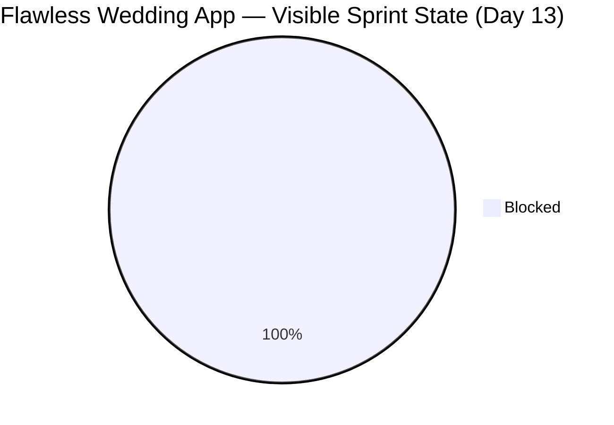
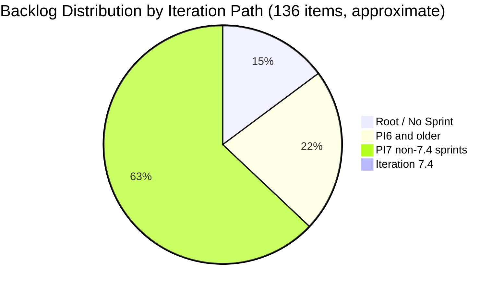

# SAFe Iteration Audit — Flawless Wedding App Team

## 1. Audit Metadata

| Field | Value |
|-------|-------|
| **Project** | Flawless Wedding App |
| **Team** | Flawless Wedding App Team |
| **Workspace** | `ado_fl_dev` |
| **ADO Project ID** | 92b967dc-5ec7-4874-b8f5-e43b00d88339 |
| **ADO Team ID** | 7d90ecbf-d272-4b0c-b33b-c66d96a790ac |
| **Iteration** | Iteration 7.4 |
| **Iteration Start** | 2026-05-18 |
| **Iteration Finish** | 2026-05-31 |
| **Audit Date** | 2026-05-30 |
| **Audit Day** | Day 13 of 14 |
| **Prior Audit** | AUDIT_20260529_0900.md (Day 12, Iteration 7.4, 67.1 — Moderate Risk) |
| **Overall Score** | **67.1 / 100** |
| **Risk Band** | **Moderate Risk** |

---

## 2. Executive Summary

The Flawless Wedding App Team holds at **67.1 / 100 (Moderate Risk)** on Day 13 of Iteration 7.4 — **unchanged from Day 12**, with one significant negative development: item 204400 (Updated UI for Account and Subscription renewal) has **regressed from "Ready for UAT" back to "Blocked"** as of 2026-05-29T09:14:51. The prior audit noted the item advancing to Ready for UAT as a positive signal; that advancement has since been reversed in ADO.

**Critical concern for sprint close:** 204400 is the sole remaining item in the current iteration visible pool (1 item, 2 SP). It is now in Blocked state. If it cannot be unblocked and closed by May 31, the sprint closes at 0.0 Delivery Predictability on the visible pool.

**Backlog structural issue persists:** 136 visible backlog items with 1 in the current iteration yields an Iteration Planning score of 0.7 — the lowest in the portfolio. No backlog pruning activity has occurred.

**Positive signals in the pipeline:** Multiple Iteration 7.5 items (204932, 204934, 204935, 204936, 204938, 204939, 204940, 204747, 204932, 205105, 201825, 201826, 201827, 201828, 201831, 201216) are in "Estimation" or "Ready for Dev" state — indicating active grooming for the next sprint. Three retrospective items (205195, 205198, 205232) were added to 7.5 on 2026-05-29. Three IP sprint defects (204439, 204688, 204755) are in Estimation state in 7.6 — forward planning is progressing.

**Net sprint result (historical):** The team delivered 16 SP (80% of 20 SP committed) through Day 11. The current visible pool of 1 item (2 SP) represents the tail end of an otherwise strong sprint.

---

## 3. Previous Audit Delta

**Prior audit:** AUDIT_20260529_0900.md — Iteration 7.4, Day 12, Score 67.1 / 100 (Moderate Risk)

| Dimension | Day 12 | Day 13 | Delta | Driver |
|-----------|--------|--------|-------|--------|
| Iteration Planning | 0.7 | **0.7** | 0.0 | 1 item in 7.4 / 136 backlog; no change |
| Team Capacity | 100.0 | **100.0** | 0.0 | 13 hrs/day; 2 days off; unchanged |
| Estimation | 100.0 | **100.0** | 0.0 | 204400 has 2 SP; unchanged |
| DoR Compliance | 100.0 | **100.0** | 0.0 | 204400 passes Description + AC; unchanged |
| Work Item Balance | 70.0 | **70.0** | 0.0 | 1 US = 100% dominant > 60% → -30; structural |
| Backlog Refinement | 99.3 | **99.3** | 0.0 | 135/136 fresh; 201569 still 1 day outside window |
| Delivery Predictability | 0.0 | **0.0** | 0.0 | 204400 regressed to Blocked; 0/2 SP |
| **Overall** | **67.1** | **67.1** | **0.0** | Score locked; 204400 state regression |

**Day 13 key observations:**
- Item 204400 regressed from "Ready for UAT" (as reported in Day 12 audit at 2026-05-29 morning) back to "Blocked" at 2026-05-29T09:14:51. The current API data for this audit confirms the Blocked state.
- New items added to 7.5 on 2026-05-29: 205195 ([Retro] Alternative to Figma), 205198 ([Retro] Design Deliverables), 205232 (Iteration 7.5 Collaborations). These are in 7.5, not affecting 7.4 scoring.
- The total backlog count is 136 items — same as Day 12.
- Item 201569 (Spike, Iteration 7.1, Ready, ChangedDate 2026-04-13) remains the only item outside the 45-day freshness window.

---

## 4. Current Iteration Snapshot

| Attribute | Value |
|-----------|-------|
| Active Iteration | Iteration 7.4 |
| Sprint Duration | 2026-05-18 to 2026-05-31 (14 days) |
| Audit Day | **Day 13 of 14** |
| Current Iteration Root Items (visible) | **1** |
| Total Visible Backlog Root Items | **136** |
| Sprint Load % | **0.7%** |
| Committed Story Points (visible pool) | **2 SP** |
| Closed Story Points (visible pool) | **0 SP** |
| Delivery % (visible pool) | **0.0%** |
| Current Sprint Items | 1 (204400 — Updated UI for Account/Subscription renewal, **Blocked**) |
| Active Team Members w/ Work | 1 (Luke Abram Colina — sole assignee on 204400) |
| Capacity Configured | Yes — 13 hrs/day; 2 days off |
| Historical delivery (through Day 11) | 11 items closed, 16 SP delivered (80.0%) |
| Remaining Days | **1 (May 31)** |

**Historical context:** 16 of 20 committed SP were delivered by Day 11. Item 204400 (2 SP) was the sole remaining item. It briefly reached "Ready for UAT" on Day 12 morning before reverting to Blocked. 1 day remains to resolve the block and close.

---

## 5. Work Item Analysis

### 5.1 Current Iteration Item (Iteration 7.4)

| ID | Title | Type | State | SP | AssignedTo | DoR | ChangedDate |
|----|-------|------|-------|----|------------|-----|-------------|
| 204400 | Updated UI for Account and Subscription renewal | User Story | **Blocked** | 2 | Luke Abram Colina | PASS | 2026-05-29 |

**DoR Check for 204400:**
- Description: Full multi-scenario user story with web + mobile renewal touchpoints — PASS (well above 30 chars)
- Acceptance Criteria: 7 detailed Given/When/Then scenarios (View updated Account UI, Renewal notification, Renew from dashboard, Renew from in-app, Renew via email, Login with expired subscription, Navigate to renewal modal) — PASS (well above 20 chars)

**State regression note:** Item 204400 was reported as "Ready for UAT" in the Day 12 audit based on an earlier data snapshot (2026-05-29 morning). The current API confirms the state is **Blocked** as of 2026-05-29T09:14:51. The blocker that was briefly resolved (or the "Ready for UAT" state was set and then the item was pushed back) has returned. The nature of the current blocker is not visible in ADO fields.

### 5.2 Notable Backlog Items (Iteration 7.5 pipeline)

| ID | Title | Type | State | IterationPath | ChangedDate |
|----|-------|------|-------|---------------|-------------|
| 202747 | Mobile Subscription Management for Bride Access | Enabler | Ready for Dev | 7.5 | 2026-05-28 |
| 201216 | Integration with Existing APIs | Enabler | Estimation | 7.5 | 2026-05-25 |
| 201825 | Send Message to Vendor | User Story | Estimation | 7.5 | 2026-05-25 |
| 201826 | Receive Messages | User Story | Estimation | 7.5 | 2026-05-25 |
| 201827 | View Conversation History | User Story | Estimation | 7.5 | 2026-05-25 |
| 201828 | Real-time Chat | User Story | Estimation | 7.5 | 2026-05-25 |
| 201831 | Message Notifications | User Story | Estimation | 7.5 | 2026-05-25 |
| 204932–204940 | Landing Page / Subscription UI Polish | User Story | Estimation | 7.5 | 2026-05-28 |
| 205105 | MobileApp Staging Environment for User Testing | Enabler | Estimation | 7.5 | 2026-05-28 |
| 205195 | [Retro] Alternative to Figma | Spike | New | 7.5 | 2026-05-29 |
| 205198 | [Retro] Design Deliverables back on track | Spike | New | 7.5 | 2026-05-29 |
| 205232 | Iteration 7.5 Collaborations, Reports & Others | Spike | New | 7.5 | 2026-05-29 |

The Iteration 7.5 pipeline is well-stocked with messaging, subscription, and polish stories in Estimation state. Three IP sprint defects (204439, 204688, 204755) are in Estimation state for 7.6 — appropriate forward planning.

### 5.3 Stale Item — Near Boundary

| ID | Title | Type | State | IterationPath | ChangedDate |
|----|-------|------|-------|---------------|-------------|
| 201569 | Follow Up Netlify Access and Github Transfer | Spike | Ready | Iteration 7.1 | 2026-04-13 |

Item 201569 remains 17 days outside the 45-day freshness window. It is assigned to Iteration 7.1 (January 2026) and still shows "Ready" state. This item likely represents resolved work (Netlify/GitHub transfer) that was never formally closed.

---

## 6. SAFe Compliance Scorecard

| Dimension | Score | Evidence | Notes |
|-----------|-------|----------|-------|
| Iteration Planning | 0.7 | 1 current iteration item / 136 visible backlog | API artifact + large ungroomed backlog; 11 closed items (16 SP) absent from API |
| Team Capacity | 100.0 | 13 hrs/day; 2 days off; 1 contributor (Luke) with current work | Full capacity configured |
| Estimation | 100.0 | 1/1 items with SP > 0; 204400 = 2 SP | Complete estimation on visible sprint item |
| DoR Compliance | 100.0 | 1/1 items pass Description ≥ 30 chars AND AC ≥ 20 chars | 7-scenario AC; exemplary quality |
| Work Item Balance | 70.0 | US=1/1 (100%) dominant > 60% → -30; single-item sprint | Structural; formula artifact of reduced visible pool |
| Backlog Refinement | 99.3 | 135/136 items fresh (changed after 2026-04-15); item 201569 changed 2026-04-13 | Near-perfect; one legacy item outside fresh window |
| Delivery Predictability | 0.0 | 0 SP closed / 2 SP committed; 204400 in Blocked state | Day 13; item regressed from Ready for UAT to Blocked |
| **Overall** | **67.1** | Average of 7 dimensions | **Moderate Risk** |

---

## 7. Dimension Findings

### 7.1 Iteration Planning (0.7 — Critical Risk)
The 0.7 score (1/136) is the most severe structural weakness across all three audited workspaces. It reflects the combination of: (1) 11 sprint items closed and dropped from the backlog API, reducing the numerator from 14 to 1; and (2) a 136-item backlog that has not been pruned despite the team completing most of the PI7 sprint work. The large backlog contains legacy items from PI4, PI5, and PI6 that are unlikely candidates for near-term sprint work. A structured grooming session to close, archive, or deprioritize these items is the single highest-impact structural improvement available to this team.

### 7.2 Team Capacity (100.0 — Low Risk)
13 hrs/day configured with 2 days off. Luke Abram Colina is the sole contributor with current iteration work (204400). Ressa Paracuelles and other team members appear in the 7.5 pipeline (e.g., 201826: Ressa on Estimation items) but have no active 7.4 items. Capacity is fully configured against the assigned contributor.

### 7.3 Estimation (100.0 — Low Risk)
Item 204400 has 2 SP. The single visible sprint item is fully estimated.

### 7.4 DoR Compliance (100.0 — Low Risk)
Item 204400 has an exemplary Definition of Ready — a clear business context (subscription renewal for web users), multi-channel scope (dashboard, in-app, email), and 7 acceptance scenarios with explicit Given/When/Then structure. Among the three audited teams today, this item has the highest AC quality.

### 7.5 Work Item Balance (70.0 — Moderate Risk)
With 1 User Story representing 100% of the visible sprint pool, the dominant-type penalty of -30 applies. This is a formula artifact of the reduced visible pool (1 item), not a reflection of poor sprint design. The actual sprint (at its peak commitment of 14 items) had a more diverse type distribution.

### 7.6 Backlog Refinement (99.3 — Low Risk)
135 of 136 visible backlog items have ChangedDate after 2026-04-15. The sole exception is item 201569 (Spike, Iteration 7.1, Ready, last changed 2026-04-13) — now 17 days outside the fresh window, up from 16 days yesterday. No items cross the 90-day stale threshold (all items had bulk updates on 2026-05-19/20 as a minimum). No stale_180 items. The single current sprint item (204400, changed 2026-05-29) is current.

**Note on 201569:** This Spike represents a Netlify/GitHub transfer request from the client (Cricket). Given the team's current development posture (web + mobile platform updates in 7.5/7.6), this transfer was likely completed months ago. The item should be closed with a closure note or formally archived.

### 7.7 Delivery Predictability (0.0 — Critical Risk)
Item 204400 is in **Blocked** state — not Closed or Done. The formula scores 0/2 = 0.0.

**Key context:** The item was briefly in "Ready for UAT" state on 2026-05-29 morning (per the Day 12 data snapshot), but regressed to Blocked at 2026-05-29T09:14:51. The blocker is unknown from ADO fields. The UAT dependency referenced in prior meeting notes (AB#204700) may be the cause of the regression, or a new blocker was encountered during UAT.

**Sprint close path:** The UAT reviewer or Luke must resolve the blocker and complete UAT by May 31. If the UAT cannot be completed by sprint end, the item should be transitioned to Iteration 7.5 (with a note explaining the blocker and the partial UAT work done) to prevent a Blocked item from carrying over at sprint close.

---

## 8. Risks and Bottlenecks

| Risk | Severity | Items Affected | Status |
|------|----------|----------------|--------|
| 204400 regressed to Blocked — sprint closes tomorrow | **Critical** | 204400 (2 SP) | Was Ready for UAT on Day 12 morning; now Blocked since 09:14 PHT |
| Iteration Planning 0.7 — critical structural issue | **High** | Backlog (136 items) | Persistent; requires dedicated grooming |
| 201569 (Spike, Iteration 7.1, Ready) stale — 17 days outside fresh window | Medium | 201569 | Should be closed or archived; staleness worsening daily |
| Delivery Predictability 0.0 — compounded by blocker regression | Medium | Score | Recovery requires unblocking 204400 within 1 day |
| Backlog contains PI4/PI5/PI6 legacy items not pruned | Medium | ~30+ items | Structural drag on Iteration Planning score |
| 7.5 retro spikes (205195, 205198) have no AC beyond high-level bullets | Low | 205195, 205198 | Below DoR for sprint commitment; acceptable for retro items |

---

## 9. Prioritized Recommendations

1. **Resolve the blocker on 204400 immediately.** The item's regression from "Ready for UAT" to "Blocked" on 2026-05-29 must be investigated today (May 30). Luke and the UAT reviewer must identify what caused the revert — whether a UAT failure, a dependency, or an environment issue — and resolve it. If UAT can complete by EOD May 30, close 204400 and recover DP to 100% (overall score ~81.5, Low Risk).

2. **If 204400 cannot be unblocked by May 31, move it to Iteration 7.5.** Do not carry a Blocked item through sprint close without a plan. Add a comment in ADO explaining: the blocker cause, what UAT work was completed, and the intended resolution path in 7.5. This preserves audit trail integrity.

3. **Initiate a dedicated backlog grooming session for Iteration 7.5 planning (this week).** The 136-item backlog is the most significant recurring drag on this team's audit score. Target items in PI4, PI5, and PI6 iteration paths (IDs in the 187xxx–196xxx range) for closure or archival. Reducing the visible backlog from 136 to ~60–80 items would move the Iteration Planning score from 0.7 to a more competitive range in future sprints.

4. **Close or archive item 201569 (Spike, Iteration 7.1, Follow Up Netlify Access and Github Transfer).** This item is now 17 days outside the 45-day freshness window. If the Netlify/GitHub transfer was completed (highly likely given current codebase activity), close with a note. If unresolved, escalate to the product owner.

5. **Document the UAT outcome for 204400 in ADO before closing.** Whether UAT passed or the item moves to 7.5, add a comment recording which scenarios were tested, the UAT reviewer, the result, and any defects found. This ensures the subscription renewal feature has a complete audit trail.

6. **Establish a daily ADO close cadence for Iteration 7.5.** The velocity burst pattern (multiple items closed in rapid succession on Day 11) distorts audit metrics and creates artificial risk scores on subsequent days. Implementing a daily close practice — closing items in ADO within 24 hours of actual completion — would smooth the delivery curve and stabilize the Delivery Predictability dimension throughout the sprint.

7. **Ensure 7.5 items are formally estimated and ready before Iteration 7.4 retrospective.** Multiple 7.5 items are in "Estimation" state but do not yet have Story Points confirmed. Run estimation for the messaging cluster (201825, 201826, 201827, 201828, 201831) and the subscription polish cluster (204932–204940) before the sprint starts.

---

## 10. Evidence Gaps and Limitations

- **204400 blocker cause unknown.** The ADO field data does not include a blocker description or root cause for the state regression from "Ready for UAT" to "Blocked." The AB#204700 UAT dependency referenced in prior meeting notes remains a candidate, but this cannot be confirmed from ADO fields alone.
- **Closed items API artifact (major):** 11 items closed on Day 11 (201790, 201791, 201794, 201796, 201797, 201799, 201800, 201801, 204047, 204691, 204750) are absent from today's backlog API. The Iteration Planning score of 0.7 and Delivery Predictability of 0.0 are severely impacted by this artifact. Actual sprint delivery through Day 11 was 16/20 SP (80.0%).
- **204047 (Spike, Iteration Collaborations) still unconfirmed.** This item appeared in the Day 11 sprint as an Active Spike for Ressa Paracuelles. It is absent from today's backlog — presumed closed or removed. No API confirmation available.
- **Full backlog ChangedDate coverage (136 items).** All 136 visible backlog items were retrieved across three batch API calls. The only item outside the 45-day fresh window is 201569 (2026-04-13). No items cross 90-day or 180-day thresholds.
- **Capacity individual breakdown.** work_get_iteration_capacities returned 13 hrs/day team total with 2 days off. Prior audit data confirmed approximately Luke=6 hrs, Ressa=6 hrs, Luzmibel=1 hr — this audit uses team-level aggregate only.

---

## Appendix: Score Visualization

**Score Trend (Iteration 7.4 — selected days):**

| Day | Score | Risk Band | Key Change |
|-----|-------|-----------|------------|
| Day 10 | 68.6 | Moderate | 0 SP closed (artifact); 14 sprint items, 20 SP |
| Day 11 | 80.0 | Low | 11 items closed; 16/20 SP; DP = 80% — peak score |
| Day 12 | 67.1 | Moderate | 11 closed items dropped from API; 1 item (Ready for UAT) |
| **Day 13** | **67.1** | **Moderate** | 204400 regressed to Blocked; no dimensions changed |
| Projected (204400 unblocked and closed) | ~81.5 | Low | 2/2 SP closed; DP = 100%; Low Risk restored |

**SAFe Compliance Dimensions — Day 13:**

| Dimension | Score | Band |
|-----------|-------|------|
| Iteration Planning | 0.7 | Critical |
| Team Capacity | 100.0 | Low |
| Estimation | 100.0 | Low |
| DoR Compliance | 100.0 | Low |
| Work Item Balance | 70.0 | Moderate |
| Backlog Refinement | 99.3 | Low |
| Delivery Predictability | 0.0 | Critical |
| **Overall** | **67.1** | **Moderate** |
