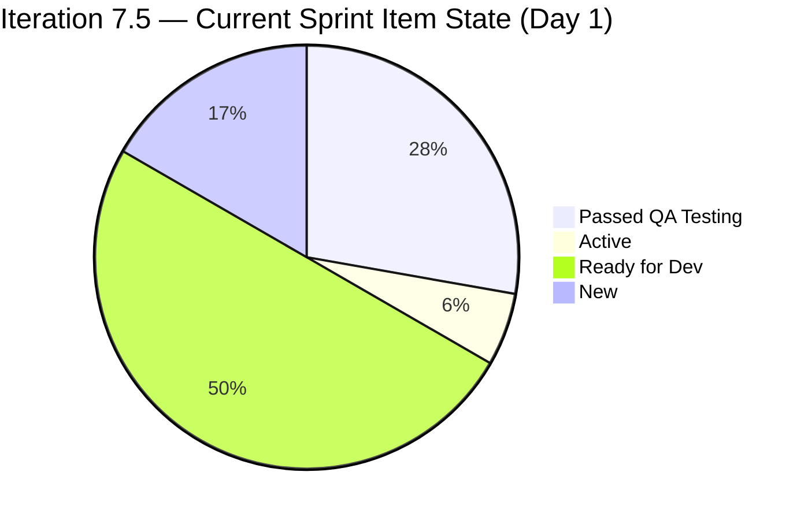
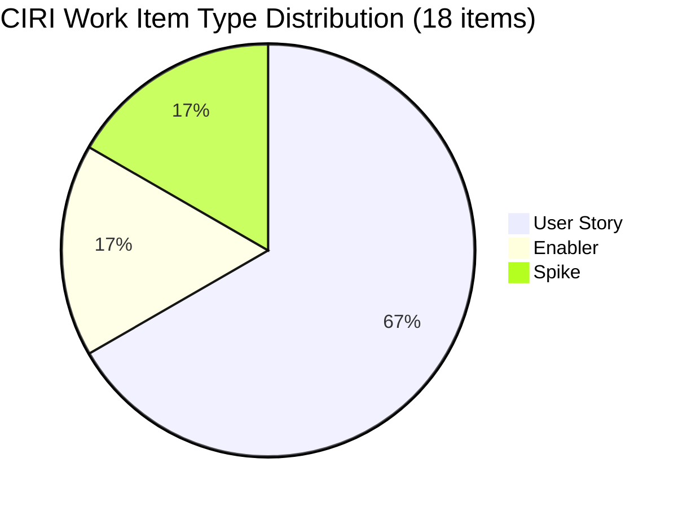
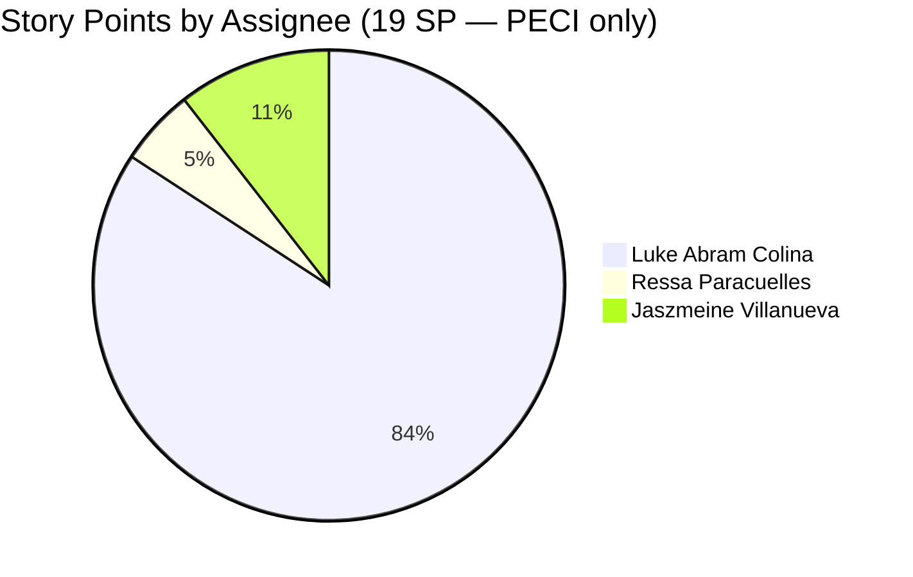

# SAFe Iteration Audit — Flawless Wedding App Team

## 1. Audit Metadata

| Field | Value |
|-------|-------|
| **Project** | Flawless Wedding App |
| **Team** | Flawless Wedding App Team |
| **Workspace** | `ado_fl_dev` |
| **ADO Project ID** | 92b967dc-5ec7-4874-b8f5-e43b00d88339 |
| **ADO Team ID** | 7d90ecbf-d272-4b0c-b33b-c66d96a790ac |
| **Iteration** | Iteration 7.5 |
| **Iteration Start** | 2026-06-01 |
| **Iteration Finish** | 2026-06-14 |
| **Sprint Day** | Day 1 of 14 |
| **Audit Date/Time** | 2026-06-01 02:03 UTC-6 |
| **Prior Audit** | AUDIT_20260530_0900.md (Iteration 7.4, Day 13, Score 67.1 — Moderate Risk) |
| **Overall Score** | **63.3 / 100** |
| **Risk Band** | **Moderate Risk** |

---

## 2. Executive Summary

The Flawless Wedding App Team opens Iteration 7.5 on **Day 1 with a score of 63.3 / 100 (Moderate Risk)**, a slight dip from the prior Day 13 score of 67.1. The sprint launches with an exceptionally well-stocked current iteration: 18 items committed across 12 User Stories, 3 Enablers, and 3 Spikes, with a committed load of 19 story points. Multiple items (204932–204938) have already reached "Passed QA Testing" state, indicating strong pre-sprint momentum carried from Iteration 7.4.

**Key strengths:** Estimation is complete at 100% (all 15 point-eligible items carry SP). Backlog Refinement holds at 99.3 — the team's persistent strength. DoR is 94.4%, with only one Spike (205198) missing acceptance criteria. The sprint pipeline is rich and ready, with the messaging cluster (201825–201831) all in "Ready for Dev" state.

**Top risks:** Iteration Planning scores 12.6 (18 of 143 visible items) — the structural backlog inflation continues to suppress this dimension. Delivery Predictability is 0.0 on Day 1, which is expected at sprint start but 5 items already in "Passed QA Testing" are one close action away from recovering this dimension significantly. Jaszmeine Villanueva carries 2 Spike items (205195, 205198) but does not appear in the capacity configuration — her contributions are unplanned from a capacity standpoint.

---

## 3. Previous Audit Delta

**Prior audit:** AUDIT_20260530_0900.md — Iteration 7.4, Day 13, Score 67.1 / 100 (Moderate Risk)

| Dimension | Iter 7.4 Day 13 | Iter 7.5 Day 1 | Delta | Driver |
|-----------|-----------------|----------------|-------|--------|
| Iteration Planning | 0.7 | **12.6** | **+11.9** | New sprint: 18 items in 7.5 vs. 1 in 7.4 (visible) |
| Team Capacity | 100.0 | **66.7** | **-33.3** | Jaszmeine Villanueva has current work but no capacity config |
| Estimation | 100.0 | **100.0** | 0.0 | Full estimation maintained; 15/15 PECI with SP |
| DoR Compliance | 100.0 | **94.4** | **-5.6** | 205198 missing AC; 17/18 CIRI pass |
| Work Item Balance | 70.0 | **70.0** | 0.0 | US=12/18 (66.7%) dominant > 60% → -30; same penalty |
| Backlog Refinement | 99.3 | **99.3** | 0.0 | 142/143 fresh; 201569 still outside window |
| Delivery Predictability | 0.0 | **0.0** | 0.0 | Day 1; no items Closed/Done; early-sprint expected |
| **Overall** | **67.1** | **63.3** | **-3.8** | Team Capacity drop offsets IP gain |

**Transition note:** Iteration 7.4 closed with 204400 (Blocked, 2 SP) as the sole visible remaining item. That item has departed the backlog API (likely moved or closed at sprint end). Iteration 7.5 begins fresh with a significantly larger committed pool. The 5 items in "Passed QA Testing" state indicate real work was completed before or at sprint start.

---

## 4. Current Iteration Snapshot

| Attribute | Value |
|-----------|-------|
| Active Iteration | Iteration 7.5 |
| Sprint Duration | 2026-06-01 to 2026-06-14 (14 days) |
| Audit Day | **Day 1 of 14** |
| Current Iteration Root Items (CIRI) | **18** |
| Total Visible Backlog Root Items (VRBI) | **143** |
| Sprint Load % | **12.6%** |
| Committed Story Points (CSP, PECI with SP) | **19 SP** |
| Closed Story Points (CLSP) | **0 SP** (Day 1; no items Closed/Done) |
| Items in Passed QA Testing | 5 (204932, 204934, 204935, 204936, 204938) |
| Delivery % (visible pool) | **0.0%** (Day 1 — early sprint, low delivery expected) |
| Active Team Members with Current Work (CW) | 3 (Luke Abram Colina, Ressa Paracuelles, Jaszmeine Villanueva) |
| Members with Capacity Configured (CC) | 2 (Luke — Development; Ressa — Testing) |
| Total Team Capacity Per Day | 0 hrs/day configured (activities set, no daily hours) |
| Days Off This Sprint | 0 |

---

## 5. Work Item Analysis

### 5.1 Current Iteration Items (Iteration 7.5)

| ID | Title | Type | State | SP | Assignee | DoR | ChangedDate |
|----|-------|------|-------|----|----------|-----|-------------|
| 204932 | Update Landing Page CTA Wording | User Story | Passed QA Testing | 0.5 | Luke Colina | PASS | 2026-06-01 |
| 204934 | Remove "Best Value" Badge from Single Subscription Package | User Story | Passed QA Testing | 0.5 | Luke Colina | PASS | 2026-06-01 |
| 204935 | Remove Non-Functional Three-Dot UI Elements | User Story | Passed QA Testing | 0.5 | Luke Colina | PASS | 2026-06-01 |
| 204936 | Update Budget Currency Label | User Story | Passed QA Testing | 0.5 | Luke Colina | PASS | 2026-06-01 |
| 204938 | Add Email Field and Update Required Fields for Existing Vendors | User Story | Passed QA Testing | 0.5 | Luke Colina | PASS | 2026-06-01 |
| 204939 | Update Subscription Renewal Notification Messaging | User Story | Ready for Dev | 0.5 | Luke Colina | PASS | 2026-06-01 |
| 204940 | Implement Subscription Reminder Frequency | User Story | Ready for Dev | 2 | Luke Colina | PASS | 2026-06-01 |
| 202747 | Mobile Subscription Management for Bride Access | Enabler | Active | 2 | Luke Colina | PASS | 2026-06-01 |
| 205105 | MobileApp Staging Environment for User Testing | Enabler | Ready for Dev | 1 | Luke Colina | PASS | 2026-06-01 |
| 201216 | Integration with Existing APIs | Enabler | Ready for Dev | 1 | Luke Colina | PASS | 2026-06-01 |
| 201825 | Send Message to Vendor | User Story | Ready for Dev | 2 | Luke Colina | PASS | 2026-06-01 |
| 201826 | Receive Messages | User Story | Ready for Dev | 3 | Luke Colina | PASS | 2026-06-01 |
| 201827 | View Conversation History | User Story | Ready for Dev | 2 | Luke Colina | PASS | 2026-06-01 |
| 201828 | Real-time Chat | User Story | Ready for Dev | 1 | Luke Colina | PASS | 2026-06-01 |
| 201831 | Message Notifications | User Story | Ready for Dev | 3 | Luke Colina | PASS | 2026-06-01 |
| 205195 | [Retro] Alternative to Figma | Spike | New | 1 | Jaszmeine Villanueva | PASS | 2026-06-01 |
| 205198 | [Retro] Design Deliverables back on track | Spike | New | 1 | Jaszmeine Villanueva | **FAIL** | 2026-06-01 |
| 205232 | Iteration 7.5 Collaborations, Reports & Others | Spike | New | 1 | Ressa Paracuelles | PASS | 2026-05-29 |

**DoR Check for 205198 (FAIL):**
- Description: "design items to be provided completely before iteration starts" — stripped length ~62 chars ≥ 30 → PASS
- Acceptance Criteria: field is absent/null → 0 chars < 20 → **FAIL**

**Ownership concentration note:** Luke Abram Colina is assigned to 15 of 18 CIRI items (83%). The messaging cluster (201825–201831) is entirely on Luke, representing 11 SP of the sprint's 16 User Story SP. This creates significant delivery risk if Luke encounters any interruption.

### 5.2 Stale Backlog Item

| ID | Title | Type | State | IterationPath | ChangedDate |
|----|-------|------|-------|---------------|-------------|
| 201569 | Follow Up Netlify Access and Github Transfer | Spike | Ready | Iteration 7.1 | 2026-04-13 |

Item 201569 is now 49 days outside the 45-day freshness window (18 days as of prior audit; has worsened). Still assigned to Iteration 7.1 with "Ready" state — this work is almost certainly complete.

---

## 6. SAFe Compliance Scorecard

| Dimension | Score | Evidence (Numerator / Denominator) | Notes |
|-----------|-------|-------------------------------------|-------|
| D1 Iteration Planning | **12.6** | 18 CIRI / 143 VRBI | Structural; 125 backlog items outside current sprint |
| D2 Team Capacity | **66.7** | 2 CC / 3 CW | Jaszmeine has sprint items but no capacity configured |
| D3 Estimation | **100.0** | 15 ECI / 15 PECI | All eligible items carry SP; complete estimation |
| D4 DoR Compliance | **94.4** | 17 DCI / 18 CIRI | 205198 missing Acceptance Criteria |
| D5 Work Item Balance | **70.0** | US=12/18 (66.7%) dominant | Penalty B (-30): dominant type > 60%; no other penalties |
| D6 Backlog Refinement | **99.3** | 142 fresh / 143 VRBI | 201569 (Apr 13) is only stale item; no stale_90/180 items |
| D7 Delivery Predictability | **0.0** | 0 CLSP / 19 CSP | Day 1 — early-sprint; 5 items in Passed QA Testing |
| **Overall** | **63.3** | Average of 7 dimensions | **Moderate Risk** |

---

## 7. Dimension Findings

### 7.1 Iteration Planning (12.6 — Critical Risk)

**Numerator:** CIRI = 18 items with IterationPath = "Flawless Wedding App\2026-PI7\Iteration 7.5"
**Denominator:** VRBI = 143 items returned by wit_list_backlog_work_items
**Formula:** round(18 / 143 * 100, 1) = round(12.587, 1) = **12.6**

This is a significant improvement from Iteration 7.4 Day 13 (0.7), driven by the new sprint committing 18 items. However, the score remains in the Critical band because 125 visible backlog items are in other iterations or the backlog root. The 143-item visible backlog includes:
- ~40+ items in "Flawless Wedding App" root path (no sprint assigned)
- ~15+ items in PI4/PI5/PI6 paths — historical artifacts
- ~30+ items in future PI7 sprints (7.6 IP, etc.)
- ~35+ items in PI8 paths — forward planning well underway

The structural issue is that closed/Done items depart the ADO backlog API, but historical and future-planned items remain visible, inflating the denominator far above what represents "current active backlog." A backlog grooming initiative targeting root and PI4-PI6 items would be the highest-leverage structural improvement available.

### 7.2 Team Capacity (66.7 — Moderate Risk)

**CW (contributors with current work):** 3 — Luke Abram Colina (15 items), Ressa Paracuelles (205232), Jaszmeine Abigaille Villanueva (205195, 205198)
**CC (contributors with capacity configured):** 2 — Luke (Development activity) and Ressa (Testing activity) appear in work_get_team_capacity. Jaszmeine Villanueva does not appear in the capacity API response at all → no activity configured.
**Formula:** round(2 / 3 * 100, 1) = **66.7**

The capacity API returns Ressa Paracuelles, Luzmibel Paculanang, and Luke Abram Colina with 0 hrs/day for all three (activities set but no daily hours entered). The total capacity per day is 0 — no individual capacity hours have been configured for this sprint. This means the team cannot perform meaningful sprint load vs. capacity analysis. Jasmeine Villanueva's exclusion from capacity planning is the key flag for D2.

### 7.3 Estimation (100.0 — Low Risk)

**PECI (point-eligible current items):** User Stories + Spikes in CIRI = 12 + 3 = 15
- User Stories: 204932, 204934, 204935, 204936, 204938, 204939, 204940, 201825, 201826, 201827, 201828, 201831
- Spikes: 205195, 205198, 205232
- Enablers excluded per rubric (not in User Story/Feature/Spike types)

**ECI:** All 15 have SP > 0 (range 0.5 SP to 3 SP)
**CSP = 0.5+0.5+0.5+0.5+0.5+0.5+2+2+3+2+1+3+1+1+1 = 19.0 SP** (User Stories: 16 SP, Spikes: 3 SP)
**Formula:** round(15 / 15 * 100, 1) = **100.0**

The Enablers (202747, 205105, 201216) also carry SP (2, 1, 1) but are excluded from PECI per rubric. The team's estimation discipline is strong — every eligible item entering the sprint carries a story point estimate.

### 7.4 DoR Compliance (94.4 — Low Risk)

**DCI (DoR-compliant current items):** 17 of 18 CIRI pass both conditions.
**Formula:** round(17 / 18 * 100, 1) = **94.4**

**Only failure — item 205198:**
- Description: "design items to be provided completely before iteration starts" — stripped text = 62 chars ≥ 30 → PASS
- Acceptance Criteria: field absent/null → 0 chars < 20 → **FAIL**

This Retro Spike was added on 2026-05-29 and needs at minimum a brief acceptance statement (e.g., "Design assets delivered and confirmed with team before Day 1 of Iteration 7.6"). The quality of other items (especially 201802 through 205105) is high — multi-scenario Given/When/Then ACs are standard for this team.

### 7.5 Work Item Balance (70.0 — Moderate Risk)

**Type distribution in CIRI (18 items):**
- User Story: 12 items (66.7%)
- Enabler: 3 items (16.7%)
- Spike: 3 items (16.7%)
- Defect: 0

**Penalty A:** User Stories present in CIRI → no penalty (-0)
**Penalty B:** dominant_type_share = 12/18 * 100 = 66.7% > 60% → **-30**
**Penalty C:** spike_share = 3/18 * 100 = 16.7% ≤ 40% → no penalty (-0)
**Formula:** max(0, 100 - 30) = **70.0**

The User Story dominance is expected — this is a feature-delivery sprint (messaging + subscription). The Enabler cluster (API integration, staging environment) provides appropriate technical scaffolding. Spike share is within range. The -30 penalty is a formula artifact; the sprint composition is architecturally sound.

### 7.6 Backlog Refinement (99.3 — Low Risk)

**Fresh window:** ChangedDate >= 2026-04-17 (45 days before 2026-06-01)
**Stale_90 threshold:** ChangedDate < 2026-03-03
**Stale_180 threshold:** ChangedDate < 2025-12-04

**Fresh VRBI:** 142 of 143 items (all except item 201569 changed 2026-04-13)
**Stale_90 items:** 0 (no item older than 90 days — bulk touched on 2026-05-19/20)
**Stale_180 items:** 0

**Base score:** round(142/143 * 100, 1) = round(99.301, 1) = **99.3**

**Penalties applied:**
- stale_90/VRBI = 0/143 = 0% → no penalty
- stale_180 ≥ 1 item → no (0 items) → no penalty
- untouched/CIRI: 205232 changed 2026-05-29 (before sprint start 2026-06-01). 1/18 = 5.6% ≤ 10% → no penalty

**D6 = max(0, 99.3 - 0) = 99.3**

Item 201569 remains the sole stale item. It is now 49 days past the fresh window. All 18 CIRI items have been updated since the sprint began (except 205232, which was touched 3 days before sprint start — well within the window for planning purposes).

### 7.7 Delivery Predictability (0.0 — Critical Risk — Early Sprint)

**CSP (committed story points):** 19.0 SP (sum of ECI story points — see D3)
**CLSP (closed story points):** 0 SP — no CIRI items have State = "Closed" or "Done"

**Formula:** round(0 / 19 * 100, 1) = **0.0**

**Early-sprint annotation:** This is Day 1 of Iteration 7.5. Zero delivery is expected at sprint start. The 0.0 score should not be interpreted as a delivery failure.

**Positive indicator:** 5 items (204932, 204934, 204935, 204936, 204938) are in "Passed QA Testing" state. These items total 2.5 SP and are one UAT sign-off away from closing. If closed today, CLSP = 2.5 SP → D7 = round(2.5/19 * 100, 1) = 13.2 → but still early sprint.

**Historical context from 7.4:** The team delivered 16/20 SP (80%) through Day 11 in the prior sprint, demonstrating strong delivery capability when items advance through UAT. The sprint velocity pattern suggests significant closures are likely in the mid-sprint window (Days 7–11).

---

## 8. Risks and Bottlenecks

| Risk | Severity | Items Affected | Status |
|------|----------|----------------|--------|
| Luke Colina owns 15/18 CIRI items (83%), including entire messaging cluster | **CRITICAL** | 201825–201831 (11 SP), 204939, 204940, 202747 | Single point of delivery failure risk |
| Iteration Planning 12.6 — structural backlog inflation persists | **HIGH** | 143-item VRBI (125 outside current sprint) | Recurring; requires dedicated grooming sessions |
| Jaszmeine Villanueva has 2 sprint items but no capacity configured | **HIGH** | 205195, 205198 | Unplanned work; capacity gap in sprint planning |
| 205198 missing Acceptance Criteria — DoR incomplete | **MEDIUM** | 205198 ([Retro] Design Deliverables) | Must be added before item can be committed to development |
| No individual capacity hours configured (all 3 members = 0 hrs/day) | **MEDIUM** | Team capacity | Cannot compute realistic load vs. capacity ratio |
| 201569 (Spike, Iter 7.1, 49 days stale) not yet closed/archived | **MEDIUM** | 201569 | Worsening daily; likely represents completed work |
| Messaging cluster (5 US, 11 SP) entirely unstarted and assigned to one contributor | **MEDIUM** | 201825–201831 | Complex feature with API + real-time requirements; concentration risk |
| Subscription reminder cluster (204939, 204940) in Ready for Dev — not yet active | **LOW** | 2.5 SP | Expected Day 1 behavior; monitor through Day 3 |

---

## 9. Prioritized Recommendations

1. **Close the 5 "Passed QA Testing" items immediately.** Items 204932, 204934, 204935, 204936, and 204938 (2.5 SP total) have passed QA and are pending final sign-off. Closing these today recovers Delivery Predictability from 0.0 to 13.2, establishes sprint momentum, and prevents them from carrying through the sprint as completed-but-open work.

2. **Add Acceptance Criteria to item 205198 ([Retro] Design Deliverables) today.** This is the sole DoR failure in the sprint. The item needs at minimum a measurable acceptance statement (e.g., "All design artifacts for Iteration 7.5 features delivered and reviewed by team before Day 7"). This takes less than 5 minutes and restores DoR to 100%.

3. **Configure Jaszmeine Villanueva's capacity in ADO for Iteration 7.5.** She owns 205195 and 205198 but does not appear in the team capacity settings. Add her to the team capacity with her activity (Design) and daily hours. This resolves the D2 gap and provides visibility into her sprint contribution.

4. **Configure individual daily capacity hours for all team members.** All three team members show 0 hrs/day despite having activities configured. Enter actual daily hours (e.g., Luke=6, Ressa=6, Luzmibel=1 or similar from prior audit data) to enable load vs. capacity planning.

5. **Redistribute the messaging cluster across team members.** Items 201825–201831 (5 User Stories, 11 SP) are all assigned to Luke. Consider reassigning at least 2–3 items to Ressa or another contributor, particularly the lower-complexity items (201827 View Conversation History, 201828 Real-time Chat) to reduce Luke's ownership concentration and the associated delivery risk.

6. **Run a focused backlog grooming session targeting PI4/PI5/PI6 legacy items.** A curated review of ~40 items in "PI 4", "PI 5", "2026-PI6", and unassigned root-path items could yield 20–30 items that can be safely closed or archived. This would reduce VRBI from 143 toward ~110, improving D1 from 12.6 toward ~16–17 — a meaningful improvement with manageable grooming effort.

7. **Close or archive item 201569 (Spike, Iteration 7.1, Follow Up Netlify Access and Github Transfer).** This item is now 49 days outside the freshness window. The Netlify/GitHub transfer described in the item was almost certainly completed months ago. Close it with a brief closure note to eliminate the sole backlog refinement gap.

8. **Activate items 204939 and 204940 (subscription reminder stories) by Day 3.** These are in "Ready for Dev" state but still unstarted. Moving them to "Active" confirms sprint commitment and helps detect early blockers in the subscription notification system.

9. **Plan the messaging cluster sprint architecture before Day 2.** Items 201825–201831 involve real-time messaging, API integration, and notification systems. Before Luke begins development, ensure the architecture approach is agreed with the team, dependencies on 201216 (Integration with Existing APIs) are mapped, and any backend API readiness is confirmed.

---

## 10. Evidence Gaps and Limitations

- **Closed items API departure (Day 1 context):** Item 204400 (Blocked, 2 SP) from Iteration 7.4 is no longer visible in the backlog API. It was the sole remaining 7.4 item at Day 13. Its state at sprint close (closed, moved to 7.5, or archived) is not confirmable from the current API snapshot. The D7 score for 7.4 would remain 0.0 based on visible data.

- **Jaszmeine Villanueva capacity gap:** Jaszmeine Abigaille Villanueva (jvillanueva@jairosoft.com) is an assignee on items 205195 and 205198 in Iteration 7.5 but does not appear in the work_get_team_capacity API response. She may not be formally added to the Flawless Wedding App Team in ADO team membership settings, even though she is a contributor in the work item system.

- **All capacity hours = 0:** work_get_team_capacity returns 0 hrs/day for all three configured team members. No meaningful load vs. capacity analysis is possible. D2 scoring relies on activity configuration (activity name present = "has capacity" per rubric definition when daysOff < 100%).

- **Enabler SP excluded from PECI:** The rubric defines PECI as "User Story, Feature, Spike" types only. The three Enabler items (202747=2SP, 205105=1SP, 201216=1SP) carry 4 SP total but are excluded from D3/D7 computation. CSP = 19 SP (PECI-only), actual total committed SP including Enablers = 23 SP.

- **"Passed QA Testing" state vs. Closed/Done:** Five items are in "Passed QA Testing" — a custom workflow state that does not map to Closed or Done per the rubric. The D7 formula scores these as 0 CLSP. If the team's close workflow involves a separate UAT sign-off step before closing, these items may represent delivered work pending final formality.

- **202747 iteration path discrepancy:** Item 202747 (Mobile Subscription Management for Bride Access) is in "Active" state and was previously noted as "Ready for Dev" in the prior audit (Day 13 of 7.4). As of today it shows Active and changed 2026-06-01T01:44:07 — work has begun. No description issue; the iteration assignment to 7.5 is correct.

- **202777 (Spike, "End PI7 - Team and Technical Agility") in capacity pool:** This item is in Iteration 7.6 (IP), not 7.5, but appeared in VRBI. It is correctly excluded from CIRI.

---

## Appendix: Score Visualization

**SAFe Dimension Scorecard — Iteration 7.5 Day 1:**

| Dimension | Score | Band | Trend vs 7.4 Day 13 |
|-----------|-------|------|---------------------|
| D1 Iteration Planning | 12.6 | Critical | +11.9 (sprint transition) |
| D2 Team Capacity | 66.7 | Moderate | -33.3 (Jaszmeine gap) |
| D3 Estimation | 100.0 | Low | 0.0 (stable) |
| D4 DoR Compliance | 94.4 | Low | -5.6 (205198 AC gap) |
| D5 Work Item Balance | 70.0 | Moderate | 0.0 (same penalty) |
| D6 Backlog Refinement | 99.3 | Low | 0.0 (stable) |
| D7 Delivery Predictability | 0.0 | Critical | 0.0 (Day 1 — expected) |
| **Overall** | **63.3** | **Moderate** | **-3.8** |

**Score Trend (selected audits):**

| Audit Date | Iteration | Day | Score | Risk Band |
|------------|-----------|-----|-------|-----------|
| 2026-05-29 | Iter 7.4 | 12 | 67.1 | Moderate |
| 2026-05-30 | Iter 7.4 | 13 | 67.1 | Moderate |
| **2026-06-01** | **Iter 7.5** | **1** | **63.3** | **Moderate** |
| Projected (Day 5, if 5 QA items closed) | Iter 7.5 | 5 | ~68–72 | Moderate→Low |
| Projected (Day 11, if messaging cluster closes) | Iter 7.5 | 11 | ~78–85 | Low |
