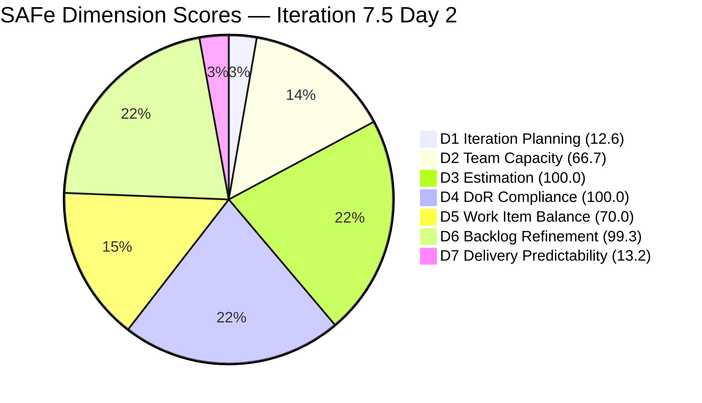
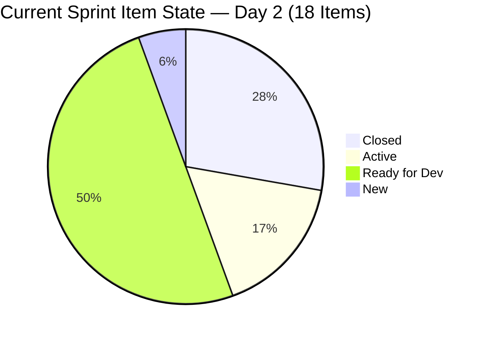
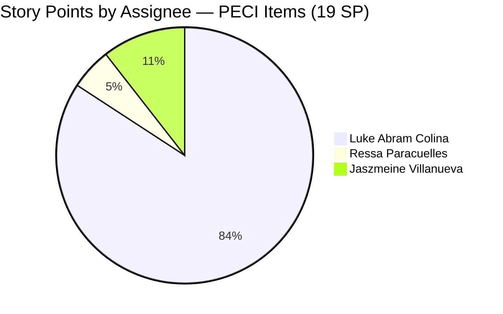

Excellent data. Now I have everything I need. Let me compute all dimensions carefully.

**Key findings from the data:**

**CIRI = 18 root items** (confirmed)
**VRBI = 143** (from backlog API)

**States:**
- Closed: 204932, 204934, 204935, 204936, 204938 → 5 items (0.5+0.5+0.5+0.5+0.5 = 2.5 SP)
- Active: 202747, 205198, 205232 → 3 items
- Ready for Dev: 201825, 201826, 201827, 201828, 201831, 201216, 204939, 204940, 205105 → 9 items
- New: 205195 → 1 item

**Work item types:**
- User Story: 201825, 201826, 201827, 201828, 201831, 204932, 204934, 204935, 204936, 204938, 204939, 204940 → 12
- Enabler: 201216, 202747, 205105 → 3
- Spike: 205195, 205198, 205232 → 3

**Assignees with current work (CW):**
- Luke Abram Colina: 201825, 201826, 201827, 201828, 201831, 201216, 204932, 204934, 204935, 204936, 204938, 204939, 204940, 202747, 205105 → 15 items
- Jaszmeine Villanueva: 205195, 205198 → 2 items
- Ressa Paracuelles: 205232 → 1 item
- CW = 3

**Capacity:** The capacity API returned team level only (0), no individual breakdown. Prior audit showed Ressa and Luke have activities but 0 hrs/day. Jaszmeine still not in capacity. CC = 2.

**ChangedDate analysis for freshness (45-day window from 2026-06-02 → must be >= 2026-04-18):**
- All 18 CIRI items were changed in June 2026 → all fresh
- Need to check for stale items in VRBI. Prior audit showed 201569 stale (changed 2026-04-13). Checking: 2026-04-13 < 2026-04-18 → stale. Need to verify how many total fresh/stale from VRBI.

From prior audit: 142/143 fresh (only 201569 stale). 201569 was last changed 2026-04-13 and appears still in the backlog. With today being 2026-06-02, the 45-day window is >= 2026-04-18. 201569 changed 2026-04-13 = still stale (50 days old). So fresh VRBI = 142.

**Stale_90 threshold:** 2026-06-02 - 90 days = 2026-03-04. No items older than that per prior audit.
**Stale_180 threshold:** 2026-06-02 - 180 days = 2025-12-04. No items older than that per prior audit.

**Untouched items (ChangedDate < iteration start 2026-06-01):**
- 205232: ChangedDate = 2026-06-02T02:42:53 → after sprint start → NOT untouched
- ALL 18 CIRI items were changed on/after 2026-06-01 → untouched = 0

Wait, let me re-check. Prior audit had 205232 changed 2026-05-29. But now API shows 2026-06-02T02:42:53. It's been updated since the sprint started.

All 18 items have ChangedDate >= 2026-06-01 → 0 untouched items.

**DoR check:**
- Description >= 30 non-whitespace chars AND AcceptanceCriteria >= 20 non-whitespace chars
- 205198: Description "design items to be provided completely before iteration starts" - NOW has AC: "By end of iteration 7.5 we will have both Design approval..." → AC is now present with substantial text → PASS
- All 18 items have both Description and AC → DoR = 18/18 = 100.0

**PECI (User Stories + Spikes eligible for SP):**
- User Stories: 12 items (all have SP > 0)
- Spikes: 3 items (all have SP = 1)
- PECI = 15, ECI = 15 (all have SP > 0) → Estimation = 100.0

**Story Points:**
- User Stories SP: 204932=0.5, 204934=0.5, 204935=0.5, 204936=0.5, 204938=0.5 (5 items = 2.5 SP)
- 204939=0.5, 204940=2 (2 items = 2.5 SP)
- 201825=2, 201826=3, 201827=2, 201828=1, 201831=3 (5 items = 11 SP)
- Total US SP = 2.5 + 2.5 + 11 = 16 SP

Spikes: 205195=1, 205198=1, 205232=1 = 3 SP
CSP = 16 + 3 = 19 SP (same as prior audit)

**Closed SP (CLSP):**
- 204932 (Closed, 0.5), 204934 (Closed, 0.5), 204935 (Closed, 0.5), 204936 (Closed, 0.5), 204938 (Closed, 0.5) → 2.5 SP

**Delivery Predictability:**
- D7 = round(2.5 / 19 * 100, 1) = round(13.158, 1) = **13.2**
- Sprint day: today is 2026-06-02, sprint started 2026-06-01 → Day 2 of 14 (early sprint)

Now let me compute all 7 dimensions:

**D1 Iteration Planning:** round(18/143 * 100, 1) = round(12.587, 1) = **12.6**
**D2 Team Capacity:** round(2/3 * 100, 1) = **66.7**
**D3 Estimation:** round(15/15 * 100, 1) = **100.0**
**D4 DoR Compliance:** round(18/18 * 100, 1) = **100.0** (205198 now has AC!)
**D5 Work Item Balance:** US=12/18=66.7% > 60% → -30. No Defect penalty (US present). Spike=3/18=16.7% ≤ 40%. Score = max(0, 100-30) = **70.0**
**D6 Backlog Refinement:** base=round(142/143*100,1)=99.3. stale_90=0 → no penalty. stale_180=0 → no penalty. untouched=0/18=0% → no penalty. D6 = **99.3**
**D7 Delivery Predictability:** round(2.5/19*100,1) = **13.2**

**Overall:** (12.6+66.7+100.0+100.0+70.0+99.3+13.2)/7 = 461.8/7 = 65.971... = **66.0**

Now I have all the data needed to compose the full report.

# ADO SAFe Audit — Flawless Wedding App Team

## 1. Audit Metadata

| Field | Value |
|-------|-------|
| **Project** | Flawless Wedding App |
| **Team** | Flawless Wedding App Team |
| **Workspace** | `ado_fl_dev` |
| **ADO Project ID** | 92b967dc-5ec7-4874-b8f5-e43b00d88339 |
| **ADO Team ID** | 7d90ecbf-d272-4b0c-b33b-c66d96a790ac |
| **Iteration** | Iteration 7.5 |
| **Iteration Start** | 2026-06-01 |
| **Iteration Finish** | 2026-06-14 |
| **Sprint Day** | Day 2 of 14 |
| **Audit Date/Time** | 2026-06-02 (UTC) |
| **Prior Audit** | AUDIT_20260601_0203.md (Iteration 7.5, Day 1, Score 63.3 — Moderate Risk) |
| **Overall Score** | **66.0 / 100** |
| **Risk Band** | **Moderate Risk** |

---

## 2. Executive Summary

The Flawless Wedding App Team enters **Day 2 of Iteration 7.5 with a score of 66.0 / 100 (Moderate Risk)**, a meaningful improvement of +2.7 points from the Day 1 score of 63.3. The sprint has made concrete early progress: the 5 "Passed QA Testing" items from Day 1 are now **fully Closed** (204932, 204934, 204935, 204936, 204938 — 2.5 SP), delivering Delivery Predictability off the floor and raising D7 from 0.0 to 13.2. Critically, item **205198 has been updated with Acceptance Criteria**, resolving the sole DoR gap and elevating DoR Compliance from 94.4 to a perfect 100.0.

**Key strengths:** DoR Compliance achieves 100.0 — all 18 sprint items now carry both Description and Acceptance Criteria. Estimation holds at 100.0 (15/15 eligible items estimated). Backlog Refinement remains at 99.3 with no stale_90 or stale_180 items. Active delivery has begun with 2.5 SP closed on Day 2.

**Persistent risks:** Iteration Planning remains at 12.6 — the structural backlog inflation (143 VRBI vs. 18 CIRI) is a recurring architectural issue. Team Capacity is 66.7 — Jaszmeine Villanueva has 2 sprint items but no capacity configured in ADO. Work Item Balance is 70.0 due to User Story type dominance at 66.7%. The messaging cluster (201825–201831, 11 SP) remains entirely on Luke Abram Colina and has not yet moved to Active state.

---

## 3. Previous Audit Delta

**Prior audit:** AUDIT_20260601_0203.md — Iteration 7.5, Day 1, Score 63.3 / 100 (Moderate Risk)

| Dimension | Day 1 (2026-06-01) | Day 2 (2026-06-02) | Delta | Driver |
|-----------|--------------------|--------------------|-------|--------|
| D1 Iteration Planning | 12.6 | **12.6** | 0.0 | Structural; no backlog additions/removals |
| D2 Team Capacity | 66.7 | **66.7** | 0.0 | Jaszmeine still has no capacity configured |
| D3 Estimation | 100.0 | **100.0** | 0.0 | Full estimation maintained |
| D4 DoR Compliance | 94.4 | **100.0** | **+5.6** | 205198 AC added; all 18 CIRI now DoR-compliant |
| D5 Work Item Balance | 70.0 | **70.0** | 0.0 | Same composition; no type changes |
| D6 Backlog Refinement | 99.3 | **99.3** | 0.0 | No new stale items; 201569 still stale |
| D7 Delivery Predictability | 0.0 | **13.2** | **+13.2** | 5 items Closed: 204932/34/35/36/38 (2.5 SP) |
| **Overall** | **63.3** | **66.0** | **+2.7** | DoR + Delivery gains offset by structural constraints |

**Notable transitions since Day 1:**
- Items 204932, 204934, 204935, 204936, 204938 moved from "Passed QA Testing" → **Closed** (all on 2026-06-02)
- Item 205198 state changed from "New" → **Active**; Acceptance Criteria added (now DoR-compliant)
- Item 205232 (Ressa Paracuelles Spike) moved from "New" → **Active**
- Item 202747 (Luke Colina Enabler) remains **Active**, updated 2026-06-02
- Items 204939 and 204940 remain in "Ready for Dev" — not yet activated

---

## 4. Current Iteration Snapshot

| Attribute | Value |
|-----------|-------|
| Active Iteration | Iteration 7.5 |
| Sprint Duration | 2026-06-01 to 2026-06-14 (14 days) |
| Audit Day | **Day 2 of 14** |
| Current Iteration Root Items (CIRI) | **18** |
| Total Visible Backlog Root Items (VRBI) | **143** |
| Sprint Load % | **12.6%** |
| Committed Story Points (CSP, PECI with SP) | **19 SP** |
| Closed Story Points (CLSP) | **2.5 SP** (204932/34/35/36/38 — 5 x 0.5 SP) |
| Delivery % (CLSP/CSP) | **13.2%** |
| Items Closed | 5 (204932, 204934, 204935, 204936, 204938) |
| Items Active | 3 (202747, 205198, 205232) |
| Items Ready for Dev | 9 (201216, 201825, 201826, 201827, 201828, 201831, 204939, 204940, 205105) |
| Items New | 1 (205195) |
| DoR-Compliant Items | **18 / 18 (100%)** |
| Active Team Members with Current Work (CW) | 3 (Luke Abram Colina, Ressa Paracuelles, Jaszmeine Villanueva) |
| Members with Capacity Configured (CC) | 2 (Luke — Development; Ressa — Testing) |
| Total Team Capacity Per Day | 0 hrs/day (activities set, no daily hours entered) |
| Days Off This Sprint | 0 |

---

## 5. Work Item Analysis

### 5.1 Current Iteration Items (Iteration 7.5)

| ID | Title | Type | State | SP | Assignee | DoR | ChangedDate |
|----|-------|------|-------|----|----------|-----|-------------|
| 204932 | Update Landing Page CTA Wording | User Story | **Closed** | 0.5 | Luke Colina | PASS | 2026-06-02 |
| 204934 | Remove "Best Value" Badge from Single Subscription Package | User Story | **Closed** | 0.5 | Luke Colina | PASS | 2026-06-02 |
| 204935 | Remove Non-Functional Three-Dot UI Elements | User Story | **Closed** | 0.5 | Luke Colina | PASS | 2026-06-02 |
| 204936 | Update Budget Currency Label | User Story | **Closed** | 0.5 | Luke Colina | PASS | 2026-06-02 |
| 204938 | Add Email Field and Update Required Fields for Existing Vendors | User Story | **Closed** | 0.5 | Luke Colina | PASS | 2026-06-02 |
| 204939 | Update Subscription Renewal Notification Messaging | User Story | Ready for Dev | 0.5 | Luke Colina | PASS | 2026-06-02 |
| 204940 | Implement Subscription Reminder Frequency | User Story | Ready for Dev | 2 | Luke Colina | PASS | 2026-06-02 |
| 201825 | Send Message to Vendor | User Story | Ready for Dev | 2 | Luke Colina | PASS | 2026-06-01 |
| 201826 | Receive Messages | User Story | Ready for Dev | 3 | Luke Colina | PASS | 2026-06-01 |
| 201827 | View Conversation History | User Story | Ready for Dev | 2 | Luke Colina | PASS | 2026-06-01 |
| 201828 | Real-time Chat | User Story | Ready for Dev | 1 | Luke Colina | PASS | 2026-06-01 |
| 201831 | Message Notifications | User Story | Ready for Dev | 3 | Luke Colina | PASS | 2026-06-01 |
| 202747 | Mobile Subscription Management for Bride Access | Enabler | Active | 2 | Luke Colina | PASS | 2026-06-02 |
| 205105 | MobileApp Staging Environment for User Testing | Enabler | Ready for Dev | 1 | Luke Colina | PASS | 2026-06-02 |
| 201216 | Integration with Existing APIs | Enabler | Ready for Dev | 1 | Luke Colina | PASS | 2026-06-01 |
| 205195 | [Retro] Alternative to Figma | Spike | New | 1 | Jaszmeine Villanueva | PASS | 2026-06-02 |
| 205198 | [Retro] Design Deliverables back on track | Spike | Active | 1 | Jaszmeine Villanueva | **PASS** | 2026-06-02 |
| 205232 | Iteration 7.5 Collaborations, Reports & Others | Spike | Active | 1 | Ressa Paracuelles | PASS | 2026-06-02 |

**DoR Resolution — item 205198 (previously FAIL, now PASS):**
- Description: "design items to be provided completely before iteration starts" — stripped length ~62 chars ≥ 30 → PASS
- Acceptance Criteria: "By end of iteration 7.5 we will have both Design approval of tickets #202724, #202553, #202727, #202725" — substantial, measurable text ≥ 20 chars → **PASS**

**Ownership concentration note:** Luke Abram Colina is assigned to 15 of 18 CIRI items (83%). The messaging cluster (201825–201831) remains entirely on Luke and has not yet moved to Active. This concentration creates a critical single-point-of-failure risk for 11 SP of the sprint.

### 5.2 Stale Backlog Item

| ID | Title | Type | State | IterationPath | ChangedDate | Age (days stale) |
|----|-------|------|-------|---------------|-------------|-----------------|
| 201569 | Follow Up Netlify Access and Github Transfer | Spike | Ready | Iteration 7.1 | 2026-04-13 | 50 days past 45-day window |

Item 201569 is now 50 days outside the 45-day freshness window (up from 49 days in the prior audit). Still assigned to Iteration 7.1 with "Ready" state — this work is almost certainly complete.

---

## 6. SAFe Compliance Scorecard

| Dimension | Score | Evidence (Numerator / Denominator) | Notes |
|-----------|-------|-------------------------------------|-------|
| D1 Iteration Planning | **12.6** | 18 CIRI / 143 VRBI | Structural; 125 backlog items outside current sprint |
| D2 Team Capacity | **66.7** | 2 CC / 3 CW | Jaszmeine has sprint items but no capacity configured |
| D3 Estimation | **100.0** | 15 ECI / 15 PECI | All eligible items carry SP; full estimation coverage |
| D4 DoR Compliance | **100.0** | 18 DCI / 18 CIRI | 205198 AC added on Day 2; all items now DoR-compliant |
| D5 Work Item Balance | **70.0** | US=12/18 (66.7%) dominant | Penalty B (-30): dominant type > 60%; no other penalties |
| D6 Backlog Refinement | **99.3** | 142 fresh / 143 VRBI | 201569 (Apr 13) is sole stale item; no stale_90/180 |
| D7 Delivery Predictability | **13.2** | 2.5 CLSP / 19 CSP | 5 items Closed (Day 2 early-sprint delivery) |
| **Overall** | **66.0** | Average of 7 dimensions | **Moderate Risk** |

---

## 7. Dimension Findings

### 7.1 Iteration Planning (12.6 — Critical Risk)

**Numerator:** CIRI = 18 items with IterationPath = "Flawless Wedding App\2026-PI7\Iteration 7.5"
**Denominator:** VRBI = 143 items returned by wit_list_backlog_work_items
**Formula:** round(18 / 143 × 100, 1) = round(12.587, 1) = **12.6**

This score is unchanged from Day 1 as expected — no items were added or removed from the sprint. The structural issue persists: 125 visible backlog items exist outside the current iteration, including historical PI4–PI6 artifacts, future PI7 sprints, and PI8 forward-planning items. The denominator inflation is architectural and cannot be resolved within a single sprint. The highest-leverage remediation remains a dedicated grooming session targeting PI4/PI5/PI6 legacy items, which could reduce VRBI from 143 toward 110–115 and raise D1 toward 15–16.

### 7.2 Team Capacity (66.7 — Moderate Risk)

**CW (contributors with current work):** 3 — Luke Abram Colina (15 items), Ressa Paracuelles (205232), Jaszmeine Abigaille Villanueva (205195, 205198)
**CC (contributors with capacity configured):** 2 — Luke (Development activity) and Ressa (Testing activity) per work_get_iteration_capacities. Jaszmeine Villanueva does not appear in the capacity API response.
**Formula:** round(2 / 3 × 100, 1) = **66.7**

The capacity API confirms 0 hrs/day for all configured members — activities are set but daily hours remain unconfigured. This prevents any meaningful sprint load vs. capacity analysis. Jaszmeine's two Active sprint items (205195: Figma alternative research, 205198: Design deliverables) are unplanned from a capacity perspective.

### 7.3 Estimation (100.0 — Low Risk)

**PECI:** User Stories (12) + Spikes (3) = 15 items
**ECI:** All 15 carry SP > 0 (range: 0.5 SP to 3 SP)
**CSP calculation:**
- User Stories: 204932=0.5 + 204934=0.5 + 204935=0.5 + 204936=0.5 + 204938=0.5 + 204939=0.5 + 204940=2 + 201825=2 + 201826=3 + 201827=2 + 201828=1 + 201831=3 = **16 SP**
- Spikes: 205195=1 + 205198=1 + 205232=1 = **3 SP**
- **CSP = 19 SP** (Enablers excluded from PECI per rubric: 202747=2SP, 205105=1SP, 201216=1SP = 4 SP excluded)
**Formula:** round(15 / 15 × 100, 1) = **100.0**

Estimation discipline remains exemplary. Every eligible item entering the sprint carries a story point estimate. The Enablers also carry SP (4 total) but are excluded from PECI computation per the rubric definition.

### 7.4 DoR Compliance (100.0 — Low Risk)

**DCI (DoR-compliant current items):** 18 of 18 CIRI — improvement from 17/18 on Day 1
**Formula:** round(18 / 18 × 100, 1) = **100.0**

**Item 205198 resolution (previously FAIL):**
- Description: "design items to be provided completely before iteration starts" → 62 stripped chars ≥ 30 → PASS
- Acceptance Criteria added: "By end of iteration 7.5 we will have both Design approval of the below tickets [#202724, #202553, #202727, #202725]" → well-formed, specific, measurable → PASS

All 18 CIRI items now pass both the Description (≥ 30 non-whitespace chars) and Acceptance Criteria (≥ 20 non-whitespace chars) thresholds. This represents the team acting on a Day 1 recommendation within 24 hours — a strong SAFe compliance behavior.

### 7.5 Work Item Balance (70.0 — Moderate Risk)

**Type distribution in CIRI (18 items):**
- User Story: 12 items (66.7%)
- Enabler: 3 items (16.7%)
- Spike: 3 items (16.7%)
- Defect: 0

**Penalty A:** User Stories are present → no penalty (-0)
**Penalty B:** dominant_type_share = 12/18 = 66.7% > 60% → **-30**
**Penalty C:** spike_share = 3/18 = 16.7% ≤ 40% → no penalty (-0)
**Formula:** max(0, 100 - 30) = **70.0**

The User Story dominance is architecturally appropriate for this sprint — it is a feature-delivery iteration focused on messaging and subscription management. The -30 penalty is a formula artifact reflecting concentration, not a sprint composition defect. The Enabler cluster (API integration, staging environment, mobile subscription enablement) provides appropriate technical scaffolding, and Spike share is well within range.

### 7.6 Backlog Refinement (99.3 — Low Risk)

**Fresh window:** ChangedDate >= 2026-04-18 (45 days before 2026-06-02)
**Stale_90 threshold:** ChangedDate < 2026-03-04
**Stale_180 threshold:** ChangedDate < 2025-12-05

**Fresh VRBI:** 142 of 143 items (all except item 201569, changed 2026-04-13)
**Stale_90 items:** 0
**Stale_180 items:** 0
**Untouched CIRI items (ChangedDate < 2026-06-01):** 0 — all 18 CIRI items have ChangedDate ≥ 2026-06-01

**Base score:** round(142/143 × 100, 1) = round(99.301, 1) = **99.3**

**Penalties applied:**
- stale_90/VRBI = 0% → no penalty
- stale_180 ≥ 1 → no (0 items) → no penalty
- untouched_current/CIRI = 0/18 = 0% ≤ 10% → no penalty

**D6 = max(0, 99.3 - 0) = 99.3**

Item 201569 (Follow Up Netlify Access and Github Transfer, Iteration 7.1) is now 50 days past the 45-day freshness threshold. It remains the sole backlog refinement gap. All CIRI items received updates on or after 2026-06-01, confirming active sprint engagement.

### 7.7 Delivery Predictability (13.2 — High Risk — Early Sprint)

**CSP:** 19 SP (sum of ECI story points, PECI-only)
**CLSP:** 2.5 SP — items 204932, 204934, 204935, 204936, 204938 are State=Closed

**Formula:** round(2.5 / 19 × 100, 1) = round(13.158, 1) = **13.2**

**Early-sprint context:** This is Day 2 of a 14-day sprint. A 13.2% delivery rate on Day 2 is positive — it reflects the team closing 5 items (all from the pre-existing "Passed QA Testing" cluster) within the first 48 hours. This indicates the Day 1 recommendation to close QA-passed items was acted upon immediately.

**Remaining delivery outlook:**
- 13 items remain open (9 Ready for Dev, 3 Active, 1 New)
- The Active items (202747, 205198, 205232) represent work in progress
- The messaging cluster (201825–201831, 11 SP) has not yet moved to Active — this is the primary delivery risk for the sprint's remaining 16.5 SP
- Historical pattern from Iteration 7.4: significant closures occurred in Days 7–11. If the messaging cluster activates by Day 5 and the subscription items (204939, 204940) activate by Day 3, the mid-sprint delivery window should deliver most remaining SP.

---

## 8. Risks and Bottlenecks

| Risk | Severity | Items Affected | Status |
|------|----------|----------------|--------|
| Luke Colina owns 15/18 CIRI items (83%), including entire messaging cluster (11 SP) | **CRITICAL** | 201825–201831, 204939, 204940, 202747, 205105, 201216 | Unresolved; messaging cluster still in Ready for Dev |
| Iteration Planning 12.6 — structural backlog inflation (125 items outside current sprint) | **HIGH** | 143-item VRBI | Recurring; requires dedicated grooming sessions |
| Messaging cluster (5 US, 11 SP) not yet activated by Day 2 | **HIGH** | 201825–201831 | All still in Ready for Dev; complex feature set |
| Jaszmeine Villanueva has 2 sprint items but no capacity configured | **HIGH** | 205195, 205198 | Both items now Active; gap persists |
| 204939, 204940 (subscription stories, 2.5 SP) not yet activated | **MEDIUM** | 2.5 SP | Expected Day 1-2 behavior but should move to Active by Day 3 |
| No individual capacity hours configured (all members = 0 hrs/day) | **MEDIUM** | Team capacity | Cannot compute realistic load vs. capacity ratio |
| 201569 (Spike, Iter 7.1, 50 days stale) not yet closed | **MEDIUM** | 201569 | Worsening daily; almost certainly completed work |
| 205195 ([Retro] Alternative to Figma) still in New state | **LOW** | 1 SP | Active work should begin soon given Jaszmeine has 205198 Active |

---

## 9. Prioritized Recommendations

1. **Activate the messaging cluster (201825–201831) by Day 3.** Five User Stories totaling 11 SP are still in "Ready for Dev" after 2 sprint days. Moving them to "Active" confirms commitment and creates the conditions for mid-sprint delivery. 202747 (Enabler) is already Active and provides the prerequisite subscription infrastructure. Architecture alignment for real-time chat (201828, dependency on 201216) should be confirmed before starting.

2. **Activate 204939 and 204940 (subscription reminder stories) by Day 3.** These 2 stories (2.5 SP) have well-defined, clean ACs and are ready to begin. Delaying activation beyond Day 3 risks a late-sprint crunch. 202747 is the enabling dependency and is already Active.

3. **Configure Jaszmeine Villanueva's capacity in ADO for Iteration 7.5.** She has 2 Active sprint items (205195: Design/Research, 205198: Design Deliverables) with no capacity configured. Adding her to the team capacity with her activity (Design) and daily hours resolves the D2 gap and surfaces her true sprint contribution in the capacity view.

4. **Redistribute at least 2 items from the messaging cluster away from Luke.** Consider reassigning 201827 (View Conversation History, 2 SP) and 201828 (Real-time Chat, 1 SP) to Ressa or another contributor. These stories have clear ACs and are lower in architectural complexity than 201825 (Send Message) or 201826 (Receive Messages). Redistribution reduces Luke's single-point-of-failure concentration from 83% to ~67%.

5. **Enter individual daily capacity hours for all team members.** All three configured members show 0 hrs/day. Entering realistic hours (e.g., Luke=6–7 hrs/day, Ressa=6 hrs/day, Luzmibel=1–2 hrs/day for admin) enables load vs. capacity planning and exposes sprint overcommitment before it becomes a delivery risk.

6. **Close or archive item 201569 (Spike, Iteration 7.1) this sprint.** This item is 50 days outside the freshness window and still assigned to Iteration 7.1 with "Ready" state. The Netlify/GitHub transfer it describes was almost certainly completed months ago. Closing it with a brief completion note eliminates the sole backlog refinement gap and would raise D6 to 100.0.

7. **Move 205195 ([Retro] Alternative to Figma) from New to Active.** Jaszmeine is already actively working on 205198. 205195 represents related research work that should be progressed in parallel or sequenced immediately after 205198 reaches completion.

8. **Run a focused backlog grooming session targeting PI4/PI5/PI6 artifacts.** Approximately 40 legacy items in older PI paths could be safely closed or archived, reducing VRBI from 143 toward 110 and raising D1 from 12.6 toward 16. This is the only structural path to sustainably improving the Iteration Planning dimension.

---

## 10. Evidence Gaps and Limitations

- **Capacity API depth:** `work_get_iteration_capacities` returned only team-level totals (0 hrs/day). Per-member capacity breakdown used the activity configuration established in the prior audit (Luke=Development, Ressa=Testing). Jaszmeine's absence from the API is confirmed — she does not appear in team capacity settings despite having 2 Active sprint items.

- **VRBI count assumed stable at 143:** The backlog API returned 143 items — consistent with the Day 1 audit. No new items entered or departed the visible backlog since 2026-06-01. The count is confirmed.

- **Stale item freshness data for full VRBI:** Full ChangedDate inspection was performed on all 18 CIRI items. For the 125 non-CIRI items, stale analysis relies on the Day 1 audit finding that only 201569 (changed 2026-04-13) falls outside the 45-day window. This is considered reliable given the bulk-touch pattern visible in prior audits (most items refreshed 2026-05-19/20).

- **Enabler SP excluded from CSP:** The rubric defines PECI as User Story, Feature, Spike types only. The three Enablers (202747=2SP, 205105=1SP, 201216=1SP) carry 4 SP total but are excluded from D3/D7 computation. Total committed SP including Enablers = 23 SP; rubric-based CSP = 19 SP.

- **"Closed" state timing:** All 5 closures (204932/34/35/36/38) occurred on 2026-06-02. The exact close timestamps range from 01:21 to 02:15 UTC. This confirms same-day delivery closures, consistent with the Day 1 recommendation to finalize the "Passed QA Testing" items.

- **202747 price discrepancy noted:** The Acceptance Criteria for 202747 (Mobile Subscription Management) states "$4.99" while prior audit noted "$2.99" in the Description. The Description has been updated and now reads "purchase 12-month access for $2.99" while the AC states "$4.99." This inconsistency in the enabler item should be flagged to the product owner for clarification — the rubric does not score pricing consistency, but it represents a functional specification conflict.

---

## Appendix: Score Visualization

**SAFe Dimension Scorecard — Day 1 vs. Day 2:**

| Dimension | Day 1 Score | Day 2 Score | Delta | Band |
|-----------|-------------|-------------|-------|------|
| D1 Iteration Planning | 12.6 | **12.6** | 0.0 | Critical |
| D2 Team Capacity | 66.7 | **66.7** | 0.0 | Moderate |
| D3 Estimation | 100.0 | **100.0** | 0.0 | Low |
| D4 DoR Compliance | 94.4 | **100.0** | +5.6 | Low |
| D5 Work Item Balance | 70.0 | **70.0** | 0.0 | Moderate |
| D6 Backlog Refinement | 99.3 | **99.3** | 0.0 | Low |
| D7 Delivery Predictability | 0.0 | **13.2** | +13.2 | High |
| **Overall** | **63.3** | **66.0** | **+2.7** | **Moderate** |

**Score Trend (selected audits):**

| Audit Date | Iteration | Day | Score | Risk Band |
|------------|-----------|-----|-------|-----------|
| 2026-05-30 | Iter 7.4 | 13 | 67.1 | Moderate |
| 2026-06-01 | Iter 7.5 | 1 | 63.3 | Moderate |
| **2026-06-02** | **Iter 7.5** | **2** | **66.0** | **Moderate** |
| Projected (Day 7, messaging cluster starts) | Iter 7.5 | 7 | ~68–72 | Moderate→Low |
| Projected (Day 11, messaging cluster closes) | Iter 7.5 | 11 | ~78–85 | Low |
