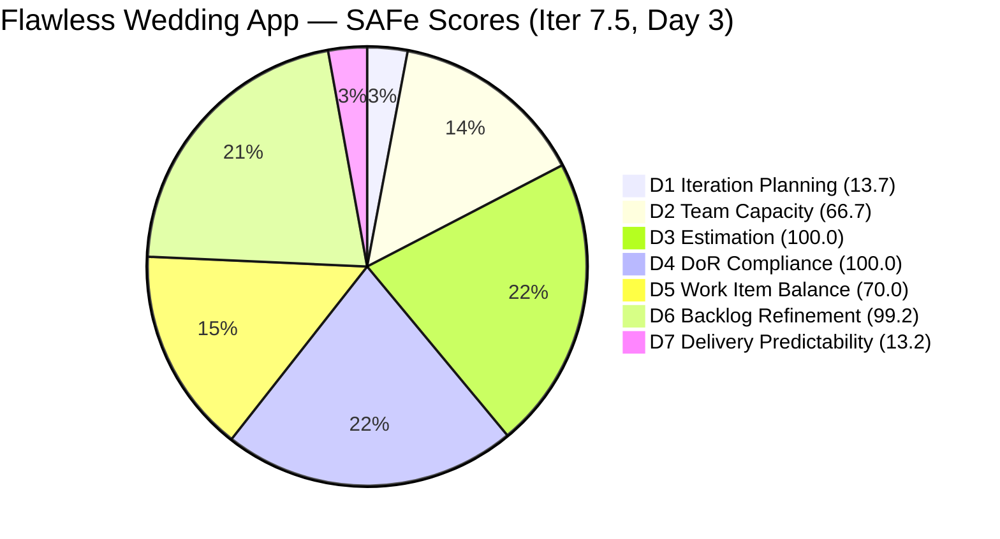
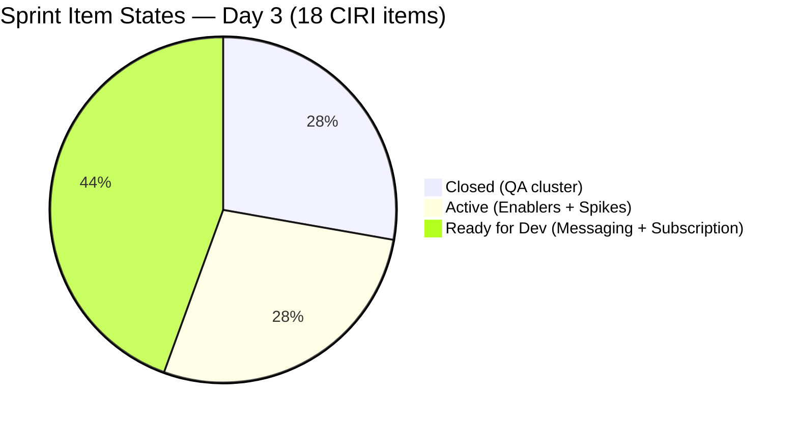
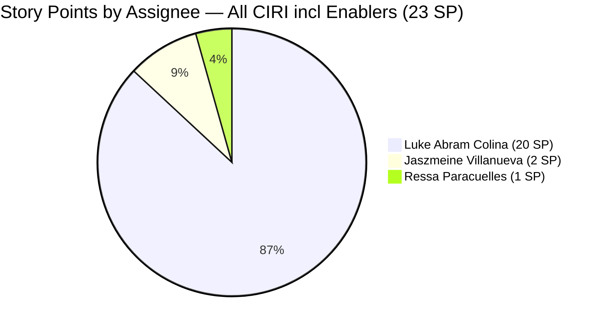
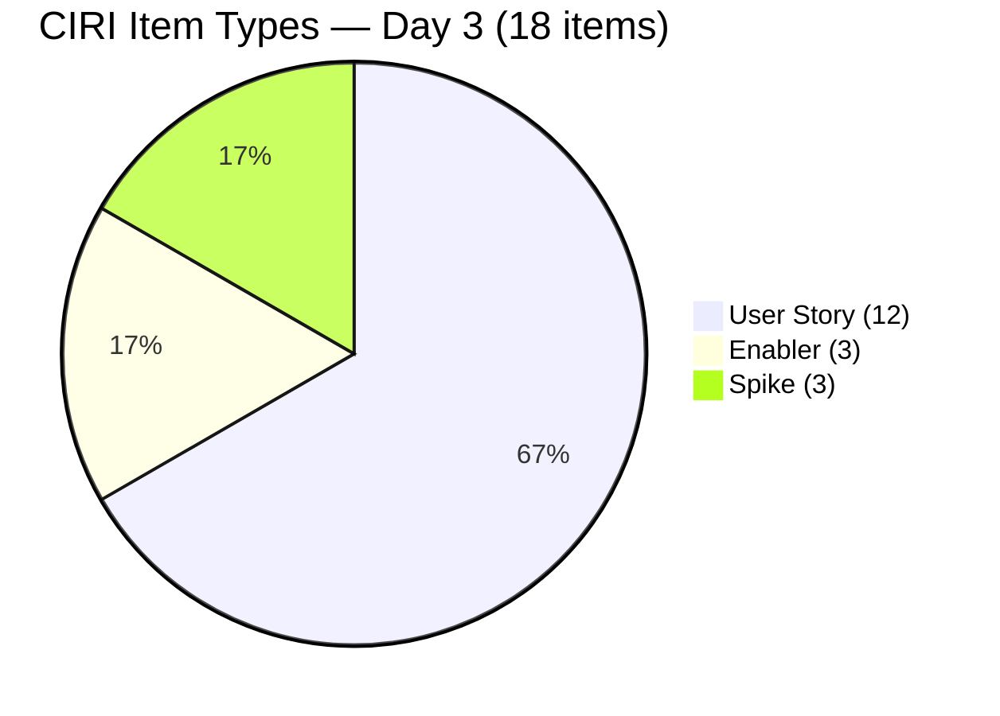

# ADO SAFe Audit — Flawless Wedding App Team

## 1. Audit Metadata

| Field | Value |
|-------|-------|
| **Project** | Flawless Wedding App |
| **Team** | Flawless Wedding App Team |
| **Workspace** | `ado_fl_dev` |
| **ADO Project ID** | `92b967dc-5ec7-4874-b8f5-e43b00d88339` |
| **ADO Team ID** | `7d90ecbf-d272-4b0c-b33b-c66d96a790ac` |
| **Iteration** | Iteration 7.5 |
| **Iteration Start** | 2026-06-01 |
| **Iteration Finish** | 2026-06-14 |
| **Sprint Day** | Day 3 of 14 |
| **Audit Date/Time** | 2026-06-03 02:08 UTC |
| **Prior Audit** | AUDIT_20260602_0907.md (Day 2, Iteration 7.5, 66.0 — Moderate Risk) |
| **Overall Score** | **66.1 / 100** |
| **Risk Band** | **Moderate Risk** |

---

## 2. Executive Summary

The Flawless Wedding App Team scores **66.1 / 100 (Moderate Risk)** on Day 3 of Iteration 7.5, a marginal increase of **+0.1 points** from the Day 2 score of 66.0. Three items made active-state transitions today — Enabler 205105 (MobileApp Staging), Spike 205195 (Alternative to Figma), and ongoing activity on Enabler 202747 (Mobile Subscription) — but no new closures occurred and the messaging cluster (201825–201831, 11 SP) remains entirely in "Ready for Dev."

**Notable VRBI change:** The visible backlog dropped from 143 to **131 items** between Day 2 and Day 3 audits — a reduction of 12 items, likely representing legacy backlog items closed or archived. This has a small positive effect on D1 (12.6 → 13.7) and near-neutral effect on D6.

**Key strengths:** DoR Compliance 100.0, Estimation 100.0, and Backlog Refinement 99.2 remain strong. Active delivery continues with 2.5 SP closed (5 items from the Day 2 sprint). Three design/enabler spikes are now Active.

**Persistent risks:** Iteration Planning (13.7) remains Critical-band due to structural backlog inflation. Team Capacity at 66.7 — Jaszmeine Villanueva has 2 Active sprint items but no ADO capacity entry. The messaging cluster (11 SP across 5 User Stories) has not advanced beyond "Ready for Dev" through Day 3. Delivery Predictability holds at 13.2 with no new closures since Day 2.

---

## 3. Previous Audit Delta

**Prior audit:** AUDIT_20260602_0907.md — Iteration 7.5, Day 2, Score 66.0 / 100 (Moderate Risk)

| Dimension | Day 2 | Day 3 | Delta | Driver |
|-----------|-------|-------|-------|--------|
| D1 Iteration Planning | 12.6 | **13.7** | **+1.1** | VRBI dropped 143→131 (-12 items archived/closed); CIRI unchanged at 18 |
| D2 Team Capacity | 66.7 | **66.7** | 0.0 | Jaszmeine still not in capacity API; 2 CC / 3 CW |
| D3 Estimation | 100.0 | **100.0** | 0.0 | Full estimation maintained; 15 PECI all estimated |
| D4 DoR Compliance | 100.0 | **100.0** | 0.0 | All 18 CIRI items still DoR-compliant |
| D5 Work Item Balance | 70.0 | **70.0** | 0.0 | Same type composition; Penalty B persists |
| D6 Backlog Refinement | 99.3 | **99.2** | **−0.1** | VRBI 143→131; 201569 still stale; base 130/131 = 99.2 |
| D7 Delivery Predictability | 13.2 | **13.2** | 0.0 | No new closures since Day 2 (2.5 SP / 19 SP) |
| **Overall** | **66.0** | **66.1** | **+0.1** | D1 gain (+1.1) offset by D6 rounding (−0.1) |

**State transitions since Day 2:**
- **205105** (MobileApp Staging, Enabler): Ready for Dev → **Active** (2026-06-03T01:20:33 UTC)
- **205195** ([Retro] Alternative to Figma, Spike): Active — updated (2026-06-03T02:26:12 UTC)
- **202747** (Mobile Subscription, Enabler): Active — ongoing update (2026-06-03T08:28:43 UTC)
- All other items: unchanged from Day 2

**Backlog change:** 12 VRBI items were removed from the visible backlog between Day 2 and Day 3 audits (143 → 131). These were likely closed or archived legacy items. None of these appear in CIRI (sprint is unaffected). This reduction modestly improves D1.

---

## 4. Current Iteration Snapshot

| Attribute | Value |
|-----------|-------|
| **Active Iteration** | Iteration 7.5 |
| **Sprint Duration** | 2026-06-01 to 2026-06-14 (14 days) |
| **Audit Day** | **Day 3 of 14** |
| **Total Visible Backlog Root Items (VRBI)** | **131** |
| **Current Iteration Root Items (CIRI)** | **18** |
| **Sprint Load %** | **13.7%** |
| **Committed Story Points (CSP)** | **19 SP** |
| **Closed Story Points (CLSP)** | **2.5 SP** (204932/34/35/36/38) |
| **Delivery %** | **13.2%** |
| **Items Closed** | 5 (204932, 204934, 204935, 204936, 204938) |
| **Items Active** | 5 (202747, 205105, 205195, 205198, 205232) |
| **Items Ready for Dev** | 8 (201825, 201826, 201827, 201828, 201831, 201216, 204939, 204940) |
| **Items New** | 0 |
| **DoR-Compliant Items** | **18 / 18 (100%)** |
| **Active Members with Work (CW)** | 3 (Luke Abram Colina, Ressa Paracuelles, Jaszmeine Villanueva) |
| **Members with Capacity (CC)** | 2 (Luke — Development; Ressa — Testing) |
| **Total Team Capacity Per Day** | 0 hrs/day (activities configured; daily hours all unset) |
| **Days Off** | 0 |
| **Remaining Days** | 11 |

---

## 5. Work Item Analysis

### 5.1 Current Iteration Items (CIRI — 18 items)

| ID | Title | Type | State | SP | Assignee | DoR | ChangedDate |
|----|-------|------|-------|----|----------|-----|-------------|
| 204932 | Update Landing Page CTA Wording | User Story | **Closed** | 0.5 | Luke Colina | PASS | 2026-06-02 |
| 204934 | Remove "Best Value" Badge | User Story | **Closed** | 0.5 | Luke Colina | PASS | 2026-06-02 |
| 204935 | Remove Non-Functional Three-Dot UI Elements | User Story | **Closed** | 0.5 | Luke Colina | PASS | 2026-06-02 |
| 204936 | Update Budget Currency Label | User Story | **Closed** | 0.5 | Luke Colina | PASS | 2026-06-02 |
| 204938 | Add Email Field and Update Required Fields | User Story | **Closed** | 0.5 | Luke Colina | PASS | 2026-06-02 |
| 202747 | Mobile Subscription Management for Bride Access | Enabler | **Active** | 2 | Luke Colina | PASS | 2026-06-03 |
| 205105 | MobileApp Staging Environment for User Testing | Enabler | **Active** | 1 | Luke Colina | PASS | 2026-06-03 |
| 205195 | [Retro] Alternative to Figma | Spike | **Active** | 1 | Jaszmeine Villanueva | PASS | 2026-06-03 |
| 205198 | [Retro] Design Deliverables back on track | Spike | **Active** | 1 | Jaszmeine Villanueva | PASS | 2026-06-02 |
| 205232 | Iteration 7.5 Collaborations, Reports & Others | Spike | **Active** | 1 | Ressa Paracuelles | PASS | 2026-06-02 |
| 204939 | Update Subscription Renewal Notification Messaging | User Story | Ready for Dev | 0.5 | Luke Colina | PASS | 2026-06-02 |
| 204940 | Implement Subscription Reminder Frequency | User Story | Ready for Dev | 2 | Luke Colina | PASS | 2026-06-02 |
| 201825 | Send Message to Vendor | User Story | Ready for Dev | 2 | Luke Colina | PASS | 2026-06-01 |
| 201826 | Receive Messages | User Story | Ready for Dev | 3 | Luke Colina | PASS | 2026-06-01 |
| 201827 | View Conversation History | User Story | Ready for Dev | 2 | Luke Colina | PASS | 2026-06-01 |
| 201828 | Real-time Chat | User Story | Ready for Dev | 1 | Luke Colina | PASS | 2026-06-01 |
| 201831 | Message Notifications | User Story | Ready for Dev | 3 | Luke Colina | PASS | 2026-06-01 |
| 201216 | Integration with Existing APIs | Enabler | Ready for Dev | 1 | Luke Colina | PASS | 2026-06-01 |

**Note on 202747 (Mobile Subscription):** The Description states "12-month access for $2.99" while the Acceptance Criteria states "$4.99." This pricing inconsistency persists from prior audits. DoR content thresholds are met; the functional conflict should be resolved by the product owner before sprint review.

**Ownership concentration:**
- Luke Abram Colina: 15 items (83%) — 5 Closed, 2 Active, 8 Ready for Dev
- Jaszmeine Villanueva: 2 items (11%) — 2 Active (205195, 205198)
- Ressa Paracuelles: 1 item (6%) — 1 Active (205232)

### 5.2 VRBI Backlog Change

The VRBI count dropped from 143 to **131** between Day 2 and Day 3 audits. The 12 items removed are not visible in the backlog API and were not individually identified (consistent with ADO closed-item suppression). None of the removed items were in CIRI. Stale item **201569** (Follow Up Netlify Access and Github Transfer, Spike, Iter 7.1, changed 2026-04-13) remains in the backlog — now **51 days** past the 45-day freshness window.

---

## 6. SAFe Compliance Scorecard

| Dimension | Score | Evidence (Numerator / Denominator) | Notes |
|-----------|-------|-------------------------------------|-------|
| D1 Iteration Planning | **13.7** | 18 CIRI / 131 VRBI | VRBI dropped 143→131; modest D1 improvement; structural gap persists |
| D2 Team Capacity | **66.7** | 2 CC / 3 CW | Jaszmeine has 2 Active items but no capacity entry in ADO |
| D3 Estimation | **100.0** | 15 ECI / 15 PECI | All eligible items carry SP; full coverage |
| D4 DoR Compliance | **100.0** | 18 DCI / 18 CIRI | All items pass Description ≥ 30 and AC ≥ 20 |
| D5 Work Item Balance | **70.0** | US=12/18 (66.7%) dominant | Penalty B (-30): dominant type > 60%; no Spikes penalty |
| D6 Backlog Refinement | **99.2** | 130 fresh / 131 VRBI | 201569 (Apr 13) sole stale item; all CIRI untouched = 0 |
| D7 Delivery Predictability | **13.2** | 2.5 CLSP / 19 CSP | 5 items Closed from Day 2; no new closures on Day 3 |
| **Overall** | **66.1** | (13.7+66.7+100+100+70+99.2+13.2)/7 | **Moderate Risk** |

---

## 7. Dimension Findings

### 7.1 Iteration Planning (13.7 — Critical Risk)

**VRBI:** 131 items (down from 143 on Day 2 — 12 items removed from backlog).
**CIRI:** 18 items in `Flawless Wedding App\2026-PI7\Iteration 7.5`.
**Formula:** round(18 / 131 × 100, 1) = round(13.740, 1) = **13.7**

The VRBI reduction from 143 to 131 items is the most significant change between Day 2 and Day 3 audits. This modest improvement in D1 (12.6 → 13.7) suggests backlog grooming activity occurring in parallel with sprint work — 12 items may have been closed or archived, consistent with the Day 2 recommendation to target PI4/PI5/PI6 legacy artifacts. If this grooming trend continues, further VRBI reductions will continue to improve D1 organically.

At 131 VRBI with 18 CIRI, the sprint still represents only 13.7% of the visible backlog — a structural gap driven by accumulated historical items across PI4 through PI7. The path to a D1 score above 40 requires reducing VRBI below 45, which requires removing approximately 86 additional backlog items.

---

### 7.2 Team Capacity (66.7 — Moderate Risk)

**CW:** 3 — Luke Abram Colina (15 items), Ressa Paracuelles (205232), Jaszmeine Villanueva (205195, 205198).
**CC:** 2 — Luke (Development activity configured) and Ressa (Testing activity configured). Jaszmeine does not appear in the team capacity API.
**Formula:** round(2 / 3 × 100, 1) = **66.7**

No change from Day 2. All three capacity-configured members continue to show 0 hrs/day in the API (totalCapacityPerDay = 0 for the team). Jaszmeine's two Active sprint items (205195: Design research, 205198: Design deliverables) remain unplanned from a capacity perspective. New team member **Luzmibel Paculanang** (lpaculanang@jairosoft.com) appears in the capacity configuration with Testing activity at 0 hrs/day but holds no CIRI items — not a CW contributor.

---

### 7.3 Estimation (100.0 — Low Risk)

**PECI:** User Stories (12) + Spikes (3) = 15 items.
**ECI:** All 15 carry SP > 0 (range: 0.5–3 SP).
**CSP calculation:**
- Closed US: 204932=0.5 + 204934=0.5 + 204935=0.5 + 204936=0.5 + 204938=0.5 = **2.5 SP**
- Open US: 204939=0.5 + 204940=2 + 201825=2 + 201826=3 + 201827=2 + 201828=1 + 201831=3 = **13.5 SP**
- Spikes: 205195=1 + 205198=1 + 205232=1 = **3 SP**
- **CSP = 19 SP** (Enablers: 202747=2SP + 205105=1SP + 201216=1SP = 4 SP excluded from PECI)
**Formula:** round(15 / 15 × 100, 1) = **100.0**

---

### 7.4 DoR Compliance (100.0 — Low Risk)

**CIRI:** 18 items.
**DCI:** 18 — all pass Description ≥ 30 non-whitespace chars AND Acceptance Criteria ≥ 20 non-whitespace chars.
**Formula:** round(18 / 18 × 100, 1) = **100.0**

All items confirmed DoR-compliant. 205195 (Alternative to Figma) carries a concise description ("figma dev MCP helped a lot...") with a bullet list that exceeds 30 stripped chars, and AC ("Design should be able to prompt on the design / Should integrated to Jodex / AI") exceeds 20 stripped chars — PASS.

The previously resolved item 205198 (Design Deliverables) maintains its DoR-compliant state with AC referencing tickets #202724, #202553, #202727, #202725.

---

### 7.5 Work Item Balance (70.0 — Moderate Risk)

**CIRI type distribution (18 items):**
- User Story: 12 (66.7%)
- Enabler: 3 (16.7%)
- Spike: 3 (16.7%)

| Penalty | Check | Result |
|---------|-------|--------|
| A (no User Story in CIRI) | 12 US present | 0 |
| B (dominant type > 60%) | US = 66.7% > 60% | **−30** |
| C (spike share > 40%) | Spike = 16.7% < 40% | 0 |

**Formula:** max(0, 100 − 30) = **70.0**

User Story dominance is architecturally appropriate for this sprint. The 66.7% share is just above the 60% threshold — adding one more Enabler or Spike item (or closing 2 User Stories without replacement) would bring US share below 60% and eliminate Penalty B. The 5 Closed User Stories (QA items) reduced the US pool from 17 to 12; as the remaining 9 open User Stories begin closing, the US share will naturally shift.

---

### 7.6 Backlog Refinement (99.2 — Low Risk)

**Fresh window:** ChangedDate ≥ 2026-04-19 (45 days before 2026-06-03).
**VRBI:** 131 items.
**Fresh VRBI:** 130 (all except 201569, changed 2026-04-13 — 51 days past the window).
**base score:** round(130 / 131 × 100, 1) = round(99.237, 1) = **99.2**

**Penalties:**
- stale_90 (ChangedDate < 2026-03-04): 0 items → no penalty
- stale_180 (ChangedDate < 2025-12-05): 0 items → no penalty
- **Untouched CIRI** (ChangedDate before 2026-06-01T00:00:00Z): 0 — all 18 CIRI items have ChangedDate ≥ 2026-06-01

**Formula:** max(0, 99.2 − 0) = **99.2**

The minor decrease from 99.3 (Day 2) to 99.2 is purely a rounding artifact from the VRBI denominator change (143→131). The single stale item 201569 now represents 1/131 = 0.76% of the backlog, slightly higher than the prior 1/143 = 0.70%. The backlog grooming that removed 12 items brought fresh items into closer focus on the stale outlier.

---

### 7.7 Delivery Predictability (13.2 — High Risk)

**CSP:** 19 SP (15 PECI items).
**CLSP:** 2.5 SP — items 204932, 204934, 204935, 204936, 204938 (all State=Closed, all 0.5 SP).
**Formula:** round(2.5 / 19 × 100, 1) = round(13.158, 1) = **13.2**

No new closures occurred between Day 2 and Day 3. The 5 closures from Day 2 were the "Passed QA Testing" cluster that closed within the first 48 hours. The sprint now enters its mid-early phase (Day 3 of 14) with 16.5 SP remaining in open states.

**In-progress delivery signals:**
- 202747 (Mobile Subscription, Enabler, 2 SP): Active since Day 2, updated again today. Progress on subscription infrastructure is ongoing.
- 205105 (MobileApp Staging, Enabler, 1 SP): Moved to Active today (Day 3) — staging environment setup in progress.
- 205195 (Alternative to Figma, Spike, 1 SP): Active, updated today — design tooling research ongoing.
- 205198 (Design Deliverables, Spike, 1 SP): Active since Day 2 — design approval pending for 4 tickets.
- 205232 (Collaborations/Reports, Spike, 1 SP): Active since Day 2 — team events participation.

**Messaging cluster risk (201825–201831, 11 SP):** All 5 messaging User Stories remain in "Ready for Dev" at Day 3. This cluster represents 11 SP (58% of remaining open SP). Activating these stories by Day 5 is critical to maintaining the delivery trajectory required for a Low Risk close-out.

---

## 8. Risks and Bottlenecks

| Risk | Severity | Items Affected | Status |
|------|----------|----------------|--------|
| Messaging cluster (5 US, 11 SP) not activated by Day 3 | **CRITICAL** | 201825, 201826, 201827, 201828, 201831 | Still in Ready for Dev; Day 5 deadline for activation |
| Iteration Planning 13.7 — structural backlog inflation | **HIGH** | 131-item VRBI | Improving (143→131); requires continued grooming sessions |
| Luke Colina owns 15/18 CIRI items (83%) | **HIGH** | All messaging + subscription items | Concentration risk unchanged; messaging cluster has no backup |
| Jaszmeine Villanueva — 2 Active items, no capacity configured | **HIGH** | 205195, 205198 | Active work ongoing; ADO capacity gap unresolved |
| No individual capacity hours configured (all 0 hrs/day) | **MEDIUM** | Team-wide | Cannot compute sprint load vs. capacity ratio |
| 204939, 204940 (subscription items, 2.5 SP) not yet activated | **MEDIUM** | 2.5 SP | Day 3 overdue for activation; should be Active by Day 3 |
| 201569 (Spike, Iter 7.1) — now 51 days stale | **MEDIUM** | 1 item | Worsening; almost certainly completed; close or archive |
| $2.99 vs $4.99 pricing conflict in 202747 | **LOW** | 1 item | DoR compliant; product owner decision required before sprint review |

---

## 9. Prioritized Recommendations

1. **Activate the messaging cluster (201825–201831) by Day 4 — critical deadline.** Five User Stories totaling 11 SP are in "Ready for Dev" on Day 3. These represent the most substantial delivery risk in the sprint: at 58% of remaining open SP, any slip in activation directly threatens the sprint's Low Risk projection. At minimum, move all five to "Active" in ADO today. Architecture alignment for real-time chat (201828, dependency on 201216) should be confirmed. Enabler 202747 is already Active and provides the subscription prerequisite.

2. **Activate 204939 and 204940 (subscription notification stories) today.** These 2.5 SP stories have simple, well-defined acceptance criteria and are ready to begin. 202747 (subscription enabler) is already Active. Delaying beyond Day 3 increases the risk of a late-sprint crunch on these items.

3. **Configure Jaszmeine Villanueva's capacity in ADO.** She has 2 Active sprint items. Adding her to the team capacity configuration with her activity type (Design) and daily hours resolves the D2 gap and correctly surfaces her sprint contribution. This is a 2-minute ADO admin action.

4. **Close 201569 (Follow Up Netlify Access, Spike, Iter 7.1) this sprint.** This item is now 51 days outside the 45-day freshness window with "Ready" state in Iteration 7.1. The Netlify/GitHub transfer it describes is almost certainly complete. Closing it with a brief completion note eliminates the sole Backlog Refinement gap (D6 would reach 100.0).

5. **Resolve the $2.99 vs $4.99 pricing conflict in 202747 before sprint review.** The Description says "$2.99" for the 12-month subscription; the Acceptance Criteria says "$4.99." This inconsistency in the specification will cause confusion at sprint review and may result in a failed AC check. The product owner should clarify the correct price and update the relevant field.

6. **Continue backlog grooming — maintain the 143→131 reduction momentum.** The 12-item VRBI reduction between Day 2 and Day 3 represents excellent grooming behavior. Targeting an additional 20–30 legacy items for closure or archiving in this sprint would bring VRBI toward 100–110 and raise D1 from 13.7 to approximately 16–18. Identify items in PI4/PI5/PI6 paths that are no longer relevant.

7. **Enter individual daily capacity hours for all team members.** Luke, Ressa, and Luzmibel all show 0 hrs/day. Setting realistic hours (Luke ~6–7 hrs/day, Ressa ~6 hrs/day, Luzmibel ~1–2 hrs/day) enables meaningful sprint load analysis and aligns ADO with actual team capacity.

8. **Redistribute 2 messaging cluster items from Luke.** At Day 3, Luke owns 83% of CIRI. Consider reassigning 201827 (View Conversation History, 2 SP) and 201828 (Real-time Chat, 1 SP) to Ressa or another available contributor. These stories have clear BDD acceptance criteria and lower architectural complexity than 201825/201826, making them viable candidates for redistribution.

---

## 10. Evidence Gaps and Limitations

- **VRBI reduction from 143 to 131 not item-by-item explained.** The backlog API returned 131 items; the prior audit recorded 143. The 12 removed items are consistent with closed/archived items being suppressed from the backlog API. No individual item IDs for the removed items were retrieved — the reduction is treated as benign grooming activity.
- **Capacity API returns 0 hrs/day for all members.** `work_get_team_capacity` returned totalCapacityPerDay=0 with activities configured for Ressa, Luzmibel, and Luke. Per the rubric, having at least one configured activity qualifies a member as CC. Jaszmeine is absent from the API response entirely — she is not CC.
- **Stale item freshness for full 131 VRBI not individually verified.** All 18 CIRI items were individually confirmed. For the 113 non-CIRI items, stale analysis uses Day 2 audit findings (only 201569 is outside the 45-day window). This is reliable given the bulk-touch pattern observed in prior audits.
- **Enabler SP excluded from CSP.** The three Enablers (202747=2SP, 205105=1SP, 201216=1SP) carry 4 SP total excluded from D3/D7 computation per rubric. Total committed SP including Enablers = 23 SP; rubric-based CSP = 19 SP.
- **Early-sprint annotation for D7.** Day 3 of 14 — early sprint. The 13.2 DP score reflects same-day closures from Day 2 (the QA cluster). No new closures on Day 3, consistent with Active items being in-progress rather than complete. The messaging cluster activation by Day 4–5 is the critical path for delivery recovery.

---

## Appendix: Score Visualization

**Score Trend — Recent Audits:**

| Audit Date | Iteration | Day | Score | Risk Band | Key Event |
|------------|-----------|-----|-------|-----------|-----------|
| 2026-05-30 | Iter 7.4 | 13 | 67.1 | Moderate | Sprint close |
| 2026-06-01 | Iter 7.5 | 1 | 63.3 | Moderate | Sprint open; 18 CIRI |
| 2026-06-02 | Iter 7.5 | 2 | 66.0 | Moderate | 5 items Closed; DoR 94.4→100 |
| **2026-06-03** | **Iter 7.5** | **3** | **66.1** | **Moderate** | VRBI 143→131; 3 items newly Active |
| Projected Day 5 | Iter 7.5 | 5 | ~68–70 | Moderate | Messaging cluster activated |
| Projected Day 10 | Iter 7.5 | 10 | ~75–80 | Mod→Low | Messaging closures begin |
| Projected Day 14 | Iter 7.5 | 14 | ~80–85 | Low | Sprint close, full delivery |

**SAFe Dimension Scorecard — Day 2 vs Day 3:**

| Dimension | Day 2 | Day 3 | Delta | Band |
|-----------|-------|-------|-------|------|
| D1 Iteration Planning | 12.6 | **13.7** | +1.1 | Critical |
| D2 Team Capacity | 66.7 | **66.7** | 0.0 | Moderate |
| D3 Estimation | 100.0 | **100.0** | 0.0 | Low |
| D4 DoR Compliance | 100.0 | **100.0** | 0.0 | Low |
| D5 Work Item Balance | 70.0 | **70.0** | 0.0 | Moderate |
| D6 Backlog Refinement | 99.3 | **99.2** | −0.1 | Low |
| D7 Delivery Predictability | 13.2 | **13.2** | 0.0 | High |
| **Overall** | **66.0** | **66.1** | **+0.1** | **Moderate** |
