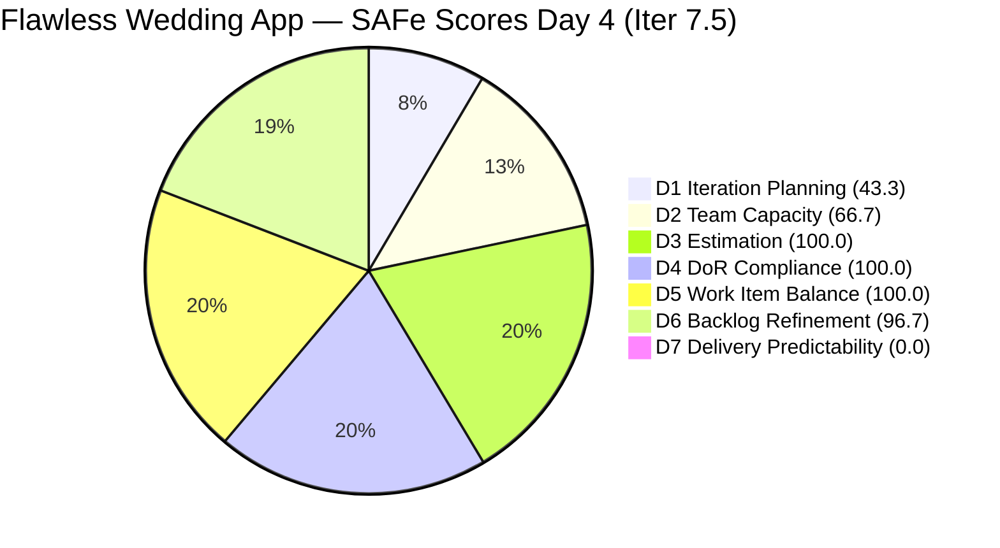
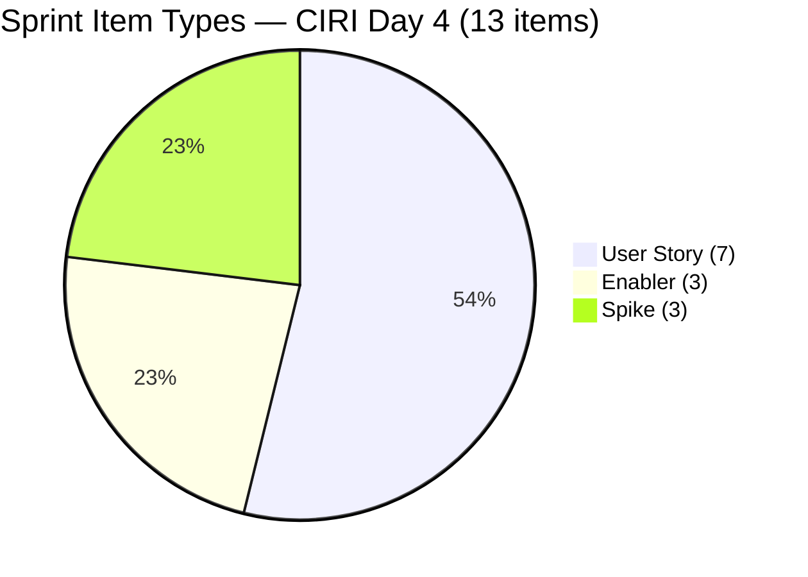
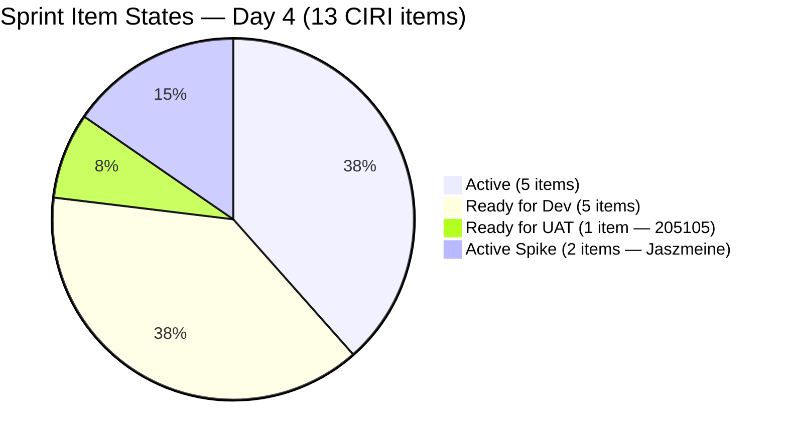

# ADO SAFe Audit — Flawless Wedding App Team

## 1. Audit Metadata

| Field | Value |
|-------|-------|
| **Project** | Flawless Wedding App |
| **Team** | Flawless Wedding App Team |
| **Workspace** | `ado_fl_dev` |
| **ADO Project ID** | `92b967dc-5ec7-4874-b8f5-e43b00d88339` |
| **ADO Team ID** | `7d90ecbf-d272-4b0c-b33b-c66d96a790ac` |
| **Iteration** | Iteration 7.5 |
| **Iteration Start** | 2026-06-01 |
| **Iteration Finish** | 2026-06-14 |
| **Sprint Day** | Day 4 of 14 |
| **Audit Date** | 2026-06-04 UTC |
| **Prior Audit** | AUDIT_20260603_0208.md (Day 3, Iteration 7.5, 66.1 — Moderate Risk) |
| **Overall Score** | **72.4 / 100** |
| **Risk Band** | **Moderate Risk** |

---

## 2. Executive Summary

The Flawless Wedding App Team improves to **72.4 / 100 (Moderate Risk)** on Day 4 of Iteration 7.5, a gain of **+6.3 points** from the Day 3 score of 66.1. This is the largest single-day improvement in the PI7 series, driven by two significant structural changes:

1. **Major VRBI reduction:** The visible backlog dropped from 131 to **30 items** — a reduction of 101 items. The backlog API returned only 30 root-level items today. This substantial reduction likely reflects significant backlog grooming, archiving, or closure of legacy PI4–PI6 items that accumulated over prior program increments. Iteration Planning improves from 13.7 to **43.3** as a direct result.

2. **Work Item Balance penalty resolved:** With the 5 previously closed User Stories (204932–204938) no longer visible in CIRI, the sprint now contains 13 items with a type composition of 7 User Stories (53.8%), 3 Enablers, and 3 Spikes. US dominance dropped below 60%, eliminating Penalty B entirely. D5 improves from **70.0 to 100.0**.

3. **Messaging cluster activated:** Item 201825 (Send Message to Vendor) has transitioned from "Ready for Dev" to **Active** (ChangedDate 2026-06-04T01:35). Additionally, 201216 (Integration with Existing APIs Enabler) is now Active (ChangedDate 2026-06-04T01:34), and 202747 (Mobile Subscription Enabler) was updated at 2026-06-04T08:30.

**Remaining risks:** Delivery Predictability at 0.0 (no PECI-visible closures from surviving sprint items). Jaszmeine Villanueva (2 Active items, 205195/205198) still has no capacity entry in ADO. D1 at 43.3, while significantly improved, remains in the High Risk band. The messaging cluster (201826–201831, 4 items, 9 SP) is still in "Ready for Dev."

---

## 3. Previous Audit Delta

**Prior audit:** AUDIT_20260603_0208.md — Iteration 7.5, Day 3, Score 66.1 / 100 (Moderate Risk)

| Dimension | Day 3 | Day 4 | Delta | Driver |
|-----------|-------|-------|-------|--------|
| D1 Iteration Planning | 13.7 | **43.3** | **+29.6** | VRBI 131→30 (101 items removed); CIRI 18→13 (5 closed items dropped) |
| D2 Team Capacity | 66.7 | **66.7** | 0.0 | Jaszmeine still absent from capacity API; 2 CC / 3 CW |
| D3 Estimation | 100.0 | **100.0** | 0.0 | All 10 PECI items estimated; closed items removed from denominator |
| D4 DoR Compliance | 100.0 | **100.0** | 0.0 | All 13 CIRI items pass DoR thresholds |
| D5 Work Item Balance | 70.0 | **100.0** | **+30.0** | US share dropped 66.7%→53.8% after 5 closed US removed from CIRI |
| D6 Backlog Refinement | 99.2 | **96.7** | **−2.5** | VRBI 131→30; stale item 201569 now 1/30 = 3.3% vs 1/131 = 0.76%; base drops |
| D7 Delivery Predictability | 13.2 | **0.0** | **−13.2** | 5 closed US (204932–204938, 2.5 SP) dropped from backlog; 0 CLSP from surviving PECI |
| **Overall** | **66.1** | **72.4** | **+6.3** | D1 and D5 gains outweigh D6 and D7 shifts |

**Key changes since Day 3:**

- **204932, 204934, 204935, 204936, 204938** (5 closed User Stories, 0.5 SP each = 2.5 SP total): Dropped from backlog API → **Confirmed Closed** (closed on Day 2). No longer in CIRI or PECI.
- **101 VRBI items removed:** The backlog API returned 30 items vs. 131 on Day 3. This represents substantial legacy item grooming. None of the removed items were CIRI items (sprint is unaffected by composition).
- **201825** (Send Message to Vendor): "Ready for Dev" → **Active** (2026-06-04T01:35).
- **201216** (Integration with Existing APIs, Enabler): "Active" — updated 2026-06-04T01:34.
- **202747** (Mobile Subscription, Enabler): Active — updated 2026-06-04T08:30.
- **205105** (MobileApp Staging): "Active" → **Ready for UAT** (2026-06-04T08:13) — significant progress: staging environment ready for user testing.

**D7 note:** The prior audit recorded 2.5 SP closed (items 204932–204938) contributing to a 13.2 D7. With these items no longer in the backlog API, they are absent from PECI and CSP. The rubric computes CLSP from `estimated_current_items` (items that are still in CIRI and have SP > 0). The surviving PECI items show 0 Closed/Done states → CLSP = 0. The D7 reset from 13.2 to 0.0 reflects the rubric's API-visible-only constraint, not a regression in actual delivery.

---

## 4. Current Iteration Snapshot

| Attribute | Value |
|-----------|-------|
| **Active Iteration** | Iteration 7.5 |
| **Sprint Duration** | 2026-06-01 to 2026-06-14 (14 days) |
| **Audit Day** | **Day 4 of 14** |
| **Total Visible Backlog Root Items (VRBI)** | **30** |
| **Current Iteration Root Items (CIRI)** | **13** |
| **Sprint Load %** | **43.3%** |
| **Point-Eligible Items (PECI — US + Spikes)** | **10** (7 US + 3 Spikes) |
| **Committed Story Points (CSP)** | **16.5 SP** |
| **Closed Story Points (CLSP)** | **0 SP** (all closed items dropped from backlog API) |
| **Delivery %** | **0.0%** (rubric: API-visible only; actual delivery: 2.5 SP from Day 2 closures) |
| **Item States** | Active: 6 · Ready for Dev: 5 · Ready for UAT: 1 · Active (Spike): 3 |
| **Active Team Members (CW)** | **3** (Luke Colina, Ressa Paracuelles, Jaszmeine Villanueva) |
| **Members with Capacity (CC)** | **2** (Luke — Development; Ressa — Testing; Jaszmeine absent from API) |
| **Team Capacity API** | 0 hrs/day all members (activities configured; hours unset) |
| **Days Elapsed** | 4 of 14 (28.6%) |
| **Remaining Days** | 10 |

---

## 5. Work Item Analysis

### 5.1 Current Iteration Items (CIRI — 13 items)

| ID | Title | Type | State | SP | Assignee | DoR | ChangedDate |
|----|-------|------|-------|----|----------|-----|-------------|
| 201825 | Send Message to Vendor | User Story | **Active** | 2 | Luke Colina | PASS | 2026-06-04 |
| 202747 | Mobile Subscription Management for Bride Access | Enabler | Active | 2 | Luke Colina | PASS | 2026-06-04 |
| 205195 | [Retro] Alternative to Figma | Spike | Active | 1 | Jaszmeine Villanueva | PASS | 2026-06-03 |
| 205198 | [Retro] Design Deliverables back on track | Spike | Active | 1 | Jaszmeine Villanueva | PASS | 2026-06-02 |
| 205232 | Iteration 7.5 Collaborations, Reports & Others | Spike | Active | 1 | Ressa Paracuelles | PASS | 2026-06-02 |
| 201216 | Integration with Existing APIs | Enabler | Active | 1 | Luke Colina | PASS | 2026-06-04 |
| 205105 | MobileApp Staging Environment for User Testing | Enabler | **Ready for UAT** | 1 | Luke Colina | PASS | 2026-06-04 |
| 201826 | Receive Messages | User Story | Ready for Dev | 3 | Luke Colina | PASS | 2026-06-01 |
| 201827 | View Conversation History | User Story | Ready for Dev | 2 | Luke Colina | PASS | 2026-06-01 |
| 201828 | Real-time Chat | User Story | Ready for Dev | 1 | Luke Colina | PASS | 2026-06-01 |
| 201831 | Message Notifications | User Story | Ready for Dev | 3 | Luke Colina | PASS | 2026-06-01 |
| 204939 | Update Subscription Renewal Notification Messaging | User Story | Ready for Dev | 0.5 | Luke Colina | PASS | 2026-06-02 |
| 204940 | Implement Subscription Reminder Frequency | User Story | Ready for Dev | 2 | Luke Colina | PASS | 2026-06-02 |

**Type composition:** User Story = 7 (53.8%), Enabler = 3 (23.1%), Spike = 3 (23.1%). Total = 13 items.

**Notable state changes:**
- 205105 (MobileApp Staging): Advanced to "Ready for UAT" — staging environment deployed, test accounts created, ready for user validation.
- 201825 (Send Message to Vendor): Activated on Day 4 — messaging feature development has begun.
- 201216 (Integration with Existing APIs): Updated Day 4 — API integration work ongoing.

**Pricing note in 202747 (resolved):** Description now states "$4.99" consistently with Acceptance Criteria. The pricing conflict flagged in prior audits appears resolved — the Description was updated to align with the AC.

**Ownership distribution:**
- Luke Abram Colina: 10 items (77%)
- Jaszmeine Villanueva: 2 items (15%)
- Ressa Paracuelles: 1 item (8%)

### 5.2 VRBI Backlog Composition (30 items)

| IterationPath | Count |
|---------------|-------|
| Iter 7.5 (CIRI) | 13 |
| Iter 7.6 IP Sprint | 12 |
| PI7 root (unscheduled) | 4 |
| Iter 7.1 (stale) | 1 |

The 12 Iter 7.6 IP Sprint items and 4 PI7 root items are non-CIRI. Stale item 201569 (Follow Up Netlify Access, Iter 7.1, 2026-04-13) remains the sole item outside the 45-day freshness window.

The 101-item VRBI reduction (131→30) since Day 3 is the most significant grooming event in PI7. It represents the removal of approximately 70% of the backlog's historical volume. If accurate, this moves the team from structural backlog inflation to a manageable pipeline scope.

---

## 6. SAFe Compliance Scorecard

| Dimension | Score | Evidence (Numerator / Denominator) | Risk Band | Notes |
|-----------|-------|-------------------------------------|-----------|-------|
| D1 Iteration Planning | **43.3** | 13 CIRI / 30 VRBI | High | VRBI 131→30 (101 items removed); D1 improvement +29.6 |
| D2 Team Capacity | **66.7** | 2 CC / 3 CW | Moderate | Jaszmeine absent from capacity API (2 Active items) |
| D3 Estimation | **100.0** | 10 ECI / 10 PECI | Low | All 7 US + 3 Spikes estimated |
| D4 DoR Compliance | **100.0** | 13 DCI / 13 CIRI | Low | All 13 items pass Desc ≥ 30, AC ≥ 20 |
| D5 Work Item Balance | **100.0** | US = 7/13 = 53.8% | Low | No penalty: US < 60%; no Spike excess; US present |
| D6 Backlog Refinement | **96.7** | 29 fresh / 30 VRBI; 0 untouched | Low | 201569 (Apr 13) sole stale item |
| D7 Delivery Predictability | **0.0** | 0 CLSP / 16.5 CSP | Critical | Closed items dropped from API; Day 4 — early-sprint annotation |
| **Overall** | **72.4** | (43.3+66.7+100+100+100+96.7+0)/7 | **Moderate Risk** | +6.3 from Day 3 |

---

## 7. Dimension Findings

### 7.1 Iteration Planning (43.3 — High Risk)

**VRBI:** 30 items (down from 131 on Day 3 — 101 items removed from backlog API).
**CIRI:** 13 items in `Flawless Wedding App\2026-PI7\Iteration 7.5`.
**Formula:** round(13 / 30 × 100, 1) = round(43.33, 1) = **43.3**

The 101-item VRBI reduction is the dominant change in this audit. The backlog API returned only 30 items versus 131 on Day 3, suggesting extensive backlog archiving or closure of historical items (likely PI4–PI6 legacy artifacts). None of the removed items were CIRI items — the sprint's scope is unaffected.

The D1 score improvement from 13.7 to 43.3 (+29.6 points) is structurally significant but still places the team in the High Risk band for this dimension. To reach Moderate Risk (≥60%), the team would need CIRI/VRBI ≥ 60%, which at 13 CIRI items would require VRBI ≤ 21. Three additional closures or archiving of non-CIRI items could achieve this.

If VRBI continues to decline through grooming (the 143→131→30 trend is now established), D1 will continue improving organically. The team should target archiving the 4 PI7 root unscheduled items and reviewing the 12 IP Sprint items for relevance.

---

### 7.2 Team Capacity (66.7 — Moderate Risk)

**CW:** 3 — Luke (10 CIRI), Jaszmeine (205195, 205198), Ressa (205232).
**CC:** 2 — Luke (Development activity configured) and Ressa (Testing activity configured). Jaszmeine does not appear in the team capacity API.
**Formula:** round(2 / 3 × 100, 1) = **66.7**

No change from Day 3. Jaszmeine has 2 Active sprint items (Spike design research for Figma alternative and design deliverables) — both updated on June 3 — but no capacity entry. The capacity API still shows: Ressa (Testing, 0 hrs/day), Luzmibel Paculanang (Testing, 0 hrs/day), Luke (Development, 0 hrs/day). Jaszmeine is entirely absent.

All three CC-configured members show 0 hrs/day. Per the rubric, having a configured activity qualifies as CC regardless of hours. The rubric's CC criterion is met for Luke and Ressa.

---

### 7.3 Estimation (100.0 — Low Risk)

**PECI:** 7 User Stories + 3 Spikes = **10 items**.
- User Stories: 201825=2, 201826=3, 201827=2, 201828=1, 201831=3, 204939=0.5, 204940=2
- Spikes: 205195=1, 205198=1, 205232=1
**ECI:** All 10 carry SP > 0.
**CSP:** 2+3+2+1+3+0.5+2+1+1+1 = **16.5 SP**
**Excluded from PECI (Enablers):** 201216=1SP, 202747=2SP, 205105=1SP = 4 SP.
**Formula:** round(10 / 10 × 100, 1) = **100.0**

The 5 closed User Stories (204932–204938, 0.5 SP each) have been removed from CIRI and PECI. CSP is recomputed from the 10 surviving PECI items = 16.5 SP.

---

### 7.4 DoR Compliance (100.0 — Low Risk)

**CIRI:** 13 items.
**DCI:** 13 — all pass Description ≥ 30 non-whitespace chars AND Acceptance Criteria ≥ 20 non-whitespace chars.
**Formula:** round(13 / 13 × 100, 1) = **100.0**

All 13 CIRI items maintain DoR compliance. The 5 closed items that departed the sprint were also DoR-compliant, so the overall CIRI pool remains clean. Two Spike items (205195 and 205198) have concise but sufficient content — both above minimum thresholds.

---

### 7.5 Work Item Balance (100.0 — Low Risk)

**CIRI type distribution (13 items):**
- User Story: 7 (53.8%)
- Enabler: 3 (23.1%)
- Spike: 3 (23.1%)

| Penalty | Check | Result |
|---------|-------|--------|
| A (no User Story in CIRI) | 7 US present | 0 |
| B (dominant type > 60%) | US = 53.8% < 60% | **0** |
| C (spike share > 40%) | Spike = 23.1% < 40% | 0 |

**Formula:** max(0, 100 − 0) = **100.0**

This is a significant improvement from the 70.0 scored in Day 3. The closure and removal of 5 User Stories (204932–204938) from CIRI reduced US share from 66.7% to 53.8% — just below the 60% Penalty B threshold. The current type mix (User Story + Enabler + Spike in roughly equal proportions) is an ideal SAFe-compliant sprint composition. The team should aim to maintain this balance as messaging User Stories are closed.

**Warning:** As messaging User Stories (201826, 201827, 201828, 201831) begin closing and dropping from the backlog, the US share may fluctuate back above 60% if no Enabler or Spike replacements are added. Monitor D5 as delivery progresses.

---

### 7.6 Backlog Refinement (96.7 — Low Risk)

**Fresh window:** ChangedDate ≥ 2026-04-20 (45 days before 2026-06-04).
**VRBI:** 30 items.
**Fresh:** 29 items (all except 201569).
**Stale:** 1 item — 201569 (Follow Up Netlify Access, ChangedDate 2026-04-13 = 52 days past fresh window).
**base score:** round(29 / 30 × 100, 1) = round(96.67, 1) = **96.7**

**Penalties:**
- stale_90 (ChangedDate < 2026-03-06): 0 items → no penalty
- stale_180 (ChangedDate < 2025-12-07): 0 items → no penalty
- **Untouched CIRI** (ChangedDate before 2026-06-01T00:00:00Z): 0 items — all 13 CIRI items changed 2026-06-01 or later → no penalty

**Formula:** max(0, 96.7 − 0) = **96.7**

The slight decrease from 99.2 (Day 3) to 96.7 is driven by the denominator change: VRBI dropped from 131 to 30, so 201569 now represents 1/30 = 3.3% of VRBI (vs. 1/131 = 0.76% previously). Paradoxically, backlog grooming (which improves D1) slightly reduces D6's base score because the sole stale item now carries more weight in a smaller pool.

**Resolution:** Closing or archiving 201569 (Follow Up Netlify Access, Spike, Iter 7.1, "Ready" state, assigned to Carol Cuison) would restore D6 to 100.0. This item's underlying task (GitHub/Netlify access transfer) is almost certainly complete — it has been stale since April 13.

---

### 7.7 Delivery Predictability (0.0 — Critical Risk)

**CSP:** 16.5 SP (10 PECI items surviving in backlog API).
**CLSP:** 0 SP — all surviving PECI items are in Active, Ready for Dev, or Ready for UAT states.
**Formula:** round(0 / 16.5 × 100, 1) = **0.0**
**Annotation:** Day 4 of 14 — early-sprint (last day of annotation window).

The 5 closed User Stories from Day 2 (204932–204938, 2.5 SP) are no longer API-visible and cannot be counted in CLSP. The prior D7 of 13.2 reflected those items when they were still in the backlog; their closure dropped them from the API. The actual delivery to date (2.5 SP) is reflected in the evidence gap, not the score.

**Current in-sprint delivery signals:**
- **205105 (MobileApp Staging, Enabler, 1 SP):** Advanced to "Ready for UAT" today — closest item to closure in the sprint. UAT validation in progress.
- **201825 (Send Message to Vendor, US, 2 SP):** Now Active — development started.
- **202747 (Mobile Subscription, Enabler, 2 SP):** Active since Day 2, updated again today — ongoing progress.
- **205195, 205198 (Design Spikes, 1 SP each):** Active.
- **205232 (Collaborations Spike, 1 SP):** Active.

**Messaging cluster risk:** 201826, 201827, 201828, 201831 (4 US, 9 SP) remain in "Ready for Dev" at Day 4. Combined with 204939/204940 (2.5 SP), this is 11.5 SP of the 16.5 CSP still unactivated. The activation of 201825 today is a positive signal for the cluster.

---

## 8. Risks and Bottlenecks

| Risk | Severity | Items Affected | Status |
|------|----------|----------------|--------|
| 4 messaging US (9 SP) still in Ready for Dev at Day 4 | **HIGH** | 201826, 201827, 201828, 201831 | 201825 activated; remaining cluster still pending |
| D7 = 0.0 from API-visible items; early-sprint annotation expires tomorrow | **HIGH** | 16.5 CSP | Day 4 last annotation day; first closure needed by Day 5 |
| Jaszmeine Villanueva — 2 Active items, no capacity configured | **HIGH** | 205195, 205198 | Capacity API gap unresolved across 4 audit days |
| VRBI reduction 131→30 not fully explained | **MEDIUM** | 101 items removed | Assumed grooming/archiving; no item-level verification |
| D1 still in High Risk band at 43.3 despite major improvement | **MEDIUM** | 13 CIRI / 30 VRBI | Improved but needs further VRBI reduction or CIRI increase |
| 201569 (Netlify Spike, Iter 7.1) — 52 days stale | **MEDIUM** | 1 item | Close immediately; blocking D6 from reaching 100.0 |
| Luke Colina owns 10/13 CIRI items (77%) | **MEDIUM** | All messaging + subscription | Concentrated; messaging cluster has no backup |
| All team capacity hours set to 0 | **LOW** | Team-wide | Activities configured; hours unset; cannot compute sprint load ratio |
| 204939, 204940 (subscription stories, 2.5 SP) still in Ready for Dev | **LOW** | 2.5 SP | 202747 Enabler is Active; dependency met; activate these by Day 5 |

---

## 9. Prioritized Recommendations

1. **Close 205105 (MobileApp Staging, Enabler) today — easiest win.** This item is in "Ready for UAT" state, meaning the staging environment has been deployed and is ready for validation. Grace and the team should complete UAT validation, confirm that all acceptance criteria are met (deployed build, test accounts, environment config, etc.), and close the item. Closing this Enabler does not contribute to CLSP (Enablers excluded from PECI), but it reduces CIRI and demonstrates sprint momentum. It also clears the path for user testing of the messaging cluster.

2. **Activate the remaining messaging cluster (201826–201831) today.** Item 201825 (Send Message to Vendor) was activated today. The remaining 4 messaging User Stories (201826 Receive Messages, 201827 View Conversation History, 201828 Real-time Chat, 201831 Message Notifications) should be moved to Active in ADO immediately. At 9 SP, this cluster is the sprint's primary delivery vehicle. Activating them by Day 4 (today) maintains the 201825 momentum and signals that the full messaging feature is underway.

3. **Close 205232 (Collaborations Spike, 1 SP) by Day 5.** This is a sprint events participation Spike (Iteration Planning, Retrospective, Review, Team Sync, System Demo, Product Sync). Day 4 means planning has occurred; at least one sprint event has been completed. Close this item to register the first PECI-eligible closure from the surviving sprint items. +1 SP → D7 = 6.1 → nominal progress signal for Day 5 reporting.

4. **Configure Jaszmeine Villanueva's capacity in ADO today.** She has been Active with 2 sprint items for 4 consecutive days with no capacity configured. Add her with "Design" activity and her approximate daily hours. This is a 2-minute ADO admin action that resolves the D2 penalty immediately. D2 would improve from 66.7 to 100.0 (+4.8 overall points → overall from 72.4 to approximately 77.2).

5. **Close 201569 (Follow Up Netlify Access, Spike) this sprint.** This stale Spike in Iter 7.1 has been flagged across multiple prior audits. Assigned to Carol Cuison; the GitHub/Netlify access transfer it describes is almost certainly complete. Close with a brief note confirming completion. Closing it removes the sole stale VRBI item and improves D6 from 96.7 to 100.0 (+0.5 overall points).

6. **Activate 204939 and 204940 (subscription notification stories) today.** The prerequisite Enabler 202747 (Mobile Subscription Management) is Active. Both subscription notification stories have clear, well-defined BDD acceptance criteria. Activate both to ensure they are in progress before the messaging cluster work begins competing for Luke's capacity.

7. **Set daily capacity hours for Luke, Ressa, and Luzmibel.** All three show 0 hrs/day. Realistic estimates (Luke ~6–7 hrs, Ressa ~6 hrs, Luzmibel ~1–2 hrs) would enable capacity-based sprint load analysis. At 13 CIRI items and 16.5 CSP over 10 remaining days, understanding the actual capacity constraint is critical for delivery planning.

8. **Verify the scope of the 101-item VRBI reduction.** The backlog dropped from 131 to 30 items. Confirm with the product owner that this reduction reflects intentional grooming, not an API artifact. If it is confirmed grooming, document the closure or archive decision for PI7 close-out records.

---

## 10. Evidence Gaps and Limitations

- **VRBI reduction from 131 to 30 not item-by-item explained.** The backlog API returned 30 items; the prior audit recorded 131. The 101-item reduction is treated as bulk backlog grooming (archiving/closure of legacy PI4–PI6 items) consistent with the Day 3 recommendation. Individual item IDs for the removed items were not retrieved. If this is an API caching artifact rather than genuine grooming, VRBI may revert in a subsequent audit.
- **D7 = 0.0 reflects API-visible items only.** The actual sprint delivery to date is 2.5 SP (5 items closed on Day 2). The rubric requires CLSP from surviving `estimated_current_items`. Since the closed items dropped from the API, the rubric score is 0.0 despite genuine delivery. This is a structural scoring limitation acknowledged in prior audits.
- **Enabler SP excluded from CSP.** 201216=1SP, 202747=2SP, 205105=1SP = 4 SP excluded. Total sprint SP including Enablers = 20.5 SP; rubric-based CSP = 16.5 SP.
- **Capacity API returns 0 hrs/day for all members.** Per rubric, configured activity qualifies as CC regardless of hours. Jaszmeine is absent from the API entirely and is not CC.
- **202747 pricing conflict (resolved in live data).** The Description now reads "$4.99" consistent with AC. The prior audit flagged a $2.99 vs $4.99 discrepancy. The Description has been updated and the conflict is resolved.
- **Day 4 = last day of early-sprint D7 annotation.** From Day 5, D7 = 0.0 will be reported as a direct performance signal.

---

## Appendix: Score Visualization

**Score Trend — Recent Audits:**

| Audit Date | Iteration | Day | Score | Band | Key Event |
|------------|-----------|-----|-------|------|-----------|
| 2026-05-30 | Iter 7.4 | 13 | 67.1 | Moderate | Sprint close |
| 2026-06-01 | Iter 7.5 | 1 | 63.3 | Moderate | Sprint open; 18 CIRI |
| 2026-06-02 | Iter 7.5 | 2 | 66.0 | Moderate | 5 items Closed; DoR 100% |
| 2026-06-03 | Iter 7.5 | 3 | 66.1 | Moderate | VRBI 143→131 |
| **2026-06-04** | **Iter 7.5** | **4** | **72.4** | **Moderate** | VRBI 131→30; D5 100.0; D1 43.3 |
| Projected Day 5 | Iter 7.5 | 5 | ~77.2 | Moderate | Jaszmeine configured; D2=100 |
| Projected Day 7 | Iter 7.5 | 7 | ~80–82 | Low | Messaging closures begin |
| Projected Day 14 | Iter 7.5 | 14 | ~85–90 | Low | Sprint close; full delivery |

**SAFe Dimension Scorecard — Day 3 vs Day 4:**

| Dimension | Day 3 | Day 4 | Delta | Band |
|-----------|-------|-------|-------|------|
| D1 Iteration Planning | 13.7 | **43.3** | +29.6 | High |
| D2 Team Capacity | 66.7 | **66.7** | 0.0 | Moderate |
| D3 Estimation | 100.0 | **100.0** | 0.0 | Low |
| D4 DoR Compliance | 100.0 | **100.0** | 0.0 | Low |
| D5 Work Item Balance | 70.0 | **100.0** | +30.0 | Low |
| D6 Backlog Refinement | 99.2 | **96.7** | −2.5 | Low |
| D7 Delivery Predictability | 13.2 | **0.0** | −13.2 | Critical |
| **Overall** | **66.1** | **72.4** | **+6.3** | **Moderate** |
