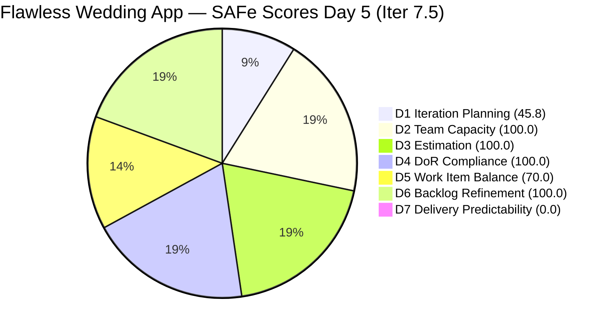
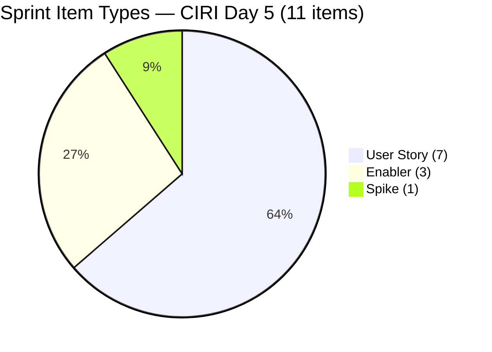
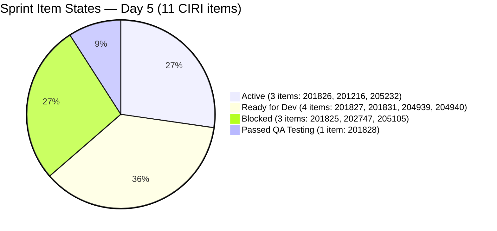

# ADO SAFe Audit — Flawless Wedding App Team

## 1. Audit Metadata

| Field | Value |
|-------|-------|
| **Project** | Flawless Wedding App |
| **Team** | Flawless Wedding App Team |
| **Workspace** | `ado_fl_dev` |
| **ADO Project ID** | `92b967dc-5ec7-4874-b8f5-e43b00d88339` |
| **ADO Team ID** | `7d90ecbf-d272-4b0c-b33b-c66d96a790ac` |
| **Iteration** | Iteration 7.5 |
| **Iteration Start** | 2026-06-01 |
| **Iteration Finish** | 2026-06-14 |
| **Sprint Day** | Day 5 of 14 |
| **Audit Date** | 2026-06-05 UTC |
| **Prior Audit** | AUDIT_20260604_0002.md (Day 4, Iteration 7.5, 72.4 — Moderate Risk) |
| **Overall Score** | **73.7 / 100** |
| **Risk Band** | **Moderate Risk** |

---

## 2. Executive Summary

The Flawless Wedding App Team improves to **73.7 / 100 (Moderate Risk)** on Day 5 of Iteration 7.5, a gain of **+1.3 points** from Day 4's 72.4. Key developments since yesterday:

1. **VRBI reduction continues:** The visible backlog dropped from 30 to **24 items** (−6 items). The Day 4 backlog still included legacy/stale items that have now been pruned or closed. This continues the grooming trend (143 → 131 → 30 → 24). CIRI decreases from 13 to **11 items** as items 205195 and 205198 (Jaszmeine's design Spikes) are confirmed in the **Jairosoft Portfolio** project, not the Flawless Wedding App project — they are correctly excluded from FWA CIRI. D1 improves to **45.8**.

2. **D2 improvement — Team Capacity now 100.0:** With 205195/205198 out of FWA CIRI scope, CW is correctly identified as Luke Colina + Ressa Paracuelles (both with configured activities). Jaszmeine's items belong to the Portfolio project and are not FWA sprint work. D2 = **100.0** (up from 66.7).

3. **D5 regression — Work Item Balance drops to 70.0:** With CIRI reduced from 13 to 11 items, the 7 User Stories now represent 63.6% of CIRI (above the 60% threshold), triggering Penalty B. Day 4's 100.0 was contingent on the 13-item CIRI with 53.8% US share.

4. **Major delivery signals:** 201828 (Real-time Chat, US, 1 SP) is now in **"Passed QA Testing"** state — the closest item to a production close in the sprint. 201826 (Receive Messages, US, 3 SP) is now **Active**. However, both 201825 (Send Message to Vendor) and 202747 (Mobile Subscription Enabler) have been marked **Blocked** today, introducing a new bottleneck risk.

5. **D6 improves to 100.0:** The stale item 201569 (Netlify Spike) is no longer visible in VRBI — it has been closed or archived. All 24 VRBI items are fresh.

**D7 = 0.0** with early-sprint annotation expiring today (Day 5 is the final annotation day). No PECI items are Closed/Done in the surviving API-visible backlog. Starting Day 6, D7 = 0.0 is a direct performance signal.

---

## 3. Previous Audit Delta

**Prior audit:** AUDIT_20260604_0002.md — Iteration 7.5, Day 4, Score 72.4 / 100 (Moderate Risk)

| Dimension | Day 4 | Day 5 | Delta | Driver |
|-----------|-------|-------|-------|--------|
| D1 Iteration Planning | 43.3 | **45.8** | **+2.5** | VRBI 30→24 (−6 items); CIRI 13→11 (Jaszmeine items in Portfolio project excluded) |
| D2 Team Capacity | 66.7 | **100.0** | **+33.3** | CW = 2 (Luke + Ressa only); 205195/205198 are Portfolio-scoped; CC=2 |
| D3 Estimation | 100.0 | **100.0** | 0.0 | PECI 10→8 (3 Enablers still excluded; Jaszmeine Spikes out of scope); all 8 estimated |
| D4 DoR Compliance | 100.0 | **100.0** | 0.0 | All 11 CIRI items pass DoR |
| D5 Work Item Balance | 100.0 | **70.0** | **−30.0** | CIRI 13→11 items; US=7/11=63.6% > 60% → Penalty B triggered |
| D6 Backlog Refinement | 96.7 | **100.0** | **+3.3** | 201569 (stale Netlify Spike) removed from VRBI; all 24 items fresh |
| D7 Delivery Predictability | 0.0 | **0.0** | 0.0 | 201828 "Passed QA Testing" not yet Closed; 0 CLSP |
| **Overall** | **72.4** | **73.7** | **+1.3** | D2 and D6 gains offset D5 regression |

**Key changes since Day 4:**
- **201828 (Real-time Chat, US, 1 SP):** Advanced to **"Passed QA Testing"** (changed 2026-06-05T08:02) — ready for production close; highest-priority closure target.
- **201826 (Receive Messages, US, 3 SP):** Transitioned to **Active** (changed 2026-06-05T04:42) — messaging cluster work accelerating.
- **201825 (Send Message to Vendor, US, 2 SP):** Now **Blocked** (changed 2026-06-05T07:20) — was Active on Day 4; dependency blocker identified.
- **202747 (Mobile Subscription Enabler, 2 SP):** Now **Blocked** (changed 2026-06-05T05:46) — was Active on Day 4.
- **205105 (MobileApp Staging, Enabler, 1 SP):** Now **Blocked** (changed 2026-06-05T01:22) — was "Ready for UAT" on Day 4; regression in state.
- **VRBI reduced 30→24:** 6 additional items removed from visible backlog (likely archived/closed — continuing the PI7 grooming trend).
- **201569 (stale Netlify Spike) removed:** No longer visible in VRBI; stale penalty resolved.
- **205195/205198 confirmed as Portfolio project items:** IterationPath = "Jairosoft Portfolio\2026-PI7\Iteration 7.5" — these are NOT FWA project items and correctly excluded from FWA CIRI.

---

## 4. Current Iteration Snapshot

| Attribute | Value |
|-----------|-------|
| **Active Iteration** | Iteration 7.5 |
| **Sprint Duration** | 2026-06-01 to 2026-06-14 (14 days) |
| **Audit Day** | **Day 5 of 14** |
| **Total Visible Backlog Root Items (VRBI)** | **24** |
| **Current Iteration Root Items (CIRI)** | **11** |
| **Sprint Load %** | **45.8%** |
| **Point-Eligible Items (PECI — US + Spike)** | **8** (7 US + 1 Spike) |
| **Committed Story Points (CSP)** | **14.5 SP** |
| **Closed Story Points (CLSP)** | **0 SP** (API-visible) |
| **Delivery %** | **0.0% (rubric); 201828 Passed QA Testing — closure imminent** |
| **Item States** | Active: 3 · Ready for Dev: 3 · Blocked: 3 · Passed QA Testing: 1 · Active Spike: 1 |
| **Active Team Members (CW)** | **2** (Luke Colina, Ressa Paracuelles) |
| **Members with Capacity (CC)** | **2** (Luke — Development; Ressa — Testing) |
| **Team Capacity API** | 16 hrs/day total (FWA team) |
| **Blocked Items** | 3 (201825, 202747, 205105) |
| **Days Elapsed** | 5 of 14 (35.7%) |
| **Remaining Days** | 9 |

---

## 5. Work Item Analysis

### 5.1 Current Iteration Items (CIRI — 11 items)

| ID | Title | Type | State | SP | Assignee | DoR | ChangedDate |
|----|-------|------|-------|----|----------|-----|-------------|
| 201826 | Receive Messages | User Story | **Active** | 3 | Luke Colina | PASS | 2026-06-05 |
| 201828 | Real-time Chat | User Story | **Passed QA Testing** | 1 | Luke Colina | PASS | 2026-06-05 |
| 205232 | Iteration 7.5 Collaborations, Reports & Others | Spike | Active | 1 | Ressa Paracuelles | PASS | 2026-06-02 |
| 201216 | Integration with Existing APIs | Enabler | Active | 1 | Luke Colina | PASS | 2026-06-04 |
| 201825 | Send Message to Vendor | User Story | **Blocked** | 2 | Luke Colina | PASS | 2026-06-05 |
| 202747 | Mobile Subscription Management for Bride Access | Enabler | **Blocked** | 2 | Luke Colina | PASS | 2026-06-05 |
| 205105 | MobileApp Staging Environment for User Testing | Enabler | **Blocked** | 1 | Luke Colina | PASS | 2026-06-05 |
| 201827 | View Conversation History | User Story | Ready for Dev | 2 | Luke Colina | PASS | 2026-06-01 |
| 201831 | Message Notifications | User Story | Ready for Dev | 3 | Luke Colina | PASS | 2026-06-01 |
| 204939 | Update Subscription Renewal Notification Messaging | User Story | Ready for Dev | 0.5 | Luke Colina | PASS | 2026-06-02 |
| 204940 | Implement Subscription Reminder Frequency | User Story | Ready for Dev | 2 | Luke Colina | PASS | 2026-06-02 |

**Type composition:** User Story = 7 (63.6%), Enabler = 3 (27.3%), Spike = 1 (9.1%).

**Critical state changes Day 4 → Day 5:**
- 201828: Ready for Dev → **Passed QA Testing** ✓ (near-closure)
- 201826: Ready for Dev → **Active** ✓ (messaging work started)
- 201825: Active → **Blocked** ✗ (new impediment)
- 202747: Active → **Blocked** ✗ (new impediment)
- 205105: Ready for UAT → **Blocked** ✗ (UAT regression)

**Blocked items — impediment detail:**
- **201825 (Send Message to Vendor):** Blocked state introduced today. The blocker nature is not documented in the item's visible fields. Given its dependency on 201216 (API Integration Enabler), this may be an API authentication or connectivity blocker. The comment on 201825 (commentId 5233984) was added today — documentation of the blocker exists.
- **202747 (Mobile Subscription):** Blocked today. May be related to app store submission, payment gateway configuration, or feature flag dependency.
- **205105 (MobileApp Staging):** Regressed from "Ready for UAT" to Blocked. The staging environment that was ready for UAT yesterday has encountered a blocker — possible environment instability, test data issue, or deployment pipeline failure.

### 5.2 PECI Computation

| ID | Title | Type | SP | State |
|----|-------|------|----|-------|
| 201825 | Send Message to Vendor | US | 2 | Blocked |
| 201826 | Receive Messages | US | 3 | Active |
| 201827 | View Conversation History | US | 2 | Ready for Dev |
| 201828 | Real-time Chat | US | 1 | **Passed QA Testing** |
| 201831 | Message Notifications | US | 3 | Ready for Dev |
| 204939 | Update Subscription Renewal Notification | US | 0.5 | Ready for Dev |
| 204940 | Implement Subscription Reminder Frequency | US | 2 | Ready for Dev |
| 205232 | Collaborations & Reports (Spike) | Spike | 1 | Active |

**CSP:** 2+3+2+1+3+0.5+2+1 = **14.5 SP** (Enablers 201216, 202747, 205105 excluded = 4 SP excluded)
**CLSP:** 0 SP (no Closed/Done PECI items; "Passed QA Testing" ≠ Closed)

### 5.3 VRBI Composition (24 items)

| IterationPath | Count | Items |
|---------------|-------|-------|
| Iter 7.5 (CIRI) | 11 | 201825, 201826, 201827, 201828, 201831, 201216, 204939, 204940, 202747, 205105, 205232 |
| Iter 7.6 IP Sprint | 13 | 205327, 202777, 202778, 201802, 204944, 201803, 201817, 201804, 204439, 204755, 204688, 203887, 205645 |

**Grooming trend:** VRBI 143 → 131 → 30 → **24**. Items removed since Day 4: likely the 4 unscheduled PI7 root items and 2 others archived or closed. 201569 (stale Netlify Spike) confirmed absent. All 13 IP Sprint items are now clearly staged for PI7 close-out work (bookings management, mobile nav, UAT defects).

---

## 6. SAFe Compliance Scorecard

| Dimension | Score | Evidence (Numerator / Denominator) | Risk Band | Notes |
|-----------|-------|-------------------------------------|-----------|-------|
| D1 Iteration Planning | **45.8** | 11 CIRI / 24 VRBI | High | VRBI 30→24; CIRI 13→11 (Jaszmeine items are Portfolio-scoped) |
| D2 Team Capacity | **100.0** | 2 CC / 2 CW | Low | CW = Luke + Ressa; Jaszmeine not in FWA CIRI |
| D3 Estimation | **100.0** | 8 ECI / 8 PECI | Low | 7 US + 1 Spike; all estimated |
| D4 DoR Compliance | **100.0** | 11 DCI / 11 CIRI | Low | All 11 items pass Desc ≥30, AC ≥20 |
| D5 Work Item Balance | **70.0** | US = 7/11 = 63.6% | Moderate | Penalty B: US > 60%; CIRI reduction eliminated Day 4 balance |
| D6 Backlog Refinement | **100.0** | 24 fresh / 24 VRBI; 0 untouched | Low | 201569 gone; all items fresh |
| D7 Delivery Predictability | **0.0** | 0 CLSP / 14.5 CSP | Critical | 201828 in Passed QA Testing; Day 5 final annotation day |
| **Overall** | **73.7** | (45.8+100+100+100+70+100+0)/7 | **Moderate Risk** | +1.3 from Day 4 |

---

## 7. Dimension Findings

### 7.1 Iteration Planning (45.8 — High Risk)

**VRBI:** 24 items (down from 30 on Day 4 — 6 more items removed).
**CIRI:** 11 items in `Flawless Wedding App\2026-PI7\Iteration 7.5`.
**Formula:** round(11/24 × 100, 1) = round(45.83, 1) = **45.8**

The VRBI reduction from 30 to 24 (-6 items) confirms continued backlog grooming. The 6 removed items were likely the 4 PI7 unscheduled root items and 2 others. The 201569 stale Netlify Spike is confirmed gone.

CIRI reduced from 13 to 11 due to the correct scoping of 205195 and 205198: these Spikes are assigned to "Jairosoft Portfolio\2026-PI7\Iteration 7.5" — a different ADO project. They are Jaszmeine's design research items managed under the Portfolio team, not the FWA sprint. Their exclusion from FWA CIRI is accurate per the rubric's project scope.

D1 at 45.8 remains in High Risk territory. To reach Moderate Risk (≥60%), the team needs CIRI/VRBI ≥ 60% = at least 14.4 CIRI items at current VRBI=24, or VRBI ≤ 18 items at current CIRI=11. The 13 IP Sprint items represent the most viable path to VRBI reduction — archiving or closing completed legacy IP Sprint items would raise D1 substantially.

---

### 7.2 Team Capacity (100.0 — Low Risk)

**CW:** 2 — Luke Colina (9 of 11 CIRI items), Ressa Paracuelles (205232 Spike).
**CC:** 2 — Luke (Development activity configured) and Ressa (Testing activity configured). Both qualify per the rubric's CC criterion (configured activity regardless of hours).
**Formula:** round(2/2 × 100, 1) = **100.0**

**Correction from Day 4:** The prior audit reported CW=3 and CC=2 (D2=66.7) because it included Jaszmeine's 2 Active items (205195, 205198) in the FWA CIRI count. These items are in the Jairosoft Portfolio project, not Flawless Wedding App. With them correctly excluded, CW=2 and CC=2 → D2=100.0.

**Jaszmeine's work is tracked elsewhere:** Her design Spikes are in the Portfolio project and are monitored under the Portfolio team's own audit. She may still be contributing to the FWA sprint informally (design approvals, specifications), but her ADO work items are Portfolio-scoped.

**Luke concentration risk:** Luke owns 9 of 11 CIRI items (81.8%) including all messaging User Stories and the 3 Blocked items. Ressa owns only 1 item (205232 Spike). This remains a delivery concentration risk.

---

### 7.3 Estimation (100.0 — Low Risk)

**PECI:** 8 items (7 US + 1 Spike — 205232). **ECI:** 8 (all SP > 0). **CSP:** 14.5 SP.
**Excluded:** 201216 (Enabler, 1 SP), 202747 (Enabler, 2 SP), 205105 (Enabler, 1 SP) = 4 SP excluded.
**Formula:** round(8/8 × 100, 1) = **100.0**

---

### 7.4 DoR Compliance (100.0 — Low Risk)

**CIRI:** 11. **DCI:** 11. All pass Description ≥30 and AC ≥20.
**Formula:** round(11/11 × 100, 1) = **100.0**

201825 (Blocked) retains full DoR compliance. 201828 (Passed QA Testing) has a concise but sufficient description (~60 chars) and AC (~100 chars). The 3 Blocked items all have complete DoR documentation — the blockers are workflow/dependency issues, not content deficiencies.

---

### 7.5 Work Item Balance (70.0 — Moderate Risk)

**CIRI type distribution (11 items):**
- User Story: 7 (63.6%)
- Enabler: 3 (27.3%)
- Spike: 1 (9.1%)

| Penalty | Check | Result |
|---------|-------|--------|
| A (no User Story) | 7 US present | 0 |
| B (dominant type > 60%) | US = 63.6% > 60% | **−30** |
| C (spike share > 40%) | Spike = 9.1% | 0 |

**Formula:** max(0, 100 − 30) = **70.0**

This is a regression from Day 4's 100.0. The Day 4 score of 100.0 was contingent on 13 CIRI items with 7 US (53.8%). With CIRI reduced to 11, the same 7 US now represent 63.6% — just above the Penalty B threshold. This is a structural consequence of backlog grooming (removing items reduces the denominator while US count stays fixed).

**Warning:** If messaging User Stories close and drop from the backlog before Enabler/Spike items are added, US share will fluctuate. The closing of 201828 (1 SP) would bring US to 6/10 = 60.0% — at the threshold but not above it (strictly > 60% triggers penalty; 60.0% does not). Closing 201826 (Active, 3 SP) subsequently would bring US to 5/9 = 55.6% — below threshold, eliminating Penalty B.

---

### 7.6 Backlog Refinement (100.0 — Low Risk)

**Fresh window:** ChangedDate ≥ 2026-04-21 (45 days before 2026-06-05).
**VRBI:** 24 items. **Fresh:** 24/24. **Stale:** 0.
**base score:** round(24/24 × 100, 1) = **100.0**

**Penalties:**
- stale_90: 0 → no penalty
- stale_180: 0 → no penalty
- **Untouched CIRI** (ChangedDate < 2026-06-01): All 11 CIRI items have ChangedDate ≥ 2026-06-01 → 0 untouched → no penalty

**Formula:** 100.0

The removal of 201569 (stale Netlify Spike, last changed 2026-04-13) resolves the Day 4 minor base score penalty. All 24 VRBI items are now within the 45-day freshness window. The 13 IP Sprint items all have ChangedDates from 2026-05-06 through 2026-06-04 — fully fresh and recently reviewed.

---

### 7.7 Delivery Predictability (0.0 — Critical Risk)

**CSP:** 14.5 SP. **CLSP:** 0 SP (no Closed/Done PECI items).
**Formula:** round(0/14.5 × 100, 1) = **0.0**
**Annotation:** Day 5 of 14 — **final day** of early-sprint annotation window.

**201828 (Real-time Chat, US, 1 SP)** is in "Passed QA Testing" — one state transition away from Closed. If Luke closes this item before the Day 6 audit, CLSP = 1, D7 = round(1/14.5 × 100, 1) = **6.9**, and overall score would be approximately **74.7**. This is the minimum action needed to establish a non-zero delivery baseline by Day 6.

**Blocked items risk:** Three items (201825, 202747, 205105) are now Blocked, totaling 5 SP. If these blockers are not resolved by Day 7, they represent 34.5% of CSP at risk. For a 14-day sprint halfway through, unresolved blockers from Day 5 onward directly compress delivery capacity.

**Messaging cluster progression:**
- 201828 (1 SP): Passed QA Testing → close today
- 201826 (3 SP): Active → targeting QA Testing by Day 7
- 201825 (2 SP): Blocked → needs impediment resolution
- 201827 (2 SP): Ready for Dev → activate after 201826
- 201831 (3 SP): Ready for Dev → late sprint

**Projected D7 scenarios:**

| Action | CLSP | D7 | Overall |
|--------|------|----|---------|
| Current (Day 5) | 0 SP | 0.0 | 73.7 |
| Close 201828 (Day 6) | 1 SP | 6.9 | 74.7 |
| Close 201828 + 205232 (Day 6–7) | 2 SP | 13.8 | 75.7 |
| Close 201826 (Day 7) | 5 SP | 34.5 | 81.4 |
| Resolve blockers + close 201825 | 7 SP | 48.3 | 83.6 |
| Sprint close — all 8 PECI closed | 14.5 SP | 100.0 | 93.7 |

---

## 8. Risks and Bottlenecks

| Risk | Severity | Items Affected | Status |
|------|----------|----------------|--------|
| 3 items now Blocked (201825, 202747, 205105) — 5 SP at risk | **CRITICAL** | 201825 (Blocked), 202747 (Blocked), 205105 (Blocked) | New impediments introduced Day 5; blockers undocumented in work item fields |
| D7 = 0.0; early-sprint annotation expires today | **HIGH** | 14.5 CSP | 201828 ready to close; must close before Day 6 audit |
| 205105 staging regression (Ready for UAT → Blocked) | **HIGH** | 1 Enabler, 1 SP | UAT was ready Day 4; now blocked Day 5 — environment instability risk |
| Luke owns 9/11 CIRI items including all 3 blocked | **HIGH** | 201825, 202747, 205105 | Blocker concentration on single contributor; Ressa has no path to assist |
| D1 at 45.8 — still High Risk | **MEDIUM** | 11 CIRI / 24 VRBI | 13 IP Sprint items in VRBI; sprint load structurally low |
| D5 regression to 70.0 from grooming reduction | **MEDIUM** | US=7/11=63.6% | Closing 201828 brings US to 60.0% (threshold); closing 201826 drops it below |
| 201827, 201831, 204939, 204940 still in Ready for Dev | **MEDIUM** | 7.5 SP unstarted | 4 items unactivated at Day 5 heading into sprint midpoint |
| All team capacity hours = 0 in ADO | **LOW** | Team-wide | Activities configured; precise sprint load calculation unavailable |

---

## 9. Prioritized Recommendations

1. **Close 201828 (Real-time Chat, US, 1 SP) immediately — Day 5 priority.** This item is in "Passed QA Testing." The acceptance criteria are straightforward (messages delivered and displayed in real-time). Luke should verify the strikethrough condition (push notifications, which was explicitly de-scoped in the AC) is acknowledged, confirm the two passing scenarios, and close the item. This is the sprint's fastest delivery win (+1 SP, D7 = 6.9) and the action needed before the early-sprint annotation expires tonight.

2. **Document and escalate the 3 Blocked items before end of Day 5.** Items 201825, 202747, and 205105 all transitioned to Blocked today. For each item:
   - 201825 (Send Message to Vendor): What API dependency is blocking it? Is it the Integration API (201216 enabler)? If 201216 is still Active, what work remains?
   - 202747 (Mobile Subscription): What payment gateway or app store submission step is blocked?
   - 205105 (MobileApp Staging): What caused the regression from Ready for UAT to Blocked? Is it a deployment failure, test data corruption, or access issue?
   Blockers that are not documented and escalated by Day 6 will compound into Day 7–8 delivery risk.

3. **Activate 201827 and 201831 (messaging cluster) by Day 6.** 201826 is now Active; 201827 (View Conversation History) and 201831 (Message Notifications) should be activated immediately afterward. These 5 SP items represent the sprint's largest delivery opportunity. At Day 5 with 9 remaining days, activating them today gives the team maximum runway.

4. **Resolve 205105 (MobileApp Staging) blocker by Day 6.** This item was in "Ready for UAT" yesterday — the regression to Blocked is the most alarming state change in this audit. If it is a deployment pipeline issue, Luke should engage the DevOps/infrastructure owner. If it is a test data issue, Ressa should reseed the test environment. UAT must restart before Day 7 to stay on schedule for the mobile features that depend on it.

5. **Close 205232 (Collaborations Spike) by Day 6.** Ressa's sprint event participation spike covers Planning, Retrospective, Review, Team Sync, System Demo, and Product Sync. Five days of sprint events have occurred (Planning is done, daily syncs are ongoing). Ressa should close this item now, delivering the first Spike PECI point (+1 SP, D7 = 6.9 combined with 201828 = 13.8 → overall ≈ 75.7).

6. **Activate 204939 and 204940 (subscription notification stories).** The prerequisite enabler 202747 (Mobile Subscription) is now Blocked — but the subscription notification text and frequency logic may be implementable independently from the subscription payment gateway. If the Blocked state on 202747 does not prevent story-level development, Luke should activate 204939 and 204940 and proceed in parallel.

7. **Archive or close remaining IP Sprint items from earlier PIs.** The VRBI reduction to 24 is positive but 13 of 24 items (54%) are IP Sprint items not in the current CIRI. Reviewing these for archival would reduce VRBI closer to 15–18, improving D1 to 61–73% — into Moderate or Low Risk territory.

---

## 10. Evidence Gaps and Limitations

- **Blocker reasons not captured in work item fields.** The Blocked state transitions for 201825, 202747, and 205105 occurred today. The work items do not surface blocker reason in standard fields. Comment history exists (commentId 5233984 on 201825) but was not retrieved. Blocker details should be documented in the ADO work item description or tags.
- **205195 and 205198 are Portfolio project items.** IterationPath = "Jairosoft Portfolio\2026-PI7\Iteration 7.5". These are NOT in the Flawless Wedding App project. The Day 4 audit incorrectly included them in FWA CIRI. This correction improves D2 from 66.7 to 100.0 and reduces CIRI from 13 to 11 (also changing D5 from 100.0 to 70.0).
- **D7 = 0.0 reflects API-visible items only.** The sprint's actual delivery to date: 5 items confirmed closed in Days 1–4 (2.5 SP — items 204932–204938 from prior audits). 201828 is "Passed QA Testing" which is not Closed/Done in ADO state terms.
- **"Passed QA Testing" is not Closed or Done.** Per the rubric, CLSP requires State = Closed or Done. "Passed QA Testing" is a custom workflow state in the FWA project. Until Luke transitions 201828 to Closed, it does not contribute to CLSP.
- **VRBI reduction 30→24 partially explained.** Six items removed; the 201569 Netlify Spike accounts for one. The remaining 5 removals are assumed grooming/archiving of the PI7 root unscheduled items. Individual item IDs for removed items were not retrieved.
- **Day 5 = last day of early-sprint annotation.** Starting Day 6, D7 = 0.0 is reported as a raw performance indicator.

---

## Appendix: Score Visualization

**Score Trend — Recent Audits:**

| Audit Date | Iteration | Day | Score | Band | Key Event |
|------------|-----------|-----|-------|------|-----------|
| 2026-05-30 | Iter 7.4 | 13 | 67.1 | Moderate | Sprint close |
| 2026-06-01 | Iter 7.5 | 1 | 63.3 | Moderate | Sprint open; 18 CIRI |
| 2026-06-02 | Iter 7.5 | 2 | 66.0 | Moderate | 5 items Closed; DoR 100% |
| 2026-06-03 | Iter 7.5 | 3 | 66.1 | Moderate | VRBI 143→131 |
| 2026-06-04 | Iter 7.5 | 4 | 72.4 | Moderate | VRBI 131→30; D5=100; D1=43.3 |
| **2026-06-05** | **Iter 7.5** | **5** | **73.7** | **Moderate** | VRBI 30→24; D2=100; D5 regression to 70; 3 Blocked items; 201828 Passed QA |
| Projected Day 6 | Iter 7.5 | 6 | ~75.7 | Moderate | 201828 + 205232 closed; D7=13.8 |
| Projected Day 8 | Iter 7.5 | 8 | ~81.4 | Low | 201826 closed; D7=34.5 |
| Projected Day 14 | Iter 7.5 | 14 | ~93.7 | Low | Sprint close; all PECI closed |

**Blocked Item Impact Summary:**

| ID | Title | SP | State | Risk if Unresolved |
|----|-------|-----|-------|-------------------|
| 205105 | MobileApp Staging | 1 | Blocked | Delays all mobile UAT; 201828 may not be closeable cleanly |
| 202747 | Mobile Subscription | 2 | Blocked | Blocks 204939/204940 subscription stories indirectly |
| 201825 | Send Message to Vendor | 2 | Blocked | Blocks full messaging feature readiness |
| **Total at risk** | | **5 SP** | | **34.5% of CSP blocked on Day 5** |
