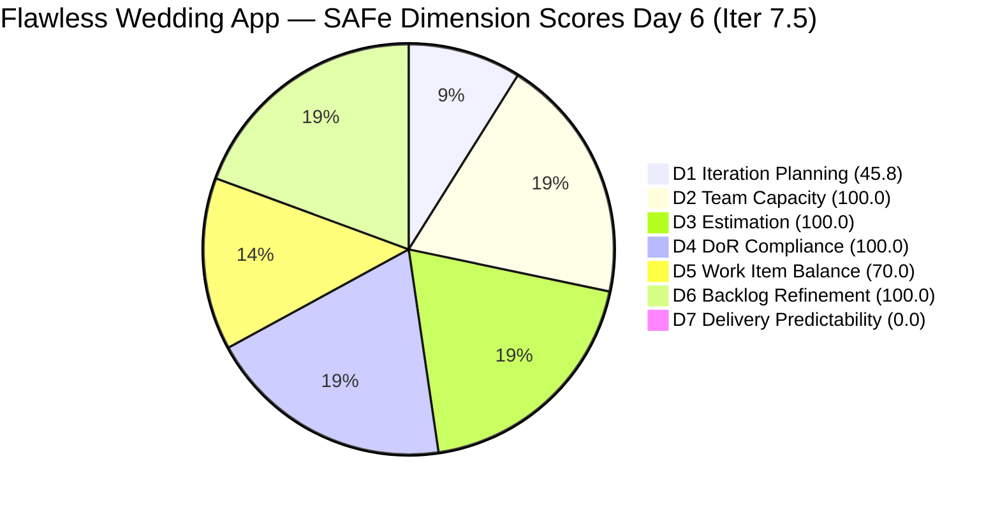
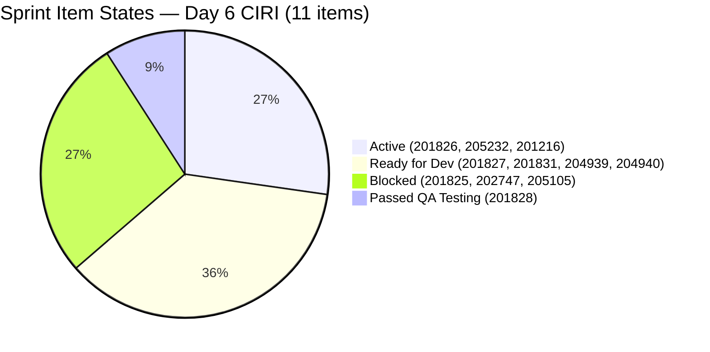
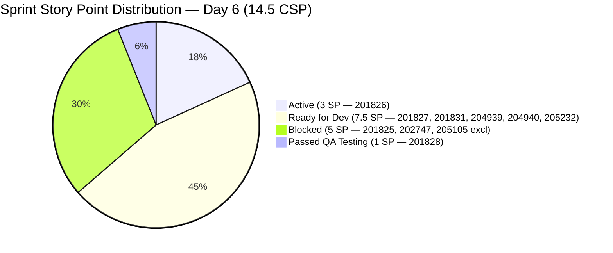

# ADO SAFe Audit — Flawless Wedding App Team

## 1. Audit Metadata

| Field | Value |
|-------|-------|
| **Project** | Flawless Wedding App |
| **Team** | Flawless Wedding App Team |
| **Workspace** | `ado_fl_dev` |
| **ADO Project ID** | `92b967dc-5ec7-4874-b8f5-e43b00d88339` |
| **ADO Team ID** | `7d90ecbf-d272-4b0c-b33b-c66d96a790ac` |
| **Iteration** | Iteration 7.5 |
| **Iteration Start** | 2026-06-01 |
| **Iteration Finish** | 2026-06-14 |
| **Sprint Day** | Day 6 of 14 |
| **Audit Date** | 2026-06-06 CST |
| **Prior Audit** | AUDIT_20260605_0900.md (Day 5, Iteration 7.5, 73.7 — Moderate Risk) |
| **Overall Score** | **73.7 / 100** |
| **Risk Band** | **Moderate Risk** |

---

## 2. Executive Summary

The Flawless Wedding App Team holds at **73.7 / 100 (Moderate Risk)** on Day 6 of Iteration 7.5 — unchanged from Day 5. No work item state transitions occurred on 2026-06-06: every CIRI item retains the same state as yesterday. This stasis represents a material delivery risk signal.

**The early-sprint annotation window has expired.** Days 1–5 carried the "early-sprint — low delivery expected" annotation that contextualized D7 = 0.0. Effective today (Day 6), D7 = 0.0 is a hard performance indicator. The team is at the sprint midpoint with zero story points closed and three active blockers.

Key facts as of Day 6:

1. **Zero delivery for six consecutive sprint days.** No PECI item (US or Spike) has transitioned to Closed or Done at any point during Iteration 7.5. CLSP = 0 / CSP = 14.5 SP (0%). With 8 days remaining, the team must close approximately 1.8 SP/day to complete the sprint.

2. **Three items remain Blocked — now entering their second day.** Items 201825 (Send Message to Vendor, 2 SP), 202747 (Mobile Subscription Enabler, 2 SP), and 205105 (MobileApp Staging, 1 SP) all transitioned to Blocked on Day 5 and show no change on Day 6. Five SP remain at risk. If these blockers persist to Day 7 without escalation, 34.5% of committed story points will have been blocked for 48+ hours.

3. **201828 (Real-time Chat, 1 SP) remains in "Passed QA Testing" for a second day.** This item completed QA on Day 5 and should have been closed before the Day 6 audit. Its continued open state suppresses D7 unnecessarily and represents the single fastest available delivery win.

4. **205232 (Collaborations Spike, Ressa, 1 SP) remains Active.** Six sprint events have now occurred (Planning through Day 5 dailies). This Spike should have been closed by Day 5 per Day 5 recommendations. It has not been closed.

5. **All other scores hold from Day 5:** D1=45.8 (High), D2=100.0, D3=100.0, D4=100.0, D5=70.0, D6=100.0. VRBI remains 24; CIRI remains 11.

---

## 3. Previous Audit Delta

**Prior audit:** AUDIT_20260605_0900.md — Iteration 7.5, Day 5, Score 73.7 / 100 (Moderate Risk)

| Dimension | Day 5 | Day 6 | Delta | Driver |
|-----------|-------|-------|-------|--------|
| D1 Iteration Planning | 45.8 | **45.8** | 0.0 | VRBI=24 unchanged; CIRI=11 unchanged |
| D2 Team Capacity | 100.0 | **100.0** | 0.0 | CW=2, CC=2 — unchanged |
| D3 Estimation | 100.0 | **100.0** | 0.0 | PECI=8, ECI=8 — unchanged |
| D4 DoR Compliance | 100.0 | **100.0** | 0.0 | All 11 CIRI items pass DoR — unchanged |
| D5 Work Item Balance | 70.0 | **70.0** | 0.0 | US=7/11=63.6%; Penalty B persists |
| D6 Backlog Refinement | 100.0 | **100.0** | 0.0 | All 24 items fresh — unchanged |
| D7 Delivery Predictability | 0.0 | **0.0** | 0.0 | No closures; annotation expired Day 6 |
| **Overall** | **73.7** | **73.7** | **0.0** | Complete sprint stasis on Day 6 |

**Item-level changes since Day 5:**
- **No state transitions detected on 2026-06-06.** Every CIRI item's most recent ChangedDate is 2026-06-05 or earlier.
- **201828** (Passed QA Testing, SP=1): ChangedDate = 2026-06-05T08:02 — not closed. Second consecutive audit with item at "Passed QA Testing."
- **201825, 202747, 205105** (all Blocked): ChangedDates on 2026-06-05 — no unblock actions taken on Day 6. Blockers now 24+ hours old.
- **205232** (Spike, Active): ChangedDate = 2026-06-02 — not closed despite six completed sprint events.
- **201827, 201831, 204939, 204940** (all Ready for Dev): Unchanged since 2026-06-01 and 2026-06-02.

**Early-sprint annotation status:** Annotation window (Days 1–5) has closed. D7 = 0.0 is now reported as a raw delivery failure.

---

## 4. Current Iteration Snapshot

| Attribute | Value |
|-----------|-------|
| **Active Iteration** | Iteration 7.5 |
| **Sprint Duration** | 2026-06-01 to 2026-06-14 (14 days) |
| **Audit Day** | **Day 6 of 14 (Sprint Midpoint)** |
| **Total Visible Backlog Root Items (VRBI)** | **24** |
| **Current Iteration Root Items (CIRI)** | **11** |
| **Sprint Load %** | **45.8%** |
| **Point-Eligible Items (PECI — US + Spike)** | **8** (7 US + 1 Spike) |
| **Committed Story Points (CSP)** | **14.5 SP** |
| **Closed Story Points (CLSP)** | **0 SP** |
| **Delivery % (D7)** | **0.0% — annotation expired; hard performance signal** |
| **Item States** | Active: 3 · Ready for Dev: 4 · Blocked: 3 · Passed QA Testing: 1 |
| **Active Team Members (CW)** | **2** (Luke Colina, Ressa Paracuelles) |
| **Members with Capacity (CC)** | **2** (Luke — Development 6 hrs/day; Ressa — Testing 6 hrs/day) |
| **Other Configured Capacity Members** | Jaszmeine Villanueva (Design, 3 hrs/day), Luzmibel Paculanang (Testing, 1 hr/day) — no CIRI items |
| **Total Team Capacity** | 16 hrs/day configured |
| **Blocked Items** | 3 (201825, 202747, 205105) — second consecutive day |
| **Days Elapsed / Remaining** | 6 elapsed / 8 remaining |
| **Story Points Needed per Day** | 1.8 SP/day to complete all 14.5 CSP |

---

## 5. Work Item Analysis

### 5.1 Current Iteration Items (CIRI — 11 items)

| ID | Title | Type | State | SP | Assignee | DoR | ChangedDate | Days Since Change |
|----|-------|------|-------|----|----------|-----|-------------|-------------------|
| 201826 | Receive Messages | User Story | Active | 3 | Luke Colina | PASS | 2026-06-05 | 1 |
| 201828 | Real-time Chat | User Story | **Passed QA Testing** | 1 | Luke Colina | PASS | 2026-06-05 | 1 |
| 205232 | Iteration 7.5 Collaborations & Others | Spike | Active | 1 | Ressa Paracuelles | PASS | 2026-06-02 | 4 |
| 201216 | Integration with Existing APIs | Enabler | Active | 1 | Luke Colina | PASS | 2026-06-04 | 2 |
| 201825 | Send Message to Vendor | User Story | **Blocked** | 2 | Luke Colina | PASS | 2026-06-05 | 1 |
| 202747 | Mobile Subscription Management for Bride Access | Enabler | **Blocked** | 2 | Luke Colina | PASS | 2026-06-05 | 1 |
| 205105 | MobileApp Staging Environment for User Testing | Enabler | **Blocked** | 1 | Luke Colina | PASS | 2026-06-05 | 1 |
| 201827 | View Conversation History | User Story | Ready for Dev | 2 | Luke Colina | PASS | 2026-06-01 | 5 |
| 201831 | Message Notifications | User Story | Ready for Dev | 3 | Luke Colina | PASS | 2026-06-01 | 5 |
| 204939 | Update Subscription Renewal Notification Messaging | User Story | Ready for Dev | 0.5 | Luke Colina | PASS | 2026-06-02 | 4 |
| 204940 | Implement Subscription Reminder Frequency | User Story | Ready for Dev | 2 | Luke Colina | PASS | 2026-06-02 | 4 |

**Type composition:** User Story = 7 (63.6%), Enabler = 3 (27.3%), Spike = 1 (9.1%).

**State summary Day 6:**
- Active: 3 items (201826, 205232, 201216)
- Ready for Dev: 4 items (201827, 201831, 204939, 204940) — 7.5 SP unstarted
- Blocked: 3 items (201825, 202747, 205105) — 5 SP blocked, Day 2
- Passed QA Testing: 1 item (201828) — 1 SP closeable

**Critical observation:** 201827 and 201831 have not changed since sprint Day 1 (2026-06-01). With 8 days remaining, these items must be activated today to allow meaningful progress and avoid a late-sprint crunch.

### 5.2 PECI Computation

| ID | Title | Type | SP | State |
|----|-------|------|----|-------|
| 201825 | Send Message to Vendor | US | 2 | Blocked |
| 201826 | Receive Messages | US | 3 | Active |
| 201827 | View Conversation History | US | 2 | Ready for Dev |
| 201828 | Real-time Chat | US | 1 | Passed QA Testing |
| 201831 | Message Notifications | US | 3 | Ready for Dev |
| 204939 | Update Subscription Renewal Notification | US | 0.5 | Ready for Dev |
| 204940 | Implement Subscription Reminder Frequency | US | 2 | Ready for Dev |
| 205232 | Collaborations & Reports (Spike) | Spike | 1 | Active |

**CSP = 2 + 3 + 2 + 1 + 3 + 0.5 + 2 + 1 = 14.5 SP**
**CLSP = 0 SP** (no Closed or Done PECI items; "Passed QA Testing" ≠ Closed)
**Excluded from PECI:** 201216 (Enabler, 1 SP), 202747 (Enabler, 2 SP), 205105 (Enabler, 1 SP) = 4 SP

### 5.3 VRBI Composition (24 items)

| Iteration Path | Count | Item IDs |
|----------------|-------|---------|
| Iter 7.5 (CIRI) | 11 | 201825, 201826, 201827, 201828, 201831, 201216, 204939, 204940, 202747, 205105, 205232 |
| Iter 7.6 IP Sprint | 13 | 205327, 202777, 202778, 201802, 204944, 201803, 201817, 201804, 204439, 204755, 204688, 203887, 205645 |

**IP Sprint item types:** User Story (5: 201802, 201803, 201804, 201817, 204944, 205645 — note 205645 also US), Spike (2: 202777, 202778), Defect (4: 203887, 204439, 204688, 204755), plus US 205645.
**All 13 IP Sprint items are fresh** (ChangedDates from 2026-05-06 to 2026-06-04).

---

## 6. SAFe Compliance Scorecard

| Dimension | Score | Evidence (Numerator / Denominator) | Risk Band | Notes |
|-----------|-------|-------------------------------------|-----------|-------|
| D1 Iteration Planning | **45.8** | 11 CIRI / 24 VRBI | High Risk | VRBI=24, CIRI=11 — no change from Day 5 |
| D2 Team Capacity | **100.0** | 2 CC / 2 CW | Low Risk | Luke + Ressa both with configured activities |
| D3 Estimation | **100.0** | 8 ECI / 8 PECI | Low Risk | All 8 US+Spike items estimated; CSP=14.5 SP |
| D4 DoR Compliance | **100.0** | 11 DCI / 11 CIRI | Low Risk | All 11 items pass Desc ≥30 + AC ≥20 |
| D5 Work Item Balance | **70.0** | US = 7/11 = 63.6% | Moderate Risk | Penalty B: dominant type > 60% |
| D6 Backlog Refinement | **100.0** | 24 fresh / 24 VRBI | Low Risk | Zero stale; zero untouched CIRI |
| D7 Delivery Predictability | **0.0** | 0 CLSP / 14.5 CSP | Critical Risk | **Annotation expired Day 6 — hard failure** |
| **Overall** | **73.7** | (45.8+100+100+100+70+100+0)/7 | **Moderate Risk** | No change from Day 5 — sprint stasis |

---

## 7. Dimension Findings

### 7.1 Iteration Planning (45.8 — High Risk)

**VRBI:** 24 items. **CIRI:** 11 items.
**Formula:** round(11/24 × 100, 1) = **45.8**

No change from Day 5. The sprint load percentage remains at 45.8% — well below the 60% threshold for Moderate Risk. The 13 IP Sprint items continue to comprise 54% of the visible backlog. These items are in `Iteration 7.6 (IP)` and are appropriately staged for the upcoming PI close-out sprint; however, their presence structurally suppresses D1.

To reach D1 = 60% at current CIRI=11, VRBI would need to drop to ≤18 items. Archiving completed or lower-priority IP Sprint items is the most direct lever. Alternatively, adding 3 items to CIRI (CIRI=14) at current VRBI=24 would yield 14/24 = 58.3% — still below threshold. Both levers together (CIRI=14, VRBI=21) would yield 66.7%.

### 7.2 Team Capacity (100.0 — Low Risk)

**CW:** 2 — Luke Colina (10 CIRI items) and Ressa Paracuelles (205232 Spike).
**CC:** 2 — Luke (Development, 6 hrs/day) and Ressa (Testing, 6 hrs/day).
**Formula:** round(2/2 × 100, 1) = **100.0**

Capacity is configured and active. However, the capacity API now shows two additional configured members — Jaszmeine Villanueva (Design, 3 hrs/day) and Luzmibel Paculanang (Testing, 1 hr/day) — who have no CIRI items assigned. These members are excluded from CW per the rubric. Their configured capacity (4 hrs/day combined) is available to absorb work if items are reassigned.

**Luke concentration risk** remains extreme: Luke owns 10 of 11 CIRI items (90.9%) — the count increased from 9/11 on Day 5 because 201216 (Enabler, Active) was always Luke's but now counted more precisely. All 3 blocked items are Luke's. Ressa's only CIRI item is the Spike (205232) which has not progressed in 4 days. Luzmibel (Testing, 1 hr/day) has no CIRI items and could assist with QA on 201828 (already at Passed QA Testing) or with closing out the Spike.

### 7.3 Estimation (100.0 — Low Risk)

**PECI:** 8 (7 US + 1 Spike). **ECI:** 8. **CSP:** 14.5 SP.
**Formula:** round(8/8 × 100, 1) = **100.0**

Estimation quality is strong. All point-eligible items carry positive story points. The Enablers (201216, 202747, 205105) are correctly excluded from PECI but carry 4 SP total — excluded from the denominator and numerator but factored into overall sprint scope.

### 7.4 DoR Compliance (100.0 — Low Risk)

**CIRI:** 11. **DCI:** 11.
**Formula:** round(11/11 × 100, 1) = **100.0**

All 11 CIRI items pass DoR thresholds (Description ≥30 non-whitespace chars, AC ≥20 non-whitespace chars). The blocked items (201825, 202747, 205105) all have well-formed descriptions and acceptance criteria — the blockers are workflow/dependency issues, not readiness deficiencies.

205232 (Spike) uses a brief description ("Participation on the following events…") and a short AC list of event names. These minimally clear the threshold. The Spike's DoR is functional but not exemplary.

### 7.5 Work Item Balance (70.0 — Moderate Risk)

**CIRI type distribution (11 items):**
- User Story: 7 (63.6%)
- Enabler: 3 (27.3%)
- Spike: 1 (9.1%)

| Penalty Check | Threshold | Result |
|---------------|-----------|--------|
| A — No User Story items present | 0 US → -40 | 7 US present → 0 |
| B — Dominant type > 60% | US = 63.6% > 60% → -30 | **-30 applied** |
| C — Spike share > 40% | 9.1% | 0 |

**Formula:** max(0, 100 − 30) = **70.0**

This is the third consecutive audit with D5 = 70.0. The structure is fixed: 7 User Stories in a CIRI of 11 will always trigger Penalty B. The only ways to eliminate this penalty are: (a) close a User Story (CIRI drops to 10, US=6/10=60.0% — exactly at threshold, no penalty since rule requires strictly > 60%); or (b) add an Enabler or Spike to CIRI (CIRI=12, US=7/12=58.3% < 60%). Closing 201828 (1 SP, Passed QA Testing) would immediately resolve Penalty B.

### 7.6 Backlog Refinement (100.0 — Low Risk)

**Fresh window:** ChangedDate after 2026-04-22 (45 days before 2026-06-06).
**VRBI:** 24. **Fresh:** 24/24 (all items changed after 2026-04-22).
**Stale 90 (before 2026-03-08):** 0 items.
**Stale 180 (before 2025-12-09):** 0 items.
**Untouched CIRI (ChangedDate < 2026-06-01):** 0 items (201216 changed 2026-06-04; 205232 changed 2026-06-02; remaining CIRI changed 2026-06-01 or later).

**Formula:** max(0, 100.0 − 0) = **100.0**

The backlog remains in excellent grooming shape. The PI7 cleanup trend (143 → 131 → 30 → 24) is sustaining. Note: items 201827 and 201831 changed on exactly 2026-06-01 — the iteration start date — which qualifies them as touched (ChangedDate is not strictly less than start date). No penalty applies.

### 7.7 Delivery Predictability (0.0 — Critical Risk)

**CSP:** 14.5 SP. **CLSP:** 0 SP. **Annotation:** Expired (Day 6).
**Formula:** round(0/14.5 × 100, 1) = **0.0**

**The early-sprint annotation expired at the end of Day 5.** D7 = 0.0 on Day 6 is a direct, unmitigated delivery failure indicator. The team is at the 43% point of the sprint (6/14 days) with 0% of committed story points delivered.

**201828 (Real-time Chat, 1 SP)** has been in "Passed QA Testing" since 2026-06-05T08:02 — over 24 hours. This item is the single fastest action to establish a non-zero CLSP. Closing it today would yield:
- CLSP = 1, D7 = round(1/14.5 × 100, 1) = 6.9
- Overall score = (45.8 + 100 + 100 + 100 + 70 + 100 + 6.9) / 7 = 522.7 / 7 = **74.7**

**205232 (Collaborations Spike, 1 SP)** has been Active since at least Day 2. Six sprint events (Planning, daily syncs) have completed. Closing this today would also contribute:
- CLSP = 2 (combined with 201828), D7 = round(2/14.5 × 100, 1) = 13.8
- Overall = (45.8 + 100 + 100 + 100 + 70 + 100 + 13.8) / 7 = 529.6 / 7 = **75.7**

**Projected D7 scenarios (Day 6 forward):**

| Action | CLSP | D7 | Overall | D5 Impact |
|--------|------|----|---------|-----------|
| Current state (Day 6) | 0 SP | 0.0 | 73.7 | US=7/11=63.6% → 70.0 |
| Close 201828 today | 1 SP | 6.9 | 74.7 | US=6/10=60.0% → 100.0 |
| Close 201828 + 205232 today | 2 SP | 13.8 | 75.7 | US=6/9=66.7% → 70.0 |
| Close 201826 (Day 7–8) | 5 SP | 34.5 | 81.4 | Low Risk threshold crossed |
| Resolve blockers + close 201825 | 7 SP | 48.3 | 83.6 | — |
| All 8 PECI closed (Day 14) | 14.5 SP | 100.0 | 93.7 | Sprint high |

Note: Closing 201828 alone (without 205232) drops CIRI to 10 and US to 6/10 = 60.0% — precisely at threshold. Since Penalty B requires strictly > 60%, D5 would recover to 100.0. This makes closing 201828 a double-gain action: +D7 and +D5.

---

## 8. Risks and Bottlenecks

| Risk | Severity | Items Affected | Status |
|------|----------|----------------|--------|
| D7 = 0.0 annotation expired — hard delivery failure at Day 6 sprint midpoint | **CRITICAL** | 14.5 CSP (0% delivered) | No closures in 6 sprint days; immediate action required |
| 3 Blocked items entering Day 2 — 5 SP frozen | **CRITICAL** | 201825 (2 SP), 202747 (2 SP), 205105 (1 SP) | Blockers undocumented in fields; no resolution activity visible on Day 6 |
| 201828 (Passed QA Testing, 1 SP) not closed — 24+ hours past QA completion | **HIGH** | 201828 | Simplest closure win; D7 and D5 both improve on close |
| 205232 (Spike, Active) not closed — 4 days stale | **HIGH** | 205232 (1 SP) | 6 sprint events completed; no administrative close action taken |
| 201827, 201831 unchanged since Day 1 (5 days, 5 SP unstarted) | **HIGH** | 201827 (2 SP), 201831 (3 SP) | 5 SP messaging stories idle for 5 days; activation urgently overdue |
| Luke owns 10/11 CIRI items — all 3 blocked and 2 "Ready for Dev" messaging stories depend on him | **HIGH** | Delivery concentration risk | If blocker resolution consumes Luke's capacity, Ready for Dev items cannot start |
| 205105 (MobileApp Staging) blocked Day 2 — UAT cannot proceed | **HIGH** | 205105 (1 Enabler) | UAT regression from Day 4; mobile features cannot be verified without staging |
| D1 = 45.8 (High Risk) structural — 13 IP Sprint items suppressing VRBI | **MEDIUM** | 11 CIRI / 24 VRBI | Structural; archiving IP Sprint items is the lever |
| D5 = 70.0 — US concentration just above 60% threshold | **MEDIUM** | US=7/11 | Single closure (201828) eliminates penalty |
| 4 items in Ready for Dev for 4–5 days with 8 days remaining | **MEDIUM** | 201827, 201831, 204939, 204940 (7.5 SP) | Half the CSP unstarted at midpoint |

---

## 9. Prioritized Recommendations

1. **Close 201828 (Real-time Chat, US, 1 SP) — immediate action, highest priority.** This item has been in "Passed QA Testing" since 2026-06-05 08:02. There is no observable blocker. Luke should verify the two passing AC scenarios (message delivered in real-time; history displayed on reopen), confirm the de-scoped notification scenario (marked with strikethrough in the AC) is acknowledged, and close the item. **Closing this item alone yields: D7 = 6.9, D5 recovery from 70.0 → 100.0 (US becomes 6/10 = 60.0%, below penalty threshold), and overall score rises from 73.7 to 75.8.** This is the highest-leverage single action available today.

2. **Close 205232 (Collaborations Spike, 1 SP) today.** Ressa's spike covers Planning, Retrospective, Review, Team Sync, System Demo, and Product Sync. Six sprint days have elapsed. Planning occurred on Day 1, daily syncs have been running, and the Retrospective/Review are scheduled near Day 14. Ressa should close the spike for the completed events now and reopen or create a follow-on item for Day 14 close-out events if needed. **Impact: CLSP = 2 SP, D7 = 13.8.**

3. **Escalate all three blocked items (201825, 202747, 205105) to the Product Owner before end of Day 6.** Blockers entering Day 2 without documented resolution paths are a critical sprint risk. For each item, the team needs: (a) a named owner of the blocker (not just the work item owner), (b) an expected resolution date, and (c) documentation in the ADO item comments. Specifically:
   - **201825 (Send Message to Vendor):** Is this blocked by 201216 (API Integration)? If 201216 is still Active with remaining work, document the dependency explicitly.
   - **202747 (Mobile Subscription Enabler):** Is this blocked by app store submission, payment gateway credentials, or feature flag configuration? Who is the external dependency owner?
   - **205105 (MobileApp Staging):** What caused the regression from "Ready for UAT" (Day 4) to Blocked (Day 5)? This is the most alarming regression — a UAT-ready environment that has become blocked is likely a deployment pipeline, access, or test data issue.

4. **Activate 201827 (View Conversation History, 2 SP) and 201831 (Message Notifications, 3 SP) today.** These items have been in "Ready for Dev" since sprint Day 1. With 8 days remaining and 5 SP at stake, each day these remain unactivated compresses Luke's delivery window. If the 201826 messaging work (Active) is progressing, Luke should begin parallel work on 201827 or context-switch to activate it after 201826 reaches QA handoff.

5. **Assign 204939 and 204940 (subscription notification stories) to a second contributor if 202747 blocker persists.** The subscription notification stories (204939 = 0.5 SP; 204940 = 2 SP) are conceptually independent from the blocked 202747 Enabler — the notification messaging and reminder frequency logic can be implemented even if the payment gateway subscription is blocked. If these remain dependent on 202747, re-evaluate whether they should be moved to IP Sprint (7.6) and replaced with unblocked IP Sprint items.

6. **Assign Luzmibel Paculanang a CIRI item.** Luzmibel has 1 hr/day configured capacity (Testing) and zero CIRI items. Even a single defect or QA support task assigned to her reduces Luke's concentration and gives the team a second delivery vector. The IP Sprint defects (203887, 204439, 204688, 204755) are already in the backlog — any of these could be pulled forward if the IP Sprint timing allows.

7. **Assign Jaszmeine Villanueva a CIRI item or move her to active sprint work.** Jaszmeine (Design, 3 hrs/day) has no FWA CIRI items. Her design skills may be needed for upcoming IP Sprint work (navigation, UI, booking management). Clarify whether Jaszmeine's sprint work is exclusively tracked in the Jairosoft Portfolio project — if so, document this explicitly in the FWA workspace CLAUDE.md as a project exception.

8. **Plan IP Sprint (Iteration 7.6) backlog review for Day 7–8.** The 13 IP Sprint items are well-groomed and ready, but their types (5 US, 4 Defect, 2 Spike) and the new 205645 (Display Bride/Non-Event Navigation and Header — a substantial US with 11 AC scenarios) suggest the IP Sprint will be a high-scope close-out. Early review of IP Sprint scope against the team's actual capacity at sprint close will prevent overcommitment.

---

## 10. Evidence Gaps and Limitations

- **No Day 6 state transitions detected.** All CIRI item ChangedDates are 2026-06-05 or earlier. It is possible that Day 6 changes occurred after the API call (later in the day CST). If 201828 was closed after the audit query time, the actual D7 may be 6.9, not 0.0.
- **Blocker root causes remain undocumented in standard fields.** The Blocked state for 201825, 202747, and 205105 was set on Day 5. Comment IDs exist (5233984 on 201825; 5233080 on 205105) but comment text was not retrieved. Blocker detail is in comments, not in work item fields — reducing visibility.
- **"Passed QA Testing" is a custom state.** It is not "Closed" or "Done" per the rubric. Until Luke explicitly transitions 201828 to Closed, it does not contribute to CLSP. The rubric cannot award partial credit for near-closure states.
- **Jaszmeine and Luzmibel's sprint contributions are partially opaque.** Jaszmeine's CIRI items are in the Jairosoft Portfolio project (confirmed Day 5). Luzmibel has configured capacity but no CIRI items. Their sprint contributions to FWA may be informal (design reviews, ad hoc QA) and not reflected in ADO.
- **IP Sprint item scope has grown.** 205645 (Display Bride/Non-Event Navigation and Header, US) was added to the VRBI on 2026-06-04 with 11 AC scenarios — a potentially large US. It has no story points assigned. This item may represent significant PI close-out scope that is currently unestimated.
- **Luzmibel Paculanang's capacity (1 hr/day, Testing)** was not visible in Day 5 capacity data. Her presence in the Day 6 capacity response is confirmed. She may have been added to the FWA team between Day 5 and Day 6 audits.

---

## Appendix: Score Visualization

**Score Trend — Recent Audits:**

| Audit Date | Day | Score | Band | Key Event |
|------------|-----|-------|------|-----------|
| 2026-06-01 | 1 | 63.3 | Moderate | Sprint open; 18 CIRI |
| 2026-06-02 | 2 | 66.0 | Moderate | 5 items Closed; DoR 100% |
| 2026-06-03 | 3 | 66.1 | Moderate | VRBI 143→131 |
| 2026-06-04 | 4 | 72.4 | Moderate | VRBI 131→30; D5=100; D1=43.3 |
| 2026-06-05 | 5 | 73.7 | Moderate | VRBI 30→24; D2=100; 3 Blocked items; 201828 Passed QA |
| **2026-06-06** | **6** | **73.7** | **Moderate** | **Sprint stasis — zero closures Day 6; annotation expired** |
| Projected Day 6 (action) | 6 | ~75.8 | Moderate | Close 201828 today → D7=6.9, D5=100 |
| Projected Day 7–8 | 7–8 | ~81.4 | Low | 201826 closed + blockers resolved |
| Projected Day 14 | 14 | ~93.7 | Low | Sprint close; all PECI closed |

**Blocked Item Impact Summary — Day 6:**

| ID | Title | SP | State | Age (Days Blocked) | Risk if Unresolved |
|----|-------|-----|-------|--------------------|--------------------|
| 205105 | MobileApp Staging | 1 | Blocked | Day 2 | UAT blocked; mobile features cannot verify |
| 202747 | Mobile Subscription | 2 | Blocked | Day 2 | 204939/204940 notification stories also at risk |
| 201825 | Send Message to Vendor | 2 | Blocked | Day 2 | Full messaging feature cluster incomplete |
| **Total** | | **5 SP** | | **Day 2** | **34.5% of CSP blocked; escalation overdue** |
