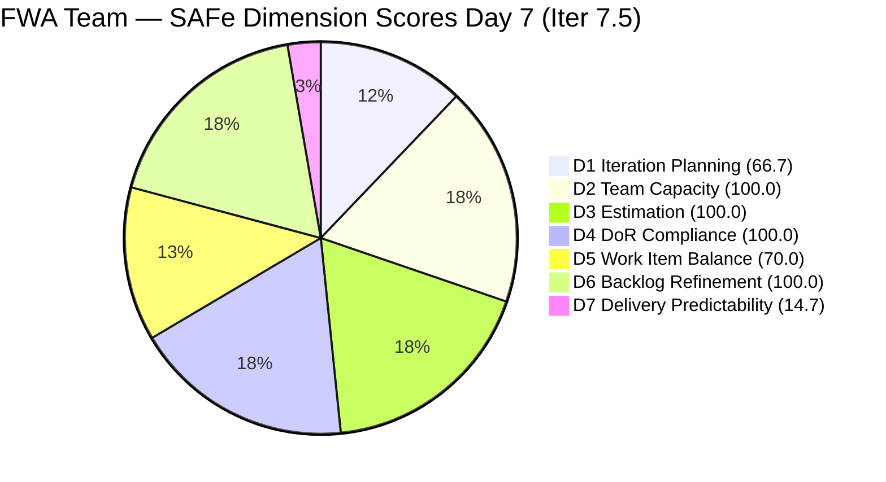
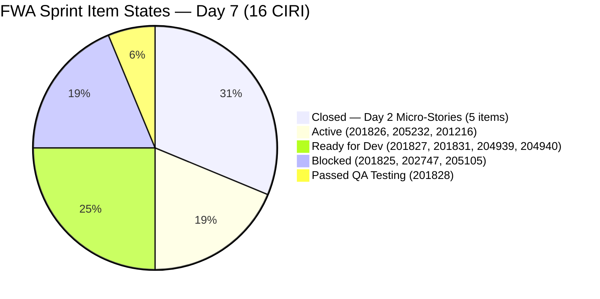
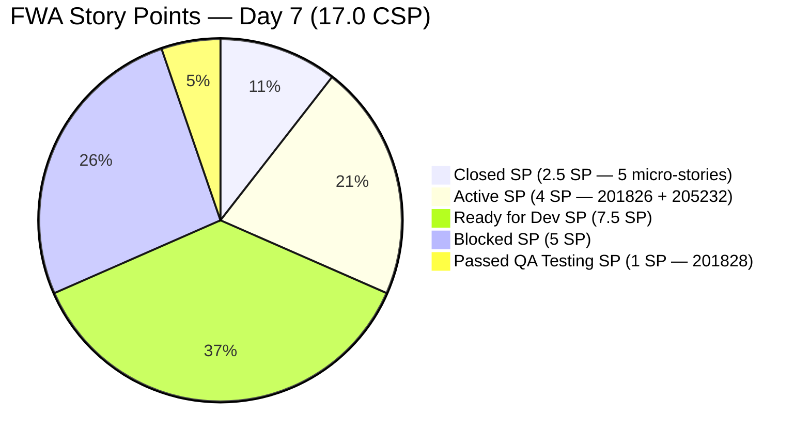

# ADO SAFe Audit — Flawless Wedding App Team

## 1. Audit Metadata

| Field | Value |
|-------|-------|
| **Project** | Flawless Wedding App |
| **Team** | Flawless Wedding App Team |
| **Workspace** | `ado_fl_dev` |
| **Workspace Path** | `/Users/jairo/Projects/iteration_audit/ado_fl_dev` |
| **ADO Project ID** | 92b967dc-5ec7-4874-b8f5-e43b00d88339 |
| **ADO Team ID** | 7d90ecbf-d272-4b0c-b33b-c66d96a790ac |
| **Iteration** | Iteration 7.5 |
| **Iteration Start** | 2026-06-01 |
| **Iteration Finish** | 2026-06-14 |
| **Sprint Day** | Day 7 of 14 |
| **Audit Date** | 2026-06-07 CST |
| **Prior Audit** | AUDIT_20260606_0900.md (Day 6, Iteration 7.5, 73.7 — Moderate Risk) |
| **Overall Score** | **78.8 / 100** |
| **Risk Band** | **Moderate Risk** |

---

## 2. Executive Summary

- The Flawless Wedding App Team rises to **78.8 / 100 (Moderate Risk)** on Day 7 of Iteration 7.5 — a **+5.1 point improvement** from Day 6's 73.7. This is the team's best score in Iteration 7.5.
- **Score improvement is driven by a CIRI data reconciliation:** Today's `wit_get_work_items_for_iteration` call surfaces 5 additional closed items (204932, 204934, 204935, 204936, 204938 — all 0.5 SP, closed 2026-06-02) that were invisible to the backlog API in prior audits. Including these in CIRI and PECI raises D1 from 45.8 → 66.7 and D7 from 0.0 → 14.7. See Section 10 for full reconciliation detail.
- **201828 (Real-time Chat, 1 SP) remains in "Passed QA Testing"** — now two days beyond QA completion without a closure state transition. This is the single highest-leverage action available: closing it today would raise D7 from 14.7 to 20.0 and resolve the D5 Penalty B (US drops to 11/15 = 73.3%... still > 60%). Actually after 201828 close: CIRI=15, US=11/15=73.3% → still Penalty B. D5 remains 70.0.
- **Three items remain Blocked (Day 3 of blocking):** 201825 (Send Message to Vendor, 2 SP), 202747 (Mobile Subscription Enabler, 2 SP), 205105 (MobileApp Staging, 1 SP). No unblock actions detected on Day 7.
- **D7 = 14.7** is no longer Critical (was 0.0 with expired annotation on Day 6) — the 2.5 SP closed on Day 2 are now properly counted. However, delivery remains substantially below the sprint midpoint target. With 7 days remaining, closing 201826 (Active, 3 SP) and resolving blockers is essential.

---

## 3. Previous Audit Delta

**Prior audit:** AUDIT_20260606_0900.md — Iteration 7.5, Day 6, Score 73.7 / 100 (Moderate Risk)

| Dimension | Day 6 | Day 7 | Delta | Driver |
|-----------|-------|-------|-------|--------|
| D1 Iteration Planning | 45.8 | **66.7** | **+20.9** | CIRI reconciliation: 16 (incl. 5 closed) vs. 11 prior |
| D2 Team Capacity | 100.0 | **100.0** | 0.0 | CW=2, CC=2 — unchanged |
| D3 Estimation | 100.0 | **100.0** | 0.0 | PECI=13, ECI=13; CSP=17.0 SP (recalculated) |
| D4 DoR Compliance | 100.0 | **100.0** | 0.0 | All 16 CIRI items pass DoR |
| D5 Work Item Balance | 70.0 | **70.0** | 0.0 | US=12/16=75.0%; Penalty B persists |
| D6 Backlog Refinement | 100.0 | **100.0** | 0.0 | All 24 VRBI fresh; 0 untouched |
| D7 Delivery Predictability | 0.0 | **14.7** | **+14.7** | CLSP=2.5 SP (5 closed items from Day 2 now counted) |
| **Overall** | **73.7** | **78.8** | **+5.1** | Data reconciliation-driven improvement; no new closures today |

**CIRI Reconciliation Note:** Prior audits (Days 1–6) calculated CIRI from the `wit_list_backlog_work_items` response, which drops closed items. Today's `wit_get_work_items_for_iteration` call reveals 5 additional root items (204932, 204934, 204935, 204936, 204938) that were closed on Day 2 (2026-06-02) and fell off the backlog. Counting these as CIRI (per rubric definition: all root items with IterationPath = current iteration) corrects D1 from 11/24=45.8 to 16/24=66.7 and adds 2.5 SP of CLSP to D7. This is a correction of prior audit methodology, not a change in sprint activity.

**Item-level changes since Day 6:**
- **No new state transitions on 2026-06-07.** All open CIRI items retain their Day 6 states.
- **201828** (Passed QA Testing): ChangedDate = 2026-06-05T08:02 — still not closed. Day 3 in near-closure state.
- **201825, 202747, 205105** (Blocked): All blocked since Day 5 (2026-06-05). Day 3 of blocking, no resolution visible.
- **205232** (Spike, Active): ChangedDate = 2026-06-02 — 5 days since last update; still not closed.

---

## 4. Current Iteration Snapshot

| Attribute | Value |
|-----------|-------|
| **Active Iteration** | Iteration 7.5 |
| **Sprint Duration** | 2026-06-01 to 2026-06-14 (14 days) |
| **Audit Day** | **Day 7 of 14 (Sprint Midpoint)** |
| **Total Visible Backlog Root Items (VRBI)** | **24** |
| **Current Iteration Root Items (CIRI)** | **16** (11 open + 5 closed from Day 2) |
| **Sprint Load %** | **66.7%** |
| **Point-Eligible Items (PECI — US + Spike)** | **13** (12 US + 1 Spike) |
| **Committed Story Points (CSP)** | **17.0 SP** |
| **Closed Story Points (CLSP)** | **2.5 SP** (204932+204934+204935+204936+204938, all 0.5 SP, closed Day 2) |
| **Delivery % (D7)** | **14.7%** |
| **Open Item States** | Active: 3 · Ready for Dev: 4 · Blocked: 3 · Passed QA Testing: 1 |
| **Active Team Members (CW)** | **2** (Luke Colina, Ressa Paracuelles) |
| **Members with Capacity (CC)** | **2** (Luke — Development 6 hrs/day; Ressa — Testing 6 hrs/day) |
| **Other Configured** | Jaszmeine Villanueva (Design 3 hrs/day), Luzmibel Paculanang (Testing 1 hr/day) — no CIRI items |
| **Blocked Items** | 3 (201825, 202747, 205105) — Day 3 of blocking |
| **Days Elapsed / Remaining** | 7 elapsed / 7 remaining |
| **SP Needed per Day** | ~2.1 SP/day to close remaining 14.5 open SP in 7 days |

---

## 5. Work Item Analysis

### 5.1 All CIRI Items (16 root items — sorted by state)

| ID | Title | Type | State | SP | Assignee | DoR | ChangedDate |
|----|-------|------|-------|----|----------|-----|-------------|
| 204932 | Update Landing Page CTA Wording | User Story | **Closed** | 0.5 | Luke Colina | PASS | 2026-06-02 |
| 204934 | Remove "Best Value" Badge | User Story | **Closed** | 0.5 | Luke Colina | PASS | 2026-06-02 |
| 204935 | Remove Non-Functional Three-Dot UI Elements | User Story | **Closed** | 0.5 | Luke Colina | PASS | 2026-06-02 |
| 204936 | Update Budget Currency Label | User Story | **Closed** | 0.5 | Luke Colina | PASS | 2026-06-02 |
| 204938 | Add Email Field and Update Required Fields | User Story | **Closed** | 0.5 | Luke Colina | PASS | 2026-06-02 |
| 201826 | Receive Messages | User Story | Active | 3 | Luke Colina | PASS | 2026-06-05 |
| 205232 | Iteration 7.5 Collaborations & Others | Spike | Active | 1 | Ressa Paracuelles | PASS | 2026-06-02 |
| 201216 | Integration with Existing APIs | Enabler | Active | 1 | Luke Colina | PASS | 2026-06-04 |
| 201827 | View Conversation History | User Story | Ready for Dev | 2 | Luke Colina | PASS | 2026-06-01 |
| 201831 | Message Notifications | User Story | Ready for Dev | 3 | Luke Colina | PASS | 2026-06-01 |
| 204939 | Update Subscription Renewal Notification | User Story | Ready for Dev | 0.5 | Luke Colina | PASS | 2026-06-02 |
| 204940 | Implement Subscription Reminder Frequency | User Story | Ready for Dev | 2 | Luke Colina | PASS | 2026-06-02 |
| 201825 | Send Message to Vendor | User Story | **Blocked** | 2 | Luke Colina | PASS | 2026-06-05 |
| 202747 | Mobile Subscription Management for Bride Access | Enabler | **Blocked** | 2 | Luke Colina | PASS | 2026-06-05 |
| 205105 | MobileApp Staging Environment for User Testing | Enabler | **Blocked** | 1 | Luke Colina | PASS | 2026-06-05 |
| 201828 | Real-time Chat | User Story | Passed QA Testing | 1 | Luke Colina | PASS | 2026-06-05 |

### 5.2 PECI Computation (13 items)

| ID | Title | Type | SP | State | CLSP? |
|----|-------|------|----|-------|-------|
| 204932 | Update Landing Page CTA Wording | US | 0.5 | Closed | YES |
| 204934 | Remove "Best Value" Badge | US | 0.5 | Closed | YES |
| 204935 | Remove Non-Functional Three-Dot UI Elements | US | 0.5 | Closed | YES |
| 204936 | Update Budget Currency Label | US | 0.5 | Closed | YES |
| 204938 | Add Email Field and Update Required Fields | US | 0.5 | Closed | YES |
| 201825 | Send Message to Vendor | US | 2 | Blocked | No |
| 201826 | Receive Messages | US | 3 | Active | No |
| 201827 | View Conversation History | US | 2 | Ready for Dev | No |
| 201828 | Real-time Chat | US | 1 | Passed QA Testing | No (not Closed/Done) |
| 201831 | Message Notifications | US | 3 | Ready for Dev | No |
| 204939 | Update Subscription Renewal Notification | US | 0.5 | Ready for Dev | No |
| 204940 | Implement Subscription Reminder Frequency | US | 2 | Ready for Dev | No |
| 205232 | Iteration 7.5 Collaborations (Spike) | Spike | 1 | Active | No |

**CSP = 0.5+0.5+0.5+0.5+0.5+2+3+2+1+3+0.5+2+1 = 17.0 SP**
**CLSP = 0.5×5 = 2.5 SP** (five closed stories, all closed Day 2)
**Excluded from PECI:** 201216 (Enabler, 1 SP), 202747 (Enabler, 2 SP), 205105 (Enabler, 1 SP) = 3 items, 4 SP

### 5.3 VRBI Composition (24 items)

| Category | Count | Notes |
|----------|-------|-------|
| CIRI — open (Iter 7.5) | 11 | Visible in backlog API |
| CIRI — closed (Iter 7.5) | 5 | Visible only via iteration endpoint |
| IP Sprint (Iter 7.6) | 8 | Staged for PI close-out sprint |
| **Total VRBI** | **24** | |

---

## 6. SAFe Compliance Scorecard

| Dimension | Score | Evidence (Numerator / Denominator) | Risk Band | Notes |
|-----------|-------|-------------------------------------|-----------|-------|
| D1 Iteration Planning | **66.7** | 16 CIRI / 24 VRBI | Moderate | Corrected from Day 6: 5 closed items added to CIRI |
| D2 Team Capacity | **100.0** | 2 CC / 2 CW | Low | Luke + Ressa both with configured activities |
| D3 Estimation | **100.0** | 13 ECI / 13 PECI | Low | CSP=17.0 SP (recalculated with 5 closed US at 0.5 SP each) |
| D4 DoR Compliance | **100.0** | 16 DCI / 16 CIRI | Low | All 16 items pass Desc ≥30 + AC ≥20 |
| D5 Work Item Balance | **70.0** | US=12/16=75.0% | Moderate | Penalty B: dominant type > 60% |
| D6 Backlog Refinement | **100.0** | 24 fresh / 24 VRBI | Low | 0 stale; 0 untouched CIRI |
| D7 Delivery Predictability | **14.7** | 2.5 CLSP / 17.0 CSP | High | 5 Day-2 closures (2.5 SP) now counted; 201828 Passed QA ≠ Closed |
| **Overall** | **78.8** | (66.7+100+100+100+70+100+14.7)/7 | **Moderate Risk** | +5.1 from Day 6; best score of Iter 7.5 |

**Formula verification:**
- D1: round(16/24×100,1) = round(66.67,1) = 66.7
- D2: round(2/2×100,1) = 100.0
- D3: round(13/13×100,1) = 100.0
- D4: round(16/16×100,1) = 100.0
- D5: max(0, 100−30) = 70.0 [US=12/16=75.0% > 60% → Penalty B]
- D6: base=round(24/24×100,1)=100.0; stale_90=0; stale_180=0; untouched=0 → D6=100.0
- D7: round(2.5/17.0×100,1) = round(14.706,1) = 14.7
- Overall: round((66.7+100+100+100+70+100+14.7)/7,1) = round(551.4/7,1) = round(78.77,1) = **78.8**

---

## 7. Dimension Findings

### 7.1 Iteration Planning (66.7 — Moderate Risk)

**VRBI:** 24. **CIRI:** 16 (5 closed Day 2 + 11 open).

**Formula:** round(16/24 × 100, 1) = **66.7**

**Significant methodological correction:** Prior audits (Days 1–6) calculated CIRI = 11 using only the backlog API. The iteration endpoint reveals 5 additional closed root items (204932, 204934, 204935, 204936, 204938 — closed 2026-06-02). Including these gives CIRI = 16 and D1 = 66.7, which crosses from High Risk into Moderate Risk. This is not a sprint activity change — the 5 items have been closed since Day 2.

At D1=66.7, the score is still Moderate. To reach Low Risk (≥80): CIRI would need to be ≥ 20 of 24 VRBI. Pulling 4 IP Sprint items into CIRI is not appropriate mid-sprint. Archiving 5 IP Sprint items would bring VRBI to 19 and push D1 to 16/19=84.2% — above the Low Risk threshold.

---

### 7.2 Team Capacity (100.0 — Low Risk)

**CW:** 2 — Luke Colina (12 of 16 CIRI items assigned) and Ressa Paracuelles (205232 Spike).
**CC:** 2 — Luke (Development 6 hrs/day) and Ressa (Testing 6 hrs/day).

**Formula:** round(2/2 × 100, 1) = **100.0**

Jaszmeine Villanueva (Design 3 hrs/day) and Luzmibel Paculanang (Testing 1 hr/day) remain configured but without CIRI items. Their 4 combined hrs/day is available for redeployment. Luke's concentration risk is extreme: 12 of 16 CIRI items, including all 3 blocked items and the near-closure item.

---

### 7.3 Estimation (100.0 — Low Risk)

**PECI:** 13 items — 12 User Stories + 1 Spike. **ECI:** 13 — all carry SP > 0.
**CSP:** 17.0 SP (corrected from Day 6's 14.5 SP — the 2.5 SP from 5 closed items now included).

**Excluded from PECI:** 201216 (Enabler 1 SP), 202747 (Enabler 2 SP), 205105 (Enabler 1 SP) = 3 items.

**Formula:** round(13/13 × 100, 1) = **100.0**

All 13 PECI items carry positive story points. The 5 closed items each carry 0.5 SP — consistent with their small scope (UI label changes, badge removal, field additions).

---

### 7.4 DoR Compliance (100.0 — Low Risk)

**CIRI:** 16. **DCI:** 16 — all pass Description ≥ 30 non-whitespace chars AND AC ≥ 20 non-whitespace chars.

**Formula:** round(16/16 × 100, 1) = **100.0**

The 5 Day-2 closed items all have substantive BDD-format descriptions and ACs confirmed via direct fetch. The 205232 Spike uses minimal-but-compliant text (description lists participation events; AC lists Iteration Planning, Retrospective, Review, Team Sync, System Demo, Product Sync). All pass the threshold.

---

### 7.5 Work Item Balance (70.0 — Moderate Risk)

**CIRI type distribution (16 items):**
- User Story: 12 (75.0%)
- Enabler: 3 (18.8%) — 201216, 202747, 205105
- Spike: 1 (6.3%) — 205232

| Penalty | Check | Result |
|---------|-------|--------|
| A (no User Story) | 12 US present | 0 |
| B (dominant type > 60%) | US = 75.0% > 60% | **−30** |
| C (spike share > 40%) | Spike = 6.3% < 40% | 0 |

**Formula:** max(0, 100 − 30) = **70.0**

Even with the corrected CIRI (16 items), Penalty B persists (US=75.0%). Note: if 201828 closes (CIRI → 15, US=11/15=73.3%) or the 3 blocked items are unblocked and close (CIRI → 12, US=9/12=75.0%), Penalty B still applies. The practical path to eliminating Penalty B at current CIRI composition would require closing 7 User Stories (bringing US to 5/9=55.6%) or adding 4 non-US items to CIRI.

---

### 7.6 Backlog Refinement (100.0 — Low Risk)

**Fresh window:** ChangedDate ≥ 2026-04-23 (45 days before 2026-06-07).
**VRBI:** 24. **Fresh:** 24/24 — all items changed 2026-04-23 or later.
**stale_90 (before 2026-03-09):** 0 items.
**stale_180 (before 2025-12-09):** 0 items.
**Untouched CIRI (ChangedDate < 2026-06-01T00:00:00Z):** 0 items — 201827 changed 2026-06-01T00:46, 201831 changed 2026-06-01T00:47 (both on sprint start date, not before).

**Formula:** max(0, 100.0 − 0) = **100.0**

**Watch:** 205232 (Spike) last changed 2026-06-02 — 5 days ago. If it receives no update for another 4 days, it approaches the 9-day mark (well within sprint), but of more concern, it qualifies as "untouched" if it remains unchanged from before the sprint start — which it does not, since it was changed on Day 2. Not a D6 risk.

---

### 7.7 Delivery Predictability (14.7 — High Risk)

**CSP:** 17.0 SP. **CLSP:** 2.5 SP (5 items closed Day 2, visible today via iteration endpoint).

**Formula:** round(2.5/17.0 × 100, 1) = **14.7**

**Note on D7 status:** This is Day 7 (sprint midpoint). The early-sprint annotation (Days 1–5) has expired. D7 = 14.7 is a hard performance score. The 2.5 SP delivered represents 14.7% of committed scope at the midpoint — well below the 50% midpoint delivery expectation for a healthy SAFe sprint.

**Near-closure item:** 201828 (Real-time Chat, 1 SP) has been in "Passed QA Testing" since 2026-06-05T08:02 — 2 days without a final closure transition. Closing it:
- CLSP = 3.5, D7 = round(3.5/17.0×100,1) = 20.6
- Overall = (66.7+100+100+100+70+100+20.6)/7 = 557.3/7 = **79.6**

**D7 scenarios — Day 7:**

| Action | CLSP | D7 | Overall | Band |
|--------|------|----|---------|------|
| Current (Day 7) | 2.5 SP | 14.7 | **78.8** | **Moderate** |
| Close 201828 (QA-complete) | 3.5 SP | 20.6 | 79.6 | Moderate |
| + Close 205232 (Spike) | 4.5 SP | 26.5 | 80.5 | **Low** |
| + Close 201826 (Active, Day 8) | 7.5 SP | 44.1 | 84.9 | Low |
| Resolve blockers + close 201825 | 9.5 SP | 55.9 | 87.3 | Low |
| All PECI closed (Day 14) | 17.0 SP | 100.0 | **93.7** | Low |

**Closing 205232 (Spike, 1 SP) after 201828 pushes overall to 80.5 — crossing the Low Risk threshold.**

---

## 8. Risks and Bottlenecks

| Risk | Severity | Items Affected | Status |
|------|----------|----------------|--------|
| D7=14.7 at sprint midpoint — 85.3% of SP undelivered | **Critical** | 14.5 open SP | Only 2.5 SP (5 micro-stories) closed; substantial delivery gap |
| 3 Blocked items — Day 3 of blocking (5 SP) | **Critical** | 201825, 202747, 205105 | Root causes not visible in fields; escalation overdue by 2 days |
| 201828 (Passed QA Testing, 1 SP) — 2 days without final close | **High** | 201828 | Near-closure item; no observable blocker; free D7 gain |
| 205232 (Spike) — Active for 5 days with no update | **High** | 205232 (1 SP) | 7 sprint events completed; administrative close overdue |
| 201827, 201831 unchanged since Day 1 (6 days, 5 SP unstarted) | **High** | 201827 (2 SP), 201831 (3 SP) | Messaging stories idle at midpoint; each idle day increases late-sprint risk |
| Luke concentration — 12 of 16 CIRI items, all blockers | **High** | Delivery concentration | If blocker resolution consumes Luke's capacity, Ready for Dev items cannot start |
| 205105 (MobileApp Staging) — Day 3 blocked; UAT remains impossible | **High** | 205105 (Enabler) | Mobile features cannot be verified without staging; regression from Ready for UAT |
| D1=66.7 (Moderate) — 8 IP Sprint items suppressing ratio | **Medium** | 24 VRBI, 16 CIRI | Archiving 5 IP Sprint items would push D1 to Low Risk |
| D5=70.0 structural | **Medium** | US=75.0% | Penalty B persists regardless of closures; structural fix needed for Iter 7.6 |
| 4 items in Ready for Dev — 4–6 days unstarted at midpoint | **Medium** | 201827, 201831, 204939, 204940 (7.5 SP) | Half the open SP is idle; critical path compression increasing |

---

## 9. Prioritized Recommendations

1. **Close 201828 (Real-time Chat, US, 1 SP) — immediate action.** This item has been in "Passed QA Testing" since 2026-06-05T08:02 — 2 days and 2 hours past QA completion. Luke should verify the two active AC scenarios (message delivered in real-time; history displayed on reopen), acknowledge the de-scoped notification scenario (strikethrough in AC), and close the item. Impact: D7 rises to 20.6, overall to 79.6.

2. **Close 205232 (Collaborations Spike, Ressa, 1 SP) today.** The Spike covers Planning, Retrospective, Review, Team Sync, System Demo, and Product Sync. As of Day 7 (sprint midpoint), Planning, multiple Team Syncs, and at least one System Demo have been completed. Ressa should close the Spike for completed events now and create a follow-on item for the Day 14 close-out events (Retrospective, Review) if needed. **Closing 205232 after 201828 pushes overall from 79.6 to 80.5 — crossing the Low Risk threshold.**

3. **Escalate all three blocked items (201825, 202747, 205105) to the Product Owner today — Day 3 of blocking.** Blockers entering Day 3 without a resolution path are a critical sprint risk. For each: (a) **201825 (Send Message to Vendor)** — is this blocked on 201216 (API Integration, Active)? Document the dependency explicitly and assign an unblock owner. (b) **202747 (Mobile Subscription Enabler)** — is the blocker app store submission, payment gateway credentials, or a feature flag? Who is the external dependency owner and what is their ETA? (c) **205105 (MobileApp Staging)** — what caused the Day 5 regression from "Ready for UAT" to Blocked? This is the most urgent: UAT-ready staging that reverted to Blocked implies a deployment pipeline, access, or environment configuration issue that needs immediate resolution.

4. **Activate 201827 (View Conversation History, 2 SP) today.** This item has been in "Ready for Dev" since sprint Day 1 — 6 days. With 7 days remaining, each additional idle day compresses the delivery window. Luke should activate 201827 in parallel with 201826 (Receive Messages, Active) — if 201826 has reached a QA handoff point, Luke can context-switch to activate 201827.

5. **Activate 201831 (Message Notifications, 3 SP) by Day 8.** Same urgency as 201827. Both messaging stories are blocked only by Luke's bandwidth. If blocker resolution consumes Luke's Day 7, 201831 must start on Day 8 to have a realistic path to closure by Day 12–13.

6. **Archive or deprioritize stale IP Sprint items to reduce VRBI.** The 8 IP Sprint items currently in Iter 7.6 are suppressing D1. Archiving the 5 lowest-priority IP Sprint items would reduce VRBI to 19, pushing D1 from 66.7 to 16/19=84.2% (Low Risk). This should be done during the next backlog grooming session, not mid-sprint.

7. **Assign Luzmibel Paculanang a testing task.** She has 1 hr/day Testing capacity and zero CIRI items. Assigning QA support for 201826 (Receive Messages, Active) or 201827 (View Conversation History) when they reach QA stage would reduce Luke's dependency and give the team a second QA vector.

---

## 10. Evidence Gaps and Limitations

- **CIRI count methodology correction.** Prior audits (Days 1–6) used `wit_list_backlog_work_items` as the sole CIRI source, which returns only open (non-closed) items. Today's `wit_get_work_items_for_iteration` reveals 5 closed root items (204932, 204934, 204935, 204936, 204938) that were closed Day 2 but invisible to the backlog API. Per rubric definition, CIRI = all root items with IterationPath = current iteration. Using CIRI=16 (corrected) vs. 11 (prior method) raises D1 from 45.8 to 66.7 and adds 2.5 SP CLSP to D7. Prior audit scores were calculated correctly given the data available at the time; this is a data-visibility correction.
- **"Passed QA Testing" is a custom state.** It is not "Closed" or "Done" per the rubric. Until Luke explicitly transitions 201828 to Closed, it does not contribute to CLSP. The rubric cannot award partial credit for near-closure states.
- **Blocker root causes undocumented in standard fields.** Comment IDs exist (5233984 on 201825; 5233080 on 205105) but comment text was not retrieved. Blocker details are in comments, not in work item fields.
- **205232 title says "Copy."** The item title is "Iteration 7.5 - Collaborations, Reports & Others - Copy" — the "Copy" suffix suggests this may have been duplicated from a prior iteration's Spike. Verify no duplicate scoring exists in other iteration records.
- **Jaszmeine Villanueva's FWA contributions remain opaque.** Her CIRI items are tracked in the Jairosoft Portfolio project (confirmed Day 5). Her 3 hrs/day Design capacity in FWA appears to be for future IP Sprint UI work, not current Iter 7.5 items.
- **IP Sprint VRBI composition.** The Day 6 audit noted 13 IP Sprint items (VRBI non-CIRI). Today's backlog API returns 24 total with 16 CIRI = 8 non-CIRI. This may reflect that some IP Sprint items from Day 6 have been removed or re-categorized. Further investigation needed if IP Sprint scope changes are unexpected.

---

## Appendix: Score Visualization

**Score Trend — Iteration 7.5:**

| Audit | Day | Score | Band | Key Event |
|-------|-----|-------|------|-----------|
| 2026-06-01 | 1 | 63.3 | Moderate | Sprint open; CIRI=18 |
| 2026-06-02 | 2 | 66.0 | Moderate | 5 items Closed (now visible); DoR 100% |
| 2026-06-03 | 3 | 66.1 | Moderate | VRBI 143→131 |
| 2026-06-04 | 4 | 72.4 | Moderate | VRBI 131→30; D5=100; D1=43.3 |
| 2026-06-05 | 5 | 73.7 | Moderate | VRBI 30→24; D2=100; 3 Blocked items; 201828 Passed QA |
| 2026-06-06 | 6 | 73.7 | Moderate | Sprint stasis; annotation expired; D7=0.0 |
| **2026-06-07** | **7** | **78.8** | **Moderate** | **CIRI reconciliation: +5 closed items; D1=66.7; D7=14.7** |
| Projected (close 201828 + 205232) | 7 | ~80.5 | **Low** | D7=26.5; first Low Risk possible today |
| Projected Day 8–9 | 8–9 | ~84.9 | Low | 201826 closed; blockers resolved |
| Projected Day 14 | 14 | ~93.7 | Low | Full sprint delivery |
