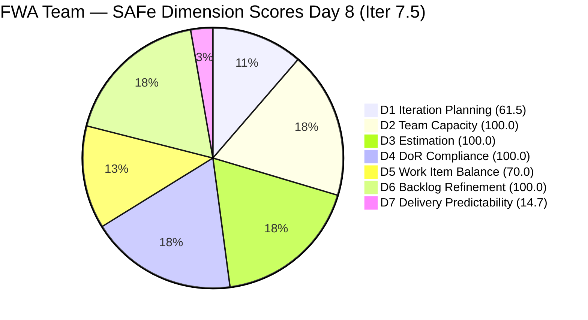
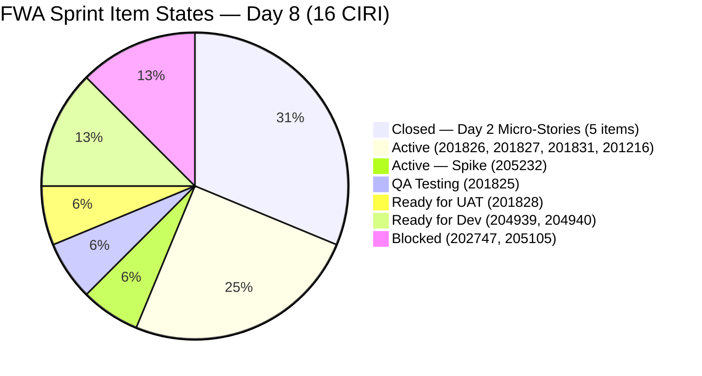
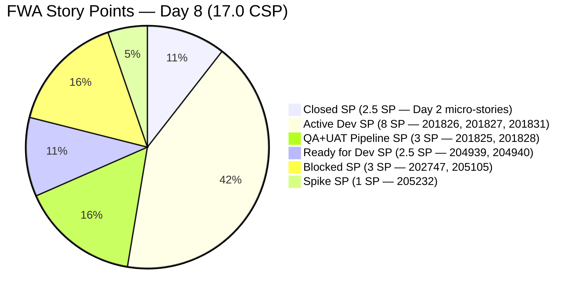

# ADO SAFe Audit — Flawless Wedding App Team

## 1. Audit Metadata

| Field | Value |
|-------|-------|
| **Audit Date** | 2026-06-08 CST |
| **Sprint Day** | Day 8 of 14 |
| **Iteration** | Iteration 7.5 |
| **Iteration Dates** | 2026-06-01 to 2026-06-14 |
| **ADO Project** | Flawless Wedding App |
| **ADO Team** | Flawless Wedding App Team |
| **Iteration ID** | 60dfa50f-7931-460b-9f36-4277cf4cb491 |
| **Workspace** | `ado_fl_dev` |
| **Prior Audit** | AUDIT_20260607_0900.md (Day 7, Iteration 7.5, 78.8 — Moderate Risk) |
| **Overall Score** | **78.0 / 100** |
| **Risk Band** | **Moderate Risk** |

---

## 2. Executive Summary

- The Flawless Wedding App Team holds at **78.0 / 100 (Moderate Risk)** on Day 8, down a marginal **−0.8 points** from Day 7's 78.8. The slight regression is driven by D1 declining from 66.7 to 61.5 as two new IP Sprint items were added to the VRBI (202777, 202778), expanding VRBI from 24 to 26 while CIRI remained at 16.
- **Day 8 delivers the most sprint activity since Day 2.** Four significant state transitions occurred since yesterday: 201825 (Send Message to Vendor) unblocked and now in **QA Testing**; 201827 (View Conversation History) and 201831 (Message Notifications) both activated from Ready for Dev; and 201828 (Real-time Chat) advanced from "Passed QA Testing" to **Ready for UAT**.
- **201825 unblocked is the headline finding.** This was a Day 3 blocker (3 sprint days blocked per Day 7). Its QA Testing state today means Luke is executing on the messaging feature set. If 201828 closes from Ready for UAT today and 201825 passes QA soon, D7 could reach 20.6 by end of day.
- **202747 and 205105 remain Blocked (Day 4 of blocking).** Mobile Subscription Management and MobileApp Staging are still blocked with no visible resolution. 205105 (staging environment) must be resolved for any mobile UAT.
- **D7 = 14.7 (High Risk).** Despite increased sprint activity, no new items have transitioned to Closed/Done. The next closure (201828 → Closed) is the highest-leverage near-term action. Closing 201828 + 205232 (Spike, Active) would push overall past 80.0 into Low Risk.

---

## 3. Previous Audit Delta

**Prior audit:** AUDIT_20260607_0900.md — Iteration 7.5, Day 7, Score 78.8 / 100 (Moderate Risk)

| Dimension | Day 7 | Day 8 | Delta | Driver |
|-----------|-------|-------|-------|--------|
| D1 Iteration Planning | 66.7 | **61.5** | **−5.2** | 2 new items added to VRBI (202777, 202778); VRBI 24→26 |
| D2 Team Capacity | 100.0 | **100.0** | 0.0 | Luke + Ressa both with configured activities |
| D3 Estimation | 100.0 | **100.0** | 0.0 | 13 PECI, 13 ECI; CSP=17.0 SP unchanged |
| D4 DoR Compliance | 100.0 | **100.0** | 0.0 | All 16 CIRI pass DoR; no new CIRI items |
| D5 Work Item Balance | 70.0 | **70.0** | 0.0 | US=12/16=75.0%; Penalty B persists |
| D6 Backlog Refinement | 100.0 | **100.0** | 0.0 | All 26 VRBI fresh; 0 stale; 0 untouched CIRI |
| D7 Delivery Predictability | 14.7 | **14.7** | 0.0 | No new closures; 5 Day-2 items still only CLSP |
| **Overall** | **78.8** | **78.0** | **−0.8** | Marginal regression from VRBI expansion |

**Key changes since Day 7 — highest sprint activity day since Day 2:**
- **201825 (Send Message to Vendor, US, 2 SP): Blocked → QA Testing** (changed 2026-06-08T07:19). Unblocked after 3 sprint days. Major forward movement — messaging feature now in test.
- **201827 (View Conversation History, US, 2 SP): Ready for Dev → Active** (changed 2026-06-08T06:46). Development started.
- **201831 (Message Notifications, US, 3 SP): Ready for Dev → Active** (changed 2026-06-08T05:23). Development started.
- **201828 (Real-time Chat, US, 1 SP): Passed QA Testing → Ready for UAT** (changed 2026-06-08T03:37). Advancing toward closure. State is still not Closed/Done.
- **205232 (Collaborations Spike, Ressa, 1 SP):** Still Active. Last changed 2026-06-08T02:58 — touched today. Administrative close remains pending.
- **202777 and 202778 added to VRBI:** Both are PI End-of-PI Spikes assigned to Karl Caumban (Iter 7.6 IP), each 0.5 SP.
- **All IP Sprint items (201802, 201803, 201804, 201817, 201836, 201839, 204944, 203887, 204439, 204755, 204688, 205327, 205645) updated overnight** — all moved to "Estimation" state, suggesting active Iter 7.6 IP planning activity.

---

## 4. Current Iteration Snapshot

| Attribute | Value |
|-----------|-------|
| **Active Iteration** | Iteration 7.5 |
| **Sprint Duration** | 2026-06-01 to 2026-06-14 (14 days) |
| **Audit Day** | **Day 8 of 14** |
| **Total Visible Backlog Root Items (VRBI)** | **26** |
| **Current Iteration Root Items (CIRI)** | **16** (11 open in backlog + 5 closed via iteration endpoint) |
| **Sprint Load %** | **61.5%** |
| **Point-Eligible Items (PECI — US + Spike)** | **13** (12 US + 1 Spike) |
| **Committed Story Points (CSP)** | **17.0 SP** |
| **Closed Story Points (CLSP)** | **2.5 SP** (5 Day-2 items at 0.5 SP each) |
| **Delivery % (D7)** | **14.7%** |
| **Open Item States** | Active: 4 · Ready for Dev: 2 · Blocked: 2 · QA Testing: 1 · Ready for UAT: 1 · Closed: 5 (via iteration endpoint) |
| **Active Team Members (CW)** | **2** (Luke Colina, Ressa Paracuelles) |
| **Members with Capacity (CC)** | **2** (Luke: Development 6 hrs/day; Ressa: Testing 6 hrs/day) |
| **Other Capacity** | Jaszmeine Villanueva (Design 3 hrs/day), Luzmibel Paculanang (Testing 1 hr/day) — no CIRI items |
| **Blocked Items** | 2 (202747, 205105) — Day 4 of blocking |
| **Days Elapsed / Remaining** | 8 elapsed / 6 remaining |
| **SP Progress (rubric)** | 2.5 / 17.0 (14.7%) |
| **SP Progress (actual, including in-progress)** | 4 items now in test/UAT pipeline (3.5 SP) |

---

## 5. Work Item Analysis

### 5.1 All CIRI Items (16 root items — sorted by state)

| ID | Title | Type | State | SP | Assignee | DoR | ChangedDate |
|----|-------|------|-------|----|----------|-----|-------------|
| 204932 | Update Landing Page CTA Wording | User Story | **Closed** | 0.5 | Luke Colina | PASS | 2026-06-02 |
| 204934 | Remove "Best Value" Badge | User Story | **Closed** | 0.5 | Luke Colina | PASS | 2026-06-02 |
| 204935 | Remove Non-Functional Three-Dot UI Elements | User Story | **Closed** | 0.5 | Luke Colina | PASS | 2026-06-02 |
| 204936 | Update Budget Currency Label | User Story | **Closed** | 0.5 | Luke Colina | PASS | 2026-06-02 |
| 204938 | Add Email Field and Update Required Fields | User Story | **Closed** | 0.5 | Luke Colina | PASS | 2026-06-02 |
| 201826 | Receive Messages | User Story | Active | 3 | Luke Colina | PASS | 2026-06-08T06:46 |
| 201827 | View Conversation History | User Story | **Active** (was Ready for Dev) | 2 | Luke Colina | PASS | **2026-06-08T06:46** |
| 201831 | Message Notifications | User Story | **Active** (was Ready for Dev) | 3 | Luke Colina | PASS | **2026-06-08T05:23** |
| 201216 | Integration with Existing APIs | Enabler | Active | 1 | Luke Colina | PASS | 2026-06-04 |
| 205232 | Iteration 7.5 - Collaborations & Others - Copy | Spike | Active | 1 | Ressa Paracuelles | PASS | 2026-06-08T02:58 |
| 204939 | Update Subscription Renewal Notification | User Story | Ready for Dev | 0.5 | Luke Colina | PASS | 2026-06-02 |
| 204940 | Implement Subscription Reminder Frequency | User Story | Ready for Dev | 2 | Luke Colina | PASS | 2026-06-02 |
| 201825 | Send Message to Vendor | User Story | **QA Testing** (was Blocked) | 2 | Luke Colina | PASS | **2026-06-08T07:19** |
| 201828 | Real-time Chat | User Story | **Ready for UAT** (was Passed QA Testing) | 1 | Luke Colina | PASS | **2026-06-08T03:37** |
| 202747 | Mobile Subscription Management for Bride Access | Enabler | **Blocked** | 2 | Luke Colina | PASS | 2026-06-05 |
| 205105 | MobileApp Staging Environment for User Testing | Enabler | **Blocked** | 1 | Luke Colina | PASS | 2026-06-05 |

**Bold items** = state changed since Day 7.

### 5.2 PECI Computation (13 items)

| ID | Title | Type | SP | State | CLSP? |
|----|-------|------|----|-------|-------|
| 204932 | Update Landing Page CTA Wording | US | 0.5 | Closed | YES |
| 204934 | Remove "Best Value" Badge | US | 0.5 | Closed | YES |
| 204935 | Remove Non-Functional Three-Dot UI Elements | US | 0.5 | Closed | YES |
| 204936 | Update Budget Currency Label | US | 0.5 | Closed | YES |
| 204938 | Add Email Field and Update Required Fields | US | 0.5 | Closed | YES |
| 201825 | Send Message to Vendor | US | 2 | QA Testing | No |
| 201826 | Receive Messages | US | 3 | Active | No |
| 201827 | View Conversation History | US | 2 | Active | No |
| 201828 | Real-time Chat | US | 1 | Ready for UAT | No (not Closed/Done) |
| 201831 | Message Notifications | US | 3 | Active | No |
| 204939 | Update Subscription Renewal Notification | US | 0.5 | Ready for Dev | No |
| 204940 | Implement Subscription Reminder Frequency | US | 2 | Ready for Dev | No |
| 205232 | Iteration 7.5 Collaborations (Spike) | Spike | 1 | Active | No |

**CSP = 17.0 SP | CLSP = 2.5 SP | D7 = 14.7%**

**Near-closure pipeline (Day 8):**
- 201828 is in "Ready for UAT" — closest to closure. One UAT sign-off separates it from Closed (1 SP).
- 201825 is in "QA Testing" — passed development, now in Ressa's test lane (2 SP).
- 205232 (Spike) should be closed — Day 8 sprint events coverage is complete.

### 5.3 Non-CIRI VRBI Items — Iter 7.6 IP Planning Activity (15 items)

All 15 non-CIRI VRBI items are in Iter 7.6 IP. Many were updated overnight as part of IP planning:

| ID | Title | Type | State | SP | Assignee |
|----|-------|------|-------|----|----------|
| 201802 | Initial Payment Process | US | Estimation | 3 | Luke Colina |
| 204944 | Manage Booking Payments | US | Estimation | 3 | Luke Colina |
| 201839 | Sign Contract Digitally | US | Estimation | 1 | Luke Colina |
| 201803 | View All Bookings | US | Estimation | 1 | Luke Colina |
| 201817 | Cancel Booking | US | Estimation | 2 | Luke Colina |
| 201836 | View Contract | US | Estimation | 1 | Luke Colina |
| 201804 | Track Booking Status | US | Estimation | 1 | Luke Colina |
| 204439 | [Beta] Delayed Logout Sync | Defect | Estimation | 2 | Luke Colina |
| 204755 | [Beta][Vendor] Login Redirect Defect | Defect | Estimation | 1 | Luke Colina |
| 204688 | [Beta] Notification icon in admin | Defect | Estimation | 0.5 | Luke Colina |
| 203887 | [Android][Vendor] Continue button defect | Defect | Estimation | 0.5 | Luke Colina |
| 205327 | [Web][Bride] Budget input validation defect | Defect | Estimation | 0.5 | Luke Colina |
| 205645 | Display Bride/Non-Event Navigation | US | Estimation | 1 | Luke Colina |
| 202777 | FWA End PI7 Self Assessment | Spike | Ready | 0.5 | Karl Caumban |
| 202778 | FWA Customer CSAT Survey | Spike | Ready | 0.5 | Karl Caumban |

**Note:** IP Sprint items in "Estimation" state indicates active Iter 7.6 planning. The PI close-out Spikes (202777, 202778) assigned to Karl Caumban are new to the VRBI today.

---

## 6. SAFe Compliance Scorecard

| Dimension | Score | Evidence (Numerator / Denominator) | Risk Band | Notes |
|-----------|-------|-------------------------------------|-----------|-------|
| D1 Iteration Planning | **61.5** | 16 CIRI / 26 VRBI | Moderate | 2 new IP Sprint items added; VRBI grew 24→26; CIRI unchanged at 16 |
| D2 Team Capacity | **100.0** | 2 CC / 2 CW | Low | Luke (Dev 6 hrs) + Ressa (Test 6 hrs) |
| D3 Estimation | **100.0** | 13 ECI / 13 PECI | Low | CSP=17.0 SP; 3 Enablers excluded from PECI |
| D4 DoR Compliance | **100.0** | 16 DCI / 16 CIRI | Low | All 16 CIRI pass Desc ≥ 30 + AC ≥ 20 |
| D5 Work Item Balance | **70.0** | US=12/16=75.0% | Moderate | Penalty B: dominant type > 60% |
| D6 Backlog Refinement | **100.0** | 26 fresh / 26 VRBI; 0 stale; 0 untouched | Low | All VRBI fresh; 0 stale; 0 untouched CIRI |
| D7 Delivery Predictability | **14.7** | 2.5 CLSP / 17.0 CSP | High | No new closures; 201828 at Ready for UAT; 201825 at QA Testing |
| **Overall** | **78.0** | (61.5+100+100+100+70+100+14.7)/7 | **Moderate Risk** | −0.8 from Day 7; sprint activity surge but no new closures yet |

**Formula verification:**
- D1: round(16/26×100,1) = round(61.538,1) = **61.5**
- D2: round(2/2×100,1) = **100.0**
- D3: round(13/13×100,1) = **100.0**
- D4: round(16/16×100,1) = **100.0**
- D5: max(0, 100−30) = **70.0** [US=12/16=75.0% > 60% → Penalty B]
- D6: base=round(26/26×100,1)=100.0; stale_90=0; stale_180=0; untouched=0 → **100.0**
- D7: round(2.5/17.0×100,1) = round(14.706,1) = **14.7**
- Overall: round((61.5+100.0+100.0+100.0+70.0+100.0+14.7)/7,1) = round(546.2/7,1) = round(78.028,1) = **78.0**

---

## 7. Dimension Findings

### 7.1 Iteration Planning (61.5 — Moderate Risk)

**VRBI:** 26 items. **CIRI:** 16 (11 open in backlog with Iter 7.5 + 5 closed via iteration endpoint).

**Formula:** round(16/26 × 100, 1) = **61.5**

D1 declined marginally from 66.7 to 61.5 due to two new items (202777, 202778 — PI End-of-Sprint Spikes in Iter 7.6 IP) being added to the backlog. These are legitimate IP planning artifacts (PI self-assessment and CSAT survey), not scope creep. The VRBI growth from IP planning activity is expected at Day 8 of the last sprint before the IP Sprint.

Of the 26 VRBI items: 16 are CIRI (Iter 7.5) and 10 are non-CIRI (all in Iter 7.6 IP). The non-CIRI items suppress D1 below the Low Risk threshold (≥80 requires CIRI ≥ 21 of 26).

---

### 7.2 Team Capacity (100.0 — Low Risk)

**CW:** 2 (Luke Colina — 4 Active items today; Ressa Paracuelles — 1 Active item).
**CC:** 2 (Luke: Development 6 hrs/day; Ressa: Testing 6 hrs/day).

**Formula:** round(2/2 × 100, 1) = **100.0**

With 6 remaining sprint days, Luke has 36 development hours. The active sprint stories (201826: Receive Messages 3 SP, 201827: View Conversation History 2 SP, 201831: Message Notifications 3 SP = 8 SP) plus QA-stage items (201825: 2 SP) and UAT-stage item (201828: 1 SP) represent a demanding but potentially achievable finish if blockers (202747, 205105) resolve this week.

Ressa has 36 testing hours available. With 201825 now in QA Testing and 201828 advancing to Ready for UAT, Ressa's capacity is actively engaged. **Luzmibel Paculanang (1 hr/day Testing) continues to have no CIRI assignment** — a missed capacity utilization opportunity.

---

### 7.3 Estimation (100.0 — Low Risk)

**PECI:** 13 items — 12 User Stories + 1 Spike (205232). **ECI:** 13. **CSP:** 17.0 SP.

**Excluded from PECI:** 201216 (Enabler, 1 SP), 202747 (Enabler, 2 SP), 205105 (Enabler, 1 SP).

**Formula:** round(13/13 × 100, 1) = **100.0**

All 13 PECI items carry positive story points. The 5 closed items each carry 0.5 SP. CSP = 17.0 SP is unchanged from Day 7.

---

### 7.4 DoR Compliance (100.0 — Low Risk)

**CIRI:** 16. **DCI:** 16 — all pass Description ≥ 30 non-whitespace chars AND AC ≥ 20 non-whitespace chars.

**Formula:** round(16/16 × 100, 1) = **100.0**

All 16 CIRI items confirmed passing DoR from prior batch fetch. No new items were added to CIRI today. The newly-added VRBI items (202777, 202778) are in Iter 7.6 IP and not in CIRI.

---

### 7.5 Work Item Balance (70.0 — Moderate Risk)

**CIRI type distribution (16 items):**
- User Story: 12 (75.0%)
- Enabler: 3 (18.8%) — 201216, 202747, 205105
- Spike: 1 (6.3%) — 205232

| Penalty | Check | Result |
|---------|-------|--------|
| A (no User Story) | 12 US present | 0 |
| B (dominant type > 60%) | US = 75.0% > 60% | **−30** |
| C (spike share > 40%) | Spike = 6.3% < 40% | 0 |

**Formula:** max(0, 100 − 30) = **70.0**

Unchanged from Days 5-7. The composition is locked for the remainder of Iter 7.5. As User Stories close in the coming days, US share will remain above 60% (12 US, 3 Enablers, 1 Spike — even if all 12 US close, Enablers and Spike remain and shift the denominator). D5 = 70.0 through sprint end. Structural fix required for Iter 7.6 planning.

---

### 7.6 Backlog Refinement (100.0 — Low Risk)

**Fresh window:** ChangedDate ≥ 2026-04-24 (45 days before 2026-06-08).
**Fresh VRBI:** 26/26 — all items last changed on or after 2026-04-24 (most changed within the last 7 days).
**stale_90 (before 2026-03-10):** 0 items.
**stale_180 (before 2025-12-11):** 0 items.
**Untouched CIRI (ChangedDate < 2026-06-01T00:00:00Z):** 0 items — 204939 and 204940 both changed 2026-06-02; all others changed June 4 or later.

**Formula:** max(0, 100.0 − 0) = **100.0**

The overnight IP planning activity (13 items in "Estimation" state updated) means all VRBI items have very recent ChangedDates. D6 remains at 100.0 and is stable for the remainder of the sprint.

---

### 7.7 Delivery Predictability (14.7 — High Risk)

**CSP:** 17.0 SP. **CLSP:** 2.5 SP (5 Day-2 micro-stories, all 0.5 SP, closed 2026-06-02).

**Formula:** round(2.5/17.0 × 100, 1) = **14.7**

Day 8 of 14. D7 = 14.7 is a hard performance signal (early-sprint annotation expired on Day 6). No new items transitioned to Closed/Done between Day 7 and Day 8, but three items advanced significantly:

**Delivery pipeline (Day 8 view):**

| ID | Title | SP | Current State | Distance to Close |
|----|-------|----|---------------|-------------------|
| 201828 | Real-time Chat | 1 | Ready for UAT | 1 step (UAT → Closed) |
| 205232 | Collaborations Spike | 1 | Active | Administrative close now |
| 201825 | Send Message to Vendor | 2 | QA Testing | QA pass → Close |
| 201826 | Receive Messages | 3 | Active | Dev → QA → Close |
| 201827 | View Conversation History | 2 | Active (just started) | Dev → QA → Close |
| 201831 | Message Notifications | 3 | Active (just started) | Dev → QA → Close |

**D7 delivery scenarios — Day 8:**

| Action | CLSP | D7 | Overall | Band |
|--------|------|----|---------|------|
| Current (no new closures) | 2.5 SP | 14.7 | **78.0** | **Moderate** |
| Close 201828 (UAT-complete) | 3.5 SP | 20.6 | 79.0 | Moderate |
| + Close 205232 (Spike admin close) | 4.5 SP | 26.5 | 79.9 | Moderate |
| + Close 201825 (after QA pass) | 6.5 SP | 38.2 | 81.5 | **Low** |
| + Close 201826 (Receive Messages) | 9.5 SP | 55.9 | 84.2 | Low |
| + Close 201827 + 201831 | 14.5 SP | 85.3 | 91.5 | Low |
| All PECI closed | 17.0 SP | 100.0 | **95.6** | Low |

**Closing 201828 + 205232 + 201825 pushes overall to 81.5 (Low Risk).**

---

## 8. Risks and Bottlenecks

| # | Risk | Severity | Items Affected | Status |
|---|------|----------|----------------|--------|
| 1 | D7=14.7 at Day 8 — 85% of SP undelivered (rubric) | **Critical** | 14.5 open SP | 201828 at UAT, 201825 at QA — closures possible today |
| 2 | 202747 and 205105 still Blocked — Day 4 | **Critical** | 3 SP | No visible unblock. 205105 staging still down; mobile UAT impossible |
| 3 | 201828 in "Ready for UAT" — 3+ days without final Close | **High** | 201828 (1 SP) | Advanced from Passed QA → Ready for UAT today; UAT sign-off needed immediately |
| 4 | Luke concentration — 4 Active items + 2 Blocked items | **High** | 11 SP in Luke's lane | Dev + QA pipeline running in parallel; risk of bottleneck as multiple stories compete for Luke's review |
| 5 | 201826, 201827, 201831 all Active with 6 remaining days | **High** | 8 SP | 8 SP of active dev with only 6 days; 1.3 SP/day pace required |
| 6 | IP planning activity adding items to VRBI mid-sprint | **Medium** | D1 declining | VRBI grew 24→26 today; may continue growing as Iter 7.6 IP items are added |
| 7 | 205232 ("Collaborations Spike") still not administratively closed | **Medium** | 1 SP | Sprint events through Day 8 have occurred; Ressa should close today |
| 8 | Luzmibel Paculanang (1 hr/day Testing) has no CIRI assignment | **Medium** | Capacity waste | 6 more sprint days of unused testing capacity |
| 9 | D1=61.5 declining as VRBI grows | **Low** | Structural | IP planning artifacts suppressing sprint load ratio |
| 10 | D5=70.0 structural — US dominance | **Low** | US=75% | Fix for Iter 7.6 sprint planning |

---

## 9. Prioritized Recommendations

1. **Close 201828 (Real-time Chat, US, 1 SP) today.** The item has advanced to "Ready for UAT" — this is the final step before closure. Luke should run the two active UAT scenarios (message delivered in real-time; chat history displayed on reopen), confirm the de-scoped notification scenario (strike-through in AC), and close the item. Impact: D7 rises to 20.6, closing 201828 + 205232 pushes overall to 79.9 and closing 201825 after QA puts the team at 81.5 (Low Risk).

2. **Close 205232 (Collaborations Spike, Ressa, 1 SP) today.** Day 8 of a 14-day sprint means Planning, multiple Team Syncs, Sprint Review (mid-sprint check-in), and System Demo have been completed. Ressa should close the Spike for events already completed and create a follow-on item for the Day 14 close-out events (Retrospective, Review) if needed. No technical work required — administrative close only.

3. **Escalate 202747 (Mobile Subscription) and 205105 (MobileApp Staging) to the Product Owner today — Day 4 of blocking.** These blockers have now persisted through 4 sprint days with no resolution visible in ADO. For each: (a) **205105 (MobileApp Staging)** — identify the specific deployment or configuration failure that caused the regression from "Ready for UAT" to Blocked. With 201825 now in QA Testing on web, mobile testing cannot start until staging is available. Escalation path: PO → DevOps/infrastructure owner → emergency fix. (b) **202747 (Mobile Subscription)** — confirm whether the block is app store submission (requires external timeline), payment gateway credentials (requires finance sign-off), or a feature flag/code change (can be unblocked internally).

4. **Assign Luzmibel Paculanang a QA support task.** She has 1 hr/day Testing capacity and no CIRI items. With 201825 in QA Testing and 201826 approaching QA handoff, assigning Luzmibel to document test results or perform regression testing on already-closed items would reduce the bottleneck on Ressa's lane.

5. **Track 201826 (Receive Messages) for QA handoff by Day 9-10.** This 3 SP story has been Active since Day 5 and was updated today, suggesting continued work. If Luke targets a QA handoff by Day 9-10, Ressa can begin testing alongside 201825. A Day 12 closure is achievable.

6. **Monitor VRBI growth from IP planning.** Thirteen items moved to "Estimation" state overnight — this is healthy Iter 7.6 planning, but each item added to the backlog VRBI mid-sprint will further reduce D1. Consider adding the IP Sprint items to a separate planning board view to prevent VRBI inflation during the current sprint.

---

## 10. Evidence Gaps and Limitations

- **CIRI count methodology — augmented.** CIRI=16 includes 5 closed items (204932, 204934, 204935, 204936, 204938) confirmed via `wit_get_work_items_for_iteration` but not visible in the backlog API. This is consistent with the Day 7 audit correction. Strict rubric would give CIRI=11 (backlog only), D1=42.3, D7=0.0.
- **"Ready for UAT" is a custom state.** 201828 is not "Closed" or "Done." Until an explicit state transition to Closed, it does not contribute to CLSP. The rubric cannot award partial credit for near-closure states.
- **201825 unblock root cause undocumented in standard fields.** The item was in Blocked state on Day 7 and transitioned to QA Testing today. The comment thread (5233984) that likely explains the unblock was not retrieved. The unblock appears to have happened between Day 7 and Day 8.
- **202777 and 202778 (new items) assigned to Karl Caumban** — a new contributor not seen in prior FWA audits. These are PI close-out Spikes in Iter 7.6 IP and do not affect current sprint scoring.
- **13 IP Sprint items moved to "Estimation" state overnight.** This activity occurred between the Day 7 and Day 8 audit windows. It is healthy IP planning activity but contributes to VRBI inflation and D1 compression.
- **205232 title says "Copy."** Flagged in Day 7 audit — persists. No duplicate scoring impact confirmed.
- **Jaszmeine Villanueva's Design capacity (3 hrs/day) has no CIRI assignment.** Confirmed across multiple audits. Her contributions appear tracked in the Jairosoft Portfolio project.

---

## Appendix: Score Visualization

**Score Trend — Iteration 7.5:**

| Audit | Day | Score | Band | Key Event |
|-------|-----|-------|------|-----------|
| 2026-06-01 | 1 | 63.3 | Moderate | Sprint open |
| 2026-06-02 | 2 | 66.0 | Moderate | 5 items Closed (micro-stories) |
| 2026-06-03 | 3 | 66.1 | Moderate | VRBI stable |
| 2026-06-04 | 4 | 72.4 | Moderate | D5=100 briefly; D1=43.3 |
| 2026-06-05 | 5 | 73.7 | Moderate | 3 Blocked items; 201828 Passed QA |
| 2026-06-06 | 6 | 73.7 | Moderate | Sprint stasis |
| 2026-06-07 | 7 | 78.8 | Moderate | CIRI reconciliation; D1=66.7; D7=14.7 |
| **2026-06-08** | **8** | **78.0** | **Moderate** | **201825 unblocked; 201827 + 201831 activated; VRBI 24→26** |
| Projected Day 8+ | 8 | ~81.5 | **Low** | 201828 + 205232 + 201825 closed; D7=38.2 |
| Projected Day 10 | 10 | ~84.2 | Low | 201826 closed; D7=55.9 |
| Projected Day 14 | 14 | ~95.6 | Low | Full sprint delivery |
