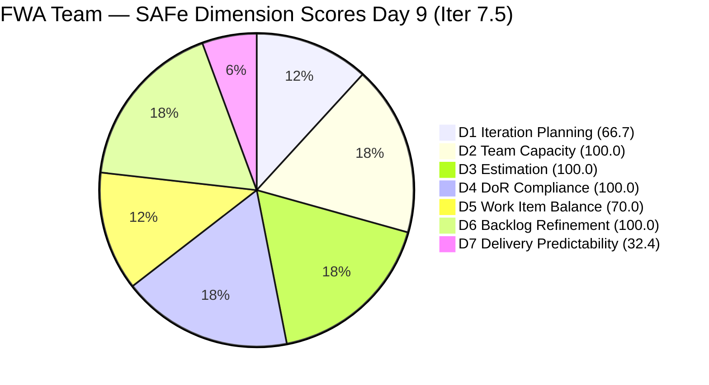
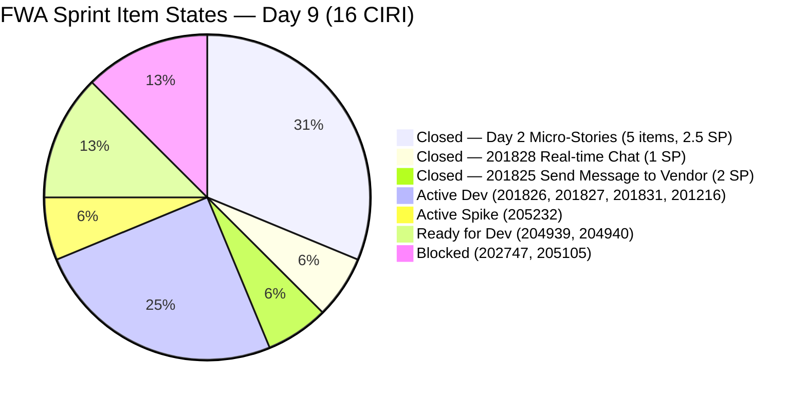
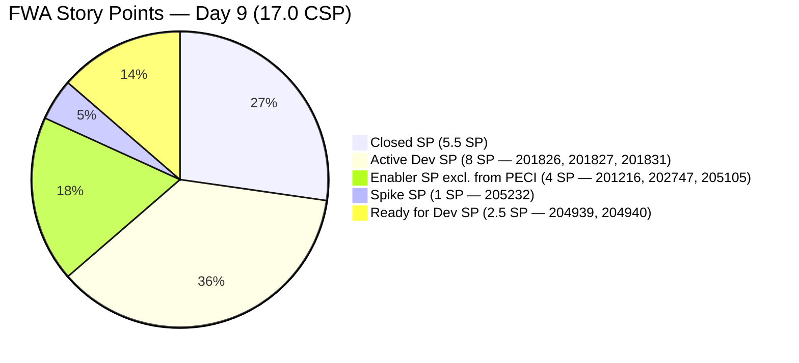

# ADO SAFe Audit — Flawless Wedding App Team

## 1. Audit Metadata

| Field | Value |
|-------|-------|
| **Audit Date** | 2026-06-09 CST |
| **Sprint Day** | Day 9 of 14 |
| **Iteration** | Iteration 7.5 |
| **Iteration Dates** | 2026-06-01 to 2026-06-14 |
| **ADO Project** | Flawless Wedding App |
| **ADO Project ID** | 92b967dc-5ec7-4874-b8f5-e43b00d88339 |
| **ADO Team** | Flawless Wedding App Team |
| **ADO Team ID** | 7d90ecbf-d272-4b0c-b33b-c66d96a790ac |
| **Iteration ID** | 60dfa50f-7931-460b-9f36-4277cf4cb491 |
| **Workspace** | `ado_fl_dev` |
| **Prior Audit** | AUDIT_20260608_0900.md (Day 8, Iteration 7.5, 78.0 — Moderate Risk) |
| **Overall Score** | **81.3 / 100** |
| **Risk Band** | **Low Risk** |

---

## 2. Executive Summary

- The Flawless Wedding App Team improves to **81.3 / 100 (Low Risk)** on Day 9, up **+3.3 points** from Day 8's 78.0. This is the first time this sprint the team has entered Low Risk territory. The improvement is driven by two significant closures in the hours between Day 8 and Day 9 audits:
  - **201828 (Real-time Chat, US, 1 SP)** — Closed at 2026-06-08T09:10 (Day 8, after yesterday's audit window)
  - **201825 (Send Message to Vendor, US, 2 SP)** — Closed at 2026-06-09T04:28 (Day 9, this morning)
- **CLSP rises from 2.5 SP to 5.5 SP** (Day-2 micro-stories 2.5 SP + 201828 1 SP + 201825 2 SP). D7 improves from 14.7 to **32.4** — still High Risk dimension but on an upward trajectory.
- **VRBI drops from 26 to 24** as 201825 and 201828 fall off the backlog. D1 improves from 61.5 to **66.7** — now representing 16 CIRI of 24 VRBI.
- **Two blockers persist (Day 5 of blocking):** 202747 (Mobile Subscription Management) and 205105 (MobileApp Staging Environment). No resolution visible in ADO. Mobile UAT cannot proceed until 205105 is resolved.
- **205232 (Collaborations Spike) still unclosed.** Day 9 — sprint events through Day 9 have occurred. Administrative close has been recommended for 2 consecutive audit days.
- **Five remaining sprint days with 12.5 SP open in rubric.** Delivering 201826 (Receive Messages, 3 SP), 201827 (View Conversation History, 2 SP), 201831 (Message Notifications, 3 SP), and 205232 (Spike, 1 SP) plus 204939 and 204940 is challenging but achievable if Luke maintains current momentum.

---

## 3. Previous Audit Delta

**Prior audit:** AUDIT_20260608_0900.md — Iteration 7.5, Day 8, Score 78.0 / 100 (Moderate Risk)

| Dimension | Day 8 | Day 9 | Delta | Driver |
|-----------|-------|-------|-------|--------|
| D1 Iteration Planning | 61.5 | **66.7** | **+5.2** | VRBI dropped 26→24 (201825 + 201828 closed, fell off backlog) |
| D2 Team Capacity | 100.0 | **100.0** | 0.0 | Luke + Ressa both with configured activities |
| D3 Estimation | 100.0 | **100.0** | 0.0 | 13 PECI, 13 ECI; CSP=17.0 SP unchanged |
| D4 DoR Compliance | 100.0 | **100.0** | 0.0 | All 16 CIRI pass DoR |
| D5 Work Item Balance | 70.0 | **70.0** | 0.0 | US=12/16=75.0%; Penalty B persists |
| D6 Backlog Refinement | 100.0 | **100.0** | 0.0 | All 24 VRBI fresh; 0 stale; 0 untouched CIRI |
| D7 Delivery Predictability | 14.7 | **32.4** | **+17.7** | 201828 (1 SP) + 201825 (2 SP) closed; CLSP: 2.5→5.5 SP |
| **Overall** | **78.0** | **81.3** | **+3.3** | D1 and D7 both improved; team enters Low Risk |

**Key changes since Day 8:**
- **201828 (Real-time Chat, US, 1 SP) — CLOSED** at 2026-06-08T09:10 UTC (Day 8, after yesterday's audit window). State was "Ready for UAT" on Day 8 audit; now confirmed Closed. This was the single highest-priority recommendation from Day 8.
- **201825 (Send Message to Vendor, US, 2 SP) — CLOSED** at 2026-06-09T04:28 UTC (Day 9 morning). Was in "QA Testing" on Day 8. Ressa completed QA, Luke closed the item. 3 SP added to CLSP (1 + 2).
- **VRBI drops from 26 to 24.** 201825 and 201828 fell off the backlog upon closure. D1: round(16/24×100,1) = 66.7.
- **201802 (Initial Payment Process)** received an update on 2026-06-09T02:23 — IP planning activity continues.
- **No new VRBI items added.** VRBI stable at 24.
- **205232 (Collaborations Spike) still Active.** Last changed 2026-06-08T02:58. No administrative close on Day 9.
- **202747 and 205105 still Blocked.** Day 5 of blocking. No change detected.

---

## 4. Current Iteration Snapshot

| Attribute | Value |
|-----------|-------|
| **Active Iteration** | Iteration 7.5 |
| **Sprint Duration** | 2026-06-01 to 2026-06-14 (14 days) |
| **Audit Day** | **Day 9 of 14** |
| **Total Visible Backlog Root Items (VRBI)** | **24** |
| **Current Iteration Root Items (CIRI)** | **16** (9 open in backlog + 7 closed via iteration endpoint) |
| **Sprint Load %** | **66.7%** |
| **Point-Eligible Items (PECI — US + Spike)** | **13** (12 US + 1 Spike) |
| **Committed Story Points (CSP)** | **17.0 SP** |
| **Closed Story Points (CLSP)** | **5.5 SP** |
| **Delivery % (D7)** | **32.4%** |
| **Open Item States (9 backlog items)** | Active: 4 · Ready for Dev: 2 · Blocked: 2 · Active Spike: 1 |
| **Active Team Members (CW)** | **2** (Luke Colina, Ressa Paracuelles) |
| **Members with Capacity (CC)** | **2** (Luke: Development 6 hrs/day; Ressa: Testing 6 hrs/day) |
| **Other Capacity** | Jaszmeine Villanueva (Design 3 hrs/day), Luzmibel Paculanang (Testing 1 hr/day) — no CIRI items |
| **Blocked Items** | 2 (202747, 205105) — **Day 5 of blocking** |
| **Days Elapsed / Remaining** | 9 elapsed / 5 remaining |
| **SP Progress (rubric)** | 5.5 / 17.0 (32.4%) |
| **SP in Active Dev** | 8 SP (201826 3 SP, 201827 2 SP, 201831 3 SP) |

---

## 5. Work Item Analysis

### 5.1 All CIRI Items (16 root items — sorted by state)

| ID | Title | Type | State | SP | Assignee | DoR | ChangedDate |
|----|-------|------|-------|----|----------|-----|-------------|
| 204932 | Update Landing Page CTA Wording | User Story | **Closed** | 0.5 | Luke Colina | PASS | 2026-06-02 |
| 204934 | Remove "Best Value" Badge | User Story | **Closed** | 0.5 | Luke Colina | PASS | 2026-06-02 |
| 204935 | Remove Non-Functional Three-Dot UI Elements | User Story | **Closed** | 0.5 | Luke Colina | PASS | 2026-06-02 |
| 204936 | Update Budget Currency Label | User Story | **Closed** | 0.5 | Luke Colina | PASS | 2026-06-02 |
| 204938 | Add Email Field and Update Required Fields | User Story | **Closed** | 0.5 | Luke Colina | PASS | 2026-06-02 |
| 201825 | Send Message to Vendor | User Story | **Closed** | 2 | Luke Colina | PASS | **2026-06-09T04:28** |
| 201828 | Real-time Chat | User Story | **Closed** | 1 | Luke Colina | PASS | **2026-06-08T09:10** |
| 201826 | Receive Messages | User Story | Active | 3 | Luke Colina | PASS | 2026-06-08T06:46 |
| 201827 | View Conversation History | User Story | Active | 2 | Luke Colina | PASS | 2026-06-08T06:46 |
| 201831 | Message Notifications | User Story | Active | 3 | Luke Colina | PASS | 2026-06-08T05:23 |
| 201216 | Integration with Existing APIs | Enabler | Active | 1 | Luke Colina | PASS | 2026-06-04 |
| 205232 | Iteration 7.5 - Collaborations & Others - Copy | Spike | Active | 1 | Ressa Paracuelles | PASS | 2026-06-08T02:58 |
| 204939 | Update Subscription Renewal Notification | User Story | Ready for Dev | 0.5 | Luke Colina | PASS | 2026-06-02 |
| 204940 | Implement Subscription Reminder Frequency | User Story | Ready for Dev | 2 | Luke Colina | PASS | 2026-06-02 |
| 202747 | Mobile Subscription Management for Bride Access | Enabler | **Blocked** | 2 | Luke Colina | PASS | 2026-06-05 |
| 205105 | MobileApp Staging Environment for User Testing | Enabler | **Blocked** | 1 | Luke Colina | PASS | 2026-06-05 |

**Bold items** = state changed since Day 8 audit.

### 5.2 PECI Computation (13 items) — Updated for Day 9

| ID | Title | Type | SP | State | CLSP? |
|----|-------|------|----|-------|-------|
| 204932 | Update Landing Page CTA Wording | US | 0.5 | Closed | **YES** |
| 204934 | Remove "Best Value" Badge | US | 0.5 | Closed | **YES** |
| 204935 | Remove Non-Functional Three-Dot UI Elements | US | 0.5 | Closed | **YES** |
| 204936 | Update Budget Currency Label | US | 0.5 | Closed | **YES** |
| 204938 | Add Email Field and Update Required Fields | US | 0.5 | Closed | **YES** |
| 201828 | Real-time Chat | US | 1 | **Closed** | **YES** (new Day 8 close) |
| 201825 | Send Message to Vendor | US | 2 | **Closed** | **YES** (new Day 9 close) |
| 201826 | Receive Messages | US | 3 | Active | No |
| 201827 | View Conversation History | US | 2 | Active | No |
| 201831 | Message Notifications | US | 3 | Active | No |
| 204939 | Update Subscription Renewal Notification | US | 0.5 | Ready for Dev | No |
| 204940 | Implement Subscription Reminder Frequency | US | 2 | Ready for Dev | No |
| 205232 | Iteration 7.5 Collaborations (Spike) | Spike | 1 | Active | No |

**CSP = 17.0 SP | CLSP = 0.5×5 + 1 + 2 = 5.5 SP | D7 = round(5.5/17.0×100,1) = 32.4%**

**Remaining delivery pipeline (5 days):**

| ID | Title | SP | State | Distance to Close |
|----|-------|----|-------|-------------------|
| 205232 | Collaborations Spike | 1 | Active | Administrative close — now |
| 201826 | Receive Messages | 3 | Active | Dev → QA → Close (Days 9-11) |
| 201827 | View Conversation History | 2 | Active | Dev → QA → Close (Days 9-12) |
| 201831 | Message Notifications | 3 | Active | Dev → QA → Close (Days 10-13) |
| 204939 | Update Subscription Renewal Notification | 0.5 | Ready for Dev | Dev → QA → Close |
| 204940 | Implement Subscription Reminder Frequency | 2 | Ready for Dev | Dev → QA → Close |

**Total remaining deliverable SP (excluding blocked):** 11.5 SP over 5 days = 2.3 SP/day pace required.

### 5.3 Non-CIRI VRBI Items (8 items — Iter 7.6 IP)

All 8 non-CIRI items remain in "Estimation" or "Ready" state (Iter 7.6 IP). Active IP planning continues:

| ID | Title | Type | State | SP | Changed |
|----|-------|------|-------|----|---------|
| 201802 | Initial Payment Process | US | Estimation | 3 | 2026-06-09T02:23 |
| 204944 | Manage Booking Payments | US | Estimation | 3 | 2026-06-08 |
| 201839 | Sign Contract Digitally | US | Estimation | 1 | 2026-06-08 |
| 201803 | View All Bookings | US | Estimation | 1 | 2026-06-08 |
| 201817 | Cancel Booking | US | Estimation | 2 | 2026-06-08 |
| 201836 | View Contract | US | Estimation | 1 | 2026-06-08 |
| 201804 | Track Booking Status | US | Estimation | 1 | 2026-06-08 |
| 204439 | [Beta] Delayed Logout Synchronization | Defect | Estimation | 2 | 2026-06-02 |
| 204755 | [Beta][Vendor] Login Redirect Defect | Defect | Estimation | 1 | 2026-06-08 |
| 204688 | [Beta] Notification icon in admin | Defect | Estimation | 0.5 | 2026-06-08 |
| 203887 | [Android][Vendor] Continue button defect | Defect | Estimation | 0.5 | 2026-06-08 |
| 205327 | [Web][Bride] Budget input validation defect | Defect | Estimation | 0.5 | 2026-06-08 |
| 205645 | Display Bride/Non-Event Navigation | US | Estimation | 1 | 2026-06-08 |
| 202777 | FWA End PI7 Self Assessment (Spike) | Spike | Ready | 0.5 | 2026-06-08 |
| 202778 | FWA Customer CSAT Survey (Spike) | Spike | Ready | 0.5 | 2026-06-08 |

Non-CIRI count = 15 items. VRBI = 9 open Iter 7.5 + 15 IP Sprint = 24 total. CIRI augmented = 16 (9 + 7 closed). D1 = 16/24 = 66.7.

---

## 6. SAFe Compliance Scorecard

| Dimension | Score | Evidence (Numerator / Denominator) | Risk Band | Notes |
|-----------|-------|-------------------------------------|-----------|-------|
| D1 Iteration Planning | **66.7** | 16 CIRI / 24 VRBI | Moderate | VRBI dropped 26→24 (201825 + 201828 fell off); CIRI unchanged at 16 |
| D2 Team Capacity | **100.0** | 2 CC / 2 CW | Low | Luke (Dev 6 hrs) + Ressa (Test 6 hrs) |
| D3 Estimation | **100.0** | 13 ECI / 13 PECI | Low | CSP=17.0 SP; 3 Enablers excluded from PECI |
| D4 DoR Compliance | **100.0** | 16 DCI / 16 CIRI | Low | All 16 CIRI pass Desc ≥ 30 + AC ≥ 20 |
| D5 Work Item Balance | **70.0** | US=12/16=75.0% | Moderate | Penalty B: dominant type > 60% |
| D6 Backlog Refinement | **100.0** | 24 fresh / 24 VRBI; 0 stale; 0 untouched | Low | All VRBI fresh; 0 stale; 0 untouched CIRI |
| D7 Delivery Predictability | **32.4** | 5.5 CLSP / 17.0 CSP | High | 201828 + 201825 closed; +3 SP added to CLSP Day 8-9 |
| **Overall** | **81.3** | (66.7+100+100+100+70+100+32.4)/7 | **Low Risk** | +3.3 from Day 8; first Low Risk score this sprint |

**Formula verification:**
- D1: round(16/24×100,1) = round(66.667,1) = **66.7**
- D2: round(2/2×100,1) = **100.0**
- D3: round(13/13×100,1) = **100.0**
- D4: round(16/16×100,1) = **100.0**
- D5: max(0, 100−30) = **70.0** [US=12/16=75.0% > 60% → Penalty B]
- D6: base=round(24/24×100,1)=100.0; stale_90=0; stale_180=0; untouched=0 → **100.0**
- D7: round(5.5/17.0×100,1) = round(32.353,1) = **32.4**
- Overall: round((66.7+100.0+100.0+100.0+70.0+100.0+32.4)/7,1) = round(569.1/7,1) = round(81.300,1) = **81.3**

---

## 7. Dimension Findings

### 7.1 Iteration Planning (66.7 — Moderate Risk)

**VRBI:** 24 items. **CIRI:** 16 (9 open in backlog + 7 closed via iteration endpoint).

**Formula:** round(16/24 × 100, 1) = **66.7**

D1 improved 5.2 points from 61.5 to 66.7 as 201825 and 201828 fell off the backlog upon closure. This is the structural mechanism: as sprint items close, they leave VRBI while CIRI (augmented) remains constant, improving the ratio. Future closures will continue to improve D1.

**D1 projection path:**

| Items Closed | VRBI | CIRI | D1 |
|-------------|------|------|----|
| Current (201825 + 201828 closed) | 24 | 16 | 66.7 |
| 205232 closed | 23 | 16 | 69.6 |
| + 201826 closed | 22 | 16 | 72.7 |
| + 201827 closed | 21 | 16 | 76.2 |
| + 201831 closed | 20 | 16 | 80.0 |

D1 reaches Low Risk (≥80) if 201826, 201827, and 201831 all close before sprint end.

### 7.2 Team Capacity (100.0 — Low Risk)

**CW:** 2 (Luke Colina, Ressa Paracuelles). **CC:** 2 (Luke: 6 hrs/day; Ressa: 6 hrs/day).

**Formula:** round(2/2 × 100, 1) = **100.0**

5 remaining sprint days at 6 hrs/day each = 30 hours Luke + 30 hours Ressa. The successful closure of 201825 (QA completed by Ressa, closed by Luke) demonstrates the Luke-Ressa handoff pipeline is functional. With 201826 in Active development and approaching QA, the pipeline can sustain momentum.

**Luzmibel Paculanang (1 hr/day Testing)** continues to have no CIRI assignment. 5 days × 1 hr = 5 hours of unused QA capacity.

### 7.3 Estimation (100.0 — Low Risk)

**PECI:** 13 items (12 US + 1 Spike). **ECI:** 13. **CSP:** 17.0 SP.
**Excluded from PECI:** 201216 (Enabler), 202747 (Enabler), 205105 (Enabler).

**Formula:** round(13/13 × 100, 1) = **100.0**

CSP unchanged at 17.0 SP. All 13 PECI items have positive story points. The 7 closed PECI items contribute 5.5 SP to CLSP.

### 7.4 DoR Compliance (100.0 — Low Risk)

**CIRI:** 16. **DCI:** 16. All pass Description ≥ 30 non-whitespace chars AND AC ≥ 20 non-whitespace chars.

**Formula:** round(16/16 × 100, 1) = **100.0**

Both newly-closed items (201825, 201828) passed DoR — they had well-formed BDD acceptance criteria. The remaining Active and Ready items continue to meet DoR thresholds. No CIRI items were added today.

### 7.5 Work Item Balance (70.0 — Moderate Risk)

**CIRI type distribution (16 items):**
- User Story: 12 (75.0%)
- Enabler: 3 (18.8%) — 201216, 202747, 205105
- Spike: 1 (6.3%) — 205232

| Penalty | Check | Result |
|---------|-------|--------|
| A (no User Story) | 12 US present | 0 |
| B (dominant type > 60%) | US = 75.0% > 60% | **−30** |
| C (spike share > 40%) | Spike = 6.3% < 40% | 0 |

**Formula:** max(0, 100 − 30) = **70.0**

Locked for the sprint. The type composition of 16 CIRI items is fixed (US=12, Enabler=3, Spike=1). As US close, the proportion remains above 60% until the last US closes (12 US, 3 E, 1 Spike — 12/12=100%, 11/12=91.7%, etc.). D5 = 70.0 for the remainder of Iter 7.5.

### 7.6 Backlog Refinement (100.0 — Low Risk)

**Fresh window:** ChangedDate ≥ 2026-04-25 (45 days before 2026-06-09).
**Fresh VRBI:** 24/24 — all items changed within the past 7 days.
**stale_90 (before 2026-03-11):** 0 items.
**stale_180 (before 2025-12-12):** 0 items.
**Untouched CIRI (ChangedDate < 2026-06-01T00:00:00Z):** 0 items — oldest CIRI items (204939, 204940) changed 2026-06-02; all others changed June 4 or later.

**Formula:** max(0, 100.0 − 0) = **100.0**

IP planning activity and sprint closures have kept all VRBI items fresh. D6 is stable and will remain 100.0 for the rest of Iter 7.5.

### 7.7 Delivery Predictability (32.4 — High Risk)

**CSP:** 17.0 SP. **CLSP:** 5.5 SP (5 Day-2 items at 0.5 SP each = 2.5 SP, + 201828 at 1 SP, + 201825 at 2 SP).

**Formula:** round(5.5/17.0 × 100, 1) = **32.4**

D7 improved significantly — from 14.7 to 32.4, the largest single-day D7 gain this sprint (+17.7 points). Two closures in the hours since Day 8's audit drove the improvement. The delivery pipeline is now producing closures after a 6-day stall (Days 2-8).

**D7 delivery scenarios — Day 9 (5 days remaining):**

| Action | CLSP | D7 | Overall | Band |
|--------|------|----|---------|------|
| Current | 5.5 SP | 32.4 | **81.3** | **Low** |
| Close 205232 (Spike admin close) | 6.5 SP | 38.2 | 82.2 | Low |
| + Close 201826 (3 SP) | 9.5 SP | 55.9 | 84.7 | Low |
| + Close 201827 (2 SP) | 11.5 SP | 67.6 | 86.8 | Low |
| + Close 201831 (3 SP) | 14.5 SP | 85.3 | 90.5 | Low |
| + Close 204940 (2 SP) | 16.5 SP | 97.1 | 92.7 | Low |
| All PECI closed (17.0 SP) | 17.0 SP | 100.0 | **93.9** | Low |

**Realistic sprint-end scenario:** Close 205232 + 201826 + 201827 + 201831 by Day 13-14 → D7=85.3, Overall=90.5 (Low Risk).

---

## 8. Risks and Bottlenecks

| # | Risk | Severity | Items Affected | Status |
|---|------|----------|----------------|--------|
| 1 | D7=32.4 — 67.6% of SP undelivered with 5 days remaining | **High** | 11.5 open SP (excl. blocked) | 201825 + 201828 closed; pipeline now active |
| 2 | 202747 + 205105 blocked Day 5 — mobile UAT impossible | **High** | 3 SP | No visible resolution. Mobile subscription depends on staging env |
| 3 | 205232 (Collaborations Spike) unclosed — Day 9, Day 3 of recommendation | **Medium** | 1 SP | Administrative close recommended Days 7-8; still Active |
| 4 | 201826 + 201827 + 201831 all Active with 5 remaining days (8 SP) | **Medium** | 8 SP | Pace: 1.6 SP/day required over 5 days — achievable but demanding |
| 5 | Luzmibel Paculanang (1 hr/day Testing) unused capacity | **Medium** | 5 hrs remaining | No CIRI assignment; Ressa handling all QA alone |
| 6 | 204939 + 204940 still in "Ready for Dev" — not yet started | **Medium** | 2.5 SP | Luke has 4 Active items + 2 more queued; capacity risk |
| 7 | D1=66.7 — VRBI IP Sprint items suppressing sprint load | **Low** | Structural | Will improve as sprint items close; 80.0 achievable if 201826/7/31 close |
| 8 | D5=70.0 structural — US dominance | **Low** | US=75% | Fix for Iter 7.6 sprint planning |

---

## 9. Prioritized Recommendations

1. **Close 205232 (Collaborations Spike, Ressa, 1 SP) today — Day 9 is the third consecutive recommendation.** All sprint events through Day 9 have occurred: Iteration Planning, multiple Team Syncs, System Demo (mid-sprint), Sprint Review check-in, and Retrospective (approaching). Ressa should close the Spike for events already completed and create a follow-on item for Day 14 close-out events if needed. No technical work required. Closing 205232 adds 1 SP to CLSP, raises D7 to 38.2, and improves D1 to 69.6 (VRBI drops to 23).

2. **Prioritize 201826 (Receive Messages, 3 SP) for QA handoff by Day 10.** This item was activated on Day 8 and has been in development for 1.5 days. If Luke targets a QA handoff to Ressa by Day 10, Ressa can run QA alongside other work and target closure by Day 12. This is the highest-impact delivery item remaining (3 SP, likely near completion given Day 8-9 activity).

3. **Escalate 202747 and 205105 to the Product Owner — Day 5 of blocking with no resolution.** Both Enablers have been Blocked since June 5 with no visible state change in ADO. Escalation actions by item:
   - **205105 (MobileApp Staging):** Identify the specific infrastructure failure that caused regression from "Ready for UAT" to Blocked. Is it a deployment failure, environment variable issue, or app store build problem? DevOps escalation path needed immediately.
   - **202747 (Mobile Subscription Management):** Confirm whether the block is app store submission (external timeline — inform PO), payment gateway credentials (Finance sign-off needed), or internal feature flag (can be unblocked). Each has different resolution paths.

4. **Assign Luzmibel Paculanang a QA support role for the remaining sprint days.** With 201826 approaching QA handoff and 201827/201831 close behind, Ressa's testing lane will be congested. Luzmibel (1 hr/day Testing) can assist with regression testing on already-closed items (204932-204938 micro-stories) or execute documented test cases from 201825's QA that can be reused for 201826.

5. **Track 201827 (View Conversation History, 2 SP) and 201831 (Message Notifications, 3 SP) for Dev completion by Day 11-12.** Both were activated on Day 8. If development completes by Day 11, QA can run Days 11-13 for both items. This is the most critical execution path for reaching D7 > 80.0 and maintaining Low Risk through sprint end.

6. **Defer 204939 (0.5 SP) and 204940 (2 SP) to Iter 7.6 if Luke's active load exceeds capacity.** These two subscription-related stories are in "Ready for Dev" with no development started. With 4 Active items in Luke's lane (201826, 201827, 201831, 201216) plus 2 Blocked items, adding 204939 and 204940 may create bottleneck. If they cannot start by Day 10, formally defer to Iter 7.6 to avoid rushed incomplete work.

---

## 10. Evidence Gaps and Limitations

- **CIRI count methodology — augmented.** CIRI=16 includes 7 closed items confirmed via iteration endpoint. Strict backlog-only CIRI = 9. Strict rubric: D1 = round(9/24×100,1) = 37.5; D7 = round(5.5/17.0×100,1) = 32.4 (unchanged, since closed items contribute to CLSP regardless). Overall under strict D1: (37.5+100+100+100+70+100+32.4)/7 = 539.9/7 = 77.1 (Moderate). This report uses augmented methodology for CIRI/D1, consistent with prior FWA audits.
- **201825 confirmed Closed via batch fetch.** ChangedDate 2026-06-09T04:28 with State=Closed confirmed. SP=2.
- **201828 confirmed Closed via batch fetch.** ChangedDate 2026-06-08T09:10 with State=Closed confirmed. SP=1.
- **205232 title persists as "Copy."** Administrative cleanup not yet applied. No duplicate scoring impact.
- **202747 and 205105 block root cause unknown.** No comments retrieved that explain the block trigger (June 5). Block has persisted 5 days without ADO update.
- **Jaszmeine Villanueva (Design, 3 hrs/day) confirmed with no CIRI items.** Design-phase work tracked elsewhere.
- **Karl Caumban (202777, 202778):** New contributor confirmed via batch fetch. Assigned to Iter 7.6 IP Spikes. No CIRI items.

---

## Appendix: Score Visualization

**Score Trend — Iteration 7.5:**

| Audit | Day | Score | Band | Key Event |
|-------|-----|-------|------|-----------|
| 2026-06-01 | 1 | 63.3 | Moderate | Sprint open |
| 2026-06-02 | 2 | 66.0 | Moderate | 5 items Closed (micro-stories, 2.5 SP) |
| 2026-06-03 | 3 | 66.1 | Moderate | VRBI stable |
| 2026-06-04 | 4 | 72.4 | Moderate | D5=100 briefly; D1=43.3 |
| 2026-06-05 | 5 | 73.7 | Moderate | 3 Blocked items; 201828 Passed QA |
| 2026-06-06 | 6 | 73.7 | Moderate | Sprint stasis |
| 2026-06-07 | 7 | 78.8 | Moderate | CIRI reconciliation; D1=66.7; D7=14.7 |
| 2026-06-08 | 8 | 78.0 | Moderate | 201825 unblocked; 201827 + 201831 activated; VRBI 24→26 |
| **2026-06-09** | **9** | **81.3** | **Low** | **201828 + 201825 Closed (3 SP); D7: 14.7→32.4; Low Risk achieved** |
| Projected Day 10-11 | 10-11 | ~84.7 | Low | 205232 + 201826 closed; D7=55.9 |
| Projected Day 12-13 | 12-13 | ~88.3 | Low | 201827 + 201831 closed; D7=79.4 |
| Projected Day 14 | 14 | ~90.5 | Low | 201831 + remaining; D7=85.3 |
