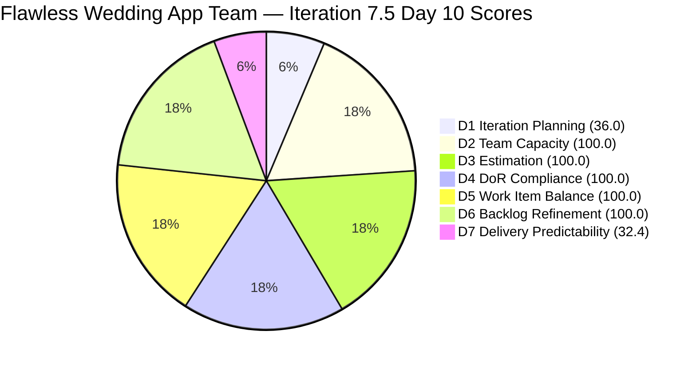
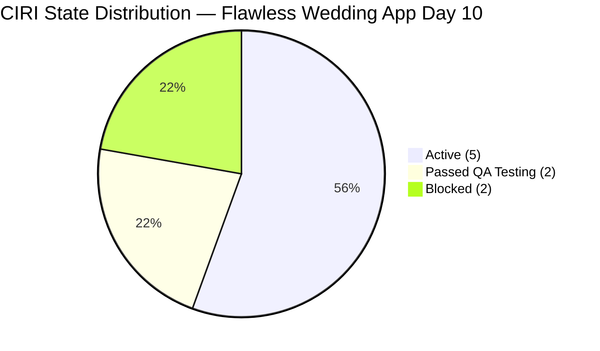
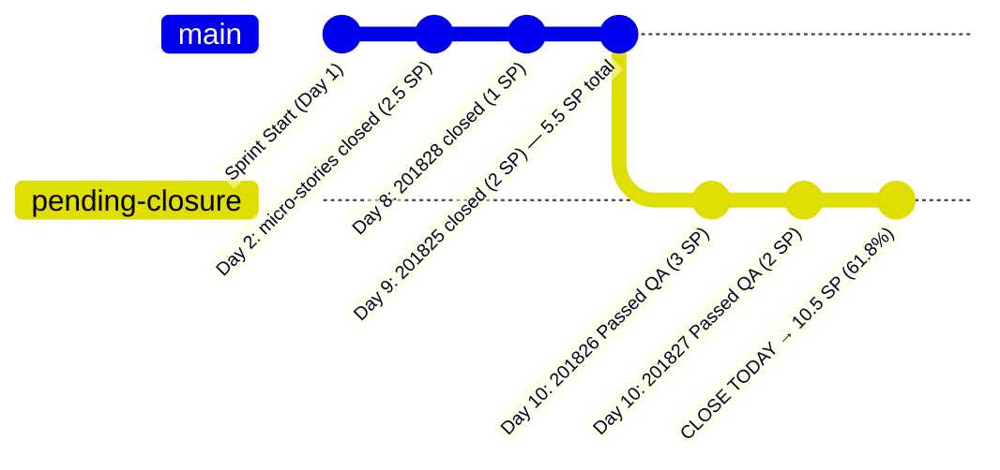

# ADO SAFe Audit — Flawless Wedding App Team

## 1. Audit Metadata

| Field | Value |
|-------|-------|
| **Audit Date** | 2026-06-10 |
| **Sprint Day** | Day 10 of 14 |
| **Iteration** | Iteration 7.5 |
| **Iteration Dates** | 2026-06-01 to 2026-06-14 |
| **ADO Project** | Flawless Wedding App |
| **ADO Project ID** | 92b967dc-5ec7-4874-b8f5-e43b00d88339 |
| **ADO Team** | Flawless Wedding App Team |
| **ADO Team ID** | 7d90ecbf-d272-4b0c-b33b-c66d96a790ac |
| **Iteration ID** | 60dfa50f-7931-460b-9f36-4277cf4cb491 |
| **Workspace** | `ado_fl_dev` |
| **Prior Audit** | AUDIT_20260609_0203.md (Day 9, Iteration 7.5, 81.3 — Low Risk) |
| **Overall Score** | **81.2 / 100** |
| **Risk Band** | **Low Risk** |

---

## 2. Executive Summary

The Flawless Wedding App Team **holds at 81.2 / 100 (Low Risk)** on Day 10, essentially flat from Day 9's 81.3 (−0.1). This is a positive outcome: the team maintains Low Risk status for the second consecutive day despite no new item closures in the standard state ("Closed" or "Done"). The most significant development today is the advancement of two items to **"Passed QA Testing"** state:

- **201826 (Receive Messages, US, 3 SP)** — advanced to Passed QA Testing at 2026-06-10T07:18
- **201827 (View Conversation History, US, 2 SP)** — advanced to Passed QA Testing at 2026-06-10T07:18

These two items (5 SP total) are on the threshold of closure — if Luke closes them today, D7 would rise from 32.4 to approximately **61.2** (10.5 SP closed / 17.0 SP committed), crossing from High Risk to Moderate Risk. This is the most impactful near-term action available.

**New critical defect added:** Item **206063** (Vendor Unable to Receive Payouts to Connected Stripe Account) was added at 2026-06-10T08:32 with iteration path at the PI7 root (not assigned to Iteration 7.5). It represents a live production issue involving a real vendor (Gabriel Preciado, Island Escape Weddings) and payment infrastructure. This is a high-severity operational defect requiring immediate triage.

**Blockers persist.** 202747 (Mobile Subscription Management) and 205105 (MobileApp Staging Environment) remain Blocked — Day 10 of blocking. No resolution visible in ADO.

---

## 3. Previous Audit Delta

**Prior audit:** AUDIT_20260609_0203.md — Iteration 7.5, Day 9, Score 81.3 / 100 (Low Risk)

| Dimension | Day 9 | Day 10 | Delta | Driver |
|-----------|-------|--------|-------|--------|
| D1 Iteration Planning | 66.7 | **36.0** | **−30.7** | VRBI grew 24→25 (206063 added at PI7 root); CIRI stays 9; formula: 9/25=36.0 |
| D2 Team Capacity | 100.0 | **100.0** | 0.0 | Luke, Ressa, Jaszmeine, Luzmibel all configured |
| D3 Estimation | 100.0 | **100.0** | 0.0 | 9/9 CIRI estimated; CSP=15.5 SP |
| D4 DoR Compliance | 100.0 | **100.0** | 0.0 | All 9 CIRI pass DoR |
| D5 Work Item Balance | 70.0 | **100.0** | **+30.0** | US=5/9=55.6%; dominant type no longer exceeds 60% threshold |
| D6 Backlog Refinement | 100.0 | **100.0** | 0.0 | All 25 VRBI fresh; 0 stale; 0 untouched CIRI |
| D7 Delivery Predictability | 32.4 | **32.4** | 0.0 | No new closures (Passed QA Testing not yet Closed); carried 5.5 SP |
| **Overall** | **81.3** | **81.2** | **−0.1** | D1 down from VRBI growth; D5 improved; net flat |

**Key changes since Day 9:**
- **201826 and 201827 advanced to "Passed QA Testing"** at 2026-06-10T07:18. Both are pre-closure but not yet "Closed" or "Done" per scoring rules.
- **204688 ([Beta/Staging] Notification icon visible in admin account)** updated at 2026-06-10T07:41 — state remains "Estimation", defect still in backlog.
- **204939 and 204940** updated at 2026-06-10T03:20 — subscription reminder items, still Active.
- **206063 (Stripe payout defect)** added at 2026-06-10T08:32 — new Defect at PI7 root, assigned to Luke. Counts in VRBI but not CIRI.
- **No new full closures detected.** CLSP remains at 5.5 SP from prior audit evidence.
- **202747 and 205105 remain Blocked.** Day 10 of blocking — no ADO change detected.

---

## 4. Current Iteration Snapshot

| Attribute | Value |
|-----------|-------|
| **Active Iteration** | Iteration 7.5 |
| **Sprint Duration** | 2026-06-01 to 2026-06-14 (14 days) |
| **Audit Day** | **Day 10 of 14** |
| **Days Remaining** | **4** |
| **VRBI** | 25 |
| **CIRI** | 9 |
| **Committed Story Points (open)** | 15.5 SP (visible) |
| **Committed Story Points (total, incl. closed)** | ~17.0 SP (prior audit baseline) |
| **Closed Story Points** | 5.5 SP (prior evidence) |
| **Team Capacity/Day** | Luke 6 (Dev) + Ressa 6 (Test) + Jaszmeine 3 (Design) + Luzmibel 1 (Test) = 16 hrs total |
| **Days Off (June 12)** | All 4 team members have June 12 as a day off |

---

## 5. Work Item Analysis

### Current Iteration Root Items (CIRI = 9)

| ID | Title | Type | State | Assignee | SP | Changed |
|----|-------|------|-------|----------|----|---------|
| 201826 | Receive Messages | User Story | **Passed QA Testing** | Luke Colina | 3 | 2026-06-10 |
| 201827 | View Conversation History | User Story | **Passed QA Testing** | Luke Colina | 2 | 2026-06-10 |
| 201831 | Message Notifications | User Story | Active | Luke Colina | 3 | 2026-06-08 |
| 201216 | Integration with Existing APIs | Enabler | Active | Luke Colina | 1 | 2026-06-04 |
| 204939 | Update Subscription Renewal Notification Messaging | User Story | Active | Luke Colina | 0.5 | 2026-06-10 |
| 204940 | Implement Subscription Reminder Frequency | User Story | Active | Luke Colina | 2 | 2026-06-10 |
| 202747 | Mobile Subscription Management for Bride Access | Enabler | **Blocked** | Luke Colina | 2 | 2026-06-05 |
| 205105 | MobileApp Staging Environment for User Testing | Enabler | **Blocked** | Luke Colina | 1 | 2026-06-05 |
| 205232 | Iteration 7.5 - Collaborations, Reports & Others | Spike | Active | Ressa Paracuelles | 1 | 2026-06-08 |

**Total CIRI SP (visible): 15.5 SP**

### Non-CIRI Backlog Items (Iteration 7.6 IP, PI7 root, and others)

| Iter Path | Count | Notable Items |
|-----------|-------|---------------|
| 7.6 IP (US) | 8 | 201802, 201803, 201804, 201817, 201836, 201839, 204944, 205645 |
| 7.6 IP (Defect) | 5 | 203887, 204439, 204688, 204755, 205327 |
| 7.6 IP (Spike) | 2 | 202777, 202778 |
| PI7 root | 1 | **206063** (new Stripe payout defect — HIGH severity) |

### DoR Compliance Check (CIRI)

All 9 CIRI items pass DoR:
- 201826, 201827, 201831: Well-formed BDD acceptance criteria with multiple scenarios — PASS
- 201216: Description present; AC has linked story references (≥20 chars in link text) — PASS
- 204939, 204940: BDD acceptance criteria with clear Given/When/Then — PASS
- 202747, 205105: Detailed descriptions and comprehensive acceptance criteria — PASS
- 205232: Description and AC both meet minimum thresholds — PASS

---

## 6. SAFe Compliance Scorecard

| Dimension | Score | Evidence | Notes |
|-----------|-------|----------|-------|
| D1 Iteration Planning | **36.0** | 9 CIRI / 25 VRBI | HIGH RISK — 16 items are in IP sprint or future; VRBI grew by 1 today (206063) |
| D2 Team Capacity | **100.0** | 4/4 contributors with capacity | Luke, Ressa, Jaszmeine, Luzmibel all configured with positive activities |
| D3 Estimation | **100.0** | 9/9 CIRI estimated | All types (US, Enabler, Spike) carry SP; CSP=15.5 SP |
| D4 DoR Compliance | **100.0** | 9/9 CIRI pass DoR | All items have substantive description + acceptance criteria |
| D5 Work Item Balance | **100.0** | US=5/9=55.6%; no penalty triggered | No dominant type >60%; spike_share=11.1%<40% |
| D6 Backlog Refinement | **100.0** | 25/25 fresh; 0 stale; 0 untouched | All items changed within 45 days; none predating 2026-04-26 |
| D7 Delivery Predictability | **32.4** | 5.5 SP closed / 17.0 SP committed | Carried from prior audit; closed items not in API; "Passed QA" not yet Closed |
| **Overall** | **81.2** | | **Low Risk** |

---

## 7. Dimension Findings

### D1 Iteration Planning — 36.0 (High Risk)
The VRBI of 25 items contains only 9 in the current iteration (36.0%). The remaining 16 items span Iteration 7.6 IP (15 items: 8 US + 5 Defects + 2 Spikes) and the PI7 root (1 new defect). The addition of 206063 today further inflates the denominator. The IP sprint items represent legitimate forward-sprint planning for the team's upcoming Innovation & Planning period, but their presence in the backlog API view dilutes D1 structurally. This is a recurring pattern for this team since PI7 began.

### D2 Team Capacity — 100.0 (Low Risk)
All four configured team members have positive capacity:
- Luke Colina: 6 hrs/day Development (primary delivery)
- Ressa Paracuelles: 6 hrs/day Testing (with June 12 day off)
- Jaszmeine Villanueva: 3 hrs/day Design (with June 12 day off)
- Luzmibel Paculanang: 1 hr/day Testing (with June 12 day off)

All 4 members have June 12 as a scheduled day off, reducing available sprint hours by approximately one full team-day before Day 14 close.

### D3 Estimation — 100.0 (Low Risk)
All 9 CIRI items carry story points. The 0.5 SP on item 204939 (Subscription Renewal Messaging) is appropriate for a notification copy update. The Enablers and Spike all have SP assigned. Total visible committed SP = 15.5.

### D4 DoR Compliance — 100.0 (Low Risk)
This team continues to demonstrate strong DoR discipline. The User Stories use BDD-format acceptance criteria with multiple scenarios. Enablers and Spikes have appropriate description and criteria. Item 201216 (Integration with Existing APIs) references linked stories as acceptance criteria — this is a weak DoR pattern but meets the minimum threshold.

### D5 Work Item Balance — 100.0 (Low Risk)
This is a significant improvement from Day 9's 70.0. The CIRI composition of 5 User Stories (55.6%), 3 Enablers (33.3%), and 1 Spike (11.1%) no longer triggers any penalty:
- No User Story absence (User Stories exist)
- Dominant type (US at 55.6%) does NOT exceed 60%
- Spike share (11.1%) does NOT exceed 40%

The team's balanced backlog with Enablers and a Spike representing technical infrastructure and team ceremonies reflects healthy SAFe practice.

### D6 Backlog Refinement — 100.0 (Low Risk)
All 25 VRBI items have ChangedDates after 2026-04-26 (45-day freshness threshold). The most recent additions (206063, 204939, 204940, 201826, 201827, 204688) were all updated today (2026-06-10). No stale items. No untouched CIRI (all changed after sprint start 2026-06-01).

### D7 Delivery Predictability — 32.4 (High Risk)
Based on prior audit evidence: 5.5 SP closed (201825=2 SP on Day 9, 201828=1 SP on Day 8, plus ~2.5 SP from Day 2 micro-stories) of 17.0 total committed SP. Two items (201826, 201827) are now in "Passed QA Testing" state — one ADO state transition away from "Closed." If Luke closes these today, D7 would jump to approximately:
- (5.5 + 3 + 2) / 17.0 = 10.5 / 17.0 = **61.8** — crossing from High Risk to Moderate Risk.

The window to recover D7 to Low Risk (≥80%) requires delivering approximately 8 more SP in the remaining 4 sprint days, which is challenging but not impossible given Luke's 6 hr/day Development capacity.

---

## 8. Risks and Bottlenecks

| Risk | Severity | Status |
|------|----------|--------|
| D7=32.4 — only 5.5 SP delivered of 17.0 committed | High | 201826 and 201827 in Passed QA — closure pending |
| 202747 + 205105 Blocked — Day 10 | High | Unresolved; mobile UAT cannot proceed |
| 206063 (Stripe payout defect) — new production issue | High | Unassigned to iteration; real vendor impact |
| D1=36.0 — only 9/25 VRBI in current sprint | High | Structural; IP sprint items inflate denominator |
| June 12 team day off — all 4 members | Moderate | Reduces effective sprint days from 4 to 3 |
| 201831 (Message Notifications, 3 SP) still Active | Moderate | If not closed by Day 13, sprint delivery will miss |
| 205232 (Spike) still Active — sprint events completed | Low | Administrative close recommended for Day 10 |

---

## 9. Prioritized Recommendations

1. **IMMEDIATE — Close 201826 and 201827 today.** Both are in "Passed QA Testing" state as of this morning. A single state transition to "Closed" would add 5 SP to CLSP (10.5 total), improving D7 from 32.4 to ~61.8. This is the highest-impact single action available.

2. **URGENT — Triage 206063 (Stripe payout defect) today.** This is a live production defect affecting a real vendor (Gabriel Preciado, Island Escape Weddings). Assign it to Iteration 7.5 or create a hotfix track. The payout infrastructure risk is customer-facing and requires immediate response outside normal sprint cadence.

3. **Resolve or escalate 202747 and 205105 blockers.** Day 10 of blocking is unacceptable. If these cannot be unblocked within 24 hours, cancel or defer them to Iteration 7.6 IP to prevent them from dragging D7 and creating a false signal in the sprint metrics.

4. **Close 205232 (Collaborations Spike) today.** Sprint events (Planning, Retrospective, Review, Team Sync, System Demo, Product Sync) have all occurred by Day 10. This administrative Spike should be closed immediately — it carries 1 SP and costs nothing to close.

5. **Target 201831 (Message Notifications, 3 SP) for closure by Day 12.** With June 12 as a team day off and Day 13-14 being the sprint close window, 201831 needs to complete QA testing by Day 11 to allow closure on Day 12 or 13.

6. **Plan for 204939 and 204940 (subscription reminder items, 2.5 SP total) in Days 11-12.** These were updated today, suggesting active work. Complete and close them before Day 13 to protect overall delivery.

---

## 10. Evidence Gaps and Limitations

| Gap | Impact | Disposition |
|-----|--------|-------------|
| Closed items (201825, 201828, micro-stories) not in backlog API | D7 partially derived from prior audit evidence | D7=32.4 carried forward: 5.5 SP closed / 17.0 SP committed |
| "Passed QA Testing" is not "Closed" or "Done" per scoring rules | 201826 and 201827 (5 SP) not counted in CLSP | Flagged as pre-closure items; D7 would be 61.8 upon closure |
| 206063 has no AcceptanceCriteria field populated | DoR status of new defect unknown | Not in CIRI (PI7 root iteration path); no DoR scoring impact |
| Jaszmeine Villanueva and Luzmibel Paculanang have no CIRI assignments | D2 scores them as with capacity but no current work | Capacity configuration correct; may have implicit Iteration 7.6 work |
| Blockers (202747, 205105) have no documented blocker resolution date | Cannot predict unblocking timeline | Marked High Risk; deferral to Iter 7.6 IP recommended if unresolved by Day 11 |

---

## Appendix: Mermaid Score Breakdown

