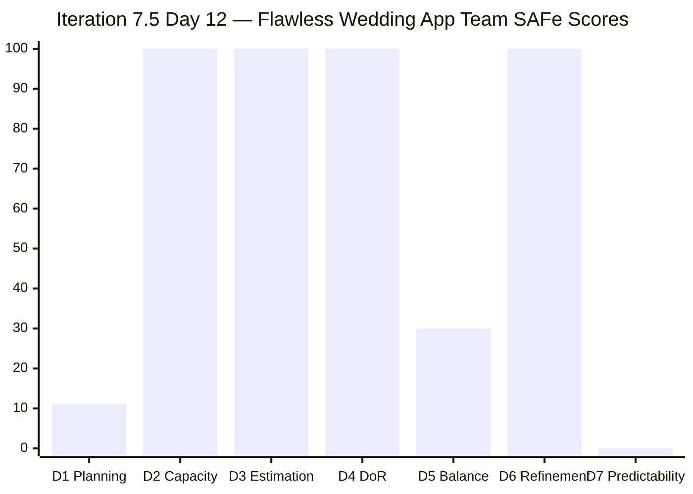
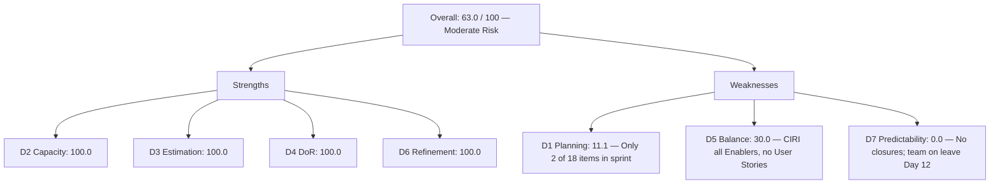

# ADO SAFe Audit — Flawless Wedding App Team

## 1. Audit Metadata

| Field | Value |
|-------|-------|
| **Audit Date** | 2026-06-12 (Friday) — Day 12 of 14 |
| **Timezone** | PHT (UTC+8) |
| **Iteration** | Iteration 7.5 |
| **Iteration Dates** | 2026-06-01 to 2026-06-14 |
| **Sprint Day** | Day 12 — 2 days remaining before sprint close |
| **ADO Project** | Flawless Wedding App |
| **ADO Project ID** | 92b967dc-5ec7-4874-b8f5-e43b00d88339 |
| **ADO Team** | Flawless Wedding App Team |
| **ADO Team ID** | 7d90ecbf-d272-4b0c-b33b-c66d96a790ac |
| **Iteration ID** | 60dfa50f-7931-460b-9f36-4277cf4cb491 |
| **Workspace** | `ado_fl_dev` |
| **Prior Audit** | AUDIT_20260610_0204.md (Day 10, Iteration 7.5, 81.2 — Low Risk) |
| **Overall Score** | **63.0 / 100** |
| **Risk Band** | **Moderate Risk** |

---

## 2. Executive Summary

The Flawless Wedding App Team **drops to 63.0 / 100 (Moderate Risk)** on Day 12 of Iteration 7.5, down **18.2 points** from Day 10's 81.2 (Low Risk). The team crosses out of Low Risk territory on the penultimate working days of the sprint.

The primary driver of this decline is **CIRI composition**: the live backlog API shows only **2 items** with IterationPath = "Flawless Wedding App\2026-PI7\Iteration 7.5" — items 202747 (Mobile Subscription Management for Bride Access, Enabler) and 205105 (MobileApp Staging Environment for User Testing, Enabler). The prior Day 10 audit reported 9 CIRI items; the remaining 7 (plus new items) are now in Iteration 7.6 (IP) or at the PI root.

**Both current CIRI items are Enablers**, not User Stories. This triggers the Work Item Balance penalty: no User Story in CIRI (−40) and dominant type >60% (−30), yielding D5 = 30.0. Furthermore, both items remain "Active" — no closures observed — so **D7 = 0.0**.

**The large VRBI relative to CIRI** (18 items total, only 2 in current iteration) produces **D1 = 11.1**, the lowest Iteration Planning score seen for this team this sprint.

**Sprint close risk is high:** With 2 days remaining, the team needs to close both Enablers (3 SP total) to register any delivery in the current sprint. Both items have been Active since well before the sprint started.

**Notable context:** The day-off entries for four team members (Ressa Paracuelles, Jaszmeine Villanueva, Luzmibel Paculanang, Luke Colina) on 2026-06-12 suggest the team is partially unavailable today, further reducing the closing window.

---

## 3. Previous Audit Delta

**Prior audit:** AUDIT_20260610_0204.md — Iteration 7.5, Day 10, Score 81.2 / 100 (Low Risk)

| Dimension | Day 10 | Day 12 | Delta | Driver |
|-----------|--------|--------|-------|--------|
| D1 Iteration Planning | 36.0 | **11.1** | **−24.9** | VRBI=18, CIRI=2; prior had 25 VRBI / 9 CIRI |
| D2 Team Capacity | 100.0 | **100.0** | 0.0 | Luke configured 6hr/day Development; still sole assignee on CIRI |
| D3 Estimation | 100.0 | **100.0** | 0.0 | 2/2 CIRI estimated (SP=2+1=3) |
| D4 DoR Compliance | 100.0 | **100.0** | 0.0 | Both CIRI items pass DoR |
| D5 Work Item Balance | 100.0 | **30.0** | **−70.0** | CIRI now only Enablers: no User Story (−40) + dominant >60% (−30) |
| D6 Backlog Refinement | 100.0 | **100.0** | 0.0 | 18/18 VRBI fresh; 0 stale; 0 untouched CIRI |
| D7 Delivery Predictability | 32.4 | **0.0** | **−32.4** | Prior carry-forward not applicable; committed SP=3, closed=0 |
| **Overall** | **81.2** | **63.0** | **−18.2** | D1, D5, D7 all regressed; CIRI composition changed |

**Key changes since Day 10:**
- The 7 prior User Story/Defect CIRI items (201826, 201827, and others visible in Day 10) are no longer returned as Iteration 7.5 items — they appear to have been moved to 7.6 (IP) or closed. If closed, they left the backlog API as expected.
- **202747 and 205105 remain Active** — Day 12 of Active status with no state change since the sprint began.
- **206063 (Stripe payout defect)** — added 2026-06-10, still at PI7 root level with no iteration assignment. Counts in VRBI but not CIRI.
- **All four team members have a day-off entry for 2026-06-12** (Ressa, Jaszmeine, Luzmibel, Luke) — reducing available closing days to essentially only June 13-14.

---

## 4. Current Iteration Snapshot

| Attribute | Value |
|-----------|-------|
| **Active Iteration** | Iteration 7.5 |
| **Sprint Duration** | 2026-06-01 to 2026-06-14 (14 days) |
| **Audit Day** | Day 12 of 14 |
| **Early-Sprint Flag** | No (Day 12) |
| **VRBI (all root backlog items)** | 18 |
| **CIRI (current iteration items)** | 2 |
| **Contributors with Current Work** | 1 (Luke Abram Colina) |
| **Contributors with Capacity** | 1 (Luke: 6hr/day Development; 3 others configured but not assigned CIRI) |
| **Committed Story Points** | 3 |
| **Closed Story Points** | 0 |
| **Team Days Off (2026-06-12)** | 4 members (Ressa, Jaszmeine, Luzmibel, Luke) |

---

## 5. Work Item Analysis

### CIRI Items (2 items in Iteration 7.5)

| ID | Title | Type | State | SP | Assignee | Changed | DoR |
|----|-------|------|-------|----|----------|---------|-----|
| 202747 | Mobile Subscription Management for Bride Access | Enabler | Active | 2 | Luke Colina | 2026-06-11 | ✓ |
| 205105 | MobileApp Staging Environment for User Testing | Enabler | Active | 1 | Luke Colina | 2026-06-11 | ✓ |

### Selected Non-CIRI VRBI Items (in Iteration 7.6 IP)

| ID | Title | Type | State | SP | Iteration |
|----|-------|------|-------|----|-----------|
| 201802 | Initial Payment Process | User Story | Estimation | 3 | 7.6 (IP) |
| 201803 | View All Bookings | User Story | Estimation | 1 | 7.6 (IP) |
| 201804 | Track Booking Status | User Story | Estimation | 1 | 7.6 (IP) |
| 201817 | Cancel Booking | User Story | Estimation | 2 | 7.6 (IP) |
| 201836 | View Contract | User Story | Estimation | 1 | 7.6 (IP) |
| 201839 | Sign Contract Digitally | User Story | Estimation | 1 | 7.6 (IP) |
| 204944 | Manage Booking Payments | User Story | Estimation | 3 | 7.6 (IP) |
| 205645 | Display Bride/Non-Event Navigation and Header | User Story | Estimation | 1 | 7.6 (IP) |
| 202777 | End PI7 — Team/Technical Agility Self Assessment | Spike | Ready | 0.5 | 7.6 (IP) |
| 202778 | Customer CSAT Survey | Spike | Ready | 0.5 | 7.6 (IP) |
| 203887 | [Android][Vendor] "Continue" button appears after login | Defect | Estimation | 0.5 | 7.6 (IP) |
| 204439 | [Beta/Staging] Delayed Logout Synchronization | Defect | Estimation | 2 | 7.6 (IP) |
| 204688 | [Beta/Staging] Notification icon in admin account | Defect | Estimation | 0.5 | 7.6 (IP) |
| 204755 | [Beta/Staging] Vendor redirected to login after Create User | Defect | Estimation | 1 | 7.6 (IP) |
| 205327 | [Web][Bride] Budget input allows non-numeric characters | Defect | Estimation | 0.5 | 7.6 (IP) |
| 206063 | Vendor Unable to Receive Payouts to Connected Stripe Account | Defect | Active | — | PI7 root |

### DoR Assessment for CIRI

| ID | Title | Description ≥ 30 chars | AC ≥ 20 chars | DoR Compliant |
|----|-------|------------------------|----------------|---------------|
| 202747 | Mobile Subscription Management for Bride Access | Yes (extensive multi-requirement description) | Yes (8 AC items listed) | **Yes** |
| 205105 | MobileApp Staging Environment for User Testing | Yes (two-paragraph setup description) | Yes (9 checklist criteria) | **Yes** |

---

## 6. SAFe Compliance Scorecard

| Dimension | Score | Evidence | Notes |
|-----------|-------|----------|-------|
| D1 Iteration Planning | 11.1 | 2 CIRI / 18 VRBI × 100 | Very low sprint focus; 16 items in future iterations |
| D2 Team Capacity | 100.0 | 1/1 contributor with current work has positive capacity | Luke: 6hr/day Development |
| D3 Estimation | 100.0 | 2/2 point-eligible CIRI estimated (SP=2+1=3) | Both Enablers have SP |
| D4 DoR Compliance | 100.0 | 2/2 CIRI items pass description + AC thresholds | Strong DoR on both items |
| D5 Work Item Balance | 30.0 | No User Story in CIRI (−40); Enabler 100% dominant (−30) | Both CIRI are Enablers; max(0, 100−70)=30 |
| D6 Backlog Refinement | 100.0 | 18/18 VRBI fresh; 0 stale-90; 0 stale-180; 0 untouched CIRI | All items changed after 2026-04-28 |
| D7 Delivery Predictability | 0.0 | Committed SP=3; Closed SP=0 (both Active) | No closures in current iteration |
| **Overall** | **63.0** | (11.1+100+100+100+30+100+0)/7 = 441.1/7 | **Moderate Risk** |

---

## 7. Dimension Findings

### D1 — Iteration Planning: 11.1

```
visible_root_backlog_items (VRBI) = 18
current_iteration_root_items (CIRI) = 2  [202747, 205105: IterationPath = Flawless Wedding App\2026-PI7\Iteration 7.5]

Score = round(2 / 18 * 100, 1) = 11.1
```

Only 2 of 18 visible backlog items are committed to the active iteration. The 16 remaining items are distributed across Iteration 7.6 (IP) (15 items) and the PI7 root (1 defect, 206063). This represents severe sprint focus dilution.

### D2 — Team Capacity: 100.0

```
contributors_with_current_work = 1  [Luke Abram Colina — assignee on both CIRI items]
contributors_with_capacity = 1  [Luke: Development 6hr/day > 0]
Note: Ressa, Jaszmeine, Luzmibel have capacity configured but no CIRI assignments

Score = round(1 / 1 * 100, 1) = 100.0
```

All four team members have days-off on 2026-06-12 per capacity records.

### D3 — Estimation: 100.0

```
point_eligible_current_items = 2  [202747 Enabler SP=2; 205105 Enabler SP=1]
estimated_current_items = 2  [both have SP > 0]

Score = round(2 / 2 * 100, 1) = 100.0
```

### D4 — DoR Compliance: 100.0

```
dor_compliant_current_items = 2  [202747 ✓, 205105 ✓]
current_iteration_root_items = 2

Score = round(2 / 2 * 100, 1) = 100.0
```

Both items have substantive descriptions and multi-criterion acceptance criteria well above the DoR thresholds.

### D5 — Work Item Balance: 30.0

```
Start: 100
No User Story in CIRI: Enabler × 2, 0 User Stories → −40
dominant_type_share: Enabler = 2/2 = 100% > 60% → −30
spike_share: 0/2 = 0% → no penalty

Score = max(0, 100 − 40 − 30) = max(0, 30) = 30.0
```

With only Enablers in CIRI, the SAFe balance formula penalizes heavily. This reflects a sprint composed entirely of infrastructure/technical work with no direct user-value delivery.

### D6 — Backlog Refinement: 100.0

```
visible_root_backlog_items = 18
fresh_visible_root_items (ChangedDate ≥ 2026-04-28) = 18
  All 18 items have ChangeDates in May-June 2026 ✓
stale_90_visible_root_items (ChangedDate < 2026-03-14) = 0
stale_180_visible_root_items (ChangedDate < 2025-12-15) = 0

base = round(18/18 * 100, 1) = 100.0
stale_90 penalty: 0/18 = 0% → no penalty
stale_180 penalty: 0 → no penalty
untouched CIRI: 202747 changed 2026-06-11 ✓; 205105 changed 2026-06-11 ✓ → 0 untouched

Score = max(0, 100.0 − 0) = 100.0
```

### D7 — Delivery Predictability: 0.0

```
committed_story_points = 3  [202747: SP=2; 205105: SP=1]
closed_story_points = 0  [both items in Active state; no Closed or Done items in CIRI]

Score = round(0 / 3 * 100, 1) = 0.0
```

**Note:** Day 10 audit carried 5.5 SP closed from prior evidence (items that had left the backlog API earlier in the sprint). Those items are no longer visible as CIRI and thus cannot be scored. The live committed_SP of 3 represents the only visible current sprint commitment.

---

## 8. Score Breakdown





---

## 9. Risks and Bottlenecks

| # | Risk | Severity | Impact |
|---|------|----------|--------|
| 1 | Both CIRI items (202747, 205105) remain Active with sprint closing in 2 days; entire team on leave June 12 | Critical | D7 = 0.0 unless both items closed June 13-14; sprint ends with 0 SP delivered |
| 2 | D1 = 11.1 — lowest Iteration Planning score observed this sprint | Critical | 16 of 18 backlog items assigned to future iterations; sprint commitment is near-zero |
| 3 | 206063 (Stripe payout defect — Gabriel Preciado/Island Escape Weddings) still at PI7 root with no iteration assignment | High | Live production defect affecting a real vendor; no sprint commitment to fix it |
| 4 | All CIRI composed of Enablers with no User Story | High | D5 = 30.0; no user-facing delivery in sprint from current commitment |
| 5 | Single contributor (Luke Colina) on all CIRI items despite 4-person team configured | High | Resource concentration risk; 3 other members (Ressa, Jaszmeine, Luzmibel) have no CIRI assignments |
| 6 | 14 items in Iteration 7.6 (IP) pre-loaded before 7.5 closes | Moderate | IP sprint overloaded with deferrals; IP sprint should be Innovation & Planning, not a catch-all |

---

## 10. Prioritized Recommendations

1. **[Critical] Close items 202747 and 205105 on June 13 or 14** if the work is complete. This is the only path to any D7 score for the sprint. Luke or the team lead must update these items immediately upon work completion.
2. **[Critical] Assign item 206063 (Stripe payout defect) to an iteration immediately.** A live production defect with a named vendor impact cannot sit at the PI root. It needs triage, sprint assignment, and an owner.
3. **[High] Sprint retrospective for Iteration 7.5** must document why 7 prior CIRI items (User Stories) moved to 7.6 IP without closure. If they were completed, close them in ADO before June 14.
4. **[High] Rebalance 7.6 IP scope.** The IP sprint currently holds 14 items — far exceeding typical IP sprint scope (retrospective, planning, demos, team-level innovation). Separate genuine IP activities from deferred sprint work.
5. **[High] Distribute CIRI assignments** across the team. Ressa (Testing, 6hr/day) and Luzmibel (Testing, 1hr/day) should have active CIRI items for any testing-related work, including items 203887, 204439, 204688, and 205327.
6. **[Moderate] Assign a sprint champion** to close the audit loop on "Passed QA Testing" items from prior days (201826, 201827). If these were closed, confirm in ADO; if not, reschedule or escalate.

---

## 11. Evidence Gaps and Limitations

| Gap | Impact | Notes |
|-----|--------|-------|
| 7 prior CIRI items (from Day 10) no longer visible in Iteration 7.5 backlog API | CIRI count dropped from 9 to 2; D7 affected | Items may have been closed (left API) or moved to 7.6 IP. If closed, prior sprint delivery (est. 5.5 SP from Day 10 carry-forward) cannot be confirmed without WIQL query |
| D7 carry-forward from Day 10 (32.4) not applicable to current visible CIRI | D7 = 0.0 based only on current visible evidence | Inherent ADO backlog API limitation: closed items are not returned |
| Items 201826 and 201827 were "Passed QA Testing" on Day 10 — current iteration path unknown | Cannot confirm if they progressed to Closed | If closed, they represent additional delivered SP not counted today |
| Team day-off entries for all 4 members on 2026-06-12 | Effectively one closing day (June 13) before sprint close on June 14 | Reduces the window for final closures to a single day |
| 206063 has no iteration assignment (at PI7 root) and no Story Points visible | Cannot assess delivery commitment for this production defect | Recommend immediate triage and iteration assignment |
