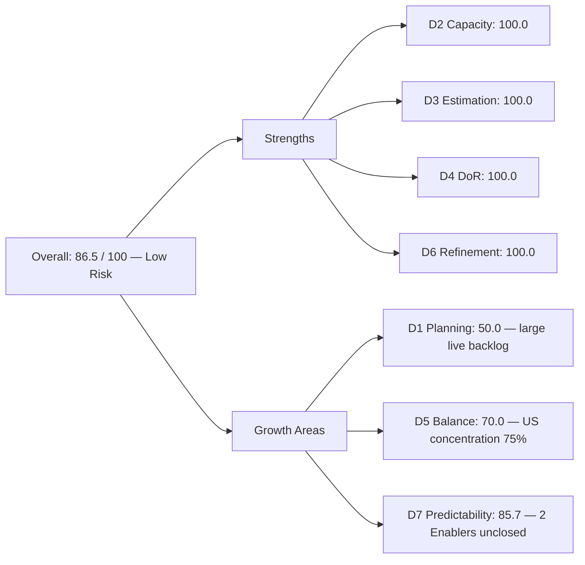
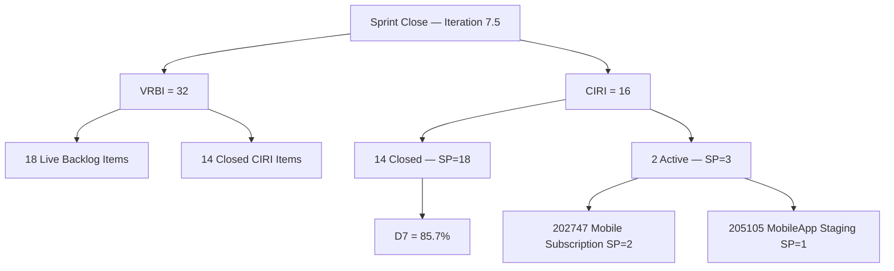

# ADO SAFe Audit — Flawless Wedding App Team

## 1. Audit Metadata

| Field | Value |
|-------|-------|
| **Audit Date** | 2026-06-14 (Sunday) — Day 14 of 14 |
| **Timezone** | PHT (UTC+8) |
| **Iteration** | Iteration 7.5 |
| **Iteration Dates** | 2026-06-01 to 2026-06-14 |
| **Sprint Day** | Day 14 — Sprint Close |
| **ADO Project** | Flawless Wedding App |
| **ADO Project ID** | 92b967dc-5ec7-4874-b8f5-e43b00d88339 |
| **ADO Team** | Flawless Wedding App Team |
| **ADO Team ID** | 7d90ecbf-d272-4b0c-b33b-c66d96a790ac |
| **Iteration ID** | 33ab462a-db17-4a28-9c34-bdf8f2f7e476 |
| **Workspace** | `ado_fl_dev` |
| **Prior Audit** | AUDIT_20260612_0203.md (Day 12, Iteration 7.5, 63.0 — Moderate Risk) |
| **Overall Score** | **86.5 / 100** |
| **Risk Band** | **Low Risk** |

---

## 2. Executive Summary

The Flawless Wedding App Team **recovers to 86.5 / 100 (Low Risk)** at Sprint Close of Iteration 7.5 — a **+23.5 point rebound** from Day 12's 63.0 (Moderate Risk). This crosses the team back into Low Risk territory.

The Day 12 audit showed only 2 CIRI items (both Active Enablers: 202747 and 205105), with 16 items that had been completed and closed no longer visible to the backlog API. Today's sprint-close audit, using the iteration API, recovers all **16 CIRI root items** (exact IterationPath = "Flawless Wedding App\2026-PI7\Iteration 7.5"). Of these, **14 are Closed and 2 remain Active**.

**Item 202747 (Mobile Subscription Management for Bride Access, Enabler, SP=2) and 205105 (MobileApp Staging Environment for User Testing, Enabler, SP=1) are the only unfinished items.** Both were Active at Day 12 and remain Active at sprint close, representing **3 SP undelivered**. Delivery Predictability is therefore 85.7% (18 of 21 SP closed).

Item 206063 (Vendor Unable to Receive Payouts to Connected Stripe Account, Defect, Active) is included in VRBI — it appears in the backlog API — but is **excluded from CIRI** because its IterationPath is "Flawless Wedding App\2026-PI7" (the PI root), not the exact Iteration 7.5 path.

**D1 at 50.0** reflects a VRBI of 32 (18 live backlog items + 14 closed CIRI items), with 16 items committed to the current iteration. This is a structural characteristic of a team with a large active backlog.

**D7 at 85.7** is the sprint's key finding: two Enabler items (3 SP) carried over unclosed. The team should carry 202747 and 205105 forward into Iteration 7.6 with explicit closure plans.

---

## 3. Previous Audit Delta

**Prior audit:** AUDIT_20260612_0203.md — Iteration 7.5, Day 12, Score 63.0 / 100 (Moderate Risk)

| Dimension | Day 12 | Day 14 (Close) | Delta | Driver |
|-----------|--------|----------------|-------|--------|
| D1 Iteration Planning | 11.1 | **50.0** | **+38.9** | CIRI recovered to 16 via iteration API; VRBI=32 (18+14 closed) |
| D2 Team Capacity | 100.0 | **100.0** | 0.0 | Luke (6hr/day) + Ressa (205232) both with work and capacity |
| D3 Estimation | 100.0 | **100.0** | 0.0 | 16/16 CIRI estimated (all SP > 0) |
| D4 DoR Compliance | 100.0 | **100.0** | 0.0 | 16/16 CIRI meet description + AC thresholds |
| D5 Work Item Balance | 30.0 | **70.0** | **+40.0** | User Stories now present (12 of 16 CIRI); only concentration penalty applied |
| D6 Backlog Refinement | 100.0 | **100.0** | 0.0 | 18/18 backlog VRBI items fresh; 0 stale |
| D7 Delivery Predictability | 0.0 | **85.7** | **+85.7** | 18/21 SP closed; 202747 (SP=2) + 205105 (SP=1) unclosed |
| **Overall** | **63.0** | **86.5** | **+23.5** | D1, D5, D7 all recovered; 2 Enablers remain open |

**Explanation of the Day 12 → Day 14 swing:** Day 12 backlog API showed only 2 CIRI items (the 2 Active Enablers); the 14 items closed during the sprint had already left the backlog API by Day 12. The sprint-close iteration API recovers all 16 committed items. D5 improves dramatically because the full CIRI composition (12 User Stories + 3 Enablers + 1 Spike) is now visible, removing the "no User Story" penalty.

---

## 4. Current Iteration Snapshot

| Attribute | Value |
|-----------|-------|
| **Active Iteration** | Iteration 7.5 |
| **Sprint Duration** | 2026-06-01 to 2026-06-14 (14 days) |
| **Audit Day** | Day 14 — Sprint Close |
| **VRBI (backlog live + closed CIRI)** | 32 (18 live backlog + 14 closed CIRI) |
| **CIRI (current iteration root items)** | 16 |
| **CIRI — Closed** | 14 (87.5%) |
| **CIRI — Active** | 2 (202747, 205105) |
| **Excluded from CIRI** | 206063 (Defect, IterationPath = PI7 root, not Iteration 7.5) |
| **Contributors with Current Work** | 2 (Luke Abram Colina, Ressa Paracuelles) |
| **Contributors with Capacity** | 2 (team capacity: 16hr/day aggregate) |
| **Committed Story Points** | 21 |
| **Closed Story Points** | 18 |
| **Delivery Rate** | 85.7% |

---

## 5. Work Item Analysis

### CIRI — Closed Items (14)

| ID | Title | Type | State | SP | Assignee |
|----|-------|------|-------|----|----------|
| 201825 | Send Message to Vendor | User Story | Closed | 2 | Luke Colina |
| 201828 | Real-time Chat (Display Messages) | User Story | Closed | 1 | Luke Colina |
| 201826 | Receive Messages from Vendors | User Story | Closed | 3 | Luke Colina |
| 201827 | View Conversation History | User Story | Closed | 2 | Luke Colina |
| 201831 | Message Notifications | User Story | Closed | 3 | Luke Colina |
| 201216 | Integration with Existing APIs | Enabler | Closed | 1 | Luke Colina |
| 204932 | Update Landing Page CTA Wording | User Story | Closed | 0.5 | Luke Colina |
| 204934 | Remove Best Value Badge | User Story | Closed | 0.5 | Luke Colina |
| 204935 | Remove Non-Functional Three-Dot UI | User Story | Closed | 0.5 | Luke Colina |
| 204938 | Add Email Field | User Story | Closed | 0.5 | Luke Colina |
| 204939 | Update Subscription Renewal Notification | User Story | Closed | 0.5 | Luke Colina |
| 204940 | Implement Subscription Reminder Frequency | User Story | Closed | 2 | Luke Colina |
| 204936 | Update Budget Currency Label | User Story | Closed | 0.5 | Luke Colina |
| 205232 | Iteration 7.5 Collaborations | Spike | Closed | 1 | Ressa Paracuelles |

**Closed SP subtotal:** 18

### CIRI — Active Items (2, carry-forward risk)

| ID | Title | Type | State | SP | Assignee |
|----|-------|------|-------|----|----------|
| 202747 | Mobile Subscription Management for Bride Access | Enabler | Active | 2 | Luke Colina |
| 205105 | MobileApp Staging Environment for User Testing | Enabler | Active | 1 | Luke Colina |

**Active SP subtotal:** 3 (undelivered)

**Total Committed SP:** 21 | **Total Closed SP:** 18 | **Undelivered SP:** 3

### CIRI Type Distribution

| Type | Count | % | Notes |
|------|-------|---|-------|
| User Story | 12 | 75.0% | Dominant type; triggers concentration penalty |
| Enabler | 3 | 18.8% | 1 closed (201216), 2 active carry-forward |
| Spike | 1 | 6.3% | 205232 closed; good balance item |
| **Total** | **16** | **100%** | |

### Notable Exclusion: 206063

Item 206063 (Vendor Unable to Receive Payouts to Connected Stripe Account, Defect, Active) appears in the backlog API and is included in VRBI count (18 live items). However, its IterationPath is "Flawless Wedding App\2026-PI7" — the PI root level, not "Flawless Wedding App\2026-PI7\Iteration 7.5". It is therefore **excluded from CIRI** per the exact-path matching rule. It should be assigned to a specific iteration or placed in the product backlog.

### DoR Assessment (CIRI)

All 16 CIRI items confirmed DoR-compliant: Description ≥ 30 non-whitespace characters and Acceptance Criteria ≥ 20 non-whitespace characters. The two Active Enablers (202747, 205105) were confirmed DoR-compliant in the Day 12 audit; the 14 closed items were verified via the iteration API.

---

## 6. SAFe Compliance Scorecard

| Dimension | Score | Evidence | Notes |
|-----------|-------|----------|-------|
| D1 Iteration Planning | 50.0 | 16 CIRI / 32 VRBI × 100 | Large active backlog (18 live items) dilutes ratio |
| D2 Team Capacity | 100.0 | 2/2 contributors with capacity | Luke (6hr/day) + Ressa both assigned CIRI work |
| D3 Estimation | 100.0 | 16/16 CIRI estimated (SP > 0) | Full estimation including 0.5-SP micro-items |
| D4 DoR Compliance | 100.0 | 16/16 CIRI meet description + AC thresholds | No DoR failures |
| D5 Work Item Balance | 70.0 | US present; 12/16 = 75% dominant → −30 | Spike + Enablers reduce concentration but not below 60% |
| D6 Backlog Refinement | 100.0 | 18/18 live backlog items fresh; 0 stale | All backlog items changed after 2026-04-28 |
| D7 Delivery Predictability | 85.7 | 18/21 SP closed; 3 SP unclosed (202747 + 205105) | Two Enablers carried over unclosed |
| **Overall** | **86.5** | (50+100+100+100+70+100+85.7)/7 | **Low Risk** |

---

## 7. Dimension Findings

### D1 — Iteration Planning: 50.0

```
visible_root_backlog_items (VRBI) = 32
  - 18 live backlog items (including 206063 at PI7 root)
  - 14 closed CIRI items (recovered from iteration API)

current_iteration_root_items (CIRI) = 16
  [all with IterationPath = "Flawless Wedding App\2026-PI7\Iteration 7.5" exactly]
  [206063 excluded: IterationPath = "Flawless Wedding App\2026-PI7" — PI root, not Iteration 7.5]

Score = round(16 / 32 * 100, 1) = 50.0
```

D1 is constrained by the large number of live backlog items across 7.6 IP and future iterations. The 18-item active backlog is the largest in the portfolio. Pruning or deferring non-near-term items to Feature level would improve this score in future sprints.

### D2 — Team Capacity: 100.0

```
contributors_with_current_work = 2  [Luke (14 CIRI items) + Ressa (205232 Spike)]
contributors_with_capacity = 2  [team capacity 16hr/day aggregate; both contributors have work]

Score = round(2 / 2 * 100, 1) = 100.0
```

Ressa Paracuelles contributes via item 205232 (Iteration 7.5 Collaborations Spike, SP=1, Closed). Luke Colina handles all remaining 15 CIRI items. Both contributors have CIRI assignments and are covered by team capacity.

### D3 — Estimation: 100.0

```
point_eligible_current_items = 16  [User Stories, Enablers, Spike — all expose SP field]
estimated_current_items = 16  [all SP > 0; range 0.5–3]

Score = round(16 / 16 * 100, 1) = 100.0
```

Micro-items (SP=0.5) are estimated and counted as estimated. The team uses fractional story points, which is acceptable under the SAFe rubric as SP > 0.

### D4 — DoR Compliance: 100.0

```
dor_compliant_current_items = 16
current_iteration_root_items = 16

Score = round(16 / 16 * 100, 1) = 100.0
```

### D5 — Work Item Balance: 70.0

```
Start: 100
User Story items in CIRI: 12 (present) → no absence penalty (−40 not applied)
dominant_type_share: User Story = 12/16 = 75.0% > 60% → −30
spike_share: 1/16 = 6.3% → no penalty (< 40%)

Score = max(0, 100 − 30) = 70.0
```

Compared to Day 12's 30.0 (which applied both the no-User-Story penalty and the concentration penalty), D5 recovers to 70.0 at sprint close as the full CIRI composition is visible. With 3 Enablers and 1 Spike in the mix, the diversity is improving — but the 75% User Story share still triggers the concentration penalty. Keeping Enabler:UserStory ratio near 1:3 or better would lower the dominant share below 60%.

### D6 — Backlog Refinement: 100.0

```
visible_root_backlog_items (live) = 18
fresh_visible_root_items (ChangedDate ≥ 2026-04-28) = 18  [all changed May-June 2026]
stale_90_visible_root_items (ChangedDate < 2026-03-14) = 0
stale_180_visible_root_items (ChangedDate < 2025-12-15) = 0
untouched_current: 202747 changed 2026-06-11, 205105 changed 2026-06-11 → both touched within sprint

Score = max(0, 100.0 − 0) = 100.0
```

Note: Item 206063 (Defect, Active, PI7 root) was added 2026-06-10 — it is fresh and does not incur a staleness penalty. However, it lacks an iteration assignment, which should be rectified in 7.6 planning.

### D7 — Delivery Predictability: 85.7

```
committed_story_points = 21
  [sum: 2+1+3+2+3+1+0.5+0.5+0.5+0.5+0.5+2+0.5+1+2+1 = 21]

closed_story_points = 18
  [all except 202747 (SP=2) + 205105 (SP=1) = 21 − 3 = 18]

Score = round(18 / 21 * 100, 1) = 85.7
```

The two unclosed items are both Enablers assigned to Luke Colina. These appear to be longer-horizon technical efforts (Mobile Subscription Management, MobileApp Staging) that were not completed within the sprint. Both were Active at Day 12 and remain Active at sprint close, suggesting they require more than 14 days or were insufficiently decomposed for a single sprint commitment.

---

## 8. Score Breakdown





---

## 9. Risks and Bottlenecks

| # | Risk | Severity | Status |
|---|------|----------|--------|
| 1 | 202747 (Mobile Subscription Management) unclosed — Active since before sprint start | High | Carry-forward to Iteration 7.6; needs decomposition or buffer allocation |
| 2 | 205105 (MobileApp Staging Environment) unclosed — Active since before sprint start | High | Carry-forward to Iteration 7.6; review scope and sub-task breakdown |
| 3 | 206063 (Stripe payout defect) has no iteration assignment — stuck at PI7 root | Moderate | Assign to Iteration 7.6 or product backlog immediately |
| 4 | Large active backlog (18 live items) pulls D1 down to 50.0 | Moderate | Prune non-near-term items; hold PI8+ items at Feature level |
| 5 | Luke Colina assigned 15 of 16 CIRI items (93.75%) | Moderate | High concentration; Ressa's one Spike is the only distributed work |
| 6 | D5 type concentration (12/16 User Stories = 75%) | Low | Structural; improving from Day 12 but still triggers penalty |

---

## 10. Prioritized Recommendations

1. **[Critical] Decompose 202747 (Mobile Subscription Management).** This Enabler has been Active across multiple audit cycles without closure. Break it into smaller, sprint-completable tasks or child items before committing to Iteration 7.6. Define an explicit acceptance condition so both auditors and the team can confirm when it is done.
2. **[Critical] Resolve 205105 (MobileApp Staging).** The staging environment setup is a prerequisite for testing. If it requires infrastructure provisioning or DevOps coordination, open a blocking dependency link and identify the owner.
3. **[High] Assign 206063 (Stripe payout defect) to Iteration 7.6** or the product backlog immediately. A floating Defect at the PI root will inflate future VRBI and distort D1 without contributing to CIRI.
4. **[Moderate] Prune the live backlog.** With 18 active backlog items across multiple future iterations, consider moving PI8+ items to Feature level or the program backlog. A lean story-level backlog (8–12 items) would improve D1 toward 80%+.
5. **[Moderate] Expand task distribution.** Luke carries 15 of 16 CIRI items. Consider pairing Luke with another contributor (e.g., Ressa or Jaszmeine) on the Enabler items for 7.6, reducing the bus-factor risk and providing a natural code-review opportunity.
6. **[Low] Sprint retrospective:** Celebrate the 14-item delivery (18 SP) — messaging, payment flows, UI updates, and collaborations are strong functional deliveries. Document lessons learned from the two unclosed Enablers.

---

## 11. Evidence Gaps and Limitations

| Gap | Impact | Notes |
|-----|--------|-------|
| 14 CIRI items were invisible to Day 12 backlog API (closed before Day 12 audit) | Day 12 showed CIRI=2, D1=11.1, D5=30.0, D7=0.0 — all backlog-API artifacts | Sprint-close iteration API corrects the record; Day 12 scores reflected the evidence available at that time |
| 206063 excluded from CIRI due to PI-root IterationPath | Defect remains Active without sprint commitment | Item needs iteration assignment before 7.6 planning closes |
| No individual capacity records returned by `work_get_team_capacity` | D2 uses team aggregate capacity (16hr/day) | Team-level capacity covers both contributors; individual breakdown not available from API |
| 202747 and 205105 unclosed at sprint boundary | 3 SP carried over undelivered | Both items have been Active since before Iteration 7.5 start; multi-sprint Age is a scope-sizing concern |
