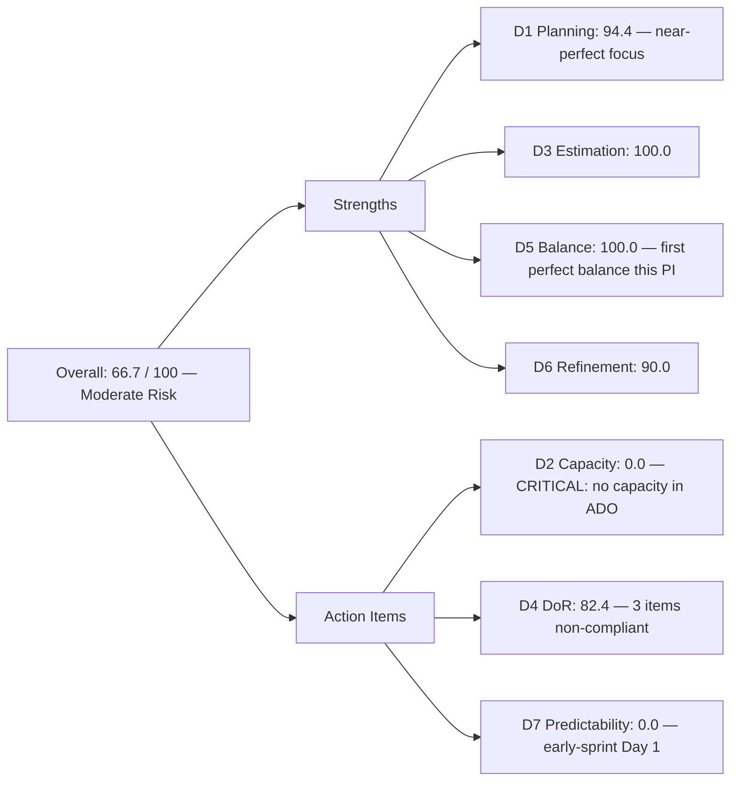
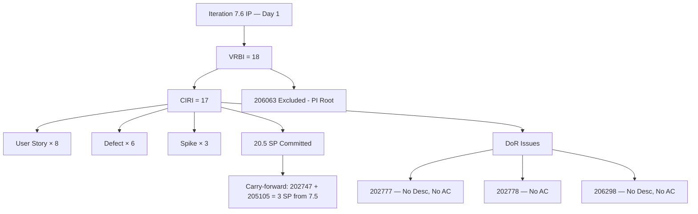
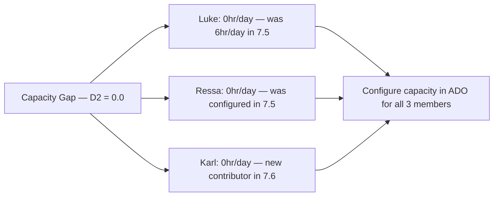

# ADO SAFe Audit — Flawless Wedding App Team

## 1. Audit Metadata

| Field | Value |
|-------|-------|
| **Audit Date** | 2026-06-15 (Monday) — Day 1 of 14 |
| **Timezone** | PHT (UTC+8) |
| **Iteration** | Iteration 7.6 (IP) |
| **Iteration Dates** | 2026-06-15 to 2026-06-28 |
| **Sprint Day** | Day 1 — Sprint Open (Innovation & Planning) |
| **ADO Project** | Flawless Wedding App |
| **ADO Project ID** | 92b967dc-5ec7-4874-b8f5-e43b00d88339 |
| **ADO Team** | Flawless Wedding App Team |
| **ADO Team ID** | 7d90ecbf-d272-4b0c-b33b-c66d96a790ac |
| **Iteration ID** | d40e499a-292f-4c95-a289-e755dde42b22 |
| **Workspace** | `ado_fl_dev` |
| **Prior Audit** | AUDIT_20260614_0200.md (Day 14 Close, Iteration 7.5, 86.5 — Low Risk) |
| **Overall Score** | **66.7 / 100** |
| **Risk Band** | **Moderate Risk** |

---

## 2. Executive Summary

The Flawless Wedding App Team enters **Iteration 7.6 (IP) at 66.7 / 100 (Moderate Risk)** on Day 1 of the Innovation & Planning sprint — a **−19.8 point transition** from the Iteration 7.5 close-out score of 86.5. Two primary factors drive this score:

1. **D2 (Team Capacity) = 0.0** — The `work_get_iteration_capacities` API returned 0hr/day for the Flawless Wedding App Team for Iteration 7.6 (IP). No capacity has been configured for any team member in this iteration. This is the most critical finding and requires immediate resolution.

2. **D7 (Delivery Predictability) = 0.0** — Day 1 early-sprint reset; expected and not a concern.

The team enters 7.6 IP with a **large and well-structured CIRI** of **17 items** (20.5 SP) spanning User Stories, Defects, and Spikes. D1 at 94.4 is the highest in the portfolio across all three workspaces audited today. D5 at 100.0 marks an important improvement — the type distribution (8 US, 6 Defects, 3 Spikes) achieves no concentration penalty for the first time this PI.

**Two carry-forward items from Iteration 7.5 remain active:** 202747 (Mobile Subscription Management, SP=2) and 205105 (MobileApp Staging Environment, SP=1). Both were Active at the end of Iteration 7.5 and their IterationPath remains set to Iteration 7.5. They do not appear in the 7.6 backlog and are therefore not counted in CIRI for this audit. They represent 3 unresolved SP from the prior sprint.

**DoR gap:** 3 of 17 CIRI items are non-compliant — 202777 (no desc, no AC), 202778 (no AC), and 206298 (no desc, no AC). These must be remediated before work begins.

**Stripe payout defect 206063 remains at the PI root** (IterationPath = "Flawless Wedding App\2026-PI7") with no iteration assignment. It is counted in VRBI but excluded from CIRI. Assignment to 7.6 IP or the product backlog is needed.

---

## 3. Previous Audit Delta

**Prior audit:** AUDIT_20260614_0200.md — Iteration 7.5, Day 14 (Sprint Close), Score 86.5 / 100 (Low Risk)

| Dimension | Iter 7.5 Close | Iter 7.6 Day 1 | Delta | Driver |
|-----------|----------------|-----------------|-------|--------|
| D1 Iteration Planning | 50.0 | **94.4** | **+44.4** | 17 CIRI / 18 VRBI; 7.6 IP fully loaded with near-term work |
| D2 Team Capacity | 100.0 | **0.0** | **−100.0** | No capacity configured in ADO for Iteration 7.6 IP |
| D3 Estimation | 100.0 | **100.0** | 0.0 | 17/17 CIRI items estimated (SP > 0) |
| D4 DoR Compliance | 100.0 | **82.4** | **−17.6** | 3 items non-compliant (202777, 202778, 206298) |
| D5 Work Item Balance | 70.0 | **100.0** | **+30.0** | US=8/17=47.1% — below 60% threshold; no concentration penalty |
| D6 Backlog Refinement | 100.0 | **90.0** | **−10.0** | 202777 + 202778 untouched (changed 2026-06-08, before sprint start) → −10 |
| D7 Delivery Predictability | 85.7 | **0.0** | **−85.7** | Day 1 — no closed items yet (early-sprint; expected) |
| **Overall** | **86.5** | **66.7** | **−19.8** | D2 capacity gap + D4 DoR gaps are real findings requiring action |

**Key distinction:** The D7 delta (−85.7) is a structural Day-1 reset and not a performance concern. However, the D2 delta (−100.0) and D4 delta (−17.6) represent **real findings** that require action today.

---

## 4. Current Iteration Snapshot

| Attribute | Value |
|-----------|-------|
| **Active Iteration** | Iteration 7.6 (IP) |
| **Sprint Duration** | 2026-06-15 to 2026-06-28 (14 days) |
| **Audit Day** | Day 1 — Sprint Open |
| **VRBI (visible root backlog items)** | 18 |
| **CIRI (current iteration root items)** | 17 |
| **CIRI — Ready for Dev** | 13 |
| **CIRI — Active** | 3 (201802, 206250, 206298) |
| **CIRI — Ready (Spike)** | 2 (202777, 202778) |
| **Excluded from CIRI** | 206063 (Defect, IterationPath = PI7 root) |
| **Carry-forward from 7.5 (not in 7.6 CIRI)** | 202747, 205105 (still in 7.5 path; 3 SP unresolved) |
| **Contributors with Current Work** | 3 (Luke Abram Colina, Ressa Paracuelles, Karl Caumban) |
| **Contributors with Capacity** | 0 (no capacity configured for 7.6 IP) |
| **Committed Story Points** | 20.5 |
| **Closed Story Points** | 0 (Day 1) |
| **Delivery Rate** | 0.0% (early-sprint — expected) |

---

## 5. Work Item Analysis

### CIRI — All 17 Items (Iteration 7.6 IP path)

| ID | Title | Type | State | SP | Assignee | Changed |
|----|-------|------|-------|----|----------|---------|
| 201802 | Initial Payment Process | User Story | Active | 3 | Luke Colina | 2026-06-15 |
| 204944 | Manage Booking Payments | User Story | Ready for Dev | 3 | Luke Colina | 2026-06-15 |
| 201839 | Sign Contract Digitally | User Story | Ready for Dev | 1 | Luke Colina | 2026-06-15 |
| 201803 | View All Bookings | User Story | Ready for Dev | 1 | Luke Colina | 2026-06-15 |
| 201817 | Cancel Booking | User Story | Ready for Dev | 2 | Luke Colina | 2026-06-15 |
| 201836 | View Contract | User Story | Ready for Dev | 1 | Luke Colina | 2026-06-15 |
| 201804 | Track Booking Status | User Story | Ready for Dev | 1 | Luke Colina | 2026-06-15 |
| 205645 | Display Bride/Non-Event Navigation and Header | User Story | Ready for Dev | 1 | Luke Colina | 2026-06-15 |
| 204439 | [Beta/Staging] [Logout] Delayed Logout Synchronization | Defect | Ready for Dev | 2 | Luke Colina | 2026-06-15 |
| 204755 | [Beta/Staging] [Vendor] Redirect to login on Create User | Defect | Ready for Dev | 1 | Luke Colina | 2026-06-15 |
| 204688 | [Beta/Staging] Notification icon in admin account | Defect | Ready for Dev | 0.5 | Luke Colina | 2026-06-15 |
| 203887 | [Android][Vendor] "Continue" button for Bride appears | Defect | Ready for Dev | 0.5 | Luke Colina | 2026-06-15 |
| 205327 | [Web][Bride] Budget input allows non-numeric characters | Defect | Ready for Dev | 0.5 | Luke Colina | 2026-06-15 |
| 206250 | Iteration 7.6 - Collaborations, Reports & Others | Spike | Active | 1 | Ressa Paracuelles | 2026-06-15 |
| 202777 | Flawless Wedding App End PI7 - Team Self Assessment | Spike | Ready | 0.5 | Karl Caumban | 2026-06-08 |
| 202778 | Flawless Wedding App - Customer CSAT Survey | Spike | Ready | 0.5 | Karl Caumban | 2026-06-08 |
| 206298 | [Vendor] Unable to Register with Existing Email | Defect | Active | 1 | Luke Colina | 2026-06-15 |

**Type breakdown:** User Story ×8 (47.1%), Defect ×6 (35.3%), Spike ×3 (17.6%)
**Total Committed SP:** 20.5

### CIRI — Excluded Item

| ID | Title | Type | State | SP | IterationPath | Reason |
|----|-------|------|-------|----|---------------|--------|
| 206063 | Vendor Unable to Receive Payouts to Stripe Account | Defect | Active | — | Flawless Wedding App\2026-PI7 | PI root — no iteration assignment |

206063 is visible in VRBI (18 items) but excluded from CIRI (17 items). It must be assigned to Iteration 7.6 IP or the product backlog.

### Carry-Forward from Iteration 7.5 (Not in 7.6 CIRI)

| ID | Title | Type | SP | Status | Action Needed |
|----|-------|------|-----|--------|---------------|
| 202747 | Mobile Subscription Management for Bride Access | Enabler | 2 | Active (7.5 path) | Reassign to 7.6 IP or decompose into smaller items |
| 205105 | MobileApp Staging Environment for User Testing | Enabler | 1 | Active (7.5 path) | Reassign to 7.6 IP or close if blocked |

These 3 SP of unresolved Enabler work from Iteration 7.5 are not visible in the 7.6 backlog API. They need explicit IterationPath reassignment to appear in the 7.6 board.

### DoR Assessment (CIRI — 17 items)

| ID | Title | Desc ≥ 30 | AC ≥ 20 | Compliant |
|----|-------|-----------|---------|-----------|
| 201802 | Initial Payment Process | Yes (detailed) | Yes (AC1–AC11) | **Yes** |
| 204944 | Manage Booking Payments | Yes | Yes (AC1–AC4) | **Yes** |
| 201839 | Sign Contract Digitally | Yes | Yes | **Yes** |
| 201803 | View All Bookings | Yes | Yes (Given/When/Then) | **Yes** |
| 201817 | Cancel Booking | Yes | Yes (8 scenarios) | **Yes** |
| 201836 | View Contract | Yes | Yes | **Yes** |
| 201804 | Track Booking Status | Yes | Yes | **Yes** |
| 205645 | Display Bride/Non-Event Nav | Yes | Yes (11 scenarios) | **Yes** |
| 204439 | Delayed Logout Sync | Yes | Yes (3 criteria) | **Yes** |
| 204755 | Redirect on Create User | Yes | Yes | **Yes** |
| 204688 | Notification icon in admin | Yes | Yes | **Yes** |
| 203887 | "Continue" button for Bride | Yes | Yes | **Yes** |
| 205327 | Budget input validation | Yes | Yes | **Yes** |
| 206250 | Collaborations Spike | Yes | Yes (ceremonies listed) | **Yes** |
| 202777 | Team Self Assessment | **No (null)** | **No (null)** | **FAIL** |
| 202778 | Customer CSAT Survey | Yes (~33 chars) | **No (null)** | **FAIL** |
| 206298 | Unable to Register (Email) | **No (null)** | **No (null)** | **FAIL** |

**DoR: 14/17 = 82.4%** — 3 items require remediation before sprint execution

---

## 6. SAFe Compliance Scorecard

| Dimension | Score | Evidence | Notes |
|-----------|-------|----------|-------|
| D1 Iteration Planning | 94.4 | 17 CIRI / 18 VRBI × 100 | 206063 excluded (PI root); near-perfect iteration focus |
| D2 Team Capacity | 0.0 | 0/3 contributors with capacity | ADO iteration capacity = 0hr/day; **critical gap — must be resolved** |
| D3 Estimation | 100.0 | 17/17 CIRI estimated (SP > 0) | Full coverage including 0.5-SP micro-defects |
| D4 DoR Compliance | 82.4 | 14/17 CIRI meet desc + AC thresholds | 202777, 202778 (Karl Caumban), 206298 (Luke) non-compliant |
| D5 Work Item Balance | 100.0 | US=8/17=47.1% < 60%; Defect=6; Spike=3 | First 100.0 D5 score for this team in PI7 |
| D6 Backlog Refinement | 90.0 | All 18 VRBI fresh; 202777+202778 untouched (Jun 8) → −10 | 2/17 CIRI items last touched June 8; minor penalty |
| D7 Delivery Predictability | 0.0 | 0/20.5 SP closed — Day 1 (early-sprint) | **Early-sprint — low delivery expected**; reset from 7.5 close |
| **Overall** | **66.7** | (94.4+0+100+82.4+100+90+0)/7 | **Moderate Risk** |

---

## 7. Dimension Findings

### D1 — Iteration Planning: 94.4

```
visible_root_backlog_items (VRBI) = 18
  - 17 items with IterationPath = "Flawless Wedding App\2026-PI7\Iteration 7.6 (IP)"
  - 1 item with IterationPath = "Flawless Wedding App\2026-PI7" (206063 — PI root)

current_iteration_root_items (CIRI) = 17
  [exact match: "Flawless Wedding App\2026-PI7\Iteration 7.6 (IP)"]

Score = round(17 / 18 * 100, 1) = 94.4
```

D1 at 94.4 is the highest sprint-open score recorded for this team and the highest D1 across all three workspaces audited today. The sole VRBI item excluded from CIRI is 206063 (Stripe payout defect), which sits at the PI7 root path. Assigning 206063 to 7.6 IP would bring D1 to 100.0.

### D2 — Team Capacity: 0.0

```
contributors_with_current_work = 3  [Luke (14 items), Ressa (206250), Karl (202777, 202778)]
contributors_with_capacity = 0
  [work_get_iteration_capacities returned 0hr/day for team 7d90ecbf-d272-4b0c-b33b-c66d96a790ac
   in Iteration 7.6 (IP)]

Score = round(0 / 3 * 100, 1) = 0.0
```

**This is the most critical finding in this audit.** The ADO capacity planning for Iteration 7.6 (IP) has not been configured. In Iteration 7.5, Luke was recorded at 6hr/day. The 7.6 IP sprint capacity must be entered in ADO for all three contributors (Luke, Ressa, Karl) before the first sprint ceremony.

D2 = 0.0 will persist and suppress the overall score until capacity is configured. This is not an evidence gap — the API returned a valid response with 0 capacity.

### D3 — Estimation: 100.0

```
point_eligible_current_items = 17
estimated_current_items = 17  [all SP > 0; range 0.5–3]

Score = round(17 / 17 * 100, 1) = 100.0
```

All CIRI items carry SP including fractional values (0.5 SP on micro-defects). The team's estimation discipline is consistent and complete.

### D4 — DoR Compliance: 82.4

```
dor_compliant_current_items = 14
current_iteration_root_items = 17

Score = round(14 / 17 * 100, 1) = 82.4
```

Three items fail DoR:

**202777 (Team Self Assessment Spike — Karl Caumban):**  
- Description: null (no content)
- AC: null (no content)
- Action: Add description of the assessment activity and acceptance criteria defining what "Self Assessment complete" means

**202778 (Customer CSAT Survey Spike — Karl Caumban):**  
- Description: "Send CSAT Survey to Joe and Shannon" = ~33 chars (passes)
- AC: null (no content)
- Action: Add acceptance criteria (e.g., survey sent confirmation, response rate expectation)

**206298 (Unable to Register with Existing Email — Luke Colina):**  
- Description: null (no content)
- AC: null (no content)
- Action: Add steps to reproduce, expected vs. actual behavior, and acceptance criteria confirming the fix

These three items should not be worked until DoR is met.

### D5 — Work Item Balance: 100.0

```
Start: 100
User Story items in CIRI: 8 (present) → no absence penalty (−40 not applied)
dominant_type_share: User Story = 8/17 = 47.1% → < 60%, no penalty
spike_share: 3/17 = 17.6% → < 40%, no penalty

Score = max(0, 100 − 0) = 100.0
```

This is the **first D5 = 100.0 for the Flawless Wedding App Team in PI7.** The natural inclusion of 6 Defects and 3 Spikes alongside 8 User Stories yields a well-balanced type distribution. The Defect load is high (35.3%) but below the spike threshold and does not trigger a penalty. This is a notable improvement from the 7.5 close (70.0) where User Stories were 75% of CIRI.

**Observation:** The 6 Defect items suggest the team is entering an active bug-fix phase alongside new feature development. The balance between new User Stories (payment flows, booking management) and Defects (login, UI issues) is healthy for a beta-testing stage product.

### D6 — Backlog Refinement: 90.0

```
visible_root_backlog_items (VRBI) = 18
fresh_visible_root_items (ChangedDate ≥ 2026-04-28) = 18  [all changed May-June 2026]
stale_90_visible_root_items (ChangedDate < 2026-03-14) = 0
stale_180_visible_root_items (ChangedDate < 2025-12-15) = 0
untouched_current (ChangedDate < 2026-06-15):
  - 202777: 2026-06-08 (7 days before sprint start) → untouched
  - 202778: 2026-06-08 (7 days before sprint start) → untouched
  - All others: changed 2026-06-15 (today)

untouched_count = 2/17 = 11.8% → > 10% but < 30% → −10

base = round(18/18 * 100, 1) = 100.0
Penalty: −10 (untouched 10–30%)

Score = max(0, 100.0 − 10) = 90.0
```

202777 and 202778 (Karl Caumban's Spikes) were last changed on June 8. Their DoR failures (no AC) likely explain why they haven't been touched in 7 days. Resolving the DoR gaps would naturally result in these items being updated, clearing the untouched flag.

### D7 — Delivery Predictability: 0.0 (early-sprint)

```
committed_story_points = 20.5
closed_story_points = 0  [no items closed on Day 1]

Score = round(0 / 20.5 * 100, 1) = 0.0

ANNOTATION: Early-sprint — low delivery expected (Day 1 of 14)
```

D7 = 0.0 is expected. The Iteration 7.5 close recorded D7 = 85.7 (18/21 SP). The two unclosed Enablers (202747, 205105) from 7.5 are not in the 7.6 CIRI and should be resolved as carry-forward items. If these 3 SP are incorporated into 7.6 SP, committed SP rises to 23.5.

**Required velocity:** 20.5 SP over 14 days = ~1.5 SP/day. Luke's demonstrated rate from Iteration 7.5 (18 SP over 14 days = ~1.3 SP/day) suggests this is achievable but on the high side given Luke also carries the two unresolved Enablers.

---

## 8. Score Breakdown







---

## 9. Risks and Bottlenecks

| # | Risk | Severity | Status |
|---|------|----------|--------|
| 1 | D2 = 0.0: No capacity configured for Iteration 7.6 IP | **Critical** | Must be set in ADO today; blocks accurate sprint planning and velocity tracking |
| 2 | 202777, 202778 (Karl): No description or AC | **High** | DoR failures; Karl's Spikes cannot be executed without acceptance criteria |
| 3 | 206298 (Luke): No description or AC | **High** | DoR failure; defect cannot be reproduced or verified without description |
| 4 | 202747 + 205105: 3 SP carry-forward from Iteration 7.5 still Active in 7.5 path | **High** | Unresolved Enablers from prior sprint; must be reassigned to 7.6 or explicitly closed |
| 5 | 206063 (Stripe payout): Active Defect at PI7 root with no iteration assignment | Moderate | Not in CIRI; blocking issue for vendor Gabriel Preciado; needs iteration assignment |
| 6 | Luke carries 14 of 17 CIRI items (82.4%) | Moderate | High concentration; Ressa has 1 Spike, Karl has 2 Spikes — core delivery burden on Luke |
| 7 | 20.5 SP in IP sprint may exceed Grace capacity given carry-forward | Moderate | Luke's 7.5 velocity was 1.3 SP/day; 7.6 commits ~1.5 SP/day plus 3 unresolved SP |

---

## 10. Prioritized Recommendations

1. **[Critical] Configure capacity for all 3 contributors in ADO today.** Luke Abram Colina, Ressa Paracuelles, and Karl Caumban must have capacity records entered for Iteration 7.6 (IP). D2 = 0.0 directly suppresses the overall score and misrepresents team readiness.
2. **[Critical] Resolve DoR for 202777, 202778, 206298 before sprint execution.** Karl Caumban should add acceptance criteria to 202777 (Team Self Assessment) and 202778 (CSAT Survey). Luke should add description and AC to 206298 (email registration defect). No work should start on these items until DoR is met.
3. **[High] Reassign 202747 and 205105 to Iteration 7.6 IP.** These Enablers were Active at the end of 7.5 and require explicit IterationPath update to surface in the 7.6 board. Alternatively, if they are blocked, close them and create a new decomposed item.
4. **[High] Assign 206063 to Iteration 7.6 IP or the product backlog.** The Stripe payout defect is a production-impacting issue affecting vendor Gabriel Preciado. It cannot remain at the PI root. Assign it to 7.6 or document a resolution plan.
5. **[Moderate] Distribute work to Ressa and Karl beyond Spikes.** Luke carries 82.4% of CIRI items. Even one additional User Story assigned to Ressa or Karl would reduce concentration risk. The Collaborations Spike (206250) is already Ressa's — consider whether any of the smaller User Stories (201803, 201804, 201836) can be paired with Ressa.
6. **[Moderate] Review sprint velocity vs. commitment.** 20.5 SP + 3 unresolved SP = 23.5 effective SP for Luke. Against a 6hr/day cadence and 14-day sprint, this is achievable but leaves minimal slack. The two unresolved Enablers should be decomposed if their scope is unclear.

---

## 11. Evidence Gaps and Limitations

| Gap | Impact | Notes |
|-----|--------|-------|
| D2 = 0.0: capacity API returns 0hr/day | Real finding — not an artifact; D2 suppresses overall score | Must be corrected in ADO before next audit |
| 202747, 205105 not in 7.6 backlog API | Carry-forward Enablers from 7.5 invisible to 7.6 scoring | Items have 7.5 IterationPath; not scored in 7.6 CIRI until reassigned |
| D7 = 0.0 on Day 1 | Expected early-sprint zero; not a delivery failure | Re-evaluate by Day 5 as first items close |
| 206298: no description or AC in ADO | Defect cannot be reproduced from ADO record alone | DoR failure; requires remediation before work starts |
| 202777, 202778: no AC | Spikes lack done-criteria | Karl Caumban must add acceptance criteria |
| Karl Caumban is a new contributor to CIRI (not seen in prior audits) | No velocity baseline for Karl | Monitor delivery on his 2 Spike items (202777, 202778) |
