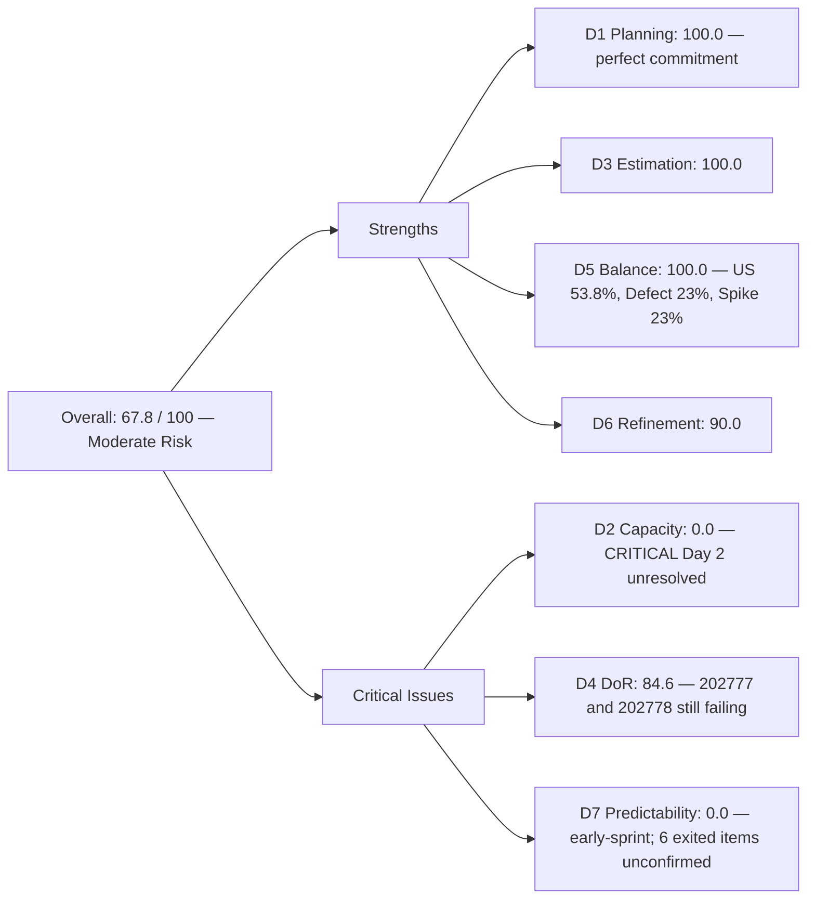
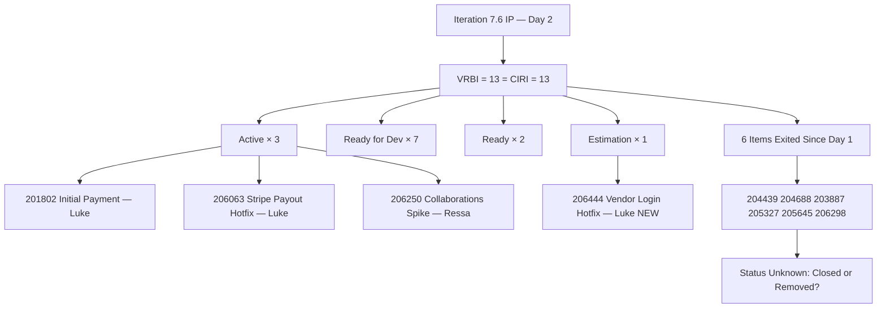
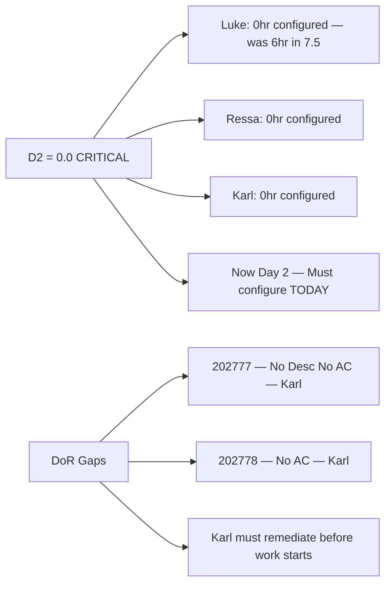

# ADO SAFe Audit — Flawless Wedding App Team

## 1. Audit Metadata

| Field | Value |
|-------|-------|
| **Audit Date** | 2026-06-16 (Tuesday) — Day 2 of 14 |
| **Timezone** | PHT (UTC+8) |
| **Iteration** | Iteration 7.6 (IP) |
| **Iteration Dates** | 2026-06-15 to 2026-06-28 |
| **Sprint Day** | Day 2 — Sprint Active |
| **ADO Project** | Flawless Wedding App |
| **ADO Project ID** | 92b967dc-5ec7-4874-b8f5-e43b00d88339 |
| **ADO Team** | Flawless Wedding App Team |
| **ADO Team ID** | 7d90ecbf-d272-4b0c-b33b-c66d96a790ac |
| **Iteration ID** | d40e499a-292f-4c95-a289-e755dde42b22 |
| **Workspace** | `ado_fl_dev` |
| **Prior Audit** | AUDIT_20260615_0200.md (Day 1 Open, Iteration 7.6 IP, 66.7 — Moderate Risk) |
| **Overall Score** | **67.8 / 100** |
| **Risk Band** | **Moderate Risk** |

---

## 2. Executive Summary

The Flawless Wedding App Team rises to **67.8 / 100 (Moderate Risk)** on Day 2 of Iteration 7.6 (IP) — a **+1.1 point improvement** from yesterday's 66.7. The improvement is driven primarily by D1 reaching 100.0: item 206063 (Stripe payout defect) has been reassigned from the PI7 root path to Iteration 7.6 (IP), resolving the exclusion that suppressed yesterday's D1 to 94.4. The VRBI and CIRI are now equal at 13 — a perfectly committed backlog.

**Critical change: significant sprint scope reduction.** Yesterday's CIRI contained 17 items (20.5 SP). Today's CIRI contains 13 items (18 SP). Six items that were in yesterday's 7.6 IP backlog are no longer visible in the Stories & Deliverables backlog: 204439 (Delayed Logout Sync), 204688 (Notification icon), 203887 (Continue button for Bride), 205327 (Budget input), 205645 (Display Navigation Header), and 206298 (Unable to Register with Email). This 4-item reduction is likely due to closures or backlog moves — but none appear in a Closed/Done state as of this audit. **These items must be accounted for.**

**A new critical hotfix arrived.** Item 206444 ([Hotfix] Vendor users unable to login — account marked as deleted) was created today (Jun 16) and is in Estimation state with SP=1. This is an interrupt-driven defect affecting vendor login — a high-impact production issue.

**Team capacity remains at 0.** The D2 = 0.0 finding from yesterday persists — no capacity has been configured in ADO for any team member (Luke, Ressa, Karl) for Iteration 7.6 IP. This is still the most critical unresolved finding.

**DoR gap partially resolved.** Item 206298 (Unable to Register with Email) is no longer in the backlog, removing one of three DoR failures from yesterday. Two items still fail DoR: 202777 (no description, no AC) and 202778 (no AC).

---

## 3. Previous Audit Delta

**Prior audit:** AUDIT_20260615_0200.md — Iteration 7.6 IP, Day 1, Score 66.7 / 100 (Moderate Risk)

| Dimension | Day 1 | Day 2 | Delta | Driver |
|-----------|-------|-------|-------|--------|
| D1 Iteration Planning | 94.4 | **100.0** | **+5.6** | 206063 reassigned from PI root to 7.6 IP; VRBI=CIRI=13 |
| D2 Team Capacity | 0.0 | **0.0** | 0.0 | Still no capacity configured for any contributor — Critical gap unresolved |
| D3 Estimation | 100.0 | **100.0** | 0.0 | 13/13 CIRI items with SP > 0 including new 206444 (SP=1) |
| D4 DoR Compliance | 82.4 | **84.6** | **+2.2** | 206298 (DoR fail) no longer in backlog; 11/13 compliant; 202777+202778 still fail |
| D5 Work Item Balance | 100.0 | **100.0** | 0.0 | US=7/13=53.8% < 60%; Defect=3; Spike=3; balance maintained |
| D6 Backlog Refinement | 90.0 | **90.0** | 0.0 | 202777+202778 still untouched (Jun 8) → 2/13=15.4% → −10 |
| D7 Delivery Predictability | 0.0 | **0.0** | 0.0 | No Closed/Done items — Day 2; early-sprint expected |
| **Overall** | **66.7** | **67.8** | **+1.1** | D1 resolves to 100; D4 marginally improves; D2 = 0 still suppresses score |

**Significant changes since Day 1:**
- **206063** (Stripe payout hotfix): Reassigned from PI7 root → **Iteration 7.6 (IP)**; state Active; changed Jun 16
- **206444** (Vendor login hotfix): **New item** created Jun 16; Defect; SP=1; state Estimation; Luke Colina
- **204439, 204688, 203887, 205327, 205645, 206298**: No longer visible in backlog API — status requires confirmation (see Evidence Gaps)
- **201802** (Initial Payment Process): Still Active (changed Jun 15)
- **206250** (Collaborations Spike): Still Active (changed Jun 15)

---

## 4. Current Iteration Snapshot

| Attribute | Value |
|-----------|-------|
| **Active Iteration** | Iteration 7.6 (IP) |
| **Sprint Duration** | 2026-06-15 to 2026-06-28 (14 days) |
| **Audit Day** | Day 2 |
| **VRBI (visible root backlog items)** | 13 |
| **CIRI (current iteration root items)** | 13 |
| **CIRI — Active** | 3 (201802, 206063, 206250) |
| **CIRI — Ready for Dev** | 7 (204944, 201839, 201803, 201817, 201836, 201804, 204755) |
| **CIRI — Ready** | 2 (202777, 202778) |
| **CIRI — Estimation** | 1 (206444) |
| **CIRI — Closed/Done** | 0 |
| **Items exited backlog since Day 1** | 6 (204439, 204688, 203887, 205327, 205645, 206298) — status unconfirmed |
| **Contributors with Current Work** | 3 (Luke Colina ×10, Ressa Paracuelles ×1, Karl Caumban ×2) |
| **Contributors with Capacity** | 0 (no capacity configured for team in 7.6 IP) |
| **Committed Story Points** | 18 |
| **Closed Story Points** | 0 (Day 2 — early-sprint) |
| **Delivery Rate** | 0.0% — early-sprint (annotated) |

---

## 5. Work Item Analysis

### CIRI — All 13 Items (Day 2)

| ID | Title | Type | State | SP | Assignee | Changed |
|----|-------|------|-------|----|----------|---------|
| 201802 | Initial Payment Process | User Story | Active | 3 | Luke Colina | 2026-06-15 |
| 204944 | Manage Booking Payments | User Story | Ready for Dev | 3 | Luke Colina | 2026-06-15 |
| 201839 | Sign Contract Digitally | User Story | Ready for Dev | 1 | Luke Colina | 2026-06-15 |
| 201803 | View All Bookings | User Story | Ready for Dev | 1 | Luke Colina | 2026-06-15 |
| 201817 | Cancel Booking | User Story | Ready for Dev | 2 | Luke Colina | 2026-06-15 |
| 201836 | View Contract | User Story | Ready for Dev | 1 | Luke Colina | 2026-06-15 |
| 201804 | Track Booking Status | User Story | Ready for Dev | 1 | Luke Colina | 2026-06-15 |
| 204755 | [Beta/Staging] [Vendor] Redirect to login on Create User | Defect | Ready for Dev | 1 | Luke Colina | 2026-06-15 |
| 206063 | [Hotfix] Vendor Unable to Receive Payouts (Stripe) | Defect | Active | 2 | Luke Colina | **2026-06-16** |
| 206444 | [Hotfix] Vendor users unable to login (deleted account) | Defect | Estimation | 1 | Luke Colina | **2026-06-16 (new)** |
| 206250 | Iteration 7.6 - Collaborations, Reports & Others | Spike | Active | 1 | Ressa Paracuelles | 2026-06-15 |
| 202777 | Flawless Wedding App End PI7 - Team Self Assessment | Spike | Ready | 0.5 | Karl Caumban | 2026-06-08 |
| 202778 | Flawless Wedding App - Customer CSAT Survey | Spike | Ready | 0.5 | Karl Caumban | 2026-06-08 |

**Type breakdown:** User Story ×7 (53.8%), Defect ×3 (23.1%), Spike ×3 (23.1%)
**Total Committed SP:** 18

> SP verification: 3+3+1+1+2+1+1+1+2+1+1+0.5+0.5 = **18 SP**

### Items Exited from Backlog Since Day 1 (Status Unconfirmed)

| ID | Title (Day 1) | Type | Day 1 SP | Possible Status |
|----|---------------|------|----------|-----------------|
| 204439 | [Beta/Staging] Delayed Logout Synchronization | Defect | 2 | Closed or moved to different backlog level |
| 204688 | [Beta/Staging] Notification icon in admin account | Defect | 0.5 | Closed or moved |
| 203887 | [Android][Vendor] "Continue" button for Bride appears | Defect | 0.5 | Closed or moved |
| 205327 | [Web][Bride] Budget input allows non-numeric characters | Defect | 0.5 | Closed or moved |
| 205645 | Display Bride/Non-Event Navigation and Header | User Story | 1 | Closed or moved |
| 206298 | [Vendor] Unable to Register with Existing Email | Defect | 1 | Closed, moved, or removed |

**Note:** If all 6 items were closed in ADO, this represents 5.5 SP of delivery on Day 1–2, which would significantly change the D7 calculation. However, the backlog API no longer returns these items, and their current state cannot be confirmed from this call alone. They are excluded from CIRI and SP calculations until state is confirmed. See Section 10 (Evidence Gaps).

### DoR Assessment (CIRI — 13 items)

| ID | Title | Desc ≥ 30 | AC ≥ 20 | Compliant |
|----|-------|-----------|---------|-----------|
| 201802 | Initial Payment Process | Yes | Yes (AC1–AC11) | **Yes** |
| 204944 | Manage Booking Payments | Yes | Yes (AC1–AC4) | **Yes** |
| 201839 | Sign Contract Digitally | Yes | Yes | **Yes** |
| 201803 | View All Bookings | Yes | Yes (Given/When/Then) | **Yes** |
| 201817 | Cancel Booking | Yes | Yes (8 scenarios) | **Yes** |
| 201836 | View Contract | Yes | Yes | **Yes** |
| 201804 | Track Booking Status | Yes | Yes | **Yes** |
| 204755 | Redirect to login on Create User | Yes | Yes | **Yes** |
| 206063 | Stripe payout hotfix | Yes (vendor info + steps) | Yes (payout success criteria) | **Yes** |
| 206444 | Vendor login hotfix | Yes (account deleted scenario) | Yes (login success criteria) | **Yes** |
| 206250 | Collaborations Spike | Yes | Yes (ceremonies listed) | **Yes** |
| 202777 | Team Self Assessment | **No (null)** | **No (null)** | **FAIL** |
| 202778 | Customer CSAT Survey | Yes (~35 chars) | **No (null)** | **FAIL** |

**DoR: 11/13 = 84.6%** — marginal improvement from Day 1 (82.4%) due to 206298 exiting backlog

---

## 6. SAFe Compliance Scorecard

| Dimension | Score | Evidence | Notes |
|-----------|-------|----------|-------|
| D1 Iteration Planning | 100.0 | 13 CIRI / 13 VRBI × 100 | Perfect commitment: 206063 moved from PI root → 7.6 IP |
| D2 Team Capacity | 0.0 | 0/3 contributors with capacity | **CRITICAL: No capacity configured for any contributor in 7.6 IP — Day 2 unresolved** |
| D3 Estimation | 100.0 | 13/13 CIRI estimated (SP > 0) | 206444 (new hotfix) has SP=1 set; all items estimated |
| D4 DoR Compliance | 84.6 | 11/13 CIRI meet desc + AC | 202777 (no desc, no AC), 202778 (no AC) still non-compliant |
| D5 Work Item Balance | 100.0 | US=7/13=53.8% < 60%; Defect=3; Spike=3 | Third consecutive D5 = 100; healthy type distribution |
| D6 Backlog Refinement | 90.0 | 13/13 VRBI fresh; 202777+202778 untouched (Jun 8) → 2/13=15.4% → −10 | Same penalty as Day 1; Karl's Spikes still untouched |
| D7 Delivery Predictability | 0.0 | 0/18 SP closed — Day 2 (early-sprint) | **Early-sprint — low delivery expected**; 3 items Active; 6 items exited backlog unconfirmed |
| **Overall** | **67.8** | (100+0+100+84.6+100+90+0)/7 | **Moderate Risk** |

---

## 7. Dimension Findings

### D1 — Iteration Planning: 100.0

```
visible_root_backlog_items (VRBI) = 13
  - All 13 items have IterationPath = "Flawless Wedding App\2026-PI7\Iteration 7.6 (IP)"
  - 206063: Reassigned from PI7 root to 7.6 IP (changed 2026-06-16)
  - 206444: New item created 2026-06-16, assigned to 7.6 IP

current_iteration_root_items (CIRI) = 13

Score = round(13 / 13 * 100, 1) = 100.0
```

D1 achieves 100.0 for the first time this PI for the Flawless Wedding App Team. Two changes drove this: (1) 206063 was correctly assigned to the current iteration (resolving yesterday's PI-root exclusion), and (2) new hotfix 206444 was created directly into the 7.6 IP path. The backlog is now perfectly focused on the current iteration — every visible item has iteration commitment.

**Caution:** The VRBI decreased from 18 (Day 1) to 13 (Day 2) due to 6 items exiting the backlog. While this maintains the D1 = 100.0, it also masks whether those 6 items were truly completed (positive signal) or removed from scope without being closed (hygiene risk).

### D2 — Team Capacity: 0.0

```
contributors_with_current_work = 3
  [Luke: 10 items, Ressa: 1 item, Karl: 2 items]
contributors_with_capacity = 0
  [work_get_iteration_capacities for team 7d90ecbf returned:
   teamCapacityPerDay = 0, teamTotalDaysOff = 0]

Score = round(0 / 3 * 100, 1) = 0.0
```

**This is the second consecutive day with D2 = 0.0.** The ADO capacity for Iteration 7.6 (IP) remains unconfigured for all three contributors. Yesterday's audit flagged this as Critical. It remains unresolved on Day 2. If not corrected by Day 3, it will suppress the overall score for the remainder of the sprint. The team lead should configure capacity for Luke, Ressa, and Karl in ADO today.

In Iteration 7.5, Luke was recorded at 6hr/day. Using this baseline: the team is operating 3 contributors with likely combined ~7–8 hr/day (Luke 6, Ressa 1, Karl 1) but with zero capacity recorded — a complete misrepresentation of sprint planning data.

### D3 — Estimation: 100.0

```
point_eligible_current_items = 13
estimated_current_items = 13
  [all SP > 0; range 0.5–3]
  New: 206444 = SP=1

Score = round(13 / 13 * 100, 1) = 100.0
```

All items carry story points including the newly created 206444 hotfix (SP=1). The fractional SP values (0.5 each for 202777, 202778) continue from prior sprints. Estimation discipline is consistent.

### D4 — DoR Compliance: 84.6

```
dor_compliant_current_items = 11
current_iteration_root_items = 13

Score = round(11 / 13 * 100, 1) = 84.6
```

**Improvement from Day 1 (82.4 → 84.6)** due to 206298 (the DoR-failing defect) no longer appearing in the backlog. The two remaining DoR failures are:

**202777 (Team Self Assessment — Karl Caumban):**
- Description: null — no content at all
- Acceptance Criteria: null — no content at all
- Action: Karl must add a description of the assessment activity and acceptance criteria defining what "assessment complete" means

**202778 (Customer CSAT Survey — Karl Caumban):**
- Description: "Send CSAT Survey to Joe and Shannon" (~35 chars) — marginally passes
- Acceptance Criteria: null — no content at all
- Action: Karl must add acceptance criteria (e.g., survey sent confirmation, response rate documentation)

Both items have been in Ready state since June 8 (8 days) without DoR remediation. If these items are intended to be worked during the IP sprint, Karl should resolve them today before starting any execution.

**New items 206063 and 206444 both pass DoR:**
- 206063 has a clear description (vendor name, business, contact) and AC (payout success + status update)
- 206444 has a clear scenario description and AC (login success with clean deletion logic)

### D5 — Work Item Balance: 100.0

```
Start: 100
User Story items in CIRI: 7 (present) → no absence penalty (−40 not applied)
dominant_type_share: User Story = 7/13 = 53.8% < 60% → no penalty
spike_share: 3/13 = 23.1% < 40% → no penalty

Score = max(0, 100 − 0) = 100.0
```

D5 = 100.0 for the third consecutive audit (Day 14 of 7.5, Day 1 of 7.6, Day 2 of 7.6). The team's natural blend of User Stories (booking flows), Defects (hotfixes + staging bugs), and Spikes (IP ceremonies) produces an excellent type distribution without needing artificial rebalancing. The addition of two new Defects (206063, 206444) slightly shifts the balance toward more defect weight, but all ratios remain well within scoring thresholds.

**Trend observation:** The 3 Active Defects (206063 Stripe payout + 206444 vendor login + 204755 vendor create redirect) signal the team is in a reactive bug-fix cycle alongside planned development. This is expected for a beta-stage product approaching Go Live but should be monitored to ensure reactive work does not crowd out planned User Story delivery.

### D6 — Backlog Refinement: 90.0

```
visible_root_backlog_items (VRBI) = 13
fresh_visible_root_items (ChangedDate ≥ 2026-05-02) = 13
  [all items changed May–June 2026; new items 206063 and 206444 changed Jun 16]
stale_90_visible_root_items (ChangedDate < 2026-03-18) = 0
stale_180_visible_root_items (ChangedDate < 2025-12-19) = 0

untouched_current_items (ChangedDate < 2026-06-15 sprint start):
  - 202777: 2026-06-08 → untouched (8 days before sprint start)
  - 202778: 2026-06-08 → untouched (8 days before sprint start)
  All others: changed 2026-06-15 or 2026-06-16

untouched_count = 2/13 = 15.4% → > 10% but < 30% → −10

base = round(13/13 * 100, 1) = 100.0
Penalty: −10 (untouched 10–30%)
Score = max(0, 100.0 − 10) = 90.0
```

D6 score is unchanged at 90.0. The untouched penalty is driven entirely by Karl's two Spikes (202777, 202778), which have not been touched since June 8 and still lack DoR content. Resolving their DoR gaps would result in these items receiving new ChangedDates, clearing the untouched flag and potentially raising D6 to 100.0 (if both items are updated within the sprint start window).

### D7 — Delivery Predictability: 0.0 (early-sprint)

```
committed_story_points = 18  [13 CIRI items; SP range 0.5–3]
  201802(3)+204944(3)+201839(1)+201803(1)+201817(2)+201836(1)+201804(1)+
  204755(1)+206063(2)+206444(1)+206250(1)+202777(0.5)+202778(0.5) = 18

closed_story_points = 0  [no items in Closed or Done state]

Score = round(0 / 18 * 100, 1) = 0.0

ANNOTATION: Early-sprint — low delivery expected (Day 2 of 14)
```

D7 = 0.0 is expected on Day 2. However, the most significant D7 variable today is the **6 items that disappeared from the backlog** (204439, 204688, 203887, 205327, 205645, 206298 = 5.5 SP). If these were closed, the actual delivered SP would be 5.5 out of an original 20.5 SP commitment — a strong Day 1 delivery rate of 26.8%. This cannot be confirmed from the current API call but would be a very positive signal. **This must be verified.**

Required velocity on confirmed load: 18 SP over 12 remaining days = 1.5 SP/day. Luke's demonstrated 7.5 rate (~1.3 SP/day). Achievable but tight, particularly given the two hotfixes (206063, 206444) adding reactive interrupt load.

---

## 8. Score Breakdown







---

## 9. Risks and Bottlenecks

| # | Risk | Severity | Status |
|---|------|----------|--------|
| 1 | D2 = 0.0: No capacity configured — Day 2 (second consecutive day unresolved) | **Critical** | Must be set in ADO today for Luke, Ressa, and Karl; every day unresolved artificially suppresses score |
| 2 | 6 items exited backlog with unconfirmed status (204439, 204688, 203887, 205327, 205645, 206298 = 5.5 SP) | **Critical** | These may be closed (positive) or removed from scope (risk); requires immediate verification from Luke/PO |
| 3 | 202777 + 202778 (Karl): DoR failures persist — Day 2 unresolved | **High** | Karl's Spikes remain without AC; items are in Ready state and cannot be executed without DoR |
| 4 | Two hotfixes in flight (206063 Stripe payout + 206444 vendor login) — both Active or Estimation | **High** | Interrupt-driven work on top of 7.6 IP planned items; Luke carries both hotfixes plus 8 planned items |
| 5 | Luke carries 10 of 13 CIRI items (76.9%) | **High** | Extreme concentration; Ressa has 1 Spike, Karl has 2 Spikes; core delivery on one developer |
| 6 | 206444 in Estimation state — SP not finalized | Moderate | SP=1 appears appropriate for the scope; should be confirmed and moved to Ready for Dev before Day 3 |
| 7 | D4 = 84.6 — 2 items still non-compliant | Moderate | Both Karl's items; if he starts 202777 or 202778 without AC, Done criteria cannot be verified |
| 8 | 201802 (Initial Payment — 3 SP, complex AC1–AC11) Active — high complexity item | Moderate | Largest business-logic item in sprint; Luke must ensure all 11 AC scenarios are covered in implementation |

---

## 10. Prioritized Recommendations

1. **[Critical] Configure capacity for Luke, Ressa, and Karl in ADO today — Day 2.** Use Luke's 7.5 baseline of 6hr/day. Ressa and Karl should be configured based on their actual IP sprint availability. D2 = 0.0 will continue to suppress the overall score until this is done. At current score (67.8), configuring capacity would immediately raise D2 from 0 to 100, pushing overall to 81.1 (Low Risk).
2. **[Critical] Confirm status of 6 exited backlog items.** Verify with Luke Colina and Ramon (PO) what happened to 204439, 204688, 203887, 205327, 205645, and 206298. If closed: confirm in ADO and update D7 calculation (5.5 SP delivered = strong Day 1 performance). If removed or deferred: document the rationale and update the sprint commitment accordingly.
3. **[Critical] Karl: Remediate 202777 and 202778 DoR gaps immediately.** Add a substantive description to 202777 (Team Self Assessment) and acceptance criteria to both items. These Spikes are PI7 IP ceremony deliverables — they must have clear done-criteria before the IP sprint ceremonies proceed.
4. **[High] Prioritize 206063 (Stripe payout) resolution.** The Stripe payout defect affects vendor Gabriel Preciado (Island Escape Weddings) — a real vendor with real business impact. This has been in the backlog since before Day 1. Luke should target closure of 206063 by Day 5 (June 19).
5. **[High] Estimate and activate 206444 (vendor login hotfix) by Day 3.** The vendor login defect is a production-blocking issue. SP=1 is reasonable. Move from Estimation to Active today; target closure by Day 3–4.
6. **[Moderate] Review Luke's workload.** Luke carries 10 of 13 CIRI items including 2 hotfixes. Consider whether any of the smaller Ready for Dev User Stories (201803, 201804, 201836 — all SP=1) can be reassigned to Ressa to redistribute delivery risk. Even one reassignment reduces Luke's concentration from 76.9% to 69.2%.
7. **[Moderate] Set a Day 5 mid-sprint checkpoint.** With the exited items unconfirmed, two hotfixes in flight, and capacity still at 0, a Day 5 audit on June 19 is recommended to assess velocity, confirm first closures, and re-evaluate D7.

---

## 11. Evidence Gaps and Limitations

| Gap | Impact | Notes |
|-----|--------|-------|
| **6 items exited backlog — status unknown** | **High** — may represent 5.5 SP of actual delivery unscored in D7, or scope reduction risk | 204439, 204688, 203887, 205327, 205645, 206298 no longer in backlog API; cannot confirm Closed vs. removed without direct ADO query by item ID |
| D2 = 0.0 — real finding, not artifact | Score suppressed; actual team is working (Luke, Ressa, Karl all have active items) | API confirms 0hr/day capacity; must be corrected in ADO |
| D7 = 0.0 on Day 2 | Expected early-sprint zero; may be obscuring actual delivery if 6 exited items were closed | Re-evaluate once exited items are confirmed |
| 202777 + 202778: no DoR content | Spikes cannot be executed or accepted without description and AC | Karl must remediate; unresolved from Day 1 |
| Carry-forward Enablers 202747 + 205105 (Iteration 7.5 path) | Not visible in current backlog API; 3 SP of unresolved Iteration 7.5 work | Still require IterationPath reassignment to 7.6 IP or explicit closure; not scored in CIRI |
| 206444 in Estimation state | SP=1 may not be finalized | Item created today; move to Active once SP confirmed |
| Karl Caumban velocity baseline | No historical delivery data for Karl; only 2 Spike items (total 1 SP) | Monitor 202777 and 202778 delivery by Day 7 |
