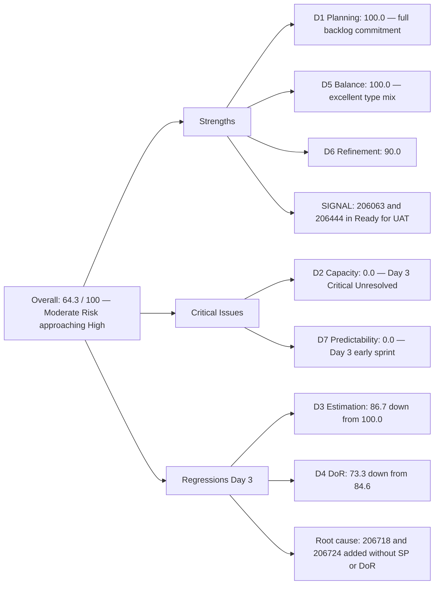
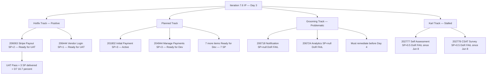
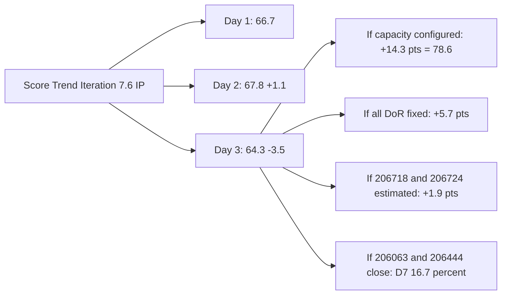

# ADO SAFe Audit — Flawless Wedding App Team

## 1. Audit Metadata

| Field | Value |
|-------|-------|
| **Audit Date** | 2026-06-17 (Wednesday) — Day 3 of 14 |
| **Timezone** | PHT (UTC+8) |
| **Iteration** | Iteration 7.6 (IP) |
| **Iteration Dates** | 2026-06-15 to 2026-06-28 |
| **Sprint Day** | Day 3 — Sprint Active |
| **ADO Project** | Flawless Wedding App |
| **ADO Project ID** | 92b967dc-5ec7-4874-b8f5-e43b00d88339 |
| **ADO Team** | Flawless Wedding App Team |
| **ADO Team ID** | 7d90ecbf-d272-4b0c-b33b-c66d96a790ac |
| **Iteration ID** | d40e499a-292f-4c95-a289-e755dde42b22 |
| **Workspace** | `ado_fl_dev` |
| **Prior Audit** | AUDIT_20260616_0205.md (Day 2, Iteration 7.6 IP, 67.8 — Moderate Risk) |
| **Overall Score** | **64.3 / 100** |
| **Risk Band** | **Moderate Risk (approaching High)** |

---

## 2. Executive Summary

The Flawless Wedding App Team **drops to 64.3 / 100 (Moderate Risk, approaching High)** on Day 3 of Iteration 7.6 (IP) — a **−3.5 point decline** from yesterday's score of 67.8. The decline is driven by two unestimated, non-DoR-compliant items (206718 and 206724) added to the iteration in Grooming state, which expand the denominator for D3 and D4 without contributing compliant evidence.

**Positive signals:** Two hotfixes reached "Ready for UAT" today — 206063 (Stripe payout) and 206444 (Vendor login) both transitioned to Ready for UAT state, with ChangedDates of 2026-06-17. This is the first meaningful delivery signal of the sprint: Luke Colina is executing on the highest-priority production defects. If these pass UAT and close, D7 will begin to register.

**New items added in Grooming (206718, 206724):** Two items were added to the 7.6 IP iteration today — 206718 (Notification to bride about tip and review) and 206724 (Analytics — Total Traffic on website). Both are in Grooming state and carry no story points and no DoR content. These items expand scope mid-sprint without being fully ready, compressing the IP sprint's available capacity for planned work.

**Critical gap persists: D2 = 0.0.** Team capacity remains unconfigured in ADO for all contributors (Luke, Ressa, Karl, Jaszmine, Luzmibel). This is Day 3 of the sprint — three consecutive days without capacity data. Every day this remains unfixed suppresses the overall score and misrepresents actual sprint planning.

---

## 3. Previous Audit Delta

**Prior audit:** AUDIT_20260616_0205.md — Iteration 7.6 IP, Day 2, Score 67.8 / 100 (Moderate Risk)

| Dimension | Day 2 | Day 3 | Delta | Driver |
|-----------|-------|-------|-------|--------|
| D1 Iteration Planning | 100.0 | **100.0** | 0.0 | VRBI=CIRI=15; 2 new items added directly to 7.6 IP |
| D2 Team Capacity | 0.0 | **0.0** | 0.0 | Still no capacity configured — Day 3 unresolved; CRITICAL |
| D3 Estimation | 100.0 | **86.7** | **−13.3** | 206718 + 206724 added with SP=null; 13/15 estimated |
| D4 DoR Compliance | 84.6 | **73.3** | **−11.3** | 206718 + 206724 both fail DoR (no desc, no AC); 11/15 compliant |
| D5 Work Item Balance | 100.0 | **100.0** | 0.0 | US=8/15=53.3% < 60%; Defect=3, Spike=3, Enabler=1 |
| D6 Backlog Refinement | 90.0 | **90.0** | 0.0 | 202777+202778 still untouched (Jun 8) = 2/15 = 13.3% → −10 |
| D7 Delivery Predictability | 0.0 | **0.0** | 0.0 | No Closed/Done items; 206063+206444 now in Ready for UAT — closures imminent |
| **Overall** | **67.8** | **64.3** | **−3.5** | D3 and D4 both decline due to unvetted Grooming items entering CIRI |

**Significant changes since Day 2:**
- **206718** (Notification to bride about tip and review, User Story): Added to 7.6 IP, Grooming state, SP=null, Ressa Paracuelles. Changed 2026-06-17.
- **206724** (Analytics — Total Traffic and Number Visits on website, Enabler): Added to 7.6 IP, Grooming state, SP=null, Luke Colina. Changed 2026-06-17.
- **206063** (Stripe payout hotfix): State transitioned from Active → **Ready for UAT** (2026-06-17). Ready for production testing.
- **206444** (Vendor login hotfix): State transitioned from Estimation → **Ready for UAT** (2026-06-17). Resolved by Luke within 24 hours of creation.
- **206250** (Collaborations Spike — Ressa): Remains Active (2026-06-15); no new state change.
- **201802** (Initial Payment Process — Luke): Remains Active (2026-06-15).

---

## 4. Current Iteration Snapshot

| Attribute | Value |
|-----------|-------|
| **Active Iteration** | Iteration 7.6 (IP) |
| **Sprint Duration** | 2026-06-15 to 2026-06-28 (14 days) |
| **Audit Day** | Day 3 |
| **VRBI (visible root backlog items)** | 15 |
| **CIRI (current iteration root items)** | 15 |
| **CIRI — Active** | 2 (201802, 206250) |
| **CIRI — Ready for UAT** | 2 (206063, 206444) |
| **CIRI — Ready for Dev** | 7 (204944, 201839, 201803, 201817, 201836, 201804, 204755) |
| **CIRI — Ready** | 2 (202777, 202778) |
| **CIRI — Grooming** | 2 (206718, 206724) |
| **CIRI — Closed/Done** | 0 |
| **Contributors with Current Work** | 4 (Luke ×11, Ressa ×2, Karl ×2, Jaszmine 0 active, Luzmibel 0 active) |
| **Contributors with Capacity** | 0 (no capacity configured in ADO) |
| **Committed Story Points (estimated items only)** | 18 |
| **Closed Story Points** | 0 |
| **Delivery Rate** | 0.0% — early-sprint (Day 3 of 14, annotated) |

---

## 5. Work Item Analysis

### CIRI — All 15 Items (Day 3)

| ID | Title | Type | State | SP | Assignee | Changed |
|----|-------|------|-------|----|----------|---------|
| 201802 | Initial Payment Process | User Story | Active | 3 | Luke Colina | 2026-06-15 |
| 204944 | Manage Booking Payments | User Story | Ready for Dev | 3 | Luke Colina | 2026-06-15 |
| 201839 | Sign Contract Digitally | User Story | Ready for Dev | 1 | Luke Colina | 2026-06-15 |
| 201803 | View All Bookings | User Story | Ready for Dev | 1 | Luke Colina | 2026-06-15 |
| 201817 | Cancel Booking | User Story | Ready for Dev | 2 | Luke Colina | 2026-06-15 |
| 201836 | View Contract | User Story | Ready for Dev | 1 | Luke Colina | 2026-06-15 |
| 201804 | Track Booking Status | User Story | Ready for Dev | 1 | Luke Colina | 2026-06-15 |
| 204755 | [Beta/Staging] [Vendor] Redirect to login on Create User | Defect | Ready for Dev | 1 | Luke Colina | 2026-06-15 |
| 206063 | [Hotfix] Vendor Unable to Receive Payouts (Stripe) | Defect | **Ready for UAT** | 2 | Luke Colina | **2026-06-17** |
| 206444 | [Hotfix] Vendor users unable to login (deleted account) | Defect | **Ready for UAT** | 1 | Luke Colina | **2026-06-17** |
| 206250 | Iteration 7.6 - Collaborations, Reports & Others | Spike | Active | 1 | Ressa Paracuelles | 2026-06-15 |
| 202777 | Flawless Wedding App End PI7 - Team Self Assessment | Spike | Ready | 0.5 | Karl Caumban | 2026-06-08 |
| 202778 | Flawless Wedding App - Customer CSAT Survey | Spike | Ready | 0.5 | Karl Caumban | 2026-06-08 |
| 206718 | 2 days after the event — Notification to bride about tip and review | User Story | **Grooming** | null | Ressa Paracuelles | **2026-06-17 (new)** |
| 206724 | Analytics — Total Traffic and Number Visits on website | Enabler | **Grooming** | null | Luke Colina | **2026-06-17 (new)** |

**Type breakdown:** User Story ×8 (53.3%), Defect ×3 (20.0%), Spike ×3 (20.0%), Enabler ×1 (6.7%)
**Estimated committed SP:** 18 (206718 and 206724 excluded from SP sum — null/0)
> SP: 3+3+1+1+2+1+1+1+2+1+1+0.5+0.5 = **18 SP** (same as Day 2)

### Hotfix Delivery Signal (Day 3 Positive)

206063 and 206444 transitioning to Ready for UAT within 24–48 hours of Active/Estimation state is a strong productivity signal:
- **206444** (Vendor login hotfix, SP=1): Created Jun 16 in Estimation state → Ready for UAT by Jun 17 — **resolved in under 24 hours.** Exceptional response time on a production-blocking issue.
- **206063** (Stripe payout hotfix, SP=2): In Active state from Jun 16 → Ready for UAT by Jun 17 — **resolved in under 24 hours.** Real vendor (Gabriel Preciado / Island Escape Weddings) will benefit immediately.

If these two items pass UAT and close, D7 = 3/18 = 16.7% — a meaningful early-sprint delivery rate.

### New Items in Grooming — DoR and Estimation Gap

| ID | Title | Type | SP | DoR Status | Issue |
|----|-------|------|----|------------|-------|
| 206718 | Notification to bride about tip and review | User Story | null | **FAIL** | No description, no AC — cannot be worked |
| 206724 | Analytics — Total Traffic and visits | Enabler | null | **FAIL** | No description, no AC — cannot be worked |

These items should not enter the CIRI until they are at minimum Ready for Dev with story points and DoR content. Their premature addition to the 7.6 IP path degrades D3 and D4 without contributing committed sprint value.

### DoR Assessment (CIRI — 15 items)

| ID | Title | Desc ≥ 30 | AC ≥ 20 | Compliant |
|----|-------|-----------|---------|-----------|
| 201802 | Initial Payment Process | Yes | Yes (AC1–AC11) | **Yes** |
| 204944 | Manage Booking Payments | Yes | Yes (AC1–AC4) | **Yes** |
| 201839 | Sign Contract Digitally | Yes | Yes | **Yes** |
| 201803 | View All Bookings | Yes | Yes | **Yes** |
| 201817 | Cancel Booking | Yes | Yes (8 scenarios) | **Yes** |
| 201836 | View Contract | Yes | Yes | **Yes** |
| 201804 | Track Booking Status | Yes | Yes | **Yes** |
| 204755 | Redirect to login on Create User | Yes | Yes | **Yes** |
| 206063 | Stripe payout hotfix | Yes | Yes | **Yes** |
| 206444 | Vendor login hotfix | Yes | Yes | **Yes** |
| 206250 | Collaborations Spike | Yes | Yes | **Yes** |
| 202777 | Team Self Assessment | **No (null)** | **No (null)** | **FAIL** |
| 202778 | Customer CSAT Survey | Yes (~35 chars) | **No (null)** | **FAIL** |
| 206718 | Notification to bride (tip/review) | **No (null)** | **No (null)** | **FAIL** |
| 206724 | Analytics — Total Traffic | **No (null)** | **No (null)** | **FAIL** |

**DoR: 11/15 = 73.3%** — regression from Day 2 (84.6%) due to 2 Grooming items added without DoR content.

---

## 6. SAFe Compliance Scorecard

| Dimension | Score | Evidence | Notes |
|-----------|-------|----------|-------|
| D1 Iteration Planning | 100.0 | 15 CIRI / 15 VRBI × 100 | VRBI expanded from 13→15 with 2 new Grooming items; all still in current iteration |
| D2 Team Capacity | 0.0 | 0/4 contributors with capacity | **CRITICAL Day 3: No capacity configured — all 5 registered team members show 0hr/day** |
| D3 Estimation | 86.7 | 13/15 estimated; 206718+206724 have SP=null | Regression from 100.0 (Day 2); new Grooming items must be estimated before Day 4 |
| D4 DoR Compliance | 73.3 | 11/15 CIRI meet desc + AC | **Regression from 84.6 (Day 2);** 4 items fail: 202777, 202778, 206718, 206724 |
| D5 Work Item Balance | 100.0 | US=8/15=53.3% < 60%; Defect=3, Spike=3, Enabler=1 | Excellent type distribution maintained |
| D6 Backlog Refinement | 90.0 | 15/15 VRBI fresh; 202777+202778 untouched (Jun 8) = 2/15 = 13.3% → −10 | New items (206718, 206724) changed Jun 17 = fresh; penalty unchanged |
| D7 Delivery Predictability | 0.0 | 0/18 SP closed — Day 3 (early-sprint) | **Early-sprint — low delivery expected**; 206063+206444 in Ready for UAT — closures imminent |
| **Overall** | **64.3** | (100+0+86.7+73.3+100+90+0)/7 | **Moderate Risk (approaching High)** |

---

## 7. Dimension Findings

### D1 — Iteration Planning: 100.0

```
visible_root_backlog_items (VRBI) = 15
  [All 15 items have IterationPath = "Flawless Wedding App\2026-PI7\Iteration 7.6 (IP)"]
  Day 2: VRBI=13; Day 3: +206718 and +206724 = 15

current_iteration_root_items (CIRI) = 15

Score = round(15 / 15 × 100, 1) = 100.0
```

D1 maintains 100.0 as both new items (206718, 206724) were assigned directly to the 7.6 IP iteration path. However, the backlog expansion from 13 to 15 items mid-sprint without corresponding capacity review is a planning discipline risk. IP sprints are intended for ceremonies, retrospectives, and innovation activities — adding fresh development stories and enablers mid-sprint adds to an already full load.

### D2 — Team Capacity: 0.0

```
contributors_with_current_work = 4
  [Luke: 11 CIRI items (including new 206724), Ressa: 2 (206250, 206718), Karl: 2 (202777, 202778)]
contributors_with_capacity = 0
  [work_get_team_capacity for team 7d90ecbf returned: all 5 members at 0hr/day
   Ressa Paracuelles: Testing 0hr/day
   Jaszmeine Abigaille Villanueva: Design 0hr/day
   Luzmibel Paculanang: Testing 0hr/day
   Luke Abram Colina: Development 0hr/day]

Score = round(0 / 4 × 100, 1) = 0.0
```

**Day 3: Third consecutive audit with D2 = 0.0.** This is no longer an oversight — it is a persistent compliance gap. Every sprint day without configured capacity:
1. Artificially suppresses the overall score by ~14.3 points (1/7 dimensions zeroed)
2. Makes capacity-based sprint planning invisible in ADO
3. Misrepresents the team's actual sprint capacity to any portfolio-level viewer

Luke Abram Colina's established baseline from Iteration 7.5 is 6hr/day Development. Ressa and Karl's baselines should be configured based on their actual IP sprint availability. Configuring capacity today would immediately raise D2 to 100.0 and push the overall score from 64.3 to 78.6 (Moderate, same band as Finance Team).

### D3 — Estimation: 86.7

```
point_eligible_current_items = 15  [all work item types expose Story Points]
estimated_current_items = 13  [SP > 0]
  Unestimated: 206718 (SP=null) and 206724 (SP=null) — both in Grooming

Score = round(13 / 15 × 100, 1) = 86.7
```

D3 regresses from 100.0 (Day 2) to 86.7 due to two Grooming items added without SP values. This is addressable today: if Ressa estimates 206718 and Luke estimates 206724 and assigns story points, D3 returns to 100.0. Grooming sessions are meant to establish SP as a prerequisite to Ready for Dev assignment.

### D4 — DoR Compliance: 73.3

```
dor_compliant_current_items = 11
current_iteration_root_items = 15

Score = round(11 / 15 × 100, 1) = 73.3
```

D4 drops significantly from 84.6 (Day 2) to 73.3 — the lowest DoR score this sprint. Four items fail:

**202777 (Karl — Team Self Assessment):** Description = null, AC = null. Day 9 without remediation since sprint entry. Karl must add meaningful description and AC before this can be executed or accepted.

**202778 (Karl — Customer CSAT Survey):** Description = "Send CSAT Survey to Joe and Shannon" (~35 chars, marginally passes), AC = null. Karl must add AC (e.g., "Survey delivered to Joe and Shannon; confirmation received; summary of responses documented").

**206718 (Ressa — Notification to bride about tip and review):** Description = null, AC = null. New today. This item must not be worked until DoR is met.

**206724 (Luke — Analytics — Total Traffic):** Description = null, AC = null. New today. This item must not be worked until DoR is met.

The DoR failure pattern is broadening: Day 1 had 3 failures (including 206298 which exited), Day 2 had 2 failures, Day 3 now has 4 failures. This is a regression that must be stopped.

### D5 — Work Item Balance: 100.0

```
Start: 100
User Story items in CIRI: 8 (present) → no −40 absence penalty
dominant_type_share: User Story = 8/15 = 53.3% < 60% → no penalty
spike_share: 3/15 = 20.0% < 40% → no penalty

Score = max(0, 100 − 0) = 100.0
```

D5 = 100.0 maintained across all audits this sprint. The addition of 206718 (User Story) and 206724 (Enabler) slightly shifts the type distribution but keeps US below the 60% threshold. The team's natural mix of booking flows (US), production defects (Defect), IP ceremonies (Spike), and analytics enablers (Enabler) produces best-in-class balance.

### D6 — Backlog Refinement: 90.0

```
visible_root_backlog_items (VRBI) = 15
fresh_visible_root_items (ChangedDate ≥ 2026-05-03) = 15
  [all items changed May–June 2026; new items (206718, 206444 updated) = Jun 17]
stale_90_visible_root_items (ChangedDate < 2026-03-19) = 0
stale_180_visible_root_items (ChangedDate < 2025-12-20) = 0

untouched_current_items (ChangedDate < 2026-06-15 sprint start):
  - 202777: 2026-06-08 → untouched
  - 202778: 2026-06-08 → untouched
  All others: 2026-06-15 or later

untouched_count = 2/15 = 13.3% → > 10% but < 30% → −10

base = round(15/15 × 100, 1) = 100.0
Penalty: −10
Score = max(0, 100.0 − 10) = 90.0
```

D6 = 90.0 is unchanged. The untouched penalty is entirely driven by Karl's two Spike items. Resolving their DoR gaps (adding description and AC) would update their ChangedDates, dropping untouched count to 0 and removing the −10 penalty → D6 = 100.0. This is directly actionable today.

### D7 — Delivery Predictability: 0.0 (early-sprint)

```
committed_story_points = 18  [13 estimated items with SP > 0]
closed_story_points = 0  [no items in Closed or Done state]

Score = round(0 / 18 × 100, 1) = 0.0

ANNOTATION: Early-sprint — low delivery expected (Day 3 of 14)
```

D7 = 0.0 but the delivery trajectory is positive. 206063 and 206444 are in Ready for UAT — one successful UAT round closes 3 SP (2+1). If these close today or tomorrow, D7 rises to 16.7%.

**Required velocity:** 18 SP over 11 remaining days after today = 1.64 SP/day. Luke's demonstrated rate from Iteration 7.5 was approximately 1.3 SP/day. This sprint is achievable but tight, especially with Luke carrying 11 of 15 CIRI items including two new Grooming items that are not yet estimated.

---

## 8. Score Breakdown and Trend







---

## 9. Risks and Bottlenecks

| # | Risk | Severity | Status |
|---|------|----------|--------|
| 1 | D2 = 0.0: No capacity configured — Day 3 third consecutive day | **Critical** | Must configure Luke, Ressa, Karl in ADO today; 14.3-point suppression on overall score |
| 2 | D4 regression to 73.3: 4 items fail DoR — worst DoR score this sprint | **High** | 202777, 202778 (Karl, 9+ days unresolved) + 206718, 206724 (Ressa/Luke, added today without DoR) |
| 3 | D3 regression to 86.7: 206718 + 206724 added without story points | **High** | SP=null blocks these items from D3 and prevents meaningful sprint planning |
| 4 | Luke carries 11 of 15 CIRI items (73.3%) including 2 unestimated Grooming items | **High** | Extreme concentration continues; 206724 adds to Luke's already-heavy load |
| 5 | 206718 + 206724 added to sprint without DoR or estimates | **High** | Mid-sprint scope expansion in IP sprint (intended for ceremonies, not new features) without capacity review |
| 6 | Karl's items (202777, 202778): 9 days without DoR remediation | **High** | IP sprint ceremonies (self-assessment, CSAT survey) cannot be formally completed without AC; Karl's contribution unverifiable |
| 7 | 206063 + 206444 in Ready for UAT — UAT not yet confirmed | Moderate | Positive signal; but Ready for UAT ≠ Closed; UAT lead must execute today |
| 8 | 201802 (Initial Payment, SP=3, 11 AC scenarios) still Active from Day 1 | Moderate | Highest-complexity item in sprint; approaching Day 3 in Active without state change — assess if blocked |
| 9 | Score approaching High Risk threshold (current: 64.3; threshold: 60.0) | Moderate | If 206718 and 206724 remain unestimated and Karl does not fix DoR, score could slip to ~60 |

---

## 10. Prioritized Recommendations

1. **[Critical] Configure capacity for all contributors in ADO today — Day 3.** Use Luke's Iteration 7.5 baseline (6hr/day Development). Configure Ressa and Karl based on actual IP sprint availability (recommended: 2–4hr/day for IP ceremonies). This single action raises D2 from 0 to 100 and pushes overall score from 64.3 to 78.6, returning to Moderate Risk comfortably above the High threshold.
2. **[Critical] Estimate 206718 and 206724 today before any execution begins.** Assign SP values (recommended: 206718 = 1–2 SP; 206724 = 1 SP based on scope). This returns D3 to 100.0. Items in Grooming state must not be worked until they have SP and DoR content.
3. **[High] Add description and AC to 206718 and 206724 today.** Define what "done" looks like for both: 206718 should specify the notification trigger condition (2 days post-event), message content, delivery channel, and success criteria. 206724 should specify the analytics source, metrics tracked, and reporting format.
4. **[High] Karl: Remediate 202777 and 202778 immediately.** These items have been in Ready state for 9 days without DoR content. Karl must add a substantive description and AC to both items today. If the ceremonies have already occurred, close the items with evidence documented.
5. **[High] Execute UAT for 206063 and 206444 today.** Both hotfixes are in Ready for UAT state. Assigning a UAT resource (Ressa or Luzmibel Paculanang) to test and close these items today would deliver 3 SP, push D7 to 16.7%, and resolve two production-blocking issues affecting real vendors.
6. **[Moderate] Assess 201802 (Initial Payment) Active status.** This item has been Active since June 15 (Day 1) without a state change. Luke should provide a status update: is implementation in progress, is it blocked, and what is the completion estimate?
7. **[Moderate] Assess whether 206718 and 206724 belong in this IP sprint.** IP sprints (Iteration 7.6) are intended for Innovation, Planning, and retrospective ceremonies — not for adding new feature stories and enablers. Consider deferring 206718 and 206724 to Iteration 8.1 unless they are critical to the PI7 close-out.

---

## 11. Evidence Gaps and Limitations

| Gap | Impact | Notes |
|-----|--------|-------|
| D2 = 0.0 — real API finding | Score suppressed 14.3 pts; actual team is working (4+ contributors active) | ADO capacity must be configured; API confirms 0hr/day for all members |
| 206718 and 206724: SP=null | D3 score drops from 100 to 86.7 | Items added today in Grooming; expected to receive SP and DoR in next 24 hours |
| 206718 and 206724: No DoR | D4 drops from 84.6 to 73.3 | Same root cause as SP gap; requires immediate remediation |
| 6 items exited backlog since Day 1 | Status unknown — may represent 5.5 SP of unscored delivery | 204439, 204688, 203887, 205327, 205645, 206298 not returned by backlog API; if Closed, D7 would improve significantly |
| D7 = 0.0 | Expected Day 3; 206063+206444 in Ready for UAT — closures imminent | Re-evaluate after UAT execution; potential D7 = 16.7% if both pass and close |
| Karl Caumban velocity baseline | Only 2 Spike items (1 SP total) in sprint | No historical delivery evidence for Karl; monitor 202777 and 202778 through Day 7 |
| 201802 (Initial Payment) Active since Day 1 | No visible state transition in 3 days | Cannot determine implementation progress from ADO state alone; requires Luke status update |
| Carry-forward Enablers (Iteration 7.5 path) | Still not visible in current backlog API | 202747 and 205105 previously flagged; remain unassigned to 7.6 IP or unconfirmed as closed |
