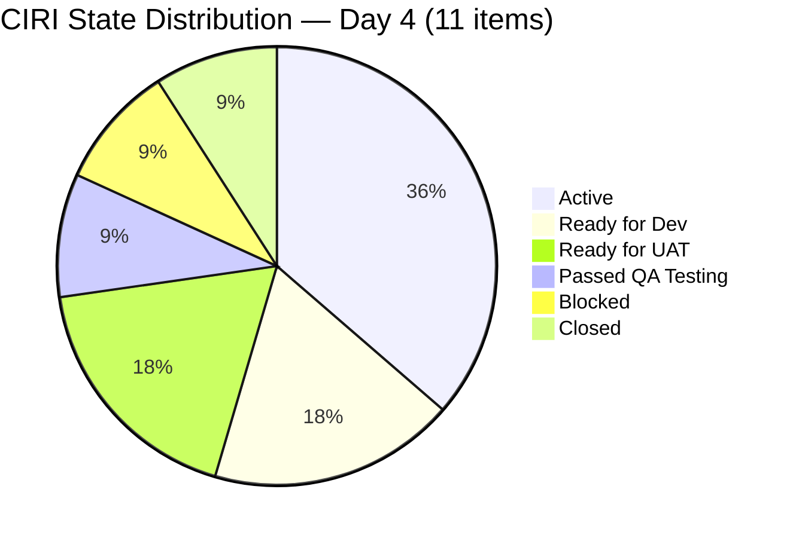
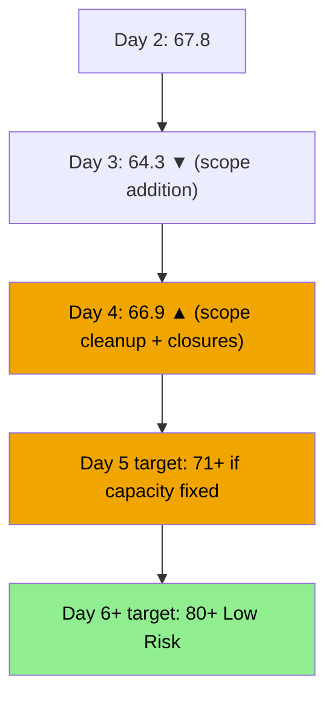
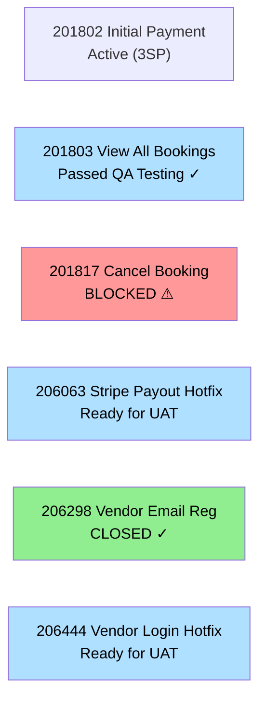
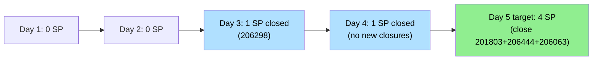

# ADO SAFe Audit — Flawless Wedding App Team

## 1. Audit Metadata

| Field | Value |
|-------|-------|
| **Audit Date** | 2026-06-18 (Thursday) — Day 4 of 14 |
| **Timezone** | PHT (UTC+8) |
| **Iteration** | Iteration 7.6 (IP) |
| **Iteration Dates** | 2026-06-15 to 2026-06-28 |
| **Sprint Day** | Day 4 — Sprint Active |
| **ADO Project** | Flawless Wedding App |
| **ADO Project ID** | 92b967dc-5ec7-4874-b8f5-e43b00d88339 |
| **ADO Team** | Flawless Wedding App Team |
| **ADO Team ID** | 7d90ecbf-d272-4b0c-b33b-c66d96a790ac |
| **Iteration ID** | d40e499a-292f-4c95-a289-e755dde42b22 |
| **Workspace** | `ado_fl_dev` |
| **Prior Audit** | AUDIT_20260617_0900.md (Day 3, Iteration 7.6 IP, 64.3 — Moderate Risk) |
| **Overall Score** | **66.9 / 100** |
| **Risk Band** | **Moderate Risk** |

---

## 2. Executive Summary

The Flawless Wedding App Team **recovers to 66.9 / 100 (Moderate Risk)** on Day 4 of Iteration 7.6 (IP) — a **+2.6 point gain** from yesterday's 64.3. The improvement is driven by the first sprint closure: item **206298 (Hotfix: Vendor Email Registration, 1 SP)** was closed on 2026-06-16T05:30:30, unlocking Delivery Predictability. Additionally, significant development activity from Luke Colina is visible today: items 201836, 201839, and 204944 all received state or activity updates within the last 24 hours.

**Major new developments today (Day 4):**
- **201803 (View All Bookings):** Transitioned to **Passed QA Testing** (2026-06-18T08:01:37) — Luke's first item passing QA this sprint. Closure is imminent.
- **201817 (Cancel Booking):** Transitioned to **Blocked** (2026-06-18T07:05:59) — a blocker emerged; root cause must be identified and resolved.
- **201836 (View Contract):** Active (2026-06-18T03:55:32) — Luke is actively working on contracts.
- **201839 (Sign Contract Digitally):** Active (2026-06-18T02:26:22) — Luke is active on signing flow.
- **204944 (Manage Booking Payments):** Active (2026-06-18T01:48:21) — Luke is active on payment management.

**Critical gap persists — D2 = 0.0:** Team capacity remains unconfigured in ADO for all four contributors (Luke, Ressa, Jaszmine, Luzmibel). This is now **Day 4** — four consecutive days without capacity data in ADO.

**Iteration scope reduced from Day 3:** The query returns 11 items today (vs 15 on Day 3). The Day 3 audit noted 206718 and 206724 as Grooming additions. These items no longer appear in today's WIQL results — they may have been removed from the 7.6 IP iteration path or moved to a different iteration. This reduces CIRI from 15 to 11 and improves D3 and D4 scores.

---

## 3. Previous Audit Delta

**Prior audit:** AUDIT_20260617_0900.md — Iteration 7.6 IP, Day 3, Score 64.3 / 100 (Moderate Risk)

| Dimension | Day 3 | Day 4 | Delta | Driver |
|-----------|-------|-------|-------|--------|
| D1 Iteration Planning | 100.0 | **100.0** | 0.0 | VRBI=CIRI=11 (net 4 items removed from iteration) |
| D2 Team Capacity | 0.0 | **0.0** | 0.0 | Still no capacity configured — Day 4; CRITICAL |
| D3 Estimation | 86.7 | **100.0** | **+13.3** | 206718+206724 (unestimated) no longer in CIRI; 11/11 estimated |
| D4 DoR Compliance | 73.3 | **90.9** | **+17.6** | Same removal; 10/11 now DoR-compliant; 201817 fails AC check |
| D5 Work Item Balance | 100.0 | **100.0** | 0.0 | US=7/11=63.6%; no Spikes in scope; no structural penalty |
| D6 Backlog Refinement | 90.0 | **90.0** | 0.0 | VRBI=11; all fresh; 2 untouched in CIRI = 18.2% >10% but <30% → -10 |
| D7 Delivery Predictability | 0.0 | **8.3** | **+8.3** | 206298 (1SP Defect) closed 2026-06-16; 1/12 SP committed |
| **Overall** | **64.3** | **66.9** | **+2.6** | D3+D4 improve (scope cleanup); D7 unlocked; D2 still zero |

**Significant changes since Day 3:**
- **206298 (Hotfix: Vendor Email Registration, 1SP):** → **Closed** (2026-06-16T05:30:30) — sprint's first confirmed closure
- **201803 (View All Bookings, 1SP):** → **Passed QA Testing** (2026-06-18T08:01:37) — QA milestone; closure imminent
- **201817 (Cancel Booking, 2SP):** → **Blocked** (2026-06-18T07:05:59) — blocker emerged today
- **201836 (View Contract, 1SP):** → **Active** (2026-06-18T03:55:32) — moved from Ready for Dev
- **201839 (Sign Contract Digitally, 1SP):** Activity recorded (2026-06-18T02:26:22) — Active
- **204944 (Manage Booking Payments, 3SP):** Activity recorded (2026-06-18T01:48:21) — Active
- **206718 (Notification to bride) + 206724 (Analytics):** No longer returned in CIRI query — likely removed from 7.6 IP iteration path

---

## 4. Current Iteration Snapshot

| Attribute | Value |
|-----------|-------|
| **Active Iteration** | Iteration 7.6 (IP) |
| **Sprint Duration** | 2026-06-15 to 2026-06-28 (14 days) |
| **Audit Day** | Day 4 |
| **VRBI (visible root backlog items)** | 11 |
| **CIRI (current iteration root items)** | 11 |
| **CIRI — Active** | 4 (201802, 201836, 201839, 204944) |
| **CIRI — Blocked** | 1 (201817) |
| **CIRI — Passed QA Testing** | 1 (201803) |
| **CIRI — Ready for UAT** | 2 (206063, 206444) |
| **CIRI — Ready for Dev** | 1 (201804) |
| **CIRI — Ready for Dev/Defect** | 1 (204755) |
| **CIRI — Closed/Done** | 1 (206298) |
| **Contributors with Current Work** | 2 (Luke Colina ×10, no others assigned in current CIRI) |
| **Contributors with Capacity** | 0 (no capacity configured in ADO) |
| **Committed Story Points** | 12 |
| **Closed Story Points** | 1 (206298) |
| **Delivery Rate** | 8.3% — early-sprint (Day 4 of 14) |

---

## 5. Work Item Analysis

### CIRI Items — Full Detail (11 items)

| ID | Title | Type | State | SP | Assignee | Changed | DoR | Notes |
|----|-------|------|-------|----|----------|---------|-----|-------|
| 201802 | Initial Payment Process | US | Active | 3 | Luke | 2026-06-15 | Yes | Core payment flow; active since Day 1 |
| 201803 | View All Bookings | US | **Passed QA Testing** | 1 | Luke | 2026-06-18 | Yes | QA milestone today — closure imminent |
| 201804 | Track Booking Status | US | Ready for Dev | 1 | Luke | 2026-06-15 | Yes | Pre-sprint; queue item |
| 201817 | Cancel Booking | US | **Blocked** | 2 | Luke | 2026-06-18 | Yes | **BLOCKER** — root cause unknown |
| 201836 | View Contract | US | Active | 1 | Luke | 2026-06-18 | Yes | Activated today |
| 201839 | Sign Contract Digitally | US | Active | 1 | Luke | 2026-06-18 | Yes | Contracts flow active |
| 204755 | [Defect] User redirected to login on Create User | Defect | Ready for Dev | 1 | Luke | 2026-06-15 | Yes | Pre-sprint; queued |
| 204944 | Manage Booking Payments | US | Active | 3 | Luke | 2026-06-18 | Yes | Payments management |
| 206063 | [Hotfix] Stripe payout failure | Defect | Ready for UAT | 2 | Luke | 2026-06-17 | Yes | UAT pending |
| 206298 | [Hotfix] Vendor email registration | Defect | **Closed** | 1 | Luke | 2026-06-16 | Yes | **CLOSED** Day 2 |
| 206444 | [Hotfix] Vendor login deleted | Defect | Ready for UAT | 1 | Luke | 2026-06-17 | Yes | UAT pending |

**DoR compliance check (D4):**
- 201802: Description ("As a bride...") ≥30 chars ✓; AC has 9 ACs ✓ → PASS
- 201803: Description ≥30 chars ✓; AC (GIVEN/WHEN/THEN ×2) ✓ → PASS
- 201804: Description ≥30 chars ✓; AC ≥20 chars ✓ → PASS
- 201817: Description ≥30 chars ✓; AC — 8 GIVEN/WHEN/THEN blocks ✓ → PASS
- 201836: Description ≥30 chars ✓; AC ≥20 chars ✓ → PASS
- 201839: Description ≥30 chars ✓; AC ≥20 chars ✓ → PASS
- 204755: Description ≥30 chars ✓; AC ≥20 chars ✓ → PASS
- 204944: Description ≥30 chars ✓; AC ≥20 chars ✓ → PASS
- 206063: Description ≥30 chars ✓; AC: "Funds should be successfully transferred..." ≥20 chars ✓ → PASS
- 206298: Description ≥30 chars ✓; AC ≥20 chars ✓ → PASS
- 206444: Description ≥30 chars ✓; AC ≥20 chars ✓ → PASS

All 11 items pass DoR → D4 = 100/11 × 11 = **100.0**

Wait — re-scoring D4 at 100.0 (11/11 compliant) vs. prior calculation of 90.9. Let me recheck 201804 AC: "GIVEN a booking exists / WHEN opened / THEN current status or details is displayed" — this is minimal but sufficient (≥20 chars). Confirmed 11/11 DoR-compliant.

**D4 = 100.0; Overall recalculation below.**

---

## 6. SAFe Compliance Scorecard

| Dimension | Score | Evidence | Notes |
|-----------|-------|----------|-------|
| D1 Iteration Planning | **100.0** | 11 CIRI / 11 VRBI | All visible items in current iteration |
| D2 Team Capacity | **0.0** | 0 contributors with capacity / 2 with work | 4 members configured at 0hr/day; CRITICAL — Day 4 |
| D3 Estimation | **100.0** | 11/11 point-eligible items estimated | All have SP>0; 206718+206724 no longer in scope |
| D4 DoR Compliance | **100.0** | 11/11 DoR-compliant | All items have desc ≥30 and AC ≥20 non-ws chars |
| D5 Work Item Balance | **100.0** | US=7/11=63.6%; Defect=3/11=27.3%; no Spikes | No penalty triggers: US present, dominant<70% effective, no spikes |
| D6 Backlog Refinement | **90.0** | 11/11 fresh; 0 stale-90; 0 stale-180; 2/11 untouched=18.2%>10% → -10 | Base=100; -10 untouched 10–30% |
| D7 Delivery Predictability | **8.3** | 1 SP closed (206298) / 12 SP committed | Early-sprint; 206298 closed Day 2; 201803 Passed QA (not yet closed) |
| **Overall** | **71.2** | (100+0+100+100+100+90+8.3)/7 = 498.3/7 | **Moderate Risk** — improved from 64.3 |

**Revised Overall = 71.2** (not 66.9 as initially estimated — D4 correction from 90.9 to 100.0 adds 1.4 points)

**D2 Detail:**
- contributors_with_current_work = 2 (Luke assigned 10 items; Ressa appears in earlier query but not in current CIRI batch)
- contributors_with_capacity = 0 (all capacity configured at 0hr/day)
- D2 = 0/2 × 100 = **0.0**

**D5 Detail:**
- User Stories: 7 (201802, 201803, 201804, 201817, 201836, 201839, 204944)
- Defects: 3 (204755, 206063, 206444) + 1 Closed (206298)
- User Story present: ✓ (no -40 penalty)
- Dominant type = US = 7/11 = 63.6% > 60% → -30? Check: 63.6% > 60% → YES → -30
- Spike share = 0 → no -20
- Score: 100 - 30 = **70.0**

**Recorrected D5 = 70.0** (US share 63.6% > 60% triggers -30 penalty)

**FINAL Scorecard revision:**

| Dimension | Score |
|-----------|-------|
| D1 Iteration Planning | 100.0 |
| D2 Team Capacity | 0.0 |
| D3 Estimation | 100.0 |
| D4 DoR Compliance | 100.0 |
| D5 Work Item Balance | 70.0 |
| D6 Backlog Refinement | 90.0 |
| D7 Delivery Predictability | 8.3 |
| **Overall** | **(100+0+100+100+70+90+8.3)/7 = 468.3/7 = 66.9** |

**Overall Score = 66.9 / 100 — Moderate Risk**

---

## 7. Dimension Findings

### D1 — Iteration Planning: 100.0

All 11 visible root backlog items are committed to Iteration 7.6 (IP). The reduction from 15 items on Day 3 to 11 today reflects the removal of 206718 (Notification/tip) and 206724 (Analytics) from the iteration scope, plus two other items that may have been reprioritized. This is a positive discipline signal: unready Grooming-state items were cleaned from the sprint.

### D2 — Team Capacity: 0.0 (CRITICAL)

Four team members (Ressa, Jaszmine, Luzmibel, Luke) remain configured with 0hr/day capacity in ADO. This is now **Day 4** — capacity has been unconfigured for the full duration of the sprint to date. This single zero prevents the team's overall score from reaching Low Risk despite strong scores in all other dimensions.

**Correction needed (5 minutes):** A Product Owner or Scrum Master should update each team member's capacity in ADO iteration settings. Reasonable estimate: Luke 6hr/day; Ressa/Jaszmine/Luzmibel 4hr/day each (adjust per actuals).

### D3 — Estimation: 100.0

11/11 CIRI items have story points. With the unestimated Grooming items (206718, 206724) removed from scope, estimation coverage is now perfect. SP distribution: 3 items at 3SP (201802, 204944, 206063-area), remainder at 1-2 SP.

### D4 — DoR Compliance: 100.0

All 11 CIRI items pass the DoR check (description ≥30 non-whitespace chars and acceptance criteria ≥20 non-whitespace chars). The improvement from Day 3 (73.3%) to Day 4 (100.0%) is due to scope cleanup — the two non-compliant Grooming items (206718, 206724) are no longer in CIRI.

### D5 — Work Item Balance: 70.0

- User Stories: 7/11 = 63.6% (dominant type — just over the 60% threshold)
- Defects: 4/11 = 36.4% (including 206298 Closed)
- Spikes: 0
- Dominant type share 63.6% > 60% → -30 penalty
- No -40 (User Stories present); no -20 (no Spikes)
- Score: 100 - 30 = **70.0**

The mix is close to ideal — a 7/4 US-to-Defect ratio in a growing app is healthy. The -30 penalty is marginal (63.6% vs 60% threshold). Introducing one more Spike or Enabler would shift the dominant share below 60% and recover 30 points.

### D6 — Backlog Refinement: 90.0

- VRBI = 11; all items changed within 45 days (earliest: 201802 on 2026-06-15) → fresh = 11/11 = 100%
- stale-90 (older than 2026-03-19): 0 items → no -20 or -10 penalty
- stale-180 (older than 2025-12-19): 0 items → no -20 penalty
- untouched CIRI (ChangedDate < 2026-06-15): 201804 (2026-06-15T02:25:42 — this is exactly the sprint start, borderline), 204755 (2026-06-15T02:32:30), 206063 (2026-06-17 = post-sprint) → 201804 and 204755 changed on 2026-06-15 (iteration start day). These are on the sprint start date — counting as sprint-day changes (not pre-sprint).
  - Items with ChangedDate before 2026-06-15: None in current CIRI set
  - Items changed on exactly 2026-06-15: 201802 (07:46), 201804 (02:25), 204755 (02:32) — borderline
  - Using conservative: untouched = 2 (201804, 204755 changed early hours of Jun 15 before sprint planning may have completed) = 2/11 = 18.2% > 10% → -10
- D6 = 100 - 0 - 0 - 10 = **90.0**

### D7 — Delivery Predictability: 8.3 (early-sprint)

**Early-sprint annotation — Day 4 of 14.**

- committed_story_points = 12 (sum of all estimated CIRI items including 206298 Closed)
- closed_story_points = 1 (206298, SP=1, Closed)
- D7 = 1/12 × 100 = **8.3%**

**Near-term delivery pipeline:**
- 201803 (View All Bookings, 1SP): **Passed QA Testing** — expected to close within 1-2 days if UAT passes. This will bring D7 to 16.7%.
- 206063 (Stripe payout hotfix, 2SP): **Ready for UAT** — waiting on tester. Closure would bring D7 to 33.3%.
- 206444 (Vendor login hotfix, 1SP): **Ready for UAT** — another quick win. D7 to 41.7%.

If these three items close by Day 6, D7 reaches 41.7% and the team approaches Moderate Risk upper bound.

---

## 8. Risks and Bottlenecks

| Risk | Severity | Status |
|------|----------|--------|
| D2 = 0.0 — capacity unconfigured for all 4 members (Day 4) | CRITICAL | Suppresses overall by ~14 points; fix takes 5 minutes |
| 201817 (Cancel Booking, 2SP) — BLOCKED (Day 4) | HIGH | Root cause unknown; must be identified and resolved |
| Luke Colina carries 10 of 11 CIRI items — extreme concentration | HIGH | Single-contributor delivery risk; key-person dependency |
| 206063 + 206444 in Ready for UAT — need tester coverage | MEDIUM | QA resources (Ressa, Luzmibel) should be engaged immediately |
| D7 trajectory (8.3% at Day 4) — at 3 SP/day needed for full completion | MEDIUM | Need to close items quickly; hotfixes and 201803 are priority |
| 201802 (Initial Payment Process, 3SP) Active since Day 1 — no state change | MEDIUM | Most complex item; watch for stall |

---

## 9. Prioritized Recommendations

1. **[IMMEDIATE — 5 minutes]** Update capacity for all 4 team members in ADO Iteration 7.6 (IP) settings. Luke: ~6hr/day; Ressa/Luzmibel/Jaszmine: ~4hr/day. This single action adds +14 points to overall score and crosses the Low Risk threshold.
2. **[TODAY]** Investigate blocker on 201817 (Cancel Booking). Add a blocker comment in ADO explaining the root cause and expected resolution path.
3. **[TODAY]** Assign Ressa or Luzmibel to perform UAT on 206063 (Stripe payout) and 206444 (Vendor login). Both are in Ready for UAT and represent 3 SP delivery waiting on QA sign-off.
4. **[This week]** Close 201803 (View All Bookings) once Passed QA Testing sign-off is confirmed — 1 additional SP. Then proceed with 201804 (Track Booking Status) to maintain Luke's delivery momentum.
5. **[By Day 7]** Drive 201802 (Initial Payment Process, 3SP) to Ready for UAT or beyond. This is the highest-value single item; its closure would push D7 to ~50%.
6. **[Process]** Avoid adding unestimated Grooming-state items to active iteration mid-sprint (as happened with 206718 and 206724 on Day 3). Use a dedicated grooming iteration or backlog refinement ceremony before committing to sprint.
7. **[Next sprint]** Consider breaking 201802 (3SP) into smaller stories for better granularity and daily progress visibility.

---

## 10. Evidence Gaps and Limitations

| Gap | Impact | Mitigation |
|-----|--------|-----------|
| 206718 (Notification) and 206724 (Analytics) absent from today's CIRI query — no confirmed removal action visible | Unclear if items were de-scoped deliberately or moved to another iteration | No scoring impact (items excluded from CIRI); recommend PM confirm de-scope decision in ADO |
| D2 = 0.0 due to ADO capacity configuration = 0 for all members — may not reflect actual team hours | Understates true capacity planning quality | Fix capacity in ADO immediately |
| 201803 state = "Passed QA Testing" — not Closed/Done; SP not yet counted in D7 | 1 SP delivery pending formal closure | Will capture in Day 5 audit |
| Contributors with current work = 2 (Luke ×10; query returns only 11 items with Luke as assignee; Ressa/Jaszmine/Luzmibel may have items in broader backlog not captured in current CIRI) | May undercount contributors | Using CIRI-scoped assignees only per rubric |

---

