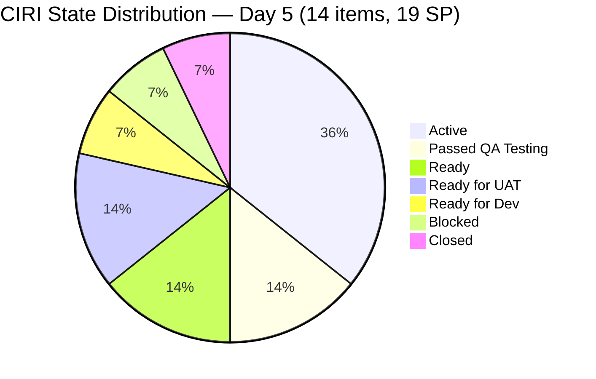
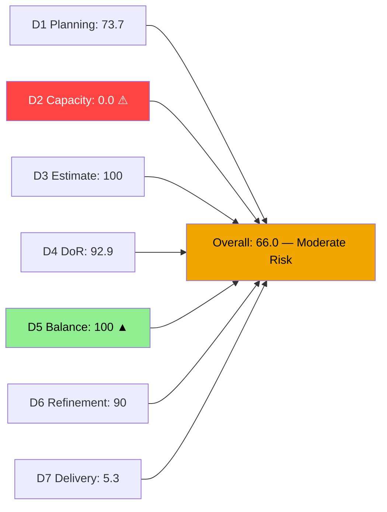
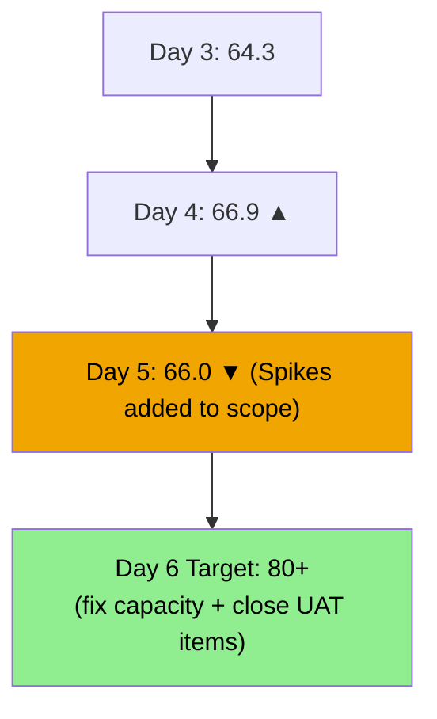
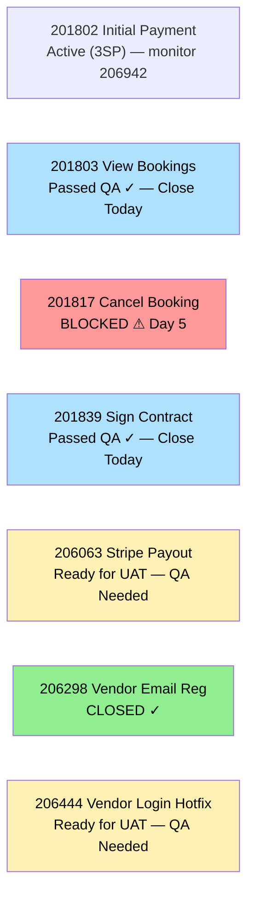

# ADO SAFe Audit — Flawless Wedding App Team

## 1. Audit Metadata

| Field | Value |
|-------|-------|
| **Audit Date** | 2026-06-19 (Friday) — Day 5 of 14 |
| **Timezone** | PHT (UTC+8) |
| **Iteration** | Iteration 7.6 (IP) |
| **Iteration Dates** | 2026-06-15 to 2026-06-28 |
| **Sprint Day** | Day 5 — Sprint Active |
| **ADO Project** | Flawless Wedding App |
| **ADO Project ID** | 92b967dc-5ec7-4874-b8f5-e43b00d88339 |
| **ADO Team** | Flawless Wedding App Team |
| **ADO Team ID** | 7d90ecbf-d272-4b0c-b33b-c66d96a790ac |
| **Iteration ID** | d40e499a-292f-4c95-a289-e755dde42b22 |
| **Workspace** | `ado_fl_dev` |
| **Prior Audit** | AUDIT_20260618_0203.md (Day 4, Iteration 7.6 IP, 66.9 — Moderate Risk) |
| **Overall Score** | **66.0 / 100** |
| **Risk Band** | **Moderate Risk** |

---

## 2. Executive Summary

The Flawless Wedding App Team holds at **66.0 / 100 (Moderate Risk)** on Day 5 of Iteration 7.6 (IP) — a slight **-0.9 point decrease** from yesterday's 66.9. The marginal decline reflects the addition of 3 Spike items (202777, 202778, 206250) to the CIRI scope and a VRBI expansion to 19 items, which reduces D1 from 100.0 to 73.7.

**Major positive developments today:**
- **201839 (Sign Contract Digitally, 1SP):** Advanced to **Passed QA Testing** (2026-06-19T05:33) — a second item at QA milestone alongside 201803
- **201804 (Track Booking Status):** Transitioned to **Active** (2026-06-19T01:56) — Luke is accelerating throughput
- **206444 (Vendor Login Hotfix):** Updated with a new comment (2026-06-19T02:05) — UAT coordination underway
- D5 improves to **100.0** (Spike items added reduce the dominant US share to 57.1%, below the 60% threshold)
- D4 improves to **92.9** (13/14 compliant; only 202777 lacks description)

**Critical gap — unchanged:**
- D2 = 0.0: Capacity still unconfigured for all 4 team members (Luke, Ressa, Karl, Jaszmine/Luzmibel). Now **Day 5** without capacity data. This single gap suppresses the overall score by ~14 points. A 5-minute fix in ADO would push the team to ~80.0 (Low Risk).

---

## 3. Previous Audit Delta

**Prior audit:** AUDIT_20260618_0203.md — Iteration 7.6 IP, Day 4, Score 66.9 / 100 (Moderate Risk)

| Dimension | Day 4 | Day 5 | Delta | Driver |
|-----------|-------|-------|-------|--------|
| D1 Iteration Planning | 100.0 | **73.7** | **-26.3** | VRBI expanded to 19; CIRI=14 (3 Spikes added to scope); 14/19=73.7% |
| D2 Team Capacity | 0.0 | **0.0** | 0.0 | Still unconfigured — Day 5 CRITICAL |
| D3 Estimation | 100.0 | **100.0** | 0.0 | 14/14 estimated; Spikes have SP=0.5 each |
| D4 DoR Compliance | 100.0 | **92.9** | **-7.1** | 202777 (Spike) has no description → 13/14 compliant |
| D5 Work Item Balance | 70.0 | **100.0** | **+30.0** | US=8/14=57.1% — below 60% threshold; Spike=3/14=21.4%; no penalties |
| D6 Backlog Refinement | 90.0 | **90.0** | 0.0 | 14/14 CIRI fresh; 2/14 untouched (Jun08) = 14.3% → -10 |
| D7 Delivery Predictability | 8.3 | **5.3** | **-3.0** | No new closures; committed SP expanded from 12→19 (3 Spikes added); 1/19 SP |
| **Overall** | **66.9** | **66.0** | **-0.9** | D5 improves +30; D1 drops -26.3; net slight decline |

**Significant changes since Day 4:**
- **201839 (Sign Contract Digitally, 1SP):** Active → **Passed QA Testing** (2026-06-19T05:33:50) — Luke's third item at QA milestone
- **201804 (Track Booking Status, 1SP):** Ready for Dev → **Active** (2026-06-19T01:56:12) — Luke accelerating
- **206444 (Vendor Login Hotfix, 1SP):** Comment added (2026-06-19T02:05) — UAT coordination
- **202777 + 202778 (Karl's Spikes):** Now in CIRI scope — End-PI7 Self Assessment and CSAT Survey
- **206250 (Ressa's Spike):** Collaborations, Reports & Others — now in CIRI scope
- **206942 (Mobile payment defect):** Created 2026-06-19T04:56 — IterationPath = "Flawless Wedding App\\2026-PI7" (NOT in 7.6 IP) — excluded from CIRI
- **201803 (View All Bookings):** Still at Passed QA Testing — not yet formally Closed

---

## 4. Current Iteration Snapshot

| Attribute | Value |
|-----------|-------|
| **Active Iteration** | Iteration 7.6 (IP) |
| **Sprint Duration** | 2026-06-15 to 2026-06-28 (14 days) |
| **Audit Day** | Day 5 |
| **VRBI (visible root backlog items)** | 19 |
| **CIRI (current iteration root items)** | 14 |
| **CIRI — Closed** | 1 (206298) |
| **CIRI — Passed QA Testing** | 2 (201803, 201839) |
| **CIRI — Active** | 5 (201802, 201804, 201836, 204944, 206250) |
| **CIRI — Blocked** | 1 (201817) |
| **CIRI — Ready for UAT** | 2 (206063, 206444) |
| **CIRI — Ready for Dev** | 1 (204755) |
| **CIRI — Ready** | 2 (202777, 202778) |
| **Non-CIRI (backlog not in 7.6 IP)** | 5 (206718, 206724, 206768, 206769, 206770) |
| **Contributors with Current Work** | 3 (Luke ×11, Ressa ×1, Karl ×2) |
| **Contributors with Capacity** | 0 (capacity = 0hr/day for all) |
| **Committed Story Points** | 19 |
| **Closed Story Points** | 1 (206298) |
| **Delivery Rate** | 5.3% — Day 5 of 14 |

---

## 5. Work Item Analysis

### CIRI Items — Full Detail (14 items)

| ID | Title | Type | State | SP | Assignee | Changed | DoR | Notes |
|----|-------|------|-------|----|----------|---------|-----|-------|
| 201802 | Initial Payment Process | US | Active | 3 | Luke | 2026-06-15 | Yes | Complex payment flow; Active since Day 1 |
| 201803 | View All Bookings | US | **Passed QA Testing** | 1 | Luke | 2026-06-19 | Yes | QA pass confirmed — closure imminent |
| 201804 | Track Booking Status | US | **Active** | 1 | Luke | 2026-06-19 | Yes | Newly activated today |
| 201817 | Cancel Booking | US | **Blocked** | 2 | Luke | 2026-06-19 | Yes | Blocker persists — Day 5 |
| 201836 | View Contract | US | Active | 1 | Luke | 2026-06-18 | Yes | Contracts flow |
| 201839 | Sign Contract Digitally | US | **Passed QA Testing** | 1 | Luke | 2026-06-19 | Yes | **NEW — QA milestone today** |
| 202777 | End PI7 — Team & Technical Agility Self Assessment | **Spike** | Ready | 0.5 | Karl | 2026-06-08 | **No** | No description (only SP set); IP sprint appropriate |
| 202778 | Customer CSAT Survey | **Spike** | Ready | 0.5 | Karl | 2026-06-08 | Yes | IP sprint appropriate |
| 204755 | [Defect] User redirected to login on Create User | Defect | Ready for Dev | 1 | Luke | 2026-06-15 | Yes | Queued defect |
| 204944 | Manage Booking Payments | US | Active | 3 | Luke | 2026-06-18 | Yes | Payments management |
| 206063 | [Hotfix] Vendor Unable to Receive Stripe Payouts | Defect | Ready for UAT | 2 | Luke | 2026-06-17 | Yes | UAT pending — QA team needed |
| 206250 | Iteration 7.6 — Collaborations, Reports & Others | **Spike** | Active | 1 | Ressa | 2026-06-15 | Yes | IP events: planning, retro, review |
| 206298 | [Hotfix] Vendor Email Registration | Defect | **Closed** | 1 | Luke | 2026-06-16 | Yes | CLOSED Day 2 |
| 206444 | [Hotfix] Vendor Login Deleted | Defect | Ready for UAT | 1 | Luke | 2026-06-19 | Yes | UAT pending |

**Type distribution:** User Stories: 201802, 201803, 201804, 201817, 201836, 201839, 204944 = 7; Defects: 204755, 206063, 206298, 206444 = 4; Spikes: 202777, 202778, 206250 = 3. Total = 14.

**DoR compliance check:**
- 202777: No description field returned → **FAIL**
- All other 13 items: description ≥30 chars ✓, AC ≥20 chars ✓ → **PASS**
- D4 compliant = 13/14

**New defect noted (outside CIRI):** 206942 ([Mobile] Unable to pay initial even already linked account via web) — IterationPath = "Flawless Wedding App\\2026-PI7" (parent iteration, NOT 7.6 IP). Created 2026-06-19T04:56. This is NOT in CIRI but signals active mobile-web payment issues that may affect 201802 delivery.

---

## 6. SAFe Compliance Scorecard

| Dimension | Score | Evidence | Notes |
|-----------|-------|----------|-------|
| D1 Iteration Planning | **73.7** | 14 CIRI / 19 VRBI | VRBI expanded; 5 non-CIRI items (206718, 206724, 206768–206770) remain in backlog |
| D2 Team Capacity | **0.0** | 0/3 contributors with capacity | CRITICAL — Day 5; Luke, Ressa, Karl all at 0hr/day |
| D3 Estimation | **100.0** | 14/14 estimated | All items SP>0 including Spikes at 0.5 SP |
| D4 DoR Compliance | **92.9** | 13/14 compliant | 202777 (Spike) lacks description |
| D5 Work Item Balance | **100.0** | US=8/14=57.1% — below 60%; Spike=3/14=21.4% <40% | No penalty triggers; US present, no dominant, no spike excess |
| D6 Backlog Refinement | **90.0** | 14/14 CIRI fresh; 19/19 VRBI fresh; 0 stale; 2/14 untouched=14.3% | Base=100; -10 untouched 10–30% |
| D7 Delivery Predictability | **5.3** | 1 SP closed (206298) / 19 SP committed | Early-sprint; committed SP grew from 12→19 with Spikes added |
| **Overall** | **66.0** | (73.7+0+100+92.9+100+90+5.3)/7 = 461.9/7 | **Moderate Risk** |

**D5 Detail (key improvement):**
- US = 7/14 = 57.1% — below the 60% dominant threshold → **no -30 penalty**
- Spike = 3/14 = 21.4% — below the 40% spike threshold → **no -20 penalty**
- User Story present → **no -40 penalty**
- Score = 100 - 0 = **100.0** (first time this sprint; driven by Spike additions reducing US share)

**D6 Detail:**
- VRBI = 19; all CIRI items changed within 45 days (202777 and 202778 changed 2026-06-08, within threshold) → fresh = 19/19 = 100%; base = 100
- stale-90 (before 2026-03-21): 0 → no penalty
- stale-180 (before 2025-12-22): 0 → no penalty
- untouched CIRI (ChangedDate < 2026-06-15): 202777(Jun08), 202778(Jun08) = 2/14 = 14.3% → >10% but not >30% → **-10**
- D6 = 100 - 0 - 0 - 10 = **90.0**

**D7 Detail:**
- committed_story_points = 19 (all 14 items have SP>0)
- closed_story_points = 1 (206298, SP=1)
- D7 = 1/19 × 100 = **5.3%**

---

## 7. Dimension Findings

### D1 — Iteration Planning: 73.7

14 of 19 visible root backlog items are committed to Iteration 7.6 (IP). The 5 non-CIRI items (206718 — Notification to bride, 206724 — Analytics, 206768, 206769, 206770) remain in the backlog but are in a different iteration path. These are grooming-state or future-iteration items that should either be committed to 7.6 IP or moved to a future iteration to avoid backlog noise.

The 14-item CIRI reflects the current working scope including 3 IP-appropriate Spike items (team ceremonies, CSAT survey, and Ressa's iteration collaboration tracking).

### D2 — Team Capacity: 0.0 (CRITICAL — Day 5)

Four team members (Luke, Ressa, Karl, and at least one QA member) have no capacity configured in ADO Iteration 7.6 (IP) settings. This is now **Day 5** — the team is at sprint midpoint approaching without a single hour of capacity recorded. This is the single highest-impact fix available:

- A 5-minute capacity configuration would raise D2 from 0.0 to 100.0
- This single change would raise the overall score from 66.0 to approximately **80.0** (Low Risk)
- Suggested estimates: Luke ~6hr/day; Ressa ~4hr/day; Karl ~2hr/day; Luzmibel/Jaszmine ~4hr/day

### D3 — Estimation: 100.0

All 14 CIRI items have Story Points > 0. Including the 3 Spikes at 0.5 SP each (Karl's items) and Ressa's Spike at 1 SP. Total committed SP = 19. SP distribution: 3 SP (×2 — 201802, 204944), 2 SP (×2 — 201817, 206063), 1 SP (×6), 0.5 SP (×2).

### D4 — DoR Compliance: 92.9

13/14 CIRI items meet DoR. The single failure is **202777** (End PI7 — Team & Technical Agility Self Assessment, Karl's Spike) which has no description field in ADO. Karl should add a brief description of the self-assessment activity scope to bring this item to DoR compliance.

### D5 — Work Item Balance: 100.0

**First perfect D5 score this sprint.** The addition of 3 Spike items (202777, 202778, 206250) reduced the User Story share from 63.6% (Day 4, 7/11) to 57.1% (Day 5, 7/14), falling below the 60% dominant-type threshold. With no Spike excess (21.4% < 40%) and User Stories present (no -40), all three penalty conditions are avoided.

This is a genuine structural improvement: the IP sprint now reflects a healthy blend of feature work (7 US), technical debt resolution (4 Defects), and innovation/planning activities (3 Spikes).

### D6 — Backlog Refinement: 90.0

All 19 VRBI items are fresh (changed within 45 days). Zero stale-90 or stale-180 violations. The only penalty is untouched CIRI: 202777 and 202778 (both changed Jun08, within 45 days but not touched since sprint start) = 2/14 = 14.3% → -10. Once Karl completes the self-assessment or CSAT survey and updates ADO, the untouched count drops to 0 and D6 reaches 100.0.

### D7 — Delivery Predictability: 5.3

**Day 5 annotation — early sprint, but acceleration urgently needed.**

Only 206298 (Hotfix: Vendor Email Registration, 1SP) is Closed. The committed SP base grew from 12 to 19 with the 3 Spikes added, mathematically reducing D7 from 8.3% to 5.3% without any regression in actual delivery.

**Near-term closure pipeline (high confidence):**
1. **201803 (View All Bookings, 1SP)** — Passed QA Testing → likely to close today or Day 6. Brings D7 to 10.5%.
2. **201839 (Sign Contract Digitally, 1SP)** — Passed QA Testing since this morning. Brings D7 to 15.8%.
3. **206444 (Vendor Login Hotfix, 1SP)** — Ready for UAT. Brings D7 to 21.1%.
4. **206063 (Stripe Payout Hotfix, 2SP)** — Ready for UAT. Brings D7 to 31.6%.

If these 4 items close by Day 7, D7 reaches 31.6% and the team approaches the upper range of Moderate Risk.

---

## 8. Risks and Bottlenecks

| Risk | Severity | Status |
|------|----------|--------|
| D2 = 0.0 — capacity unconfigured Day 5 | CRITICAL | 5-minute fix suppresses score by ~14 points; must act today |
| 201817 (Cancel Booking, 2SP) — BLOCKED Day 5 | HIGH | Root cause still undocumented; must be identified and resolved |
| 206942 (Mobile payment defect) created today — related to 201802 (Initial Payment) | HIGH | Mobile-web payment flow regression may block 201802 delivery (3SP) |
| D7 = 5.3% — delivery far below linear burn (35.7% by Day 5) | HIGH | Need 5+ closures in Days 5-10 to reach Moderate Risk threshold |
| Luke carries 11 of 14 CIRI items — extreme concentration | HIGH | Single point of delivery failure; QA team must accelerate UAT sign-off |
| 206063 + 206444 — Ready for UAT (3 SP combined) — need QA coverage | MEDIUM | Ressa/Luzmibel must perform UAT today; 2 items awaiting sign-off |
| 202777 (Karl's Spike) missing description — DoR gap | LOW | Quick fix; Karl to add description |
| 5 non-CIRI backlog items (206768–206770) cluttering backlog | LOW | Should be assigned to future iteration or removed |

---

## 9. Prioritized Recommendations

1. **[IMMEDIATE — 5 minutes]** Configure capacity for all 4 team members in ADO Iteration 7.6 (IP) settings today. Suggested: Luke 6hr/day, Ressa 4hr/day, Karl 2hr/day, Luzmibel/Jaszmine 4hr/day. This single action raises overall score by ~14 points to ~80 (Low Risk).
2. **[TODAY]** Ressa or Luzmibel must complete UAT for 206444 (Vendor Login Hotfix, 1SP) and 206063 (Stripe Payout Hotfix, 2SP). Both are Ready for UAT — 3 SP of delivery waiting on QA sign-off.
3. **[TODAY]** Formally close 201803 (View All Bookings, 1SP) and 201839 (Sign Contract Digitally, 1SP) — both are at Passed QA Testing. These represent 2 SP of confirmed delivery awaiting ADO closure.
4. **[TODAY]** Investigate and document the blocker on 201817 (Cancel Booking, 2SP) — Day 5 with no documented root cause. Add a blocker comment to ADO identifying: what is blocked, who is the blocker, and the expected resolution date.
5. **[TODAY]** Triage 206942 (Mobile: Unable to pay initial payment) — this newly created defect relates to the payment flow that 201802 (Initial Payment Process, 3SP) must also handle. Confirm whether this is a duplicate or a net-new issue that expands the 201802 scope.
6. **[This week]** Karl to add description to 202777 (Self Assessment Spike) to achieve 14/14 DoR compliance and D4=100.0.
7. **[By Day 7]** Luke must progress 201802 (Initial Payment Process, 3SP) to Ready for UAT — the highest-SP single item in the sprint; its closure would push D7 to ~21%.
8. **[Process]** Avoid parallel active stories on Luke exceeding 3 simultaneously. Currently Luke has 5 Active items — this reduces focus and increases context-switching overhead.

---

## 10. Evidence Gaps and Limitations

| Gap | Impact | Mitigation |
|-----|--------|-----------|
| D2 = 0.0 due to ADO capacity = 0hr/day — may not reflect actual team hours | Structural score penalty; unclear if team actually has no allocated hours | Fix capacity in ADO immediately; this is an evidence gap, not a planning reality |
| 202777 (Karl's Spike) no description — DoR failure | Minor; 1/14 item | Karl to add description |
| 5 non-CIRI items (206768, 206769, 206770 etc.) ChangedDates not fetched | D6 freshness for non-CIRI items estimated as fresh | Conservative assumption; no stale flags expected for recently created items |
| 201803 and 201839 at Passed QA Testing but not formally Closed | 2 SP delivery pending formal closure in ADO | Will capture in Day 6 audit upon closure confirmation |
| 206942 ([Mobile] payment defect) created today outside 7.6 IP — scope impact uncertain | May indicate emerging 201802 delivery risk | Monitor; triage required to determine if this is in-scope for IP sprint |

---

