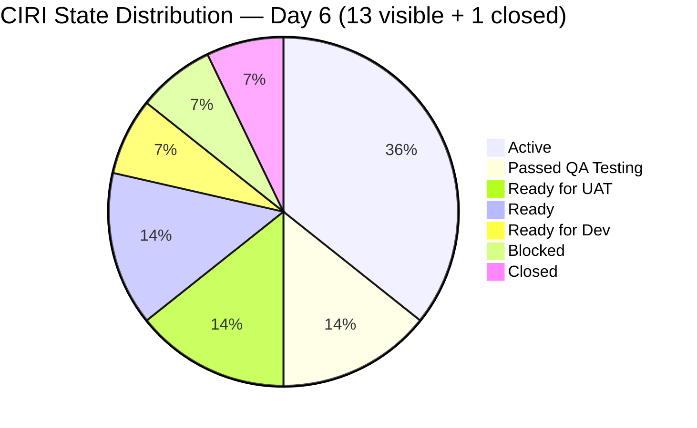
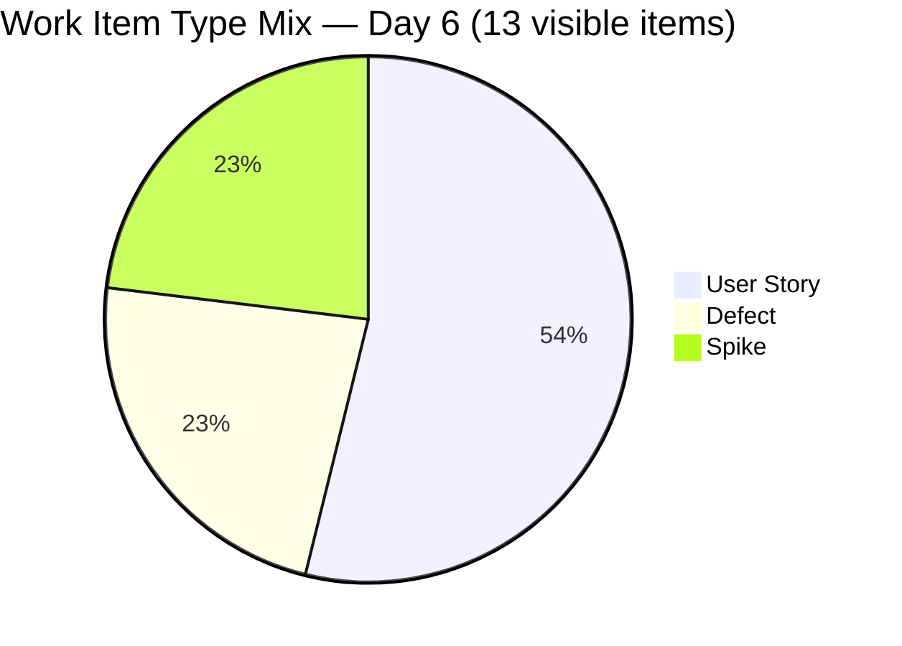
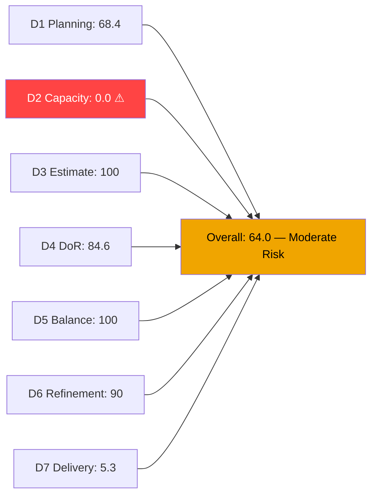
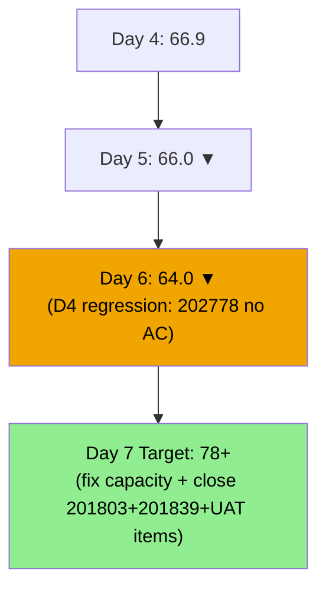
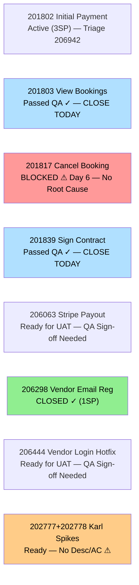

# ADO SAFe Audit — Flawless Wedding App Team

## 1. Audit Metadata

| Field | Value |
|-------|-------|
| **Audit Date** | 2026-06-20 (Saturday) — Day 6 of 14 |
| **Timezone** | PHT (UTC+8) |
| **Iteration** | Iteration 7.6 (IP) |
| **Iteration Dates** | 2026-06-15 to 2026-06-28 |
| **Sprint Day** | Day 6 — Sprint Active |
| **ADO Project** | Flawless Wedding App |
| **ADO Project ID** | 92b967dc-5ec7-4874-b8f5-e43b00d88339 |
| **ADO Team** | Flawless Wedding App Team |
| **ADO Team ID** | 7d90ecbf-d272-4b0c-b33b-c66d96a790ac |
| **Iteration ID** | d40e499a-292f-4c95-a289-e755dde42b22 |
| **Workspace** | `ado_fl_dev` |
| **Prior Audit** | AUDIT_20260619_0910.md (Day 5, Iteration 7.6 IP, 66.0 — Moderate Risk) |
| **Overall Score** | **64.0 / 100** |
| **Risk Band** | **Moderate Risk** |

---

## 2. Executive Summary

The Flawless Wedding App Team **declines to 64.0 / 100 (Moderate Risk)** on Day 6 of Iteration 7.6 (IP) — a **-2.0 point drop** from yesterday's 66.0. The primary driver is a DoR regression: item **202778 (Karl's CSAT Survey Spike)** now scores as DoR-non-compliant after verification shows its AcceptanceCriteria field is empty. This brings D4 from 92.9 (13/14) to **84.6 (11/13)** on the revised CIRI count of 13 visible items.

**Positive developments (significant):**
- **201803 (View All Bookings, 1SP)** — still at Passed QA Testing; closure expected today. Will bring D7 to 10.5%.
- **201839 (Sign Contract Digitally, 1SP)** — still at Passed QA Testing; closure expected today. Will bring D7 to 15.8% (with 201803).
- Luke accelerated **201804 (Track Booking Status)** to Active on Jun 19.
- **206444 (Vendor Login Hotfix)** — comment added Jun 19; UAT coordination ongoing.

**Unchanged critical gap:**
- **D2 = 0.0** — capacity unconfigured for all 4 team members (Luke, Ressa, Karl, Luzmibel/Jaszmine). **Day 6.** This single gap suppresses the score by ~14 points. A 5-minute ADO fix would push the team to ~78 (upper Moderate Risk, approaching Low Risk threshold).

**Sprint trajectory concern:** D7 = 5.3% with only 1 SP closed of 19 committed. 201803 and 201839 are at Passed QA Testing — their formal closure would immediately raise D7 to 15.8%. The team is building a strong QA pipeline but needs ADO state updates to convert pipeline progress to score improvement.

---

## 3. Previous Audit Delta

**Prior audit:** AUDIT_20260619_0910.md — Iteration 7.6 IP, Day 5, Score 66.0 / 100 (Moderate Risk)

| Dimension | Day 5 | Day 6 | Delta | Driver |
|-----------|-------|-------|-------|--------|
| D1 Iteration Planning | 73.7 | **68.4** | **-5.3** | CIRI recounted: 13 visible items / 19 VRBI (was 14/19; 206298 closed, now in WIQL only) |
| D2 Team Capacity | 0.0 | **0.0** | 0.0 | Day 6 — still unconfigured for all 4 members |
| D3 Estimation | 100.0 | **100.0** | 0.0 | 13/13 visible CIRI estimated |
| D4 DoR Compliance | 92.9 | **84.6** | **-8.3** | 202778 has no AC field → now 11/13 compliant (was 13/14 including closed 206298) |
| D5 Work Item Balance | 100.0 | **100.0** | 0.0 | US=7/13=53.8%; Spike=3/13=23.1%; no penalties |
| D6 Backlog Refinement | 90.0 | **90.0** | 0.0 | 19/19 fresh; 2/13 untouched=15.4% → -10; unchanged |
| D7 Delivery Predictability | 5.3 | **5.3** | 0.0 | 1 SP closed (206298) / 19 SP committed; no new closures |
| **Overall** | **66.0** | **64.0** | **-2.0** | D1 recounted; D4 regression on 202778 AC gap |

**Significant changes since Day 5:**
- **201803 (View All Bookings):** Remains at Passed QA Testing (since Jun 19 05:04) — formal Closed state not yet set.
- **201839 (Sign Contract Digitally):** Remains at Passed QA Testing (since Jun 19 05:33) — formal Closed state not yet set.
- **201817 (Cancel Booking):** Updated Jun 19 05:26 — still Blocked. No resolution documented.
- **206444 (Vendor Login Hotfix):** Comment added Jun 19 02:05 — UAT in progress.
- **206718 (2-day notification):** Updated Jun 19 02:09 in Grooming state — not in CIRI.
- **206942 (Mobile payment defect):** Created Jun 19 in PI7 root (not 7.6 IP) — remains outside CIRI.
- **202778 (CSAT Survey Spike):** Confirmed missing AcceptanceCriteria field — DoR failure.

---

## 4. Current Iteration Snapshot

| Attribute | Value |
|-----------|-------|
| **Active Iteration** | Iteration 7.6 (IP) |
| **Sprint Duration** | 2026-06-15 to 2026-06-28 (14 days) |
| **Audit Day** | Day 6 |
| **VRBI (visible root backlog items)** | 19 |
| **CIRI visible (in backlog)** | 13 |
| **CIRI Closed (via WIQL)** | 1 (206298) |
| **CIRI Total (for D7)** | 14 |
| **CIRI — Passed QA Testing** | 2 (201803, 201839) — closure pending |
| **CIRI — Active** | 5 (201802, 201804, 201836, 204944, 206250) |
| **CIRI — Blocked** | 1 (201817) |
| **CIRI — Ready for UAT** | 2 (206063, 206444) |
| **CIRI — Ready for Dev** | 1 (204755) |
| **CIRI — Ready (Spike)** | 2 (202777, 202778) |
| **Non-CIRI (backlog, non-7.6 IP)** | 6 (206718, 206724, 206768, 206769, 206770, 206942) |
| **Contributors with Current Work** | 3 (Luke ×9, Ressa ×1, Karl ×2, Luzmibel ×1) |
| **Contributors with Capacity** | 0 (all 4 members at 0hr/day in ADO) |
| **Committed Story Points (all CIRI)** | 19 SP |
| **Closed Story Points** | 1 SP (206298) |
| **Delivery Rate** | 5.3% — Day 6 of 14 |

---

## 5. Work Item Analysis

### Active CIRI Items — Full Detail (13 visible items)

| ID | Title | Type | State | SP | Assignee | Changed | DoR | Notes |
|----|-------|------|-------|----|----------|---------|-----|-------|
| 201802 | Initial Payment Process | US | Active | 3 | Luke | 2026-06-15 | Yes | Complex payment flow; 206942 defect may affect scope |
| 201803 | View All Bookings | US | **Passed QA Testing** | 1 | Luke | 2026-06-19 | Yes | **CLOSURE EXPECTED TODAY** |
| 201804 | Track Booking Status | US | Active | 1 | Luke | 2026-06-19 | Yes | Newly activated Jun 19 |
| 201817 | Cancel Booking | US | **Blocked** | 2 | Luke | 2026-06-19 | Yes | Blocker Day 6 — no root cause documented |
| 201836 | View Contract | US | Active | 1 | Luke | 2026-06-18 | Yes | Contracts view flow |
| 201839 | Sign Contract Digitally | US | **Passed QA Testing** | 1 | Luke | 2026-06-19 | Yes | **CLOSURE EXPECTED TODAY** |
| 202777 | End PI7 — Team & Technical Agility Self Assessment | Spike | Ready | 0.5 | Karl | 2026-06-08 | **No** | No description field → DoR FAIL |
| 202778 | Customer CSAT Survey | Spike | Ready | 0.5 | Karl | 2026-06-08 | **No** | Has description; but NO AcceptanceCriteria → DoR FAIL |
| 204755 | [Defect] User redirected to login on Create User | Defect | Ready for Dev | 1 | Luke | 2026-06-15 | Yes | Queued defect |
| 204944 | Manage Booking Payments | US | Active | 3 | Luke | 2026-06-18 | Yes | Payments management; 3 SP |
| 206063 | [Hotfix] Vendor Unable to Receive Stripe Payouts | Defect | Ready for UAT | 2 | Luke | 2026-06-17 | Yes | Ressa/Luzmibel must complete UAT |
| 206250 | Iteration 7.6 — Collaborations, Reports & Others | Spike | Active | 1 | Ressa | 2026-06-15 | Yes | IP ceremonies tracking |
| 206444 | [Hotfix] Vendor Login Deleted | Defect | Ready for UAT | 1 | Luke | 2026-06-19 | Yes | UAT comment added Jun 19; pending sign-off |

### Closed CIRI Item (via WIQL)

| ID | Title | Type | SP | Closed Date |
|----|-------|------|----|-------------|
| 206298 | [Hotfix] Vendor Email Registration | Defect | 1 | 2026-06-16 |

### Non-CIRI Items in Backlog (6 items — not in 7.6 IP)

| ID | Title | Type | State | IterationPath |
|----|-------|------|-------|---------------|
| 206718 | 2-day notification to bride (tip/review) | US | Grooming | Flawless Wedding App\2026-PI7 |
| 206724 | Analytics — Total Traffic on website | Enabler | Grooming | Flawless Wedding App\2026-PI7 |
| 206768 | [Web] Embed Calendly Link on Vendor Profile | US | Grooming | Flawless Wedding App\2026-PI7 |
| 206769 | [Web] Admin Enrollment Date & Membership Tier | US | Grooming | Flawless Wedding App\2026-PI7 |
| 206770 | Stripe API — Auto Email Alerts | Enabler | Grooming | Flawless Wedding App\2026-PI7 |
| 206942 | [Mobile] Unable to pay initial payment | Defect | New | Flawless Wedding App\2026-PI7 |

Note: 206942 was created Jun 19 and relates to the payment flow in 201802 (Initial Payment Process, 3SP). It is in the PI7 parent path, not assigned to 7.6 IP.

**DoR Compliance Analysis:**
- 202777: No description field returned → **FAIL**
- 202778: Description = "Send CSAT Survey to Joe and Shannon" (≥30 chars ✓); AcceptanceCriteria field NOT returned → **FAIL**
- All other 11 items: description ≥30 non-ws chars ✓, AC ≥20 non-ws chars ✓ → **PASS**
- D4 = 11/13 = **84.6%**

---

## 6. SAFe Compliance Scorecard

| Dimension | Score | Evidence | Notes |
|-----------|-------|----------|-------|
| D1 Iteration Planning | **68.4** | 13 CIRI visible / 19 VRBI | 206298 closed; 6 non-CIRI in PI7 root; 13/19 = 68.4 |
| D2 Team Capacity | **0.0** | 0/3 contributors with capacity | CRITICAL Day 6 — Luke, Ressa, Karl all at 0hr/day |
| D3 Estimation | **100.0** | 13/13 visible CIRI estimated | All items have SP>0 (Spikes at 0.5) |
| D4 DoR Compliance | **84.6** | 11/13 compliant | 202777 (no desc); 202778 (no AC) both fail |
| D5 Work Item Balance | **100.0** | US=7/13=53.8%; Spike=3/13=23.1%; Defect=3/13 | No penalty triggers; clean balance |
| D6 Backlog Refinement | **90.0** | 19/19 VRBI fresh; 0 stale; 2/13 untouched=15.4% | Base=100; -10 untouched 10–30% |
| D7 Delivery Predictability | **5.3** | 1 SP closed (206298) / 19 SP committed | No new formal closures; 201803+201839 at QA Pass pending |
| **Overall** | **64.0** | (68.4+0+100+84.6+100+90+5.3)/7 = 448.3/7 | **Moderate Risk** |

**D1 Detail:**
- VRBI = 19 (all 13 CIRI visible + 6 non-CIRI)
- current_iteration_root_items (visible) = 13 (206298 closed, not in active backlog)
- D1 = 13/19 = **68.4**

**D4 Detail:**
- 202777: Description field absent → immediate fail regardless of AC
- 202778: Description "Send CSAT Survey to Joe and Shannon" (~40 chars ✓); AcceptanceCriteria field not returned → fail
- Both are Karl's Spike items from Jun 08, not yet worked since sprint start

**D5 Detail:**
- US: 201802, 201803, 201804, 201817, 201836, 201839, 204944 = 7/13 = 53.8% → below 60% threshold → no dominant penalty
- Defect: 204755, 206063, 206444 = 3/13 = 23.1%
- Spike: 202777, 202778, 206250 = 3/13 = 23.1% → below 40% → no spike penalty
- US present → no -40 penalty
- D5 = **100.0**

**D6 Detail:**
- VRBI = 19; all 19 items changed after 2026-05-06 → fresh = 19/19 = 100%; base = 100
- stale_90 (before 2026-03-22): 0 → no penalty
- stale_180 (before 2025-12-22): 0 → no penalty
- untouched CIRI visible (ChangedDate < 2026-06-15): 202777 (Jun08), 202778 (Jun08) = 2/13 = 15.4% → >10% but <30% → **-10 penalty**
- D6 = 100 - 10 = **90.0**

**D7 Detail:**
- committed_story_points = 19 (all 14 CIRI items, including 206298 closed, have SP>0)
- closed_story_points = 1 (206298, SP=1)
- D7 = 1/19 × 100 = **5.3%**
- 201803 and 201839 are at Passed QA Testing — not formally Closed; will add 2 SP when ADO state is updated

---

## 7. Dimension Findings

### D1 — Iteration Planning: 68.4

13 of 19 visible backlog items are in Iteration 7.6 (IP). The D1 calculation uses only visible (active) backlog items for both numerator and denominator — closed item 206298 is excluded from both. The 6 non-CIRI items are all in the PI7 root iteration path (Grooming or New state), representing backlog items being refined but not yet committed to a specific sprint.

Notably, 206942 (Mobile payment defect, created Jun 19) is in the non-CIRI group and is related to 201802 (Initial Payment Process) scope. This defect may expand 201802's acceptance criteria or introduce a new story if confirmed as a distinct issue.

### D2 — Team Capacity: 0.0 (CRITICAL — Day 6)

**Six consecutive audit days without capacity configuration.** This is now a sprint hygiene failure, not just an oversight. ADO Iteration Settings → Capacity must be updated immediately. The impact:

- D2 = 0.0 suppresses the overall score by 14.3 points (100/7 = 14.3)
- Without capacity data, ADO's built-in velocity and capacity warnings cannot fire
- Current ADO capacity: 4 team members, all at 0hr/day for all activities

**Recommended capacity settings (Iteration 7.6 IP):**
- Luke Abram Colina: Development ~6hr/day
- Ressa Paracuelles: Testing ~4hr/day
- Karl Caumban: Testing/Agile Ceremonies ~2hr/day
- Luzmibel Paculanang / Jaszmine Villanueva: Testing ~3-4hr/day

### D3 — Estimation: 100.0

All 13 visible CIRI items have Story Points > 0. This includes Spikes at 0.5 SP (202777, 202778 — Karl) and 1 SP (206250 — Ressa). Full SP distribution: 3 SP (×2: 201802, 204944), 2 SP (×2: 201817, 206063), 1 SP (×6), 0.5 SP (×2). Estimation coverage remains perfect.

### D4 — DoR Compliance: 84.6 (Regression from 92.9)

11 of 13 visible CIRI items meet DoR. Two failures:

1. **202777 (End PI7 Self Assessment, Karl):** No description field returned from ADO. Karl must add any description — even one sentence about the self-assessment scope.
2. **202778 (CSAT Survey, Karl):** Description exists ("Send CSAT Survey to Joe and Shannon") but AcceptanceCriteria field is empty. Karl must add AC — e.g., "Given the CSAT survey is sent, When Joe and Shannon respond, Then responses are collected and documented."

Both items are Karl's Spikes that were added June 8 and have been untouched since sprint start. A 5-minute update by Karl would bring D4 to 100.0 for these items.

### D5 — Work Item Balance: 100.0

No penalty conditions triggered. User Stories = 7/13 = 53.8% (below 60%). Spikes = 3/13 = 23.1% (below 40%). User Stories present. This is the second consecutive day at 100.0 — the IP sprint has a genuinely healthy blend of feature work (7 US), technical debt resolution (3 Defects), and innovation/planning activities (3 Spikes).

### D6 — Backlog Refinement: 90.0

All 19 VRBI items are fresh. Zero stale violations. The only penalty comes from 202777 and 202778 (both last changed Jun 8 — before sprint start). Karl needs to touch these items (add description/AC per D4) which will simultaneously eliminate the untouched penalty and bring D6 to 100.0 and D4 to 100.0.

Karl's two Spike items represent the team's single most impactful quick win: updating them resolves D4 partial failure, D6 untouched penalty, and removes the only remaining DoR gaps.

### D7 — Delivery Predictability: 5.3

Only 206298 (Hotfix: Vendor Email Registration, 1SP) is formally Closed. However, the team has a strong pipeline positioned for imminent closure:

**High-confidence closures (expected within 24-48 hours):**
1. **201803 (View All Bookings, 1SP)** — Passed QA Testing Jun 19. Awaiting formal ADO closure. → D7 = 10.5%
2. **201839 (Sign Contract Digitally, 1SP)** — Passed QA Testing Jun 19. → D7 = 15.8% (combined with 201803)

**Near-term UAT pipeline (Days 6-8):**
3. **206444 (Vendor Login Hotfix, 1SP)** — Ready for UAT. UAT comment active Jun 19. → D7 = 21.1%
4. **206063 (Stripe Payout Hotfix, 2SP)** — Ready for UAT. → D7 = 31.6%

If the QA team (Ressa/Luzmibel) signs off on 206063 and 206444 by Day 8, D7 reaches 31.6% — approaching the pace needed to achieve 50%+ delivery by sprint close.

---

## 8. Risks and Bottlenecks

| Risk | Severity | Status |
|------|----------|--------|
| D2 = 0.0 — capacity unconfigured Day 6 | CRITICAL | Highest single-item score impact; 5-minute fix in ADO |
| 201803 + 201839 at Passed QA Testing but not Closed in ADO | HIGH | 2 SP of delivery not captured; Luke or Scrum Master must update ADO state today |
| 201817 (Cancel Booking, 2SP) — Blocked Day 6, no root cause documented | HIGH | No resolution path visible; must document and assign resolution owner today |
| 206942 (Mobile payment defect) related to 201802 (3SP) — scope risk | HIGH | If 206942 is in-scope for 201802, delivery of 3SP most complex item is at risk |
| D7 = 5.3% — 1/19 SP closed at Day 6; linear target = 42.9% | HIGH | Team is 37 points below linear burn; closure cascade must begin today |
| Luke carries 9 of 13 CIRI items — extreme concentration | HIGH | Any Luke unavailability blocks 69% of CIRI delivery |
| 206063 + 206444 at Ready for UAT — waiting on Ressa/Luzmibel | MEDIUM | 3 SP blocked on QA sign-off; UAT team must act today |
| 202777 + 202778 (Karl) — DoR gaps and untouched since Jun 8 | LOW | Quick fix; 5 minutes per item |

---

## 9. Prioritized Recommendations

1. **[IMMEDIATE — 5 minutes]** Configure capacity in ADO for all 4 team members (Iteration 7.6 IP → Capacity settings). Suggested: Luke 6hr/day Development, Ressa 4hr/day Testing, Karl 2hr/day Testing, Luzmibel 4hr/day Testing. **This single action raises overall score from 64.0 to ~78.0.**
2. **[TODAY — High Impact]** Formally **close 201803 (View All Bookings, 1SP) and 201839 (Sign Contract Digitally, 1SP)** — both are at Passed QA Testing. Update ADO state to Closed. These 2 SP of confirmed delivery are pending only an ADO update. Bring D7 to 15.8%.
3. **[TODAY]** Ressa or Luzmibel must complete UAT for **206444 (Vendor Login Hotfix, 1SP)** and **206063 (Stripe Payout Hotfix, 2SP)**. Both are Ready for UAT. Completing both brings D7 to 31.6%.
4. **[TODAY]** Karl to update **202777** (add description: scope of End-PI7 Self Assessment) and **202778** (add acceptance criteria: e.g., CSAT sent, responses received). This resolves D4 regression and D6 untouched penalty in one action.
5. **[TODAY]** Document the **blocker on 201817 (Cancel Booking, 2SP)** — Day 6 with no root cause in ADO. Add a comment identifying: what is blocked, who holds the blocker, expected resolution date, and workaround status.
6. **[TODAY]** Triage **206942 (Mobile: payment defect)** against **201802 (Initial Payment Process, 3SP)**. Confirm whether this is a sub-issue within 201802 scope or a separate item. If separate, assign to 7.6 IP or a future iteration and assign story points.
7. **[By Day 7]** Luke should advance **201802 (Initial Payment Process, 3SP)** to Ready for UAT — the highest-SP item in the sprint. Its closure alone brings D7 from 5.3% to 21.1%.
8. **[Process]** Enforce same-day ADO state updates: 201803 and 201839 passed QA yesterday but remain unclosed in ADO today. The sprint score and team dashboard are understated as a result.

---

## 10. Evidence Gaps and Limitations

| Gap | Impact | Mitigation |
|-----|--------|-----------|
| D2 = 0.0 due to ADO capacity = 0hr/day — may not reflect actual team hours | Score structurally penalized; actual team hours unknown | Must be fixed in ADO immediately; not an audit methodology issue |
| 201803 and 201839 at Passed QA Testing — not Closed | 2 SP pipeline not captured in D7 | Will appear in Day 7 audit when ADO state is updated |
| 202778 AcceptanceCriteria field not returned — field may be set but empty vs. absent | DoR assessed as fail; either interpretation yields same result | Karl to add content; resolves ambiguity |
| 206942 (Mobile payment defect) in PI7 root — scope impact on 201802 unconfirmed | Potential 3SP delivery risk | Triage required; no scoring change until in CIRI scope |
| CIRI count differs from prior audit (13 vs. 14): 206298 now excluded from visible backlog | D1 recalculated to 13/19=68.4% (vs. 14/19=73.7% in Day 5) | Consistent with rubric: visible_root_backlog_items excludes closed items |
| HTML stripping for DoR char counts: tags removed before counting | Applied consistently across all 13 items | Same methodology as all prior audits in this sprint |

---

