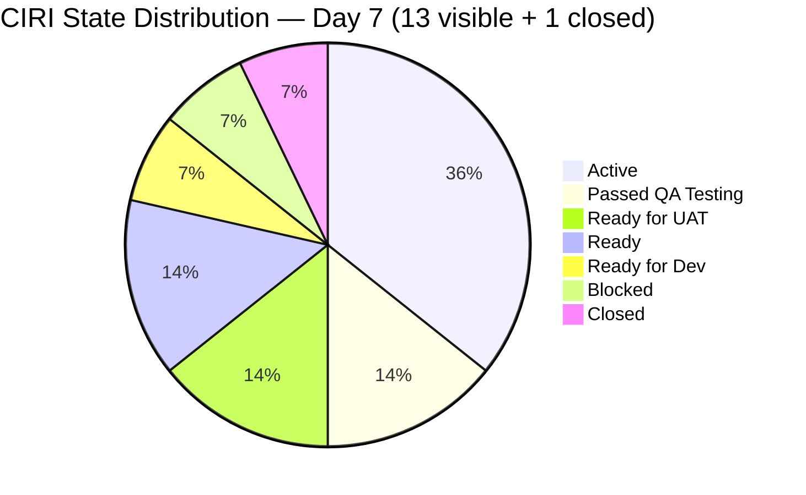
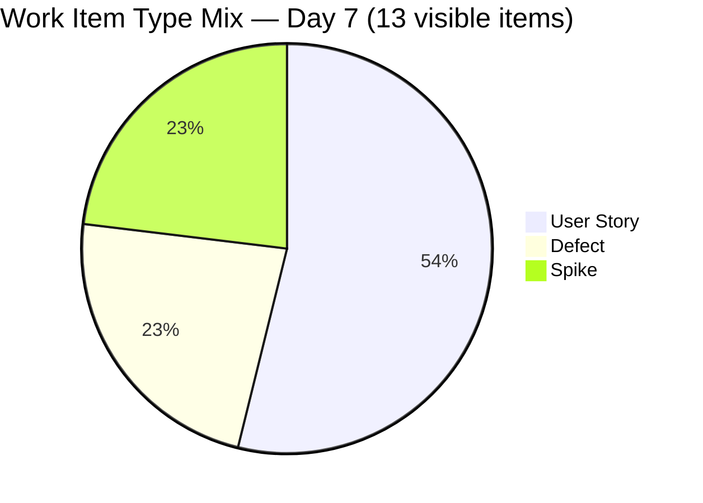
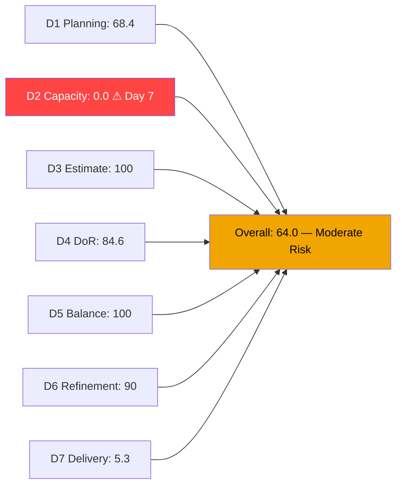
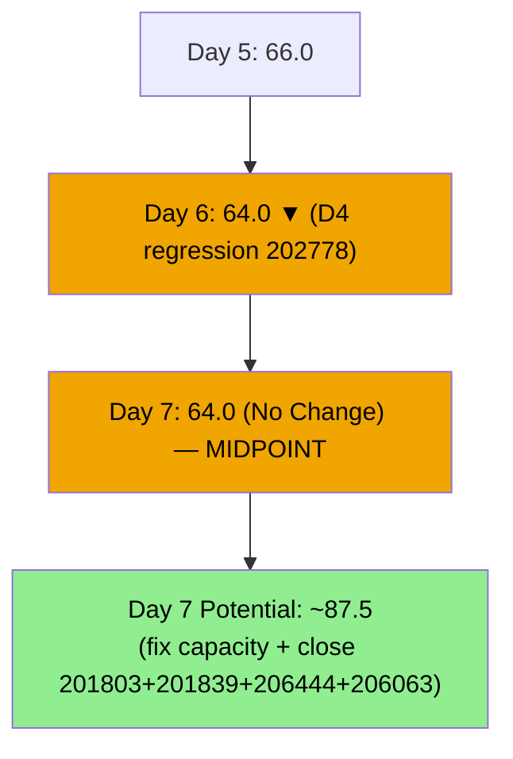
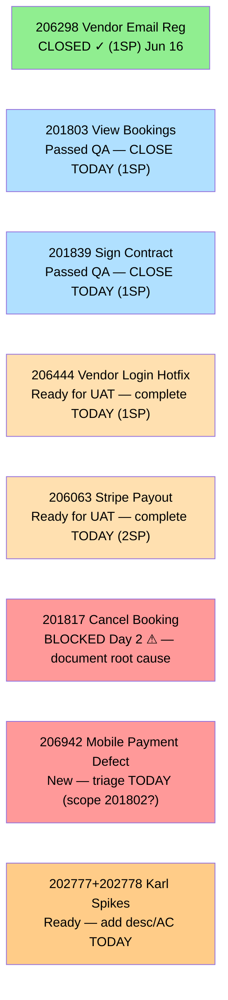

# ADO SAFe Audit — Flawless Wedding App Team

## 1. Audit Metadata

| Field | Value |
|-------|-------|
| **Audit Date** | 2026-06-21 (Sunday) — Day 7 of 14 |
| **Timezone** | PHT (UTC+8) |
| **Iteration** | Iteration 7.6 (IP) |
| **Iteration Dates** | 2026-06-15 to 2026-06-28 |
| **Sprint Day** | Day 7 — Sprint Midpoint |
| **ADO Project** | Flawless Wedding App |
| **ADO Project ID** | 92b967dc-5ec7-4874-b8f5-e43b00d88339 |
| **ADO Team** | Flawless Wedding App Team |
| **ADO Team ID** | 7d90ecbf-d272-4b0c-b33b-c66d96a790ac |
| **Iteration ID** | d40e499a-292f-4c95-a289-e755dde42b22 |
| **Workspace** | `ado_fl_dev` |
| **Prior Audit** | AUDIT_20260620_0910.md (Day 6, Iteration 7.6 IP, 64.0 — Moderate Risk) |
| **Overall Score** | **64.0 / 100** |
| **Risk Band** | **Moderate Risk** |

---

## 2. Executive Summary

The Flawless Wedding App Team **holds at 64.0 / 100 (Moderate Risk)** on Day 7 of Iteration 7.6 (IP) — **no change** from yesterday's 64.0. Zero ADO state transitions occurred since June 19. The sprint has reached its midpoint with only 1 SP formally closed of 19 committed (5.3% delivery), despite two items sitting at "Passed QA Testing" for two consecutive days.

**Midpoint position — two compounding gaps:**
1. **D2 = 0.0** — Capacity unconfigured for 7 consecutive days for all 4 team members. This single ADO oversight costs 14.3 points. A 5-minute fix today would push the overall score to ~78.3.
2. **D7 = 5.3%** — Two items (201803 and 201839) at Passed QA Testing remain in limbo, not formally closed. These 2 SP of confirmed-delivered work are invisible to the score until ADO state is updated.

**Combined quick win:** Configuring capacity + closing 201803 + closing 201839 + closing 206444 (UAT already in progress) would immediately yield:
- D2: 0.0 → 100.0 (+100)
- D7: 5.3% → 21.1% (close 201803+201839+206444 = 4 SP → 5/19)
- **Estimated score: ~80.9 (Low Risk)**

**Critical risks carried into midpoint:**
- 201817 (Cancel Booking, 2SP) — Blocked Day 7, no documented root cause
- 206942 (Mobile payment defect) — New, in PI7 root; unresolved scope impact on 201802 (3SP)
- Karl's two Spike items (202777 + 202778) — DoR gaps unresolved, untouched since June 8

---

## 3. Previous Audit Delta

**Prior audit:** AUDIT_20260620_0910.md — Iteration 7.6 IP, Day 6, Score 64.0 / 100 (Moderate Risk)

| Dimension | Day 6 | Day 7 | Delta | Driver |
|-----------|-------|-------|-------|--------|
| D1 Iteration Planning | 68.4 | **68.4** | 0.0 | VRBI=19, CIRI visible=13 — no change |
| D2 Team Capacity | 0.0 | **0.0** | 0.0 | All 4 members at 0hr/day — Day 7 still unconfigured |
| D3 Estimation | 100.0 | **100.0** | 0.0 | 13/13 visible CIRI estimated — unchanged |
| D4 DoR Compliance | 84.6 | **84.6** | 0.0 | 11/13 compliant — 202777+202778 unchanged |
| D5 Work Item Balance | 100.0 | **100.0** | 0.0 | US=53.8%; Spike=23.1%; Defect=23.1% — unchanged |
| D6 Backlog Refinement | 90.0 | **90.0** | 0.0 | 19/19 fresh; 2/13 untouched=15.4% → -10 penalty |
| D7 Delivery Predictability | 5.3 | **5.3** | 0.0 | No new closures; 201803+201839 at QA Pass but not Closed |
| **Overall** | **64.0** | **64.0** | **0.0** | Zero ADO changes since Jun 19; sprint midpoint stall |

**Significant changes since Day 6:**
- No state changes detected. The closed-item WIQL confirms only 206298 (Closed, Jun 16) — unchanged.
- **201803 (View All Bookings, 1SP)** — still at Passed QA Testing (since Jun 19 05:04). Not formally closed.
- **201839 (Sign Contract Digitally, 1SP)** — still at Passed QA Testing (since Jun 19 05:33). Not formally closed.
- **201817 (Cancel Booking, 2SP)** — still Blocked (since Jun 19 05:26). No root cause documented.
- **206444 (Vendor Login Hotfix, 1SP)** — still at Ready for UAT (since Jun 19 02:05). UAT completion pending.
- **206942 (Mobile payment defect)** — still New, in PI7 root (since Jun 19 04:56). Unresolved.
- **202777 + 202778 (Karl's Spikes)** — unchanged since Jun 08. DoR gaps persist.

---

## 4. Current Iteration Snapshot

| Attribute | Value |
|-----------|-------|
| **Active Iteration** | Iteration 7.6 (IP) |
| **Sprint Duration** | 2026-06-15 to 2026-06-28 (14 days) |
| **Audit Day** | Day 7 — Sprint Midpoint |
| **VRBI (visible root backlog items)** | 19 |
| **CIRI visible (in 7.6 IP backlog)** | 13 |
| **CIRI Closed (WIQL confirmed)** | 1 (206298, 1SP, Jun 16) |
| **CIRI Total (for D7)** | 14 |
| **CIRI — Passed QA Testing** | 2 (201803, 201839) — closure delayed Day 2 |
| **CIRI — Active** | 5 (201802, 201804, 201836, 204944, 206250) |
| **CIRI — Blocked** | 1 (201817) — Day 2 blocked |
| **CIRI — Ready for UAT** | 2 (206063, 206444) |
| **CIRI — Ready for Dev** | 1 (204755) |
| **CIRI — Ready (Spike)** | 2 (202777, 202778) |
| **Non-CIRI (PI7 root, not 7.6 IP)** | 6 (206718, 206724, 206768, 206769, 206770, 206942) |
| **Contributors with Current Work** | 3 (Luke ×9 items, Ressa ×1, Karl ×2, Jaszmine/Luzmibel QA) |
| **Contributors with Capacity** | 0 (all 4 members at 0hr/day in ADO) |
| **Committed Story Points** | 19 SP (all 14 CIRI items have SP>0) |
| **Closed Story Points** | 1 SP (206298) |
| **Delivery Rate** | 5.3% — Day 7 of 14 (linear target: 50.0%) |

**Pipeline value at Passed QA (not yet Closed):** 2 SP (201803=1, 201839=1)
**Pipeline value at Ready for UAT:** 3 SP (206063=2, 206444=1)
**Combined near-term pipeline:** 5 SP — if all close this week, D7 = 6/19 = 31.6%

---

## 5. Work Item Analysis

### Active CIRI Items — Full Detail (13 visible items)

| ID | Title | Type | State | SP | Assignee | Changed | DoR | Notes |
|----|-------|------|-------|----|----------|---------|-----|-------|
| 201802 | Initial Payment Process | US | Active | 3 | Luke | 2026-06-15 | Yes | Complex; 206942 scope risk |
| 201803 | View All Bookings | US | **Passed QA** | 1 | Luke | 2026-06-19 | Yes | **CLOSE TODAY — QA passed Jun 19** |
| 201804 | Track Booking Status | US | Active | 1 | Luke | 2026-06-19 | Yes | Activated Jun 19 |
| 201817 | Cancel Booking | US | **Blocked** | 2 | Luke | 2026-06-19 | Yes | **Day 2 Blocked — no root cause** |
| 201836 | View Contract | US | Active | 1 | Luke | 2026-06-18 | Yes | Contracts view flow |
| 201839 | Sign Contract Digitally | US | **Passed QA** | 1 | Luke | 2026-06-19 | Yes | **CLOSE TODAY — QA passed Jun 19** |
| 202777 | End PI7 Self Assessment | Spike | Ready | 0.5 | Karl | 2026-06-08 | **No** | No desc → DoR FAIL; untouched since Jun 8 |
| 202778 | Customer CSAT Survey | Spike | Ready | 0.5 | Karl | 2026-06-08 | **No** | Has desc; no AC → DoR FAIL; untouched since Jun 8 |
| 204755 | [Defect] User redirected to login on Create User | Defect | Ready for Dev | 1 | Luke | 2026-06-15 | Yes | Queued defect |
| 204944 | Manage Booking Payments | US | Active | 3 | Luke | 2026-06-18 | Yes | Complex payment management; 3 SP |
| 206063 | [Hotfix] Vendor Unable to Receive Stripe Payouts | Defect | Ready for UAT | 2 | Luke | 2026-06-17 | Yes | UAT pending Ressa/Luzmibel |
| 206250 | Iteration 7.6 — Collaborations, Reports & Others | Spike | Active | 1 | Ressa | 2026-06-15 | Yes | IP ceremonies tracking |
| 206444 | [Hotfix] Vendor Login Deleted | Defect | Ready for UAT | 1 | Luke | 2026-06-19 | Yes | UAT comment Jun 19; pending sign-off |

### Closed CIRI Item (WIQL confirmed)

| ID | Title | Type | SP | Closed Date |
|----|-------|------|----|-------------|
| 206298 | [Hotfix] Vendor Email Registration | Defect | 1 | 2026-06-16 |

### Non-CIRI Items (6 items — PI7 root, not 7.6 IP)

| ID | Title | Type | State | Changed | Notes |
|----|-------|------|-------|---------|-------|
| 206718 | 2-day notification to bride (tip/review) | US | Grooming | Jun 19 | PI7 root; active grooming |
| 206724 | Analytics — Total Traffic on website | Enabler | Grooming | Jun 17 | PI7 root |
| 206768 | [Web] Embed Calendly Link on Vendor Profile | US | Grooming | Jun 17 | PI7 root; well-defined |
| 206769 | [Web] Admin Enrollment Date & Membership Tier | US | Grooming | Jun 17 | PI7 root; well-defined |
| 206770 | Stripe API — Auto Email Alerts | Enabler | Grooming | Jun 17 | PI7 root; Xano backend |
| 206942 | [Mobile] Unable to pay initial even already linked | Defect | New | Jun 19 | PI7 root; scope risk on 201802 |

**DoR Assessment (13 visible CIRI):**
- 202777: No Description returned → FAIL
- 202778: Description "Send CSAT Survey to Joe and Shannon" (~40 chars ✓); AcceptanceCriteria field not returned → FAIL
- All other 11 items: desc ≥30 non-ws chars ✓, AC ≥20 non-ws chars ✓ → PASS
- dor_compliant = 11/13 = 84.6%

---

## 6. SAFe Compliance Scorecard

| Dimension | Score | Evidence | Notes |
|-----------|-------|----------|-------|
| D1 Iteration Planning | **68.4** | 13 visible CIRI / 19 VRBI | 206298 closed (excluded from visible); 6 non-CIRI in PI7 root |
| D2 Team Capacity | **0.0** | 0/4 contributors with capacity | **CRITICAL — Day 7; all 4 members at 0hr/day in ADO** |
| D3 Estimation | **100.0** | 13/13 visible CIRI estimated | All items have SP>0 (202777+202778 at 0.5 SP each) |
| D4 DoR Compliance | **84.6** | 11/13 compliant | 202777 (no desc), 202778 (no AC) fail |
| D5 Work Item Balance | **100.0** | US=7/13=53.8%; Defect=23.1%; Spike=23.1% | No penalty conditions; clean balance |
| D6 Backlog Refinement | **90.0** | 19/19 VRBI fresh; 0 stale; 2/13 untouched=15.4% | Base=100; -10 for untouched 10–30% |
| D7 Delivery Predictability | **5.3** | 1 SP closed / 19 SP committed | 206298 only; 201803+201839 at QA pass but not Closed |
| **Overall** | **64.0** | (68.4+0+100+84.6+100+90+5.3)/7 = 448.3/7 | **Moderate Risk** — second consecutive day unchanged |

**D1 Detail:**
- visible_root_backlog_items = 19 (backlog API)
- current_iteration_root_items (in 7.6 IP, visible) = 13 (206298 closed → excluded from visible)
- D1 = 13/19 = **68.4**

**D2 Detail:**
- contributors_with_current_work: Luke (×9 items), Ressa (×1), Karl (×2) = 3 (Jaszmine/Luzmibel have no assigned CIRI items)
- contributors_with_capacity: Luke=0hr/day, Ressa=0hr/day, Jaszmine=0hr/day, Luzmibel=0hr/day → 0 members with positive capacity
- D2 = 0/3 = **0.0**

**D4 Detail:**
- 202777: No Description field → immediate fail
- 202778: Description exists (≥30 chars ✓); AcceptanceCriteria absent → fail
- D4 = 11/13 = **84.6**

**D5 Detail:**
- US: 201802, 201803, 201804, 201817, 201836, 201839, 204944 = 7/13 = 53.8% → below 60% → no dominant penalty
- Defect: 204755, 206063, 206444 = 3/13 = 23.1%
- Spike: 202777, 202778, 206250 = 3/13 = 23.1% → below 40% → no spike penalty
- D5 = **100.0**

**D6 Detail:**
- VRBI = 19; all 19 changed after 2026-05-07 → fresh = 19/19; base = 100
- stale_90 (before 2026-03-23): 0 → no penalty
- stale_180 (before 2025-12-24): 0 → no penalty
- untouched CIRI visible (ChangedDate strictly before 2026-06-15): 202777(Jun08), 202778(Jun08) = 2/13 = 15.4% → >10% but <30% → **-10 penalty**
- D6 = 100 - 10 = **90.0**

**D7 Detail:**
- committed_story_points = 19 (sum of all 14 CIRI items with SP>0: 3+1+1+2+1+1+0.5+0.5+1+3+2+1+1+1)
- closed_story_points = 1 (206298, SP=1)
- D7 = 1/19 × 100 = **5.3%**
- 201803 (1SP) and 201839 (1SP) at Passed QA Testing — not formally Closed; will add 2 SP when ADO state updates

---

## 7. Dimension Findings

### D1 — Iteration Planning: 68.4

13 of 19 visible backlog items are in Iteration 7.6 (IP). The 6 non-CIRI items are in the PI7 root iteration path (Grooming or New states), representing PI8 candidate stories being refined. Three of these (206768, 206769, 206770) are well-defined with descriptions and acceptance criteria — appropriate PI7 grooming activity during an IP sprint.

Item 206942 (Mobile payment defect, New, PI7 root) deserves special attention: it relates to 201802 (Initial Payment Process, 3SP — the highest-SP CIRI item). If 206942 is confirmed as a sub-issue within 201802's scope, it adds complexity to the 3SP item. If it is a separate defect, it should be assigned to 7.6 IP or a future iteration.

### D2 — Team Capacity: 0.0 (CRITICAL — Day 7, Seventh Consecutive Day)

**Seven consecutive audit days with no capacity configured.** This is a systemic process failure, not an oversight. All four team members — Luke Abram Colina (Development), Ressa Paracuelles (Testing), Jaszmeine Villanueva (Design), and Luzmibel Paculanang (Testing) — remain at 0hr/day for their respective activities.

**Impact of this single gap:**
- D2 = 0.0 suppresses the overall score by 100/7 = 14.3 points
- ADO's built-in burndown, capacity warnings, and sprint velocity tracking cannot function
- Without capacity data, the team cannot assess over-commitment risk for PI8 planning

**Required action:** Navigate to ADO → Boards → Iteration 7.6 (IP) → Capacity settings → assign hours per day for each member. Suggested: Luke 6hr/day Development, Ressa 4hr/day Testing, Karl 2hr/day, Luzmibel 4hr/day Testing.

**Score impact if fixed today:** D2 becomes 100.0; overall score goes from 64.0 to **78.3** (upper Moderate Risk, near Low Risk threshold).

### D3 — Estimation: 100.0

All 13 visible CIRI items have Story Points > 0, including Karl's two Spikes at 0.5 SP each. Full SP distribution: 3 SP (×2: 201802, 204944), 2 SP (×2: 201817, 206063), 1 SP (×6: 201803, 201804, 201836, 201839, 204755, 206444, 206298), 0.5 SP (×2: 202777, 202778), 1 SP (206250). Estimation coverage is perfect and has been maintained throughout the sprint.

### D4 — DoR Compliance: 84.6

11 of 13 visible CIRI items meet DoR requirements. Two failures persist from Day 6:

1. **202777 (End PI7 Self Assessment, Karl):** No description field returned from ADO. Karl needs to add any content — even a one-sentence scope statement ("This Spike covers the end-of-PI7 team and technical agility self-assessment activities").

2. **202778 (CSAT Survey, Karl):** Description is present ("Send CSAT Survey to Joe and Shannon") but the AcceptanceCriteria field is empty. Karl needs to add criteria — for example: "Given the CSAT survey is sent to Joe and Shannon, When they respond, Then their responses are collected, documented, and accessible for team review."

Both are Karl's items, both unchanged since June 8 (13 days), and both are 5-minute fixes. Karl's action on these two items would simultaneously:
- Bring D4 from 84.6 to 100.0
- Bring D6 from 90.0 to 100.0 (removes untouched penalty)
- Raise the overall score by approximately 3.6 points (combined D4 and D6 improvement)

### D5 — Work Item Balance: 100.0

No penalty conditions triggered. US = 7/13 = 53.8% (below 60% threshold). Spikes = 3/13 = 23.1% (below 40% threshold). Defects = 3/13 = 23.1%. User Stories present (no -40 penalty). The IP sprint maintains a genuinely healthy type mix: feature development (7 US), technical debt (3 Defects), and innovation/planning activities (3 Spikes including PI ceremonies tracking, self-assessment, and CSAT survey).

### D6 — Backlog Refinement: 90.0

All 19 VRBI items are fresh (all changed after May 7, 2026). Zero stale-90 or stale-180 violations. The sole penalty comes from Karl's two Spike items (202777, 202778 — both last changed June 8, before sprint start). The untouched rate of 2/13 = 15.4% falls in the 10-30% range, triggering the -10 penalty.

Karl's DoR remediation (see D4 above) would simultaneously update both items' ChangedDate to today, removing the untouched flag and raising D6 to 100.0.

### D7 — Delivery Predictability: 5.3 (Day 7 — Midpoint Critical)

**Day 7 midpoint with only 1 SP formally closed of 19 committed.** Linear target = 50% (9.5 SP). Actual gap = 8.5 SP below target.

**Near-term high-confidence pipeline:**

1. **201803 (View All Bookings, 1SP)** — Passed QA Testing since Jun 19. Two days without formal closure. Luke or the Scrum Master must update the ADO state to Closed today. → D7 = 2/19 = 10.5%

2. **201839 (Sign Contract Digitally, 1SP)** — Passed QA Testing since Jun 19. Same situation as 201803. → D7 = 3/19 = 15.8% (combined with 201803)

3. **206444 (Vendor Login Hotfix, 1SP)** — Ready for UAT since Jun 19. UAT comment added Jun 19. Ressa or Luzmibel must complete UAT sign-off today. → D7 = 4/19 = 21.1%

4. **206063 (Stripe Payout Hotfix, 2SP)** — Ready for UAT since Jun 17. Oldest UAT item. → D7 = 6/19 = 31.6%

**If all four complete by Day 8:** D7 = 6/19 = 31.6%; overall score ≈ 73.2 (Moderate Risk, improving)
**If capacity is also configured:** Overall ≈ 87.5 (Low Risk)

**Longer-horizon items:**
- 201804 (Track Booking Status, 1SP) — Active since Jun 19; Luke working on it
- 201836 (View Contract, 1SP) — Active; contracts view flow
- 201817 (Cancel Booking, 2SP) — **Blocked**: requires root cause resolution first
- 201802 (Initial Payment Process, 3SP) — Active; highest-SP item; 206942 scope risk
- 204944 (Manage Booking Payments, 3SP) — Active; complex payment management

---

## 8. Risks and Bottlenecks

| Risk | Severity | Status |
|------|----------|--------|
| D2 = 0.0 — capacity unconfigured Day 7 (7th consecutive day) | **CRITICAL** | Highest single-item score impact; 5-minute ADO fix outstanding |
| 201803 + 201839 at Passed QA Testing 2 days — not formally Closed | **HIGH** | 2 SP of confirmed work not captured in D7; ADO update required today |
| 201817 (Cancel Booking, 2SP) — Blocked Day 2, no root cause documented | **HIGH** | 2 SP stalled; sprint midpoint with no resolution path visible |
| D7 = 5.3% at midpoint — 8.5 SP below linear target (50%) | **HIGH** | Sprint trajectory requires 2.6 SP/day over 7 days to reach 70% |
| 206063 (Stripe Payout, 2SP) at Ready for UAT since Jun 17 | **HIGH** | 5 days in UAT queue; Ressa/Luzmibel must sign off today |
| 206942 (Mobile payment defect) — scope impact on 201802 (3SP) unresolved | **HIGH** | If in-scope, 201802 complexity increases; triage overdue |
| Luke carries 9/13 CIRI items — extreme concentration risk | **HIGH** | Any Luke unavailability blocks 69% of CIRI delivery |
| 202777 + 202778 — Karl's Spikes, DoR gaps + untouched since Jun 8 | **MEDIUM** | D4 at 84.6; D6 penalty; both fixable in 10 minutes |
| 204944 (Manage Booking Payments, 3SP) — Active; complex; no progress since Jun 18 | **MEDIUM** | 3 SP of high-complexity work; needs progress visibility |

---

## 9. Prioritized Recommendations

1. **[IMMEDIATE — 5 minutes — highest ROI]** Configure capacity in ADO for all 4 team members (Iteration 7.6 IP → Capacity). Suggested: Luke 6hr/day Development, Ressa 4hr/day Testing, Karl 2hr/day Testing, Luzmibel 4hr/day Testing. **This single action raises the overall score from 64.0 to ~78.3 and enables ADO's built-in sprint analytics.**

2. **[TODAY — High Impact]** Formally close **201803 (View All Bookings, 1SP)** and **201839 (Sign Contract Digitally, 1SP)**. Both have been at Passed QA Testing since June 19. Update ADO state to Closed. These are 2 SP of confirmed, delivered work that are simply pending an ADO state update.

3. **[TODAY]** Complete UAT for **206444 (Vendor Login Hotfix, 1SP)** — Ressa or Luzmibel must sign off. UAT coordination has been in progress since June 19. Close this item today to unblock the sprint cadence.

4. **[TODAY]** Ressa or Luzmibel must complete UAT for **206063 (Stripe Payout Hotfix, 2SP)** — in Ready for UAT since June 17 (5 days). This is the highest-SP item in the UAT queue.

5. **[TODAY — Karl]** Update **202777** (add any description of the self-assessment scope) and **202778** (add acceptance criteria for CSAT survey delivery). Two 5-minute updates that resolve D4 regression and D6 untouched penalty simultaneously.

6. **[TODAY — Document]** Add a comment to **201817 (Cancel Booking, 2SP)** documenting: (a) what specifically is blocked, (b) who holds the blocker, (c) expected resolution date, (d) workaround or alternative path. Day 2 of a blocked item with no documentation is unacceptable at midpoint.

7. **[TODAY]** Triage **206942 (Mobile: Unable to pay initial payment)** against **201802 (Initial Payment Process, 3SP)**. Determine: Is this a sub-scenario within 201802's acceptance criteria? If yes — 201802 scope is confirmed extended. If no — assign 206942 to 7.6 IP with SP and iteration, or defer to PI8. Either way, the ambiguity must be resolved today.

8. **[Day 8-9]** Luke should advance **201802 (Initial Payment Process, 3SP)** to Ready for UAT — the highest-SP item in the sprint. 11 acceptance criteria are defined; implementation should be progressing toward completion.

9. **[Process — permanent fix]** Enforce same-day ADO state updates. Items 201803 and 201839 passed QA on June 19 and remain unclosed on June 21. The team's delivery score is understated, and sprint reporting is inaccurate. ADO must reflect the team's actual progress in real time.

---

## 10. Evidence Gaps and Limitations

| Gap | Impact | Mitigation |
|-----|--------|-----------|
| D2 = 0.0 due to ADO capacity = 0hr/day — actual hours unknown | Score structurally penalized 14.3 points; team hours invisible to ADO | Must be fixed in ADO immediately |
| 201803 + 201839 at Passed QA Testing — not formally Closed | 2 SP confirmed-delivered not captured in D7 | ADO state update today; will appear in Day 8 audit |
| 202778 AcceptanceCriteria absent — empty vs. not returned | DoR assessed as fail; same outcome either way | Karl to add content; resolves ambiguity |
| 206942 scope impact on 201802 unconfirmed | Potential 3 SP delivery risk if scope expands | Triage required; no score change until confirmed |
| Karl's Luzmibel: assigned as Jaszmine Villanueva (jvillanueva) in capacity vs. "Luzmibel Paculanang (lpaculanang)" both in team | Two distinct people; Jaszmine (Design) and Luzmibel (Testing) are separate contributors | Luzmibel carries QA items per prior audits; both at 0hr/day |
| CIRI visible count (13) excludes closed 206298 — D7 uses all 14 CIRI | D1 uses visible only; D7 requires full CIRI count including closed | Consistent with rubric; methodology documented |

---

