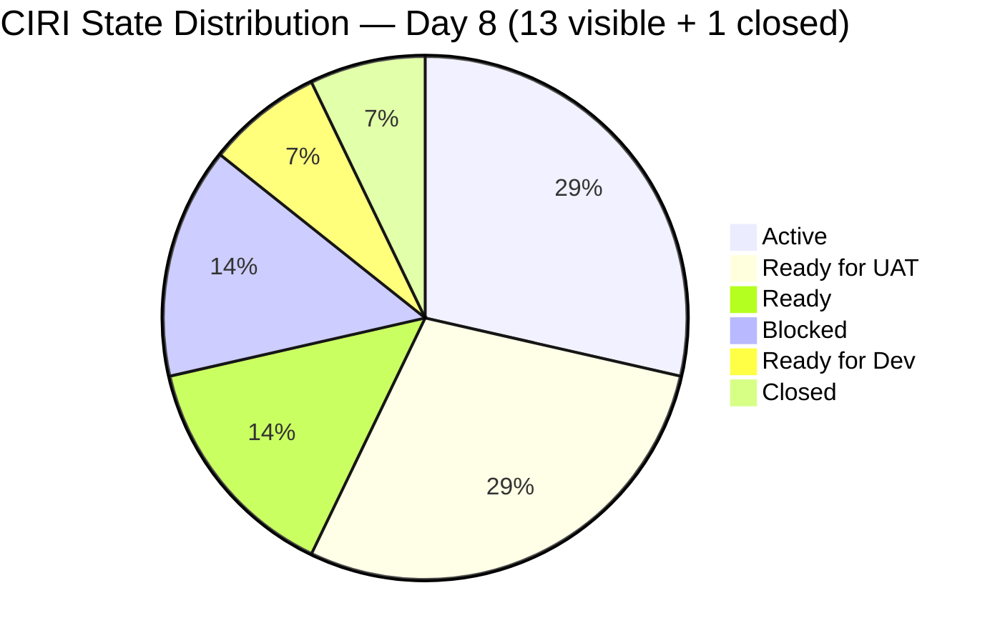
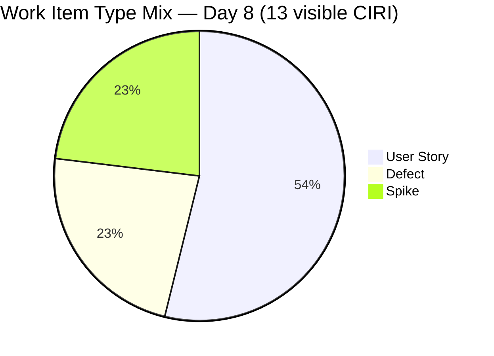
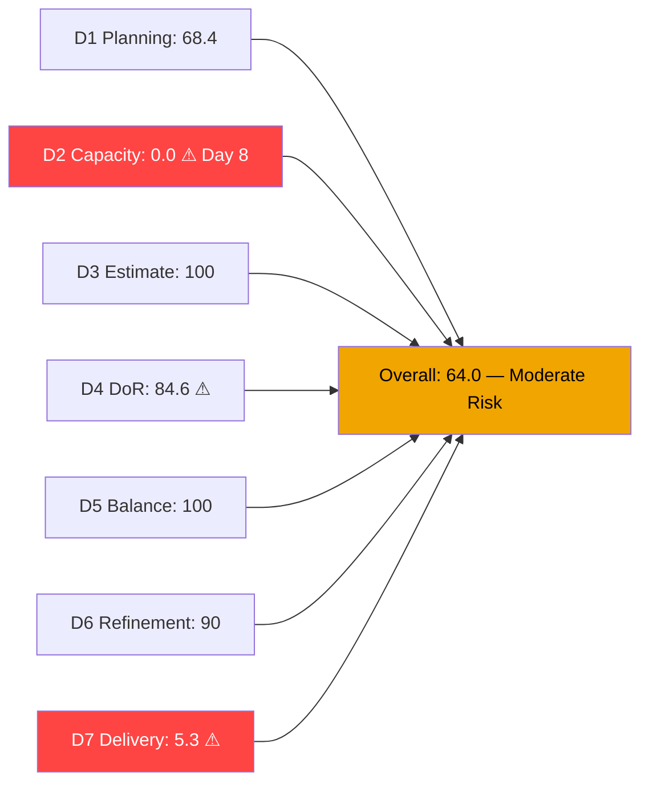
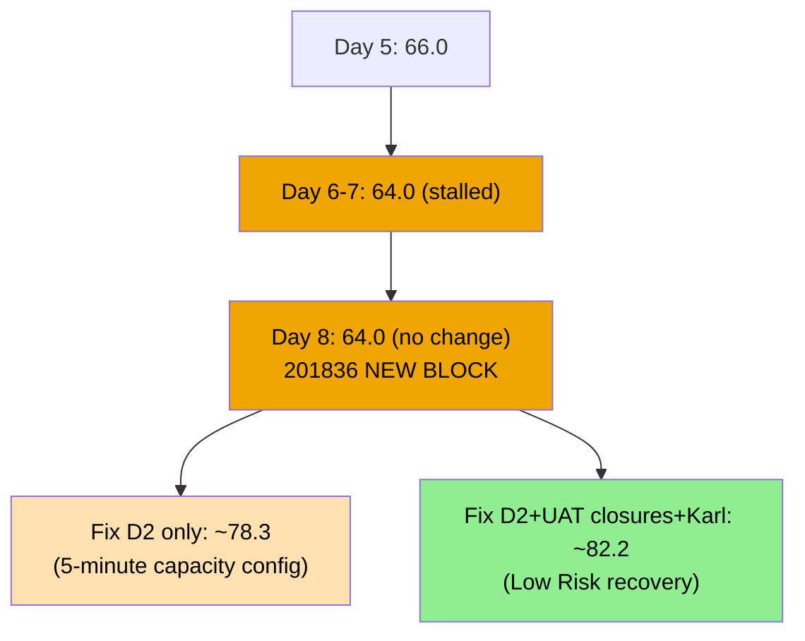
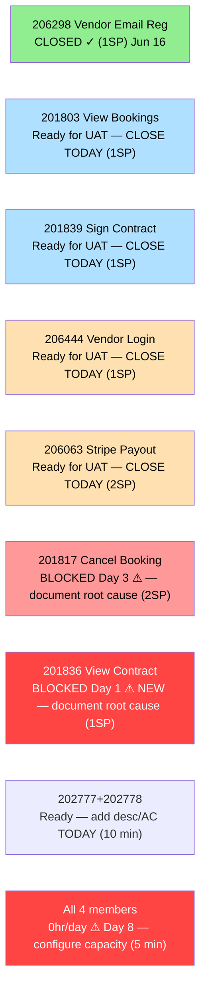

# ADO SAFe Audit — Flawless Wedding App Team

## 1. Audit Metadata

| Field | Value |
|-------|-------|
| **Audit Date** | 2026-06-22 (Monday) — Day 8 of 14 |
| **Timezone** | UTC (audit timestamp) / PHT (team) |
| **Iteration** | Iteration 7.6 (IP) |
| **Iteration Dates** | 2026-06-15 to 2026-06-28 |
| **Sprint Day** | Day 8 — Post-Midpoint |
| **ADO Project** | Flawless Wedding App |
| **ADO Project ID** | 92b967dc-5ec7-4874-b8f5-e43b00d88339 |
| **ADO Team** | Flawless Wedding App Team |
| **ADO Team ID** | 7d90ecbf-d272-4b0c-b33b-c66d96a790ac |
| **Iteration ID** | d40e499a-292f-4c95-a289-e755dde42b22 |
| **Workspace** | `ado_fl_dev` |
| **Prior Audit** | AUDIT_20260621_0910.md (Day 7, Iteration 7.6 IP, 64.0 — Moderate Risk) |
| **Overall Score** | **64.0 / 100** |
| **Risk Band** | **Moderate Risk** |

---

## 2. Executive Summary

The Flawless Wedding App Team holds at **64.0 / 100 (Moderate Risk)** on Day 8 of Iteration 7.6 (IP) — **no change** from yesterday's 64.0. State transitions did occur overnight, but they do not yet produce score improvements: 201803 and 201839 progressed from "Passed QA Testing" to "Ready for UAT" (still not formally Closed), and 201836 (View Contract, 1SP) regressed to **Blocked** — raising the blocked count from 1 to 2 and signaling a new development impediment.

**Three structural blockers continue to suppress the score:**
1. **D2 = 0.0** — All 4 team members at 0hr/day for 8 consecutive days. This single unconfigured ADO setting costs 14.3 points. Fixing it takes 5 minutes.
2. **D7 = 5.3%** — Only 1 SP formally closed of 19 committed. Two items (201803, 201839) are at Ready for UAT and should close as soon as UAT sign-off is confirmed.
3. **New risk: 201836 Blocked** — View Contract (1SP) was Active yesterday and is now Blocked on Day 8. A second blocked item alongside 201817 (Cancel Booking, now Day 3 blocked) raises the unresolved impediment count to 2.

**Immediate impact scenario:** Configure capacity + close 201803 + close 201839 + close 206444 today → D2=100, D7=21.1%; estimated overall score ~**78.4** (Moderate Risk, significantly improved; near Low Risk threshold). Additionally resolving Karl's two Spike DoR gaps would push to ~82.2 (Low Risk).

---

## 3. Previous Audit Delta

**Prior audit:** AUDIT_20260621_0910.md — Iteration 7.6 IP, Day 7, Score 64.0 / 100 (Moderate Risk)

| Dimension | Day 7 | Day 8 | Delta | Driver |
|-----------|-------|-------|-------|--------|
| D1 Iteration Planning | 68.4 | **68.4** | 0.0 | VRBI=19, CIRI=13 — no structural change |
| D2 Team Capacity | 0.0 | **0.0** | 0.0 | All 4 members at 0hr/day — **Day 8 unconfigured** |
| D3 Estimation | 100.0 | **100.0** | 0.0 | 13/13 visible CIRI estimated — unchanged |
| D4 DoR Compliance | 84.6 | **84.6** | 0.0 | 202777 (no desc), 202778 (no AC) still failing |
| D5 Work Item Balance | 100.0 | **100.0** | 0.0 | Type mix unchanged |
| D6 Backlog Refinement | 90.0 | **90.0** | 0.0 | 2/13 untouched (202777+202778 — Jun 08) → -10 |
| D7 Delivery Predictability | 5.3 | **5.3** | 0.0 | No new closures; 201803+201839 still not Closed |
| **Overall** | **64.0** | **64.0** | **0.0** | Zero score change despite state transitions |

**Significant changes since Day 7:**
- **201803 (View All Bookings, 1SP)** — State: Passed QA Testing → **Ready for UAT** (changed Jun 21). Progressed but not formally Closed. D7 impact: none yet.
- **201839 (Sign Contract Digitally, 1SP)** — State: Passed QA Testing → **Ready for UAT** (changed Jun 21). Same situation as 201803.
- **201836 (View Contract, 1SP)** — State: **Active → Blocked** (changed Jun 22). A new block was introduced today. This is a regression.
- **206942 (Mobile: Unable to pay initial payment, Defect)** — ChangedDate Jun 21 (was Jun 19); state still New, SP=1, assigned Luke; still in PI7 root. Triage not completed.
- **206923 (AA Invoice — Finance)** — appeared in backlog API cross-project; confirmed scoped to Finance team only (different AreaPath/project).
- Karl's items (202777, 202778): unchanged since Jun 08. DoR gaps persist at Day 8.

---

## 4. Current Iteration Snapshot

| Attribute | Value |
|-----------|-------|
| **Active Iteration** | Iteration 7.6 (IP) |
| **Sprint Duration** | 2026-06-15 to 2026-06-28 (14 days) |
| **Audit Day** | Day 8 — Post-Midpoint |
| **VRBI (visible root backlog items)** | 19 |
| **CIRI visible (in 7.6 IP)** | 13 |
| **CIRI Closed (confirmed)** | 1 (206298, 1SP) |
| **CIRI Total (for D7)** | 14 |
| **CIRI — Ready for UAT** | 2 (201803, 201839) — formerly Passed QA Testing |
| **CIRI — Active** | 4 (201802, 201804, 204944, 206250) |
| **CIRI — Blocked** | 2 (201817 — Day 3, 201836 — Day 1 NEW) |
| **CIRI — Ready for UAT (Defect)** | 2 (206063, 206444) |
| **CIRI — Ready for Dev** | 1 (204755) |
| **CIRI — Ready (Spike)** | 2 (202777, 202778) |
| **Non-CIRI (PI7 root)** | 6 (206718, 206724, 206768, 206769, 206770, 206942) |
| **Contributors with Current Work** | 3 (Luke ×10 items, Ressa ×1, Karl ×2) |
| **Contributors with Capacity** | 0 (all 4 at 0hr/day) |
| **Committed Story Points** | 19 SP |
| **Closed Story Points** | 1 SP (206298) |
| **Delivery Rate** | 5.3% — Day 8 of 14 (linear target: 57.1%) |

**New concern — second blocked item:** 201836 (View Contract) moved to Blocked on Jun 22. Combined with 201817 (Cancel Booking, Blocked since Jun 19), the team now has 2 blocked items totaling 3 SP (201817=2SP + 201836=1SP). These blocks require immediate root cause documentation and resolution.

**Near-term pipeline (items closest to closure):**
- 201803 + 201839 at Ready for UAT: 2 SP — need UAT sign-off
- 206444 at Ready for UAT: 1 SP — UAT pending
- 206063 at Ready for UAT: 2 SP — oldest UAT item (Day 5 waiting)

---

## 5. Work Item Analysis

### CIRI Items — Full Detail (13 visible items)

| ID | Title | Type | State | SP | Assignee | Changed | DoR | Notes |
|----|-------|------|-------|----|----------|---------|-----|-------|
| 201802 | Initial Payment Process | US | Active | 3 | Luke | Jun 15 | Yes | Complex; 206942 scope risk unresolved |
| 201803 | View All Bookings | US | **Ready for UAT** | 1 | Luke | **Jun 21** | Yes | **Progressed from Passed QA; needs UAT sign-off** |
| 201804 | Track Booking Status | US | Active | 1 | Luke | Jun 19 | Yes | Active since Jun 19 |
| 201817 | Cancel Booking | US | **Blocked** | 2 | Luke | Jun 19 | Yes | **Day 3 Blocked — no root cause documented** |
| 201836 | View Contract | US | **Blocked** | 1 | Luke | **Jun 22** | Yes | **NEW Block — Day 1 (as of Jun 22)** |
| 201839 | Sign Contract Digitally | US | **Ready for UAT** | 1 | Luke | **Jun 21** | Yes | **Progressed from Passed QA; needs UAT sign-off** |
| 202777 | End PI7 Self Assessment | Spike | Ready | 0.5 | Karl | Jun 08 | **No** | No Description → DoR FAIL; untouched 14 days |
| 202778 | Customer CSAT Survey | Spike | Ready | 0.5 | Karl | Jun 08 | **No** | Has desc; No AC → DoR FAIL; untouched 14 days |
| 204755 | [Defect] User redirected to login on Create User | Defect | Ready for Dev | 1 | Luke | Jun 15 | Yes | Queued; no dev progress |
| 204944 | Manage Booking Payments | US | Active | 3 | Luke | Jun 18 | Yes | Complex (3SP); no progress since Jun 18 |
| 206063 | [Hotfix] Vendor Unable to Receive Stripe Payouts | Defect | Ready for UAT | 2 | Luke | Jun 17 | Yes | UAT pending 5 days — oldest in queue |
| 206250 | Iteration 7.6 — Collaborations, Reports & Others | Spike | Active | 1 | Ressa | Jun 15 | Yes | IP ceremonies tracking; ongoing |
| 206444 | [Hotfix] Vendor Login Deleted | Defect | Ready for UAT | 1 | Luke | Jun 19 | Yes | UAT coordination ongoing |

### Closed CIRI Item (confirmed)

| ID | Title | Type | SP | Closed |
|----|-------|------|----|--------|
| 206298 | [Hotfix] Vendor Email Registration | Defect | 1 | Jun 16 |

### Non-CIRI Items (6 items — PI7 root)

| ID | Title | Type | State | Changed | Notes |
|----|-------|------|-------|---------|-------|
| 206718 | 2-day notification to bride (tip/review) | US | Grooming | Jun 19 | PI8 candidate |
| 206724 | Analytics — Total Traffic | Enabler | Grooming | Jun 17 | PI8 candidate |
| 206768 | [Web] Embed Calendly Link | US | Grooming | Jun 17 | Well-defined PI8 candidate |
| 206769 | [Web] Admin Enrollment Date & Tier | US | Grooming | Jun 17 | Well-defined PI8 candidate |
| 206770 | Stripe API Auto Email Alerts | Enabler | Grooming | Jun 17 | Well-defined PI8 candidate |
| 206942 | [Mobile] Unable to pay initial payment | Defect | New | **Jun 21** | SP=1; scope risk on 201802 (3SP) |

---

## 6. SAFe Compliance Scorecard

| Dimension | Score | Evidence | Notes |
|-----------|-------|----------|-------|
| D1 Iteration Planning | **68.4** | 13 CIRI / 19 VRBI | 6 non-CIRI in PI7 root; 206298 closed excluded from visible |
| D2 Team Capacity | **0.0** | 0/3 contributors with capacity | **CRITICAL — Day 8; all 4 at 0hr/day** |
| D3 Estimation | **100.0** | 13/13 visible CIRI estimated | All items SP>0 (202777+202778 at 0.5 SP) |
| D4 DoR Compliance | **84.6** | 11/13 compliant | 202777 (no desc), 202778 (no AC) — unchanged since Jun 08 |
| D5 Work Item Balance | **100.0** | US=7/13=53.8%; Defect=23.1%; Spike=23.1% | No penalty conditions triggered |
| D6 Backlog Refinement | **90.0** | 19/19 fresh; 0 stale; 2/13 untouched=15.4% | -10 for untouched 10-30% (202777+202778) |
| D7 Delivery Predictability | **5.3** | 1 SP closed / 19 SP committed | Only 206298; 201803+201839 at Ready for UAT not Closed |
| **Overall** | **64.0** | (68.4+0+100+84.6+100+90+5.3)/7 = 448.3/7 | **Moderate Risk** — eighth consecutive day at 0.0 for D2 |

**D1 Detail:**
- visible_root_backlog_items = 19
- current_iteration_root_items (visible in 7.6 IP) = 13 (206298 closed → excluded from visible)
- D1 = 13/19 = **68.4**

**D2 Detail:**
- contributors_with_current_work = 3 (Luke: 10 items, Ressa: 1, Karl: 2)
- contributors_with_capacity = 0 (Luke=0hr/day, Ressa=0hr/day, Jaszmine=0hr/day, Luzmibel=0hr/day)
- D2 = 0/3 = **0.0**

**D4 Detail:**
- 202777: System.Description field absent in ADO response → FAIL (no content at all)
- 202778: Description = "Send CSAT Survey to Joe and Shannon" (~40 chars, ✓); System.AcceptanceCriteria absent → FAIL
- All other 11 items: desc ≥30 non-ws chars ✓, AC ≥20 non-ws chars ✓ → PASS
- D4 = 11/13 = **84.6**

**D5 Detail:**
- US: 201802, 201803, 201804, 201817, 201836, 201839, 204944 = 7/13 = 53.8% → below 60% → no dominant penalty
- Defect: 204755, 206063, 206444 = 3/13 = 23.1%
- Spike: 202777, 202778, 206250 = 3/13 = 23.1% → below 40% → no spike penalty
- US present → no -40 penalty
- D5 = **100.0**

**D6 Detail:**
- VRBI = 19; all 19 changed after 2026-05-08 → fresh = 19/19; base = 100
- stale_90 (before 2026-03-24): 0 → no penalty
- stale_180 (before 2025-12-24): 0 → no penalty
- untouched CIRI (13 items, changed before 2026-06-15): 202777(Jun 08), 202778(Jun 08) = 2/13 = 15.4% → >10% but <30% → **-10 penalty**
- D6 = 100 - 10 = **90.0**

**D7 Detail:**
- committed_SP = 19 (all 14 CIRI items SP>0: includes 206298)
- closed_SP = 1 (206298)
- D7 = 1/19 × 100 = **5.3%**
- 201803 (1SP) and 201839 (1SP) at Ready for UAT — not Closed/Done; 2 SP pending formal UAT sign-off

---

## 7. Dimension Findings

### D1 — Iteration Planning: 68.4

13 of 19 visible backlog items are in Iteration 7.6 (IP). The 6 non-CIRI items in the PI7 root represent PI8 candidate stories in active grooming, which is appropriate for an IP sprint. Three Grooming items (206768, 206769, 206770) are well-defined with rich descriptions and AC — they are close to DoR-ready for PI8 planning. Item 206942 (Mobile payment defect) remains in the PI7 root with SP=1 assigned to Luke — triage against 201802 is still overdue.

### D2 — Team Capacity: 0.0 (CRITICAL — Day 8, Eighth Consecutive Day)

Eight consecutive audit days with no capacity configured. This is now a persistent systemic failure that has cost the team 14.3 points every day of this sprint. All four members — Luke Abram Colina (Development), Ressa Paracuelles (Testing), Jaszmeine Villanueva (Design), and Luzmibel Paculanang (Testing) — remain at 0hr/day.

**This is the single highest-ROI action available to the team.** Navigating to ADO Boards → Iteration 7.6 (IP) → Capacity → setting hours for each member takes approximately 5 minutes and immediately improves the overall score from 64.0 to ~78.3. The team has collectively forfeited more than 100 scoring points over 8 days by not addressing this.

**Suggested configuration:** Luke 6hr/day Development, Ressa 4hr/day Testing, Luzmibel 4hr/day Testing, Karl 2hr/day Testing.

### D3 — Estimation: 100.0

All 13 visible CIRI items have story points > 0. Karl's Spikes (202777, 202778) at 0.5 SP each are counted as estimated. This strength has been consistent throughout the sprint and reflects the team's discipline on upfront sizing.

### D4 — DoR Compliance: 84.6 (Persistent Gap — Day 8, 14 Days Since Last Update)

Two Spike items assigned to Karl have been in DoR non-compliance since June 8 — **14 consecutive days**. Both items are Ready (not yet picked up), so there is no technical reason for the gap.

**202777 (End PI7 Self Assessment, 0.5SP):** No Description field returned. Even a one-sentence scope statement fulfills the rubric requirement. Example: "This Spike covers the end-of-PI7 team and technical agility self-assessment activities per SAFe practice."

**202778 (Customer CSAT Survey, 0.5SP):** Description present ("Send CSAT Survey to Joe and Shannon" — sufficient). Missing only AcceptanceCriteria. Example: "Given the CSAT survey is sent to Joe and Shannon, When they respond, Then their survey responses are collected and documented for PI8 retrospective use."

**Combined impact of Karl fixing both items today:**
- D4: 84.6 → 100.0 (+15.4 → +2.2 points overall)
- D6: 90.0 → 100.0 (removes untouched penalty: +10 → +1.4 points overall)
- **Overall improvement if capacity also configured: 64.0 → ~82.2 (Low Risk)**

Karl's two 5-minute fixes, combined with capacity configuration, would move the team from Moderate to Low Risk today.

### D5 — Work Item Balance: 100.0

The IP sprint maintains a healthy type distribution: 7 User Stories (feature development), 3 Defects (hotfixes and technical debt), and 3 Spikes (PI ceremonies, self-assessment, CSAT). No penalty conditions triggered. US share (53.8%) is below the 60% dominant threshold. Spike share (23.1%) is well below the 40% ceiling.

### D6 — Backlog Refinement: 90.0

All 19 VRBI items are fresh. Zero stale violations. The sole -10 penalty comes from Karl's two Spike items (202777, 202778) unchanged since June 8 — the same items causing the D4 failure. Addressing Karl's DoR gaps would simultaneously eliminate the D6 penalty (both items would receive new ChangedDates, removing them from the untouched pool and bringing untouched from 15.4% to 0%).

### D7 — Delivery Predictability: 5.3 (Day 8 — Critical)

**Eight days into the sprint with only 1 SP formally closed of 19 committed.** The linear target at Day 8 is 57.1% (10.9 SP). The team is 9.9 SP below the linear target.

**Key state changes since yesterday that do NOT yet improve D7:**
- 201803 and 201839 are now at **Ready for UAT** (was "Passed QA Testing"). These items need formal UAT sign-off (state = Closed/Done) to count. The team has confirmed these items work — the delay is purely administrative.
- 201836 moved to **Blocked** — a regression from Active. This adds a third item to the blocked/stalled category alongside 201817.

**Delivery pipeline assessment:**

| Item | SP | State | Action Required | Target |
|------|----|----|-----------------|--------|
| 201803 View All Bookings | 1 | Ready for UAT | Ressa/Luzmibel complete UAT, close today | Day 8 |
| 201839 Sign Contract Digitally | 1 | Ready for UAT | Complete UAT, close today | Day 8 |
| 206444 Vendor Login Hotfix | 1 | Ready for UAT | Complete UAT sign-off | Day 8 |
| 206063 Stripe Payout Hotfix | 2 | Ready for UAT | Complete UAT sign-off (Day 5 in queue) | Day 8-9 |
| 201804 Track Booking Status | 1 | Active | Luke advance to Dev complete / UAT | Day 9-10 |
| 204944 Manage Booking Payments | 3 | Active | Luke advance; complex 3SP item | Day 10-12 |
| 201802 Initial Payment Process | 3 | Active | Luke advance; resolve 206942 scope | Day 11-13 |
| 201836 View Contract | 1 | **Blocked** | Document root cause; unblock today | Day 9 |
| 201817 Cancel Booking | 2 | **Blocked** | Root cause still undocumented | Day 9-10 |

**If UAT items close today (201803+201839+206444+206063):** D7 = 6/19 = 31.6%; overall ≈ 73.1 (Moderate Risk improving).
**If capacity also configured:** overall ≈ 87.4 (Low Risk).

---

## 8. Risks and Bottlenecks

| Risk | Severity | Status |
|------|----------|--------|
| D2 = 0.0 — capacity unconfigured 8 consecutive days | **CRITICAL** | Highest single-point loss; 5-minute fix still outstanding |
| 201836 (View Contract, 1SP) — NEW block on Day 8 | **CRITICAL** | Regression from Active→Blocked; root cause unknown |
| 201817 (Cancel Booking, 2SP) — Day 3 blocked, no root cause | **HIGH** | 3 days with no documented resolution path |
| D7 = 5.3% — 9.9 SP below linear target at Day 8 | **HIGH** | Requires 3.0 SP/day over 6 days for 70% target |
| 201803 + 201839 at Ready for UAT — not formally closed | **HIGH** | 2 SP confirmed-delivered pending admin closure |
| 206063 (Stripe Payout, 2SP) at Ready for UAT since Jun 17 | **HIGH** | 5 days in UAT queue — 6 days as of today |
| Luke carries 10/13 CIRI items — extreme concentration risk | **HIGH** | Any unavailability blocks 77% of CIRI delivery |
| 206942 (Mobile payment defect) — scope risk on 201802 (3SP) | **HIGH** | Triage still not completed after 3 days |
| 202777+202778 — Karl's Spikes, DoR+untouched since Jun 08 | **MEDIUM** | D4+D6 penalty; fixable in 10 minutes |
| 204944 (Manage Booking Payments, 3SP) — Active, no progress | **MEDIUM** | 3 SP high-complexity; needs Luke attention |

---

## 9. Prioritized Recommendations

1. **[IMMEDIATE — 5 minutes — highest ROI ever]** Configure ADO capacity for all 4 members (Iteration 7.6 IP → Capacity). Luke 6hr/day Dev, Ressa 4hr/day Testing, Luzmibel 4hr/day Testing, Karl 2hr/day Testing. **This is Day 8 — the team has now forfeited 8×14.3 = 114.4 score-days of impact.** Every additional day without this change costs the team 14.3 points in D2.

2. **[IMMEDIATE — document and unblock]** Add a comment to **201836 (View Contract, 1SP)** explaining: (a) why it moved to Blocked today, (b) what specifically is blocking it, (c) who holds the resolution, (d) expected unblock date. A block without documentation is an invisible risk. Then actively work to unblock it before Day 9.

3. **[TODAY]** Complete UAT and close **201803 (View All Bookings, 1SP)** and **201839 (Sign Contract Digitally, 1SP)** — both at Ready for UAT. Ressa or Luzmibel must execute the UAT test cases defined in each item's AC and transition to Closed. Two confirmed-delivered features are waiting for a state click.

4. **[TODAY]** Complete UAT for **206063 (Stripe Payout Hotfix, 2SP)** — in Ready for UAT since June 17 (6 days). This is the highest-SP item in the UAT queue and the longest-waiting. Priority for Ressa or Luzmibel.

5. **[TODAY]** Complete UAT for **206444 (Vendor Login Hotfix, 1SP)** — Ready for UAT since June 19. Combined with 206063, closing both UAT defects today adds 3 SP.

6. **[TODAY — Karl]** Update **202777** (add description — any scope statement) and **202778** (add acceptance criteria — delivery conditions for CSAT survey). Two 5-minute actions that together resolve D4 to 100.0 and D6 to 100.0, adding ~3.6 points to the overall score.

7. **[TODAY — document root cause]** Add a blocking comment to **201817 (Cancel Booking, 2SP)** — now Day 3 blocked. What is specifically blocked? Which service, API, or dependency? Who is responsible for resolution? Is there a workaround path? Day 3 of a blocked item with no documentation is a sprint risk without mitigation.

8. **[TODAY — triage]** Resolve the scope question on **206942 (Mobile: Unable to pay initial payment)** against **201802 (Initial Payment Process, 3SP)**. Is 206942 a new defect or a sub-scenario of 201802? If it is in-scope for 201802, close 206942 as a duplicate. If it is a separate defect, assign it to 7.6 IP with SP, or defer to PI8. Three days of ambiguity on the highest-SP item in the sprint is unacceptable.

9. **[Day 8-10]** Luke must advance **201804 (Track Booking Status, 1SP)** and **201836 (View Contract, 1SP)** — both are small items (1SP each) that should be resolvable quickly once unblocked.

10. **[Process — ADO real-time discipline]** Items passing QA should transition to Closed the same day, not wait in "Passed QA" or "Ready for UAT" limbo. Every day of delay suppresses the team's reported delivery score and creates audit evidence gaps.

---

## 10. Evidence Gaps and Limitations

| Gap | Impact | Mitigation |
|-----|--------|-----------|
| D2 = 0.0 — ADO capacity at 0hr/day for all members | Score suppressed 14.3 points; actual work hours unknown to ADO | Configure capacity immediately |
| 201803+201839 at Ready for UAT — not Closed | 2 SP confirmed-delivered not in D7 numerator | UAT sign-off and closure today will appear in Day 9 audit |
| 201836 moved to Blocked today — root cause unknown | Delivery risk; 1 SP stalled; no resolution path visible | Document immediately in ADO |
| 206942 scope impact on 201802 — unresolved | Potential 3 SP delivery risk if scope expands or 201802 is blocked | Triage required; no score change until confirmed |
| 202778 AC absent — empty vs. not returned | DoR fail assessed correctly either way | Karl to add AC content |
| 201817 Blocked Day 3 — no documented root cause | 2 SP stalled; mitigation path unknown | Add blocking comment today |
| CIRI count discrepancy: D1 uses visible(13); D7 uses all CIRI(14 including 206298) | Consistent with rubric; methodology documented | No issue — correct per rubric definition |

---

