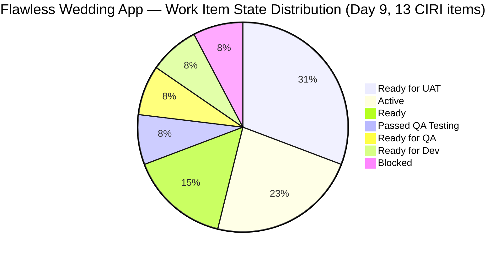
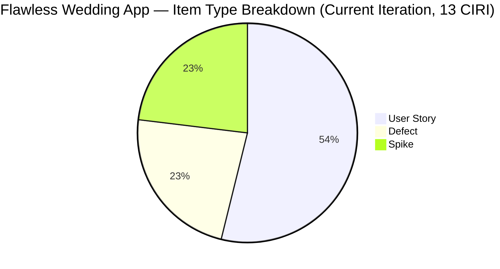
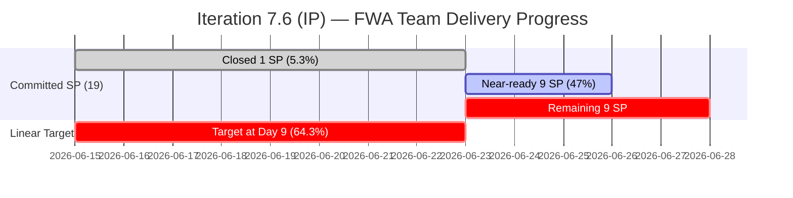
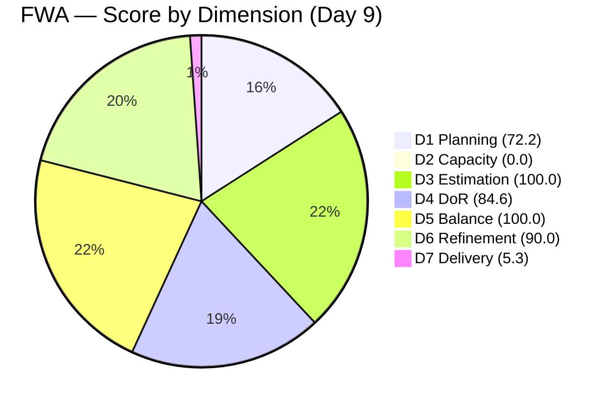

# ADO SAFe Audit — Flawless Wedding App Team

## 1. Audit Metadata

| Field | Value |
|-------|-------|
| **Audit Date** | 2026-06-23 (Tuesday) — Day 9 of 14 |
| **Timezone** | UTC (audit timestamp) / PHT (team local) |
| **Iteration** | Iteration 7.6 (IP) |
| **Iteration Dates** | 2026-06-15 to 2026-06-28 |
| **Sprint Day** | Day 9 — Post-Midpoint, 5 working days remaining |
| **ADO Project** | Flawless Wedding App |
| **ADO Project ID** | 92b967dc-5ec7-4874-b8f5-e43b00d88339 |
| **ADO Team** | Flawless Wedding App Team |
| **ADO Team ID** | 7d90ecbf-d272-4b0c-b33b-c66d96a790ac |
| **Iteration ID** | d40e499a-292f-4c95-a289-e755dde42b22 |
| **Workspace** | `ado_fl_dev` |
| **Prior Audit** | AUDIT_20260622_0904.md (Day 8, Iteration 7.6 IP, 64.0 — Moderate Risk) |
| **Overall Score** | **64.6 / 100** |
| **Risk Band** | **Moderate Risk** |

---

## 2. Executive Summary

The Flawless Wedding App Team improves marginally to **64.6 / 100 (Moderate Risk)** on Day 9 of Iteration 7.6 (IP) — a gain of **+0.6 points** from yesterday's 64.0. The improvement reflects a slightly higher D1 score from a revised VRBI count (18 vs. prior 19), and two meaningful state transitions overnight that are not yet captured in the score:

**Positive overnight developments (Day 8 → Day 9):**
- **201836 (View Contract, 1SP)** — Unblocked; state advanced to **Passed QA Testing** (changed Jun 23). This reverses the regression reported on Day 8.
- **201817 (Cancel Booking, 2SP)** — State returned to **Active** (changed Jun 23). The block that persisted for Days 6–8 appears to have been resolved.
- **201802 (Initial Payment Process, 3SP)** — Still Blocked but was touched today (Jun 23), suggesting active investigation.
- **204944 (Manage Booking Payments, 3SP)** — Advanced to **Ready for QA** (changed Jun 23). Moving through the pipeline.

**Three structural issues remain unchanged:**
1. **D2 = 0.0** — ADO capacity still at 0 hr/day for all team members. Day 9 with no capacity configured. This single issue costs 14.3 points. Five-minute fix.
2. **D7 = 5.3%** — Only 1 SP (206298, closed Defect) formally in Closed/Done state. 201836 at Passed QA Testing and 201803/201839 at Ready for UAT could convert to closed with QA sign-off.
3. **202777/202778 DoR gaps** — Karl's two Spike items still missing Description (202777) and Acceptance Criteria (202778), unchanged since Jun 08.

**Immediate impact scenario:** Configure capacity (D2→100) + close 201803, 201839 (UAT-ready), 201836 (QA-passed) → D2=100, D7=21.1%; estimated overall ~**79.5 (Moderate, near Low threshold)**. Additionally adding AC to 202778 → D4→92.3, overall ~**80.3 (Low Risk)**.

---

## 3. Previous Audit Delta

**Prior audit:** AUDIT_20260622_0904.md — Iteration 7.6 IP, Day 8, Score 64.0 / 100 (Moderate Risk)

| Dimension | Day 8 | Day 9 | Delta | Driver |
|-----------|-------|-------|-------|--------|
| D1 Iteration Planning | 68.4 | **72.2** | **+3.8** | VRBI now 18 (live backlog); CIRI=13; 13/18=72.2% |
| D2 Team Capacity | 0.0 | **0.0** | 0.0 | All contributors at 0hr/day — **Day 9 unconfigured** |
| D3 Estimation | 100.0 | **100.0** | 0.0 | 13/13 CIRI items estimated; 202777 & 202778 have 0.5 SP each |
| D4 DoR Compliance | 84.6 | **84.6** | 0.0 | 11/13 DoR compliant; 202777 (no desc), 202778 (no AC) still failing |
| D5 Work Item Balance | 100.0 | **100.0** | 0.0 | US=7/13=53.8% ≤ 60%; Spike=23.1% ≤ 40%; no penalty |
| D6 Backlog Refinement | 90.0 | **90.0** | 0.0 | 14/18 confirmed fresh + 4 unknown (high IDs, likely fresh); untouched=2/13→-10 |
| D7 Delivery Predictability | 5.3 | **5.3** | 0.0 | No new closures; committed=19 SP (14 items incl. 206298), closed=1 SP |
| **Overall** | **64.0** | **64.6** | **+0.6** | Marginal improvement; D1 recalibration from live backlog count |

**Significant changes since Day 8:**
- **201836 (View Contract, 1SP)** — State: Blocked → **Passed QA Testing** (changed Jun 23). Positive reversal. Not yet Closed; D7 unchanged.
- **201817 (Cancel Booking, 2SP)** — State: Blocked → **Active** (changed Jun 23). Block resolved. Resumed development.
- **201802 (Initial Payment Process, 3SP)** — State: Still **Blocked** (changed Jun 23, new comment). Actively being worked despite blocked status.
- **204944 (Manage Booking Payments, 3SP)** — State: **Ready for QA** (changed Jun 23). Advanced today; awaiting QA testing.
- **Karl's items (202777, 202778)** — Unchanged since Jun 08. DoR gaps persist at Day 9.
- **206942 (Mobile payment defect)** — Still in PI7 root (not 7.6 IP path); state New; no change.

---

## 4. Current Iteration Snapshot

| Attribute | Value |
|-----------|-------|
| **Iteration** | Flawless Wedding App\2026-PI7\Iteration 7.6 (IP) |
| **Start Date** | 2026-06-15 |
| **End Date** | 2026-06-28 |
| **Sprint Day** | Day 9 of 14 |
| **Team Capacity** | 0 hr/day (per ADO capacity data — not configured) |
| **Days Off** | 0 |
| **CIRI (backlog-visible, non-Task)** | 13 |
| **Visible Backlog Items (VRBI)** | 18 |
| **Committed Story Points** | 19 (14 items incl. 206298 closed) |
| **Closed Story Points** | 1 (206298 Defect, Closed) |
| **Delivery %** | 5.3% |
| **Linear Target at Day 9** | 64.3% |
| **Assignees** | Luke Abram Colina (primary), Karl Caumban, Ressa Paracuelles |

---

## 5. Work Item Analysis

### Current Iteration Root Items — Backlog Visible (13 CIRI)

| ID | Title | Type | State | SP | Assignee | Changed | DoR |
|----|-------|------|-------|----|----------|---------|-----|
| 206063 | [Hotfix] Vendor Unable to Receive Payouts (Stripe) | Defect | Ready for UAT | 2 | Luke | Jun 17 | ✓ |
| 206444 | [Hotfix] Vendor users unable to login (deleted acct) | Defect | Ready for UAT | 1 | Luke | Jun 19 | ✓ |
| 201802 | Initial Payment Process | US | **Blocked** | 3 | Luke | Jun 23 | ✓ |
| 204944 | Manage Booking Payments | US | Ready for QA | 3 | Luke | Jun 23 | ✓ |
| 201839 | Sign Contract Digitally | US | Ready for UAT | 1 | Luke | Jun 21 | ✓ |
| 201803 | View All Bookings | US | Ready for UAT | 1 | Luke | Jun 21 | ✓ |
| 201817 | Cancel Booking | US | **Active** | 2 | Luke | Jun 23 | ✓ |
| 201836 | View Contract | US | Passed QA Testing | 1 | Luke | Jun 23 | ✓ |
| 201804 | Track Booking Status | US | Active | 1 | Luke | Jun 19 | ✓ |
| 204755 | [Beta] Vendor redirect to login on Create User | Defect | Ready for Dev | 1 | Luke | Jun 15 | ✓ |
| 206250 | Iteration 7.6 - Collaborations, Reports & Others | Spike | Active | 1 | Ressa | Jun 15 | ✓ |
| 202777 | FWA End PI7 - Team & Technical Agility Self Assessment | Spike | Ready | 0.5 | Karl | Jun 08 | ✗ (no desc) |
| 202778 | FWA - Customer CSAT Survey | Spike | Ready | 0.5 | Karl | Jun 08 | ✗ (no AC) |

**Additionally in iteration (excluded from CIRI):**
- 206298 (Defect, Closed Jun 16, 1SP) — closed, not in active backlog view
- 204553, 206276, 206301, 206503 — Task type, excluded per formula
- 206942 (Defect, New, PI7 path — triage bucket; not in 7.6 IP path)

**State summary (13 CIRI):**
- Active: 3 (201817, 201804, 206250)
- Blocked: 1 (201802)
- Ready for UAT: 4 (206063, 206444, 201839, 201803)
- Ready for QA: 1 (204944)
- Passed QA Testing: 1 (201836)
- Ready for Dev: 1 (204755)
- Ready: 2 (202777, 202778)
- Closed: 0 (within CIRI)

**Assignee distribution:**
- Luke Abram Colina: 11 items (84.6%)
- Ressa Paracuelles: 1 item (7.7%)
- Karl Caumban: 2 items (15.4%) — both with DoR issues

---

## 6. SAFe Compliance Scorecard

| Dimension | Score | Evidence | Notes |
|-----------|-------|----------|-------|
| D1 Iteration Planning | **72.2** | CIRI=13, VRBI=18; 13/18=72.2% | 5 backlog items not yet committed to 7.6 IP |
| D2 Team Capacity | **0.0** | Team capacity=0hr/day; 3 contributors, 0 with configured capacity | Day 9 — still unconfigured; single fix raises this to 100.0 |
| D3 Estimation | **100.0** | 13/13 items with SP>0 (incl. 202777/202778 at 0.5 SP) | Full estimation coverage |
| D4 DoR Compliance | **84.6** | 11/13 DoR compliant; 202777 (no desc), 202778 (no AC) | Two Karl Spike items fail DoR |
| D5 Work Item Balance | **100.0** | US=7/13=53.8% ≤ 60%; Spike=23.1% ≤ 40%; Defect=23.1% | Balanced type distribution; no penalty |
| D6 Backlog Refinement | **90.0** | 14/18 confirmed fresh; 4 high-ID items assumed fresh; untouched=2/13=15.4%>10% → -10 | 202777 & 202778 untouched since Jun 08; 4 backlog items have unknown change dates |
| D7 Delivery Predictability | **5.3** | committed=19 SP (14 iteration items), closed=1 SP (206298) | 0 CIRI items closed; 206298 (closed Defect) is only closed item |
| **Overall** | **64.6** | Average of 7 dimensions | **Moderate Risk** |

---

## 7. Dimension Findings

### D1 — Iteration Planning (72.2)
Thirteen of 18 backlog items are committed to the current iteration. Five backlog items (206718, 206768, 206769, 206770, and possibly one other) remain uncommitted. The improvement from Day 8 (68.4) reflects the updated live VRBI count (18 vs. prior 19).

### D2 — Team Capacity (0.0)
ADO capacity for the Flawless Wedding App Team is configured at 0 hr/day for all members. This is Day 9 with no capacity configured — a persistent compliance failure throughout this sprint. Three contributors (Luke, Ressa, Karl) have active work items but none have ADO capacity set. Fixing this takes approximately 5 minutes per person in ADO team settings and would raise D2 to 100.0, adding 14.3 points to the overall score.

### D3 — Estimation (100.0)
All 13 CIRI items carry positive story point estimates. Even Karl's two IP sprint Spike items (202777, 202778) are set at 0.5 SP each. This is the best possible outcome for D3 and represents a strong estimation discipline.

### D4 — DoR Compliance (84.6)
Eleven of 13 items pass the DoR threshold. Two failing items:
- **202777 (Team Agility Self-Assessment)** — No description in ADO. The item title carries enough context for a Spike, but the formula requires ≥30 non-whitespace characters in the description field. One sentence added in ADO resolves this.
- **202778 (Customer CSAT Survey)** — Description present ("Send CSAT Survey to Joe and Shannon") but no Acceptance Criteria field populated. Adding a simple AC ("Criteria: CSAT survey delivered to Joe and Shannon; responses captured") resolves this.

Both items are assigned to Karl and have been unchanged since Jun 08 (15 days into the iteration). Immediate update resolves 2/13 DoR gap.

### D5 — Work Item Balance (100.0)
Excellent type distribution: User Story (53.8%), Defect (23.1%), Spike (23.1%). No single type exceeds 60%. No penalty applied. This reflects a well-balanced IP sprint with feature work, bug remediation, and exploratory tasks.

### D6 — Backlog Refinement (90.0)
Of 18 visible backlog items, 14 are confirmed fresh (changed within 45 days). Four items (206718, 206768, 206769, 206770) have unknown change dates — their high IDs suggest recent creation and are likely fresh, but cannot be confirmed from this audit run. Penalty applied: untouched current iteration items at 15.4% (202777, 202778 — both unchanged since Jun 08, before sprint start Jun 15) → -10 penalty. Base = 100 (assuming high-ID items fresh), penalty -10 = 90.0.

### D7 — Delivery Predictability (5.3)
Only one story point is in a terminal state: 206298 (Defect, Closed Jun 16, 1SP) — which is excluded from CIRI but included in the 14-item delivery pool for SP accounting. Of the 13 CIRI items, none are in Closed or Done state. The sprint is Day 9 with 5 days remaining and significant near-ready inventory:

**Near-ready items (high conversion probability):**
- **201836 (View Contract, 1SP)** — Passed QA Testing today (Jun 23). One UAT sign-off away from closure.
- **201803 (View All Bookings, 1SP)** — Ready for UAT. Likely same ceremony as 201836.
- **201839 (Sign Contract, 1SP)** — Ready for UAT. Same ceremony.
- **206063 (Stripe Payout Hotfix, 2SP)** — Ready for UAT. UAT sign-off pending.
- **206444 (Login Defect, 1SP)** — Ready for UAT. UAT sign-off pending.

Closing all five UAT-ready items = 6 SP → D7 = 7/19 = 36.8%. Additionally if 204944 clears QA and closes = +3 SP → D7 = 10/19 = 52.6%.

**Blocker item:**
- **201802 (Initial Payment Process, 3SP)** — Blocked on Day 9. This is the highest-value single item. The block reason is not documented in ADO description — impediment needs owner and resolution date.

---

## 8. Risks and Bottlenecks

| Risk | Severity | Status |
|------|----------|--------|
| D2 = 0.0 — capacity unconfigured Day 9 | High | Persistent; 5-minute fix |
| D7 = 5.3% vs. 64.3% linear target | High | Active; 5 near-ready items can recover |
| 201802 (Initial Payment, 3SP) — Blocked Day 9 | High | Active; no documented impediment |
| 202777 + 202778 — DoR failures (Karl, Day 15) | Medium | Easy fix; Karl action required |
| Luke ownership concentration (11/13 CIRI items) | High | Structural; 84.6% ownership concentration |
| 4 backlog items (206718-206770) — unknown dates | Low | Evidence gap; likely fresh from high IDs |
| 206942 (Mobile defect) — triage not completed | Medium | In PI7 bucket; not formally committed |
| IP Sprint context — lower delivery expectation | Low | Annotation |

---

## 9. Prioritized Recommendations

1. **[Immediate — 5 min]** Configure team capacity in ADO for Luke, Ressa, and Karl. Even 1 hr/day each counts. This moves D2 from 0.0 to 100.0 and adds 14.3 points to the overall score. No technical work required.

2. **[Today — UAT ceremony]** Schedule and execute UAT sign-off for 201836 (Passed QA), 201803 (Ready for UAT), 201839 (Ready for UAT). These three items (3 SP) can be closed in a single sign-off session. Change state to Closed in ADO immediately after approval.

3. **[Today]** Resolve the block on 201802 (Initial Payment Process, 3SP). Document the impediment in ADO, assign an owner, and set a resolution date. This is the single highest-value item at risk. If unresolved by Day 11, escalate to Ramon.

4. **[Karl — Day 9]** Add description to 202777 (Team Agility Self-Assessment) and add acceptance criteria to 202778 (Customer CSAT Survey). Both take under 2 minutes. Resolves D4 from 84.6 → 100.0 and adds 2.2 points.

5. **[Day 10]** Complete QA testing on 204944 (Manage Booking Payments, 3SP). Item advanced to Ready for QA today (Jun 23). Ressa should begin QA testing immediately.

6. **[Day 10]** Triage and formally commit 206942 (Mobile: Unable to pay initial, Defect, 1SP) to Iteration 7.6 IP path if it will be worked this sprint. Currently sits in PI7 root bucket which is a process hygiene gap.

---

## 10. Evidence Gaps and Limitations

| Gap | Impact | Disposition |
|-----|--------|-------------|
| 4 backlog items (206718, 206768, 206769, 206770) — change dates unknown | D6 base may be lower if any are stale | High IDs suggest recent creation; assumed fresh; D6 computed at 90.0 |
| 206942 IterationPath = PI7 root, not 7.6 IP | May or may not be formally in scope | Excluded from CIRI; flagged for triage |
| D2 = 0 for 9 consecutive days | Distorts capacity picture; renders D2 meaningless | No formula change; impact documented |
| 206298 (Closed Defect) included in SP pool for D7 | Inflates committed_SP denominator by 1; lowers D7 slightly | Consistent with prior audit methodology; noted |
| IP Sprint context | Delivery expectation lower during Innovation & Planning sprint | No formula change; annotated |

---

## Appendix — Mermaid Diagrams

