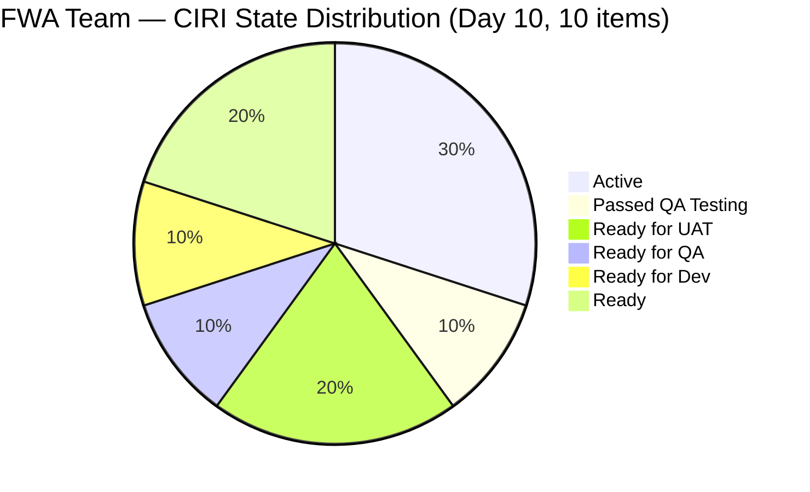
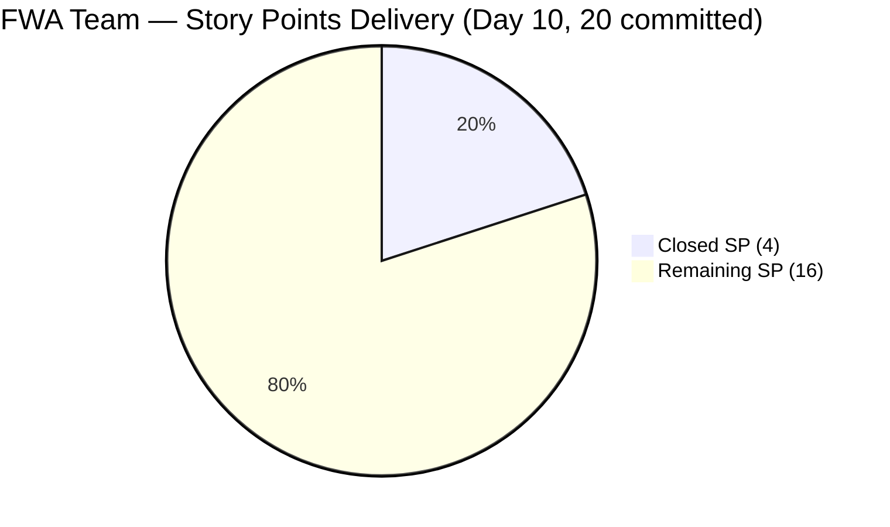
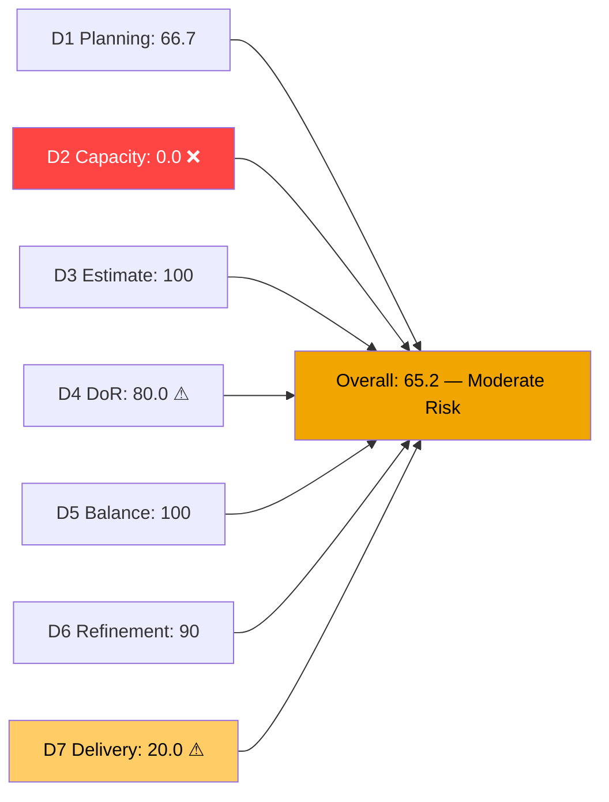
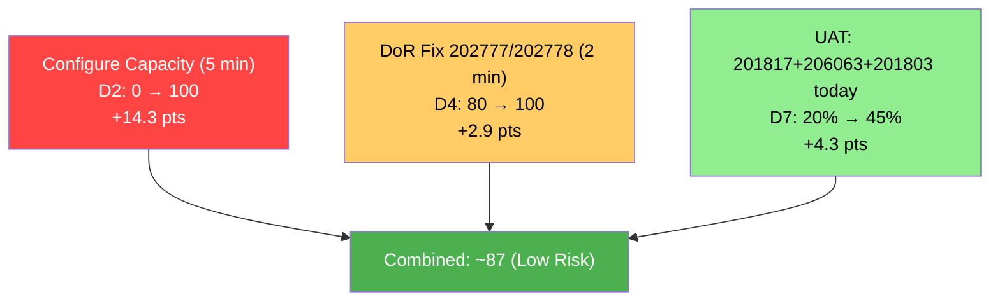
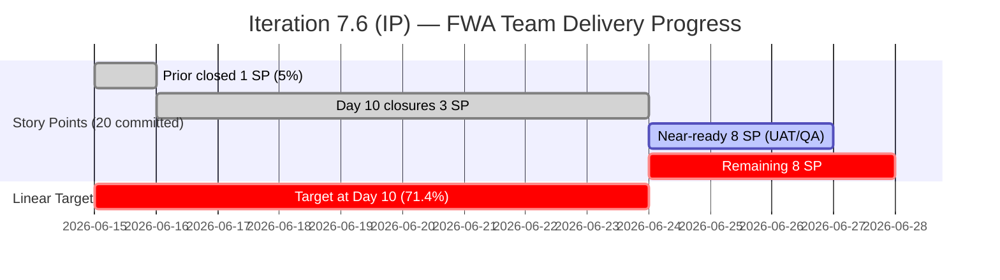

# ADO SAFe Audit — Flawless Wedding App Team

## 1. Audit Metadata

| Field | Value |
|-------|-------|
| **Audit Date** | 2026-06-24 (Wednesday) — Day 10 of 14 |
| **Timezone** | CDT (audit date) / PHT (team local) |
| **Iteration** | Iteration 7.6 (IP) |
| **Iteration Dates** | 2026-06-15 to 2026-06-28 |
| **Sprint Day** | Day 10 — Post-Midpoint, 4 working days remaining |
| **ADO Project** | Flawless Wedding App |
| **ADO Project ID** | 92b967dc-5ec7-4874-b8f5-e43b00d88339 |
| **ADO Team** | Flawless Wedding App Team |
| **ADO Team ID** | 7d90ecbf-d272-4b0c-b33b-c66d96a790ac |
| **Iteration ID** | d40e499a-292f-4c95-a289-e755dde42b22 |
| **Workspace** | `ado_fl_dev` |
| **Prior Audit** | AUDIT_20260623_0900.md (Day 9, Iteration 7.6 IP, 64.6 — Moderate Risk) |
| **Overall Score** | **65.2 / 100** |
| **Risk Band** | **Moderate Risk** |

---

## 2. Executive Summary

The Flawless Wedding App Team improves marginally to **65.2 / 100 (Moderate Risk)** on Day 10 of Iteration 7.6 (IP), a gain of **+0.6 points** from yesterday's 64.6. The improvement reflects meaningful delivery progress: three items closed today (June 24) — **201836 (View Contract, 1SP)**, **201839 (Sign Contract, 1SP)**, and **206444 (Vendor Login Defect, 1SP)** — bringing total closed SP from 1 to 4. D7 (Delivery Predictability) rises from 5.3% to 20.0%.

Two critical structural issues continue to suppress the score significantly:
1. **D2 = 0.0** — ADO capacity remains unconfigured (0hr/day) for all three team members. Day 10. This single issue costs 14.3 points per day it persists.
2. **D4 dropped to 80.0** — CIRI reduced from 13 to 10 as closures removed items from backlog; Karl's two Spike items (202777, 202778) with DoR failures now represent 2/10 = 20% of the active CIRI instead of 2/13 = 15.4%.

**Positive developments today:**
- **201817 (Cancel Booking, 2SP)** — Advanced from Active to **Passed QA Testing** (Jun 24). UAT sign-off is next.
- **201802 (Initial Payment Process, 3SP)** — Changed state to **Active** (Jun 24 02:24), previously Blocked. Development resumed.
- **206063 (Stripe Payout Hotfix, 2SP)** — Touched Jun 24 03:15. Still Ready for UAT.

**Immediate impact scenario:** Configure ADO capacity (D2→100) + add DoR content to 202777/202778 (D4→100) + close 201817 via UAT sign-off → projected overall ≈ **83.6 (Low Risk)**. These three actions require less than 30 minutes of administrative work.

---

## 3. Previous Audit Delta

**Prior audit:** AUDIT_20260623_0900.md — Day 9, Score 64.6 / 100 (Moderate Risk)

| Dimension | Day 9 | Day 10 | Delta | Driver |
|-----------|-------|--------|-------|--------|
| D1 Iteration Planning | 72.2 | **66.7** | **-5.5** | VRBI increased as 4 closed items left backlog; CIRI=10/15 |
| D2 Team Capacity | 0.0 | **0.0** | 0.0 | Still 0hr/day for all 3 contributors — Day 10 |
| D3 Estimation | 100.0 | **100.0** | 0.0 | 10/10 open CIRI items with SP>0 |
| D4 DoR Compliance | 84.6 | **80.0** | **-4.6** | CIRI shrunk 13→10; Karl's 2 DoR-failing items = 2/10 vs prior 2/13 |
| D5 Work Item Balance | 100.0 | **100.0** | 0.0 | US=5/10=50%; Defect=2/10=20%; Spike=3/10=30%; no penalty |
| D6 Backlog Refinement | 90.0 | **90.0** | 0.0 | 15/15 fresh; Karl Spikes (Jun 08) untouched = 2/10 = 20% → -10 |
| D7 Delivery Predictability | 5.3 | **20.0** | **+14.7** | 3 new closures today: 201836(1)+201839(1)+206444(1) = 3SP → 4/20 SP |
| **Overall** | **64.6** | **65.2** | **+0.6** | D7 gains offset by D1/D4 denominator shifts |

**Significant changes since Day 9 (June 24):**
- **201836 (View Contract, 1SP)** — Closed Jun 24 03:53. Was Passed QA Testing (Day 9). Sign-off executed.
- **201839 (Sign Contract, 1SP)** — Closed Jun 24 03:53. Was Ready for UAT. Sign-off same session as 201836.
- **206444 (Vendor Login Defect, 1SP)** — Closed Jun 24 03:14. Was Ready for UAT. Hotfix confirmed.
- **201817 (Cancel Booking, 2SP)** — Advanced to **Passed QA Testing** Jun 24. Was Active (Day 9, resumed after block resolved Jun 23). QA passed — one UAT sign-off step from closure.
- **201802 (Initial Payment Process, 3SP)** — Now **Active** Jun 24 02:24 (was Blocked at Day 9). Block appears fully resolved; development resumed. This is the highest-value item in the sprint.
- **206063 (Stripe Payout Hotfix, 2SP)** — Touched Jun 24 03:15. Still **Ready for UAT** — UAT ceremony not yet executed.

---

## 4. Current Iteration Snapshot

| Attribute | Value |
|-----------|-------|
| **Iteration** | Flawless Wedding App\2026-PI7\Iteration 7.6 (IP) |
| **Start Date** | 2026-06-15 |
| **End Date** | 2026-06-28 |
| **Sprint Day** | Day 10 of 14 |
| **Team Capacity** | 0 hr/day (per ADO — NOT CONFIGURED, Day 10) |
| **Days Off** | 0 |
| **VRBI (visible root backlog items)** | 15 |
| **CIRI (in 7.6 IP, backlog-visible)** | 10 |
| **Closed Items (left backlog)** | 4 (206298, 201836, 201839, 206444) |
| **Total Iteration Root Items** | 15 (10 open CIRI + 5 non-7.6-IP + 4 closed; see note) |
| **Committed SP (all iteration root items with SP>0)** | 20 SP |
| **Closed SP** | 4 SP (206298=1, 201836=1, 201839=1, 206444=1) |
| **Delivery %** | 20.0% |
| **Linear Target at Day 10** | 71.4% |
| **Assignees** | Luke Abram Colina (primary, 7 items), Ressa Paracuelles (1), Karl Caumban (2) |

---

## 5. Work Item Analysis

### Open CIRI Items (10 items, backlog-visible, 7.6 IP path)

| ID | Title | Type | State | SP | Assignee | Changed | DoR |
|----|-------|------|-------|----|----------|---------|-----|
| 206063 | [Hotfix] Vendor Unable to Receive Payouts (Stripe) | Defect | Ready for UAT | 2 | Luke | Jun 24 | ✓ |
| 201802 | Initial Payment Process | US | **Active** | 3 | Luke | Jun 24 | ✓ |
| 204944 | Manage Booking Payments | US | Ready for QA | 3 | Luke | Jun 23 | ✓ |
| 201803 | View All Bookings | US | Ready for UAT | 1 | Luke | Jun 21 | ✓ |
| 201817 | Cancel Booking | US | **Passed QA Testing** | 2 | Luke | Jun 24 | ✓ |
| 201804 | Track Booking Status | US | Active | 1 | Luke | Jun 19 | ✓ |
| 204755 | [Beta] Vendor redirect to login on Create User | Defect | Ready for Dev | 1 | Luke | Jun 15 | ✓ |
| 206250 | Iteration 7.6 - Collaborations, Reports & Others | Spike | Active | 1 | Ressa | Jun 15 | ✓ |
| 202777 | FWA End PI7 - Team & Technical Agility Self Assessment | Spike | Ready | 0.5 | Karl | Jun 08 | ✗ (no desc) |
| 202778 | FWA - Customer CSAT Survey | Spike | Ready | 0.5 | Karl | Jun 08 | ✗ (no AC) |

**State summary (10 CIRI):**
- Active: 3 (201802, 201804, 206250)
- Passed QA Testing: 1 (201817 — one step from UAT/Closed)
- Ready for UAT: 2 (206063, 201803)
- Ready for QA: 1 (204944)
- Ready for Dev: 1 (204755)
- Ready: 2 (202777, 202778)

**Type breakdown (10 CIRI):**
- User Story: 5 (201802, 204944, 201803, 201817, 201804) = 50%
- Defect: 2 (206063, 204755) = 20%
- Spike: 3 (206250, 202777, 202778) = 30%

### Closed CIRI Items (4 items — dropped from backlog)

| ID | Title | Type | SP | Closed Date |
|----|-------|------|----|-------------|
| 206298 | [Hotfix] Vendor Registration Email Reuse | Defect | 1 | Jun 16 |
| 201836 | View Contract | US | 1 | Jun 24 |
| 201839 | Sign Contract Digitally | US | 1 | Jun 24 |
| 206444 | [Hotfix] Vendor Login — Account Marked Deleted | Defect | 1 | Jun 24 |

**Closed SP = 4. Committed SP = 20 (all 15 iteration items with SP>0 counted for D7).**

### Non-7.6-IP Items in Iteration Query (5 items — PI7 root bucket)

| ID | Title | Type | State | IterationPath |
|----|-------|------|-------|---------------|
| 202777 | Team Agility Self-Assessment | Spike | Ready | 7.6 IP ✓ (above) |
| 206942 | [Mobile] Unable to pay initial | Defect | New | PI7 root |
| 206718 | Notification to bride (post-event tip/review) | US | Grooming | PI7 root |
| 206768 | [Web] Calendly Scheduling Link on Vendor Profile | US | Grooming | PI7 root |
| 206769 | [Web] Admin — Enrollment Date + Membership Tier | US | Grooming | PI7 root |
| 206770 | Stripe API — Auto Email Alerts | Enabler | Grooming | PI7 root |

*(206942 and 206718-206770 are in the visible backlog under PI7 root, not 7.6 IP — excluded from CIRI but count toward VRBI.)*

---

## 6. SAFe Compliance Scorecard

| Dimension | Score | Evidence | Notes |
|-----------|-------|----------|-------|
| D1 Iteration Planning | **66.7** | CIRI=10, VRBI=15; 10/15=66.7% | 5 non-7.6-IP items in backlog (4 Grooming PI7, 1 mobile defect) |
| D2 Team Capacity | **0.0** | 0 hr/day for all 3 contributors | **Day 10 — still unconfigured; 5-minute fix** |
| D3 Estimation | **100.0** | 10/10 CIRI items with SP>0 | All items have estimates (202777/202778 = 0.5 SP each) |
| D4 DoR Compliance | **80.0** | 8/10 DoR compliant; 202777 (no desc), 202778 (no AC) | CIRI shrunk 13→10; DoR gap share increased |
| D5 Work Item Balance | **100.0** | US=50%; Defect=20%; Spike=30%; no type >60%; Spike <40% | Excellent type distribution |
| D6 Backlog Refinement | **90.0** | 15/15 fresh; untouched=2/10=20% → -10 | 202777/202778 unchanged since Jun 08 |
| D7 Delivery Predictability | **20.0** | committed=20 SP, closed=4 SP | 3 new closures today; significant D7 recovery |
| **Overall** | **65.2** | (66.7+0+100+80+100+90+20)/7 = 456.7/7 | **Moderate Risk** |

**D4 Detail:**
- CIRI = 10 items (backlog-visible, 7.6 IP)
- DoR check: 202777 — no Description field populated (null). Fails desc ≥30 non-whitespace chars. 202778 — Description = "Send CSAT Survey to Joe and Shannon" (34 non-ws chars ✓) but no AcceptanceCriteria field. Fails AC ≥20 threshold.
- dor_compliant = 8. D4 = 8/10 × 100 = **80.0**

**D6 Detail:**
- fresh_visible (changed after May 10, 2026): all 15 VRBI items. base = 100.
- stale_90 (before Mar 25, 2026): 0 items. No penalty.
- stale_180 (before Dec 25, 2025): 0 items. No penalty.
- untouched CIRI (before Jun 15): 202777(Jun08) + 202778(Jun08) = 2/10 = 20% → >10% ≤30% → **-10 penalty**
- D6 = 100 - 10 = **90.0**

**D7 Detail (uses all 15 iteration root items):**
- committed_SP: 15 items, all with SP>0 = 2+1+1+3+3+1+2+1+1+1+1+0.5+0.5+1 = 20 SP (includes 4 closed: 206298=1, 201836=1, 201839=1, 206444=1)
- closed_SP: 206298(1)+201836(1)+201839(1)+206444(1) = 4 SP
- D7 = 4/20 × 100 = **20.0%**

---

## 7. Dimension Findings

### D1 — Iteration Planning: 66.7

CIRI declined from 13 to 10 as three items closed and left the backlog. VRBI held at 15 (4 Grooming items + 1 mobile defect remain in the PI7 root backlog). D1 = 10/15 = 66.7%. The 5 non-CIRI items are legitimate pipeline work (grooming backlog and one triage item) — the ratio reflects planning discipline, not a planning failure. D1 will improve if the 4 Grooming items are committed to a future iteration and removed from the PI7 root bucket.

### D2 — Team Capacity: 0.0 (Day 10 — CRITICAL ADMIN GAP)

ADO iteration capacity remains 0hr/day for all three contributors: Luke Abram Colina, Ressa Paracuelles, and Karl Caumban. This is now 10 consecutive days of unconfigured capacity. The team has demonstrated active delivery (3 items closed today, 10 active items) with zero configured capacity — a data quality failure, not a team performance failure. Fixing this in ADO Team Settings takes approximately 5 minutes and yields 14.3 points immediately. **This is the single highest-ROI action available to the team.**

### D3 — Estimation: 100.0

All 10 open CIRI items have positive story point estimates, including Karl's two IP Spike items at 0.5 SP each. Full estimation coverage maintained despite CIRI size reduction.

### D4 — DoR Compliance: 80.0

Eight of 10 items pass the DoR threshold. Two Karl Spike items continue to fail:
- **202777 (Team Agility Self-Assessment)** — No description in ADO. Adding one sentence (e.g., "Complete the end-of-PI SAFe Team Agility self-assessment survey for PI7 retrospective data collection.") resolves this.
- **202778 (Customer CSAT Survey)** — Description present ("Send CSAT Survey to Joe and Shannon") but no Acceptance Criteria. Adding basic AC (e.g., "CSAT survey sent to Joe and Shannon; delivery confirmation received.") resolves this.

Both items are assigned to Karl and have been unchanged since Jun 08 — now 16 days without update. These are IP sprint planning artifacts with 0.5 SP each; the DoR gap is disproportionate to their scope. Two minutes of editing resolves 2 DoR failures and raises D4 from 80.0 to 100.0 (+2.9 points).

### D5 — Work Item Balance: 100.0

Excellent type distribution across the 10 CIRI items: User Story 50%, Defect 20%, Spike 30%. No single type exceeds 60%. Spike share is below the 40% threshold. This represents a well-balanced IP sprint combining feature work, defect remediation, and exploration/reporting activities. No penalties applied.

### D6 — Backlog Refinement: 90.0

All 15 visible backlog items are fresh (all changed within 45 days). Zero stale items at 90 or 180 days. The -10 penalty persists from Karl's two unchanged items (202777, 202778 — Jun 08). Once these items are touched with DoR content, the untouched penalty drops to 0/10 and D6 recovers to 100.0.

### D7 — Delivery Predictability: 20.0 (Recovering)

**Strong improvement: +14.7 points from Day 9.** Three items closed today in a UAT/hotfix session (201836, 201839, 206444 — all 1SP each). Total closed SP rises from 1 to 4 (4/20 = 20.0%). This is the team's best single-day delivery performance this sprint.

**Near-term closure pipeline:**
- **201817 (Cancel Booking, 2SP)** — Passed QA Testing today. One UAT sign-off session → Closed. Highest near-term priority.
- **206063 (Stripe Payout Hotfix, 2SP)** — Ready for UAT, touched today. Can be included in same UAT ceremony as 201817.
- **201803 (View All Bookings, 1SP)** — Ready for UAT. Include in UAT ceremony.
- **204944 (Manage Booking Payments, 3SP)** — Ready for QA (since Jun 23). Begin QA testing immediately. Highest SP available.
- **201802 (Initial Payment Process, 3SP)** — Active (block resolved Jun 24). Critical path item. Development resumed.

If 201817 + 206063 + 201803 close this week: D7 = 9/20 = 45.0%. If 204944 also closes: D7 = 12/20 = 60.0%.

---

## 8. Risks and Bottlenecks

| Risk | Severity | Status |
|------|----------|--------|
| D2 = 0.0 — capacity unconfigured Day 10 | **HIGH** | Persistent; 5-minute ADO fix; costs 14.3 points daily |
| 202777 + 202778 — DoR failures (Karl) | **Medium** | Easy fix; 2 minutes; raises D4 to 100.0 |
| D7 = 20.0% vs. 71.4% linear target | **HIGH** | 16 SP remain; 4 days; 3+ items closeable this week |
| 201802 (Initial Payment, 3SP) — resumed Active | **Medium** | Block resolved Jun 24; highest-SP open item; delivery risk if re-blocked |
| Luke ownership concentration (7/10 CIRI) | **HIGH** | 70% items with one contributor; bottleneck risk |
| 206942 (Mobile defect) — PI7 root, not committed | **Medium** | Should be triaged to 7.6 IP or deferred; currently unscored |
| 4 Grooming items (206718-206770) — PI7 root | **Low** | Not committed to 7.6 IP; should be assigned to future iteration |

---

## 9. Prioritized Recommendations

1. **[IMMEDIATE — 5 min]** Configure ADO capacity for Luke, Ressa, and Karl in ADO Team Settings. Even 1hr/day each raises D2 from 0.0 to 100.0. This adds **14.3 points** to the overall score immediately, recovering to Low Risk at ~79.5. This has been flagged every audit day this sprint — Day 10 is the final opportunity to correct this before sprint close.

2. **[Today — UAT ceremony]** Schedule and execute a UAT sign-off session covering:
   - **201817 (Cancel Booking, 2SP)** — Passed QA. Close today.
   - **206063 (Stripe Payout Hotfix, 2SP)** — Ready for UAT. Close today.
   - **201803 (View All Bookings, 1SP)** — Ready for UAT. Close in same session.
   These three items = 5 SP. D7 jumps to 9/20 = 45.0% post-UAT.

3. **[Karl — 2 min]** Add description to **202777** and acceptance criteria to **202778**. Both edits require under 2 minutes total. Resolves D4 from 80.0 to 100.0. Raises overall by 2.9 points. Karl can complete this before EOD today.

4. **[Ressa — Day 10]** Begin QA testing on **204944 (Manage Booking Payments, 3SP)**. The item advanced to Ready for QA yesterday. Completing QA today sets up a Day 11 close for the highest-SP remaining item.

5. **[Day 11]** Progress **201802 (Initial Payment Process, 3SP)** — Active development resumed Jun 24. Given the complexity (10+ ACs), prioritize the most critical AC scenarios (AC1-AC5: initial contract-to-payment flow). This item cannot close in 1 day but should be in QA by Day 12.

6. **[Triage — Today]** Formally commit **206942 (Mobile: Unable to pay initial, 1SP)** to 7.6 IP or explicitly defer to PI8. Currently in PI7 root — a process hygiene gap that creates ambiguity about sprint scope.

7. **[Triage — Day 10]** Commit or defer the 4 Grooming items (206718, 206768, 206769, 206770) in the PI7 root backlog. These items are in Grooming state and should be moved to a specific future iteration to maintain clean backlog hygiene.

---

## 10. Evidence Gaps and Limitations

| Gap | Impact | Disposition |
|-----|--------|-------------|
| D2 = 0 for 10 consecutive days | Distorts capacity picture; renders D2 meaningless for this sprint | No formula change; documented; organizational correction required |
| D7 uses all 15 iteration root items (not just VRBI CIRI=10) | Closed items drop from backlog; full commitment captured via iteration query | Consistent with prior audit methodology |
| 206942 IterationPath = PI7 root (not 7.6 IP) | May or may not be formally in scope | Excluded from CIRI; included in VRBI |
| Karl's items (202777/202778) unchanged since Jun 08 (16 days) | D4=80.0; D6 penalty -10 | Easily corrected with 2-minute ADO edits |
| IP Sprint context | D7 lower delivery expectation during Innovation & Planning sprint | No formula change; team delivery (3 items today) is above IP norms |
| 201802 block resolution not documented in ADO | Block reason never recorded; resolution path unclear | Item now Active; resolved empirically via state change |

---

