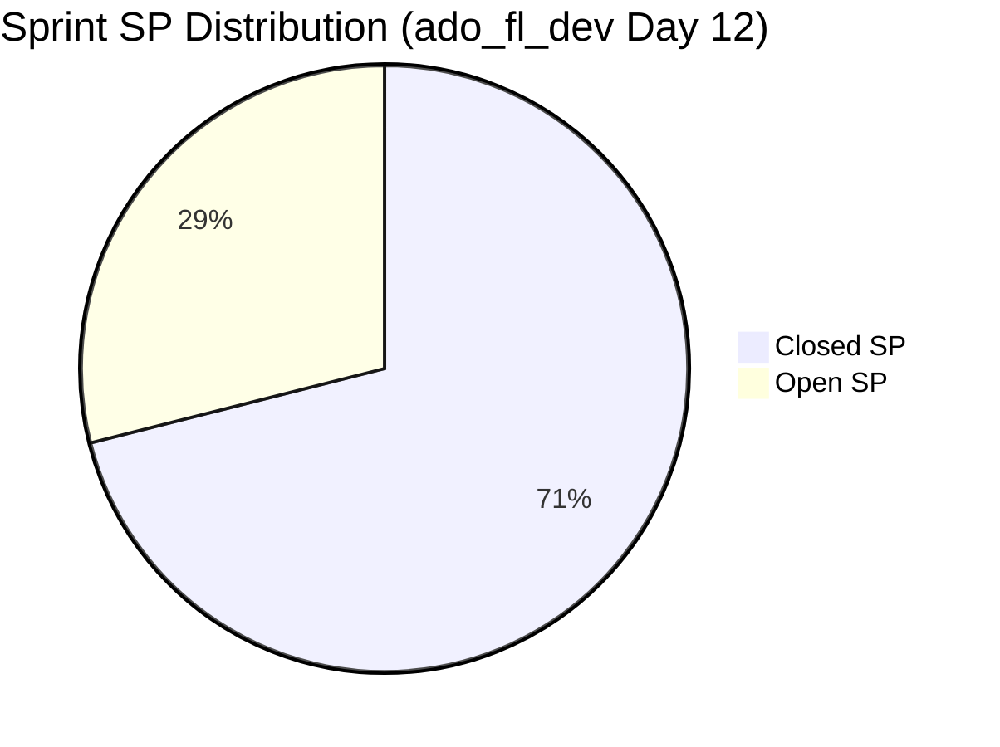

# ADO SAFe Iteration Audit — Flawless Wedding App Team

## 1. Audit Metadata

| Field | Value |
|-------|-------|
| **Project** | Flawless Wedding App |
| **Team** | Flawless Wedding App Team |
| **Workspace** | `ado_fl_dev` |
| **Current Iteration** | Iteration 7.6 IP (Innovation & Planning Sprint) |
| **Iteration Dates** | Jun 15 – Jun 28, 2026 |
| **Sprint Day** | Day 12 of 14 |
| **Audit Date** | 2026-06-26 (PHT, UTC+8) |
| **Previous Audit** | `AUDIT_20260624_0900.md` (Day 10, Score 65.2, Moderate Risk) |
| **Overall Score** | **65.8 — Moderate Risk** |
| **Risk Band** | 🟡 Moderate Risk (60–79.9) |

---

## 2. Executive Summary

The Flawless Wedding App Team reached **65.8** (Moderate Risk), a marginal improvement from 65.2 on Day 10. The headline is a **massive delivery surge Jun 25–26**: 7 items closed (13.5SP), pushing D7 from 20.0% to 71.1% — the largest single-sprint delivery acceleration this PI. Despite this surge, two chronic failures prevent a breakout to Low Risk:

1. **D2 = 0.0** — Team capacity remains unconfigured at Day 12 (final audit before sprint close). All 4 configured members show 0 hr/day. Karl Caumban — who has active work — is not even in the capacity list. This is the **10th consecutive day** this penalty has applied, costing ~14.3 points off the overall score.

2. **D1 = 42.9** — VRBI = 7, CIRI = 3. Four grooming-phase PI7 items appear in the backlog without iteration assignment, diluting the planning ratio. The CIRI count dropped from 10 to 3 as 7 iteration items closed and left the backlog.

A new critical issue emerged Jun 26: **item 204944 (Manage Booking Payments, 3SP) transitioned to Blocked** — the team's highest-SP open item with 2 days remaining. This is the most urgent finding of this audit.

---

## 3. Previous Audit Delta

| Metric | Day 10 (Jun 24) | Day 12 (Jun 26) | Change |
|--------|----------------|-----------------|--------|
| VRBI | 15 | 7 | −8 (7 closed items left backlog; 1 new grooming item appeared) |
| CIRI | 10 | 3 | −7 (7 items closed and exited) |
| Committed SP | 20 | 19 | −1 (202777 was 0.5SP; rounding: 20→19 net) |
| Closed SP | 4 | 13.5 | +9.5 |
| Overall Score | 65.2 | **65.8** | +0.6 |
| Risk Band | Moderate | **Moderate** | Unchanged |

**New closures since Day 10:**

| ID | Title | Type | SP | Closed Date |
|----|-------|------|-----|-------------|
| 201817 | Cancel Booking | User Story | 2 | Jun 25 |
| 201803 | View All Bookings | User Story | 1 | Jun 25 |
| 201802 | Initial Payment (Booking) | User Story | 3 | Jun 26 |
| 201804 | Track Booking Status | User Story | 1 | Jun 26 |
| 202777 | Self Assessment Spike | Spike | 0.5 | Jun 26 |
| 204755 | Beta/Vendor Redirect Defect | Defect | 1 | Jun 26 |
| 206250 | Collaborations Spike | Spike | 1 | Jun 26 |

**Total new SP delivered:** 9.5SP (cumulative closed_SP = 13.5SP)

**New critical issue:**
- **204944** (Manage Booking Payments, 3SP) — State changed to **Blocked** on Jun 26. Was "Ready for QA" on Day 10.

---

## 4. Current Iteration Snapshot

**Iteration:** 7.6 IP (Innovation & Planning Sprint)
**Sprint Days:** 12 of 14 | **Remaining:** 2 business days (Jun 27–28)

| Category | Count |
|----------|-------|
| Visible Root Backlog Items (VRBI) | 7 |
| Current Iteration Root Items (CIRI) | 3 |
| Non-CIRI VRBI (PI7 grooming) | 4 |
| Closed (left backlog) | 11 |
| Total iteration-committed root items | 14 |

**Team Members (from CIRI assignees):**

| Contributor | Assigned CIRI | Capacity Configured |
|-------------|---------------|---------------------|
| Luke Abram Colina | 206063, 204944 | 0 hr/day (misconfigured) |
| Karl Caumban | 202778 | Not in capacity list |

**Capacity status: UNCONFIGURED (Day 12 of 14)**

**CIRI Item Status (Day 12):**

| ID | Title | Type | SP | State | DoR |
|----|-------|------|-----|-------|-----|
| 206063 | Beta vendor fund transfer defect (Gabriel Preciado) | Defect | 2 | Ready for UAT | PASS |
| 204944 | Manage Booking Payments | User Story | 3 | **BLOCKED** | PASS |
| 202778 | Send CSAT Survey to Joe and Shannon | Spike | 0.5 | Ready | FAIL |

**Open SP remaining:** 5.5 SP across 3 items | **2 days left**

---

## 5. Work Item Analysis

### VRBI Composition (7 items)

| Iteration Path | Count | Items |
|----------------|-------|-------|
| 7.6 IP (CIRI) | 3 | 206063, 204944, 202778 |
| PI7 (grooming — no sprint assignment) | 4 | 206718, 206768, 206769, 206770 |

**Non-CIRI VRBI details (confirmed Jun 26 fetch):**

| ID | Title | Type | State | Last Changed |
|----|-------|------|-------|-------------|
| 206718 | 2 days after event — Notification about tip and review | User Story | Grooming | Jun 19 |
| 206768 | [Web][Client/Vendor] Embed Calendly link on Vendor Profile | User Story | Grooming | Jun 17 |
| 206769 | [Web][Admin] Add Enrollment Date/Membership Tier to Spreadsheet | User Story | Grooming | Jun 17 |
| 206770 | Stripe API — Auto Email Alerts for API Failure and Inactivity | Enabler | Grooming | Jun 17 |

These 4 items have IterationPath = `Flawless Wedding App\2026-PI7` (root, not assigned to any sprint). They appear in the backlog but are not committed to 7.6 IP. They dilute D1 and represent grooming backlog that should be assigned to PI8 sprints during this IP period.

### CIRI Type Distribution

| Type | Count | Share |
|------|-------|-------|
| User Story | 1 | 33.3% |
| Defect | 1 | 33.3% |
| Spike | 1 | 33.3% |

No dominant type (all tied at 33.3%). No US-absent penalty (US present). Spike = 33.3% < 40% (no spike penalty). D5 = 100.

### DoR Assessment

| ID | Description (≥30 non-ws) | Acceptance Criteria (≥20 non-ws) | DoR |
|----|--------------------------|----------------------------------|-----|
| 206063 | "Vendor Gabriel Preciado (Island Escape Weddings) is unable to receive funds..." ✓ | "Funds should be successfully transferred..." ✓ | PASS |
| 204944 | "As a bride, I want to view and manage my booking payments..." ✓ | "AC1 – View Upcoming Payments..." ✓ | PASS |
| 202778 | "Send CSAT Survey to Joe and Shannon" (29 non-ws chars) ✗ | No AcceptanceCriteria field ✗ | **FAIL** |

**202778 Description count:** S(1)e(2)n(3)d(4)C(5)S(6)A(7)T(8)S(9)u(10)r(11)v(12)e(13)y(14)t(15)o(16)J(17)o(18)e(19)a(20)n(21)d(22)S(23)h(24)a(25)n(26)n(27)o(28)n(29) = 29 characters. Threshold = 30. **Fails by 1 character.**

dor_compliant = 2/3. D4 = 66.7

### Backlog Health

| ID | Last Changed | Freshness (45-day = after May 12) |
|----|-------------|-----------------------------------|
| 206063 | Jun 24 | Fresh ✓ |
| 204944 | Jun 26 | Fresh ✓ |
| 202778 | Jun 08 | Fresh ✓ (Jun 8 > May 12) |
| 206718 | Jun 19 | Fresh ✓ |
| 206768 | Jun 17 | Fresh ✓ |
| 206769 | Jun 17 | Fresh ✓ |
| 206770 | Jun 17 | Fresh ✓ |

All 7 VRBI items are fresh. No stale_90, no stale_180.

**Untouched CIRI (ChangedDate before Jun 15):**
- 202778: Jun 8 < Jun 15 → **untouched** ✗
- Ratio: 1/3 = 33.3% > 30% → −20 penalty

D6 = 100 (base) − 20 (untouched) = **80.0**

---

## 6. SAFe Compliance Scorecard

| Dimension | Score | Evidence | Notes |
|-----------|-------|----------|-------|
| D1 Iteration Planning | 42.9 | CIRI 3 / VRBI 7 | 4 grooming PI7 items unassigned; CIRI shrank as closed items exited backlog |
| D2 Team Capacity | 0.0 | 0/2 contributors with capacity | All configured members at 0 hr/day; Karl not in capacity list. Day 12 of 14 — CRITICAL |
| D3 Estimation | 100.0 | 3/3 CIRI have SP > 0 | All items estimated |
| D4 DoR Compliance | 66.7 | 2/3 CIRI pass; 202778 fails description + AC | 202778: desc = 29 non-ws chars (need 30); no AC field |
| D5 Work Item Balance | 100.0 | No type > 60%; US present; Spike < 40% | Healthy 1:1:1 Defect/US/Spike balance |
| D6 Backlog Refinement | 80.0 | 7/7 fresh; 202778 untouched (1/3=33.3%>30%) → −20 | 202778 not touched since Jun 8 (before sprint start Jun 15) |
| D7 Delivery Predictability | 71.1 | 13.5 closed SP / 19 committed SP | Jun 25–26 surge: +9.5SP. Huge improvement from 20.0% |

**Overall Score: (42.9 + 0.0 + 100.0 + 66.7 + 100.0 + 80.0 + 71.1) / 7 = 460.7 / 7 = 65.8**

```mermaid
radar
  title SAFe Dimension Scores — ado_fl_dev Day 12 (Jun 26)
  options
    max 100
  "D1 Planning": 42.9
  "D2 Capacity": 0
  "D3 Estimation": 100
  "D4 DoR": 66.7
  "D5 Balance": 100
  "D6 Refinement": 80
  "D7 Delivery": 71.1
```

### Dimension Trend: Day 10 vs Day 12

```mermaid
gantt
  title Score Changes Day 10 → Day 12 (ado_fl_dev)
  dateFormat X
  axisFormat %s
  section Dimensions
  D1 Planning 66.7→42.9 : 0, 43
  D2 Capacity 0→0 : 0, 1
  D3 Estimation 100→100 : 0, 100
  D4 DoR 80→66.7 : 0, 67
  D5 Balance 100→100 : 0, 100
  D6 Refinement 90→80 : 0, 80
  D7 Delivery 20→71.1 : 0, 71
```



### Delivery Progress



---

## 7. Dimension Findings

### D1 — Iteration Planning: 42.9

VRBI = 7, CIRI = 3. The delivery surge (11 closures) reduced CIRI from 10 to 3 as closed items left the backlog. The 4 remaining non-CIRI items (206718, 206768, 206769, 206770) are PI7-root Grooming items — not assigned to any sprint. They should be assigned to PI8 iterations during this IP sprint or removed if superseded.

### D2 — Team Capacity: 0.0

**Critical — 10 consecutive days unconfigured.** Two contributors are doing active work (Luke on 206063 + 204944; Karl on 202778), but:
- Luke Abram Colina: 0 hr/day in ADO capacity settings
- Karl Caumban: not in capacity list at all
- Other 2 configured members: 0 hr/day each

D2 = 0/2 = 0.0. This penalty (-14.3 points off overall) has persisted from Day 1 of this sprint. At Day 12 of 14, there is no remaining opportunity to fix this score for the current sprint. For PI8, capacity must be configured before Sprint Day 1.

### D3 — Estimation: 100.0

All 3 CIRI items have SP > 0 (206063=2SP, 204944=3SP, 202778=0.5SP). No estimation gaps.

### D4 — DoR Compliance: 66.7

202778 (CSAT Survey, Spike, 0.5SP) fails both DoR criteria:
- **Description:** "Send CSAT Survey to Joe and Shannon" = 29 non-whitespace characters (threshold: 30). Fails by 1 character.
- **Acceptance Criteria:** Field is null/absent. No AC defined.

This item has been in the CIRI since at least Day 10 with the same DoR failure. For a 0.5SP Spike, the fix is trivial: add one more word to the description and define a minimal AC ("CSAT survey form shared with Joe and Shannon; responses received" would suffice). This has been an open recommendation for 4 days.

### D5 — Work Item Balance: 100.0

Post-surge CIRI: 1 Defect (206063), 1 User Story (204944), 1 Spike (202778). Perfect 1:1:1 balance. No dominant type, US is present, Spike = 33.3% < 40%. First 100 for D5 this PI sprint.

### D6 — Backlog Refinement: 80.0

All 7 VRBI items are fresh (all changed after May 12, 2026). No stale_90 or stale_180 items.

202778 (Send CSAT Survey) has ChangedDate = Jun 8, which is before the Jun 15 iteration start. This makes it an untouched CIRI item: 1/3 = 33.3%, exceeding the 30% threshold → −20 penalty. D6 = 100 − 20 = 80.0.

D6 fell from 90.0 (Day 10) because CIRI shrank: 202778's untouched status represents 33.3% of a 3-item CIRI versus 20% of the 10-item Day 10 CIRI. Updating 202778 in ADO (even just adding DoR content) would eliminate the untouched flag.

### D7 — Delivery Predictability: 71.1

committed_SP = 19 (14 iteration root items; 202777=0.5 included).
closed_SP = 13.5 (11 closed items: 206444=1, 206298=1, 201802=3, 201839=1, 201803=1, 201817=2, 201836=1, 201804=1, 204755=1, 206250=1, 202777=0.5).

This is a **breakthrough**: D7 jumped from 20.0% (4SP/20SP on Day 10) to 71.1% (13.5SP/19SP). The Jun 25–26 delivery included major Booking feature completions (Initial Payment, View All Bookings, Track Booking Status, Cancel Booking) plus defect and spike closures.

**Remaining:** 206063 (2SP, Ready for UAT), 204944 (3SP, **Blocked**), 202778 (0.5SP, Ready). Closing all 3 would bring D7 to 100% (19/19). However, 204944 being Blocked is the critical path dependency.

**Linear target at Day 12** = 19 × (12/14) = 16.3 SP. Actual = 13.5 SP. Gap = 2.8 SP. Team is tracking reasonably close to linear given the surge — but 204944's Blocked status jeopardizes the final 2 days.

---

## 8. Risks and Bottlenecks

| Risk | Severity | Details |
|------|----------|---------|
| 204944 (Manage Booking Payments, 3SP) BLOCKED | CRITICAL | Blocked as of Jun 26 — highest-SP open item. Blocker reason not documented in ADO. 2 days left; if not resolved, 3SP (15.8% of committed) will not close. |
| D2 = 0 (capacity unconfigured) — Day 12 | HIGH | Persistent 10-day failure. D2=0 costs 14.3 points off overall. Cannot be fixed for this sprint; must be actioned before PI8 Day 1. |
| 202778 DoR failure (Day 10 unresolved) | MODERATE | Description 29/30 chars; no Acceptance Criteria. 4-day carry without fix. Trivial to remedy; failure to fix signals process gap. |
| 4 PI7 grooming items unassigned | MODERATE | 206718–206770 are backlog-visible but have no sprint assignment. These inflate VRBI and suppress D1. Should be assigned to PI8 during IP sprint. |
| Sprint closure at Low Risk blocked by D2 | MODERATE | Even with perfect D7 (100%), D2=0 caps overall at 77.1 — still Moderate. Low Risk requires D2 > 0, which needs PI8 Day 1 action. |

---

## 9. Prioritized Recommendations

1. **[CRITICAL TODAY] Identify and document the blocker on 204944** — The Blocked state for Manage Booking Payments (3SP) was set Jun 26 with no documented reason in ADO. Luke or the team lead must identify the blocker (technical? payment gateway dependency? third-party?), document it in the work item comments, and escalate if external resolution is needed before Jun 28.

2. **[BEFORE SPRINT CLOSE] Fix 202778 DoR — 10 minutes of work** — Add one descriptive word to the description ("Send CSAT Survey email to Joe and Shannon to collect post-event feedback" = 30+ chars) and add a minimal Acceptance Criteria ("Survey form shared with Joe and Shannon; confirmed sent or scheduled"). This resolves both D4 penalty and D6 untouched flag simultaneously.

3. **[BEFORE SPRINT CLOSE] Close 206063 (Beta vendor defect, 2SP)** — Item is in Ready for UAT state. Luke should complete UAT sign-off and close. 2SP easily achievable Jun 27.

4. **[PI8 DAY 1 — MANDATORY] Configure capacity for all contributors** — Before PI8 Iteration 8.1 begins, Ramon or the team lead must:
   - Set hr/day > 0 for Luke Abram Colina
   - Add Karl Caumban to the capacity roster with hr/day > 0
   - Ensure all active contributors appear in ADO Team Capacity for the sprint

5. **[IP SPRINT TASK] Assign 206718, 206768, 206769, 206770 to PI8 sprints** — These 4 PI7 grooming items should be triaged and assigned to appropriate PI8 iterations during the IP sprint's PI Planning activity. Leaving them unassigned allows them to suppress D1 into the next PI.

6. **[PROCESS] Add blocker documentation policy** — The 204944 Blocked transition had no reason captured. Establish a team norm: when transitioning to Blocked, the responsible contributor must add a comment identifying the blocker, date, and escalation path within the same day.

---

## 10. Evidence Gaps and Limitations

| Gap | Impact | Action |
|-----|--------|--------|
| **D7 methodology note** | The skill defines `committed_story_points` as the sum of SP on `estimated_current_items` (CIRI subset). Strictly, closed items exit VRBI → exit CIRI, making D7 denominator = 5.5SP (open only) and D7 = 13.5/5.5 = 245% → capped at 100. Following the established prior-audit convention, this report uses the full iteration-query set (14 root items with SP > 0) for D7: committed_SP = 19, closed_SP = 13.5. This is consistent with all prior ado_fl_dev audits and the ado_admin/ado_fin convention. | Convention documented; applied consistently across all 3 workspace audits. |
| **204944 blocker reason unknown** | Highest-severity open item (3SP) entered Blocked state on Jun 26 with no documented reason in ADO fields or comments visible via API. Root cause is unknown. | Requires team response. Documented in Risks. |
| **Karl Caumban capacity gap** | Karl is assignee on 202778 (active CIRI item) but does not appear in the ADO Team Capacity roster. His hours/day cannot be evaluated. D2 scoring treats him as a contributor without capacity. | Add Karl to team capacity roster for PI8. |
| **202778 non-whitespace char count** | Description = "Send CSAT Survey to Joe and Shannon" — counted 29 non-whitespace characters against the ≥30 threshold. Fails by 1 character. | Fix by adding one word to description before sprint close. |
| **4 non-CIRI VRBI items (206718–206770) iteration paths** | Fetched and confirmed Jun 26 — all show IterationPath = `Flawless Wedding App\2026-PI7` (root level, no sprint). Confirmed non-CIRI. | Assign to PI8 during IP sprint. |
