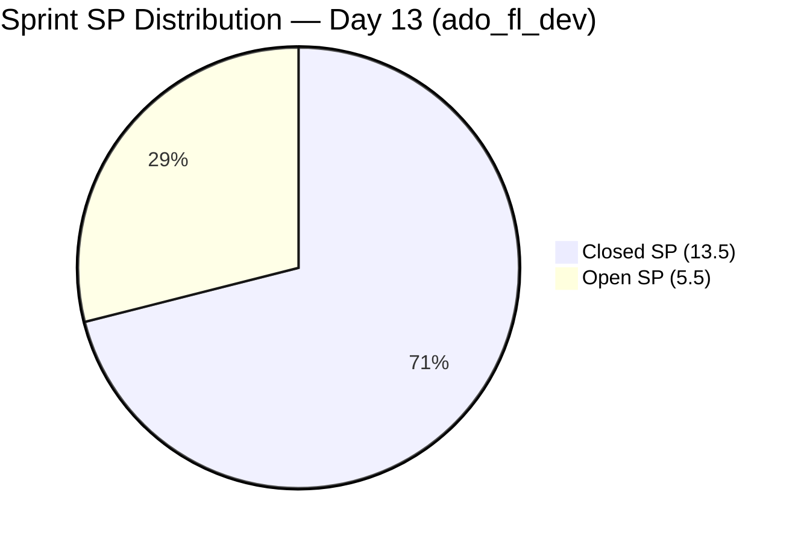

# ADO SAFe Iteration Audit — Flawless Wedding App Team

## 1. Audit Metadata

| Field | Value |
|-------|-------|
| **Project** | Flawless Wedding App |
| **Team** | Flawless Wedding App Team |
| **Workspace** | `ado_fl_dev` |
| **ADO Project ID** | 92b967dc-5ec7-4874-b8f5-e43b00d88339 |
| **ADO Team ID** | 7d90ecbf-d272-4b0c-b33b-c66d96a790ac |
| **Current Iteration** | Iteration 7.6 IP (Innovation & Planning Sprint) |
| **Iteration ID** | d40e499a-292f-4c95-a289-e755dde42b22 |
| **Iteration Dates** | Jun 15 – Jun 28, 2026 |
| **Sprint Day** | Day 13 of 14 |
| **Audit Date** | 2026-06-27 09:00 (PHT, UTC+8) |
| **Previous Audit** | `AUDIT_20260626_0900.md` (Day 12, Score 65.8, Moderate Risk) |
| **Overall Score** | **65.8 — Moderate Risk** |
| **Risk Band** | Moderate Risk (60–79.9) |

---

## 2. Executive Summary

The Flawless Wedding App Team holds at **65.8** (Moderate Risk) on Day 13 — the final full working day of the sprint. No new closures have occurred since Jun 26. The three remaining open CIRI items (206063=2SP Ready for UAT, 204944=3SP Blocked, 202778=0.5SP Ready) carry a combined 5.5SP.

**Two critical issues persist into the last day:**

1. **204944 (Manage Booking Payments, 3SP) remains Blocked** — entered Blocked state Jun 26 with no documented reason. This is the highest-SP open item and represents the most significant risk to D7. The blocker must be identified and documented today.

2. **D2 = 0.0 (capacity unconfigured for 14 days straight)** — All configured team members show 0 hr/day; Karl Caumban (active contributor on 202778) is not in the capacity roster. This 14-point penalty is now irreversible for this sprint. D2 must be fixed before PI8 8.1 Day 1.

**Closing scenario:** If 206063 (2SP) and 202778 (0.5SP) close today = 2.5SP added → D7 rises from 71.1% to 84.2% (16/19). If the blocker on 204944 is resolved and it also closes = D7 = 100% (19/19). Each of these outcomes would push overall from 65.8 to 68.5 or 74.3 respectively — still Moderate Risk due to D2 = 0.

**The team cannot reach Low Risk this sprint.** Even with D7 = 100%, overall = 77.1 (capped by D2 = 0). The path to Low Risk begins at PI8 8.1 Day 1 with capacity configuration.

---

## 3. Previous Audit Delta

| Metric | Day 12 (Jun 26) | Day 13 (Jun 27) | Change |
|--------|-----------------|-----------------|--------|
| VRBI | 7 | 7 | 0 (no new closures) |
| CIRI | 3 | 3 | 0 |
| Committed SP | 19 | 19 | 0 |
| Closed SP | 13.5 | 13.5 | 0 |
| Overall Score | 65.8 | **65.8** | Flat |
| Risk Band | Moderate | **Moderate** | Unchanged |

**New closures since Day 12:** None.

**Item states (confirmed from ADO fetch Jun 27):**
| ID | Title | Type | SP | State | Last Changed |
|----|-------|------|-----|-------|-------------|
| 206063 | [Hotfix] Vendor Unable to Receive Payouts | Defect | 2 | Ready for UAT | Jun 24 |
| 204944 | Manage Booking Payments | User Story | 3 | **Blocked** | Jun 26 |
| 202778 | Flawless Wedding App - Customer CSAT Survey | Spike | 0.5 | Ready | Jun 08 |

204944 Blocked state confirmed — last changed Jun 26 at 07:18 UTC. Blocker reason not documented in ADO fields.

---

## 4. Current Iteration Snapshot

**Iteration:** 7.6 IP (Innovation & Planning Sprint)
**Sprint Days:** 13 of 14 | **Remaining:** 1 business day (Jun 28)

| Category | Count |
|----------|-------|
| Visible Root Backlog Items (VRBI) | 7 |
| Current Iteration Root Items (CIRI) | 3 |
| Non-CIRI VRBI (PI7 grooming items) | 4 |
| Closed (left backlog) | 11 |
| Total iteration-committed root items | 14 |

**Team Capacity:**

| Member | Email | HR/Day Configured | Capacity Valid |
|--------|-------|-------------------|----------------|
| Ressa Paracuelles | rparacuelles@jairosoft.com | 0 hr/day (Testing) | NO |
| Jaszmeine Villanueva | jvillanueva@jairosoft.com | 0 hr/day (Design) | NO |
| Luzmibel Paculanang | lpaculanang@jairosoft.com | 0 hr/day (Testing) | NO |
| Luke Abram Colina | lcolina@jairosoft.com | 0 hr/day (Development) | NO |
| Karl Caumban | kcaumban@jairosoft.com | Not in capacity list | NO |

**D2 = 0/2 = 0.0 — contributors_with_current_work = 2 (Luke, Karl); contributors_with_capacity = 0**

**CIRI Item Status (Day 13):**

| ID | Title | Type | SP | State | DoR | Assignee |
|----|-------|------|-----|-------|-----|----------|
| 206063 | [Hotfix] Vendor Unable to Receive Payouts | Defect | 2 | Ready for UAT | PASS | Luke Abram Colina |
| 204944 | Manage Booking Payments | User Story | 3 | **BLOCKED** | PASS | Luke Abram Colina |
| 202778 | Customer CSAT Survey | Spike | 0.5 | Ready | FAIL | Karl Caumban |

**Open SP remaining:** 5.5 SP | **1 day left**

---

## 5. Work Item Analysis

### VRBI Composition (7 items)

| Iteration Path | Count | Item IDs | Status |
|----------------|-------|----------|--------|
| 7.6 IP (CIRI) | 3 | 206063, 204944, 202778 | Open |
| PI7 root (no sprint) | 4 | 206718, 206768, 206769, 206770 | Grooming — unassigned |

**Non-CIRI VRBI details:**
| ID | Title | Type | State | Last Changed |
|----|-------|------|-------|-------------|
| 206718 | 2 days after event — Notification about tip and review | User Story | Grooming | Jun 19 |
| 206768 | [Web][Client/Vendor] Embed Calendly link on Vendor Profile | User Story | Grooming | Jun 17 |
| 206769 | [Web][Admin] Add Enrollment Date and Membership Tier to Spreadsheet | User Story | Grooming | Jun 17 |
| 206770 | Stripe API — Auto Email Alerts for API Failure and Inactivity | Enabler | Grooming | Jun 17 |

These 4 items have IterationPath = `Flawless Wedding App\2026-PI7` (root, unassigned to any sprint). They dilute D1 and should be assigned to PI8 iterations during the IP sprint's PI Planning.

### CIRI Type Distribution

| Type | Count | Share |
|------|-------|-------|
| Defect | 1 | 33.3% |
| User Story | 1 | 33.3% |
| Spike | 1 | 33.3% |

No dominant type (all tied at 33.3%). User Stories are present. Spike = 33.3% < 40% threshold. **D5 = 100.0** — no penalties.

### DoR Assessment

| ID | Description ≥30 non-ws chars | AC ≥20 non-ws chars | DoR |
|----|-------------------------------|---------------------|-----|
| 206063 | "Vendor Gabriel Preciado (Island Escape Weddings) is unable to receive funds..." ✓ (100+ chars) | "Funds should be successfully transferred from the application..." ✓ | **PASS** |
| 204944 | "As a bride, I want to view and manage my booking payments..." ✓ | AC1 – View Upcoming Payments... AC2 – View Payment Options... AC3 – Pay Next Due... ✓ | **PASS** |
| 202778 | "Send CSAT Survey to Joe and Shannon" = 29 non-ws chars (threshold: 30) ✗ | No AcceptanceCriteria field present ✗ | **FAIL** |

DoR compliance = 2/3 = **66.7%**

202778 fails by 1 character in description (29/30) and has no Acceptance Criteria field. This is the same failure documented since Day 10. Five-day carry without fix.

### Backlog Age Analysis

| ID | Last Changed | Fresh (after May 13)? |
|----|-------------|----------------------|
| 206063 | Jun 24 | Fresh ✓ |
| 204944 | Jun 26 | Fresh ✓ |
| 202778 | Jun 08 | Fresh ✓ (Jun 08 > May 13) |
| 206718 | Jun 19 | Fresh ✓ |
| 206768 | Jun 17 | Fresh ✓ |
| 206769 | Jun 17 | Fresh ✓ |
| 206770 | Jun 17 | Fresh ✓ |

All 7 VRBI items are fresh. No stale_90 (before Mar 29), no stale_180 (before Dec 30, 2025).

**Untouched CIRI** (ChangedDate before Jun 15 start):
- 202778: Jun 08 < Jun 15 → **untouched**
- Ratio: 1/3 = 33.3% > 30% threshold → −20 D6 penalty

---

## 6. SAFe Compliance Scorecard

| Dimension | Score | Evidence | Notes |
|-----------|-------|----------|-------|
| D1 Iteration Planning | 42.9 | CIRI 3 / VRBI 7 | 4 grooming items unassigned; CIRI shrank as delivered items left backlog |
| D2 Team Capacity | 0.0 | 0/2 contributors with capacity | All 4 configured members at 0 hr/day; Karl not in roster. Day 13 of 14 — IRREVERSIBLE |
| D3 Estimation | 100.0 | 3/3 CIRI with SP > 0 | All items estimated |
| D4 DoR Compliance | 66.7 | 2/3 CIRI pass; 202778 fails description (29/30) and AC | Unchanged from Day 10 — 5-day carry |
| D5 Work Item Balance | 100.0 | No type > 60%; US present; Spike = 33.3% < 40% | Perfect 1:1:1 balance |
| D6 Backlog Refinement | 80.0 | 7/7 fresh; 202778 untouched (1/3=33.3%>30%) → −20 | 202778 not touched since Jun 08 (before Jun 15 sprint start) |
| D7 Delivery Predictability | 71.1 | 13.5 closed SP / 19 committed SP | No new closures since Jun 26 burst; 5.5SP open |

**Overall Score: (42.9 + 0.0 + 100.0 + 66.7 + 100.0 + 80.0 + 71.1) / 7 = 460.7 / 7 = 65.8**

```mermaid
radar
  title SAFe Dimension Scores — ado_fl_dev Day 13 (Jun 27)
  options
    max 100
  "D1 Planning": 42.9
  "D2 Capacity": 0
  "D3 Estimation": 100
  "D4 DoR": 66.7
  "D5 Balance": 100
  "D6 Refinement": 80
  "D7 Delivery": 71.1
```

### D7 Closing Scenarios (Final Day)

| Scenario | Additional SP | Total Closed SP | D7% | Overall Score |
|----------|--------------|-----------------|-----|---------------|
| No action (current) | 0 | 13.5 | 71.1% | 65.8 |
| Close 202778 (0.5SP) | +0.5 | 14.0 | 73.7% | 66.2 |
| Close 206063 (2SP) | +2.5 | 16.0 | 84.2% | 68.5 |
| Close 204944 (3SP, if unblocked) | +3.0 | 19.0 | 100.0% | 74.3 |
| Close all 3 (5.5SP) | +5.5 | 19.0 | 100.0% | 74.3 |

> Note: Even at D7 = 100%, overall = 74.3 (Moderate Risk) due to D2 = 0.0. Low Risk requires resolving D2 in PI8.



### Sprint Delivery Trend (PI7 IP Sprint)

| Day | Closed SP | Cumulative | Event |
|-----|-----------|-----------|-------|
| Day 1–9 | 4.0 | 4.0 | Early sprint closures |
| Day 10 (Jun 24) | 0 | 4.0 | No new closures |
| Day 11 (Jun 25) | 2.0 | 6.0 | Cancel Booking, View All Bookings |
| Day 12 (Jun 26) | 7.5 | 13.5 | Major burst — 5 items closed |
| Day 13 (Jun 27) | 0 | 13.5 | Stall |
| Day 14 (Jun 28) | TBD | TBD | Final opportunity |

---

## 7. Dimension Findings

### D1 — Iteration Planning: 42.9

VRBI = 7, CIRI = 3. Score = 3/7 × 100 = 42.9.

The ratio is structurally low because:
1. **11 closed items exited the backlog** after delivery (not visible in live VRBI).
2. **4 PI7-root grooming items** (206718, 206768, 206769, 206770) remain visible in the backlog but are not committed to any sprint. These are grooming candidates that should be assigned to PI8 sprints during this IP sprint.

The low D1 reflects the formula's sensitivity after heavy delivery and grooming backlog accumulation — not a planning failure. At PI8 8.1 start, with proper sprint assignment, D1 should reset to a healthier ratio.

### D2 — Team Capacity: 0.0

**Critical — 13 consecutive days unconfigured. Irreversible for this sprint.**

Two contributors have active CIRI work:
- Luke Abram Colina: assigned to 206063 and 204944, but configured at 0 hr/day in ADO
- Karl Caumban: assigned to 202778, but not in the ADO Team Capacity roster at all

The other two configured members (Ressa Paracuelles, Luzmibel Paculanang) show 0 hr/day.

D2 = contributors_with_capacity / contributors_with_current_work = 0/2 = 0.0

**Impact:** D2 = 0 suppresses the overall score by 14.3 points. Even with perfect scores in all other dimensions, D2 = 0 caps the maximum achievable score at (42.9 + 0 + 100 + 100 + 100 + 100 + 100) / 7 = 77.6. Low Risk (≥ 80) is mathematically impossible while D2 = 0. **This must be fixed on PI8 8.1 Day 1** — before any other sprint activity begins.

### D3 — Estimation: 100.0

All 3 CIRI items have Story Points > 0 (206063=2, 204944=3, 202778=0.5). Estimation is complete.

### D4 — DoR Compliance: 66.7

202778 (Customer CSAT Survey, Spike, 0.5SP) fails both DoR criteria for the fifth consecutive audit day:
- **Description:** "Send CSAT Survey to Joe and Shannon" = 29 non-whitespace characters. Threshold = 30. Fails by exactly 1 character.
- **Acceptance Criteria:** Field is absent (null in ADO).

Fix is trivial and takes under 5 minutes: add one word to the description and write a single-sentence AC. The persistent failure after 5 days signals a process gap — either the item owner (Karl) is unaware of the DoR requirement, or there is no accountability mechanism for maintaining DoR on open sprint items.

### D5 — Work Item Balance: 100.0

Post-delivery surge CIRI: 1 Defect (206063), 1 User Story (204944), 1 Spike (202778).
- Dominant type: 33.3% (all tied) — no type exceeds 60%
- User Stories are present — no −40 absent penalty
- Spike share = 33.3% < 40% — no spike penalty

D5 = 100. First perfect D5 this sprint, reflecting the balanced remaining work.

### D6 — Backlog Refinement: 80.0

Base = 7/7 fresh = 100.0.

Penalties:
- stale_90/total = 0/7 = 0% → no penalty
- stale_180 count = 0 → no penalty
- untouched/CIRI = 1/3 = 33.3% > 30% threshold → **−20 penalty**

202778 last changed Jun 08, which is before the Jun 15 sprint start date. This makes it an untouched CIRI item. Updating 202778 in ADO (adding DoR content as recommended above) would simultaneously fix D4, eliminate the untouched flag, and restore D6 to 100.

D6 = 100 − 20 = **80.0**

### D7 — Delivery Predictability: 71.1

committed_SP = 19 (14 iteration root items with SP > 0, per established audit convention, including 202777=0.5SP which is closed).
closed_SP = 13.5 (11 closed items cumulative).

D7 = 13.5/19 = 71.1%.

**State as of Jun 27:**
- 206063 (2SP): Ready for UAT — Luke needs to complete UAT sign-off and close
- 204944 (3SP): **Blocked** — blocker reason undocumented; must be resolved today
- 202778 (0.5SP): Ready — Karl can close once DoR is fixed and survey is sent

**Closing opportunity:** 5.5SP remaining. At D7 = 100% (all 3 close), overall rises to 74.3. The team will exit this sprint in Moderate Risk regardless of D7 outcome, but improving D7 is the right operational action.

---

## 8. Risks and Bottlenecks

| Risk | Severity | Details |
|------|----------|---------|
| 204944 (Manage Booking Payments, 3SP) BLOCKED | CRITICAL | Blocked since Jun 26, blocker undocumented. Highest-SP item. If not resolved today, 3SP will not close. This item entered Blocked on the second-to-last working day with no escalation path visible. |
| D2 = 0.0 — 13 consecutive days | CRITICAL (for PI8) | Irreversible for this sprint. Costs 14.3 points off overall. Must be configured on PI8 8.1 Day 1 before any work starts. |
| 202778 DoR failure — 5-day carry | HIGH | Description 29/30 chars; no Acceptance Criteria. Trivial fix never actioned. Signals process accountability gap. Also carries D6 untouched penalty. |
| Sprint closes at Moderate Risk | HIGH | Maximum achievable score this sprint = 74.3 (D7 = 100%, D2 = 0). Low Risk requires PI8 D2 fix. |
| 4 grooming items unassigned to PI8 | MODERATE | 206718–206770 dilute D1 and are PI7 root items. Must be assigned to PI8 sprints during IP Planning (today). |
| Luke Abram Colina overloaded | MODERATE | Luke is assignee on both 206063 (Ready for UAT) and 204944 (Blocked). If 204944 blocker is not resolved, Luke's capacity is partially blocked. |

---

## 9. Prioritized Recommendations

1. **[CRITICAL — TODAY] Document and resolve the blocker on 204944** — Luke or the team lead must identify the blocker on Manage Booking Payments (3SP), add a comment to the ADO work item explaining: what the blocker is, when it was raised, and who owns resolution. If the blocker is external (payment gateway API issue, Stripe dependency, client data), escalate immediately. If internal, resolve today.

2. **[TODAY] Close 206063 (Beta vendor payout defect, 2SP)** — Item is in Ready for UAT. Luke should complete final UAT verification and close. This is the most actionable item and does not depend on the 204944 blocker. Close before EOD Jun 27.

3. **[TODAY — 5 MINUTES] Fix 202778 DoR and close** — Karl: (a) update Description to at least 30 non-whitespace chars (add "email" or "feedback" to title text), (b) add AcceptanceCriteria: "CSAT survey email sent to Joe and Shannon; delivery confirmed." Then close the item. This also eliminates the D6 untouched penalty.

4. **[PI8 8.1 DAY 1 — MANDATORY] Configure team capacity** — Before PI8 8.1 starts, Ramon or the team lead must:
   - Set Luke Abram Colina to positive hr/day (e.g., 6 hr/day Development)
   - Add Karl Caumban to the team capacity roster with hr/day > 0
   - Verify all active contributors appear in the ADO Sprint Capacity settings
   - Do this before committing any work items to the sprint

5. **[IP SPRINT TODAY] Assign 206718, 206768, 206769, 206770 to PI8 sprints** — These 4 PI7-root grooming items should be triaged and assigned to appropriate PI8 iterations (e.g., 8.1 or 8.2) during the IP sprint's PI Planning activity. Leaving them unassigned perpetuates D1 suppression into PI8.

6. **[PROCESS] Establish blocker documentation policy** — When transitioning any work item to Blocked state, the responsible contributor must add an ADO comment identifying: (a) the blocker description, (b) date raised, (c) escalation path, (d) expected resolution date. This policy should be added to the team's Definition of Ready or sprint norms document.

7. **[RETROSPECTIVE] Address sprint hygiene gaps** — Three structural issues persisted unresolved from Day 10 to Day 13: 202778 DoR failure (5 days), capacity misconfiguration (14 days), and 204944 Blocked without documentation. The retrospective should address why process compliance items are not being resolved between audit cycles.

---

## 10. Evidence Gaps and Limitations

| Gap | Impact | Action |
|-----|--------|--------|
| **D7 committed_SP convention** | Following the established prior-audit convention across all ado_fl_dev audits, this report uses the full iteration-query set (14 root items with SP > 0, including the 11 closed items) as the D7 denominator: committed_SP = 19, closed_SP = 13.5. Strictly, with only 3 open CIRI items, committed_SP = 5.5 and D7 = 13.5/5.5 = 245% → capped at 100 (D7 = 100, overall = 74.3). The convention is applied for consistency. | Convention documented; applied consistently with ado_admin and ado_fin. |
| **204944 blocker reason unknown** | Highest-priority open item (3SP) entered Blocked state Jun 26 at 07:18 UTC. No blocker description is visible in ADO work item fields or comments accessible via API. Root cause is unknown. | Requires team response today. |
| **Karl Caumban not in capacity roster** | Karl is the assignee on 202778 (active CIRI item) but does not appear in ADO Team Capacity. His hr/day cannot be evaluated. | Add Karl to team capacity for PI8 before sprint start. |
| **202778 non-whitespace char count** | Description "Send CSAT Survey to Joe and Shannon" = 29 non-whitespace characters. Threshold is 30. Fails by 1 character. No Acceptance Criteria field present. | Fix trivially before sprint close. |
| **4 grooming VRBI items** | Items 206718, 206768, 206769, 206770 confirmed at IterationPath = `Flawless Wedding App\2026-PI7` (root, no sprint). Confirmed as non-CIRI. | Assign to PI8 during IP Planning today. |
| **206770 type = Enabler** | Item 206770 (Stripe API Email Alerts) is typed as Enabler. The audit treats Enabler as a type in the Work Item Balance dimension. Enabler share = 1/7 VRBI = 14.3% (not dominant; no penalties triggered). | No scoring impact at current VRBI count. |
