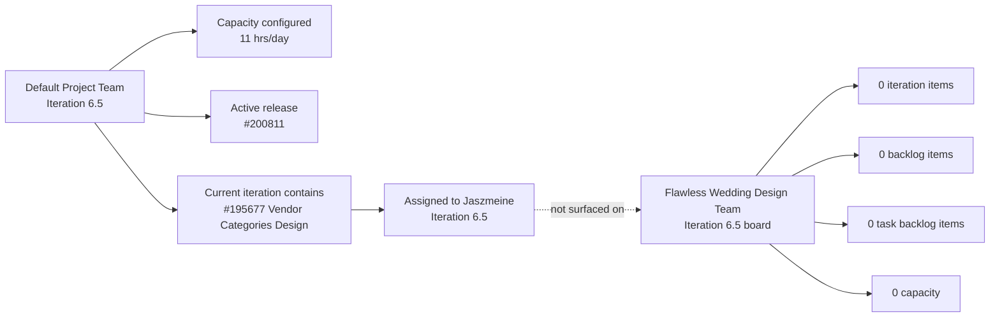
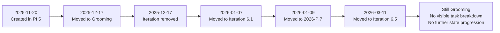

# SAFe Iteration Audit Report

**Project:** Flawless Wedding App
**Team:** Flawless Wedding Design Team
**Audit Workspace:** `ado_fl_ux`
**Iteration:** 6.5 (2026-PI6)
**Sprint Dates:** March 9, 2026 to March 22, 2026
**Audit Date:** March 11, 2026
**Data Snapshot:** Azure DevOps reads captured March 11, 2026
**Auditor:** Codex (AI SAFe consultant)

---

## 1. Executive Summary

This is the first local audit captured for `ado_fl_ux`. No prior report exists under `ado_fl_ux/audit/`, so trend analysis is based on current Azure DevOps state and work item revision history rather than prior audit baselines.

The central finding is a **team operating model breakdown**, not a project shutdown. The **Flawless Wedding Design Team** has a valid current iteration (`Iteration 6.5`), but the team shows **0 iteration items, 0 backlog items, 0 task backlog items, and 0 configured capacity**. In contrast, the **default project team** is actively executing Iteration 6.5 with configured capacity, an active release package, and multiple linked sprint items.

Most important: the one open design item found in the project, **#195677 "Vendor Categories Design"**, is already assigned to **Iteration 6.5** and to **Jaszmeine Abigaille Villanueva**, but it appears under the **default project team's current iteration scope**, not under the design team's board. Under SAFe, this makes the design team's sprint planning, commitment tracking, and predictability effectively invisible.

---

## 2. Iteration 6.5 Snapshot

| Metric | Flawless Wedding Design Team | Default Project Team | SAFe Interpretation |
|---|---:|---:|---|
| Current iteration configured | Yes | Yes | Both teams point to Iteration 6.5 |
| Iteration items visible | 0 | Non-zero | Design team board is disconnected from execution |
| Requirement backlog items | 0 | Active scope present | No visible design backlog for sprint planning |
| Task backlog items | 0 | Active task hierarchy present | No decomposed design execution on team board |
| Team capacity configured | 0 | 11 hrs/day | Design team cannot plan or forecast |
| Open design items found in project | 1 | 1 | Work exists, but not in the design team board flow |

### Default Team Capacity Evidence

| Person | Activity | Capacity / Day |
|---|---|---:|
| Luke Abram Colina | Development | 6 |
| Ike Yana | Development | 1 |
| Ressa Paracuelles | Testing | 3 |
| Luzmibel Paculanang | Testing | 1 |
| **Total** |  | **11** |

### UX Team Capacity Evidence

`No team capacity assigned to the team`

---

## 3. System View

**Interpretation:** design work is being tracked in the project, but not through the design team's own planning and execution view.

---

## 4. Key Work Item Analysis

### 4.1 Open UX Work

| ID | Title | Type | State | Assigned To | Iteration | Created | Last Changed |
|---|---|---|---|---|---|---|---|
| 195677 | Vendor Categories Design | Design | Grooming | Jaszmeine Abigaille Villanueva | Iteration 6.5 | Nov 20, 2025 | Mar 11, 2026 |

### 4.2 Revision History of #195677

### 4.3 Observations on #195677

- The item is **111 days old** as of March 11, 2026.
- It has remained in **Grooming** since **December 17, 2025**.
- Only **2 comments** exist on the item.
- The latest meaningful comment is from **January 9, 2026**: asking Jaszmeine to estimate the item and create tasks.
- No task decomposition was visible from the design team backlog tools.
- No Description or Acceptance Criteria values were returned in the work item field read.

**Assessment:** the item is active only in an administrative sense. The March 11 change appears to be an iteration reassignment, not material progress through design delivery.

---

## 5. Project Activity Contrast

The broader project is not idle:

- **#200811 "Iteration 6.5 Flawless Wedding Release Package"** is **Active** in Iteration 6.5.
- The default project team iteration scope contains multiple root items and child tasks.
- **#200875 "Flawless Wedding Web Application"** was created on **March 11, 2026** and is already in **Reviewing** for **2026-PI7**.
- Broad project search showed an active work inventory with substantial items in `Active`, `New`, `Ready`, and `Ready for Dev` states.

**Assessment:** this is not a project-wide lack of work. It is a **UX team planning, visibility, and board-governance problem**.

---

## 6. SAFe Compliance Findings

| # | Finding | Severity | SAFe Area |
|---|---|---|---|
| F1 | Design team has **no configured iteration capacity** for Iteration 6.5 | CRITICAL | Capacity Planning |
| F2 | Design team board shows **0 sprint items and 0 backlog items** in the active iteration | CRITICAL | Iteration Planning |
| F3 | Active design work exists, but it is surfaced under the **default project team** rather than the design team | HIGH | Team Topology / Board Governance |
| F4 | The only open design item, **#195677**, has remained in Grooming for nearly 3 months with no visible task decomposition | HIGH | Flow / Decomposition |
| F5 | UX work item changed iteration multiple times across PI 5, 6.1, PI 7, and 6.5 without advancing state | HIGH | Predictability / Flow Stability |
| F6 | #195677 returned with **no Description or Acceptance Criteria data** | MEDIUM | Definition of Ready |
| F7 | No prior local audit history exists for this workspace, limiting action tracking and inspect/adapt continuity | MEDIUM | Inspect and Adapt |

---

## 7. Positive Observations

| # | Observation |
|---|---|
| P1 | The project has an active current release package (#200811) |
| P2 | The default team has explicit capacity configured for Iteration 6.5 |
| P3 | A new PI 7 epic (#200875) was created on March 11, 2026, indicating forward planning exists |
| P4 | The open design item is at least assigned to a real owner and current iteration |

---

## 8. Risks

| Risk | Likelihood | Impact | Why |
|---|---|---|---|
| UX commitment remains invisible in Iteration 6.5 | Very High | High | Board has no visible work or capacity |
| Design work misses sprint expectations without detection | High | High | No team-level planning baseline exists |
| Design item aging continues without decomposition | High | Medium | #195677 is old and still in Grooming |
| Forecasting between UX and engineering becomes unreliable | High | High | Work is planned in one team view and owned by another |
| Retro and inspect/adapt actions cannot be traced | Medium | Medium | No prior audit trail in local workspace |

---

## 9. Recommendations

### 9.1 Immediate

| # | Action | Owner | Priority |
|---|---|---|---|
| R1 | Configure **Flawless Wedding Design Team** capacity for Iteration 6.5 | Karl Caumban | CRITICAL |
| R2 | Correct team settings so design-owned items appear in the design team's board and backlog | Karl Caumban / ADO Admin | CRITICAL |
| R3 | Confirm whether the design team should operate as a separate sprint team or be formally absorbed into the default team | Ramon / Karl | CRITICAL |
| R4 | Break down **#195677** into executable design tasks with estimates and owners | Jaszmeine / Karl | HIGH |

### 9.2 This Week

| # | Action | Owner | Priority |
|---|---|---|---|
| R5 | Add Description and Acceptance Criteria to #195677 if still blank | Jaszmeine / Karl | HIGH |
| R6 | Audit all Jaszmeine-owned work items and confirm correct team ownership, iteration, and board visibility | Karl | HIGH |
| R7 | Define a minimal sprint goal for UX if the separate team structure is retained | Ramon / Karl | HIGH |
| R8 | Establish a rule that no design item can enter a sprint without visible board placement and task-level decomposition | PMO / Karl | MEDIUM |

---

## 10. Conclusion

`ado_fl_ux` does not currently reflect a functioning SAFe iteration team. The evidence shows that **UX work exists**, but the **Flawless Wedding Design Team board is not being used as the system of record for that work**. Until capacity, backlog visibility, and ownership mapping are corrected, the team cannot produce reliable iteration commitments or measurable predictability.

The most pragmatic next step is to decide whether the Design Team is a real execution team in SAFe terms. If yes, configure it and run it properly. If no, stop splitting the board view and manage design work transparently within the default project team.
