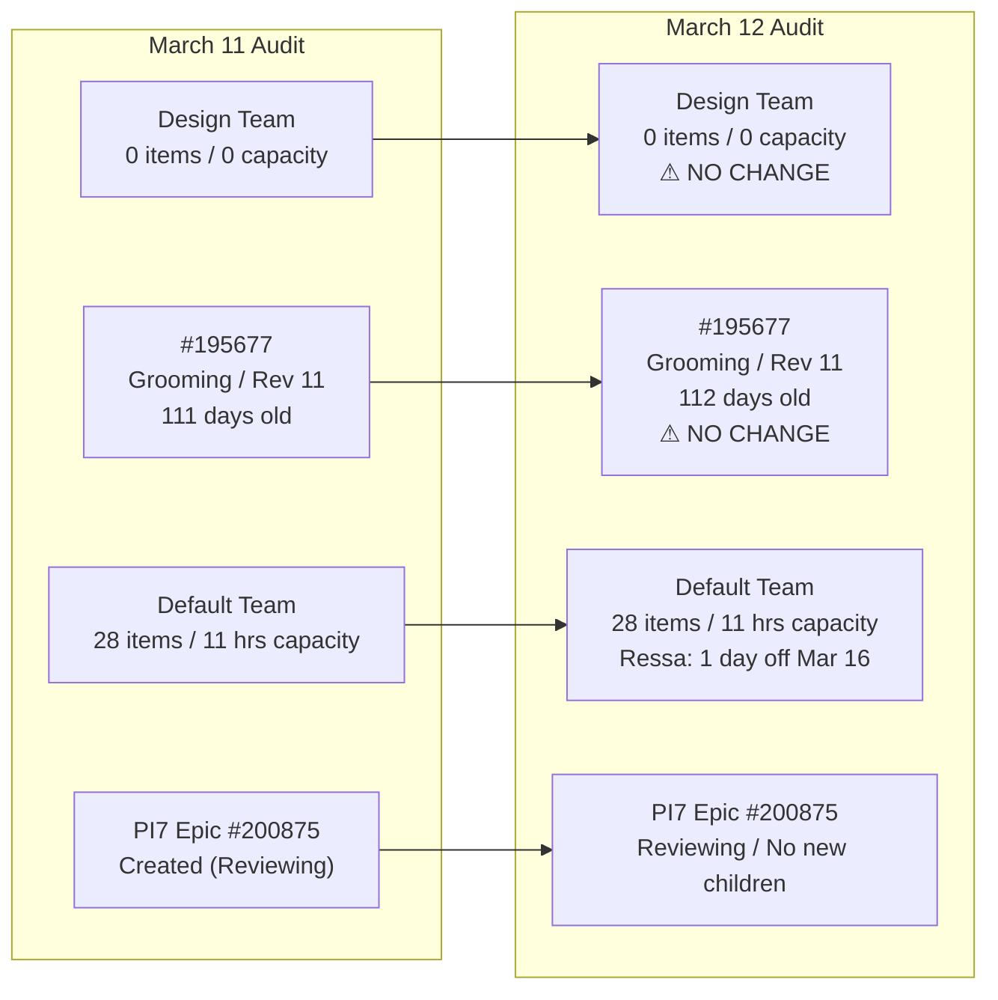
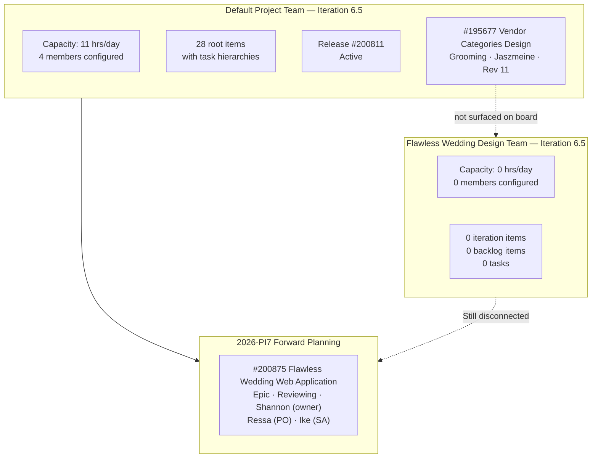
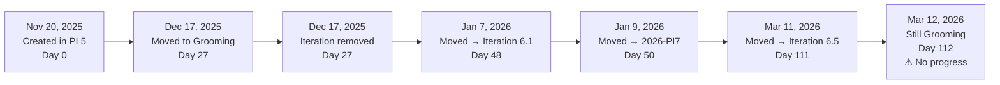
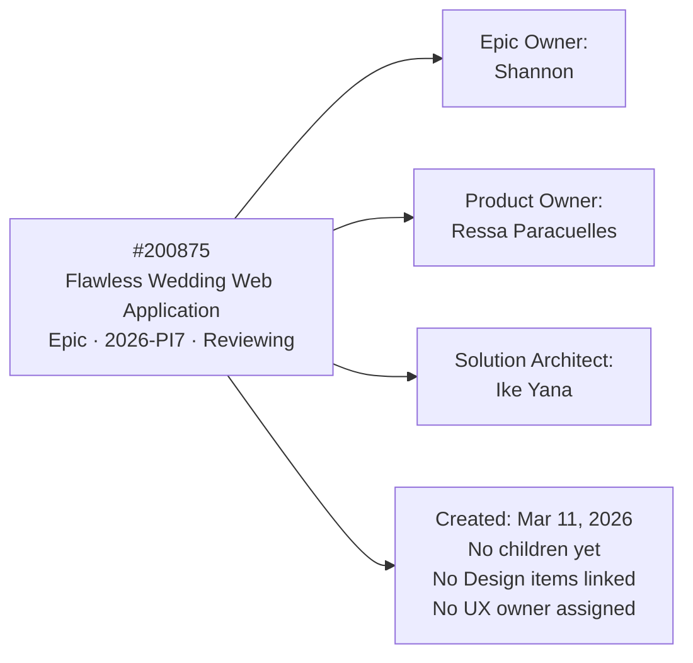
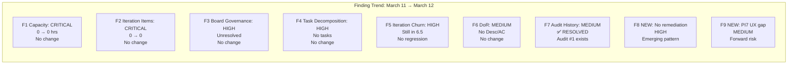

# SAFe Iteration Audit Report

**Project:** Flawless Wedding App
**Team:** Flawless Wedding Design Team
**Audit Workspace:** `ado_fl_ux`
**Iteration:** 6.5 (2026-PI6)
**Sprint Dates:** March 9, 2026 to March 22, 2026
**Audit Date:** March 12, 2026
**Data Snapshot:** Azure DevOps reads captured March 12, 2026
**Auditor:** Claude (AI SAFe Consultant)
**Prior Audit:** AUDIT_20260311_192325.md (March 11, 2026)

---

## 1. Executive Summary

This is the **second consecutive audit** of the `ado_fl_ux` workspace. Compared against the prior audit from March 11, 2026, the findings reveal **zero remediation progress** on all seven findings raised yesterday. Every critical and high-severity issue from the prior audit remains open and unchanged.

The **Flawless Wedding Design Team** continues to operate with 0 iteration items, 0 configured capacity, and no board visibility into active design work. The sole open design item, **#195677 "Vendor Categories Design"**, remains in the same Grooming state with the same 2 comments, the same revision number (Rev 11), and no task decomposition — now **112 days old**.

Meanwhile, the **default project team** is actively executing Iteration 6.5 with 28 root work items, task hierarchies, and 11 hrs/day configured capacity. The contrast between the two teams has not narrowed in 24 hours.

The critical pattern emerging across both audit cycles is a **structural governance gap that is not self-correcting** without deliberate action. The absence of response to prior-audit recommendations within 24 hours is noted, though it may reflect normal lag time; the recommendations are carried forward and escalated in severity here.

---

## 2. Audit-over-Audit Change Summary

| Metric | Mar 11 | Mar 12 | Delta |
|---|---|---|---|
| Design team iteration items | 0 | 0 | ⚠ None |
| Design team capacity (hrs/day) | 0 | 0 | ⚠ None |
| #195677 state | Grooming | Grooming | ⚠ None |
| #195677 revision | 11 | 11 | ⚠ None |
| #195677 comment count | 2 | 2 | ⚠ None |
| #195677 age (days) | 111 | 112 | +1 day |
| Open design items in project | 1 | 1 | ⚠ None |
| Default team capacity (hrs/day) | 11 | 11 | Stable |
| Default team iteration root items | 28 | 28 | Stable |
| Open findings from prior audit | 7 | 7 | ⚠ 0 resolved |
| Open recommendations from prior audit | 8 | 8 | ⚠ 0 actioned |

---

## 3. Iteration 6.5 Snapshot (March 12, 2026)

| Metric | Flawless Wedding Design Team | Default Project Team |
|---|---:|---:|
| Iteration configured | Yes | Yes |
| Sprint items visible | 0 | 28 root items |
| Task hierarchy present | No | Yes |
| Capacity configured (hrs/day) | 0 | 11 |
| Days off tracked | N/A | 1 (Ressa, Mar 16) |
| Open design items in project | 1 | 1 (managed here) |

### Default Team Capacity (Iteration 6.5)

| Person | Activity | Capacity / Day | Days Off |
|---|---|---:|---|
| Luke Abram Colina | Development | 6 | None |
| Ike Yana | Development | 1 | None |
| Ressa Paracuelles | Testing | 3 | Mar 16 |
| Luzmibel Paculanang | Testing | 1 | None |
| **Total** | | **11** | **1** |

### Design Team Capacity

`No team capacity assigned to the team (unchanged from prior audit)`

---

## 4. System View

---

## 5. Design Work Item Analysis

### 5.1 Open Design Items in Project

| ID | Title | State | Assigned To | Iteration | Age (Days) | Rev | Comments | DoR |
|---|---|---|---|---|---|---|---|---|
| 195677 | Vendor Categories Design | Grooming | Jaszmeine Villanueva | Iteration 6.5 | **112** | 11 | 2 | ❌ No Desc / No AC |

### 5.2 Closed Design Items (Historical Context)

| ID | Title | State | Closed Date |
|---|---|---|---|
| 196986 | New Design Flow for Vendor Account Creation Flow | Closed | Mar 2, 2026 |
| 193485 | Payment Transaction History for Admin Overview | Closed | Dec 17, 2025 |
| 193483 | Payment History & Tracking for Bride Overview | Closed | Dec 5, 2025 |

> **Pattern:** The team has successfully closed design items in the past. The persistence of #195677 in Grooming is an anomaly relative to the team's completion history, not a systemic inability to deliver design work.

### 5.3 Age Progression of #195677

### 5.4 Comment History of #195677

| # | Date | Author | Content |
|---|---|---|---|
| 1 | Nov 20, 2025 | Carol Cuison | Jaszmeine — categories design, connect with Ressa and Ike for details. CC Karl. |
| 2 | Jan 9, 2026 | Karl Caumban | @Jaszmeine please help estimate this and create tasks |

> **Observation:** The January 9 comment requesting estimation and task creation has received **no visible response** in 62 days. There is no reply, no task linked, no state change, and no Description or Acceptance Criteria added.

---

## 6. Default Team Iteration 6.5 Scope

The default project team's iteration contains a mature, structured backlog with hierarchy. This confirms the project is actively delivering.

```mermaid
flowchart LR
    subgraph Iteration_6_5["Default Team — Iteration 6.5 (Root Items)"]
        G1["#200630"]
        G2["#200781"]
        G3["#200631"]
        G4["#188867"]
        G5["#200196"]
        G6["#200840"]
        G7["#200193"]
        G8["#200197"]
        G9["#200198"]
        G10["#200847"]
        G11["#198289"]
        G12["#200190"]
        G13["#200876"]
        G14["#195677 Design ⚠"]
        G15["#200864"]
        G16["#198298"]
        G17["#199682"]
        G18["#200506"]
        G19["#200542"]
        G20["#197520"]
        G21["#197536"]
        G22["#197358"]
        G23["#198344"]
        G24["#199087"]
        G25["#198346"]
        G26["#198347"]
        G27["#200796"]
        G28["#200791"]
    end
```

> **Note:** #195677 (highlighted ⚠) is present in the default team's iteration scope but carries no child tasks and is not surfaced on the design team's board.

---

## 7. PI7 Forward Planning

> **Gap:** The PI7 epic has defined ownership for Epic, PO, and SA roles, but no UX/Design owner is assigned. Given the ongoing board governance issue with the Design Team, UX representation in PI7 planning is at risk.

---

## 8. SAFe Compliance Findings

### 8.1 Findings Carried from Prior Audit (All Still Open)

| # | Finding | Severity | Status | SAFe Area |
|---|---|---|---|---|
| F1 | Design team has no configured iteration capacity for Iteration 6.5 | **CRITICAL** | 🔴 Open | Capacity Planning |
| F2 | Design team board shows 0 sprint items and 0 backlog items | **CRITICAL** | 🔴 Open | Iteration Planning |
| F3 | Active design work is surfaced under the default project team, not the design team | **HIGH** | 🔴 Open | Team Topology |
| F4 | #195677 has remained in Grooming for 3+ months with no task decomposition | **HIGH** | 🔴 Open | Flow / Decomposition |
| F5 | #195677 changed iteration 5 times without advancing state | **HIGH** | 🔴 Open | Predictability |
| F6 | #195677 has no Description or Acceptance Criteria | **MEDIUM** | 🔴 Open | Definition of Ready |
| F7 | No prior audit history existed before March 11 audit | **MEDIUM** | ✅ Resolved | Inspect and Adapt |

### 8.2 New Finding (March 12)

| # | Finding | Severity | SAFe Area |
|---|---|---|---|
| F8 | Zero remediation action taken on F1–F6 within 24 hours of first audit | **HIGH** | Inspect and Adapt |
| F9 | PI7 Epic #200875 has no UX/Design owner assigned despite active design backlog gap | **MEDIUM** | PI Planning / ART Readiness |

---

## 9. Trend Analysis (Audit 1 → Audit 2)

### Patterns Observed

- **Structural persistence:** The design team board governance problem is not a one-day anomaly. Two consecutive audits confirm the same conditions — this is a structural issue.
- **Item aging acceleration risk:** #195677 adds 1 day of age per audit cycle with no state progression. At current velocity, it will exit Iteration 6.5 on March 22 without closure for the fifth time.
- **Forward planning without UX input:** PI7 epic is being built without a UX owner or linked design items. The same pattern that created the current design backlog gap may be propagating into the next PI.
- **Healthy default team execution:** The default team shows consistent capacity, structured backlog, and a stable active release — the project infrastructure is sound. The issue is narrowly scoped to UX team governance.

---

## 10. Risks

| Risk | Likelihood | Impact | Trend |
|---|---|---|---|
| #195677 exits Iteration 6.5 without closure (5th reassignment) | **Very High** | High | ↑ Worsening — 10 days remain |
| Design team board remains unused through end of Iteration 6.5 | **Very High** | High | ↑ No corrective action yet |
| UX commitment invisible to stakeholders for entire Iteration 6.5 | **Very High** | High | ↑ No change |
| PI7 planning proceeds without UX representation | **High** | High | 🆕 New risk identified |
| Jaszmeine's workload/availability not tracked anywhere | **High** | Medium | ↑ No tasks, no visibility |
| Design item aging recurs in PI7 due to same root cause | **Medium** | High | 🆕 Pattern risk |

---

## 11. Recommendations

### 11.1 Carried Forward (Unactioned — Urgency Elevated)

| # | Action | Owner | Priority | Status |
|---|---|---|---|---|
| R1 | Configure Flawless Wedding Design Team capacity for Iteration 6.5 | Karl Caumban | **CRITICAL** | 🔴 Not done |
| R2 | Correct team settings so design-owned items appear in design team board | Karl Caumban / ADO Admin | **CRITICAL** | 🔴 Not done |
| R3 | Decide: design team as separate sprint team, or absorbed into default team | Ramon / Karl | **CRITICAL** | 🔴 Not done |
| R4 | Break down #195677 into executable design tasks with estimates | Jaszmeine / Karl | **HIGH** | 🔴 Not done |
| R5 | Add Description and Acceptance Criteria to #195677 | Jaszmeine / Karl | **HIGH** | 🔴 Not done |
| R6 | Audit all Jaszmeine-owned items for correct team, iteration, and board visibility | Karl | **HIGH** | 🔴 Not done |
| R7 | Define a sprint goal for UX in Iteration 6.5 | Ramon / Karl | **HIGH** | 🔴 Not done |
| R8 | Establish: no design item enters a sprint without board placement and task decomposition | PMO / Karl | **MEDIUM** | 🔴 Not done |

### 11.2 New Recommendations (March 12)

| # | Action | Owner | Priority |
|---|---|---|---|
| R9 | Assign a UX/Design owner to PI7 Epic #200875 before PI7 planning begins | Karl / Ramon | **HIGH** |
| R10 | Set a firm deadline for R1–R3 (design team structure decision): before Iteration 6.5 ends (March 22) | Ramon | **CRITICAL** |

---

## 12. Conclusion

Two consecutive audits have now confirmed the same root condition: **the Flawless Wedding Design Team board is structurally disconnected from the execution work Jaszmeine is assigned to deliver**. No corrective action was observable in the 24-hour window between audits.

The most time-sensitive risk is #195677 exiting Iteration 6.5 without closure — the sprint ends March 22, leaving 10 calendar days. Without immediate task decomposition, capacity assignment, and a sprint commitment, this item will be reassigned for the fifth time and the pattern will repeat.

**The single highest-impact action for this week is R3:** decide whether the Flawless Wedding Design Team is a real execution team. Everything else depends on that answer.
