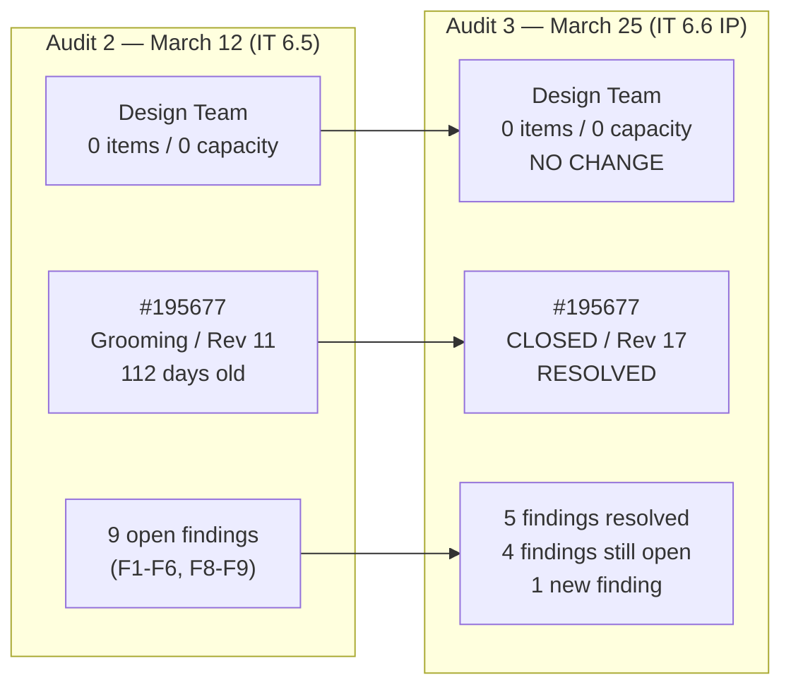
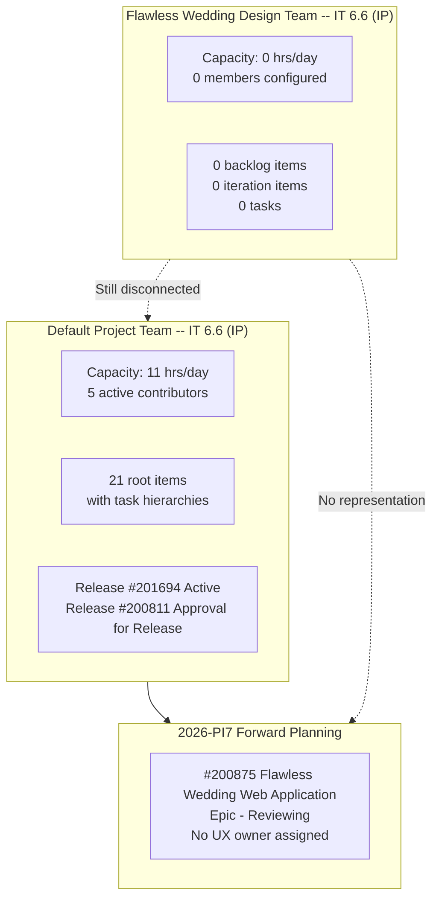
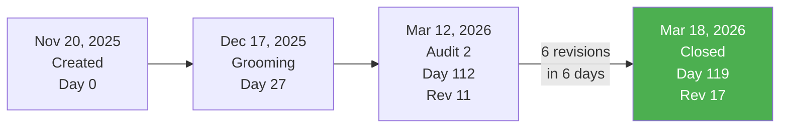
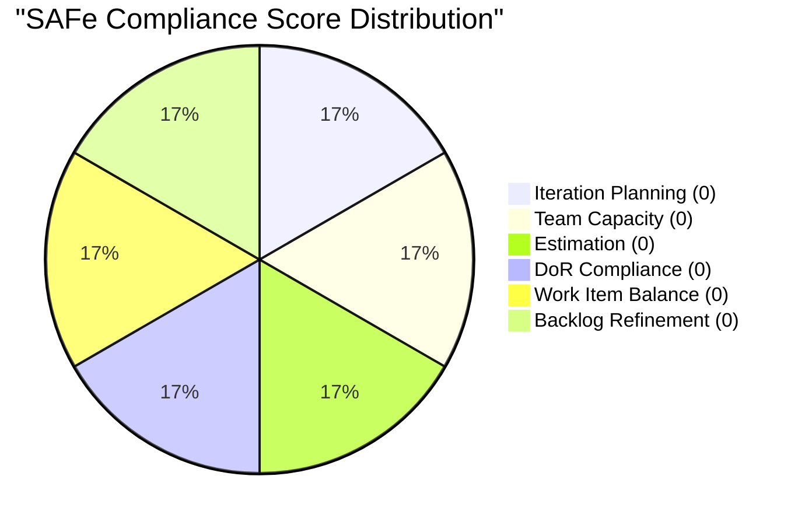
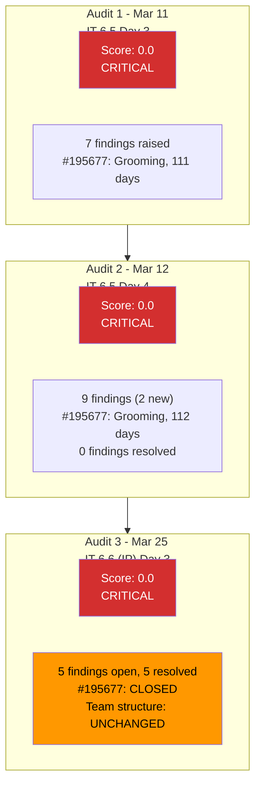

# SAFe Iteration Audit Report

**Project:** Flawless Wedding App
**Team:** Flawless Wedding Design Team
**Team ID:** `a3734087-0139-4ba5-97ab-ced6f4f1edba`
**Audit Workspace:** `ado_fl_ux`
**Iteration:** 6.6 (IP) (2026-PI6)
**Sprint Dates:** March 23, 2026 to April 5, 2026
**Audit Date:** March 25, 2026
**Data Snapshot:** Azure DevOps reads captured March 25, 2026
**Auditor:** Claude (AI SAFe Consultant)
**Prior Audit:** AUDIT_20260312_171908.md (March 12, 2026)

**ADO Org:** `jairo` | **ADO Project:** `Flawless Wedding App` | **Project ID:** `92b967dc-5ec7-4874-b8f5-e43b00d88339`
**Board URL:** `https://dev.azure.com/jairo/Flawless%20Wedding%20App/_boards/board/t/Flawless%20Wedding%20Design%20Team/Stories%20and%20Deliverables`
**Backlog:** `Microsoft.RequirementCategory` (Stories and Deliverables)
**Scope:** Only the Flawless Wedding Design Team board and backlog were analyzed. No other teams, boards, or repositories were inspected.

---

## 1. Audit Metadata

| Field | Value |
|-------|-------|
| Audit ID | AUDIT_20260325_024633 |
| Audit Sequence | 3 (third consecutive audit of this workspace) |
| Current Iteration | Iteration 6.6 (IP) |
| Iteration Path | `Flawless Wedding App\2026-PI6\Iteration 6.6 (IP)` |
| Iteration Start | 2026-03-23 |
| Iteration Finish | 2026-04-05 |
| Sprint Day | Day 3 of 14 |
| Data Source | Azure DevOps REST API (team iterations, backlog, work items, capacity) |
| Prior Audits | AUDIT_20260311_192325.md (Iteration 6.5), AUDIT_20260312_171908.md (Iteration 6.5) |

---

## 2. Executive Summary

This is the **third audit** of the `ado_fl_ux` workspace and the **first audit of Iteration 6.6 (IP)**. The PI 6 Innovation and Planning (IP) iteration began March 23, 2026. The prior two audits (March 11 and March 12, both during Iteration 6.5) identified a structural governance failure: the Flawless Wedding Design Team board had zero iteration items, zero backlog items, and zero configured capacity.

**The situation has partially improved but remains fundamentally unchanged:**

- **Positive:** Work item #195677 ("Vendor Categories Design"), the 112-day-old stalled design item flagged as CRITICAL in prior audits, has been **closed** as of March 18, 2026 (Rev 17). This resolves findings F4, F5, and F6 from the prior audit.
- **Persistent:** The Flawless Wedding Design Team board still shows **0 backlog items**, **0 iteration items**, and **0 configured capacity** for Iteration 6.6 (IP). The team remains structurally inert.
- **Context:** The default project team is actively executing Iteration 6.6 (IP) with 21 root work items, task hierarchies, and 11 hrs/day capacity. All project delivery flows through the default team.

The core finding from all three audits remains: **the Flawless Wedding Design Team exists as an ADO entity but does not function as an execution team**. The recommendation from prior audit R3 (decide whether the design team is a real team or should be absorbed) has still not been actioned.

**Overall SAFe Compliance Score: 0.0 / 100 (Critical)**

---

## 3. Previous Audit Delta

### Finding Disposition from Prior Audit

| Prior Finding | Severity | Status | Evidence |
|---|---|---|---|
| F1: Design team has no configured iteration capacity | CRITICAL | OPEN | Capacity API returns "No team capacity assigned" for Iteration 6.6 (IP) |
| F2: Design team board shows 0 sprint and 0 backlog items | CRITICAL | OPEN | Backlog API returns 0 items; iteration work items API returns 0 relations |
| F3: Active design work surfaces under default team, not design team | HIGH | OPEN | Default team has 21 root items in 6.6 (IP); design team has 0 |
| F4: #195677 in Grooming for 3+ months with no task decomposition | HIGH | RESOLVED | #195677 closed on March 18, 2026 (Rev 17) |
| F5: #195677 changed iteration 5 times without advancing state | HIGH | RESOLVED | Item closed during Iteration 6.5, no further iteration reassignment |
| F6: #195677 has no Description or AC | MEDIUM | RESOLVED | Item closed; moot |
| F7: No prior audit history | MEDIUM | RESOLVED (Audit 1) | Three audits now exist |
| F8: Zero remediation on F1-F6 within 24 hours | HIGH | PARTIALLY RESOLVED | F4-F6 resolved via closure of #195677; F1-F3 still unactioned |
| F9: PI7 Epic #200875 has no UX/Design owner | MEDIUM | OPEN | Epic #200875 still in Reviewing state, still no UX owner assigned |

### Recommendation Disposition from Prior Audit

| Rec | Action | Status |
|---|---|---|
| R1 | Configure design team capacity | NOT DONE |
| R2 | Correct team settings for board visibility | NOT DONE |
| R3 | Decide: design team as separate team or absorbed | NOT DONE |
| R4 | Break down #195677 into tasks | MOOT (#195677 closed) |
| R5 | Add Description/AC to #195677 | MOOT (#195677 closed) |
| R6 | Audit all Jaszmeine-owned items | NOT VERIFIED |
| R7 | Define sprint goal for UX in IT 6.5 | EXPIRED (IT 6.5 ended) |
| R8 | No design item enters sprint without board placement | NOT DONE |
| R9 | Assign UX/Design owner to PI7 Epic #200875 | NOT DONE |
| R10 | Deadline for R1-R3 before IT 6.5 ends | MISSED (IT 6.5 ended March 22) |

---

## 4. Current Iteration Snapshot

### Flawless Wedding Design Team -- Iteration 6.6 (IP)

| Metric | Value |
|---|---|
| Iteration | 6.6 (IP) |
| Iteration Path | `Flawless Wedding App\2026-PI6\Iteration 6.6 (IP)` |
| Sprint Start | 2026-03-23 |
| Sprint Finish | 2026-04-05 |
| Sprint Day | 3 of 14 |
| Backlog Items (Stories and Deliverables) | **0** |
| Iteration Root Items | **0** |
| Tasks | **0** |
| Configured Capacity | **0 hrs/day** |
| Team Members with Capacity | **0** |

### Default Project Team -- Iteration 6.6 (IP) (Cross-Reference Only)

| Metric | Value |
|---|---|
| Root Items | 21 |
| Total Items (including tasks) | 50+ |
| Configured Capacity | 11 hrs/day |
| Active Contributors | Luke Abram Colina, Ressa Paracuelles, Ike Yana, Carol Cuison, Luzmibel Paculanang |

---

## 5. Work Item Analysis

### 5.1 Design Team Backlog

The Flawless Wedding Design Team's `Stories and Deliverables` backlog (Microsoft.RequirementCategory) returned **zero items**. There are no visible root backlog items, no current iteration items, and no items of any state or type.

### 5.2 Design-Type Work Items in Project

A project-wide search for active Design-type work items returned **zero results**. The only known Design item, #195677 ("Vendor Categories Design"), was closed on March 18, 2026.

| ID | Title | Type | State | Iteration | Changed Date | Story Points | Rev |
|---|---|---|---|---|---|---|---|
| 195677 | Vendor Categories Design | Design | **Closed** | IT 6.5 | 2026-03-18 | 1 | 17 |

### 5.3 Closure of #195677

Work item #195677, which was the central concern of both prior audits, advanced from Grooming (Rev 11) to Closed (Rev 17) between March 12 and March 18, 2026. This represents 6 revisions in 6 days after 112 days of stasis. The item was closed within Iteration 6.5 (which ended March 22), confirming it did not require a sixth iteration reassignment.

### 5.4 Default Team Iteration 6.6 (IP) Root Items (Context Only)

The following root items are in the default team's Iteration 6.6 (IP). None belong to the design team.

| ID | Type | Title | State | Assigned To | SP |
|---|---|---|---|---|---|
| 199211 | User Story | Admin Assigns Island to Vendor | Active | Luke Abram Colina | 1 |
| 199213 | User Story | Bride Views Islands as Main Entry Point | Active | Luke Abram Colina | 1 |
| 199214 | User Story | Bride Views Subcategories Within Selected Island | Active | Luke Abram Colina | 1 |
| 199215 | User Story | Bride Views Vendors by Island and Subcategory | Active | Luke Abram Colina | 2 |
| 200256 | User Story | Manage Archived Users (Delete and Restore) | Ready for Dev | Luke Abram Colina | 2 |
| 200259 | User Story | Add existing contract | Estimation | Luke Abram Colina | 1 |
| 201058 | User Story | Change Shannon Hannold to Shannon Nofo | Passed UAT | Luke Abram Colina | 1 |
| 191038 | Defect | New vendor category visible before registration | Estimation | Luke Abram Colina | 1 |
| 201124 | Defect | Vendor with multiple categories cannot log in | Back to Dev | Luke Abram Colina | -- |
| 201167 | Defect | Invoice Preview does not reset after clearing coupon | Passed UAT | Luke Abram Colina | 1 |
| 196898 | Spike | Tipping Notifications for Investigation | Active | Ike Yana | 0 |
| 201568 | Spike | Meetings, Collaboration & Others IT 6.6 | Active | (unassigned) | -- |
| 201569 | Spike | Follow Up Netlify Access and Github Transfer | New | Carol Cuison | -- |
| 201634 | Spike | Collaborations, Reports & Others | Active | Ressa Paracuelles | -- |
| 188867 | Defect | Client name not displayed in contract | Passed UAT | Luke Abram Colina | 1 |
| 198289 | Defect | Deleted vendor account remains logged in | Passed UAT | Luke Abram Colina | 1 |
| 200190 | Defect | Deleted client account cannot be reused | Passed UAT | Luke Abram Colina | 2 |
| 200198 | User Story | Forwarding Contract Per Person | Passed UAT | Luke Abram Colina | 3 |
| 200840 | User Story | Add Content Creators Vendor Category | Passed UAT | Luke Abram Colina | 1 |
| 200847 | User Story | Add "Apply Coupon To" Field | Passed UAT | Luke Abram Colina | 2 |
| 198298 | Spike | Revisit the issue about loading images | Closed | Ike Yana | 1 |

---

## 6. SAFe Compliance Scorecard

### Core Definitions Applied

| Definition | Value | Evidence |
|---|---|---|
| `visible_root_backlog_items` | **0** | Backlog API returned 0 items for design team |
| `current_iteration_root_items` | **0** | Iteration work items API returned 0 relations for design team |
| `contributors_with_current_work` | **0** | No items, therefore no assignees |
| `contributors_with_capacity` | **0** | Capacity API: "No team capacity assigned" |
| `point_eligible_current_items` | **0** | No items in iteration |
| `estimated_current_items` | **0** | No items in iteration |
| `dor_compliant_current_items` | **0** | No items in iteration |
| `fresh_visible_root_items` | **0** | No items on backlog |
| `stale_90_visible_root_items` | **0** | No items on backlog |
| `stale_180_visible_root_items` | **0** | No items on backlog |
| `untouched_current_items` | **0** | No items in iteration |
| `dominant_type_share` | **N/A** | No items in iteration |
| `spike_share` | **N/A** | No items in iteration |

### Scorecard

| # | Dimension | Score | Formula / Logic | Evidence | Notes |
|---|---|---|---|---|---|
| 1 | Iteration Planning | **0.0** | visible_root_backlog_items = 0, score = 0 | Backlog API: 0 items | No backlog exists for this team |
| 2 | Team Capacity | **0.0** | contributors_with_current_work = 0, score = 0 | Capacity API: "No team capacity assigned" | No capacity configured for any member |
| 3 | Estimation | **0.0** | point_eligible_current_items = 0, score = 0 | No items in iteration | Nothing to estimate |
| 4 | DoR Compliance | **0.0** | current_iteration_root_items = 0, score = 0 | No items in iteration | No items to evaluate |
| 5 | Work Item Balance | **0.0** | current_iteration_root_items = 0, score = 0 | No items in iteration | No type distribution to assess |
| 6 | Backlog Refinement | **0.0** | visible_root_backlog_items = 0, score = 0 | Backlog API: 0 items | No backlog to refine |
| | **Overall Score** | **0.0** | avg(0, 0, 0, 0, 0, 0) = 0.0 | | **CRITICAL** |

### Risk Band: CRITICAL (Score < 40)

---

## 7. Dimension Findings

### 7.1 Iteration Planning (0.0)

The design team has no items on its `Stories and Deliverables` backlog. The backlog API returns an empty `workItems` array. Without backlog items, there is nothing to plan into the iteration.

**Root cause:** The design team has never had items on its own backlog in any of the three audits. All design-related work (#195677) was historically placed under the default project team's backlog and iteration.

### 7.2 Team Capacity (0.0)

The team capacity API explicitly returns "No team capacity assigned to the team." No team member has hours or activities configured for Iteration 6.6 (IP).

**Root cause:** No team member has ever been assigned capacity in the design team across three consecutive audits spanning two iterations.

### 7.3 Estimation (0.0)

With zero items in the iteration, there are no point-eligible items to estimate.

### 7.4 DoR Compliance (0.0)

With zero items in the iteration, there are no items to evaluate against the Definition of Ready (Description >= 30 chars, Acceptance Criteria >= 20 chars).

### 7.5 Work Item Balance (0.0)

With zero items in the iteration, there is no type distribution to assess.

### 7.6 Backlog Refinement (0.0)

With zero visible root backlog items, there is no backlog to evaluate for freshness or staleness.

---

## 8. Risks and Bottlenecks

| # | Risk | Likelihood | Impact | Source | Trend |
|---|---|---|---|---|---|
| R1 | Design team board remains unused through end of PI 6 | **Very High** | High | ADO | Worsening (3rd consecutive audit) |
| R2 | PI7 planning proceeds without UX representation | **High** | High | ADO | No change from Audit 2 |
| R3 | Design team exists as ADO entity but creates governance confusion | **High** | Medium | ADO | Persistent |
| R4 | No design work is traceable to the design team for PI 6 | **Very High** | Medium | ADO | Persistent |
| R5 | If new design items are created, they will again land on the default team | **High** | Medium | ADO | Pattern-based |

### Bottleneck Analysis

The single bottleneck across all three audits is **team topology ambiguity**: the Flawless Wedding Design Team exists in ADO with iteration subscriptions from PI 4 through PI 6, but has never held backlog items, capacity, or iteration work in any observed audit window. All actual design work flows through the default project team.

This is not a productivity bottleneck in the traditional sense (there is no work being blocked). It is a **governance bottleneck** that prevents accurate reporting, capacity planning, and PI-level visibility for UX/design work.

---

## 9. Prioritized Recommendations

### 9.1 Carried Forward (Still Unactioned)

| # | Action | Owner | Priority | First Raised | Audits Open |
|---|---|---|---|---|---|
| R1 | **Decide: Design team as separate execution team, or absorbed into default team.** This is the prerequisite for all other actions. If absorbed, deactivate the team in ADO. If separate, begin populating backlog and capacity immediately. | Ramon / Karl | **CRITICAL** | Audit 1 (Mar 11) | 3 |
| R2 | If keeping the design team: configure capacity for Iteration 6.6 (IP) or the next iteration | Karl | CRITICAL | Audit 1 (Mar 11) | 3 |
| R3 | If keeping the design team: correct team area path/settings so design-owned items appear on the design board | Karl / ADO Admin | CRITICAL | Audit 1 (Mar 11) | 3 |
| R6 | Audit all Jaszmeine-owned items for correct team, iteration, and board visibility | Karl | HIGH | Audit 2 (Mar 12) | 2 |
| R8 | Establish: no design item enters a sprint without board placement and task decomposition | PMO / Karl | MEDIUM | Audit 2 (Mar 12) | 2 |
| R9 | Assign a UX/Design owner to PI7 Epic #200875 before PI7 planning begins | Karl / Ramon | HIGH | Audit 2 (Mar 12) | 2 |

### 9.2 New Recommendations

| # | Action | Owner | Priority | Rationale |
|---|---|---|---|---|
| R11 | **Set a hard deadline**: R1 (team decision) must be resolved before PI 6 ends. The IP iteration (6.6) is the natural window for this kind of structural decision. If not decided by April 5, escalate to organization admin. | Ramon | **CRITICAL** | Three audits have now flagged the same structural issue. The IP iteration is explicitly designed for process improvement. |
| R12 | If the design team is being deactivated: remove it from the iteration subscription list to prevent future confusion in audit and reporting. | Karl / ADO Admin | MEDIUM | Leaving an inactive team with iteration subscriptions creates false signals in ADO reporting. |
| R13 | Document the closure of #195677 as a positive outcome in the team retrospective. Understand what unblocked it after 112 days of stasis. | Karl / Jaszmeine | MEDIUM | Learning from successful resolution is as important as diagnosing failures. |

---

## 10. Evidence Gaps and Limitations

| Gap | Impact | Mitigation |
|---|---|---|
| No GitHub repositories are scoped for the design team in CLAUDE.md | Cannot assess delivery evidence or code traceability | Report is ADO-only; this is appropriate for a design team |
| Design team has no backlog items, so all six scoring dimensions default to 0 | Score reflects team structure, not individual contributor performance | Default team context provided for cross-reference |
| Cannot determine whether Jaszmeine is actively contributing under the default team | May understate design contribution to the project | Would require expanding audit scope to default team (out of scope) |
| The closure path of #195677 (Rev 11 to Rev 17) was not inspected revision-by-revision | Cannot confirm whether DoR was met before closure | Item is closed; no actionable finding |
| PI7 Epic #200875 ownership details beyond what was fetched were not inspected | May miss recent changes to epic team assignments | Epic last changed March 11; unlikely to have changed since |

---

## Appendix: Audit Trend (3 Audits)

| Metric | Audit 1 (Mar 11) | Audit 2 (Mar 12) | Audit 3 (Mar 25) | Trend |
|---|---|---|---|---|
| Overall Score | 0.0 | 0.0 | 0.0 | Flat (structural) |
| Design team backlog items | 0 | 0 | 0 | No change |
| Design team capacity | 0 | 0 | 0 | No change |
| Design team iteration items | 0 | 0 | 0 | No change |
| #195677 state | Grooming | Grooming | **Closed** | Resolved |
| Open findings | 7 | 9 | 5 | Improving (closures) |
| Unactioned critical recs | 3 | 3 | 3 | No change |
| Iterations audited | 6.5 | 6.5 | 6.6 (IP) | New iteration |

---

*End of audit report.*
